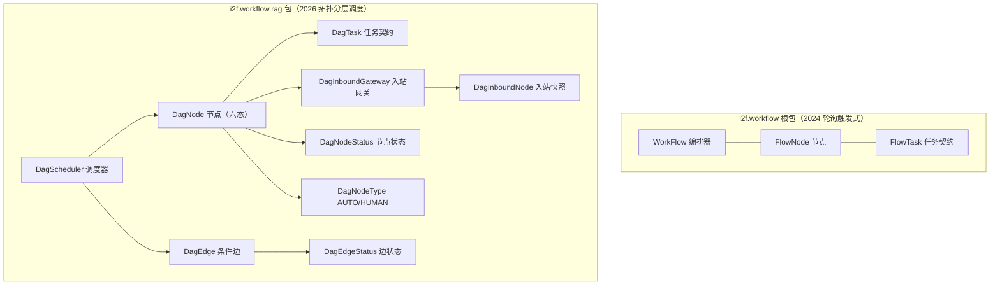

# i2f-workflow

> **「任务依赖编排 + DAG 并发调度」双引擎流程编排模块——两代独立实现的进程内调度器**：全模块 **17 个源文件、994 行、2 包**（根包 `i2f.workflow` 3 文件 323 行 + `rag` 子包 `i2f.workflow.rag` 11 文件 570 行 + `src/test` 2 个 main() 演示类 68 行 + pom 33 行，无资源文件）：**旧引擎 `WorkFlow`（2024/3）**——流式声明节点图（`add(id,name,task,prevIds)` + `done()` 定型），轮询监控线程按「前驱全部完成」触发节点（`FlowTask.trigger`），默认 `ForkJoinPool(8)` 并发、`CountDownLatch` 完成通知、`activeIds` 活跃子集重跑、可插拔 `exceptionHandler`；**新引擎 `rag.DagScheduler`（2026/4）**——Kahn 拓扑分层调度（层内并发 / 层间等待），`DagNode` 六态状态机（PENDING/WAITING/CONTINUE/SUCCESS/FAILURE/SKIP）、`DagEdge` **条件边**（`Predicate` 判定前驱 result，不满足即 SKIP）、可插拔**入站网关**（`DagInboundGateways.allSuccess` 默认 / `anySuccess` / `leastSuccessCount(n)`）、`DagNodeType.HUMAN` **人工节点断点暂停 / 恢复**（WAITING → 外部置 CONTINUE/SUCCESS/FAILURE 后再次 run()）。全模块**零三方运行期依赖**（仅编译期 lombok `provided`，纯 JDK 实现）。
>
> **消费现状（零 POM 依赖、零下游源码消费、纯「已发布未落地」模块）**：全仓三路 PowerShell 扫描（POM / 源码 / 类名，均以 `IVerifyCodeGenerator` 阳性对照验证通道有效）**除自身外零引用**——`i2f-workflow` 仅见于三处登记：聚合 `i2f-jdk-all/pom.xml:611-614`、根 POM `pom.xml:864-868`（版本管理）、模块清单 `i2f-jdk/pom.xml:166`（位于 i2f-verifycode 与 i2f-xml 之间）；wiki 侧零引用（对比 verifycode 有 enums/graphics-2d 旁证）。`src/test` 仅 2 个 main() 演示类（无 JUnit）；发布四 jar（`bash/backup|deploy × jdk8|jdk17` 均含 `i2f-workflow-1.0-jdk8.jar` / `-jdk17.jar`）。
>
> ⚠ **主要风险**：**两代引擎各有确定性功能缺陷**——旧引擎 `WorkFlow`：**默认异常处理器下失败节点的「有下级后代」被移出等待表但 latch 计数不减 → `await()` 永久挂起**（`WorkFlow.java:149/175-177/188` 三处联查：计数按初始全量、后代移除后永不提交任务、countDown 仅在任务 finally）；`activeIds` 活跃子集模式**叶子节点被遗漏 + 两处 NPE**（`:58-68` / `:143-145` / `:183`）；**环依赖零检测**（done() 不检测环 :93-97；环上 findChildrenIds 递归无 visited → StackOverflowError :58-68）；waitList 并发修改 CME 风险（`:156` 无锁遍历 vs `:174-179` 持锁移除）。新引擎 `DagScheduler`：**条件边的 SKIP 与默认网关冲突**（`allSuccess` 把 SKIP 归为 FAILURE :20-21 → run() 抛 `IllegalStateException` :80-81，「跳过分支」在默认配置下直接令调度崩溃）；任务失败同样**硬传播整体抛出**；**重复 run() 时 WAITING 节点被 `of(WAITING)=SUCCESS` 放行下游**（`DagEdgeStatus.java:27-29`）绕过人工等待语义；拓扑排序 O(V²) + 幽灵 fromId 误报「环」；`latch.await()` 无超时。详见「模块瑕疵或错误」。

## 模块路径

- `i2f-jdk/i2f-workflow`

## 模块依赖

| 依赖 | 坐标 | scope/optional | 用途 |
| --- | --- | --- | --- |
| `lombok` | `org.projectlombok:lombok` | provided + optional（根 POM :83-89 管理，v1.18.44） | `@Data` + `@NoArgsConstructor`：`DagScheduler` / `DagNode` / `DagEdge` / `DagInboundNode` 4 类 |

- **无任何 i2f 内部依赖**（pom.xml 仅 lombok 一项）——与 verifycode 等模块不同，本模块不依赖任何兄弟模块，纯 JDK 实现。
- 构建插件：`maven-assembly-plugin`（pom.xml:24-31 显式声明）；版本继承 `i2f-jdk` parent（`1.0-jdk8`）；根 POM 版本管理（pom.xml:864-868）；`i2f-jdk-all` 聚合收录（i2f-jdk-all/pom.xml:611-614）；`i2f-jdk` 模块清单第 166 项。
- 无资源文件；`src/test` 仅 `TestFlow`（11 节点层级图演示）/`TestTask`（20% 概率随机抛异常的演示任务）两个 main() 类，非 JUnit 用例。

## 模块设计

1. **双引擎总览**（两代独立实现，无共享抽象）：

| 引擎 | 包 | 文件/行数 | 调度模型 | 并发默认 | 特色能力 | 时间 |
| --- | --- | --- | --- | --- | --- | --- |
| `WorkFlow` | `i2f.workflow` | 3 文件 323 行 | 前驱就绪触发 + 轮询监控线程 | `ForkJoinPool(8)` | activeIds 活跃子集重跑、exceptionHandler | 2024/3 |
| `DagScheduler` | `i2f.workflow.rag` | 11 文件 570 行 | Kahn 拓扑分层（层内并发、层间栅栏） | `ForkJoinPool(2×CPU)` | 条件边、入站网关、HUMAN 暂停/恢复 | 2026/4 |

2. **旧引擎 `WorkFlow` 机制**：`add(id,name,task,prevIds)` 流式声明节点（前驱不存在时 `done()` 静默清理 :93-97）→ `done()` 由 prev 反向重建 `nextMap` 并过滤 `activeIds` → `run()` 清空各节点 done 记录后启动 monitor 轮询：对每个节点调用 `FlowTask.trigger`（`prev` 为空或 `done.size()==prev.size()`，FlowTask.java:9-14）判定就绪，就绪节点从等待表移除并把任务提交 `pool`（每节点一个任务）；节点完成后 `finally` 向其全部后继的 `done` 写入「前驱 id → Optional&lt;Throwable&gt;」标记（WorkFlow.java:182-187）；无触发轮次指数退避（×1.1，上限 3000ms，:206-209）。异常策略：`exceptionHandler(Throwable,FlowNode)→boolean`（返回 false 的默认实现打印 stderr，:13-17），false 时抑制失败节点的「有下级后代」（:173-179）。

3. **新引擎 `DagScheduler` 机制**：`addNode`（Runnable / Callable / DagTask 三形态 × 类型 × 网关共 9 重载）+ `addEdge(from,to[,condition])` 流式建模 → `run()`：`initDependencies` 由边构建依赖集合 → `topologicalSort` Kahn 分层（环检测抛 `RuntimeException("dag contains circle!")`）→ 逐层执行：层内每节点做「依赖状态 → 边状态（依赖 SUCCESS 时再查边条件，不满足改 SKIP）→ 入站网关判定」三级检查，网关 SUCCESS 且 `HUMAN+PENDING` 置 WAITING 触发暂停，否则提交任务（`DagTask.call` 返回结果存 `node.result`、异常存 `error`）；层内 `CountDownLatch` 等待全部完成后推进下一层（:118 无超时）。

4. **`DagScheduler` 状态机与人工节点**：`PENDING`（初始）→ 网关通过 → `SUCCESS`/`FAILURE`（任务执行结果）或 `WAITING`（HUMAN 节点）→ 外部置 `CONTINUE` 后再次 `run()` 由调度器继续执行，或外部直接置 `SUCCESS`/`FAILURE` 解决；重复 `run()` 保留全部状态（已 SUCCESS 节点经 :45-48 跳过），实现「断点恢复」；`edges`/`nodes` 经 lombok `@Data` 暴露，外部可直接观察/改写（TestDagScheduler 演示此法：a→b→d(HUMAN)→e→c 的暂停-恢复序列 `abdec`）。

5. **边状态与入站网关**：`DagEdgeStatus.of(DagNodeStatus)` 做状态映射（PENDING→PENDING、SUCCESS/WAITING→SUCCESS、FAILURE→FAILURE、SKIP→SKIP、兜底 SUCCESS，DagEdgeStatus.java:14-31）；入站网关三内置实现：`allSuccess`（默认；空依赖直接通过；任一 FAILURE/SKIP → FAILURE）、`anySuccess`（任一 SUCCESS 即通过、SKIP 忽略）、`leastSuccessCount(n)`（成功数达 n 即通过）。

6. **结构图**：



## 模块目的

- **进程内任务依赖编排**：把「多任务 + 依赖关系」抽象为可运行的有向图，自动解析执行顺序并以线程池并发执行无依赖任务。
- **两代演进覆盖两类场景**：`WorkFlow` 面向轻量「前驱就绪即触发」流程（支持活跃子集重跑与异常抑制策略）；`DagScheduler` 面向带**条件分支**与**人工审批节点**的场景（`rag` 包名与 HUMAN 节点设计指向工作流/RAG 编排底座）。
- **人工介入的断点模型**：`DagNodeType.HUMAN` + `WAITING/CONTINUE` 状态对，让「需要外部审批/干预」的节点暂停调度、待外部处理后恢复。
- **可观测、可干预**：节点状态/结果/错误全量保留在内存图模型中（`getNodes()`），调用方可在运行间隙检查与改写。

## 模块功能

- **流程建模**：`WorkFlow.add`（id + 名称 + 任务 + 前驱 id 集合）；`DagScheduler.addNode`（id + Runnable/Callable/DagTask + 类型 + 网关）/`addEdge`（+ 条件 `Predicate<Object>`）。
- **并发调度**：WorkFlow 轮询触发式；DagScheduler 拓扑分层式（层内并行、层间栅栏同步）。
- **结果与状态**：`DagTask.call(List<DagInboundNode>)` 返回结果供下游边条件读取；`DagNode.status/result/error` 全生命周期可查。
- **条件分支**：边条件不满足 → 边 SKIP（须配合非 allSuccess 网关，见瑕疵 7）。
- **人工节点**：HUMAN 节点的 WAITING 暂停与 CONTINUE/SUCCESS/FAILURE 外部干预。
- **容错与策略**：WorkFlow `exceptionHandler` 异常消费与后代抑制；DagScheduler 环检测（拓扑失败即抛）。
- **完成通知**：WorkFlow `run()` 返回 `CountDownLatch`；DagScheduler `run()` 阻塞至本轮完成（或抛异常）。

## 模块主要使用方法

```java
// ① 旧引擎 WorkFlow：流式声明节点图（prevIds 为前驱 id 列表），done() 定型后 run() 返回 CountDownLatch
CountDownLatch latch = WorkFlow.flow()
        .add("load", "加载", node -> System.out.println("load"), Collections.emptyList())
        .add("clean", "清洗", node -> System.out.println("clean"), Arrays.asList("load"))
        .add("save", "保存", node -> System.out.println("save"), Arrays.asList("clean"))
        .done()
        .pool(Executors.newFixedThreadPool(4))
        .run();
latch.await(); // 等待全部节点执行完成（⚠ 默认异常处理器下存在挂起缺陷，见瑕疵 1）

// ② 新引擎 DagScheduler：节点/边流式建模（Runnable/Callable/DagTask 三形态）
DagScheduler dag = new DagScheduler();
dag.addNode("a", () -> System.out.println("a"))                 // Runnable：无返回值
   .addNode("b", (nodes) -> "b-result")                          // DagTask<result>：可读入站依赖并产出结果
   .addNode("approve", () -> System.out.println("人工"), DagNodeType.HUMAN) // 人工节点
   .addEdge("a", "b")
   .addEdge("b", "approve", val -> "b-result".equals(val));      // 条件边：对前序 result 判定（须配合非默认网关）

// ③ 首轮调度：a、b 执行后 approve 转入 WAITING（后续层暂停）
dag.run();

// ④ 外部介入后恢复：置 CONTINUE 再次 run()（或用 SUCCESS/FAILURE 直接终结）
DagNode approve = dag.getNodes().get("approve");
if (approve.getStatus() == DagNodeStatus.WAITING) {
    approve.setStatus(DagNodeStatus.CONTINUE);
}
dag.run(); // 未完成层继续推进

// ⑤ 运行观测
approve.getStatus(); // SUCCESS / FAILURE
approve.getResult(); // DagTask 返回值
approve.getError();  // 异常（FAILURE 时）
```

注意事项：

- **两套引擎互不相通**：WorkFlow 与 DagScheduler 无共享抽象，按场景二选一；新代码建议 `DagScheduler`（状态保留、可恢复、可观测）。
- **DagScheduler 失败语义**：任务失败本身在调度器内捕获（`node.error`），但**下游依赖检查会将 FAILURE 传播为 `run()` 抛 `IllegalStateException`**（失败节点为末端时除外）；条件边 SKIP 同样触发该异常（默认网关下）。
- **WAITING 语义**：HUMAN 节点置 WAITING 后当前 run() 在完成同层已就绪任务后返回；重复 run() 前必须外部改状态，否则 WAITING 会被「视作成功」放行下游（见瑕疵 11）。
- **WorkFlow 异常策略**：默认处理器「抑制失败后代」并存在 latch 挂起缺陷；自定义 `exceptionHandler` 返回 true 则失败被无视、后代照常执行——两条路径均需评估（瑕疵 1 / 5）。
- **环依赖**：`DagScheduler` 在拓扑阶段检测并抛异常；`WorkFlow` **不做环检测**（monitor 无限轮询）。
- **addNode/addEdge 不校验 id**：DagScheduler 中来自不存在节点的边会造成入度永不归零 → 误报「环」（瑕疵 9）；WorkFlow 前驱不存在则静默清理。
- **无持久化 / 无超时 / 无重试**：调度状态仅存内存，JVM 重启即失；等待无超时设置。

## 模块特性总结

1. **双引擎并存**：2024 轮询触发式（WorkFlow，323 行）与 2026 拓扑分层式（DagScheduler，570 行）两代实现同模块落地。
2. **纯 JDK 零三方运行期依赖**：仅编译期 lombok（provided），无任何 i2f 兄弟模块依赖。
3. **流式链式 API**：`add().done().pool().run()` / `addNode().addEdge()` 一行完成图建模。
4. **任务三形态**：Runnable（无返回）/ Callable（有返回）/ DagTask（读入站依赖 + 有返回 + 可抛异常）。
5. **条件分支**：`DagEdge.condition` 以 `Predicate<Object>` 判定前驱结果决定放行/跳过。
6. **可插拔入站网关**：allSuccess / anySuccess / leastSuccessCount(n) / 函数式自定义（`@FunctionalInterface`）。
7. **人工节点断点恢复**：HUMAN + WAITING/CONTINUE 状态对，支持外部审批型流程。
8. **全状态可观测**：节点状态机、结果、错误、入站快照（DagInboundNode）完整保留。
9. **异常可定制**：WorkFlow exceptionHandler；DagScheduler 任务级 try-catch 记录 error。

## 模块瑕疵或错误

1. **WorkFlow 失败传播致 latch 计数缺口 → `await()` 永久挂起（确定性）**：`latch = new CountDownLatch(waitList.size())`（WorkFlow.java:149）按初始节点数计数；节点异常且异常处理器返回 false（默认实现即 false，:13-17）时将失败节点的全部「有下级后代」从等待表移除（:175-177：`findChildrenIds` 收集 + `waitList.remove`）——这些节点永不提交任务、`latch.countDown()`（:188，仅在任务 finally 中）永不执行 → 调用方 `await()` 永久阻塞。仅当失败节点**所有后代都是叶子**（无更深后继链）时无缺口。TestTask 以 20% 概率随机抛异常（TestTask.java:31-33），该演示本身就有较大概率踩中此路径。
2. **WorkFlow activeIds 活跃子集模式三处缺陷**：① **叶子遗漏**——`findChildrenIdsNext` 仅收集「在 nextMap 中有下级」的节点（:58-68），活跃子图的**末端节点永不进入执行集合**；② NPE 一——`runMap.get(id).setPrev(...)`（:143-145）当 activeId 自身为叶子时 `runMap` 无此 id → NPE；③ NPE 二——任务 finally 中 `runMap.get(nextId).getDone()`（:182-184）对不在 `runMap` 的后继（叶子）→ NPE，且异常发生在 finally 内 → `countDown` 跳过 → latch 再次缺口。
3. **WorkFlow 环依赖零检测 + 递归爆栈**：`done()` 仅清理不存在的前驱（:93-97），不检测环；环上节点 trigger 永不满足 → monitor 以 3000ms 上限无限退避轮询（:206-209）、`await()` 永不返回；若环上节点抛异常触发 `findChildrenIds` 递归（无 visited 集合，:58-68）→ `StackOverflowError`。
4. **WorkFlow waitList 并发修改风险**：任务线程在 `synchronized(waitList)` 内移除节点（:174-179），monitor 线程无锁 `for (String id : waitList)` 遍历（:156）——`HashSet` 非线程安全，竞态下可能 `ConcurrentModificationException`（monitor 线程中断 → 调度停滞 + latch 缺口）。
5. **WorkFlow trigger 不消费异常记录**：`done` 记录 `Optional<Throwable>`（:184-186），但 `FlowTask.trigger` 只比较 `done.size()==prev.size()`（FlowTask.java:9-14）不看内容——失败节点的**叶子后继**若其余前驱均完成仍会执行，「失败抑制」只覆盖「有下级」节点，传播语义不完整。
6. **WorkFlow done()/add() 时序脆弱**：`done()` 一次性重建 nextMap/activeIds（:87-116）；done() 之后再 add() 的节点不会进入 nextMap（需再次 done()）——静默失效；另默认 pool（`ForkJoinPool(8)`，:21）无 shutdown 机制。
7. **DagScheduler 条件边 SKIP 与默认网关冲突（功能级）**：边条件不满足 → `edgeStatus=SKIP`（DagScheduler.java:64）；默认 `allSuccess` 把 SKIP 与 FAILURE 同等归为失败（DagInboundGateways.java:20-21）→ 下游检查抛 `IllegalStateException("task [x] inbound check failed！")`（DagScheduler.java:80-81）——「跳过分支继续其他分支」这一条件边核心语义在默认配置下**直接令 run() 崩溃**，必须显式装配 anySuccess / leastSuccessCount / 自定义网关。
8. **DagScheduler 任务失败硬传播 + 异常信息脱节**：任务异常在调度器内被捕获（:106-108 `setError` + FAILURE），但下游依赖检查将 FAILURE 传播为 `run()` 抛出（:80-81）——**一个任务失败即中止整个调度**（无「继续其他分支」策略）；且抛出信息固定为「inbound check failed」，与真实失败原因（存在 `node.error`）脱节，排障需自行遍历节点。
9. **DagScheduler 拓扑 O(V²) + 幽灵节点误报**：Kahn 分层中每个出队节点全图扫描后继（:250-258）；`addEdge` 不校验节点存在——fromId 幽灵时目标节点入度永不归零 → 误判抛 `RuntimeException("dag contains circle!")`（:264-266，异常信息误导）；toId 幽灵则被静默忽略（initDependencies:199-216 收集的依赖无处应用）。
10. **DagScheduler 无超时等待**：`latch.await()`（:118）无超时（代码注释自认「可以设置超时时间」未实现）——任一任务卡死则 `run()` 永久挂起。
11. **`DagEdgeStatus.of` 兜底过宽 + WAITING 语义矛盾**：未覆盖状态一律兜底 SUCCESS（:30）；`WAITING` 映射为 SUCCESS（:27-29）——与「HUMAN 节点暂停」的意图相悖：**重复调用 run() 而未干预时，WAITING 节点的下游会被放行执行**（:45-49 将 WAITING 移出本层 + of 映射 SUCCESS + :129-131 不再触发 break），人工等待语义仅单次 run 内有效。
12. **HUMAN 暂停为全局暂停**：同层其他任务执行完成后，break 直接终止**所有后续层**（:129-131）——即使后续层与该 HUMAN 节点无依赖也会停摆（设计取舍，但需知情）。
13. **两代引擎无共享抽象 + @desc 全空**：`WorkFlow` 与 `DagScheduler` 是两套独立实现（均含「图建模 + 并发调度 + 状态」），无公共接口/基类，模块内功能重叠；全部类的 `@desc` 注释为空（仅 DagEdge/DagTask/DagInboundGateway 等少量类另有说明性注释）。
14. **演示类混入主源码树 + 零自动化测试**：`TestDagScheduler`（60 行 main 演示）位于 `src/main/java` 随 jar 发布；`src/test` 仅 `TestFlow`/`TestTask` 两个 main() 类（非 JUnit，TestTask 随机抛异常反而踩中挂起路径；其 trigger :17-22 逐行复制自 `FlowTask` default 实现）——并发调度/状态机/异常传播零自动化防线。

## 消费现状与验证

- **POM 直接依赖（0 模块）**：除聚合 / 版本管理 / 模块清单三处登记外，仓库内无任何模块以 `<dependency>` 引入 `i2f-workflow`（三处登记：`i2f-jdk-all/pom.xml:611-614` 聚合、根 `pom.xml:864-868` 版本管理、`i2f-jdk/pom.xml:166` 模块清单）。
- **Java 代码消费（0 文件）**：全仓三层 PowerShell 扫描——① `i2f.workflow` 全限定：除自身外 0 命中；② 类名（`DagScheduler`/`DagInboundGateway`/`DagEdge`/`DagTask`/`FlowNode`/`FlowTask`）：除自身外 0 命中（java/md/xml/txt 全量枚举）；③ POM 关键字：3 处登记项。同名包排查：`workflow` 目录仅存在于本模块（`src/main`/`src/test`），无 test-features 等同名包干扰。
- **wiki 侧引用（0 处）**：`.wiki` 全目录（含 menus.md / docs / modules）无任何提及——与 verifycode（enums/graphics-2d 旁证 6 处）不同，本模块是 wiki 与代码的双重「未落地」模块。
- **发布产物**：`bash/backup-jdk8|backup-jdk17|deploy-jdk8|deploy-jdk17` 四目录均含 `i2f-workflow-1.0-jdk8.jar` / `i2f-workflow-1.0-jdk17.jar`。
- **验证方法**：PowerShell 全仓逐文件枚举 + 三层扫描（POM/源码/类名），并以 `IVerifyCodeGenerator` 阳性对照（.wiki/modules/menus.md:215 等命中）确认扫描通道有效；`grep_code` 对本仓库路径型/大文件查询存在静默 0 命中缺陷，一律以 PowerShell 复核为准。
