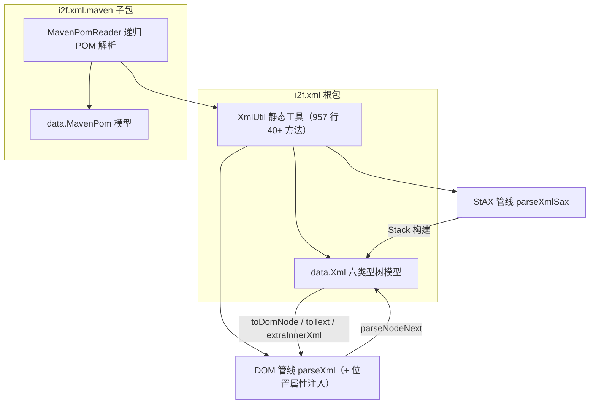

# i2f-xml

> **XML 解析 / 树模型 / 行号定位工具箱 + Maven POM 解析器**——全模块 **4 个源文件、1226 行、2 包**（根包 `i2f.xml` 2 文件 995 行：`XmlUtil` 957 + `data.Xml` 38；`maven` 子包 `i2f.xml.maven` 2 文件 231 行：`MavenPomReader` 203 + `data.MavenPom` 28；无资源、无 `src/test`）：以 JDK 自带 JAXP 双引擎（**DOM** `parseXml` 七重载 + **StAX** `parseXmlSax` 流式）为核心，提供「解析 → 轻量树模型（`Xml` 六类型节点）→ 遍历 / 改写 / 序列化 / 转 DOM」全链路静态工具（`XmlUtil` 40+ 静态方法），并独有 **行号位置注入**（解析期给每个标签注入 `__line`/`__file` 属性、树模型上回填 `locationName`/`locationLineNumber`，供下游解析器做「文件:行号」级错误定位）；`maven` 子包基于本模块实现 `MavenPomReader`（沿目录链递归父 POM、dependencyManagement 版本推导、Spring Boot/Cloud 前缀特化）。唯一 i2f 内部依赖 `i2f-match`（仅 `RegexUtil.regexFindAndReplace` 一处调用）；另编译期 lombok。
>
> **消费现状（本仓库「真实被使用」的基础设施模块之一）**：POM 侧 **4 个模块直接依赖**——`i2f-i18n`（pom.xml:21-24）、`i2f-jdbc-procedure`（:31-34）、`i2f-jdbc-proxy-xml`（:25-28）、`i2f-extension-velocity-bindsql`（:47-50，均无 scope 声明＝编译级）；源码侧 **8 个文件、11 处 import、40 处 `XmlUtil.` 方法调用**（i18n 的 `XmlI18nParser`、jdbc-proxy-xml 的 `MybatisMapperParser`/`MybatisMapperContext`、jdbc-procedure 的 `JdbcProcedureParser`、idea-plugin 的 `JdbcProcedureProjectMetaHolder`/`CompletionHelper`、velocity-bindsql 的 `VelocityResourceSqlTemplateResolver`）；wiki 旁证 6 处（i18n 与 jdbc-proxy-xml 两个已建 readme 均将本模块列为真实依赖）；发布四 jar（`bash/backup|deploy × jdk8|jdk17` 均含 `i2f-xml-1.0-jdk8.jar` / `-jdk17.jar`）。
>
> ⚠ **主要风险**：**位置注入管线的平台默认字符集缺陷**——`wrapLocationXmlStream` 中 `new InputStreamReader(...)`（:137）与 `xml.toString().getBytes()`（:156）均未指定 charset，默认编码与文档编码不一致（如 Windows GBK 环境解析 UTF-8 中文 XML）时静默乱码或解析异常回退（位置属性整体丢失）；**按行正则注入三大边界**（跨行标签不注入、CDATA/注释内字面 `<xxx >` 被误注入篡改内容、标签名含 `.` 不匹配）；**`walkClean` 类型判断对象错误**（:584 取根节点而非当前项）——根为 DOCUMENT/ELEMENT 时连 TEXT/CDATA 的 `value` 一并清空；**`parseXmlSax` 系列** `START_DOCUMENT`/`ATTRIBUTE` 两分支不可达（`next()` 永不返回）且前者误用 `getElementText()`、`parseXmlSax(File/URL)` 打开的输入流从不关闭（StAX `reader.close()` 不关底层流）、DTD 等六事件仅 `println("ok")` 调试残留；`MavenPomReader` 注释过滤笔误（:183 `"#comment".equals(name)` 应为 `key`）。详见「模块瑕疵或错误」。

## 模块路径

- `i2f-jdk/i2f-xml`

## 模块依赖

| 依赖 | 坐标 | scope/optional | 用途 |
| --- | --- | --- | --- |
| `lombok` | `org.projectlombok:lombok` | provided + optional（根 POM :83-89 管理，v1.18.44） | `@Data` + `@NoArgsConstructor`：`Xml` / `MavenPom` 2 个数据类 |
| `i2f-match` | `i2f.turbo:i2f-match`（版本 `${i2f.version}`，根 POM :605-607 管理） | compile（无 scope 声明） | `RegexUtil.regexFindAndReplace`（RegexUtil.java:136）——位置属性注入的唯一外部调用 |

- 构建插件：`maven-assembly-plugin`（pom.xml:26-33 显式声明）；版本继承 `i2f-jdk` parent（`1.0-jdk8`）；根 POM 版本管理（pom.xml:869-873）；`i2f-jdk-all` 聚合收录（i2f-jdk-all/pom.xml:615-618）；`i2f-jdk` 模块清单第 167 项（位于 i2f-workflow 与 i2f-design-pattern 之间）。
- 无资源文件；无 `src/test`——4 个源文件全部位于 `src/main/java`。

## 模块设计

1. **三条互通的 XML 管线**：

| 管线 | 入口 | 引擎 | 产物 | 特色 |
| --- | --- | --- | --- | --- |
| DOM | `parseXml` 七重载（byte[] / String / [String,charset] / URL / File / InputStream / [fileName,]InputStream） | JAXP `DocumentBuilder` | `org.w3c.dom.Document` | **行号位置注入**（`__line`/`__file` 属性）；解析失败自动回退原字节流 |
| StAX | `parseXmlSax` 四重载（[fileName,]InputStream / URL / File） | JAXP `XMLStreamReader` | `Xml` 轻量树 | 流式事件构建；结束自动 `walkFillValue(document, true)` 缓存合并文本 |
| 树转换 | `parseXmlDom`（DOM→树，4 重载）/ `toDomNode`（树→DOM）/ `extraInnerXml`（取内部 XML）/ `toText`（取纯文本） | — | 双向互通 | 深拷贝去包裹、属性剥离、文本缓存 |

2. **DOM 管线与位置注入**：`getFactory` 以三重禁用做 XXE 防护（`external-general-entities` / `external-parameter-entities` false + `expandEntityReferences` false，:33-45；`setFeature` 不支持时静默）→ `parseXml(fileName, is)` 先全量读入内存（:101-107），再经 `wrapLocationXmlStream` **逐行**用正则 `<[a-zA-Z0-9\-\_:]+(\s+|\s*>)` 命中开标签并注入 `__line="N"` + `__file="URL编码名"`（:129-157），随后 `builder.parse`，解析失败则回退**原始字节流**（:115-120，位置属性随回退丢失）。Document 上的位置属性可经 `removeNodeLocationAttributes`（:241-265）递归剥离，或由 `parseNodeNext` 转树时提取为 `Xml.location*` 字段（:489-497）。
3. **StAX 管线与树模型**：`getXmlInputFactory` 三禁用（`SUPPORT_DTD` / `IS_SUPPORTING_EXTERNAL_ENTITIES` false、`IS_NAMESPACE_AWARE` false，:847-858）→ `Stack` 驱动 START/END ELEMENT 及 CDATA/TEXT/COMMENT/SPACE 事件构建 `Xml` 树（:657-845）→ 末尾 `walkFillValue(document, true)` 后序合并文本（:839）。`Xml` 为六类型（DOCUMENT/ELEMENT/ATTRIBUTE/COMMENT/CDATA/TEXT）轻量节点：`attributes`/`children` 双列表 + `transient dom/innerXml/location*` 缓存字段；`parseNodeNext`（DOM→树）为六类型对称递归转换（:383-538）。
4. **遍历与批量填充**：`walkXml` 前序/后序（:553-578）；`walkClean` 清理缓存（:580-590，⚠ 见瑕疵 3）；`walkFillValue` 后序填充文本值（:607-620）；`walkFillDomAndInnerXml` / `fillDomAndInnerXml` 懒填充每个节点的 DOM 与 innerXml 缓存（:592-649）。
5. **`extraInnerXml` 深拷贝去包裹**（:281-339）：`importNode(deep=true)` 到新文档 → **移除目标节点全部属性**（:303-307）→ 可选 `removeNodeLocationAttributes` → `Transformer` 输出（省略 XML 声明、不缩进）→ 剥离首尾根标签字符串（:331-336）；三种特殊节点（COMMENT/TEXT/CDATA）直接返回文本（:284-289）。
6. **`maven` 子包**：`MavenPomReader.read(file)` 沿「上一级目录的 pom.xml」链**递归向上**收集 properties/dependencyManagement（:35-46，父链以 `resolveDependencies=false` 跳过父 `<dependencies>`）→ 当前文件解析 parent/properties/dependencyManagement/dependencies 四类节点（:56-93）→ 构建 `groupId:artifactId → version` 版本表（:96-108，含 parent 三元组）→ 为缺失版本的依赖补齐（:110-148；`${}` 单层替换 :190-196；Spring Boot/Cloud 前缀特化推导 :125-145）。
7. **结构图**：



## 模块目的

- **XML 读取的一站式工具**：解析（DOM/StAX 双引擎）、查找（`getRootNode`/`getNodesByTagName`/`getChildNodes`）、取值（`getAttribute(s)`/`getNodeContent`）、遍历（`walkXml` 前序/后序）、转换（`toDomNode`/`toText`/`extraInnerXml`）。
- **可定位的解析错误**：位置注入（`__line`/`__file` 属性 → `locationName`/`locationLineNumber` 字段）让基于本模块的解析器（MyBatis mapper、JDBC procedure 定义、i18n XML 等）能报告「文件:行号」级错误位置——jdbc-procedure 正是用 `ATTR_FILE`/`ATTR_LINE_NUMBER` 常量做此用途。
- **DOM 与轻量树的互转层**：`Xml` 树比 DOM 更易遍历/序列化/缓存（`innerXml`/`dom` 懒填充、`toText` 文本聚合），`parseXmlDom`/`toDomNode` 双向转换。
- **XML 内部片段提取与重建**：`extraInnerXml` 取内部 XML、`toText` 取纯文本、`removeNodeLocationAttributes` 清位置元数据，适合「解析 → 改写 → 回写」场景。
- **POM 分析底座**：`MavenPomReader` 供 IDE 插件 / 构建辅助工具解析 Maven 工程（父链、属性、依赖与管理版本推导）——i2f-jdbc-procedure-idea-plugin 场景（经 `JdbcProcedureProjectMetaHolder`/`CompletionHelper` 使用 XmlUtil）。

## 模块功能

- **解析**：`parseXml`（DOM，7 重载，含位置注入与失败回退）/ `parseXmlSax`（StAX，4 重载，构建 `Xml` 树）/ `parseXmlDom`（DOM→`Xml` 树，4 重载）。
- **查找与取值**：`getRootNode`（Document/Xml 双版本）、`getNodesByTagName`（多标签聚合）、`getChildNodes`（全部/按名过滤）、`getTagName`、`getAttribute`/`getAttributes`（LinkedHashMap）、`getNodeContent`。
- **转换**：`toDomNode`（`Xml`→DOM，六类型）、`toText`（递归文本，支持缓存）、`extraInnerXml`（去包裹内部 XML，支持位置属性剥离）。
- **遍历**：`walkXml`（前序/后序 + `Consumer<Xml>`）、`walkFillValue`、`walkClean`、`walkFillDomAndInnerXml`、`fillDomAndInnerXml`（懒填充）。
- **位置元数据**：常量 `ATTR_FILE`（`__file`）/ `ATTR_LINE_NUMBER`（`__line`）、`removeNodeLocationAttributes`（递归剥离）、`wrapLocationXmlStream`（对字节流再注入位置）。
- **POM 解析**：`MavenPomReader.read` / `readNext`（递归父链）、`MavenPom`（parent/properties/manageVersions/dependencies/managementDependencies 五字段）。
- **工厂与内部件**：`getFactory` / `getDocumentBuilder` / `getXmlInputFactory`（三工厂均预置安全禁用）。

## 模块主要使用方法

```java
// ① DOM 解析：自动注入 __line/__file 位置属性（⚠ 中文 XML 注意平台默认字符集，见瑕疵 1）
Document doc = XmlUtil.parseXml(new File("mapper.xml"));
Node root = XmlUtil.getRootNode(doc);                          // 第一个元素节点
String ns = XmlUtil.getAttribute(root, "namespace");           // 属性取值
List<Node> stmts = XmlUtil.getNodesByTagName(doc, Arrays.asList("select", "insert"));

// ② 位置定位：解析后的节点携带来源行号（取自位置注入写入的属性）
Node lineNode = root.getAttributes().getNamedItem(XmlUtil.ATTR_LINE_NUMBER);
String line = lineNode == null ? "-1" : lineNode.getTextContent();

// ③ StAX 流式解析为轻量树（编码由流/XML 声明决定，不经默认字符集两跳）
Xml tree = XmlUtil.parseXmlSax(new File("mapper.xml"));
Xml root2 = XmlUtil.getRootNode(tree);
String text = XmlUtil.toText(root2);                           // 递归纯文本（跳过注释/属性）

// ④ 遍历 + 内部 XML 提取（removeLocationAttribute=true 剥离 __line/__file）
XmlUtil.walkXml(tree, node -> {
    if (node.getType() == Xml.Type.ELEMENT && "select".equals(node.getName())) {
        System.out.println(node.getLocationName() + ":" + node.getLocationLineNumber());
        System.out.println(XmlUtil.extraInnerXml(node, true)); // 去包裹的内部片段（根属性被剥离）
    }
});

// ⑤ DOM→树 转轻量模型（__file/__line 自动转 location* 字段）
Xml dom2tree = XmlUtil.parseXmlDom("mapper.xml", doc);
XmlUtil.walkFillDomAndInnerXml(dom2tree, true);                // 懒填充 dom + innerXml 缓存

// ⑥ Maven POM 解析：沿目录链向上递归父 POM，推导依赖版本
MavenPom pom = MavenPomReader.read(new File("./i2f-jdk/i2f-xml/pom.xml"));
System.out.println(pom.getManageVersions().get("org.projectlombok:lombok")); // 1.18.44
System.out.println(pom.getDependencies());                     // [{groupId=org.projectlombok, version=1.18.44, ...}, {groupId=i2f.turbo, ...}]
```

注意事项：

- **解析编码正确性取决于内容与平台**：DOM 管线的位置注入经历「默认字符集解码 → 默认字符集编码」两跳（:137/:156）；默认编码与文档编码不一致时有乱码/回退风险。StAX 管线无此环。
- **DOM 树中的位置属性是真实属性**：`__file`/`__line` 会出现在 `getAttributes()` 里（业务 XML 原生同名属性会被吞）；不需要时用 `removeNodeLocationAttributes` 或 `extraInnerXml(node, true)` 剥离。
- **`Xml` 树的文本缓存语义**：`walkFillValue(node, true)` 会把合并文本缓存进 `value`（`toText(useCached=true)` 直接取缓存），树被改写后缓存不自动失效——写后读请用 `useCached=false`。
- **`extraInnerXml` 会丢弃目标节点自身的全部属性**（含业务属性，:303-307）——它取的是「内部」内容，根属性无处安放；子节点属性保留。

## 模块特性总结

1. **双引擎解析**：DOM（`DocumentBuilder`）与 StAX（`XMLStreamReader`）双管线互为补充；DOM 面向随机访问 + 位置注入，StAX 面向流式构树。
2. **行号位置注入（模块独有卖点）**：解析期正则注入 `__line`/`__file` → Document/`Xml` 树双形态可读，支撑下游 MyBatis mapper、JDBC procedure 等解析器的精确错误定位（`ATTR_FILE`/`ATTR_LINE_NUMBER` 常量已被下游直接引用）。
3. **XXE 防护三禁闭**：DOM 工厂与 StAX 工厂均显式禁用 DTD/外部实体/命名空间（:33-45 / :847-858）。
4. **轻量树模型**：`Xml` 六类型节点 + attributes/children 双列表 + transient 缓存（dom/innerXml/location*），比 DOM 更适合遍历与序列化。
5. **双向互通**：DOM ↔ `Xml` 树（`parseXmlDom`/`parseNodeNext`/`toDomNode`），另有 `extraInnerXml`/`toText` 两种文本视图。
6. **容错解析**：位置注入失败自动回退原始字节流（:115-120）——「有位置更好、无位置也能解析」。
7. **POM 分析器内置**：`MavenPomReader` 递归父链 + 依赖版本推导（dependencyManagement → Spring Boot/Cloud 特化）。
8. **全静态门面**：`XmlUtil` 40+ 静态方法即全部 API（类零实例、零状态）。
9. **薄依赖**：唯一内部依赖 `i2f-match`（仅 `RegexUtil` 一个方法）；运行期零三方。

## 模块瑕疵或错误

1. **位置注入管线的平台默认字符集缺陷**：`wrapLocationXmlStream` 中 `new InputStreamReader(new ByteArrayInputStream(data))`（:137）与 `xml.toString().getBytes()`（:156）均未指定 charset——默认编码与文档编码不一致（如 Windows GBK 环境解析 UTF-8 中文 XML）时，先按默认编码误解码、再按默认编码重编码：轻则中文静默乱码，重则解析异常触发回退（位置属性整体丢失）；输出字节序列由平台默认编码决定，与 XML 声明 `encoding` 不再对应。另 `parseXml(String, charset)` 的 charset 参数仅用于 `str.getBytes(charset)`（:56-58），解析端仍由声明/默认推断——参数语义不完整。
2. **按行正则注入的位置属性三大边界**（`wrapLocationXmlStream` :140-154）：① **跨行标签不注入**——`<tag` 位于行尾且后无空格/`>` 时正则不匹配（多行属性声明的元素丢 `__line`）；② **CDATA/注释内字面标签被误注入**——正则只认行文本，`<![CDATA[…<a >…]]>` 或 `<!-- <a > -->` 中的字面标签会被注入属性（**篡改业务内容**）；③ 标签名含 `.`（XML 合法名字符）不匹配；另 `readLine()` + `append("\n")` 会把 CRLF 归一化为 LF、末行可能补换行。
3. **`walkClean` 类型判断对象错误**（:580-590）：lambda 内 `Xml.Type type = node.getType()` 取的是**方法参数的根节点**而非当前遍历项 `item`——根为 DOCUMENT/ELEMENT 时**所有节点（含 TEXT/CDATA/COMMENT）的 `value` 均被清空**（意图显然只清 DOCUMENT/ELEMENT），文本数据连带丢失。
4. **`parseXmlSax` 事件分支缺陷**（:657-845）：① `START_DOCUMENT` 分支（:674-683）**不可达**——`reader.next()` 从不返回该事件（reader 初始状态即是），且其中 `reader.getElementText()` 要求当前处于 `START_ELEMENT`，即便可达也抛 `IllegalStateException`；② `ATTRIBUTE` 分支（:731-755）同样不可达（属性仅在 START_ELEMENT 阶段读取），且若可达会按 `getAttributeCount()` 把同一元素属性**重复添加**；③ DTD/ENTITY_DECLARATION/ENTITY_REFERENCE/NAMESPACE/NOTATION_DECLARATION/PROCESSING_INSTRUCTION 六类事件仅 `System.out.println("ok")`（:807-818）——调试残留污染标准输出。
5. **`parseXmlSax(File)` / `parseXmlSax(URL)` 输入流泄漏**（:544-551）：内部打开的 `FileInputStream` / `url.openStream()` 没有任何关闭路径——主流程 finally 仅 `reader.close()`（:842-844），而 StAX 规范明确 `XMLStreamReader.close()` 不关闭底层输入源。
6. **`MavenPomReader` 注释过滤笔误**（:183）：`if ("#comment".equals(name))` 误用外层变量 `name`（恒为 `"dependency"`），应为子节点名 `key`——dependency 内的注释节点被收录为 `#comment` 键混入依赖 Map（对照 `readPropertiesNode` :158-163 同位置判断对象正确）。
7. **`extraInnerXml` 语义边界**：① 无条件移除**目标节点全部属性**（:303-307，无开关）——业务属性与位置属性一并不见；② 自闭合节点（`<a/>`）时前后缀剥离失效（prefix `<a>` / suffix `</a>` 均不匹配 :331-336）→ 返回完整标签而非空串；③ `INDENT=no` 紧凑输出（无缩进）。
8. **位置属性无隔离/开关**：`__file`/`__line` 为保留名（:30-31）——业务 XML 原生同名属性会被提取吞掉（`parseNodeNext` :489-497 优先当位置元数据）；DOM 树中位置属性会混入 `getAttributes()` 结果（需显式 `removeNodeLocationAttributes`）。
9. **多处空 catch / 异常吞没**：`getFactory` 的 `setFeature` 失败静默（:37-42，解析器不支持时 XXE 防护可能不完整）；`getLocationNameByUrl` 双兜底空 catch（:69-84）；`parseNodeNext` 属性解析 try-catch 静默（:488-509）；`fillDomAndInnerXml` / `walkFillDomAndInnerXml` 仅 `printStackTrace`（:601-603 / :635-646）。
10. **DOM 管线全量内存 + 多份拷贝**：`parseXml` 先把全部字节读入 `ByteArrayOutputStream`（:101-107），位置注入再构建完整 String 副本（:136-154）并 `getBytes()` 复制——大文件内存峰值显著高于原文件（StAX 管线可替代构树，但 `Xml` 树仍在内存）。
11. **`getRootNode(Document)` 兜底返回 `getLastChild()`**（:168）：文档无元素节点时返回最后子节点（可能是注释/处理指令）而非 null——调用方误判风险。
12. **`toDomNode` 的 ATTRIBUTE 分支产出游离 `Attr`**（:891-894）：`createAttribute` 返回的属性无法 `appendChild` 到元素（DOMException）——仅防御性死分支；正常树中属性存于 `attributes` 列表不经此路径。
13. **`MavenPomReader` 能力边界**：① 父链只认「上一级目录的 pom.xml」（:35-46），不遵循 `relativePath`、不解析仓库/BOM `import`；② 版本推导仅特化 `org.springframework.boot` / `org.springframework.cloud` 前缀（:125-145）；③ properties 仅单层 `${}` 替换（:190-196）；④ 父 POM 的 `<dependencies>` 恒不采集（:42 传 `resolveDependencies=false`）；⑤ `main` 硬编码示例路径（:21）。
14. **零自动化测试**：无 `src/test`——全部 4 源文件在 `src/main`（`MavenPomReader.main` :20-26 为硬编码演示）；40+ API 的解析/注入/互转/遍历无任何自动化防线，且瑕疵 1/2/3 均属「静默错误」（乱码/漏注入/误清空），无测试难以察觉；`XmlUtil`/`MavenPomReader` 的类注释 `@desc` 为空。

## 消费现状与验证

- **POM 直接依赖（4 模块）**：`i2f-i18n`（i2f-i18n/pom.xml:21-24，`XmlI18nParser` 解析 XML 国际化文件）、`i2f-jdbc-procedure`（:31-34）、`i2f-jdbc-proxy-xml`（:25-28，`MybatisMapperParser`/`MybatisMapperContext` 解析 MyBatis mapper XML）、`i2f-extension-velocity-bindsql`（:47-50，`VelocityResourceSqlTemplateResolver` 解析 SQL 模板 XML）——均无 scope 声明（编译级）。
- **Java 代码消费（8 文件、11 处 import、40 处 `XmlUtil.` 调用）**：`MybatisMapperParser` 12 处（`parseXml`/`getRootNode`/`getAttribute`/`getChildNodes`/`getNodeContent`/`getTagName`/`getAttributes`）、`XmlI18nParser` 11 处、`VelocityResourceSqlTemplateResolver` 6 处、`JdbcProcedureParser` 5 处（`parseXmlSax` + `walkFillDomAndInnerXml` + `ATTR_FILE`/`ATTR_LINE_NUMBER` 常量做错误定位）、idea-plugin `JdbcProcedureProjectMetaHolder` 2 处、`CompletionHelper` 2 处（`parseXmlSax` + `walkXml`）、`MybatisMapperContext` 1 处、`TestMybatisMapperContext` 1 处（位于消费方 src/main 的 test 包）。
- **方法级消费面**：DOM 侧以 `parseXml` + 取值族为主；**StAX 侧已被 jdbc-procedure 与 idea-plugin 采用**（`parseXmlSax`/`walkFillDomAndInnerXml`/`walkXml`）——轻量树工作流有真实落地；`parseXmlDom`/`toDomNode`/`extraInnerXml`/`toText`/`walkClean` 暂无外部调用（模块内互通 API）。
- **wiki 侧引用（6 处）**：`.wiki/wiki.md:113` 与 `.wiki/docs/module-i2f-jdk.md:265` 模块清单；`i2f-i18n/readme.md:3,21` 与 `i2f-jdbc-proxy-xml/readme.md:56` 均将 `i2f-xml` 列为**真实使用的依赖**（消费方向反向印证）；`i2f-workflow/readme.md:5` 以邻居身份提及。
- **发布产物**：`bash/backup-jdk8|backup-jdk17|deploy-jdk8|deploy-jdk17` 四目录均含 `i2f-xml-1.0-jdk8.jar` / `i2f-xml-1.0-jdk17.jar`。
- **验证方法**：PowerShell 全仓逐文件枚举（POM / 源码 / 方法级 `XmlUtil.` 调用三路扫描，排除 target）+ wiki 引用扫描；行数以 `[IO.File]::ReadAllLines(UTF8)` 为权威口径（本模块 4 文件 1226 行）。
