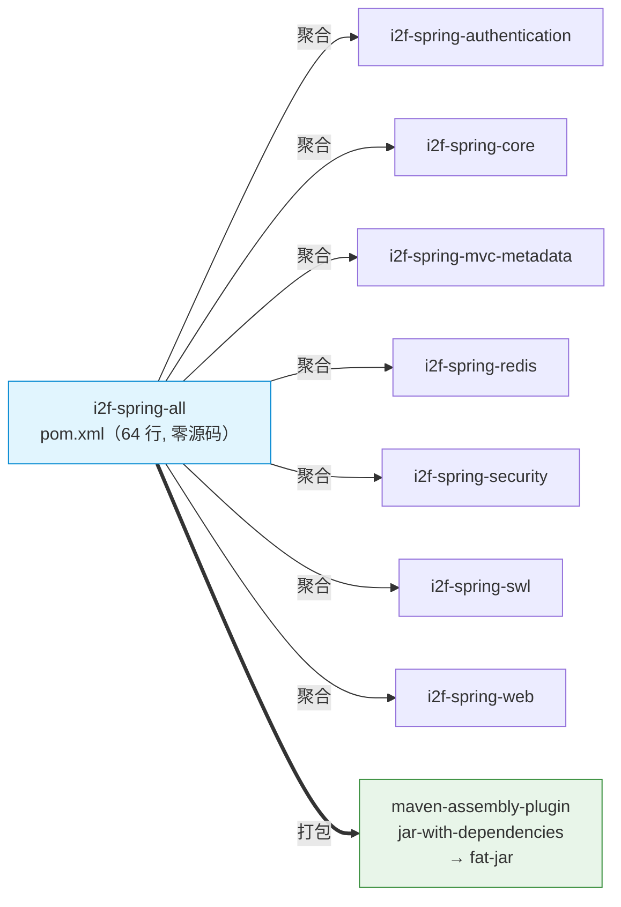
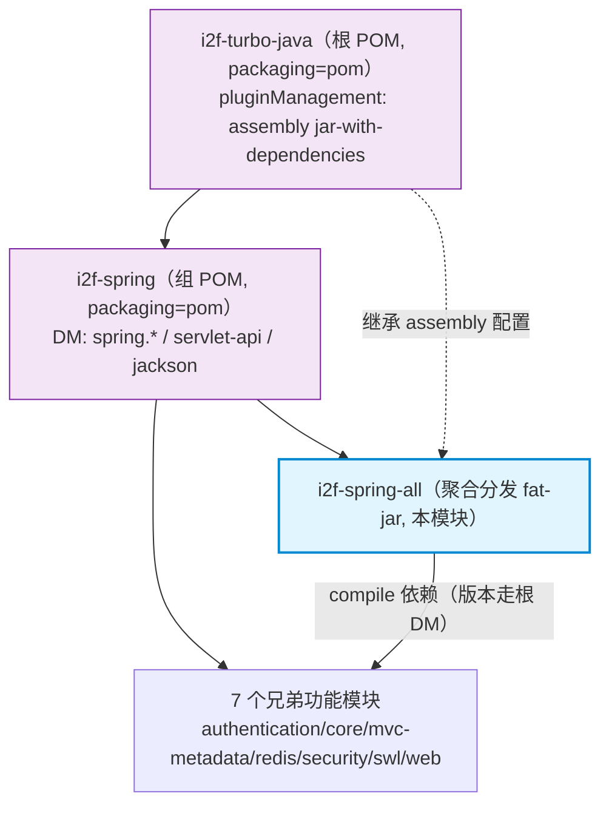

# i2f-spring-all

> **i2f-spring 子模块的 Maven 聚合分发包 / 把 Spring 族 7 个功能模块打为单体 fat-jar 的构建入口**（仅 1 个 `pom.xml` 共 64 行、无 Java 源码、无测试、无资源、无 SPI）：以 7 枚 compile 依赖聚合 `i2f-spring` 组下全部功能模块——`authentication` / `core` / `mvc-metadata` / `redis` / `security` / `swl` / `web`——依赖不写版本号（由根 `pom.xml` 的 `dependencyManagement` 以 `${i2f.version}` 锁定），并经继承自根 pom pluginManagement 的 `maven-assembly-plugin`（`jar-with-dependencies` 描述符、`appendAssemblyId=false`）产出一个可脱离父 POM 直接 `-cp` 部署的 fat-jar。它与同仓 `i2f-jdk-ext-all`、`i2f-extension-all`、`i2f-jdk-all` 为同构的「组级聚合分发件」。全模块在仓库内**无任何源码级消费方**，仅作为对外统一依赖入口存在。

## 模块路径

`i2f-spring/i2f-spring-all`（artifactId `i2f-spring-all`，groupId 继承 `i2f.turbo`，版本 `1.0-jdk8`）。

本模块是 `i2f-spring` 组（共 8 个 POM 模块）里的**聚合分发件**：整个模块只有一个 `pom.xml`，无任何 `src` 目录、无 Java 类、无资源、无测试。它在父 POM `i2f-spring/pom.xml` 的 `<modules>` 中被登记为**首个子模块**（`i2f-spring/pom.xml:17`），职责单一——把同组其余 7 个功能模块收拢为一个「一处声明、整组引入」的依赖门面，并额外通过 assembly 插件产出把这些模块及其传递依赖解压合并的单体 fat-jar，供不便逐模块列举依赖（如直接放 lib 目录 / `-cp` 部署）的场景使用。

> 打包行为来源：本模块自身 `<build>` 只声明了 `maven-assembly-plugin` 并覆盖了一处 `<archive><addMavenDescriptor>true</addMavenDescriptor></archive>`；真正的 `jar-with-dependencies` 描述符、`finalName`、`appendAssemblyId=false`、Manifest 元信息（`Class-Path`、`Maven-*`、`Root-*`、`Java-*`）、`package` 阶段 `single` 目标绑定等，全部继承自根 `pom.xml` 的 `pluginManagement`（约 `pom.xml:1826-1872`）。

## 模块依赖

本模块 `dependencies` 全部为**同组内部模块**，scope 缺省（即 `compile`）、`optional` 缺省（即 `false`）、且**均不写版本号**：

| GroupId | ArtifactId | Scope | Optional | 说明 |
|---------|-----------|-------|----------|------|
| i2f.turbo | i2f-spring-authentication | compile | false（默认） | 认证结果统一出口控制器（`SecurityForwardController`） |
| i2f.turbo | i2f-spring-core | compile | false（默认） | Spring 基础能力到 i2f-jdk 契约的桥接基座 |
| i2f.turbo | i2f-spring-mvc-metadata | compile | false（默认） | Spring MVC Controller API 元数据反射解析 |
| i2f.turbo | i2f-spring-redis | compile | false（默认） | `IRedisClient` 契约的 Spring Data Redis 适配器 |
| i2f.turbo | i2f-spring-security | compile | false（默认） | Spring Security 认证上下文与密码编码工具 |
| i2f.turbo | i2f-spring-swl | compile | false（默认） | SWL 透明加解密的 Spring MVC 切面件 |
| i2f.turbo | i2f-spring-web | compile | false（默认） | Spring Web MVC / WebFlux 能力工具箱 + i2f-network REST 落地 |

依赖面特征：

- 版本号由根 `pom.xml` `dependencyManagement` 统一给出（`i2f-spring-all` 自身登记于 `pom.xml:1310-1314`，7 个被聚合模块登记于 `pom.xml:1315-1349`，均为 `${i2f.version}`），聚合模块自身零版本声明，避免漂移。
- 7 个依赖全是 `compile`，故「引入 `i2f-spring-all`」在传递依赖层面等价于「同时引入这 7 个模块」；而各子模块对 Spring 框架本体（`spring-core/context/web/webmvc/tx/security-*`）与 `javax.servlet-api` 多为 `provided + optional`，因此这些容器依赖**不会**随 `i2f-spring-all` 传递到消费方，仍由运行期容器/starter 提供。
- 聚合模块本身不引入任何第三方库、不引入 lombok、不引入 JDK 基础模块——它只「引用兄弟」。

## 模块设计

### 架构定位

`i2f-spring-all` 是一个**零源码的 Maven 聚合分发模块**，在 `i2f-spring` 组中承担双重角色：

1. **聚合入口（bom/aggregator）**——将同组 7 个功能模块收拢为单一构建/依赖单元，消费方声明一次即可拿到整个 Spring 集成能力集。
2. **Fat-jar 分发**——继承根 pom pluginManagement 的 `maven-assembly-plugin`，用 `jar-with-dependencies` 描述符把模块自身（无源码）与 7 个子模块的类、资源及其 compile 传递依赖解压合并为一个可独立部署的 JAR。



### Maven 模块层级



### 设计要点

1. **零源码纯 POM**：无任何 Java/资源/测试，仅描述构建行为，是典型 Maven aggregator 模式。
2. **版本全交由根 DM**：7 枚依赖均不写 `<version>`，由根 `dependencyManagement` 以 `${i2f.version}` 统一锁定，聚合层不关心具体版本。
3. **只覆盖 `addMavenDescriptor`**：本模块 `<build>` 唯一显式配置是把 `addMavenDescriptor` 设为 `true`（在 fat-jar 的 `META-INF/maven/...` 内保留本聚合模块的 `pom.xml` 与 `pom.properties`）；其余 fat-jar 行为（描述符、Manifest、阶段绑定）完全继承根 pom。
4. **容器依赖不外泄**：子模块对 Spring/servlet 的 `provided + optional` 策略，使 `i2f-spring-all` 作为依赖门面时不会把 Web 容器强行传递给消费方。
5. **被注释的自依赖块**：`pom.xml:15-18` 存在一段被注释掉的「`i2f-spring-all` 依赖 `i2f-spring-all`」的循环依赖声明，未生效，与同族 `-all` 模块一致的遗留痕迹。

## 模块目的

- **简化依赖引入**：消费方只需声明一个 `i2f-spring-all`，即获得 `i2f-spring` 组 7 个功能模块的全部能力，避免逐个列举。
- **提供预打包分发件**：通过 fat-jar 让不便使用 Maven 依赖管理的场景（直接 `-cp`、lib 目录手动管理）也能整体使用 Spring 集成能力集。
- **保持模块边界清晰**：聚合件不引入任何额外逻辑，各子模块的职责、依赖、构建配置仍完全由其自身 POM 定义；聚合层仅做「收拢 + 打包」。
- **双 JDK 分发一致性**：随根构建产出 `i2f-spring-all-1.0-jdk8.jar` 与 `-jdk17.jar`，与组内其他模块保持 jdk8/jdk17 双轨对齐。

## 模块功能

- **Maven 聚合构建**：作为 `i2f-spring` 的子模块，`mvn package -pl i2f-spring/i2f-spring-all -am` 一条命令即可触发 7 个兄弟模块的编译、测试与打包。
- **Fat-jar 产出**：`mvn package` 后生成 `i2f-spring-all-1.0-jdk8.jar`，内含 7 个子模块的类文件与资源，以及它们的 compile 级传递依赖（各子模块依赖的 `i2f-jdk`/`i2f-jdk-ext` 等内部模块链）。
- **统一依赖门面**：对外以单 artifact 表达「整个 i2f-spring 能力集」，屏蔽子模块划分。
- **Manifest 元信息注入**：产出 JAR 的 `META-INF/MANIFEST.MF` 含项目标识、构建时间、仓库链接、编译版本等（继承根 pom pluginManagement）。

## 模块主要使用方法

### 1. 作为 Maven 依赖引入（推荐）

在其他模块 `pom.xml` 中声明一次即可获得 i2f-spring 全部功能：

```xml
<dependency>
    <groupId>i2f.turbo</groupId>
    <artifactId>i2f-spring-all</artifactId>
    <version>1.0-jdk8</version>
</dependency>
```

等价于同时声明以下 7 枚依赖：

```xml
<!-- i2f-spring-authentication / i2f-spring-core / i2f-spring-mvc-metadata
     / i2f-spring-redis / i2f-spring-security / i2f-spring-swl / i2f-spring-web -->
```

> 注意：由于各子模块的 Spring / servlet-api 依赖为 `provided + optional`，本门面**不会**传递 Web 容器本体；作为库引入的宿主仍需自行具备 Spring 运行环境（或经 SpringBoot starter 引入）。

### 2. 构建 fat-jar

```bash
mvn package -pl i2f-spring/i2f-spring-all -am
```

产出位于 `i2f-spring/i2f-spring-all/target/i2f-spring-all-1.0-jdk8.jar`（`appendAssemblyId=false`，无 `-jar-with-dependencies` 后缀）。

### 3. 部署使用

fat-jar 可作为 classpath 依赖直接放入应用 lib 目录或经 `-cp` 引用：

```bash
java -cp i2f-spring-all-1.0-jdk8.jar com.example.Application
```

### 4. 扩展聚合范围

若 `i2f-spring` 组未来新增功能模块，仅需在 `i2f-spring-all/pom.xml` 追加一枚无版本 `<dependency>` 即自动纳入门面与 fat-jar（版本由根 DM 提供）：

```xml
<dependency>
    <groupId>i2f.turbo</groupId>
    <artifactId>i2f-spring-xxx</artifactId>
</dependency>
```

## 模块特性总结

- **零源码纯 POM**：不含任何 Java/资源/测试，职责单一（聚合 + 打包）。
- **组级依赖门面**：单 artifact 收拢 7 个 Spring 集成模块，屏蔽子模块划分。
- **Fat-jar 聚合分发**：继承根 pom assembly 配置产出 `jar-with-dependencies` 单体 JAR，`addMavenDescriptor=true` 保留自身 maven 描述符。
- **版本零声明**：7 枚依赖全走根 `dependencyManagement`，聚合层不持版本号。
- **容器依赖隔离**：子模块 `provided + optional` 使 Spring/servlet 不随门面外泄。
- **双 JDK 对齐**：产出 jdk8/jdk17 两套 jar，与组内模块分发策略一致。

## 模块瑕疵或错误

以下为静态识别（不实证）：

1. **自依赖注释残留（循环依赖隐患）**：`pom.xml:15-18` 保留了「`i2f-spring-all` 依赖 `i2f-spring-all`」的被注释块，一旦被误取消注释即成 Maven 循环依赖，构建直接失败；属从兄弟 `-all` 模板复制后未清理的死代码。
2. **门面依赖过宽 / 无法按需裁剪**：`i2f-spring-all` 硬编码全量 7 枚 compile 依赖，任何只要其中一两个能力的消费方引入门面都会传递拿到整组模块，缺少更细粒度的分组聚合（如「仅 web 族」「仅 security 族」）。
3. **fat-jar 与库依赖语义冲突**：`i2f-spring-all` 同时充当「Maven 依赖门面」（thin，靠传递依赖）与「fat-jar 分发件」（重打包全部子模块类）。若消费方既在 classpath 放 fat-jar、又经 Maven 引入子模块，会出现同一批类的双份定义（重复类 / 类加载歧义），文档未对此风险作任何提示。
4. **无 `<dependencyManagement>`/`<exclusions>` 治理**：作为聚合根不对子模块间可能出现的版本冲突或重复传递依赖作统一收敛，完全信任各子模块自身 POM；当子模块依赖树复杂时 fat-jar 合并可能产生资源覆盖（同名 `META-INF/services`、`.properties` 后者胜）。
5. **`addMavenDescriptor` 覆盖未注明动机**：唯一显式配置 `addMavenDescriptor=true` 无注释说明目的（把自身 pom 塞进 fat-jar 的 `META-INF/maven` 通常对纯聚合件意义有限），可读性欠佳。
6. **零测试、零校验**：作为分发门面模块本身无代码可测尚属合理，但也无任何「聚合完整性」约束——若某新子模块被加入 `i2f-spring/pom.xml` 却忘记登记进 `i2f-spring-all`，构建不会报错，门面静默缺件（对比 `extension` 组同类问题）。
7. **无 README/描述性 `<description>`**：POM 未写 `<description>` 或 `name`，纯靠 artifactId 表达意图，对外 Maven 仓库元数据不自解释。

## 其他扩展章节

### 模块在生态中的位置

- **同构兄弟**：与 `i2f-jdk/i2f-jdk-all`、`i2f-jdk-ext/i2f-jdk-ext-all`、`i2f-extension/i2f-extension-all` 为同一模式的「组级聚合分发件」——零源码、聚合本组功能模块、继承根 pom assembly 产 fat-jar。相较 `i2f-jdk-ext-all`（仅聚合 2 个模块），本件聚合 7 个，是 Spring 族的统一入口。
- **上层消费方**：仓库内**无任何源码级或 POM 级消费方**（grep 仅命中其自身 pom、父 `i2f-spring/pom.xml:17` 模块登记、根 `pom.xml:1312` DM 登记三处），它是面向**外部项目/手工部署**的成品分发件，不参与仓库内部模块间的编译依赖。
- **构建登记**：父 `i2f-spring/pom.xml:17`（`<modules>` 首个）、根 `pom.xml` `dependencyManagement` `:1310-1314`；`bash/{backup,deploy}-jdk8` 与 `bash/{backup,deploy}-jdk17` 四目录均含 `i2f-spring-all-1.0-{jdk8,jdk17}.jar`（四目录齐全，含 jdk17）。
- **组内定位**：`i2f-spring` 组的 8 个模块中，本件是唯一的纯聚合分发件，其余 7 个（authentication/core/mvc-metadata/redis/security/swl/web）为功能模块；字母序上 `all` 排最前，是本组 menus 的首个条目。
