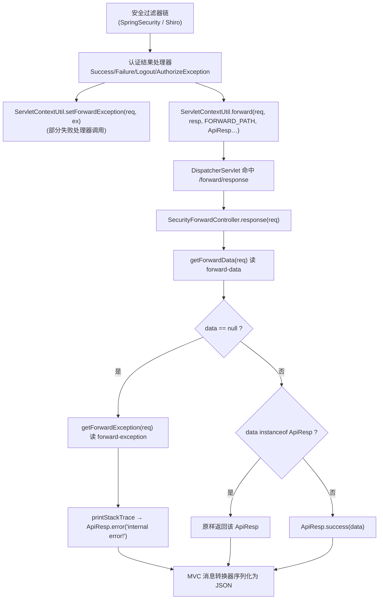

# i2f-spring-authentication

> Spring Security / Shiro 认证结果的「统一出口控制器」模块（全模块仅 1 个主源文件 `SecurityForwardController` 约 35 行、无测试、无 SPI、无资源）：提供一个映射到 `/forward/response` 的 `@RestController`，接收安全过滤器链内部通过服务端 forward 转来的数据/异常，统一包装为本仓库标准响应体 `ApiResp` 后由 MVC 消息转换器序列化为 JSON。它是「过滤器层」与「DispatcherServlet/Controller 层」之间的响应回落桥，让跑在 DispatcherServlet 之外的认证处理器也能复用 `ApiResp` 的统一序列化管线。

## 模块路径

`i2f-spring/i2f-spring-authentication`（artifactId `i2f-spring-authentication`，groupId 继承 `i2f.turbo`，版本 `1.0-jdk8`）。

本模块是 Spring 安全族里一个**极细粒度的支撑件**：`i2f-spring` 组下 8 个模块之一，但整个 `i2f.spring.authentication` 包只落地了一个类 `SecurityForwardController`（位于子包 `i2f.spring.authentication.forward`）。它本身不含任何认证逻辑（认证/授权的实现在 `i2f-spring-security` 与各 SpringBoot starter 中），只负责把别处已经算好的「登录成功/失败/登出/鉴权异常」结果，经由一次 Servlet 内部转发，收口成一个能被 Spring MVC 正常渲染的响应端点。

> 关键契约来源：转发目标路径常量 `ServletContextUtil.FORWARD_PATH = "/forward/response"`、数据属性键 `FORWARD_DATA_ATTR_KEY = "forward-data"`、异常属性键 `FORWARD_EXCEPTION_ATTR_KEY = "forward-exception"`，以及 `setForwardData/setForwardException/getForwardData/getForwardException/forward(...)` 一组辅助方法，全部定义在同仓 **`i2f-jdk-ext/i2f-jdk-ext-web`** 的 `i2f.web.servlet.ServletContextUtil` 中——本模块只是这套契约的 **MVC 端点实现方**。

## 模块依赖

| GroupId | ArtifactId | Scope | Optional | 说明 |
|---------|-----------|-------|----------|------|
| i2f.turbo | i2f-resp | compile | false | 统一 API 响应体 `ApiResp`（`success/error/resp`） |
| i2f.turbo | i2f-spring-web | compile | false | 传递引入 `i2f-jdk-ext-web` 的 `ServletContextUtil`（转发契约与取值工具所在） |
| org.projectlombok | lombok | compile | false | 声明但本模块未实际使用 |
| org.springframework | spring-core | provided | true | Spring 核心 |
| org.springframework | spring-context | provided | true | Spring 上下文（`@RestController` bean 化） |
| org.springframework | spring-web | provided | true | `@RequestMapping` / Web 注解 |
| org.springframework | spring-webmvc | provided | true | MVC 分发（`DispatcherServlet` 命中本控制器） |
| javax.servlet | javax.servlet-api | provided | true | `HttpServletRequest`（版本由 `i2f-spring` 父 pom DM 锁定为 4.0.1） |

依赖面特征：内部依赖 `i2f-resp`、`i2f-spring-web` 为 compile（随本模块 jar 传递），Spring 四件套与 servlet-api 全 `provided + optional`——本模块编译期不强制绑定容器，运行时由消费方（SpringBoot starter）提供。lombok 声明冗余（源文件未使用任何 lombok 注解）。

## 模块设计

### 架构定位

本模块在认证链路中扮演「响应回落出口」，本身是纯被动的 Servlet 端点：



### 包结构

```
i2f.spring.authentication
└── forward/
    └── SecurityForwardController   # 唯一类：/forward/response 端点（35 行）
```

### 类设计

`SecurityForwardController` 用 `@RestController` + 类级 `@RequestMapping("forward")` + 方法级 `@RequestMapping("response")` 拼出全路径 `forward/response`，恰好等于 `ServletContextUtil.FORWARD_PATH`。方法体三步判定：先读 `forward-data`；为空则读 `forward-exception` 并转「internal error!」；非空且本身已是 `ApiResp` 则原样透出，否则包一层 `ApiResp.success`。

## 模块目的

1. **统一响应出口**：Spring Security / Shiro 的过滤器与 Handler 运行在 `DispatcherServlet` 之前/之外，无法直接复用 `@RestController` 的返回值序列化与全局响应包装；本模块提供一个可被 forward 命中的真实 MVC 端点，把「认证结果」纳入统一 `ApiResp` JSON 管线。
2. **解耦协议细节**：消费方只需调用 `ServletContextUtil.forward(req, resp, FORWARD_PATH, apiResp)`，不必自己写 `response.getWriter().write(json)`，也避免内容类型、编码、序列化在各 starter 里重复实现。
3. **兜底异常出口**：为「只有异常、没有预置响应体」的转发场景提供 `forward-exception` 分支，至少产出一个不泄露内部细节的 `ApiResp.error("internal error!")`。
4. **最小化 footprint**：以单类、compile 依赖仅两枚的极薄形态挂进 Spring 族，供多个 starter 共享同一份实现。

## 模块功能

| 功能 | 入口 | 说明 |
|------|------|------|
| 接收转发并统一响应 | `SecurityForwardController.response(HttpServletRequest)` | 映射 `forward/response`，读 `forward-data`/`forward-exception` 产出 `ApiResp` |
| 数据透传 | 同上（`obj instanceof ApiResp` 分支） | 转发来的已是 `ApiResp` 时原样返回，不二次包装 |
| 非响应体包装 | 同上（`ApiResp.success(obj)` 分支） | 转发来的是普通对象时包成成功响应 |
| 异常兜底 | 同上（`obj == null` 且存在异常） | 打印堆栈并返回 `ApiResp.error("internal error!")` |

## 模块主要使用方法

本模块**不通过 Java API 调用**，而是「随 starter 上 classpath 即自动生效」的透明端点，使用方是安全认证处理器：

```java
// 消费方示例（i2f-springboot-security-starter / shiro-starter 的 Handler 内）：
// 1) 写入可选异常属性（失败场景）
ServletContextUtil.setForwardException(request, ex);
// 2) 预置业务响应体并转发到本控制器
ServletContextUtil.forward(request, response,
        ServletContextUtil.FORWARD_PATH,        // "/forward/response"
        ApiResp.success(token));                 // 作为 forward-data 属性
```

命中 `/forward/response` 后，本控制器把 `ApiResp.success(token)` 原样返回，由 MVC 渲染为 JSON。

注意事项：
- 端点必须落在 Spring 组件扫描范围内（依赖消费方 starter 的自动配置/扫描使 `SecurityForwardController` 成为 bean），否则 forward 会 404。
- `forward-data` 与 `forward-exception` 是同一 request 域内的约定属性；只有当 `forward-data` 为 null 时才会走异常分支。
- 方法用裸 `@RequestMapping`，未限定 HTTP method，故 GET/POST/PUT… 均可命中。

## 模块特性总结

- **单类极薄**：全模块 1 个 `@RestController`，无逻辑分支复杂度，纯数据搬运 + 兜底。
- **契约驱动**：路径与属性键完全对齐 `i2f-jdk-ext-web.ServletContextUtil`，非本模块自定义，避免常量漂移。
- **透明装配**：随 starter 引入即生效，调用方无需显式 new 或注册。
- **provided + optional 容器解耦**：Spring 与 servlet-api 全 optional，编译不绑容器。
- **响应复用**：已是 `ApiResp` 时原样透出，避免二次包裹导致的 `{code,data:{code,data}}` 嵌套。

## 模块瑕疵或错误

以下为静态识别（不实证）：

1. **`forward-exception` 分支在现有消费方中几乎不可达（死代码）**：所有已知调用方（security/shiro starter 的 Success/Failure/Logout/AuthorizeException 处理器）在 `forward(...)` 时都传入了一个已构造好的 `ApiResp` 作为 `forward-data`，因此控制器里 `getForwardData` 恒非 null，`if (obj == null)` 下的异常兜底分支永远不会命中——`setForwardException(request, ex)` 的写入实际被丢弃。
2. **`ex.printStackTrace()` 而非日志框架**：兜底分支用 `printStackTrace()` 输出到标准错误流，绕开了 `i2f-log`/slf4j 体系，生产环境难以收集与脱敏。
3. **异常信息全量丢弃**：即便命中异常分支，也只返回固定的 `ApiResp.error("internal error!")`，异常类型、message、traceId 均不外传（虽属安全考量，但也使前端/排障无法区分具体失败原因）。
4. **`@RequestMapping` 未限定 method**：类级与方法级均用裸 `@RequestMapping`，端点接受任意 HTTP 动词，与「仅接收内部转发」的语义不符，理论上也可被外部直接 GET/POST 命中（虽 data 为空只返回 internal error，但暴露了探测面）。
5. **依赖 `i2f-spring-web` 仅为传递 `ServletContextUtil`**：`ServletContextUtil` 实际定义在 `i2f-jdk-ext-web`，本模块经由 `i2f-spring-web` 间接拿到，pom 未直接声明真正的契约来源模块，依赖表达不够精确。
6. **lombok 声明冗余**：唯一源文件未使用任何 lombok 注解，`provided`/`compile` 的 lombok 依赖可移除。
7. **无任何单元/集成测试**：单控制器却无 MockMvc 级测试，`forward-data` 为 null、为 `ApiResp`、为普通对象三条分支的正确性未被守护。
8. **静默成功语义风险**：当 `forward-data` 是非 `ApiResp` 的任意对象时被无条件包成 `ApiResp.success(obj)`——若上游误把「失败标记对象」转发进来，会被当作成功响应返回。
9. **无 `@RestController` 显式produces/编码声明**：JSON 序列化完全交由消费方 MVC 配置，模块自身不保证 `Content-Type`，跨 starter 复用时长篇依赖宿主环境一致。

## 其他扩展章节

### 模块在生态中的位置

- **上层消费方（真实、跨模块）**：`i2f-springboot-security-starter` 的 `DefaultAuthenticationSuccessHandler`/`DefaultAuthenticationFailureHandler`/`DefaultLogoutSuccessHandler`/`AbstractAuthorizeExceptionHandler`，以及 `i2f-springboot-shiro-starter` 的 `DefaultLoginSuccessHandler`/`DefaultLoginFailureHandler`/`DefaultLogoutHandler`，均在处理完认证后经 `ServletContextUtil.forward(req, resp, FORWARD_PATH, ApiResp…)` 落到本控制器。本模块是这两套安全 starter 共用的「响应收口点」。
- **契约对端**：所有路径/属性常量与 `forward`/`getForwardData`/`getForwardException` 辅助方法来自 `i2f-jdk-ext/i2f-jdk-ext-web` 的 `ServletContextUtil`（compile 传递依赖）。
- **构建登记**：`i2f-spring/pom.xml:18` 模块登记、根 `pom.xml` `dependencyManagement` `:1315-1319`、`i2f-spring-all/pom.xml:21` 聚合；`bash/{backup,deploy}-jdk8` 与 `bash/{backup,deploy}-jdk17` 四目录均含 `i2f-spring-authentication-1.0-{jdk8,jdk17}.jar`。
- **组内定位**：在 `i2f-spring` 组中，`i2f-spring-security` 承载授权/资源服务器逻辑、各 starter 承载具体认证流程，而本模块只做「把认证结果转成统一 REST 响应」这一件极小的事，是安全族里典型的收尾薄件。