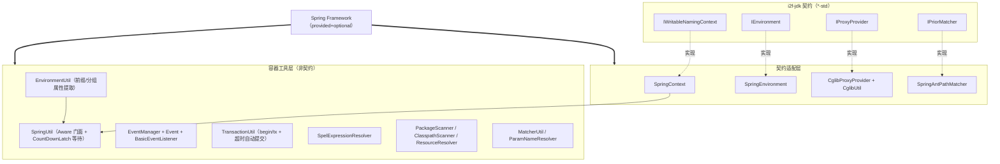

# i2f-spring-core

> **Spring Framework 基础能力到 i2f-jdk 契约的桥接基座**（22 主源约 1400 行、**零单元**测试）：把 `spring-core`/`spring-context`/`spring-tx`（均 `provided + optional`，版本走根 DM 的 `${spring.version}`，**非硬编码**）的能力收敛为四类 i2f 契约实现——`SpringContext`→`IWritableNamingContext`、`SpringEnvironment`→`IEnvironment`、`CglibProxyProvider`→`IProxyProvider`、`SpringAntPathMatcher`→`IPriorMatcher`——并附带 `SpringUtil`（容器门面）、`EnvironmentUtil`（属性分组/前缀提取）、`EventManager`/`Event`（应用事件）、`TransactionUtil`（手动事务 + 超时自动提交）、`SpelExpressionResolver`（SpEL 求值）、`PackageScanner`/`ClasspathScanner`/`ResourceResolver`（扫描与资源）等工具。是 `i2f-spring` 组最 foundational 的模块，被十余个 starter 依赖，核心装配方为 `i2f-springboot-spring-starter.SpringCoreAutoConfiguration`。

## 模块路径

`i2f-spring/i2f-spring-core`（artifactId `i2f-spring-core`，groupId 继承 `i2f.turbo`，版本 `1.0-jdk8`）。

本模块是 `i2f-spring` 组（8 模块：all/authentication/core/mvc-metadata/redis/security/swl/web）里的**基座件**，与同组仅 1 类的 `i2f-spring-authentication` 形成极端对比：它有 22 个主源文件、横跨 9 个子包（`core`/`enviroment`/`event`/`matcher`/`param`/`resource`/`scanner`/`spel`/`tx`/`cglib`），几乎把「在 Spring 容器里干活常用的一切」都各写了一层薄封装。它**不含任何第三方库版本硬编码**——Spring 三件套版本由父 pom `i2f-spring` 的 dependencyManagement（`${spring.version}`）统一裁决，与 extension 组普遍硬编码版本的做法不同。

包结构上有一处**长期拼写缺陷**：环境相关类落在 `i2f.spring.enviroment`（漏了字母 `n`，正解应为 `environment`），`EnvironmentUtil`、`SpringEnvironment` 均在此畸形包名下，已被外部 import 固化。

## 模块依赖

`pom.xml` 声明的依赖：

| 依赖 | 版本来源 | scope | 说明 |
| --- | --- | --- | --- |
| `org.projectlombok:lombok` | 根 DM | 默认(provided) | `@Data`/`@NoArgsConstructor` |
| `org.springframework:spring-core` | `${spring.version}`(父 DM) | provided + optional | `AntPathMatcher`/`ParameterNameDiscoverer`/`LocalVariableTableParameterNameDiscoverer` |
| `org.springframework:spring-context` | 父 DM | provided + optional | `ApplicationContext`/`Environment`/事件/`ClassPathScanningCandidateComponentProvider`/SpEL |
| `org.springframework:spring-tx` | 父 DM | provided + optional | `PlatformTransactionManager`/`TransactionStatus`/`TransactionDefinition` |
| `i2f.turbo:i2f-proxy-std` | `${i2f.version}` | compile | `IProxyProvider`/`IProxyInvocationHandler`/`IProxyHandler` 契约 |
| `i2f.turbo:i2f-environment-std` | `${i2f.version}` | compile | `IEnvironment` 契约 |
| `i2f.turbo:i2f-context-std` | `${i2f.version}` | compile | `IWritableNamingContext` 契约 |
| `i2f.turbo:i2f-match-std` | `${i2f.version}` | compile | `IPriorMatcher` 契约 |

要点：Spring 三件套 **`provided`+`optional` 双标**——编译期可用、既不传递给下游也不打进 jar，运行期由消费方（starter）自带的 Spring 提供，因此本模块可同时服务 JDK8/JDK17 两套 Spring 版本。四个 `i2f-*-std` 内部契约是 compile，故其 api 会传递给消费者。`CglibProxyInvocationHandlerAdapter` 还 import 了 `i2f.invokable.IInvokable`/`JdkMethod`（来自 `i2f-invokable`），但该依赖未在 pom 显式声明，靠 `i2f-proxy-std` 的传递依赖引入（隐性依赖，见瑕疵）。

## 模块设计

模块按「契约适配」与「容器工具」两条线组织，可视为 Spring 之上的一层可替换 facade：



关键设计模式：

- **Aware + CountDownLatch 双检等待**：`SpringUtil` 同时实现 `ApplicationContextAware`/`BeanFactoryAware`/`EnvironmentAware`/`ResourceLoaderAware`，每个被注入的对象配一个 `CountDownLatch(1)`，`getXxx()` 先 `latch.await()` 再返回——意图是「在容器尚未回调前阻塞等待」，把静态早期访问的时序问题交给闩锁。`SpelExpressionResolver` 用同样的单闩锁模式。
- **契约可替换**：四个适配类让上层拿到的是 i2f 自己的 `I*` 接口而非 Spring 类型，理论上可换非 Spring 实现（extension 组里就有平行的 `i2f-extension-cglib`）。
- **函数式事务模板**：`TransactionUtil` 内置 `TxFunction/TxExecute/TxConsumer/TxSupplier` 四个 `throws Throwable` 的函数式接口，配合 `begin*` 多重载 + `rollbackFor` 可变参数做声明式回滚判定。

## 模块目的

在 Spring 环境里为整个 i2f 生态提供**统一、契约化、易取用**的基础设施入口：

1. 让跑在 Spring 管理之外的代码（工具类、SPI、框架内部）也能拿到容器句柄、当前环境配置、发布/监听事件、执行手动事务、求值 SpEL——即「Spring 能力的静态/半静态访问点」。
2. 让 Spring 的关键对象（上下文、环境、代理、路径匹配）以 i2f-jdk 定义的标准契约暴露，屏蔽 Spring 类型，支撑「换框架不换业务代码」的架构意图。
3. 收敛重复样板：属性前缀/分组提取、ANT 路径匹配、classpath 扫描、参数名解析等各处高频小工具集中一处。

## 模块功能

- **`SpringContext`**（96 行）：`implements IWritableNamingContext`，以 `ApplicationContext` 为底提供 `getBean`/`getBeans`/`getAllBeans(Map)`/`addBean`(autowire+registerSingleton)/`removeBean`(removeBeanDefinition)。
- **`SpringUtil`**（225 行）：容器总门面——四大 Aware 注入并闩锁保护，暴露 `getBean(名/类/名+类)`、`getBeans(类)`、`getResource`、`getValue`、`getEnvironmentMap`/`getPropertiesWithPrefix`、`registerBean`/`registerSingletonBean`/`removeBean`、`makeAutowireSupport`。
- **`EnvironmentUtil`**（246 行）：把 `Environment` 拍平为 `Map<源名, Map<key,value>>`（`getEnvironmentProperties`），支持 `getPropertiesWithPrefix(keepPrefix,prefix)` 前缀提取、`getGroupMapConfigs(groupPrefix)` 分组（如 `spring.datasource.{master|slave}.url`）、类型化 `getInt/getLong/getDouble/getFloat/getBoolean/getArray`。`SpringEnvironment`（73 行）是其面向 `IEnvironment` 契约的孪生实现。
- **事件族**：`Event extends ApplicationEvent`（携带 `code/msg/data/kvs/date`，链式 builder），`EventManager` 发布（`publish(code,msg,data)` 等重载），`BasicEventListener<T extends Event>` 抽象适配 `onApplicationEvent`→`handle(code,msg,data,event)`。
- **`TransactionUtil`**（256 行）：手动事务；`begin*[Timeout]` 系列 + `tx(status?, task)` 模板；`autoCommitTx` 用 `ScheduledExecutorService(30)` 在超时后自动 `commit`；`rollbackFor` 类型判定 `isRollbackTypeOf`。`IsolationLevel`/`PropagationBehavior` 枚举包装 Spring 常量，`TxUnhandledException` 统一包装。
- **`SpelExpressionResolver`**（73 行）：以容器为根对象的 SpEL 求值，`getValue/getString/getInt/...`，`BeanFactoryAccessor` 支持 `@bean` 引用，`${...}` 模板解析。
- **匹配**：`SpringAntPathMatcher`（`implements IPriorMatcher`，`PATH`/`PKG` 两常量分隔符，`matchRate` 去通配符估算匹配度）、`MatcherUtil`（静态 `antUrlMatched`/`antPkgMatched`/`*Any`）。
- **扫描/资源**：`PackageScanner`（`PathMatchingResourcePatternResolver` + `CachingMetadataReaderFactory`，`scanClasses`/`scanClassesExtendsFrom`/`scanClassesWithAnnotation`）、`ClasspathScanner`（`ClassPathScanningCandidateComponentProvider` 版）、`ResourceResolver`（逗号分隔多 location 解析）、`ParamNameResolver`（`LocalVariableTableParameterNameDiscoverer`）。
- **cglib**：`CglibProxyProvider`/`CglibUtil`（Spring 重打包的 `org.springframework.cglib.proxy.Enhancer`）+ `CglibProxyInvocationHandlerAdapter` 把 i2f `IProxyInvocationHandler` 桥到 cglib `MethodInterceptor`。

## 模块主要使用方法

装配方 `SpringCoreAutoConfiguration` 用一行开关注入全部核心 Bean（`i2f.spring.core.enable` 默认 true）：

```java
// i2f-springboot-spring-starter 内
@ConditionalOnExpression("${i2f.spring.core.enable:true}")
@Import({SpringUtil.class, EnvironmentUtil.class, EventManager.class,
        SpringEnvironment.class, SpringContext.class,
        SpringTransactionUtilConfigurer.class})
public class SpringCoreAutoConfiguration {}
```

典型用法：

```java
// 1) 容器访问：SpringUtil 由 spring-starter 装配，经 SpringContextHolder 或直接注入取用
Object svc = springUtil.getBean("orderService");
Map<String, Object> dsProps = springUtil
        .getEnvironmentPropertiesWithPrefix(false, "spring.datasource.");

// 2) 手动事务（推荐 tx 系列，超时后自动提交兜底）
transactionUtil.tx(transactionUtil.beginTimeout(), () -> {
    userDao.insert(u);
    orderDao.save(o);
    // 抛 Throwable 且命中 rollbackFor 则回滚，否则提交
});

// 3) 发布/监听事件
eventManager.publish(1001, "order.created", orderDto);
// 业务侧继承 BasicEventListener<Event> 覆写 handle(code,msg,data,event)

// 4) 契约化上下文（面向 IWritableNamingContext 编程，不绑 Spring 类型）
springContext.addBean("dynamicTool", toolBean);

// 5) SpEL 求值（以容器为根，@beanName 可引用 Bean）
int v = spelExpressionResolver.getInt("#{@config.maxRetry}");
```

## 模块特性总结

- **基座定位**：`i2f-spring` 组依赖面最广的模块，被 ai-mcp-client/server、ai-starter、ops-starter、security-starter、shiro-starter、spring-starter、swl-starter、xproc4j-starter、gateway-swl-starter 等 10+ 模块引用。
- **版本策略规范**：Spring 三件套 `provided+optional` 且版本走根/父 DM `${spring.version}`，不硬编码，双 JDK 分发友好（bash 四目录 jar 齐全，含 jdk17）。
- **契约优先**：四个 `*Impl` 严格实现 i2f-jdk `*-std` 契约，Spring 类型不外泄给契约消费方。
- **样板工具齐全**：属性分组、ANT 匹配、classpath 扫描、事务模板、SpEL 一站齐备。
- **无 SPI、无资源文件**：全部靠 Spring `@Import`/Aware 装配，非 ServiceLoader。

## 模块瑕疵或错误

以下为静态识别（不实证运行）：

1. **`Event` 构造函数自赋值 bug（高危）**：`Event(Object source)` 第 25 行写 `source = source;`、`Event()` 第 31 行写 `source = null;`——均为**自赋值**（漏 `this.`），字段 `source` 从未被入参赋值；而类又 `@Override getSource()` 返回该字段。结果：即便 `super(source)` 已设置 `ApplicationEvent` 内部源，`event.getSource()` 恒返回 null，依赖事件源的监听器全部拿不到来源。
2. **`EventManager.publish` 双发布 / NPE**：`publish(ApplicationEvent)` 先 `if(publisher!=null) publisher.publishEvent(event)`，随后**无条件** `context.publishEvent(event)`。当 publisher 与 context 同为 ApplicationContext（常见）时**事件被发布两次**、监听器重复触发；当用 `new EventManager(publisher)` 构造而 context 为 null 时**必然 NPE**。
3. **`TransactionUtil` 超时自动提交语义危险 + 线程泄漏**：`tx(...)` 默认走 `beginTimeout()`（3 分钟），调度任务在超时后 `commit(status)`；若业务任务耗时超过 timeout，定时器会**提前提交**，随后任务自身的 `commit`/`rollback` 再次作用于同一 status → Spring 抛 `IllegalTransactionStateException`（事务已完成）。且 `pool = newScheduledThreadPool(30)` 每实例创建、**从不 shutdown**。
4. **`SpringUtil.getResource` 绕过闩锁**：其余 getter 都经 `latch.await()` 保护，唯独 `getResource` 直接读 `resourceLoader` 字段，容器回调前调用可能 NPE，破坏类内一致性约定。
5. **`CglibProxyProvider.proxy` 参数语义误用**：`proxy(Object obj, handler)` 把 `obj` 强转 `(Class<T>) obj` 当作被增强类；`IProxyProvider` 契约首参通常是目标对象，若传实例（非 Class）则 ClassCastException，参数命名与用途矛盾。
6. **共享 Enhancer 并发不安全**：`CglibUtil.DEFAULT_ENHANCER` 为 `static final`，`proxy` 在其中 `setSuperclass`/`setCallback` 后 `create()`；并发创建不同代理时会互相覆盖配置，产生错误代理。`ClasspathScanner.provider` 同理为共享 static，`resetFilters`+`addIncludeFilter` 改全局状态，不同过滤条件并发扫描相互污染。
7. **`EnvironmentUtil.getGroupMapConfigs` 越界**：`int idx = type.indexOf(".")`，当某个 key 恰为 groupPrefix 之后不含 `.`（如 `spring.datasource.master` 无子属性）时 idx=-1，`type.substring(0, -1)` 抛 `StringIndexOutOfBoundsException`。
8. **数值 getter 静默吞异常 / getBoolean 忽略兜底**：`getInt/getLong/getDouble/getFloat` 的 `catch(Exception e){}` 空实现，解析失败无声返回默认值，排障无痕迹；`getBoolean` 对 `Boolean.parseBoolean`（永不抛异常）套 try/catch 是死代码，且当值存在但非 "true" 时返回 false 而非传入的 `def`。
9. **`SpelExpressionResolver` 拆箱 NPE**：`getInt/getLong/getFloat/getDouble/getBool` 直接返回 `getValue(express, 包装类)` 并自动拆箱，表达式结果为 null 时 NPE；`latch.await()` 异常被吞后继续求值。
10. **`TestPackageScanner` 混入 src/main**：`i2f.spring.resource.test.TestPackageScanner` 是一个 `main()` 演示类，随生产 jar 分发，且以 `"com"` 为基包广扫，属演示/死代码；本模块**无任何 JUnit 测试**（无 `src/test`）。
11. **包名拼写缺陷 `enviroment`**：`i2f.spring.enviroment` 漏字母 `n`，已被外部 import 固化难改。
12. **隐性依赖**：`CglibProxyInvocationHandlerAdapter` 依赖 `i2f-invokable`（`IInvokable`/`JdkMethod`）却未在 pom 显式声明，靠传递依赖引入，一旦上游收紧传递即断编译。

## 其他扩展章节

### 模块在生态中的位置

`i2f-spring-core` 是 i2f 从「纯 JDK」（`i2f-jdk`）迈向「Spring 应用」的**第一块基石**：`i2f-jdk` 侧只定义 `IWritableNamingContext`/`IEnvironment`/`IProxyProvider`/`IPriorMatcher` 等契约与纯 JDK 实现，本模块给出 Spring 实现并附赠事件/事务/SpEL/扫描工具。其上，`i2f-springboot-spring-starter` 通过 `SpringCoreAutoConfiguration` 把核心类 `@Import` 为 Bean，再由 `SpringContextHolder` 提供静态访问点，进而被 AI、安全、Shiro、SWL、XProc4J、网关等几乎所有 SpringBoot/SpringCloud starter 消费。它与 extension 组的 `i2f-extension-cglib`（走独立 cglib 库）、`i2f-spring-authentication`（认证出口）分别在代理实现与安全链路上互补，共同构成 Spring 基础设施层。
