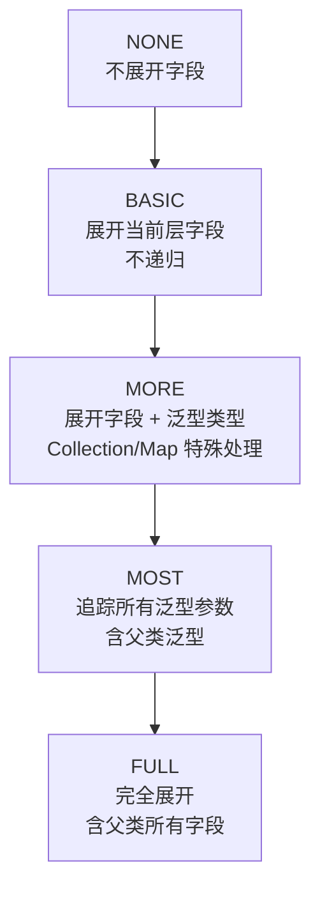

# i2f-spring-mvc-metadata

> 基于反射解析 Spring MVC Controller 的 API 元数据模块，提取 URL、HTTP 方法、参数、返回值、Swagger 注释等信息，为 API 文档生成和前端联调提供结构化数据支撑。

## 模块路径

- `i2f-spring/i2f-spring-mvc-metadata`

## 模块依赖

| GroupId | ArtifactId | Scope | Optional | 说明 |
|---------|-----------|-------|----------|------|
| i2f.turbo | i2f-reflect | compile | false | 反射工具，用于注解查找、字段/方法枚举 |
| i2f.turbo | i2f-match | compile | false | 正则匹配工具，用于 URL 占位符解析 |
| org.projectlombok | lombok | compile | false | 编译期代码生成（@Data） |
| org.springframework | spring-core | provided | true | Spring 核心（Environment、参数名发现） |
| org.springframework | spring-context | provided | true | Spring 上下文（ApplicationContext） |
| org.springframework | spring-web | provided | true | Web 注解（@RequestBody 等） |
| org.springframework | spring-webmvc | provided | true | MVC 注解（@RequestMapping、@GetMapping 等） |
| io.swagger | swagger-annotations | provided | true | Swagger 1.x 注解（@Api、@ApiOperation 等） |

## 模块设计

### 架构设计

本模块采用 **分层解析 + 数据模型** 的架构：

- **工具层**（`SpringMetadataUtil`）：提供 Spring Environment 占位符解析能力
- **数据模型层**（`ApiLine`、`ApiMethod`、`ModuleController`）：定义 API 元数据的结构化表示
- **解析器层**（`ApiMethodResolver`、`ModuleResolver`）：核心逻辑，通过反射将 Java Method/Class 解析为数据模型

### 包结构

```
i2f.spring.mvc.metadata
├── SpringMetadataUtil        # 占位符解析工具
├── api/
│   ├── ApiLine               # 单字段/参数行模型
│   ├── ApiMethod             # API 方法解析结果模型
│   └── ApiMethodResolver     # 方法级解析器（核心，929行）
└── module/
    ├── ModuleController      # Controller 级模块模型
    └── ModuleResolver        # 模块级解析器
```

### 核心设计模式

1. **模板方法模式**：`ApiMethodResolver.parse()` 按固定流程依次调用 `parseBasicMethod()` → `parseMvcMethod()` → `parseSwaggerMethod()` → `parseReturn()` → `parseArguments()`，各步骤可通过 protected 方法覆写扩展。

2. **策略模式（TraceLevel）**：通过枚举 `TraceLevel`（FULL / MOST / MORE / BASIC / NONE）控制类型递归展开深度，不同层级决定泛型/嵌套对象的追踪精度。

3. **组件探测机制**：`componentSupport()` 通过运行时类加载判断 Spring MVC / Swagger 是否可用，实现无侵入的可选依赖适配（所有 Spring/Swagger 依赖为 provided + optional）。

4. **递归 + 访问集防环**：`genLines()` 使用 `visitedTypeSet` 防止自引用类型导致无限递归。

### 泛型解析算法

`genLines()` 和 `resolveParameterizedType()` 协作完成复杂的 Java 泛型推导：

- 对 `Collection<T>` → 生成 `parent$elem` 节点并递归展开 T
- 对 `Map<K,V>` → 生成 `parent$key` + `parent$value` 节点
- 对 `TypeVariable` → 尝试从外层 `ParameterizedType` 解析实际类型参数
- 对数组类型 → 通过组件类型递归

## 模块目的

1. **API 元数据自动提取**：无需编写额外配置或注解，通过反射自动从 Spring MVC Controller 中提取完整的 API 结构信息。
2. **多框架可选适配**：在无 Spring/Swagger 环境下仍能编译使用，有则自动增强解析。
3. **深度结构展开**：将嵌套 POJO、泛型集合、Map 等复杂类型递归展开为扁平的字段列表（ApiLine），便于前端渲染和代码生成。
4. **为下游工具提供数据基础**：生成的 `ModuleController` / `ApiMethod` 结构可直接对接 API 文档平台、代码生成器、前端 Mock 等工具。

## 模块功能

| 功能 | 入口类/方法 | 说明 |
|------|------------|------|
| 单方法解析 | `ApiMethodResolver.parseMethod(Method)` | 将一个 Controller 方法解析为 `ApiMethod` |
| 深度配置解析 | `ApiMethodResolver.parseMethod(Method, TraceLevel)` | 指定递归展开深度 |
| Controller 类解析 | `ApiMethodResolver.getMvcApiMethods(Class)` | 提取类中所有 MVC API 方法 |
| 模块级解析 | `ModuleResolver.parse(Class)` | 解析整个 Controller 类为 `ModuleController` |
| 批量解析（含环境） | `ModuleResolver.parse(Environment)` | 解析并替换 URL 中的 `${...}` 占位符 |
| Spring 环境解析 | `SpringMetadataUtil.resolveParameters(url, env)` | 解析 URL 中的属性占位符 |
| 类型名生成 | `ApiMethodResolver.getTypeName(Type, boolean, boolean)` | 将 Type 转为可读类型名字符串 |
| 参数排序 | `ApiMethod.sort()` | 基于 order/parent/name 基数排序 |

## 模块主要使用方法

### 1. 解析单个方法

```java
Method method = ...; // Controller 中的目标方法
ApiMethod api = ApiMethodResolver.parseMethod(method);
// 设置 TraceLevel 控制泛型展开深度
ApiMethod api = ApiMethodResolver.parseMethod(method, ApiMethodResolver.TraceLevel.MORE);
```

### 2. 解析整个 Controller

```java
Class<?> controllerClass = UserController.class;
ModuleController module = ModuleResolver.parse(controllerClass);
// module.getMethods() 获取所有 API 方法
// module.getBaseUrl() 获取类级别基础路径
```

### 3. 带 Spring 环境的解析（占位符替换）

```java
@Autowired
private Environment environment;

ModuleController module = new ModuleResolver(controllerClass).parse(environment);
// URL 中的 ${server.prefix:default} 将被替换为实际值
```

### 4. 从 ApplicationContext 获取所有 Controller

```java
Set<Class<?>> controllers = ApiMethodResolver.getSpringMvcControllers(applicationContext);
for (Class<?> clazz : controllers) {
    ModuleController module = ModuleResolver.parse(clazz);
    // ...
}
```

### 注意事项

- Spring 和 Swagger 依赖必须为 `provided` + `optional`，本模块在编译期不强制依赖这些框架，运行时通过类加载探测决定行为。
- `TraceLevel.BASIC`（默认）只展开一层字段，不递归嵌套对象；`FULL` 会追踪所有泛型参数和父类字段。
- 自引用类型（如树形结构）通过 `visitedTypeSet` 防止无限递归。

### TraceLevel 层级说明



## 模块特性总结

- **零配置反射解析**：自动识别 Spring MVC 所有 Mapping 注解（@RequestMapping、@GetMapping、@PostMapping、@PutMapping、@DeleteMapping、@PatchMapping）
- **Swagger 注释兼容**：自动提取 @Api、@ApiOperation、@ApiParam、@ApiModelProperty 等注解中的文档信息
- **泛型深度展开**：支持 Collection\<T\>、Map\<K,V\>、TypeVariable、ParameterizedType 等复杂泛型的递归展开
- **CGLIB 代理兼容**：自动识别并去除 `$$EnhancerBySpringCGLIB` 后缀获取原始类
- **URL 占位符解析**：支持 `${property:default}` 格式的 Spring 属性占位符
- **类/方法注解合并**：自动合并类级别 @RequestMapping 的 path、method、consumes、products 到方法级别
- **字段排序**：基于 order → parent → name 的基数排序保证结果稳定
- **模块/方法级排序**：`ApiMethod.sort()` 提供参数和返回值的结构化排序
