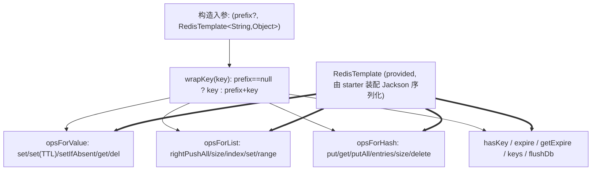

# i2f-spring-redis

> **`IRedisClient` 契约的 Spring Data Redis 适配器**（全模块仅 1 个主源文件 `SpringRedisClient` 约 192 行、无测试、无 SPI、无资源）：把 `i2f-extension-redis-api` 定义的字符串型 Redis 统一客户端契约（KV/TTL/setIfAbsent/List/Hash 共 21 个方法）落地到 Spring 的 `RedisTemplate<String, Object>` 之上，并附带一个可选的 `prefix` 键前命名空间。它是「i2f 通用 Redis 契约」与「Spring Data Redis 实现」之间的桥接件，真实消费方为 `i2f-springboot-redis-starter`。

## 模块路径

`i2f-spring/i2f-spring-redis`（artifactId `i2f-spring-redis`，groupId 继承 `i2f.turbo`，版本 `1.0-jdk8`）。

本模块是 `i2f-spring` 组里一个**单类桥接件**：整个 `i2f.spring.redis` 包只落地一个类 `SpringRedisClient`，它 `implements i2f.extension.redis.api.IRedisClient`，内部持有一个 `RedisTemplate<String, Object>` 与一个可选 `prefix`，把契约方法逐一翻译为 Spring Data 的 `opsForValue()` / `opsForList()` / `opsForHash()` / `expire` / `delete` 等操作。对外不提供静态门面或枚举，仅通过 `IRedisClient` 契约被上层消费。全模块 1 主源、约 192 行、零单元测试、无 `src/test`、无 SPI 注册、无资源文件。

> 说明：`IRedisClient` 契约本身属于 `i2f-extension-redis-api`（纯接口、不依赖 Spring），与本模块配套的还有 `i2f-extension-redis-cache`（`RedisCache`，基于该契约实现 `i2f-cache` 的分布式缓存），二者共同构成「Redis 契约 + Spring 落地 + 缓存语义」链路。

## 模块依赖

`pom.xml` 声明 4 个依赖：

- `org.projectlombok:lombok`（**声明但源码未使用**——本类无任何 lombok 注解，纯 POJO 手写构造器，属冗余声明）。
- `i2f.turbo:i2f-cache`（compile）——本类源码未直接引用 `i2f-cache` 类型；它是为配套 `i2f-extension-redis-cache` 的消费场景而透传的隐性依赖，对本模块编译非必需。
- `i2f.turbo:i2f-extension-redis-api`（compile）——提供 `IRedisClient` 接口，是本类实现的契约来源。
- `org.springframework.data:spring-data-redis:2.3.5.RELEASE`（`provided`）——提供 `RedisTemplate` / `RedisConnection`；**版本硬编码 `2.3.5.RELEASE` 且未走根 pom `dependencyManagement`**（与同组 `i2f-spring-core` 把 spring 依赖统一交由 `${spring.version}` DM 管理的规范做法不一致），也**未标注 `optional`**（但 `provided` 已使其不传递）。

构建用 `maven-assembly-plugin`（`addMavenDescriptor=true`），与本族其它模块一致。

## 模块设计

`SpringRedisClient` 采用「一个模板 + 一个前缀 + 契约方法直通」的最简适配结构，没有连接管理、序列化配置或异常包装——这些全部下沉给注入进来的 `RedisTemplate`（由 starter 侧 `RedisTemplateAutoConfiguration` 装配 Jackson 序列化）。



设计上有一条贯穿主线：几乎所有对外方法都以 `wrapKey(key)` 得到实际 Redis 键，从而实现「同一套模板可按前缀划分命名空间」；唯一例外是 `flushDb()`（直接清空整库，不受前缀约束）。List 与 Hash 的返回值统一经 `String.valueOf(...)` 归一为 `String`（`null` 保留为 `null`）。

## 模块目的

- 让不依赖 Spring 的业务代码可以面向 `IRedisClient` 这一纯 JDK 契约编程，而在 Spring 环境里用 `SpringRedisClient` 一行 `new SpringRedisClient(prefix, redisTemplate)` 即完成落地，实现「契约与 Redis 客户端实现解耦」。
- 复用 Spring Boot 生态已配好的 `RedisTemplate`（连接池、序列化、命令封装），无需为本仓库另起 Lettuce/Jedis 直连适配。
- 提供轻量 `prefix` 命名空间能力，便于多应用共用一个 Redis 实例时隔离键。

## 模块功能

`IRedisClient` 的 21 个方法全部落地，按底层 API 分四组：

- **键与 TTL**：`hasKey`、`expire`、`getExpire`（返回原始秒值，key 不存在/无 TTL 时分别为 `-2`/`-1`，未做语义归一）、`keys`（模式匹配）、`flushDb`。
- **String（`opsForValue`）**：`set(key,val)`、`set(key,val,timeOutSecond)`（`timeOutSecond>=0` 带 TTL，否则永久）、`setUnique`（`setIfAbsent`，即 SETNX + 可选 TTL）、`get`、`del`（先 `get` 旧值再 `delete`，返回旧值）。
- **List（`opsForList`）**：`listPush`（`rightPushAll`）、`listLength`、`listAll`（`range(0, size)`）、`listAt`（`index`）、`listSet`（先读旧值再 `set`）。
- **Hash（`opsForHash`）**：`hashSet`（put 后返回 size）、`hashGet`、`hashSetMap`（putAll）、`hashGetAll`（entries）、`hashSize`、`hashDelete`。

## 模块主要使用方法

典型装配发生在 `i2f-springboot-redis-starter`，业务侧只注入 `IRedisClient` 契约即可：

```java
// starter 侧：RedisCacheConfiguration 以 @ConditionalOnMissingBean 注册
@Bean
public IRedisClient redisClient() {
    // clientPrefix 来自配置 i2f.spring.redis.redis-cache.client-prefix
    return new SpringRedisClient(clientPrefix, redisTemplate);
}

// 业务侧：面向契约编程，与 Spring/RedisTemplate 完全解耦
@Autowired
private IRedisClient redis;

public void demo() {
    redis.set("user:1", "tom", 300);        // 带 300s TTL
    String v = redis.get("user:1");          // "tom"
    boolean ok = redis.setUnique("lock:a", "1", 10); // SETNX 抢锁
    redis.hashSet("cfg", "k1", "v1");
    Map<String, String> all = redis.hashGetAll("cfg"); // 见下方瑕疵：当前恒为空
}
```

也可在任意持有 `RedisTemplate<String,Object>` 的地方手工 `new SpringRedisClient(template)`（此时 `prefix` 为 `null`，键不加前缀）。

## 模块特性总结

- **纯契约直通**：类本身不含状态机/连接管理，21 方法几乎一比一映射 Spring Data API，可读性高、维护面小。
- **前缀命名空间**：`wrapKey` 统一收口，一处控制全类键隔离，缺省（单参构造）优雅降级为不加强前。
- **契约与实现解耦**：依赖方向为「本模块 → redis-api（接口）」，业务只认 `IRedisClient`，与 `i2f-extension-redis-cache` 的 `RedisCache`、以及潜在的非 Spring 实现可互换。
- **复用 Spring 基建**：连接池、命令编解码、Jackson 序列化全部交给注入的 `RedisTemplate`，本模块零配置负担。

## 模块瑕疵或错误

以下为静态识别（不实证运行）：

1. **`hashGetAll` 恒返回空 map，且可能在迭代中抛 `ConcurrentModificationException`**（最严重）：`SpringRedisClient` 第 173–181 行新建 `LinkedHashMap ret` 却从不写入 `ret`；循环体内 `map.put(String.valueOf(entry.getKey()), ...)` 是对**正在 `entrySet()` 遍历的源 map** 做结构性修改（且键类型由 `Object` 换成 `String`），最终 `return ret` 永远是空表。正确实现应是 `ret.put(...)` 且不应回写源 `map`。该方法对外完全不可用。
2. **`listSet` 对 key 二次 `wrapKey`，返回的「旧值」恒取错键**：第 140 行 `listAt(wrapKey(key), index)` 内 `listAt` 又 `wrapKey` 一次，使读旧值时实际访问 `prefix+prefix+key`（一般不存在），返回恒为 `null`；而第 141 行写入用的是单次 `wrapKey(key)`，写是对的——读写键不一致，返回值语义失效。
3. **`flushDb` 连接泄漏 + 潜在 NPE + 越界危险**：第 40 行 `template.getConnectionFactory().getConnection()` 取到的 `RedisConnection` **从不 close**（应经 `RedisConnectionUtils`/`releaseConnection` 或改用 `execute`）；`getConnectionFactory()` 若未配置返回 `null` 即 NPE；且 `flushDb` 清空**整库**、完全无视 `prefix`，在多应用共用实例时可跨命名空间误删。
4. **`del` 非原子且类型不安全**：第 87–88 行先 `get` 后 `delete`，二者之间无原子性（并发下返回值不可靠）；对非 string 类型的键 `opsForValue().get` 会命中错误类型（Redis `WRONGTYPE`）。契约以「返回被删的旧值」为语义但代价是两次往返。
5. **值类型契约与 Object 模板错配**：类以 `String` 为对外类型，但底层 `RedisTemplate<String, Object>` 的 value 由 starter 侧 Jackson 序列化为对象。若同一模板被别处以对象写入，本类 `get`/`hashGet` 里的 `String.valueOf(val)` 得到的是 `toString()` 而非原始 JSON，读取语义不稳定。
6. **`listAll` 边界与全量读风险**：第 122–126 行当 `size==null` 时用 `(long) Integer.MAX_VALUE` 作 `range` 终点，等价于无界全量读取，大列表下有 OOM/阻塞风险；`range(0, size)`（含端点）本身也是 size+1 的语义（虽被 Redis 截断，仍属 off-by-one）。
7. **`keys` 用阻塞式 KEYS 命令**：第 100 行 `template.keys(pattern)` 走 Redis `KEYS`，O(N) 且单线程阻塞，生产大库应改 `SCAN`。
8. **依赖版本硬编码、未走根 DM**：`spring-data-redis` 固定 `2.3.5.RELEASE` 且未纳入根 `dependencyManagement`，与同组 `i2f-spring-core` 的规范版本策略不一致，升级 Spring 时易与其他 spring-* 版本脱钩。
9. **`lombok` 与 `i2f-cache` 声明冗余**：本类未使用任何 lombok 注解，源码也未直接引用 `i2f-cache` 类型，两项依赖对编译非必需。
10. **`getExpire` 语义未归一**：直接透传 `-1`（无 TTL）/`-2`（键不存在），调用方需自行判断，易误当作剩余秒数处理。
11. **零测试**：无 `src/test`，上述 1/2/3 等功能性缺陷无任何回归覆盖。

## 其他扩展章节

### 模块在生态中的位置

- **上游契约**：`i2f-extension-redis-api.IRedisClient`（纯接口，`i2f-spring-redis` 与未来的非 Spring 实现共享）。
- **平级配套**：`i2f-extension-redis-cache.RedisCache`（把 `IRedisClient` 包装为 `i2f-cache` 分布式缓存语义，starter 里与 `SpringRedisClient` 串联装配）。
- **真实消费方**：`i2f-springboot-redis-starter.RedisCacheConfiguration`（`@ConditionalOnMissingBean(IRedisClient.class)` 注册本类为 `IRedisClient` Bean）；`i2f-springboot-security-starter`、`i2f-springboot-shiro-starter` 亦依赖本模块以复用 Redis 会话/令牌存储。
- **登记核对**：`i2f-spring/pom.xml:21`、根 `pom.xml:1330-1334`、`i2f-spring-all:33`；`bash` 四目录（backup/deploy × jdk8/jdk17）jar 齐全。
