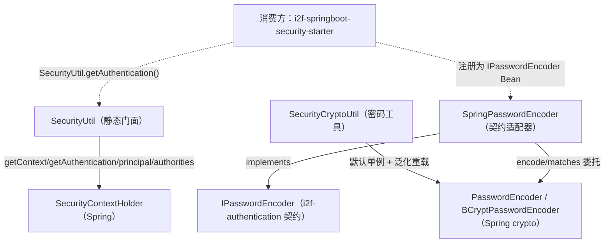

# i2f-spring-security

> **Spring Security 认证上下文与密码编码的极薄工具模块**（全模块仅 3 个主源文件约 92 行、无测试、无 SPI、无资源）：`SecurityUtil` 把 `SecurityContextHolder` 的「取上下文 / 取认证 / 取 principal / 取权限」四步收敛为静态门面，`SecurityCryptoUtil` 提供一个默认 `BCryptPasswordEncoder` 单例与字符编码/匹配静态方法（含可传入任意 `PasswordEncoder` 的泛化重载），`SpringPasswordEncoder` 则把 Spring 的 `PasswordEncoder` 适配到本仓库 JDK 契约 `i2f-authentication` 的 `IPasswordEncoder`。`spring-security-core`/`spring-security-crypto` 均 `provided` 且版本走父 `i2f-spring` pom 的 `${spring.security.version}` DM（非硬编码）。真实消费方为 `i2f-springboot-security-starter`。

## 模块路径

`i2f-spring/i2f-spring-security`（artifactId `i2f-spring-security`，groupId 继承 `i2f.turbo`，版本 `1.0-jdk8`）。

本模块是 `i2f-spring` 组里的**支撑型薄工具件**：整个 `i2f.spring.security` 包只有三个类，职责互不重叠——一个是 Spring Security 上下文读取门面（`SecurityUtil`），一个是密码编码工具（`SecurityCryptoUtil`），一个是把 Spring 编码器接入本仓库统一密码契约的适配器（`SpringPasswordEncoder`）。它不含任何过滤器、认证 Provider 或安全配置（那些在 `i2f-springboot-security-starter`），只提供「被安全 starter 调用」的三块能力。

> 说明：本模块与同组的 `i2f-spring-authentication`（认证结果统一出口控制器）**互补但不相干**——后者负责把登录/鉴权结果 forward 成 `ApiResp`，本模块负责「取当前认证主体」和「密码加解密匹配」，二者被同一个 `i2f-springboot-security-starter` 装配链路串联使用。

## 模块依赖

`pom.xml` 声明三个依赖：

| 依赖 | scope | 版本来源 | 说明 |
| --- | --- | --- | --- |
| `org.springframework.security:spring-security-core` | `provided` | 父 `i2f-spring` pom DM `${spring.security.version}` | `SecurityContextHolder`/`Authentication`/`GrantedAuthority`/`SecurityContext` |
| `org.springframework.security:spring-security-crypto` | `provided` | 父 `i2f-spring` pom DM `${spring.security.version}` | `BCryptPasswordEncoder`/`PasswordEncoder` |
| `i2f.turbo:i2f-authentication` | compile（默认） | 根 pom DM | 提供 `IPasswordEncoder` 契约，被 `SpringPasswordEncoder` 实现 |

**版本策略规范**：与同组 `i2f-spring-core` 一致，Spring Security 依赖版本走父 pom `i2f-spring/pom.xml` 的 `dependencyManagement`（`${spring.security.version}`，L84-94 登记 core 与 crypto），**本模块 pom 不硬编码版本**；但 `provided` **未叠加 `optional`**（详见瑕疵章节），与 `i2f-spring-core` 的 `provided + optional` 双重收敛略有差异。全模块无 lombok、无其它 JDK 模块，依赖面极干净。

## 模块设计

三类各司其职，单向依赖 Spring Security 与 `i2f-authentication` 契约，彼此之间无引用：



- **`SecurityUtil`**：`getSecurityContext()` → `SecurityContextHolder.getContext()`；`getAuthentication()` → `getSecurityContext().getAuthentication()`；`getPrincipal()` 泛型擦除返回 `(T) getAuthentication().getPrincipal()`；`getAuthorities()` 返回 `getAuthentication().getAuthorities()`。
- **`SecurityCryptoUtil`**：`public static BCryptPasswordEncoder bCryptPasswordEncoder`（默认单例）；`bCryptEncode(raw)` / `bCryptMatch(raw, enc)` 走默认单例；`encode(PasswordEncoder, raw)` / `match(PasswordEncoder, raw, enc)` 泛化透传任意编码器。
- **`SpringPasswordEncoder implements IPasswordEncoder`**：`protected PasswordEncoder encoder`（字段初始化为 `new BCryptPasswordEncoder()`）；`public static final BC` 预置实例；无参构造沿用字段默认的 BC，有参构造注入任意 `PasswordEncoder`；覆写 `encode` 与 `matches`，其中 `matches` 直接用 Spring 编码器的 `matches()`（对 BCrypt 这类带随机盐的算法是唯一正确写法）。

## 模块目的

把 Spring Security 中「与业务/框架解耦的两类原子能力」——**读取当前线程安全上下文**与**密码哈希/校验**——提取成本仓库可复用的最小工具，并借 `SpringPasswordEncoder` 把 Spring 的密码编码器接入 i2f 统一的 `IPasswordEncoder` 契约，使上层（如 `i2f-springboot-security-starter`、密码工具）无需直接依赖 Spring Security 类型即可通过契约使用 BCrypt。

## 模块功能

- `SecurityUtil.getSecurityContext()` / `getAuthentication()` / `getPrincipal()` / `getAuthorities()`：线程绑定安全上下文的四步读取。
- `SecurityCryptoUtil.bCryptEncode(raw)` / `bCryptMatch(raw, enc)`：默认 BCrypt 的一键编码与校验。
- `SecurityCryptoUtil.encode(encoder, raw)` / `match(encoder, raw, enc)`：可传入任意 `PasswordEncoder` 的泛化编码/校验。
- `SpringPasswordEncoder`：`IPasswordEncoder` 契约的 Spring 实现，`SpringPasswordEncoder.BC` 提供开箱即用的 BCrypt 单例；`encode`/`matches` 委托底层 `PasswordEncoder`。

## 模块主要使用方法

```java
// 1) 读取当前认证主体（须在 Spring Security 过滤链已填充上下文后调用）
Authentication auth = SecurityUtil.getAuthentication();
UserDetails me = SecurityUtil.getPrincipal();          // 泛型 (T) 强转，需知晓 principal 实际类型
Collection<? extends GrantedAuthority> roles = SecurityUtil.getAuthorities();

// 2) 密码编码/校验（默认 BCrypt）
String enc = SecurityCryptoUtil.bCryptEncode("123456");
boolean ok = SecurityCryptoUtil.bCryptMatch("123456", enc);

// 3) 通过 i2f 统一密码契约使用（推荐，便于替换底层实现）
IPasswordEncoder pe = SpringPasswordEncoder.BC;
String hash = pe.encode("123456");
boolean same = pe.matches("123456", hash);             // 走 Spring BCrypt.matches()，随机盐下仍正确
```

> 注意：`IPasswordEncoder` 接口自带的 `default matches()` 用「重新 encode 再 equals」判定，对 BCrypt 等**每次哈希都不同（含随机盐）**的算法恒返回 false；`SpringPasswordEncoder` 通过**覆写** `matches()` 委托 Spring 编码器的原生 `matches()` 规避了该陷阱。使用其它未覆写 `matches()` 的 `IPasswordEncoder` 实现时须警惕该默认方法缺陷。

## 模块特性总结

- **极简三单例**：92 行覆盖「读上下文 / 编码 / 契约适配」三件事，无状态污染（除一个 public static 编码器，见瑕疵）。
- **版本管理规范**：Spring Security 依赖走父 pom `${spring.security.version}` DM，不硬编码，双 JDK（jdk8/jdk17）友好，四目录 jar 齐全。
- **契约桥接**：`SpringPasswordEncoder` 是 Spring 密码生态与本仓库 `i2f-authentication.IPasswordEncoder` 契约的唯一适配点，使密码能力可跨框架复用。
- **`matches` 覆写正确**：针对 BCrypt 随机盐特性，用 Spring 原生 `matches()` 而非接口的 re-encode 默认实现。

## 模块瑕疵或错误

以下为静态识别（不实证）：

1. **`SecurityUtil.getPrincipal()` / `getAuthorities()` 存在 NPE 级联**：未认证/匿名请求下 `getAuthentication()` 可返回 `null`，直接 `.getPrincipal()` / `.getAuthorities()` 会 NPE；`SecurityUtil` 自身无 null 兜底（消费方 `AuthenticationTokenFilter` 恰好对 `getAuthentication()` 做了 null 判断，但那是调用方的防御，不是本模块的保证）。
2. **`getPrincipal()` 的 `(T)` 为未检查强转**：泛型参数在运行期被擦除，无法校验 principal 真实类型，类型错误会把 `ClassCastException` 延迟到调用方赋值处才暴露。
3. **`SecurityCryptoUtil.bCryptPasswordEncoder` 为 `public static` 且非 `final`**：外部可直接重新赋值，破坏默认编码器单例语义与潜在线程安全（虽 `BCryptPasswordEncoder` 本身线程安全，但字段可被替换成不安全实现）。应为 `private static final`。
4. **两个工具类（`SecurityUtil`、`SecurityCryptoUtil`）无私有构造**：全静态方法却可被实例化，属工具类反模式。
5. **`SpringPasswordEncoder` 的 `BC` 静态实例与无参构造职责重叠**：`public static final BC = new SpringPasswordEncoder(new BCryptPasswordEncoder())`，而无参构造经字段初始化器也得到一个 `BCryptPasswordEncoder`——两条路径产出同构实例，语义冗余，易让调用方困惑该用哪个。
6. **`spring-security-core`/`crypto` 用 `provided` 但未加 `optional`**：与同组 `i2f-spring-core`（`provided + optional`）规范不一致；被 `i2f-spring-all` 聚合时，若下游未显式引入 Spring Security 又误用本模块类，会在运行期 `NoClassDefFoundError`。
7. **`i2f-authentication` 以 compile 传递**：本模块类签名 `implements IPasswordEncoder`，契约类型会传递给下游；虽属必要，但意味着移除 `i2f-authentication` 将破坏编译。
8. **零测试**：密码编码/匹配与安全上下文读取均为安全关键路径，却无任何单元测试或集成测试覆盖。
9. **`SecurityCryptoUtil` 的 `bCrypt*` 便捷方法与泛化 `encode/match` 语义重复**：前者仅是后者的默认参数特化，维护面翻倍（新增编码器类型时两处都要考虑）。

## 模块在生态中的位置

- **上游依赖**：Spring Security（core + crypto，走父 pom DM）、本仓库 JDK 契约模块 `i2f-authentication`（`IPasswordEncoder`）。
- **构建登记**：父 `i2f-spring/pom.xml:22`、根 `pom.xml` DM `:1335-1339`、聚合 `i2f-spring-all:37`；`bash/{backup,deploy}-{jdk8,jdk17}` 四目录 jar 齐全（含 jdk17）。
- **运行期消费方**：`i2f-springboot-security-starter` 的 `AuthenticationTokenFilter` 调 `SecurityUtil.getAuthentication()` 判断当前是否已认证，再决定是否从 token 补建 `Authentication` 并 `setAuthentication` 回上下文；`i2f-tools-encrypt` 的菜单处理器另建了自己的 `BCryptPasswordEncoder` 实例做命令行编码演示（与本模块无直接引用，但同属 Spring crypto 生态）。
- **定位**：`i2f-spring` 安全族里的**最小工具层**——不含过滤器链、Provider 或安全配置，仅向上提供「读上下文 + 编码 + 契约适配」三块原子能力，被安全 starter 组装进完整的认证授权流程。
