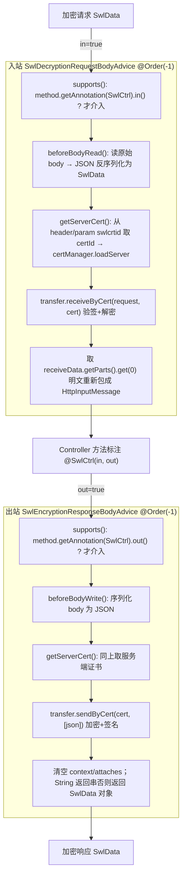

# i2f-spring-swl

> **SWL（Secure Web Layer）透明加解密的 Spring MVC 切面件**（全模块仅 3 个主源文件约 183 行、无测试、无 SPI、无资源）：以两个 `@ControllerAdvice`——`SwlDecryptionRequestBodyAdvice`（`extends RequestBodyAdviceAdapter`，入站解密）与 `SwlEncryptionResponseBodyAdvice`（`implements ResponseBodyAdvice<Object>`，出站加密）——把 `i2f-swl` 的 `SwlExchanger`（RSA+AES 混合加密、时间戳/随机数/签名/数字签名验签）能力接到 MVC 的消息读写管线上，按控制器方法上的 `@SwlCtrl(in/out)` 注解逐个决定是否加解密。全模块**无任何源码级消费方**：`i2f-springboot-swl-starter` 用的是另一套 AOP/WebFilter 实现（`i2f.springboot.swl.spring` 包），并不依赖本模块。

## 模块路径

`i2f-spring/i2f-spring-swl`（artifactId `i2f-spring-swl`，groupId 继承 `i2f.turbo`，版本 `1.0-jdk8`）。

本模块是 `i2f-spring` 组里的一个**独立可选切面件**：`i2f.spring.swl.advice` 包下只落地三个类——`SwlAdviceConfig`（15 行，仅一个 `headerName = "swlcrtid"` 字段）、`SwlDecryptionRequestBodyAdvice`（90 行）、`SwlEncryptionResponseBodyAdvice`（78 行）。两个 Advice 各自 `@Data @Order(-1) @ControllerAdvice`，互不引用，仅共享同包的 `SwlAdviceConfig`。

> 注意与 `i2f-springboot-swl-starter` 的区别：后者位于 `i2f.springboot.swl.spring` 包，通过 `SwlSpringAop` / `SwlSpringWebFilter` / `SwlSpringController` 以 AOP + Filter 的方式实现同样的 SWL 加解密语义，并**不 import 本模块**。本模块走的是 Spring MVC 原生 `RequestBodyAdvice`/`ResponseBodyAdvice` 钩子路线，是并存的第二套实现。

## 模块依赖

`pom.xml` 声明：

- `org.projectlombok:lombok`（provided 语义，随父 DM）。
- `spring-core` / `spring-context` / `spring-web` / `spring-webmvc`：均 `provided + optional`，**版本走父 `i2f-spring` pom 的 `${spring.version}` DM，非硬编码**（与 `spring-core`、`spring-web` 一致的规范做法）。
- `javax.servlet:javax.servlet-api`：`provided + optional`。
- 编译期内部依赖：`i2f-jdk-ext-web`、`i2f-extension-jackson`（提供 `JacksonJsonSerializer`）、`i2f-swl`（提供 `SwlExchanger`/`SwlCertManager`/`SwlData`/`@SwlCtrl`）。

> `i2f-jdk-ext-web` 在本模块三个类中**无任何 import/使用**（`getServerCert` 直接用 `RequestContextHolder` 而非其 `ServletContextUtil`），属冗余声明依赖。`IJsonSerializer` 来自 `i2f-serialize-std`，经 `i2f-extension-jackson` 传递引入。

## 模块设计

两个 Advice 结构高度对称（字段声明与 `getServerCert()` 逐字重复），核心流程如下：



- **触发粒度**：`@SwlCtrl` 可标注在方法或类型上（`@Target({METHOD, TYPE})`，`in()`/`out()` 默认均为 `true`）；`supports()` 只查 `methodParameter.getMethod()` 上的注解，因此**类级 `@SwlCtrl` 不会被识别**（仅方法级生效）。
- **证书定位**：两 Advice 的 `getServerCert()` 先读请求头 `config.getHeaderName()`（默认 `swlcrtid`），为空再回落同名请求参数，交 `SwlResourceCertManager.loadServer(certId)`。
- **数据模型**：统一用 `i2f-swl` 的 `SwlData{header, parts, attaches, context}` 作为传输信封；入站只消费 `parts.get(0)`，出站把密文塞进单元素 `parts` 并清空 `context`/`attaches`。
- **序列化**：`JacksonJsonSerializer`（`i2f-extension-jackson`）负责 `SwlData` 信封的 JSON 读写。

## 模块目的

让已接入 `i2f-swl` 加解密协议的 Web 应用，无需在 Controller 内手写解密/加密样板，只要给方法加 `@SwlCtrl`，即可复用 Spring MVC 的消息转换器钩子完成**透明**的入站解密与出站加密，把「加解密」从业务代码下沉到框架切面层。

## 模块功能

- `SwlDecryptionRequestBodyAdvice`：对 `@SwlCtrl(in=true)` 的方法，把请求体当作 `SwlData` 密文信封解析，用服务端证书 `receiveByCert` 验签解密后，将明文 `parts[0]` 重新包成 `HttpInputMessage` 交后续转换器反序列化为真正的入参对象。
- `SwlEncryptionResponseBodyAdvice`：对 `@SwlCtrl(out=true)` 的方法，把返回值序列化成 JSON，用 `sendByCert` 加密加签成 `SwlData` 信封返回（`String` 返回类型时再序列化为字符串以适配 `StringHttpMessageConverter`）。
- `SwlAdviceConfig`：承载证书定位所用的 header/param 名（默认 `swlcrtid`）。

## 模块主要使用方法

```java
// 1) 让宿主应用组件扫描到 i2f.spring.swl.advice（本模块无 starter 自动装配）
//    例：@SpringBootApplication(scanBasePackages = {"i2f.spring.swl.advice", "com.yourapp"})

// 2) 在控制器方法上标注 @SwlCtrl 即启用透明加解密
@RestController
public class PayController {
    @SwlCtrl(in = true, out = true)
    @PostMapping("/pay/create")
    public PayResp create(@RequestBody PayReq req) {   // req 到达前已被解密
        return payService.create(req);                 // 返回前会被加密成 SwlData
    }
}

// 3) 客户端须在请求头（或同名参数）携带证书 id： swlcrtid=<certId>
//    且请求体须为 SwlData 密文信封 JSON；服务端从 SwlResourceCertManager 载入该 certId 的证书。
```

## 模块特性总结

- 走 Spring MVC 原生 `RequestBodyAdviceAdapter` / `ResponseBodyAdvice` 钩子，与业务代码零耦合，`@Order(-1)` 抢先于常规转换器切面执行。
- 加解密能力完全委托 `i2f-swl` 的 `SwlExchanger`（RSA 加密随机对称密钥 + AES 加密数据 + SHA-256 签名 + RSA 数字签名 + 时间戳窗口/nonce 防重放），本模块只做「信封拆装」。
- 依赖管理规范：Spring 五件套 + servlet-api 全 `provided + optional`，版本走父 DM，双 JDK 友好。
- 纯注解驱动、逐方法开关（`in`/`out` 可分别启停），粒度灵活。

## 模块瑕疵或错误

以下为静态识别（不实证）：

1. **两个 Advice 的字段声明与 `getServerCert()` 逐字重复**：`transfer`/`certManager`/`config`/`jsonSerializer` 及取证书逻辑完全拷贝，未抽公共父类或工具，维护需双改。
2. **每个 Advice 各自 `new` 全套协作者**：`new SwlExchanger()` / `new SwlResourceCertManager()` / `new SwlAdviceConfig()` / `new JacksonJsonSerializer()` 均为硬编码实例化，无一 `@Autowired`，容器无法注入自定义证书管理器或调 `SwlExchanger` 的 `enableEncrypt/enableDigital/enableTimestamp/enableNonce` 等开关（恒用默认全开）。
3. **`@Data` 加在 Advice 上**：为 `transfer/certManager/jsonSerializer` 等生成 getter/setter/`equals`/`hashCode`/`toString`，`toString` 一旦被日志打印可能牵出证书管理器内部状态；且这些 setter 破坏切面协作者封装。
4. **`SwlAdviceConfig` 形同虚设的配置**：`headerName` 默认 `swlcrtid`，但两个 Advice 各持**独立** `config` 实例，改一处不影响另一处；且无外部化途径（无 `@ConfigurationProperties`、无 setter 注入），实际无法按部署调整。
5. **`getServerCert()` 返回值可能为 null**：`SwlResourceCertManager.loadServer(certId)` 找不到证书（或 `certId` 为 null，即 header 和 param 都缺）时返回 null，随后 `transfer.receiveByCert(request, cert)` / `sendByCert(cert, ...)` 立即对 `cert.getCertId()` 解引用 → NPE。
6. **入站 `beforeBodyRead` 无健壮性**：`jsonSerializer.deserialize(json, SwlData.class)` 若 body 非合法 `SwlData` 信封则抛异常/返回 null 后 `.getHeader()` NPE；`receiveData.getParts().get(0)` 在 parts 为空时 `IndexOutOfBoundsException`；**多 part 数据被静默丢弃**（只取第 0 个）。
7. **`RequestContextHolder` 强转 `ServletRequestAttributes`**：在异步/WebFlux/非 servlet 线程下 `getRequestAttributes()` 返回 null 或类型不符 → NPE/ClassCastException。
8. **`@SwlCtrl` 类级注解不生效**：`supports()` 仅读 `getAnnotation` 于方法参数，`@Target` 虽含 `TYPE`，但标在 Controller 类上不会被识别，易误导使用者。
9. **出站 String 分支的类型耦合**：`body instanceof String` 时才回传 JSON 字符串以适配 `StringHttpMessageConverter`，否则回传 `SwlData`；若某方法声明返回 `String` 但期望走 JSON 转换器，行为不一致；`body` 为 null 时 `serialize(null)` 语义未定义。
10. **全模块零测试、无 SPI、无资源**，且 `@ControllerAdvice` 需宿主显式扫描 `i2f.spring.swl.advice` 才生效（本模块无对应自动配置），易被「引了 jar 却不生效」困惑。
11. **分发不全**：`bash/` 下仅 `backup-jdk17`、`deploy-jdk8`、`deploy-jdk17` 三目录有 jar，**缺 `backup-jdk8`**（不同于同组多数模块的四目录齐全）。
12. **`i2f-jdk-ext-web` 为冗余依赖**（本模块未使用其任何类）。

## 其他扩展章节

### 模块在生态中的位置

`i2f-spring` 组的**注解驱动安全传输切面**，是 `i2f-swl` JDK 加解密协议在 Spring MVC 侧的两种落地之一（另一种是 `i2f-springboot-swl-starter` 的 AOP/Filter 路线）。登记于 parent `i2f-spring/pom.xml:23`、根 `pom.xml` DM `:1340-1344`、`i2f-spring-all:41`。因走 `@ControllerAdvice` 组件扫描路线且无配套 starter，本模块在仓库内**没有任何跨模块消费方**，仅随 `i2f-spring-all` 聚合分发，实际启用与否完全取决于宿主应用的组件扫描范围与 `@SwlCtrl` 标注。
