# i2f-spring-web

> **Spring Web MVC / WebFlux 能力工具箱 + `i2f-network` REST 契约的 RestTemplate 落地**（13 主源约 1250 行、无测试、无 SPI、无资源，横跨 mvc/mapping/file/proxy/rest/webflux/wrapper 七子包）：`SpringMvcUtil`/`WebfluxContextUtil` 把命令式与响应式两套请求上下文收敛为静态门面，`MappingUtil` 为 `RequestMappingHandlerMapping` 建 path→HandlerMethod 快速索引供网关/运维拦截反查，`HttpFileUtil` 桥接 `i2f-jdk-ext-web` 的下载/断点续传，`HttpProxyHandler`+`HttpProxyFilter` 是一套可配置的反向代理，`SpringWebRestClient`/`SpringWebHttpProcessor`/`SpringWebAutoHttpRequestBodyHandler` 把 `i2f-network` 的抽象 REST 契约（`IRestClient`/`IHttpProcessor`）落地到 Spring `RestTemplate`，三个 `*MultipartFile` 提供内存/文件/临时文件三种 `MultipartFile` 适配。spring-core/context/web/webmvc/webflux + javax.servlet-api 全 `provided + optional` 且版本走父 `i2f-spring` pom DM `${spring.version}`（非硬编码，与同组 `spring-core` 一致的规范做法）。真实消费方为 `i2f-springboot-http-proxy-starter`（装配代理）与 `i2f-springboot-ai-mcp-client`（用 `SpringWebRestClient`）。

## 模块路径

`i2f-spring/i2f-spring-web`（artifactId `i2f-spring-web`，groupId 继承 `i2f.turbo`，版本 `1.0-jdk8`）。

本模块是 `i2f-spring` 组里 **Web 层的横切工具箱**（非单一契约桥接，也非单一第三方封装）：把「拿当前 request/response/session/cookie/ip」「反查请求命中的 Controller 方法」「文件下载与断点续传」「HTTP 反向代理」「REST 客户端」「MultipartFile 包装」「响应式上下文取值」等 Web 关切点，各自收敛为一个静态工具类或一套适配器，统一构建在 Spring Web（servlet 栈 + reactive 栈）与自研 `i2f-jdk-ext-web` / `i2f-network` 之上。全模块 **13 个主源文件约 1250 行**，无任何单元测试、无 SPI 注册、无资源文件。

## 模块依赖

`pom.xml` 直接依赖：

| 依赖 | scope | 说明 |
| --- | --- | --- |
| `org.projectlombok:lombok` | 默认（编译期） | `@Data`/`@NoArgsConstructor` |
| `org.springframework:spring-core` | `provided + optional` | `StreamUtils`/`StringUtils`/`MultiValueMap`/`LinkedMultiValueMap` 等 |
| `org.springframework:spring-context` | `provided + optional` | 上下文（本模块实际少用） |
| `org.springframework:spring-web` | `provided + optional` | `RestTemplate`/`RequestEntity`/`HttpEntity`/`ClientHttpRequest(Factory)`/`InputStreamResource`/`RequestPath` |
| `org.springframework:spring-webmvc` | `provided + optional` | `RequestMappingHandlerMapping`/`RequestMappingInfo`/`HandlerMethod`/`PathPattern`/`RequestContextHolder` |
| `org.springframework:spring-webflux` | `provided + optional` | `ServerHttpRequest`（`WebfluxContextUtil` 用） |
| `javax.servlet:javax.servlet-api` | `provided + optional` | `HttpServletRequest/Response`/`Filter`/`Cookie`/`HttpSession`/`MultipartFile` |
| `i2f.turbo:i2f-mutator` | 默认（compile） | `BaseMutator`（`SpringWebRestClient` 流式 set） |
| `i2f.turbo:i2f-jdk-ext-web` | 默认（compile） | `ServletContextUtil`/`ServletResponseUtil`/`ServletFileUtil`（MVC/下载真正的 servlet 底座） |
| `i2f.turbo:i2f-extension-jackson` | 默认（compile） | `JacksonJsonSerializer`（`respJsonObj` 序列化） |
| `i2f.turbo:i2f-network` | 默认（compile） | `IRestClient`/`IHttpProcessor`/`IHttpRequestBodyHandler`/`IHttpResponseExtractor` 及 `HttpRequest/Response`/`HttpHeaders`/`RestHttp*` 数据体 |

Spring 系列与 servlet-api 版本**全部走父 `i2f-spring/pom.xml` 的 `dependencyManagement`**（`${spring.version}`、`javax.servlet-api` 固定 `4.0.1`），本模块 pom 内不写版本号，与同组 `spring-core` 一致（规范），不同于 extension 组大量「硬编码 provided」。

## 模块设计

七个子包各司其职，彼此**基本不互相引用**（`SpringMvcUtil` 内部复用 `ServletContextUtil`，`HttpFileUtil` 复用 `ServletFileUtil`，均下沉到 `i2f-jdk-ext-web`）：

```mermaid
flowchart TD
    subgraph SPRING["Spring Web（provided + optional, 版本走父 DM）"]
        MVC["spring-webmvc / RequestMappingHandlerMapping · RequestContextHolder"]
        WEB["spring-web / RestTemplate · ClientHttpRequest · InputStreamResource"]
        REACTIVE["spring-webflux / ServerHttpRequest"]
        SERVLET["javax.servlet-api / HttpServletRequest · Filter · MultipartFile"]
    end

    subgraph I2F["i2f 底座"]
        EXTWEB["i2f-jdk-ext-web / ServletContextUtil · ServletResponseUtil · ServletFileUtil"]
        NET["i2f-network / IRestClient · IHttpProcessor 契约"]
        JACKSON["i2f-extension-jackson / JacksonJsonSerializer"]
    end

    subgraph THIS["i2f-spring-web 七子包"]
        MVCU["mvc.SpringMvcUtil 静态门面"]
        MAPU["mapping.MappingUtil 路由反查"]
        FILEU["file.HttpFileUtil 下载桥接"]
        PROXY["proxy.HttpProxyHandler + HttpProxyFilter 反向代理"]
        REST["rest.SpringWebRestClient / HttpProcessor / BodyHandler"]
        WFLUX["webflux.WebfluxContextUtil 响应式取值"]
        WRAP["wrapper.*MultipartFile 三种实现"]
    end

    MVCU -->|"取 req/resp/session/forward/respJson"| EXTWEB
    MVCU -->|"JacksonJsonSerializer 序列化"| JACKSON
    MAPU -->|"建 path→Handler 索引"| MVC
    FILEU -->|"下载/断点续传"| EXTWEB
    FILEU -->|"ResponseEntity 流式下载"| WEB
    PROXY -->|"SimpleClientHttpRequestFactory 转发"| WEB
    PROXY -->|"Filter 挂载"| SERVLET
    REST -->|"RestTemplate.exchange/execute"| WEB
    REST -->|"实现 IRestClient/IHttpProcessor"| NET
    WFLUX -->|"读 header/cookie/ip"| REACTIVE
    WRAP -->|"implements MultipartFile"| SERVLET
```



- **mvc**：`SpringMvcUtil` 以 `RequestContextHolder.getRequestAttributes()` 拿当次请求，再委派 `i2f-jdk-ext-web.ServletContextUtil` 完成 session/cookie/headers/forward/redirect/contextBaseUrl 等；`respJson*` 委派 `ServletResponseUtil`。
- **mapping**：`MappingUtil` 包住 `RequestMappingHandlerMapping`，构造时 `initFastMapping()` 建 `patternString → 不可变 Map<RequestMappingInfo,HandlerMethod>` 索引，`getRequestMapping(request)` 先按精确 path 命中桶再 `getMatchingCondition` 逐条匹配，miss 则回落全量扫描。
- **file**：`HttpFileUtil` 直接转调 `ServletFileUtil`（断点续传/流式/附件/404），另提供一个用 Spring `ResponseEntity<InputStreamResource>` 的流式下载与 `MultipartFile` 落盘。
- **proxy**：`HttpProxyHandler.mapping(prefix,target)` 累积映射，`accept(request)` 按前缀匹配，`proxy(...)` 用 `SimpleClientHttpRequestFactory` 重建请求、搬运 header/body、把响应回写；`HttpProxyFilter` 以「请求属性打标记防重入」的方式在过滤器链里拦截并代理。
- **rest**：`SpringWebRestClient`（`IRestClient`，走 `exchange`）与 `SpringWebHttpProcessor`（`IHttpProcessor`，走 `execute` + 自定义 `RequestCallback`/`ResponseExtractor`），`SpringWebAutoHttpRequestBodyHandler` 按 body 类型（表单+文件/byte[]/InputStream/POJO）选合适的 `HttpMessageConverter` 写出。
- **webflux**：`WebfluxContextUtil` 对响应式 `ServerHttpRequest` 提供 token/cookie/headers/userAgent/多级代理 IP 解析。
- **wrapper**：`MultipartFileWrapper`（包装真实上传件并 spool 到临时文件）、`ByteArrayMultipartFile`（字节数组）、`FileMultipartFile`（磁盘文件）三种 `MultipartFile` 实现。

## 模块目的

为基于 Spring Web 的应用提供一组**与 i2f 生态对齐的 Web 通用能力**：一是把「取当前请求上下文、下载、路由反查、响应式取值」等重复劳动收敛为静态门面，屏蔽 servlet/reactive 两套 API 差异并复用 `i2f-jdk-ext-web` 已有实现；二是**让 `i2f-network` 的抽象 REST 客户端契约能在 Spring 环境里以 `RestTemplate` 落地**，使依赖 `IRestClient`/`IHttpProcessor` 的上层（如 ai-mcp）无需直接触碰 Spring；三是附带一套**零依赖 Spring Cloud Gateway 的轻量反向代理**，供 starter 以纯 `Filter` 形式挂载。

## 模块功能

- `SpringMvcUtil.getRequest/getResponse/getSession/getCookie/getHeaders/getServletContext/getContextPath`：静态获取当前 Web 上下文对象。
- `SpringMvcUtil.forward/include/redirect`、`sessionSet/sessionGet/requestSet/requestGet`、`respJson/respJsonObj/getContextBaseUrl`：请求转发/重定向、作用域读写、JSON 响应渲染、服务基址。
- `MappingUtil.getRequestMapping/getRequestMappingHandlerMethod/getRequestMappingMethod`：由 `HttpServletRequest` 反查命中的 `RequestMappingInfo`/`HandlerMethod`/`Method`（供网关鉴权、运维埋点、文档等按请求定位目标方法）。
- `HttpFileUtil.downloadFileRangeSupport/responseFileInStreamMode/responseAsFileAttachment/responseFileAttachment/responseNotFileFound/saveMultipartFile2ContextPath/getMultipartFileName`：断点续传/流式/附件下载与上传落盘。
- `HttpProxyHandler.build().mapping(...).handle(req,resp)` + `HttpProxyFilter`：按前缀映射把请求透传到目标服务并回写响应。
- `SpringWebRestClient.rest(request, responseType)` / `SpringWebHttpProcessor.http(request[, extractor])`：`i2f-network` 契约的 Spring 实现，统一出入参数据体。
- `WebfluxContextUtil.getToken/getCookie/getHeaders/getUserAgent/getIp/getPossibleValue`：响应式请求上下文取值。
- `MultipartFileWrapper`/`ByteArrayMultipartFile`/`FileMultipartFile`：把临时文件/字节数组/`File` 适配为 Spring `MultipartFile`。

## 模块主要使用方法

```java
// 1) MVC 静态门面（须在请求线程内）
HttpServletRequest req = SpringMvcUtil.getRequest();
SpringMvcUtil.respJsonObj(ApiResp.success(data));

// 2) 反向代理装配（i2f-springboot-http-proxy-starter 即此写法）
HttpProxyHandler handler = HttpProxyHandler.build()
        .mapping("/proxy", "http://192.168.1.20:6633");
// starter 把它包成 FilterRegistrationBean<HttpProxyFilter>，urlPatterns=/* order=-1

// 3) i2f-network REST 契约的 Spring 落地（i2f-springboot-ai-mcp-client 即此写法）
IRestClient client = new SpringWebRestClient(new RestTemplate());
RestHttpResponse<Foo> resp = client.rest(
        new RestHttpRequest().setUrl("http://svc/api").setMethod("GET"), Foo.class);

// 4) 路由反查（网关/运维按 request 定位 Controller 方法）
Method m = new MappingUtil(requestMappingHandlerMapping).getRequestMappingMethod(request);

// 5) 把字节数组当作上传件
MultipartFile mf = new ByteArrayMultipartFile("avatar.png", bytes);
```

代理转发核心：`HttpProxyFilter.doFilter` 先给请求打 `FILTER_KEY` 属性防重入，命中 `HttpProxyHandler.handle` 且成功即终止过滤器链，否则放行 `chain.doFilter`。

## 模块特性总结

- **横切工具箱而非单点桥接**：一个模块内并列七类互不依赖的 Web 能力，粒度差异大（35 行的工具类到 144 行的代理）。
- **依赖管理规范**：Spring/servlet 全 `provided + optional` 且版本交父 DM `${spring.version}`，双 JDK（jdk8/jdk17）友好，是本仓库里少数「无硬编码版本」的 Spring 侧模块。
- **servlet 与 reactive 双栈覆盖**：`SpringMvcUtil`（命令式）与 `WebfluxContextUtil`（响应式）分别服务两类技术栈。
- **契约复用**：MVC/下载能力实际下沉 `i2f-jdk-ext-web`，REST 落地实现 `i2f-network` 抽象，本模块偏「适配 + 组织」而非重造。
- **真实跨模块消费**：被 http-proxy-starter（代理）、ai-mcp-client（REST）以及 spring/ops/limit/swl/ai 等 starter 以依赖形式引用。

## 模块瑕疵或错误

以下均为静态识别（不实证运行）：

1. **`SpringMvcUtil.include(target)` 实际调用 `ServletContextUtil.forward(...)`（L87-89）**：与方法名相悖的复制粘贴缺陷——「包含」语义被写成「转发」，响应只呈现目标资源而非内联包含。
2. **`FileMultipartFile.isEmpty()` 返回 `file.exists()`（L51-53）语义反转**：文件存在时反而报告「为空」，任何据 `isEmpty()` 判空的上传/校验逻辑都会误判。
3. **`HttpProxyHandler.proxy(...)` 泄漏 `ClientHttpResponse` 且全量搬运请求头**：`delegate.execute()` 得到的响应从不 `close()`（连接/流泄漏）；把原始请求的**所有** header（含 `Host`、逐跳头）原样转发到目标，易致目标 virtual-host 路由错乱；对无体的 GET/HEAD 也无条件 `copy(request.getInputStream(), delegate.getBody())`。
4. **`HttpProxyHandler` 静态 `proxy` 与实例 `pathMapping` 割裂 + 用 deprecated API**：`proxy(...)` 为 `static`、不读 `pathMapping`，映射仅经 `accept()`→`handle()` 链路生效；`accept()` 为返回单个 entry 专门 new `HashMap` 再取迭代器，属冗余；`HttpMethod.resolve(String)` 已废弃。
5. **三个 wrapper 的 `copy()` 缓冲常量 `4086`（应为 `4096`）且用 `while ((len = is.read(buf)) > 0)`**：疑似 `4096` 手误；`read` 合法返回 `0`（非 `-1`）时会提前退出循环，应判 `!= -1`。三处 `copy` 逻辑完全重复。
6. **`MappingUtil.fastMapping` 仅按精确 patternString 建桶，对模板路径（如 `/user/{id}`）不命中**：具体请求 path 无法在 `fastMapping.get(path)` 命中含占位符的 key，实际总回落 `getHandlerMethods()` 全量线性扫描，「快速索引」对其主要场景无效。
7. **`@Data` 用在有状态/应受保护的适配器上**：`MappingUtil` 的 `@Data` 为 `requestMappingHandlerMapping`、`fastMapping` 生成 public setter，破坏构造期初始化的不可变约定；`SpringWebRestClient`/`SpringWebHttpProcessor`/`SpringWebAutoHttpRequestBodyHandler` 同样 `@Data`+`@NoArgsConstructor`+手写构造三合一，Lombok 生成的构造与手写构造并存易混淆。
8. **`SpringWebRestClient.rest` 参数一律拼进 URL query、method 大小写/空值脆弱**：无论 GET/POST 都把 `params` 编码追加到 URL（POST 语义下应入 body）；`HttpMethod.resolve(rawMethod.toUpperCase())` 在 `method` 为 null 时 NPE。
9. **`WebfluxContextUtil.getHeaders` 对缺失 header 直接 `new ArrayList<>(null)` 触发 NPE**（`request.getHeaders().get(key)` 可为 null）；`getIp` 在 `remoteAddress.getAddress()` 返回 null 时 `.getHostAddress()` NPE。
10. **`MultipartFileWrapper` 构造即把上传件 `transferTo` 落临时盘**：即便调用方只想读一次流也会产生磁盘 spool 与 `deleteOnExit` 常驻；`getOutputStream()` 每次 `new FileOutputStream(tmpFile)` 会清空已有内容，语义隐晦。多处 `respJson`/`matchRequestMapping`/`getIp` 以 `e.printStackTrace()` 吞异常绕过日志体系。
11. **零单元测试**：约 1250 行 Web 关键路径（代理、下载、REST、路由反查）无任何测试覆盖。

## 其他扩展章节

### 模块在生态中的位置

- **上游底座**：`i2f-jdk-ext-web`（`ServletContextUtil`/`ServletResponseUtil`/`ServletFileUtil` 承载真正的 servlet 操作）、`i2f-network`（定义 `IRestClient`/`IHttpProcessor` 等抽象 REST 契约）、`i2f-extension-jackson`（JSON 序列化）、`i2f-mutator`（流式 setter）。
- **同组关系**：与已文档化的 `i2f-spring-authentication` 协作——后者依赖本模块以传递获得 `ServletContextUtil` 的 forward 契约；`SpringMvcUtil.forward` 正是认证过滤器把结果转发到 `/forward/response` 的入口能力来源。相比 `i2f-spring-core`（把 Spring 能力适配为 i2f-jdk 契约的基座），本模块聚焦 **Web 层**且更偏「工具箱」。
- **下游消费**：`i2f-springboot-http-proxy-starter`（`HttpProxyAutoConfiguration` 用 `@ConfigurationProperties("i2f.http.proxy")` 读映射列表，装配 `HttpProxyHandler` Bean 与 `FilterRegistrationBean<HttpProxyFilter>`）；`i2f-springboot-ai-mcp-client`（`new SpringWebRestClient(new RestTemplate())` 作为 MCP 工具调用的 REST 通道）；另有 ai-mcp-server/ai-starter/limit/ops/spring/swl 等以依赖形式引用。
- **登记核对**：父 `i2f-spring/pom.xml:24`、`i2f-spring-all:45`、`i2f-spring-authentication/pom.xml:27`（依赖本模块）、根 `pom.xml` DM `:1345-1349`、`bash/{backup,deploy}-{jdk8,jdk17}` 四目录 `i2f-spring-web-1.0-*.jar` 齐全（含 jdk17）。
