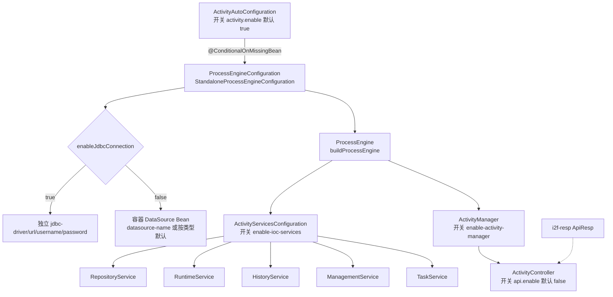
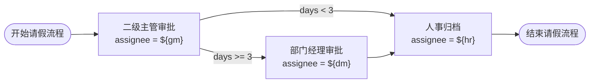

# i2f-springboot-activity-starter

> Activiti 7 工作流 Starter —— 通过条件自动装配将 `ProcessEngineConfiguration`/`ProcessEngine` 及五大运行时服务（Repository/Runtime/History/Management/Task）注册进 Spring 容器，并以 `ActivityManager` 封装部署、启动、待办查询、任务完成、历史追溯、挂起激活、组任务拾取/归还/转派等全流程 API，另附一套默认关闭的 REST 演示接口与请假流程 BPMN 样例。

## 模块路径

- `i2f-springboot/i2f-springboot-activity-starter`

## 模块依赖

| GroupId | ArtifactId | Scope | Optional | 说明 |
|---------|------------|-------|----------|------|
| i2f.turbo | i2f-resp | compile | false | `ApiResp` 统一返回体，供 `ActivityController` 各端点包装结果 |
| org.projectlombok | lombok | compile | false | 编译期代码生成（`@Data`/`@Slf4j`/`@NoArgsConstructor`） |
| org.springframework.boot | spring-boot-starter | provided | true | Spring Boot 自动装配基础与 `@ConditionalOn*` |
| org.springframework.boot | spring-boot-configuration-processor | provided | true | `@ConfigurationProperties` 配置元数据生成 |
| org.springframework.boot | spring-boot-starter-web | provided | true | `@RestController`/`@RequestMapping`（演示接口所需） |
| org.activiti | activiti-engine | provided | false | `ProcessEngine`、五大 Service、`StandaloneProcessEngineConfiguration`，版本 `7.0.0.Beta2` |
| org.activiti | activiti-spring | provided | false | Activiti 与 Spring 集成，`7.0.0.Beta2` |
| org.activiti | activiti-bpmn-model | provided | false | BPMN 2.0 对象模型，`7.0.0.Beta2` |
| org.activiti | activiti-bpmn-converter | provided | false | BPMN XML 解析/转换，`7.0.0.Beta2` |
| org.activiti | activiti-bpmn-layout | provided | false | BPMN 图形布局，`7.0.0.Beta2` |
| org.activiti | activiti-json-converter | provided | false | BPMN 与 JSON 互转（设计器），`7.0.0.Beta2` |

> 注意：
> - 全部 `org.activiti:*` 依赖在 POM 内**逐条硬编码 `7.0.0.Beta2`**，未走根 POM `dependencyManagement` 统一版本；且 `scope=provided` 但**未标 `optional`**，宿主应用须自行引入 Activiti 运行时。
> - 内部 `i2f-resp`（compile）会随本 Starter 传递，Spring Boot 与 Activiti 均为 `provided` 不传递，符合 Starter「不污染下游 classpath」的惯例。

## 模块设计

### 架构分层

本模块是典型的 Spring Boot 自动装配 Starter，按「引擎装配 → 服务导出 → 业务封装 → 演示接口」四层组织，每层由独立开关控制：

- **引擎装配层**（`ActivityAutoConfiguration`）：`@ConditionalOnExpression` 总开关下构建 `StandaloneProcessEngineConfiguration` 与 `ProcessEngine`；数据源支持「独立 JDBC 四项配置」与「复用容器 `DataSource`」二选一，并可选按 bean 名指定数据源；`@ConditionalOnMissingBean` 保证宿主已自定义引擎时不覆盖
- **服务导出层**（`ActivityServicesConfiguration`）：`@ConditionalOnBean(ActivityAutoConfiguration)` + `enable-ioc-services` 开关，把引擎的 `RepositoryService`/`RuntimeService`/`HistoryService`/`ManagementService`/`TaskService` 逐一导出为 Bean，供按类型注入
- **业务封装层**（`ActivityManager`）：`@Component` + `enable-activity-manager` 开关，聚合约 20 组流程操作重载方法，屏蔽 `processEngine.getXxxService()` 细节
- **演示接口层**（`ActivityController`）：`@RestController` + `api.enable`（**默认关闭**）开关，暴露 `activity/*` 一组端点，配合内置请假流程样例做端到端验证

### 自动装配结构



### 条件装配一览

| 类 | 注解条件 | 默认 | 说明 |
|----|---------|------|------|
| `ActivityAutoConfiguration` | `@ConditionalOnExpression("${...enable:true}")` | 开 | 引擎装配总开关 |
| `#processEngineConfiguration()` | `@ConditionalOnMissingBean(ProcessEngineConfiguration.class)` | — | 宿主已定义则不覆盖 |
| `#processEngine()` | `@ConditionalOnMissingBean(ProcessEngine.class)` | — | 宿主已定义则不覆盖 |
| `ActivityServicesConfiguration` | `@ConditionalOnBean(ActivityAutoConfiguration)` + `${...enable-ioc-services:true}` | 开 | 五大服务导出 |
| `ActivityManager` | `@Component` + `${...enable-activity-manager:true}` | 开 | 业务封装 Bean |
| `ActivityController` | `@RestController` + `${...api.enable:false}` | **关** | REST 演示接口 |

### 请假流程样例（`assets/activity/request.bpmn20.xml`）

内置流程 `id=request`，`assignee` 全部由 UEL 表达式从流程变量 `${gm}`/`${dm}`/`${hr}` 取值，并在二级主管审批后按 `days` 走排他分支：



- `days >= 3`：二级主管 → 部门经理 → 人事归档 → 结束
- `days < 3`：二级主管 → 人事归档 → 结束
- 完成任务时回传的流程变量（如把 `dm` 改为 `ndm`）可在**该节点变量被使用之前**动态改变后续负责人

### 包结构

```
i2f.springboot.activity
├── ActivityAutoConfiguration      # 引擎装配：ProcessEngineConfiguration / ProcessEngine
├── ActivityServicesConfiguration  # 五大 Service 导出为 Bean
├── ActivityManager                # 流程操作封装（部署/启动/任务/历史/挂起/组任务）
└── ActivityController             # 默认关闭的 REST 演示接口（activity/*）
```

资源：`META-INF/spring.factories` 与 `META-INF/spring/...AutoConfiguration.imports`（双注册），`META-INF/additional-spring-configuration-metadata.json`（IDE 提示），`sample/application-sample.yml`（配置样例），`assets/activity/*`（请假流程 bpmn/png/http 测试脚本）。

## 模块目的

1. **Activiti 零配置接入**：把 `StandaloneProcessEngineConfiguration` 的数据源、建表策略等装配为 Spring Boot 自动配置，应用引依赖即可拿到 `ProcessEngine` 与五大服务。
2. **数据源灵活**：既可复用宿主默认（或指定名）`DataSource`，也可用独立 JDBC 四项配置让流程引擎连专用库，互不干扰。
3. **降低引擎 API 使用门槛**：`ActivityManager` 将部署、启动、待办、完成、历史、挂起/激活、组任务等高频操作收敛为语义化重载方法。
4. **可裁剪、可覆盖**：四层各自独立开关，`@ConditionalOnMissingBean` 保证宿主自定义优先；演示接口默认关闭，避免生产暴露。
5. **自带可运行样例**：请假流程 BPMN + HTTP 测试脚本，按 `test-api.http` 顺序即可跑通「部署 → 启动 → 分支审批 → 归档」全链路。

## 模块功能

| 功能组 | 入口方法（`ActivityManager`） | 说明 |
|--------|------------------------------|------|
| 部署 | `deployByClasspathBpmn(name, bpmn[, attach])` | 从 classpath 解析 bpmn（可带图/附件）部署 |
| 部署 | `deployByZip(File/String/InputStream/ZipInputStream)` | zip 批量部署多个流程 |
| 资源查询 | `queryDeployResourcesById` / `queryDeployBpmnResourceById` / `queryDeployAttachResourceById` | 取部署内的 bpmn 与图形资源流 |
| 定义查询 | `queryDeploymentsByNameLike` / `queryProcessDefinitionsByKey` | 按名模糊查部署、按 key 查各版本定义 |
| 启动实例 | `startByKey(...)`（多重载：key/deployment/businessKey/params） | 按流程 key 启动，可带业务键与流程变量 |
| 实例查询 | `queryInstanceByKey` | 查某流程定义下的运行中实例 |
| 待办查询 | `queryTaskByKeyAndAssignee` / `queryGroupTaskByCandidateUser` | 按负责人查个人待办、按候选人查组任务 |
| 完成任务 | `completeTask(Task/id[, params])` | 完成任务并可回传变量影响后续 |
| 历史追溯 | `queryHistories(instanceId/ProcessInstance)` | 按开始时间升序查历史活动轨迹 |
| 删除部署 | `deleteDeploy(...[, cascade])` | 删除流程定义，`cascade=true` 级联删历史 |
| 挂起/激活定义 | `suspendAllInstance(key)` / `activeAllInstance(key)` | 按 key 批量挂起/激活流程定义，返回处理条数 |
| 挂起/激活实例 | `suspendInstance(id)` / `activeInstance(id)` | 单个实例挂起/激活，返回实例对象 |
| 组任务流转 | `claimGroupTask` / `returnGroupTask` / `redirectGroupTask` | 拾取、归还、转派任务 |
| REST 演示 | `ActivityController` `activity/{deploy,start,task/list,task/complete/{id},instance/list,instance/history}` | 默认关闭的端到端演示接口 |

## 模块主要使用方法

### 1. 引入依赖

```xml
<dependency>
    <groupId>i2f.turbo</groupId>
    <artifactId>i2f-springboot-activity-starter</artifactId>
    <!-- 版本继承父 POM 统一管理（1.0-jdk8） -->
</dependency>
<!-- Activiti 为 provided，需自备运行时 -->
<dependency>
    <groupId>org.activiti</groupId>
    <artifactId>activiti-engine</artifactId>
    <version>7.0.0.Beta2</version>
</dependency>
```

### 2. 配置（前缀 `i2f.springboot.config.activity`）

```yaml
i2f:
  springboot:
    config:
      activity:
        enable: true                 # 引擎装配总开关
        enable-jdbc-connection: false # true=用下方独立 jdbc 配置；false=复用容器 DataSource
        datasource-name: ''          # 复用容器数据源时可按 bean 名指定，留空则按类型取默认
        enable-auto-build-tables: true # 是否自动建/更新流程表（databaseSchemaUpdate）
        enable-ioc-services: true     # 是否导出五大 Service 为 Bean
        enable-activity-manager: true # 是否注册 ActivityManager
        jdbc-driver: com.mysql.cj.jdbc.Driver
        jdbc-url: jdbc:mysql://localhost:3306/activity_test_db?...
        jdbc-username: root
        jdbc-password: xxx
        api:
          enable: false              # 是否开启 REST 演示接口（默认关闭）
```

### 3. 使用 `ActivityManager`

```java
@Autowired
private ActivityManager activityManager;

// 部署 → 启动（带流程变量控制分支与负责人）→ 查待办 → 完成
Deployment dep = activityManager.deployByClasspathBpmn("请假流程", "assets/activity/request.bpmn20.xml");
Map<String, Object> vars = new HashMap<>();
vars.put("gm", "gm"); vars.put("dm", "dm"); vars.put("hr", "hr"); vars.put("days", 3);
ProcessInstance instance = activityManager.startByKey("request", vars);
List<Task> todo = activityManager.queryTaskByKeyAndAssignee("request", "gm");
activityManager.completeTask(todo.get(0).getId(), vars);
List<HistoricActivityInstance> history = activityManager.queryHistories(instance.getProcessInstanceId());
```

### 4. 端到端演示

开启 `api.enable: true`，将 `assets/activity` 目录拷入宿主 `resources`，按 `test-api.http` 从上到下依次请求即可跑通「部署 → 启动 → 分支审批 → 归档 → 查历史」。

### 5. 注意事项

- **引擎需数据源**：`enable-jdbc-connection=false` 时容器必须存在可注入的 `DataSource`，否则装配期 `getBean(DataSource.class)` 失败。
- **自动建表**：`enable-auto-build-tables=true` 会设置 `databaseSchemaUpdate`，首次启动在目标库建 Activiti 表。
- **演示接口默认关闭**：`ActivityController` 的 `key="request"` 与资源路径均硬编码，仅用于样例验证，不应作为生产 API。
- **Activiti 为 provided**：不随本 Starter 传递，务必在应用中显式引入引擎及其运行时依赖。

## 模块特性总结

1. **四层开关、逐层可裁剪**：引擎、服务导出、Manager、REST 接口分别独立开关，按需组合。
2. **`@ConditionalOnMissingBean` 友好**：宿主已自定义 `ProcessEngineConfiguration`/`ProcessEngine` 时本 Starter 让位。
3. **数据源二选一**：独立 JDBC 或复用容器 `DataSource`（可指定 bean 名），适配流程库与业务库分离场景。
4. **全流程操作封装**：`ActivityManager` 覆盖部署/启动/待办/完成/历史/删除/挂起/激活/组任务拾取归还转派，重载丰富。
5. **组任务协作**：候选人查询、拾取（claim）、归还、转派完整支持，贴合真实审批协作。
6. **分支与动态负责人**：样例 BPMN 演示 UEL 变量驱动 assignee 与排他网关条件，展示流程变量在节点使用前的可变性。
7. **自带可运行样例**：BPMN + 图形 + `.http` 脚本 + `application-sample.yml`，开箱验证。
8. **双注册兼容**：同时提供 `spring.factories` 与 `AutoConfiguration.imports`，兼容 Spring Boot 2.6 前后。

## 模块瑕疵或错误

> 本模块已随整体工程编译通过，以下为静态识别的问题或潜在问题，未做运行实证。

1. **样例 `readme.md` 指引与实际实现不符**：`assets/activity/readme.md` 第 3 步要求「启动类上加注解 `@EnableActivityConfig`」，但源码中**不存在**该注解，实际靠 `spring.factories`/`AutoConfiguration.imports` 自动装配，按文档操作会误导使用者。
2. **配置元数据属性名拼写错误**：`additional-spring-configuration-metadata.json` 中登记为 `enable-jdbc-nonnection`（多写了 `n`），而实际字段/期望属性为 `enable-jdbc-connection`，IDE 自动补全与提示会对不上。
3. **`enable-auto-build-tables` 缺失于元数据**：`application-sample.yml` 与实际字段 `enableAutoBuildTables` 使用了该属性，但配置元数据 JSON 未登记，缺少 IDE 提示。
4. **`api.enable` 默认值元数据与代码不一致**：`ActivityController` 的 `@ConditionalOnExpression("${...api.enable:false}")` 默认关闭，而元数据 JSON 将 `api.enable` 的 `defaultValue` 标为 `true`，文档化默认值与运行默认相反。
5. **BPMN/附件资源查询语义疑似写反**：`queryDeployResourcesById` 把 `getDiagramResourceName()`（图形）存入名为 `bpmnFileName` 的键、把 `getResourceName()`（BPMN）存入 `attachFileName`；`queryDeployBpmnResourceById` 实际返回图形资源流、`queryDeployAttachResourceById` 实际返回 BPMN 资源流，方法名与返回内容存在交叉，易误用。
6. **`@Configuration` 类内自调用构造引擎**：`processEngine(configuration)` 未使用注入的 `configuration` 参数，而是再次调用 `processEngineConfiguration()`（依赖 CGLIB 全模式代理返回单例），可读性差且一旦被重构为 `proxyBeanMethods=false` 即失效。
7. **`@Component`/`@RestController` 类被登记为自动配置**：`ActivityManager`、`ActivityController` 以组件注解 + 出现在 `EnableAutoConfiguration` 注册列表中双重身份注册，语义非常规，若宿主基础包恰好扫描到该包存在重复注册隐患。
8. **Activiti 版本内联且为 Beta**：六个 `org.activiti:*` 逐条硬编码 `7.0.0.Beta2`，既未纳入根 POM 依赖管理，又采用 Beta 版本，升级/一致性维护成本高。
9. **演示接口 HTTP 方法未约束**：`ActivityController` 各端点用裸 `@RequestMapping`（接受任意方法），其中 `start`/`task/complete` 带 `@RequestBody` 却可被 GET 触达，仅适合演示、不宜生产暴露。
10. **元数据 `hints` 冗余**：`hints` 中 `server.servlet.jsp.class-name`、`server.tomcat.accesslog.encoding` 与本模块无关（疑似复制自 Spring Boot 官方元数据），属噪声。

## 生态位置

- **组归属**：`i2f-springboot` 组（Spring Boot 生态 Starter 集合）成员，在组 `pom.xml` 的 `<modules>` 首位登记（`i2f-springboot/pom.xml:16`）。
- **版本管理**：根 `pom.xml` `dependencyManagement` 以 `${i2f.version}` 登记（`pom.xml:1352-1356`）。
- **构建产物**：`<build>` 声明 `maven-assembly-plugin` 并覆盖 `archive.addMavenDescriptor=true`，产 fat-jar；`bash/deploy-jdk17`、`deploy-jdk8`、`backup-jdk17`、`backup-jdk8` 四目录均分发 `i2f-springboot-activity-starter-1.0-jdk*.jar`。
- **依赖上游**：内部仅依赖 `i2f-resp`（统一返回体）；对外依赖 Activiti 7 引擎与 Spring Boot。
- **下游消费**：仓库内**无 POM 级/源码级消费方**，仅 `.wiki` 文档（`module-i2f-springboot.md`、`i2f-resp` 消费表、`wiki.md`）将其列为 Activiti 工作流 Starter 能力项；面向外部应用独立发布。
- **同组对照**：与 `i2f-springboot-ai-mcp-client/server` 等同属「条件装配 + `@ConfigurationProperties` + 双注册文件 + 附加配置元数据」的标准 Starter 范式。
