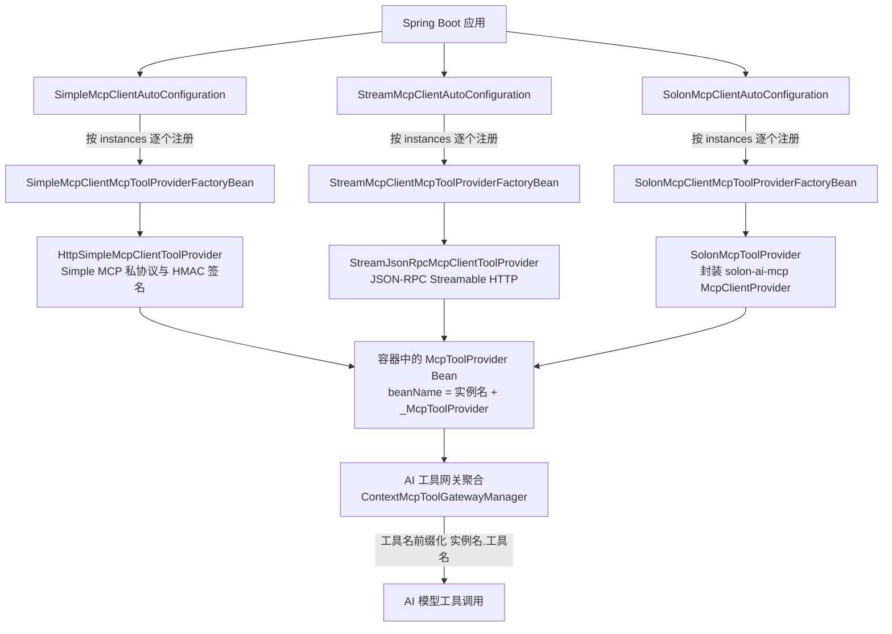
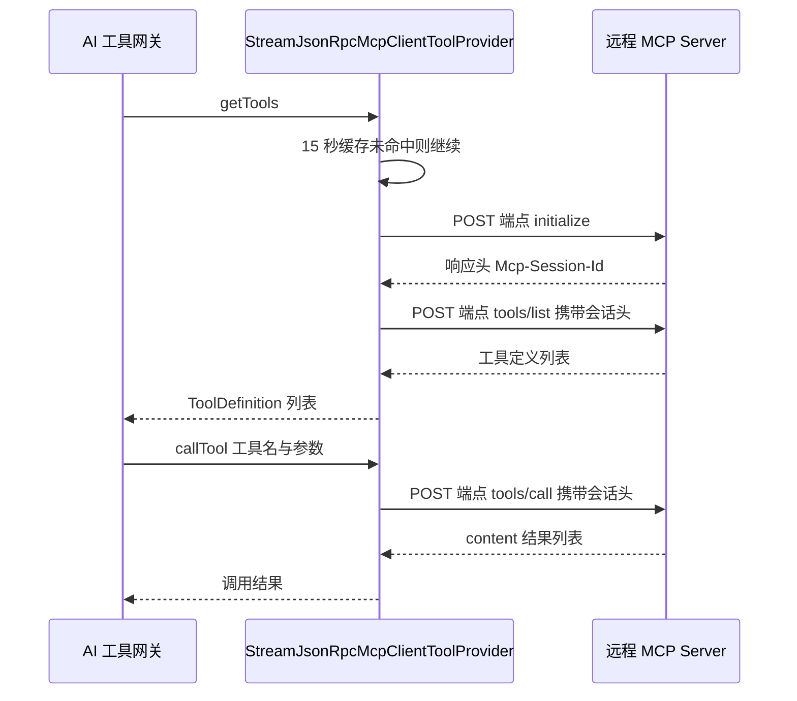

# i2f-springboot-ai-mcp-client

> MCP 客户端 Starter —— 按 `instances` 配置将远程 MCP Server 自动注册为本地 `McpToolProvider` Bean，内置三套客户端实现：自研 Simple MCP 私协议（HMAC-SHA256 签名认证）、自研标准 JSON-RPC Streamable HTTP（`Mcp-Session-Id` 会话管理）与 solon-ai-mcp SDK（STDIO/SSE/STREAMABLE 等多种通道），供 AI 工具网关聚合为「前缀.工具名」形式的动态工具。

## 模块路径

- `i2f-springboot/i2f-springboot-ai-mcp-client`

## 模块依赖

| GroupId | ArtifactId | Scope | Optional | 说明 |
|---------|------------|-------|----------|------|
| i2f.turbo | i2f-ai-std | compile | false | AI 标准契约：`McpToolProvider`、`ToolDefinition`、`ToolBaseCallRequest`、`ToolCallContextHolder` |
| i2f.turbo | i2f-ai-rest-openai | compile | false | Simple MCP 客户端实现 `HttpSimpleMcpClientToolProvider` 与常量 `HttpSimpleMcpConstants` |
| i2f.turbo | i2f-spring-core | compile | false | POM 声明依赖；当前源码未见直接引用 |
| i2f.turbo | i2f-spring-web | compile | false | `SpringWebRestClient`（基于 `RestTemplate` 的 `IRestClient` 实现） |
| org.projectlombok | lombok | compile | false | 编译期代码生成（`@Data`/`@Slf4j`） |
| org.springframework.boot | spring-boot-starter | provided | true | Spring Boot 自动装配基础 |
| org.springframework.boot | spring-boot-configuration-processor | provided | true | `@ConfigurationProperties` 配置元数据生成 |
| org.springframework.boot | spring-boot-starter-web | provided | true | `RestTemplate`（`SpringWebRestClient` 运行所需） |
| org.noear | solon-ai-mcp | provided | true | 3.9.6，solon 模式客户端（`McpClientProvider`、`McpChannel`） |
| io.projectreactor | reactor-core | provided | true | 3.6.9，solon 模式条件类检测（`ContextView`） |

> 注意：源码直接使用的 `JacksonJsonSerializer`（属 `i2f-extension-jackson`）、`HttpHeaders`/`RestHttpRequest`/`RestHttpResponse`（属 `i2f-network`）均未显式声明，实际由 `i2f-spring-web` 传递引入。

## 模块设计

### 架构设计

本模块位于 MCP 工具网关体系的「客户端接入层」，把远程 MCP Server 的工具体系接入本地 Spring 容器，整体分为三层：

- **装配层**（`*AutoConfiguration`）：三个自动配置类分别对应 simple / stream / solon 三种客户端，均在 `BeanDefinitionRegistryPostProcessor#postProcessBeanDefinitionRegistry` 阶段读取 `instances` 配置，为每个启用的实例注册一个 `{name}_McpToolProvider` Bean 定义
- **工厂层**（`*McpToolProviderFactoryBean`）：每个实例一个 `FactoryBean<McpToolProvider>`，负责把配置项装配为具体协议实现（`lazyInit=true`，首次使用时才创建）；`BeanDefinitionBuilder.genericBeanDefinition(McpToolProvider.class)` 使 `expectType` 为 `McpToolProvider`，从而可被容器按类型检索
- **协议实现层**（三种客户端）：simple 复用上游 `HttpSimpleMcpClientToolProvider`（自研私协议 + HMAC 签名）；stream 使用模块内自研 `StreamJsonRpcMcpClientToolProvider`（标准 JSON-RPC over Streamable HTTP）；solon 使用模块内 `SolonMcpToolProvider` 封装第三方 `McpClientProvider`

### 自动装配结构



三个自动配置类的条件与产物：

| 自动配置类 | 开关（默认值） | 附加条件 | 装配产物 |
|-----------|---------------|---------|---------|
| `SimpleMcpClientAutoConfiguration` | `i2f.springboot.ai.mcp.client.simple.enable`（true） | 无 | `{name}_McpToolProvider`（`HttpSimpleMcpClientToolProvider`） |
| `StreamMcpClientAutoConfiguration` | `i2f.springboot.ai.mcp.client.stream.enable`（true） | 无 | `{name}_McpToolProvider`（`StreamJsonRpcMcpClientToolProvider`） |
| `SolonMcpClientAutoConfiguration` | `i2f.springboot.ai.mcp.client.solon.enable`（true） | `@ConditionalOnClass(McpClientProvider, ContextView)` | `{name}_McpToolProvider`（`SolonMcpToolProvider`） |

### 请求处理流程（以 stream 模式为例）



- **simple 模式**：`getTools` 为 `GET /mcp/tool/list`，`callTool` 为 `POST /mcp/tool/call`，两者均携带 HMAC-SHA256 签名头（`X-App-Id`/`X-App-Date`/`X-App-Nonce`/`X-App-Sign`），调用时把 `ToolCallContextHolder` 中的请求级上下文与工具参数一并上送参与签名
- **solon 模式**：由 solon-ai-mcp SDK 接管通道与会话，模块只负责把 `McpClientProvider` 适配为 `McpToolProvider`

### 包结构

```
i2f.springboot.ai.mcp.client
├── simple
│   ├── SimpleMcpClientAutoConfiguration                # simple 模式装配
│   ├── components
│   │   └── SimpleMcpClientMcpToolProviderFactoryBean    # 构建 HttpSimpleMcpClientToolProvider
│   └── properties
│       └── SimpleMcpClientProperties                    # simple.instances 配置属性
├── stream
│   ├── StreamMcpClientAutoConfiguration                 # stream 模式装配
│   ├── components
│   │   └── StreamMcpClientMcpToolProviderFactoryBean    # 构建 StreamJsonRpcMcpClientToolProvider
│   ├── properties
│   │   └── StreamMcpClientProperties                    # stream.instances 配置属性
│   ├── provider
│   │   └── StreamJsonRpcMcpClientToolProvider           # 自研 JSON-RPC 客户端（initialize/tools/list/tools/call/close）
│   └── data
│       ├── JsonRpcRequest / JsonRpcResponse             # JSON-RPC 2.0 信封
│       └── result
│           ├── JsonRpcInitialResult                     # initialize 响应（protocolVersion/capabilities/serverInfo）
│           ├── JsonRpcToolListResult / JsonRpcToolListItem  # tools/list 响应
│           └── JsonRpcToolCallResult                    # tools/call 响应（content/isError）
└── solon
    ├── SolonMcpClientAutoConfiguration                  # solon 模式装配
    ├── components
    │   └── SolonMcpClientMcpToolProviderFactoryBean     # 构建 McpClientProvider 与 SolonMcpToolProvider
    ├── properties
    │   └── SolonMcpClientProperties                     # solon.instances 配置属性（含 Channel 枚举）
    └── provider
        └── SolonMcpToolProvider                         # solon SDK 的 McpToolProvider 适配
```

### 关键设计点

1. **统一装配骨架、按实例注册 Bean**：三个自动配置类结构完全一致——`@ConditionalOnExpression` 总开关 → 遍历 `instances` → `name.replace("-", "_")` 规范化 → 注册 `{name}_McpToolProvider`（`GenericBeanDefinition` + `FactoryBean` + `lazyInit=true`）；`name` 为空或 `enable=false` 的实例被跳过。
2. **工厂 Bean 与预期类型**：`BeanDefinitionBuilder.genericBeanDefinition(McpToolProvider.class)` 保留 `expectType`，配合 `FactoryBean#getObjectType` 返回 `McpToolProvider`，使 AI 工具网关可通过容器类型检索拿到全部远程工具提供者。
3. **懒加载 + 可选预热**：实例 Bean 默认 `lazyInit=true`（首次使用时才发起连接与协议握手）；stream / solon 支持 `initial=true`，在工厂创建时启动后台线程预拉取工具目录（`log.info` 记录工具数量）。
4. **目录缓存**：simple（上游实现）与 stream / solon（模块内实现）均自带 15 秒 TTL 的手写缓存（`CopyOnWriteArrayList` + `AtomicLong` 过期时间 + `ReentrantLock` 双检），避免 AI 高频列举工具时反复请求远程；solon 模式同时在 SDK 层配置 `cacheSeconds(30)`。
5. **上下文透传（simple 专属）**：复用上游 `HttpSimpleMcpClientToolProvider`，调用工具前用 `ToolCallContextHolder.copyOf()` 取出请求级上下文，与工具参数一起序列化为 `content`/`context` 上送，使远端工具可像本地调用一样访问上下文。
6. **实体类内聚**：stream 模式自带 `JsonRpcRequest`/`JsonRpcResponse` 与四个 `result` 数据类，仅表达 JSON-RPC 2.0 信封与 `tools/list`、`tools/call`、`initialize` 的最小响应结构，由 `RichConverter` 从 `Map` 宽松转换。
7. **双注册文件与配置元数据**：同时提供 `META-INF/spring.factories`（Spring Boot 2.6 之前）与 `META-INF/spring/org.springframework.boot.autoconfigure.AutoConfiguration.imports`（Spring Boot 2.7+），并在 `additional-spring-configuration-metadata.json` 中补充三个开关属性说明。

## 模块目的

1. **远程工具本地化**：把远程 MCP Server 的工具目录注册为本地 `McpToolProvider` Bean，让本地 AI Agent 像使用本地工具一样发现与调用分布式工具。
2. **三种协议一条防线全覆盖**：simple 对接本仓库自研的 `i2f-springboot-ai-mcp-server`（私协议 + HMAC 签名）；stream 以零第三方依赖方式对接标准 MCP Server；solon 复用 solon-ai-mcp 生态与多通道（STDIO/SSE/STREAMABLE 等），可按对端能力自由选型。
3. **多实例批量接入**：以配置列表方式声明多个远程 MCP 服务（不同地址、认证、命名），每个实例独立注册 Bean、独立缓存与独立会话。
4. **零侵入自动装配**：三个模式默认开启、无 `instances` 时零副作用；solon 模式通过 `@ConditionalOnClass` 在缺少依赖时自动跳过，应用只需引入依赖并写配置。
5. **与 AI 工具网关开箱配合**：注册的 Bean 可被 `i2f-springboot-ops-starter` 的 `ContextMcpToolGatewayManager` 自动聚合，经 `McpProviderTools` 以「动态发现 → 列举 → 搜索 → 加载」流程暴露给 AI 模型。

## 模块功能

| 功能 | 入口类/方法 | 说明 |
|------|------------|------|
| simple 客户端装配 | `SimpleMcpClientAutoConfiguration#postProcessBeanDefinitionRegistry` | 遍历 `simple.instances` 注册 `{name}_McpToolProvider` |
| stream 客户端装配 | `StreamMcpClientAutoConfiguration#postProcessBeanDefinitionRegistry` | 遍历 `stream.instances` 注册 `{name}_McpToolProvider` |
| solon 客户端装配 | `SolonMcpClientAutoConfiguration#postProcessBeanDefinitionRegistry` | 遍历 `solon.instances` 注册 `{name}_McpToolProvider`（含 `@ConditionalOnClass` 保护） |
| simple Provider 构建 | `SimpleMcpClientMcpToolProviderFactoryBean#getObject` | 装配 `SpringWebRestClient`(RestTemplate) + `JacksonJsonSerializer` + baseUrl/appId/appKey/hmacName |
| stream Provider 构建 | `StreamMcpClientMcpToolProviderFactoryBean#getObject` | 装配 headers（bearer-token/自定义）与可选预加载线程 |
| solon Provider 构建 | `SolonMcpClientMcpToolProviderFactoryBean#getObject` | 构建 `McpClientProvider`（channel/url/cacheSeconds=30）并包装为 `SolonMcpToolProvider` |
| 工具目录获取 | 各 Provider `#getTools` | 拉取远程工具目录并转换为 `ToolDefinition`（含 `FunctionJsonSchema`），15 秒缓存 |
| 工具调用 | 各 Provider `#callTool` | simple：签名 + `POST /mcp/tool/call`；stream：JSON-RPC `tools/call`；solon：`mcpClient.callTool` |
| 工具支持判定 | 各 Provider `#support` | 按工具名匹配本地缓存目录，决定该 Provider 是否处理调用请求 |
| 会话管理 | `StreamJsonRpcMcpClientToolProvider#initial / close` | `initialize` 握手取 `Mcp-Session-Id`；`close` 发 `DELETE` 并清理会话与缓存 |
| 上下文透传 | 上游 `HttpSimpleMcpClientToolProvider#callTool` | simple 模式经 `ToolCallContextHolder#copyOf` 上送请求级上下文 |

## 模块主要使用方法

### 1. 引入依赖

```xml
<dependency>
    <groupId>i2f.turbo</groupId>
    <artifactId>i2f-springboot-ai-mcp-client</artifactId>
    <!-- 版本继承父 POM 统一管理（1.0-jdk8） -->
</dependency>
```

solon 模式还需应用侧提供 `org.noear:solon-ai-mcp:3.9.6` 与 `io.projectreactor:reactor-core`（模块内为 `provided + optional`，不随依赖传递）。

### 2. 配置实例

```yaml
i2f:
  springboot:
    ai:
      mcp:
        client:
          # simple mcp client implements privacy protocol mcp
          simple:
            enable: true
            instances:
              - enable: true
                name: demo                      # 必填，作为 Bean 名与 AI 工具前缀
                description: a group utils tool
                base-url: http://localhost:8811/
                app-id: xxx
                app-key: xxx
                hmac-name: HmacSHA256
          # stream mcp client implements official protocol mcp (streamable channel only)
          stream:
            enable: true
            instances:
              - enable: true
                name: demo2
                description: a group utils tool
                url: http://localhost:9999/mcp
                bearer-token: xxx
                initial: true                   # 可选，启动后预拉取工具目录
                #headers:
                #  key: value
          # solon mcp client implements official protocol mcp
          solon:
            enable: true
            instances:
              - enable: true
                name: demo3
                description: a group utils tool
                url: http://localhost:9999/mcp
                channel: streamable             # stdio / sse / streamable / streamable_stateless
                bearer-token: xxx
                #headers:
                #  key: value
```

### 3. 在 AI 工具链中使用

实例 Bean 无需手工注入，`i2f-springboot-ops-starter` 的 `SpringContextToolAutoConfiguration` 会注册 `ContextMcpToolGatewayManager`（从容器检索全部 `McpToolProvider`）与 `McpProviderTools`（四个管理工具），远程工具以 `{实例名}.{工具名}` 前缀形式存在，AI 侧典型流程：

1. `tools_provider_list`：列出所有工具供应商（每个实例是其中之一）
2. `list_tools_from_providers` / `search_tools`：按供应商列举或按正则搜索工具（如 `demo.get_weather`）
3. `load_tools_by_names`：按名加载工具后即可直接调用

```yaml
# i2f-tools-ops 等宿主应用启用 MCP 网关的开关
ai:
  tools:
    mcp-gateway:
      enable: true
```

### 4. 注意事项

- **`url` 后缀自动补全（stream）**：`StreamJsonRpcMcpClientToolProvider#getEndpointUrl` 会去除末尾 `/` 并在非 `/mcp` 结尾时追加 `/mcp`，因此 `http://host:9999` 与 `http://host:9999/mcp` 均可配置。
- **实例名唯一**：`name` 经 `-` → `_` 规范化后作为 beanName（`{name}_McpToolProvider`），跨模式或同模式内重名会注册同名 Bean 定义；在 Spring Boot 默认禁止 Bean 覆盖的情况下会导致启动失败。
- **`initial=true` 有远程调用成本**：启动时会立即向远程发起工具目录请求（后台线程），远程不可达时仅告警不阻断启动。
- **simple 模式对接本仓库服务端**：baseUrl 指向 `i2f-springboot-ai-mcp-server` 所在服务，`app-id`/`app-key` 需与服务端 `app-list` 授权配置一致。

## 模块特性总结

1. **三协议一体**：同一模块内提供 Simple MCP 私协议、标准 JSON-RPC Streamable HTTP、solon-ai-mcp SDK 三套客户端，按需选用、互不影响。
2. **配置驱动的多实例**：一个 `instances` 列表即可接入多个远程 MCP 服务，实例级独立开关（`enable`）与命名。
3. **懒加载与可选预热**：Bean 默认懒加载，不产生启动期连接开销；`initial=true` 可换取首个工具请求的零等待。
4. **目录缓存与锁保护**：15 秒 TTL 缓存 + `ReentrantLock` 双检 + `CopyOnWriteArrayList` 快照返回，兼顾性能与线程安全。
5. **会话与认证**：stream 模式完整实现 `initialize` → 会话头 → `DELETE` 生命周期；simple 模式实现 HMAC-SHA256 请求签名；solon 模式复用 SDK 能力。
6. **上下文透传（simple）**：远程工具调用与本地调用拥有一致的 `ToolCallContextHolder` 访问体验。
7. **条件装配零副作用**：无配置时三个自动配置类均不注册任何 Bean；solon 模式在缺少 SDK 时自动跳过。
8. **开箱对接 AI 网关**：Bean 类型即契约（`McpToolProvider`），与 `i2f-springboot-ops-starter` 的动态工具发现机制无缝衔接。

## 模块瑕疵或错误

1. **stream 模式初始化失败被标记成功**：`StreamJsonRpcMcpClientToolProvider#initial()` 在 `finally` 块中无条件执行 `initialized.set(true)`，即使 `initialize` 请求抛异常（网络失败、服务端未返回 `Mcp-Session-Id`）也会被标记为已初始化；后续 `getTools`/`callTool` 会跳过握手，携带 `null` 会话头直接请求，通常会持续失败且无法自动重试（仅 `close()` 能重置标记）。
2. **缓存过期判定语义偏差**：三种客户端的缓存判定均为 `System.currentTimeMillis() - expireTs < expireTtl`，而写入为 `expireTs = System.currentTimeMillis() + expireTtl`（未来时刻），两者组合使缓存实际有效期约为 `2 × expireTtl`（默认 15 秒 → 实际约 30 秒）；simple 模式的上游实现、本模块 stream 与 solon 实现均为同一写法。
3. **stream 模式工具调用错误消息截断**：`StreamJsonRpcMcpClientToolProvider#callTool` 在 `isError=true` 时抛出 `IllegalStateException("invoke mcp tool error, cause reason is: ")`，消息尾部未拼接远程错误详情，排障困难。
4. **重复新建基础设施对象**：三个 FactoryBean 均为每个实例 `new RestTemplate()` 与 `new JacksonJsonSerializer(new ObjectMapper())`，不复用宿主容器中已定制（如注册 `JavaTimeModule`）的 `RestTemplate`/`ObjectMapper` Bean，序列化与 HTTP 行为可能与宿主应用不一致；且 `JacksonJsonSerializer` 属传递依赖未显式声明。
5. **预热线程未命名且非守护**：stream / solon 的 `initial=true` 使用 `new Thread(...)` 裸创建线程（未命名、非守护、未复用线程池），失败仅 `log.warn`，且两处日志文案将 "warning" 误拼为 "warring"。
6. **`support()` 空安全不一致**：`SolonMcpToolProvider#support` 使用 `request.getName().equals(tool.getName())`，`request.getName()` 为 `null` 时抛 NPE；`StreamJsonRpcMcpClientToolProvider#support` 为 `tool.getName().equals(...)`，两处行为不一致。
7. **simple / stream 模式缺少 Classpath 条件保护**：solon 模式有 `@ConditionalOnClass(McpClientProvider, ContextView)`，而 simple / stream 模式的自动配置在类路径缺少 `RestTemplate`（spring-web）时无显式条件，仅靠懒加载推迟失败点。
8. **配置元数据冗余**：`additional-spring-configuration-metadata.json` 的 `hints` 中 `server.servlet.jsp.class-name`、`server.tomcat.accesslog.encoding` 两条与本模块无关（疑似自 Spring Boot 官方元数据复制），IDE 配置提示存在噪声。

## 三套协议对比

| 维度 | simple | stream | solon |
|------|--------|--------|-------|
| 协议 | 自研 Simple MCP 私协议 | 标准 MCP JSON-RPC over Streamable HTTP | 标准 MCP（solon-ai-mcp SDK） |
| 实现来源 | 上游 `HttpSimpleMcpClientToolProvider` | 模块内 `StreamJsonRpcMcpClientToolProvider` | 模块内 `SolonMcpToolProvider` + 第三方 `McpClientProvider` |
| 端点 | `GET /mcp/tool/list`、`POST /mcp/tool/call` | `POST /mcp`（initialize/tools-list/tools-call）、`DELETE /mcp` | 由 SDK 与 channel 决定 |
| 认证 | HMAC-SHA256 签名头 | `bearer-token` / 自定义 `headers` | `bearer-token` / 自定义 `headers` |
| 会话 | 无会话 | `Mcp-Session-Id`（initialize 获取、DELETE 释放） | SDK 内部管理 |
| 上下文透传 | 支持（`ToolCallContextHolder`） | 不支持 | 不支持 |
| 目录缓存 | 15 秒 TTL（上游实现） | 15 秒 TTL（自建） | 15 秒 TTL（自建）+ SDK `cacheSeconds(30)` |
| 预热 | 无（`initial` 未提供） | `initial=true` | `initial=true` |
| 额外依赖 | 无 | 无 | `solon-ai-mcp`、`reactor-core` |
| 对端 | `i2f-springboot-ai-mcp-server` | 任意标准 MCP Server | 任意标准 MCP Server |

## 配置属性总览

simple（前缀 `i2f.springboot.ai.mcp.client.simple`）：

| 属性 | 类型 | 默认值 | 说明 |
|------|------|--------|------|
| `enable` | `Boolean` | `true` | simple 模式自动配置开关 |
| `instances` | `List` | `null` | 实例列表，为空时不注册任何 Bean |
| `instances[].enable` | `Boolean` | `null`（视为启用） | 单实例开关 |
| `instances[].name` | `String` | 无 | 必填，Bean 名与 AI 工具前缀来源（`-` 会替换为 `_`） |
| `instances[].description` | `String` | 无 | 供应商描述 |
| `instances[].base-url` | `String` | 无 | 服务端根地址（如 `http://localhost:8811/`） |
| `instances[].app-id` | `String` | 无 | 签名应用 ID（`X-App-Id`） |
| `instances[].app-key` | `String` | 无 | 签名密钥（HMAC key） |
| `instances[].hmac-name` | `String` | `HmacSHA256` | HMAC 算法名 |

stream（前缀 `i2f.springboot.ai.mcp.client.stream`）：

| 属性 | 类型 | 默认值 | 说明 |
|------|------|--------|------|
| `enable` | `Boolean` | `true` | stream 模式自动配置开关 |
| `instances[].enable` | `Boolean` | `null`（视为启用） | 单实例开关 |
| `instances[].initial` | `Boolean` | `null`（不预热） | 是否启动后后台预拉取工具目录 |
| `instances[].name` | `String` | 无 | 必填，Bean 名与 AI 工具前缀来源 |
| `instances[].description` | `String` | 无 | 供应商描述 |
| `instances[].url` | `String` | 无 | 服务端地址（自动补 `/mcp` 后缀） |
| `instances[].bearer-token` | `String` | 无 | 非空时添加 `Authorization: Bearer {token}` 头 |
| `instances[].headers` | `Map` | 无 | 附加请求头 |

solon（前缀 `i2f.springboot.ai.mcp.client.solon`）：

| 属性 | 类型 | 默认值 | 说明 |
|------|------|--------|------|
| `enable` | `Boolean` | `true` | solon 模式自动配置开关（另需 `McpClientProvider`/`ContextView` 在 Classpath） |
| `instances[].enable` | `Boolean` | `null`（视为启用） | 单实例开关 |
| `instances[].initial` | `Boolean` | `null`（不预热） | 是否启动后后台预拉取工具目录 |
| `instances[].name` | `String` | 无 | 必填，Bean 名与 AI 工具前缀来源 |
| `instances[].description` | `String` | 无 | 供应商描述 |
| `instances[].url` | `String` | 无 | 服务端地址 |
| `instances[].channel` | `Channel` | `STREAMABLE` | 通道：`stdio` / `sse` / `streamable` / `streamable_stateless` |
| `instances[].bearer-token` | `String` | 无 | 非空时添加 `Authorization: Bearer {token}` 头 |
| `instances[].headers` | `Map` | 无 | 附加请求头 |

## 自动注册清单

```
# META-INF/spring.factories 与 META-INF/spring/org.springframework.boot.autoconfigure.AutoConfiguration.imports
i2f.springboot.ai.mcp.client.simple.SimpleMcpClientAutoConfiguration
i2f.springboot.ai.mcp.client.stream.StreamMcpClientAutoConfiguration
i2f.springboot.ai.mcp.client.solon.SolonMcpClientAutoConfiguration
```

## 与相关模块的关系

- **`i2f-ai-rest-openai`**：提供 simple 模式的客户端实现 `HttpSimpleMcpClientToolProvider`（含 HMAC 签名与上下文透传逻辑）与协议常量 `HttpSimpleMcpConstants`；本模块仅负责装配与参数注入。
- **`i2f-ai-std`**：提供 `McpToolProvider` 契约、`ToolDefinition`/`ToolBaseCallRequest` 与工具网关抽象（`AbstractMcpToolGatewayManager`、`ContextMcpToolGatewayManager`）。
- **`i2f-springboot-ai-mcp-server`**：simple 协议的服务端对端模块，与本模块 simple 模式构成本仓库自研「MCP Server ↔ Client」的完整链路（注意服务端 Spring MVC 模式的 `/mcp/tool/call` 方法不一致缺陷会影响配套调用）。
- **`i2f-springboot-ops-starter`**：消费方。`SpringContextToolAutoConfiguration` 注册 `ContextMcpToolGatewayManager`（聚合容器内全部 `McpToolProvider`）与 `McpProviderTools`（AI 侧动态工具发现四件套），本模块注册的实例 Bean 由此接入 AI 工具链。
- **`i2f-tools-ops`**：仓库内唯一显式依赖本模块的宿主应用（`ai.tools.mcp-gateway.enable: true`），通过配置文件接入远程 MCP 服务。
- **`i2f-springboot-ai-starter`**：未包含本模块，需要 MCP 客户端能力时应单独引入本依赖。
