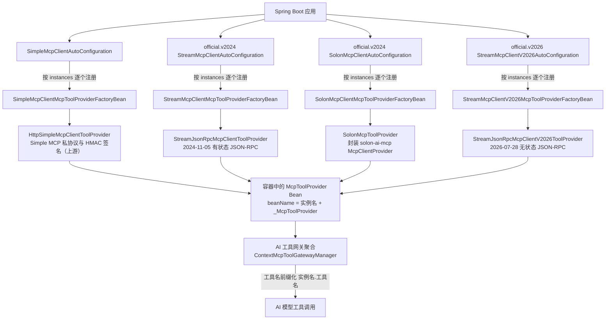
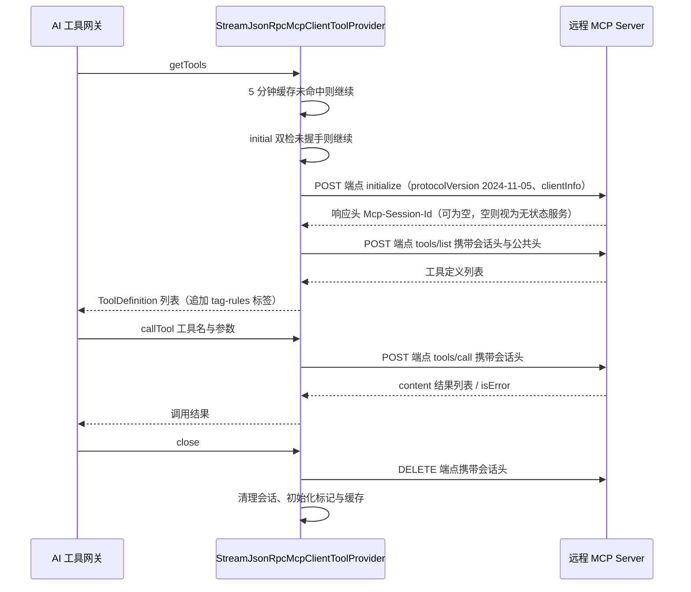
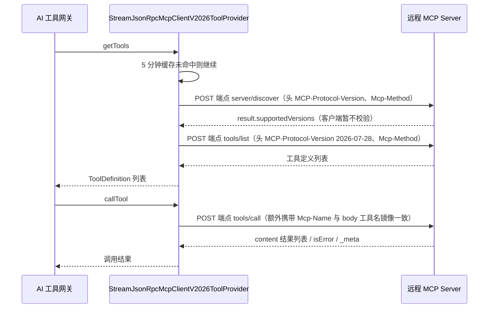

# i2f-springboot-ai-mcp-client

> MCP 客户端 Starter —— 按 `instances` 配置将远程 MCP Server 自动注册为本地 `McpToolProvider` Bean，内置四套客户端实现：自研 Simple MCP 私协议（HMAC-SHA256 签名认证，复用上游 `HttpSimpleMcpClientToolProvider`）、**official.v2024 stream** 有状态官方栈（2024-11-05，initialize 握手 + `Mcp-Session-Id` 会话 + tools，信封与结果 DTO 复用上游 `mcp.official.v2024` 共享契约）、**official.v2024 solon** SDK 官方栈（solon-ai-mcp 多通道 STDIO/SSE/STREAMABLE/STREAMABLE_STATELESS）与 **official.v2026 stream** 无状态官方栈（2026-07-28，无 initialize、`server/discover` 发现 + `MCP-Protocol-Version`/`Mcp-Method`/`Mcp-Name` 请求头 + `_meta` 参数），支持按 `tag-rules` 为远程工具追加本地标签，供 AI 工具网关聚合为「实例名.工具名」形式的动态工具。

## 模块路径

- `i2f-springboot/i2f-springboot-ai-mcp-client`

## 模块依赖

| GroupId | ArtifactId | Scope | Optional | 说明 |
|---------|------------|-------|----------|------|
| i2f.turbo | i2f-ai-std | compile | false | 客户端契约：`McpToolProvider`、`ToolDefinition`/`DefaultToolDefinition`、`ToolBaseCallRequest`、`FunctionJsonSchema`、`AiTagRule`/`AiTagRuleHelper` |
| i2f.turbo | i2f-ai-rest-openai | compile | false | simple 客户端实现 `HttpSimpleMcpClientToolProvider` 与常量 `HttpSimpleMcpConstants`；官方模式复用的共享契约：`mcp.official.v2024`（`OfficialMcpConstants` + `JsonRpcRequest`/`JsonRpcResponse`/`JsonRpcError` + `data.result.*`）、`mcp.official.v2026`（`OfficialMcpConstantsV2026` + `JsonRpcResponseV2026`/`JsonRpcErrorV2026` + `JsonRpcServerDiscoverResult` 等）、`IJsonRpcDto` |
| i2f.turbo | i2f-spring-core | compile | false | POM 声明依赖；当前源码未见直接引用 |
| i2f.turbo | i2f-spring-web | compile | false | `SpringWebRestClient`（基于 `RestTemplate` 的 `IRestClient` 实现，三个 FactoryBean 装配时覆盖 Provider 默认客户端） |
| org.projectlombok | lombok | compile | false | 编译期代码生成（`@Data`/`@Slf4j`） |
| org.springframework.boot | spring-boot-starter | provided | true | Spring Boot 自动装配基础 |
| org.springframework.boot | spring-boot-configuration-processor | provided | true | `@ConfigurationProperties` 配置元数据生成 |
| org.springframework.boot | spring-boot-starter-web | provided | true | `RestTemplate`（`SpringWebRestClient` 运行所需） |
| org.noear | solon-ai-mcp | provided | true | 3.9.6，solon 模式客户端（`McpClientProvider`、`McpChannel`、`FunctionTool`、`ToolResult`） |
| io.projectreactor | reactor-core | provided | true | 3.6.9，solon 模式条件类检测（`ContextView`） |

> 注意：源码直接使用的 `JacksonJsonSerializer`（属 `i2f-extension-jackson`）、`HttpProcessorRestClient`/`HttpHeaders`/`RestHttpRequest`/`RestHttpResponse`/`HttpMethodConstants`（属 `i2f-network`）、`Json2Serializer`（属 `i2f-serialize`）、`TypeToken`（属 `i2f-typeof`）、`BaseMutator`（属 `i2f-mutator`）、`RichConverter` 相关序列化能力均未显式声明，实际由 `i2f-ai-rest-openai` / `i2f-spring-web` 传递引入。

## 模块设计

### 架构设计

本模块位于 MCP 工具网关体系的「客户端接入层」，把远程 MCP Server 的工具体系接入本地 Spring 容器，整体分为三层：

- **装配层**（`*AutoConfiguration`）：四个自动配置类分别对应 simple / official.v2024.stream / official.v2024.solon / official.v2026.stream 四种客户端，均在 `BeanDefinitionRegistryPostProcessor#postProcessBeanDefinitionRegistry` 阶段读取各自前缀下的 `instances` 配置，为每个启用的实例注册一个 `{name}_McpToolProvider` Bean 定义
- **工厂层**（`*McpToolProviderFactoryBean`）：每个实例一个 `FactoryBean<McpToolProvider>`，负责把配置项装配为具体协议实现（`lazyInit=true`，首次使用时才创建）；`BeanDefinitionBuilder.genericBeanDefinition(McpToolProvider.class)` 使 `expectType` 为 `McpToolProvider`，从而可被容器按类型检索
- **协议实现层**（四种客户端）：simple 复用上游 `HttpSimpleMcpClientToolProvider`（自研私协议 + HMAC 签名）；v2024 stream 使用模块内 `StreamJsonRpcMcpClientToolProvider`（标准 JSON-RPC over Streamable HTTP，有状态会话）；v2024 solon 使用 `SolonMcpToolProvider` 封装第三方 `McpClientProvider`；v2026 stream 使用 `StreamJsonRpcMcpClientV2026ToolProvider`（2026-07-28 无状态协议，`server/discover` + 请求头一致性）

### 自动装配结构


```mermaid
flowchart TD
    APP["Spring Boot 应用"] --> SIMPLE["SimpleMcpClientAutoConfiguration"]
    APP --> S24["official.v2024 StreamMcpClientAutoConfiguration"]
    APP --> SOLON["official.v2024 SolonMcpClientAutoConfiguration"]
    APP --> S26["official.v2026 StreamMcpClientV2026AutoConfiguration"]

    SIMPLE -->|"按 instances 逐个注册"| FS["SimpleMcpClientMcpToolProviderFactoryBean"]
    S24 -->|"按 instances 逐个注册"| FT["StreamMcpClientMcpToolProviderFactoryBean"]
    SOLON -->|"按 instances 逐个注册"| FN["SolonMcpClientMcpToolProviderFactoryBean"]
    S26 -->|"按 instances 逐个注册"| FX["StreamMcpClientV2026McpToolProviderFactoryBean"]

    FS --> PS["HttpSimpleMcpClientToolProvider<br/>Simple MCP 私协议与 HMAC 签名（上游）"]
    FT --> PT["StreamJsonRpcMcpClientToolProvider<br/>2024-11-05 有状态 JSON-RPC"]
    FN --> PN["SolonMcpToolProvider<br/>封装 solon-ai-mcp McpClientProvider"]
    FX --> PX["StreamJsonRpcMcpClientV2026ToolProvider<br/>2026-07-28 无状态 JSON-RPC"]

    PS --> BEANS["容器中的 McpToolProvider Bean<br/>beanName = 实例名 + _McpToolProvider"]
    PT --> BEANS
    PN --> BEANS
    PX --> BEANS
    BEANS --> GW["AI 工具网关聚合<br/>ContextMcpToolGatewayManager"]
    GW -->|"工具名前缀化 实例名.工具名"| AI["AI 模型工具调用"]
```

四个自动配置类的条件与产物：

| 自动配置类 | 开关表达式（默认值） | 配置绑定前缀 | 附加条件 | 装配产物 |
|-----------|--------------------|-------------|---------|---------|
| `simple.SimpleMcpClientAutoConfiguration` | `...client.simple.enable`（true） | `...client.simple` | 无 | `{name}_McpToolProvider`（`HttpSimpleMcpClientToolProvider`） |
| `official.v2024.stream.StreamMcpClientAutoConfiguration` | `...client.stream.official.v2024.enable`（true） | `...client.official.v2024.stream` | 无 | `{name}_McpToolProvider`（`StreamJsonRpcMcpClientToolProvider`） |
| `official.v2024.solon.SolonMcpClientAutoConfiguration` | `...client.official.v2024.solon.enable`（true） | `...client.official.v2024.solon` | `@ConditionalOnClass(McpClientProvider, ContextView)` | `{name}_McpToolProvider`（`SolonMcpToolProvider`） |
| `official.v2026.stream.StreamMcpClientV2026AutoConfiguration` | `...client.stream.official.v2026.enable`（true） | `...client.official.v2026.stream` | 无 | `{name}_McpToolProvider`（`StreamJsonRpcMcpClientV2026ToolProvider`） |

> 开关表达式与绑定前缀键路径不一致（`stream.official.v202x` vs `official.v202x.stream`），详见「模块瑕疵或错误」第 1 条。

### v2024 有状态握手流程


```mermaid
sequenceDiagram
    participant G as AI 工具网关
    participant P as StreamJsonRpcMcpClientToolProvider
    participant S as 远程 MCP Server

    G->>P: getTools
    P->>P: 5 分钟缓存未命中则继续
    P->>P: initial 双检未握手则继续
    P->>S: POST 端点 initialize（protocolVersion 2024-11-05、clientInfo）
    S-->>P: 响应头 Mcp-Session-Id（可为空，空则视为无状态服务）
    P->>S: POST 端点 tools/list 携带会话头与公共头
    S-->>P: 工具定义列表
    P-->>G: ToolDefinition 列表（追加 tag-rules 标签）

    G->>P: callTool 工具名与参数
    P->>S: POST 端点 tools/call 携带会话头
    S-->>P: content 结果列表 / isError
    P-->>G: 调用结果
    G->>P: close
    P->>S: DELETE 端点携带会话头
    P->>P: 清理会话、初始化标记与缓存
```

### v2026 无状态请求流程


```mermaid
sequenceDiagram
    participant G as AI 工具网关
    participant P as StreamJsonRpcMcpClientV2026ToolProvider
    participant S as 远程 MCP Server

    G->>P: getTools
    P->>P: 5 分钟缓存未命中则继续
    P->>S: POST 端点 server/discover（头 MCP-Protocol-Version、Mcp-Method）
    S-->>P: result.supportedVersions（客户端暂不校验）
    P->>S: POST 端点 tools/list（头 MCP-Protocol-Version 2026-07-28、Mcp-Method）
    S-->>P: 工具定义列表
    P-->>G: ToolDefinition 列表

    G->>P: callTool
    P->>S: POST 端点 tools/call（额外携带 Mcp-Name 与 body 工具名镜像一致）
    S-->>P: content 结果列表 / isError / _meta
    P-->>G: 调用结果
```

- **v2026 请求封装**：`wrapJsonRpcHttpBody` 将 `params` DTO 经 `IJsonRpcDto#toMap` 摊平为 Map，并统一注入 `_meta`（`io.modelcontextprotocol/protocolVersion`、`clientInfo`、`clientCapabilities`），与服务端无状态栈的镜像请求头一致性校验配套；信封 `JsonRpcRequest` 复用 v2024 包，响应则使用 v2026 独有类型
- **simple 模式**：`getTools` 为 `GET /mcp/tool/list`，`callTool` 为 `POST /mcp/tool/call`，两者均携带 HMAC-SHA256 签名头（`X-App-Id`/`X-App-Date`/`X-App-Nonce`/`X-App-Sign`），调用时把 `ToolCallContextHolder` 中的请求级上下文与工具参数一并上送参与签名
- **solon 模式**：由 solon-ai-mcp SDK 接管通道与会话，模块只负责把 `McpClientProvider` 适配为 `McpToolProvider`；`ToolResult` 多模态块被转换为 `{mimeType, content}` 列表

### 包结构

```
i2f.springboot.ai.mcp.client
├── simple
│   ├── SimpleMcpClientAutoConfiguration                # simple 模式装配
│   ├── components
│   │   └── SimpleMcpClientMcpToolProviderFactoryBean    # 构建 HttpSimpleMcpClientToolProvider
│   └── properties
│       └── SimpleMcpClientProperties                    # simple.instances 配置属性
└── official
    ├── v2024
    │   ├── stream                                       # 2024-11-05 有状态官方栈
    │   │   ├── StreamMcpClientAutoConfiguration
    │   │   ├── components
    │   │   │   └── StreamMcpClientMcpToolProviderFactoryBean
    │   │   ├── properties
    │   │   │   └── StreamMcpClientProperties
    │   │   └── provider
    │   │       └── StreamJsonRpcMcpClientToolProvider   # initialize/tools/list/tools/call/close
    │   └── solon                                        # solon-ai-mcp SDK 官方栈
    │       ├── SolonMcpClientAutoConfiguration
    │       ├── components
    │       │   └── SolonMcpClientMcpToolProviderFactoryBean
    │       ├── properties
    │       │   └── SolonMcpClientProperties             # 含 Channel 枚举
    │       └── provider
    │           └── SolonMcpToolProvider
    └── v2026
        └── stream                                       # 2026-07-28 无状态官方栈
            ├── StreamMcpClientV2026AutoConfiguration
            ├── components
            │   └── StreamMcpClientV2026McpToolProviderFactoryBean
            ├── properties
            │   └── StreamMcpClientV2026Properties
            └── provider
                └── StreamJsonRpcMcpClientV2026ToolProvider  # server/discover + 请求头一致性 + _meta
```

### 关键设计点

1. **统一装配骨架、按实例注册 Bean**：四个自动配置类结构完全一致——`@ConditionalOnExpression` 总开关 → 遍历 `instances` → `name.replace("-", "_")` 规范化 → 注册 `{name}_McpToolProvider`（`GenericBeanDefinition` + `FactoryBean` + `lazyInit=true` + `AUTOWIRE_BY_TYPE`）；`name` 为空或 `enable=false` 的实例被跳过。
2. **工厂 Bean 与预期类型**：`BeanDefinitionBuilder.genericBeanDefinition(McpToolProvider.class)` 保留 `expectType`，配合 `FactoryBean#getObjectType` 返回 `McpToolProvider`，使 AI 工具网关可通过容器类型检索拿到全部远程工具提供者。
3. **懒加载 + 可选预热**：实例 Bean 默认 `lazyInit=true`（首次使用时才发起连接与协议握手）；v2024 stream / v2024 solon / v2026 stream 支持 `initial=true`，在工厂创建时启动后台线程预拉取工具目录（`log.info` 记录工具数量）。
4. **目录缓存**：simple（上游实现）与三种官方实现均自带 5 分钟 TTL 的手写缓存（`CopyOnWriteArrayList` + `AtomicLong` 存过期时刻 + `ReentrantLock` 双检，判定为 `System.currentTimeMillis() < expireTs`，语义正确），避免 AI 高频列举工具时反复请求远程；solon 模式同时在 SDK 层配置 `cacheSeconds(30)`。
5. **上下文透传（simple 专属）**：复用上游 `HttpSimpleMcpClientToolProvider`，调用工具前用 `ToolCallContextHolder.copyOf()` 取出请求级上下文，与工具参数一起序列化为 `content`/`context` 上送，使远端工具可像本地调用一样访问上下文。
6. **协议契约复用上游 `mcp.official`**：v2024 的 JSON-RPC 2.0 信封（`JsonRpcRequest`/`JsonRpcResponse`/`JsonRpcError`）、`initialize`/`tools/list`/`tools/call` 结果模型与 `OfficialMcpConstants` 均复用 `i2f-ai-rest-openai` 的 `mcp.official.v2024` 包（与服务端同源）；v2026 复用其 `OfficialMcpConstantsV2026`、`JsonRpcResponseV2026`/`JsonRpcErrorV2026`、`JsonRpcServerDiscoverResult`/`JsonRpcToolListResultV2026`/`JsonRpcToolCallResultV2026`，其中 `tools/list` 条目项与 `tools/call` 参数沿用 v2024 的 `JsonRpcToolListItem`/`JsonRpcToolCallParam`。
7. **默认客户端与装配客户端分离**：两个 stream Provider 的字段默认值为 `HttpProcessorRestClient` + `Json2Serializer`（JDK 原生、零三方依赖），而模块的 FactoryBean 装配时统一覆盖为 `SpringWebRestClient(new RestTemplate())` + `JacksonJsonSerializer(new ObjectMapper())`；默认值使 Provider 可脱离 Spring 独立复用。
8. **双注册文件与配置元数据**：同时提供 `META-INF/spring.factories`（Spring Boot 2.6 之前）与 `META-INF/spring/org.springframework.boot.autoconfigure.AutoConfiguration.imports`（Spring Boot 2.7+），各注册 4 个自动配置类；`additional-spring-configuration-metadata.json` 声明 4 组 properties 说明。
9. **远程工具标签解析**：三种官方模式实例可配置 `tag-rules`，Provider 在 `getTools` 时用 `AiTagRuleHelper.resolveTags` 按规则把本地标签追加到远程 `ToolDefinition`（simple 模式由上游实现、本模块实例配置未提供该字段）。

## 模块目的

1. **远程工具本地化**：把远程 MCP Server 的工具目录注册为本地 `McpToolProvider` Bean，让本地 AI Agent 像使用本地工具一样发现与调用分布式工具。
2. **与官方协议栈版本对齐**：客户端按 `official.v2024`（有状态）与 `official.v2026`（无状态）拆分包结构，与 `i2f-springboot-ai-mcp-server` 的双版本服务端一一对应，协议常量与 DTO 同源，避免版本语义混用。
3. **多实例批量接入**：以配置列表方式声明多个远程 MCP 服务（不同地址、认证、命名），每个实例独立注册 Bean、独立缓存与独立会话。
4. **零侵入自动装配**：四种模式默认开启、无 `instances` 时零副作用；solon 模式通过 `@ConditionalOnClass` 在缺少依赖时自动跳过，应用只需引入依赖并写配置。
5. **与 AI 工具网关开箱配合**：注册的 Bean 可被 `i2f-springboot-ops-starter` 的 `ContextMcpToolGatewayManager` 自动聚合，经 `McpProviderTools` 以「动态发现 → 列举 → 搜索 → 加载」流程暴露给 AI 模型。

## 模块功能

| 功能 | 入口类/方法 | 说明 |
|------|------------|------|
| simple 客户端装配 | `SimpleMcpClientAutoConfiguration#postProcessBeanDefinitionRegistry` | 遍历 `simple.instances` 注册 `{name}_McpToolProvider` |
| v2024 stream 客户端装配 | `official.v2024.stream.StreamMcpClientAutoConfiguration#postProcessBeanDefinitionRegistry` | 遍历 `official.v2024.stream.instances` 注册 `{name}_McpToolProvider` |
| v2024 solon 客户端装配 | `official.v2024.solon.SolonMcpClientAutoConfiguration#postProcessBeanDefinitionRegistry` | 遍历 `official.v2024.solon.instances` 注册（含 `@ConditionalOnClass` 保护） |
| v2026 stream 客户端装配 | `official.v2026.stream.StreamMcpClientV2026AutoConfiguration#postProcessBeanDefinitionRegistry` | 遍历 `official.v2026.stream.instances` 注册 `{name}_McpToolProvider` |
| simple Provider 构建 | `SimpleMcpClientMcpToolProviderFactoryBean#getObject` | `BaseMutator` 链式装配 `SpringWebRestClient`(RestTemplate) + `JacksonJsonSerializer` + baseUrl/appId/appKey/hmacName |
| v2024 stream Provider 构建 | `StreamMcpClientMcpToolProviderFactoryBean#getObject` | 装配 baseUrl、headers（bearer-token/自定义）、tagRules、RestClient/Serializer 覆盖与可选预热线程 |
| v2024 solon Provider 构建 | `SolonMcpClientMcpToolProviderFactoryBean#getObject` | 构建 `McpClientProvider`（channel/url/cacheSeconds=30/headers）并包装为 `SolonMcpToolProvider`；channel 为空时回落 `STREAMABLE` |
| v2026 stream Provider 构建 | `StreamMcpClientV2026McpToolProviderFactoryBean#getObject` | 同 v2024 stream，目标为 `StreamJsonRpcMcpClientV2026ToolProvider` |
| 工具目录获取 | 各 Provider `#getTools` | 拉取远程工具目录并转换为 `ToolDefinition`（含 `FunctionJsonSchema` 与 `tag-rules` 解析出的标签），5 分钟缓存 |
| 工具调用 | 各 Provider `#callTool` | simple：签名 + `POST /mcp/tool/call`；v2024/v2026：JSON-RPC `tools/call`；solon：`mcpClient.callTool` |
| 工具支持判定 | 各 Provider `#support` | 按工具名匹配本地缓存目录，决定该 Provider 是否处理调用请求 |
| v2024 会话管理 | `StreamJsonRpcMcpClientToolProvider#initial / close` | `initialize` 握手取 `Mcp-Session-Id`；`close` 发 `DELETE` 并清理会话、标记与缓存 |
| v2026 发现与请求头 | `StreamJsonRpcMcpClientV2026ToolProvider#initial / fillHeaders / getMeta` | `server/discover` 取 `supportedVersions`；每个请求携带 `MCP-Protocol-Version`、`Mcp-Method`，`tools/call` 额外携带 `Mcp-Name`；body 注入 `_meta` |
| 上下文透传 | 上游 `HttpSimpleMcpClientToolProvider#callTool` | simple 模式经 `ToolCallContextHolder#copyOf` 上送请求级上下文 |

## 模块主要使用方法

### 1. 引入依赖

```xml
<dependency>
    <groupId>i2f.turbo</groupId>
    <artifactId>i2f-springboot-ai-mcp-client</artifactId>
    <!-- 版本继承父 POM 统一管理（1.0-jdk8） -->
</dependency>
```

solon 模式还需应用侧提供 `org.noear:solon-ai-mcp:3.9.6` 与 `io.projectreactor:reactor-core`（模块内为 `provided + optional`，不随依赖传递）。

### 2. 配置实例

模块自带样例 `src/main/resources/sample/application-ai-mcp-client.yml`：

```yaml
i2f:
  springboot:
    ai:
      mcp:
        client:
          # simple mcp client implements privacy protocol mcp
          simple:
            enable: true
            instances:
              - enable: false
                name: demo                      # 必填，作为 Bean 名与 AI 工具前缀
                description: a group utils tool
                base-url: http://localhost:8811/
                app-id: xxx
                app-key: xxx
                hmac-name: HmacSHA256
          official:
            v2024:                              # 有状态版本
              stream:
                enable: true
                instances:
                  - enable: false
                    name: demo
                    description: a group utils tool
                    url: http://localhost:9999/v2024/mcp
                    bearer-token: xxx
              solon:
                enable: true
                instances:
                  - enable: false
                    name: demo
                    description: a group utils tool
                    url: http://localhost:9999/mcp
                    channel: streamable         # stdio / sse / streamable / streamable_stateless
                    bearer-token: xxx
                    #tag-rules:
                    #  - pattern: "*web*"
                    #    tags: ["auto","readonly"]
            v2026:                              # 无状态版本（无 initialize，server/discover + tools/*）
              stream:
                enable: true
                instances:
                  - enable: false
                    name: demo
                    description: a group utils tool
                    url: http://localhost:9999/v2026/mcp
                    bearer-token: xxx
```

> 样例中的 `enable: true` 写在 `official.v202x.stream.enable` 路径下；当前两个 stream 自动配置类实际读取的是 `client.stream.official.v202x.enable`，该差异见「模块瑕疵或错误」第 1 条。

### 3. 在 AI 工具链中使用

实例 Bean 无需手工注入，`i2f-springboot-ops-starter` 的 `SpringContextToolAutoConfiguration` 会注册 `ContextMcpToolGatewayManager`（从容器检索全部 `McpToolProvider`）与 `McpProviderTools`（四个管理工具），远程工具以 `{实例名}.{工具名}` 前缀形式存在，AI 侧典型流程：

1. `tools_provider_list`：列出所有工具供应商（每个实例是其中之一）
2. `list_tools_from_providers` / `search_tools`：按供应商列举或按正则搜索工具（如 `demo.get_weather`）
3. `load_tools_by_names`：按名加载工具后即可直接调用

```yaml
# i2f-tools-ops 等宿主应用启用 MCP 网关的开关
ai:
  tools:
    mcp-gateway:
      enable: true
```

### 4. 注意事项

- **`url` 需写完整端点**：两个 stream Provider 的 `getEndpointUrl` 只判断「是否以 `/mcp` 结尾」并在缺失时追加 `/mcp`（常量 `URL_PATH_MCP` 在 v2024/v2026 均为 `/mcp`）。服务端真实端点是 `/v2024/mcp`、`/v2026/mcp`，因此配置 `http://host:9999` 会被补成 `/mcp`（版本前缀丢失）且因已以 `/mcp` 结尾而不再提示，应显式写全路径。
- **实例名唯一**：`name` 经 `-` → `_` 规范化后作为 beanName（`{name}_McpToolProvider`），跨模式或同模式内重名会注册同名 Bean 定义；在 Spring Boot 默认禁止 Bean 覆盖的情况下会导致启动失败。
- **`initial=true` 有远程调用成本**：启动时会立即向远程发起工具目录请求（后台线程），远程不可达时仅告警不阻断启动。
- **simple 模式对接本仓库服务端**：baseUrl 指向 `i2f-springboot-ai-mcp-server` 所在服务，`app-id`/`app-key` 需与服务端 `app-list` 授权配置一致。
- **v2026 不调用 `close`**：`StreamJsonRpcMcpClientV2026ToolProvider` 未实现 `Closeable`（无状态协议无会话需释放），依赖 `close()` 做资源回收的调用方需按类型区分。

## 模块特性总结

1. **四协议一体、按版本分包**：Simple MCP 私协议、2024-11-05 有状态 JSON-RPC、solon-ai-mcp SDK、2026-07-28 无状态 JSON-RPC 四套客户端共存，官方实现按 `official.v2024` / `official.v2026` 隔离。
2. **配置驱动的多实例**：一个 `instances` 列表即可接入多个远程 MCP 服务，实例级独立开关（`enable`）与命名。
3. **懒加载与可选预热**：Bean 默认懒加载，不产生启动期连接开销；`initial=true` 可换取首个工具请求的零等待。
4. **目录缓存与锁保护**：5 分钟 TTL 缓存 + `ReentrantLock` 双检 + `CopyOnWriteArrayList` 快照返回，兼顾性能与线程安全。
5. **会话与认证**：v2024 完整实现 `initialize` → `Mcp-Session-Id` → `DELETE` 生命周期；v2026 实现 `server/discover` + `MCP-Protocol-Version`/`Mcp-Method`/`Mcp-Name` 镜像头与 `_meta`；simple 实现 HMAC-SHA256 签名；solon 复用 SDK 能力。
6. **上下文透传（simple）**：远程工具调用与本地调用拥有一致的 `ToolCallContextHolder` 访问体验。
7. **条件装配零副作用**：无配置时四个自动配置类均不注册任何 Bean；solon 模式在缺少 SDK 时自动跳过。
8. **可脱离 Spring 使用**：Provider 默认使用 `HttpProcessorRestClient` + `Json2Serializer`，可直接 `new` 出来独立调用，容器装配时才覆盖为 Spring Web / Jackson 实现。
9. **开箱对接 AI 网关**：Bean 类型即契约（`McpToolProvider`），与 `i2f-springboot-ops-starter` 的动态工具发现机制无缝衔接。

## 模块瑕疵或错误

> 注：旧版记录的三处缺陷已修复——① `initial()` 中 `initialized.set(true)` 已从 `finally` 移入 `try`，握手失败不再被误标为已初始化；② 各套缓存过期判定统一为 `System.currentTimeMillis() < expireTs`（存过期时刻），2× TTL 语义偏差消除，默认 TTL 亦调为 5 分钟；③ solon 模式 `getTools` 已补初始化 `tags`（见下第 6 条）。以下问题为本次核对源码后的静态识别，未实证。

1. **两个 stream 模式的 enable 开关键路径与配置前缀不一致（关键）**：`official.v2024.stream.StreamMcpClientAutoConfiguration` 的表达式为 `${i2f.springboot.ai.mcp.client.stream.official.v2024.enable:true}`、v2026 为 `${...client.stream.official.v2026.enable:true}`（`stream` 在 `official` 之前），而绑定前缀、`additional-spring-configuration-metadata.json` 与模块样例 yml 均使用 `...client.official.v202x.stream.enable`。用户按样例/metadata 关闭 stream 模式时表达式读不到该键，回落默认 `true`，开关失效；solon 模式的表达式与元数据一致，仅 stream 两处错位。
2. **端点自动补全会丢失版本前缀**：`URL_PATH_MCP` 在 v2024/v2026 常量中同为 `/mcp`，`getEndpointUrl` 的补全逻辑无法感知服务端的 `/v2024/mcp`、`/v2026/mcp` 真实端点；若配置为 `http://host:9999`（补成 `/mcp`）或 `http://host:9999/v2024`（补成 `/v2024/mcp` 尚可），但配置 `http://host:9999/api` 之类前缀会被错误拼为 `/api/mcp`，缺少可配置的端点路径项。
3. **v2024 无会话分支仍以 `System.out` 打印调试**：`StreamJsonRpcMcpClientToolProvider#initial()` 在服务端未返回 `Mcp-Session-Id` 时用 `System.out.println` 打印响应头与响应体（`//throw` 被注释掉），属调试遗留，污染标准输出且无日志级别。
4. **stream 模式工具调用错误消息截断**：v2024 / v2026 的 `callTool` 在 `isError=true` 时均抛 `IllegalStateException("invoke mcp tool error, cause reason is: ")`，未拼接远程 `content` 错误详情，排障困难（solon 模式已改为可读提示）；且 `isError` 判定前未对 `result` 做空指针防护。
5. **`support()` 空安全不一致**：`SolonMcpToolProvider#support` 使用 `request.getName().equals(tool.getName())`，`request.getName()` 为 `null` 时抛 NPE；两个 stream 版本为 `tool.getName().equals(request.getName())`，行为不一致。
6. **~~solon 模式 `getTools` 未初始化 `tags` 即追加~~（已修复）**：`SolonMcpToolProvider#getTools` 已在构建 `DefaultToolDefinition` 时调用 `def.setTags(new HashSet<>())`（与两个 stream 版本对齐），配置 `tag-rules` 时 `def.getTags().addAll(tags)` 的 NPE 风险消除。
7. **重复新建基础设施对象**：三个 FactoryBean 均为每个实例 `new RestTemplate()` 与 `new JacksonJsonSerializer(new ObjectMapper())`，不复用宿主容器中已定制（如注册 `JavaTimeModule`）的 `RestTemplate`/`ObjectMapper` Bean，序列化与 HTTP 行为可能与宿主应用不一致；`JacksonJsonSerializer`、`Json2Serializer`、`HttpProcessorRestClient` 等直接使用的类均属传递依赖未显式声明。
8. **预热线程未命名且非守护**：v2024 stream / solon / v2026 stream 的 `initial=true` 使用 `new Thread(...)` 裸创建线程（未命名、非守护、未复用线程池），失败仅 `log.warn`，且三处日志文案将 "warning" 误拼为 "warring"。
9. **v2026 发现结果未参与校验**：`StreamJsonRpcMcpClientV2026ToolProvider#initial()` 读取 `supportedVersions` 后仅留 `// TODO` 注释，未与本地 `PROTOCOL_VERSION` 做兼容判断；同方法中 `HttpHeaders headers = rest.getHeaders()` 取值后未使用（响应头中的协议版本/发现信息被丢弃）。
10. **simple / 两个 stream 模式缺少 Classpath 条件保护**：仅 solon 有 `@ConditionalOnClass(McpClientProvider, ContextView)`，其余三个自动配置在类路径缺少 `RestTemplate`（spring-web）/ Jackson 时无显式条件，只靠懒加载推迟失败点。
11. **v2026 复用 v2024 信封与条目 DTO**：请求信封 `JsonRpcRequest`、`tools/list` 条目项 `JsonRpcToolListItem`、`tools/call` 参数 `JsonRpcToolCallParam` 均来自 `official.v2024` 包，响应才用 v2026 独有类型，同版本 DTO 边界不统一（跨版本耦合，v2024 契约变更会波及 v2026）。
12. **配置元数据冗余**：`additional-spring-configuration-metadata.json` 的 `hints` 中 `server.servlet.jsp.class-name`、`server.tomcat.accesslog.encoding` 两条与本模块无关（疑似自 Spring Boot 官方元数据复制），IDE 配置提示存在噪声。
13. **样例 yml 与元数据存在误导**：样例文件声明的 `official.v202x.stream.enable` 实际不被读取（同第 1 条）；样例中 `url: http://localhost:9999/mcp` 未带版本前缀，与 `i2f-springboot-ai-mcp-server` 的 `/v2024/mcp`、`/v2026/mcp` 端点不匹配，按样例直连本仓库服务端会 404。

## 四套协议对比

| 维度 | simple | official.v2024 stream | official.v2024 solon | official.v2026 stream |
|------|--------|----------------------|---------------------|----------------------|
| 协议 | 自研 Simple MCP 私协议 | 标准 MCP 2024-11-05（有状态） | 标准 MCP（solon-ai-mcp SDK） | 标准 MCP 2026-07-28（无状态） |
| 实现来源 | 上游 `HttpSimpleMcpClientToolProvider` | 模块内 `StreamJsonRpcMcpClientToolProvider` | `SolonMcpToolProvider` + 第三方 `McpClientProvider` | 模块内 `StreamJsonRpcMcpClientV2026ToolProvider` |
| 端点 | `GET /mcp/tool/list`、`POST /mcp/tool/call` | `POST`（initialize/tools-list/tools-call）、`DELETE` | 由 SDK 与 channel 决定 | `POST`（server/discover、tools/list、tools/call） |
| 协议头/会话 | HMAC 签名头 | `Mcp-Session-Id` | SDK 内部管理 | `MCP-Protocol-Version`、`Mcp-Method`、`Mcp-Name`，无会话 |
| 认证 | HMAC-SHA256 签名 | `bearer-token` / 自定义 `headers` | `bearer-token` / 自定义 `headers` | `bearer-token` / 自定义 `headers` |
| 上下文透传 | 支持（`ToolCallContextHolder`） | 不支持 | 不支持 | 不支持 |
| 标签解析（tag-rules） | 不支持 | 支持 | 支持（`tags` 已初始化，同 stream） | 支持 |
| 目录缓存 | 5 分钟 TTL（上游实现） | 5 分钟 TTL（自建） | 5 分钟 TTL（自建）+ SDK `cacheSeconds(30)` | 5 分钟 TTL（自建） |
| 预热 | 无（`initial` 未提供） | `initial=true` | `initial=true` | `initial=true` |
| 关闭 | 上游实现 | `close()` 发 `DELETE` | 未实现 `Closeable` | 未实现 `Closeable` |
| 额外依赖 | 无 | 无 | `solon-ai-mcp`、`reactor-core` | 无 |
| 对端 | `i2f-springboot-ai-mcp-server`（simple 栈） | 该服务 `official.v2024` 栈或任意标准 Server | 任意标准 MCP Server | 该服务 `official.v2026` 栈或 2026-07-28 无状态 Server |

## 配置属性总览

simple（前缀 `i2f.springboot.ai.mcp.client.simple`）：

| 属性 | 类型 | 默认值 | 说明 |
|------|------|--------|------|
| `enable` | `Boolean` | `true` | simple 模式自动配置开关（表达式读取同一路径，生效） |
| `instances` | `List` | `null` | 实例列表，为空时不注册任何 Bean |
| `instances[].enable` | `Boolean` | `null`（视为启用） | 单实例开关 |
| `instances[].name` | `String` | 无 | 必填，Bean 名与 AI 工具前缀来源（`-` 会替换为 `_`） |
| `instances[].description` | `String` | 无 | 供应商描述 |
| `instances[].base-url` | `String` | 无 | 服务端根地址（如 `http://localhost:8811/`） |
| `instances[].app-id` | `String` | 无 | 签名应用 ID（`X-App-Id`） |
| `instances[].app-key` | `String` | 无 | 签名密钥（HMAC key） |
| `instances[].hmac-name` | `String` | `HmacSHA256` | HMAC 算法名 |

official.v2024.stream（前缀 `i2f.springboot.ai.mcp.client.official.v2024.stream`）：

| 属性 | 类型 | 默认值 | 说明 |
|------|------|--------|------|
| `instances[].enable` | `Boolean` | `null`（视为启用） | 单实例开关 |
| `instances[].initial` | `Boolean` | `null`（不预热） | 是否启动后后台预拉取工具目录 |
| `instances[].name` | `String` | 无 | 必填，Bean 名与 AI 工具前缀来源 |
| `instances[].description` | `String` | 无 | 供应商描述 |
| `instances[].url` | `String` | 无 | 服务端地址（不以 `/mcp` 结尾时自动追加，建议写全 `/v2024/mcp`） |
| `instances[].bearer-token` | `String` | 无 | 非空时添加 `Authorization: Bearer {token}` 头 |
| `instances[].headers` | `Map` | 无 | 附加请求头 |
| `instances[].tag-rules` | `List<AiTagRule>` | 无 | 按规则为远程工具追加本地标签 |
| `enable` | `Boolean` | `true` | 模式开关，但表达式实际读取 `...client.stream.official.v2024.enable`（见瑕疵 1） |

official.v2024.solon（前缀 `i2f.springboot.ai.mcp.client.official.v2024.solon`）：

| 属性 | 类型 | 默认值 | 说明 |
|------|------|--------|------|
| `enable` | `Boolean` | `true` | solon 模式开关（另需 `McpClientProvider`/`ContextView` 在 Classpath） |
| `instances[].enable` | `Boolean` | `null`（视为启用） | 单实例开关 |
| `instances[].initial` | `Boolean` | `null`（不预热） | 是否启动后后台预拉取工具目录 |
| `instances[].name` | `String` | 无 | 必填，Bean 名与 AI 工具前缀来源 |
| `instances[].description` | `String` | 无 | 供应商描述 |
| `instances[].url` | `String` | 无 | 服务端地址（交给 SDK，不做 `/mcp` 补全） |
| `instances[].channel` | `Channel` | `STREAMABLE` | 通道：`stdio` / `sse` / `streamable` / `streamable_stateless` |
| `instances[].bearer-token` | `String` | 无 | 非空时添加 `Authorization: Bearer {token}` 头 |
| `instances[].headers` | `Map` | 无 | 附加请求头（值 `null` 转空串） |
| `instances[].tag-rules` | `List<AiTagRule>` | 无 | 按规则为远程工具追加本地标签 |

official.v2026.stream（前缀 `i2f.springboot.ai.mcp.client.official.v2026.stream`）：

| 属性 | 类型 | 默认值 | 说明 |
|------|------|--------|------|
| `instances[].enable` | `Boolean` | `null`（视为启用） | 单实例开关 |
| `instances[].initial` | `Boolean` | `null`（不预热） | 是否启动后后台预拉取工具目录 |
| `instances[].name` | `String` | 无 | 必填，Bean 名与 AI 工具前缀来源 |
| `instances[].description` | `String` | 无 | 供应商描述 |
| `instances[].url` | `String` | 无 | 服务端地址（建议写全 `/v2026/mcp`） |
| `instances[].bearer-token` | `String` | 无 | 非空时添加 `Authorization: Bearer {token}` 头 |
| `instances[].headers` | `Map` | 无 | 附加请求头 |
| `instances[].tag-rules` | `List<AiTagRule>` | 无 | 按规则为远程工具追加本地标签 |
| `enable` | `Boolean` | `true` | 模式开关，但表达式实际读取 `...client.stream.official.v2026.enable`（见瑕疵 1） |

## 自动注册清单

```
# META-INF/spring.factories 与 META-INF/spring/org.springframework.boot.autoconfigure.AutoConfiguration.imports
i2f.springboot.ai.mcp.client.simple.SimpleMcpClientAutoConfiguration
i2f.springboot.ai.mcp.client.official.v2024.stream.StreamMcpClientAutoConfiguration
i2f.springboot.ai.mcp.client.official.v2024.solon.SolonMcpClientAutoConfiguration
i2f.springboot.ai.mcp.client.official.v2026.stream.StreamMcpClientV2026AutoConfiguration
```

## 与相关模块的关系

- **`i2f-ai-rest-openai`**：提供 simple 模式的客户端实现 `HttpSimpleMcpClientToolProvider`（含 HMAC 签名与上下文透传逻辑）与常量 `HttpSimpleMcpConstants`；其 `mcp.official.v2024` / `mcp.official.v2026` 共享契约包（常量 + JSON-RPC 信封/结果模型）为三个官方模式提供与服务端同源的协议定义，本模块仅负责装配与参数注入。
- **`i2f-ai-std`**：提供 `McpToolProvider` 契约、`ToolDefinition`/`DefaultToolDefinition`/`ToolBaseCallRequest`、`FunctionJsonSchema`、`AiTagRule`/`AiTagRuleHelper` 与工具网关抽象（`AbstractMcpToolGatewayManager`、`ContextMcpToolGatewayManager`）。
- **`i2f-springboot-ai-mcp-server`**：对端模块。simple ↔ 服务端 simple 栈；v2024 stream ↔ 服务端 `official.v2024.stream`（`POST /v2024/mcp`）；v2026 stream ↔ 服务端 `official.v2026.stream`（`POST /v2026/mcp`）。服务端 Spring MVC 模式的 `/mcp/tool/call` 方法不一致缺陷会影响 simple 配套调用。
- **`i2f-springboot-ops-starter`**：消费方。`SpringContextToolAutoConfiguration` 注册 `ContextMcpToolGatewayManager`（聚合容器内全部 `McpToolProvider`）与 `McpProviderTools`（AI 侧动态工具发现四件套），本模块注册的实例 Bean 由此接入 AI 工具链。
- **`i2f-tools-ops`**：仓库内唯一显式依赖本模块的宿主应用（`ai.tools.mcp-gateway.enable: true`），通过配置文件接入远程 MCP 服务。
- **`i2f-springboot-ai-starter`**：未包含本模块，需要 MCP 客户端能力时应单独引入本依赖。
