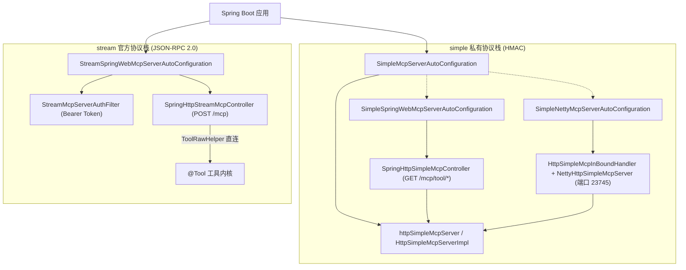
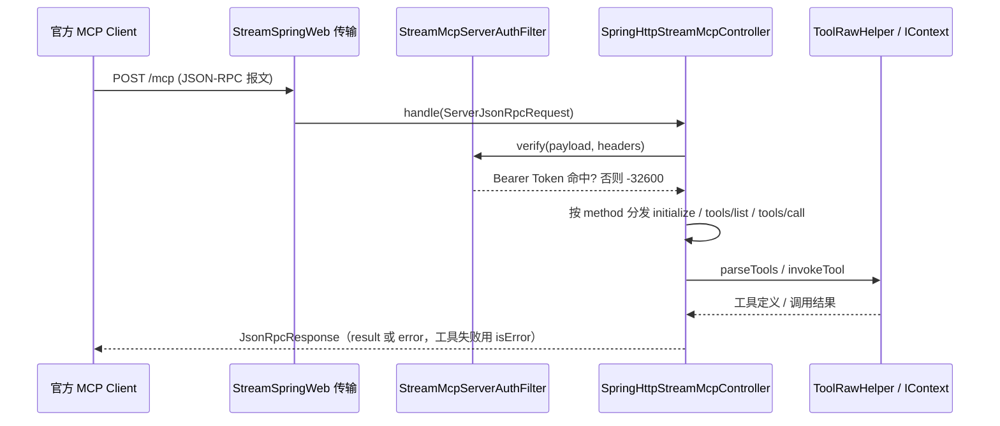

# i2f-springboot-ai-mcp-server

> MCP 服务端 Starter，在同一模块内并列提供两套服务端协议栈：**simple** 私有协议栈（HMAC-SHA256 签名认证，`/mcp/tool/list`、`/mcp/tool/call`，含 Spring Web MVC 与 Netty 双 HTTP 传输）与 **stream** 官方 MCP 协议栈（Streamable HTTP，单一 `POST /mcp` 端点、底层 JSON-RPC 2.0、Bearer Token 鉴权、直接桥接 `ToolRawHelper` 复用容器内 `@Tool`），把 Spring 容器中的工具以 MCP 协议对外暴露给远程 AI 主控调用。

## 模块路径

- `i2f-springboot/i2f-springboot-ai-mcp-server`

## 模块依赖

| GroupId | ArtifactId | Scope | Optional | 说明 |
|---------|------------|-------|----------|------|
| i2f.turbo | i2f-ai-std | compile | false | 工具链标准契约：`ToolBaseCallRequest`、`ToolRawHelper`、`ToolRawDefinition`、`JsonSchemaAnnotationResolver`、`ToolCallContextHolder`、`@Tool`/`@Tools`/`@ToolParam` |
| i2f.turbo | i2f-ai-rest-openai | compile | false | MCP 契约层：`simple` 协议（`HttpSimpleMcpServer`/`Impl`、`HttpSimpleMcpConstants`、`McpCallPayloadDto`）与 `official` 共享协议模型（`OfficialMcpConstants`、`JsonRpcRequest/Response`、`JsonRpc*Result`） |
| i2f.turbo | i2f-spring-core | compile | false | `SpringContext`（`IContext` 的 Spring 容器适配，工具扫描来源） |
| i2f.turbo | i2f-spring-web | compile | false | Spring Web 工具集（源码直接使用其传递引入的 `JacksonJsonSerializer`） |
| org.projectlombok | lombok | compile | false | 编译期代码生成（`@Data`/`@Slf4j`） |
| org.springframework.boot | spring-boot-starter | provided | true | Spring Boot 自动装配基础 |
| org.springframework.boot | spring-boot-configuration-processor | provided | true | `@ConfigurationProperties` 配置元数据生成 |
| org.springframework.boot | spring-boot-starter-web | provided | true | 两套栈的 Spring MVC 传输所需（Servlet、`RestController`） |
| io.netty | netty-all | provided | true | Netty 传输所需（模块内显式指定 4.1.65.Final） |

> 注意：源码直接使用的 `JacksonJsonSerializer` 属于 `i2f-extension-jackson`，本模块 POM 未显式声明，实际由 `i2f-spring-web` 传递引入。

## 模块设计

### 两套并列协议栈

本模块是 MCP 服务端的「Spring Boot 装配 + 传输适配层」，两套协议栈互不复用、各自独立装配：

- **simple 私有协议栈**：内核为 `i2f-ai-rest-openai` 的 `HttpSimpleMcpServerImpl`，带 HMAC-SHA256 验签 + 时间窗 + nonce 防重放 + 上下文透传；REST 路径分离（`GET /mcp/tool/list`、`/mcp/tool/call`），提供 Spring Web MVC（共享宿主端口）与 Netty（独立端口）两条传输。
- **stream 官方协议栈**：对齐官方 MCP 规范（protocolVersion `2024-11-05`，底层 JSON-RPC 2.0），复用 `i2f-ai-rest-openai` 的 `mcp.official` 共享 DTO/常量；单一 `POST /mcp` 端点按请求体 `method` 路由 `initialize`/`tools/list`/`tools/call`；**不依赖官方 SDK（官方 SDK 要求 JDK17）、不做 HMAC 验签**，直接桥接 `SpringContext` + `JsonSchemaAnnotationResolver` + `ToolRawHelper`，鉴权改为可选的 Bearer Token 过滤器。

> 关键不变量：stream 官方栈不得复用带 HMAC 语义的 `HttpSimpleMcpServer`（与官方标准冲突），故其控制器独立持有 `IContext` 并直连工具内核。

### 自动装配结构

| 自动配置类 | 开关（默认值） | 装配产物 | 附加条件 |
|-----------|---------------|---------|---------|
| `simple.SimpleMcpServerAutoConfiguration` | `...server.simple.enable`（true） | `httpSimpleMcpServer`（`HttpSimpleMcpServerImpl`） | Bean 级子开关 `...simple.server.enable`（true）+ `@ConditionalOnMissingBean(HttpSimpleMcpServer)` |
| `simple.springweb.SimpleSpringWebMcpServerAutoConfiguration` | `...simple.springweb.enable`（true） | `springHttpSimpleMcpController` | `@ConditionalOnClass(RestController)`、`@AutoConfigureAfter` simple 主配置 |
| `simple.netty.SimpleNettyMcpServerAutoConfiguration` | `...simple.netty.enable`（false） | `httpSimpleMcpInBoundHandler` + `nettyHttpSimpleMcpServer` | `@ConditionalOnClass(ServerBootstrap)`、子开关 `...netty.handler.enable`（true）/`...netty.server.enable`（true） |
| `stream.springweb.StreamSpringWebMcpServerAutoConfiguration` | `...stream.springweb.enable`（true） | `streamMcpServerAuthFilter` + `springHttpStreamMcpController` | `@ConditionalOnClass(RestController)`，完全独立于 simple 内核 |



### 官方协议请求处理



### 包结构

```
i2f.springboot.ai.mcp.server
├── simple                                             # 私有 simple 协议栈
│   ├── SimpleMcpServerAutoConfiguration               # 装配 HttpSimpleMcpServer
│   ├── properties/HttpSimpleMcpServerProperties       # 前缀 ...simple
│   ├── springweb
│   │   ├── SimpleSpringWebMcpServerAutoConfiguration
│   │   └── impl/SpringHttpSimpleMcpController         # GET /mcp/tool/*
│   └── netty
│       ├── SimpleNettyMcpServerAutoConfiguration
│       ├── properties/NettySimpleMcpServerProperties  # 前缀 ...simple.netty
│       └── impl/{NettyHttpSimpleMcpServer, HttpSimpleMcpInBoundHandler}
└── stream                                             # 官方 MCP 协议栈
    ├── properties/OfficialMcpServerProperties         # 前缀 ...stream
    ├── auth/StreamMcpServerAuthFilter                 # 鉴权扩展点
    ├── auth/impl/StaticStreamMcpServerAuthFilter      # Bearer Token 静态实现
    ├── data/ServerJsonRpcRequest                      # extends JsonRpcRequest<Map>
    └── springweb
        ├── StreamSpringWebMcpServerAutoConfiguration
        └── impl/SpringHttpStreamMcpController         # POST /mcp、DELETE /mcp
```

### 关键设计点

1. **双栈并列、内核不复用**：simple 与 stream 各有独立自动配置与控制器；simple 走 `HttpSimpleMcpServer` 内核 + HMAC，stream 直连 `ToolRawHelper` + Bearer，二者可在同一应用共存（simple 走 `/mcp/tool/*`，stream 走 `/mcp`）。
2. **官方协议零 SDK**：stream 栈不引入官方 MCP SDK（其要求 JDK17），仅复用 `i2f-ai-rest-openai` 的 `mcp.official` 契约，报文/方法/错误码全部走 JDK8 可用实现。
3. **`@RestController` 作为独立 Bean 注册**：`SpringHttpSimpleMcpController`、`SpringHttpStreamMcpController` 均带 `@RestController` 但通过 `@Bean` 方法产出，配合 `@ConditionalOnMissingBean` 允许应用覆盖。
4. **条件装配与分级开关**：每套栈「栈开关 → 传输开关 → （Netty）handler/server 子开关」，配合 `@ConditionalOnClass` 按 Classpath 探测框架，未引入目标框架时自动退让。
5. **mutator 链式装配**：Bean 构造统一 `toMutator().set(...).apply(...).done()`，可选依赖（`IExpireCache`、`IProxyInvocationHandler`、`StreamMcpServerAuthFilter`）以 `@Autowired(required = false)` 注入后按需装配。
6. **官方协议错误码严格沿用 JSON-RPC 2.0 预定义值**：`-32600`（信封非法/鉴权未过）、`-32601`（method 未路由）、`-32602`（`tools/call` 缺 `params`/`params.name`）、`-32603`（内部异常），不得替换为 HTTP 状态码；**工具自身执行失败/未找到属业务结果**，返回正常 `success` + 结果体 `isError` 标记。
7. **鉴权与上下文透传**：simple 传输在调用前 `ToolCallContextHolder.replaceAs` 恢复、`finally` 中 `clear`；stream 以 `StreamMcpServerAuthFilter.verify` 作为可插拔鉴权扩展点。

## 模块目的

1. **一键暴露本地工具**：引入 Starter 并定义 `@Tool`/`@Tools` Bean，即可把容器内工具以 MCP 协议暴露给远程 AI 主控调用。
2. **双协议栈并存**：对内/受信环境用轻量私有的 simple（HMAC + 上下文透传），对第三方标准 MCP 客户端用官方 stream（JSON-RPC 2.0），按对端能力选择。
3. **传输形态可选**：simple 支持 Spring MVC（共享 Web 端口）与 Netty（独立端口）两种部署形态。
4. **零 SDK 落地官方协议**：在 JDK8 约束下用共享契约实现官方 MCP 服务端能力，绕开官方 SDK 的 JDK17 门槛。
5. **零侵入装配**：条件装配 + 全程 `@ConditionalOnMissingBean`，未引入 Spring Web / Netty 时无副作用，组件均可替换。

## 模块功能

| 功能 | 入口类/方法 | 协议栈 | 说明 |
|------|------------|--------|------|
| simple 内核装配 | `SimpleMcpServerAutoConfiguration#httpSimpleMcpServer` | simple | 注册 `HttpSimpleMcpServer`，注入配置、可选缓存与调用处理器 |
| simple 工具列表/调用端点 | `SpringHttpSimpleMcpController`（MVC）、`HttpSimpleMcpInBoundHandler`（Netty） | simple | `GET /mcp/tool/list`、`/mcp/tool/call`，返回 `ApiResp` |
| simple 验签 | `HttpSimpleMcpServerImpl#assertValidMcpRequest`（上游） | simple | appId → 时间窗 → nonce 防重放 → HMAC-SHA256 比对 |
| 官方 initialize | `SpringHttpStreamMcpController#initialize` | stream | 返回 protocolVersion/capabilities(tools)/serverInfo |
| 官方 tools/list | `SpringHttpStreamMcpController#listTools` | stream | `ToolRawHelper.parseTools` → `JsonRpcToolListItem`（inputSchema 取 `getParameters()`） |
| 官方 tools/call | `SpringHttpStreamMcpController#callTool` | stream | `ToolRawHelper.invokeTool`，结果包装 `content[{type:"text"}]` + `isError` |
| 官方鉴权 | `StreamMcpServerAuthFilter` / `StaticStreamMcpServerAuthFilter` | stream | `Authorization: Bearer <token>` 白名单校验 |
| 配置属性 | `HttpSimpleMcpServerProperties` / `NettySimpleMcpServerProperties` / `OfficialMcpServerProperties` | — | 三组 `@ConfigurationProperties` |

## 模块主要使用方法

### 1. 引入依赖

```xml
<dependency>
    <groupId>i2f.turbo</groupId>
    <artifactId>i2f-springboot-ai-mcp-server</artifactId>
    <!-- 版本继承父 POM（1.0-jdk8） -->
</dependency>
```

### 2. 定义工具（两栈共用）

```java
@Component
@Tools(tags = {AiTags.READONLY_VALUE})
public class MyTools {
    @Tool(description = "get current datetime")
    public String get_current_datetime() { return LocalDateTime.now().toString(); }
}
```

### 3. 服务端配置

```yaml
i2f:
  springboot:
    ai:
      mcp:
        server:
          simple:                     # 私有 HMAC 协议栈
            enable: true
            server:
              enable: true            # 是否创建 HttpSimpleMcpServer Bean
            expire-window-minutes: 30
            hmac-name: HmacSHA256
            app-list:
              - app-id: "ai-master"
                app-key: "secret-key"
            springweb:
              enable: true            # Spring MVC 传输（默认开）
            netty:
              enable: false           # Netty 传输（默认关）
              port: 23745
              boss-thread: 4
              worker-thread: 0        # 0 表示 Netty 默认（CPU×2）
              max-content-length: 65536
              handler:
                enable: true
              server:
                enable: true
          stream:                     # 官方 MCP（Streamable HTTP / JSON-RPC 2.0）协议栈
            server-name: i2f-mcp-server
            server-version: 1.0.0
            springweb:
              enable: true            # 官方栈目前仅 Spring MVC 传输
            bearer-token:
              enable: true            # 关闭则放行所有请求
              allow-tokens:           # 未配置（null）会导致启动装配异常，见瑕疵章节
                - "xxxx"
```

### 4. 传输与端点

- **simple / Spring MVC**（默认）：宿主 Web 端口暴露 `GET /mcp/tool/list`、`/mcp/tool/call`。
- **simple / Netty**（默认关）：`netty.enable=true` 后以守护线程 `netty-mcp-server` 启动独立 HTTP 服务（默认 23745），`GET /mcp/tool/list`、`POST /mcp/tool/call`。
- **stream / 官方**：`springweb` 默认开，单一 `POST /mcp`（按 `method` 路由）+ `DELETE /mcp`（会话终止占位）。

两套栈可同时开启，路径互不冲突。

### 5. 可选增强与 Bean 覆盖

- **nonce 防重放**（simple）：提供任意 `IExpireCache<String,Object>` Bean 后，验签通过即写入 nonce（TTL 为窗口 2 倍），重复拒绝。
- **调用代理**：提供 `IProxyInvocationHandler` Bean，工具反射调用经过该处理器（日志/鉴权/埋点）。
- **自定义鉴权**（stream）：提供自己的 `StreamMcpServerAuthFilter` Bean 覆盖内置 Bearer 实现。
- **Bean 覆盖**：所有自动装配 Bean 均带 `@ConditionalOnMissingBean`，可完全接管。

### 注意事项

- simple 的 `app-list` 未配置时任何 `appId` 验签均失败；stream 的 `bearer-token.allow-tokens` 语义见瑕疵章节。
- 客户端侧：simple 配对 `i2f-springboot-ai-mcp-client` 的 simple provider（自动构造签名头），stream 配对官方标准 MCP 客户端或该 starter 的 stream provider。
- 命中端点响应统一为信封体（HTTP 状态码 200）；simple 为 `ApiResp`，stream 为 `JsonRpcResponse`（路由未命中/框架级错误仍由 Spring 返回对应 HTTP 状态码）。

## 模块特性总结

- **双协议栈并列**：simple（私有 HMAC）+ stream（官方 JSON-RPC 2.0），按对端能力择用
- **官方协议零 SDK**：JDK8 下用 `mcp.official` 共享契约落地 Streamable HTTP
- **多传输形态**：simple 支持 Spring MVC（共享端口）与 Netty（独立端口）
- **条件装配**：`@ConditionalOnClass` + 分级开关 + 全程 `@ConditionalOnMissingBean`，零侵入可替换
- **鉴权双模式**：simple HMAC 验签 + 时间窗 + 可选 nonce；stream 可插拔 Bearer Token 过滤器
- **错误码规范**：官方栈严格沿用 JSON-RPC 预定义码，工具失败以 `isError` 业务结果表达
- **上下文透传**：`ToolCallContextHolder` 恢复/清理，远程与本地工具一致体验
- **双注册机制**：兼容 `spring.factories` 与 Spring Boot 2.7+ `AutoConfiguration.imports`

## 模块瑕疵或错误

> 以下为静态识别的潜在问题，未作运行期实证。

### 两套栈共性

1. **传递依赖直接使用**：源码直接引用 `JacksonJsonSerializer`（属 `i2f-extension-jackson`），POM 未显式声明，仅靠 `i2f-spring-web` 传递引入；且 `new JacksonJsonSerializer(new ObjectMapper())` 新建独立 `ObjectMapper`，不复用宿主已定制（如注册 JavaTimeModule）的 Bean，序列化行为可能与宿主不一致。
2. **工具解析无缓存**：`ToolRawHelper.parseTools` 每次列表/调用都全量遍历容器 Bean 反射解析，工具多时开销大；stream 的 `callTool` 亦在每次调用重新 `parseTools` 全量扫描后再定位单个工具。

### simple 私有栈

3. **认证未覆盖工具调用接口（安全）**：上游 `HttpSimpleMcpServerImpl.getTools()` 执行 `assertValidMcpRequest`，但 `callTool()` 未调用；两种传输都直接转发，默认装配下 `/mcp/tool/call` 疑似可被任意请求直接触发工具执行。
4. **Spring MVC 模式调用端点用 `@GetMapping`**：`SpringHttpSimpleMcpController` 对 `/mcp/tool/call` 用 `@GetMapping` + `@RequestBody`，与 Netty（强制 POST）及配套客户端（POST）不一致，用配套客户端调用会因方法不匹配返回 405；且 GET 携带请求体本身非常规。
5. **Netty 启动失败静默化**：`nettyHttpSimpleMcpServer` 以守护线程 `server.start()`，端口占用等异常仅 `log.warn`，应用照常启动但 Netty 服务缺失。
6. **配置元数据文件存在错误项**：`additional-spring-configuration-metadata.json` 中属性 `i2f.springboot.ai.model.dashscope.enable`（描述却为 springweb 开关）与分组 `i2f.springboot.ai.proxy` 疑为笔误（应为 `...simple.springweb.enable`/对应分组）；另含两条与本模块无关的 servlet/tomcat hints，IDE 配置提示可能失真。
7. **次要代码问题**：`SpringHttpSimpleMcpController` 两个处理方法同名 `getTools`（重载，可读性差）；`HttpSimpleMcpInBoundHandler#exceptionCaught`/未知路由/错误方法均以 HTTP 200 + `ApiResp.error` 返回。

### stream 官方栈

8. **`allow-tokens` 未配置可能启动即 NPE（潜在致命）**：`StreamSpringWebMcpServerAutoConfiguration#streamMcpServerAuthFilter` 中 `new HashSet<>(officialMcpServerProperties.getBearerToken().getAllowTokens())`，而 `BearerTokenOptions.allowTokens` 默认 `null`；`bearer-token.enable` 默认 `true`，用户若开启官方栈却不配 `allow-tokens`，Bean 构造将传入 `null` 集合，存在 NPE 风险。
9. **鉴权失败返回 `-32600`（语义混用）**：`verify` 未通过时返回 `CODE_INVALID_REQUEST(-32600)`，与「信封非法」共用同一码；`StaticStreamMcpServerAuthFilter` 在 `enable=true` 且白名单为空时一律拒绝，可能使合法客户端难以排查。
10. **会话生命周期缺失**：定义了 `HEADER_MCP_SESSION_ID`，但 `initialize` 不生成、`handle` 不校验 `Mcp-Session-Id`，`DELETE /mcp` 为空 TODO 占位；为完全无状态实现，依赖会话的官方客户端行为可能不符预期。
11. **`initialize` 能力声明固定**：`capabilities.tools.listChanged` 恒为 `false`，`serverInfo` 仅取配置名/版本，无协议方法/通知（如 `notifications/*`）支持；仅覆盖 tools 单能力面。

## 自动装配与配置参考

### 配置属性总览

simple（前缀 `i2f.springboot.ai.mcp.server.simple`）：

| 属性 | 类型 | 默认值 | 说明 |
|------|------|--------|------|
| `...simple.enable` | `boolean` | `true` | simple 主自动配置开关 |
| `...simple.server.enable` | `boolean` | `true` | `HttpSimpleMcpServer` Bean 开关 |
| `...simple.expire-window-minutes` | `long` | `30` | 时间戳容差窗口（分钟），决定 nonce TTL（2 倍） |
| `...simple.hmac-name` | `String` | `HmacSHA256` | HMAC 签名算法名 |
| `...simple.app-list` | `List<HttpSimpleMcpAppItem>` | `null` | 授权应用列表（`appId`/`appKey`） |
| `...simple.springweb.enable` | `boolean` | `true` | Spring MVC 传输开关（需 `RestController`） |
| `...simple.netty.enable` | `boolean` | `false` | Netty 传输开关（需 `ServerBootstrap`） |
| `...simple.netty.handler.enable` | `boolean` | `true` | 入站处理器 Bean 开关 |
| `...simple.netty.server.enable` | `boolean` | `true` | Netty 服务器 Bean 开关 |
| `...simple.netty.port` | `int` | `23745` | Netty 监听端口 |
| `...simple.netty.boss-thread` | `int` | `4` | Boss 线程数 |
| `...simple.netty.worker-thread` | `int` | `0` | Worker 线程数（0=Netty 默认 CPU×2） |
| `...simple.netty.max-content-length` | `int` | `65536` | HTTP 聚合最大内容长度（字节） |

stream（前缀 `i2f.springboot.ai.mcp.server.stream`）：

| 属性 | 类型 | 默认值 | 说明 |
|------|------|--------|------|
| `...stream.springweb.enable` | `boolean` | `true` | 官方协议 Spring MVC 传输开关 |
| `...stream.server-name` | `String` | `i2f-mcp-server` | initialize 返回的 serverInfo.name |
| `...stream.server-version` | `String` | `1.0.0` | initialize 返回的 serverInfo.version |
| `...stream.bearer-token.enable` | `boolean` | `true` | Bearer Token 鉴权开关（false 则放行） |
| `...stream.bearer-token.allow-tokens` | `List<String>` | `null` | 允许的 Bearer Token 白名单（见瑕疵 8） |

### 协议端点

| 项目 | 值 |
|------|-----|
| simple 工具列表 | `GET /mcp/tool/list` |
| simple 工具调用 | `POST /mcp/tool/call`（Netty）/ `GET /mcp/tool/call`（Spring MVC，见瑕疵 4） |
| simple 签名头 | `X-App-Id`、`X-App-Date`（秒级 16 进制）、`X-App-Nonce`、`X-App-Sign` |
| simple 签名载荷 | `appId#timestamp#nonce[#content[#context]]` |
| 官方端点 | `POST /mcp`（按 `method` 路由）、`DELETE /mcp`（会话终止占位） |
| 官方协议版本 | `2024-11-05`（JSON-RPC 2.0 信封 `2.0`） |
| 官方鉴权头 | `Authorization: Bearer <token>` |
| 官方错误码 | `-32600` / `-32601` / `-32602` / `-32603`（预定义码，不用 HTTP 状态码） |

### 自动注册清单

```
# META-INF/spring.factories 与 META-INF/spring/...AutoConfiguration.imports 均登记以下四个：
i2f.springboot.ai.mcp.server.simple.SimpleMcpServerAutoConfiguration
i2f.springboot.ai.mcp.server.simple.netty.SimpleNettyMcpServerAutoConfiguration
i2f.springboot.ai.mcp.server.simple.springweb.SimpleSpringWebMcpServerAutoConfiguration
i2f.springboot.ai.mcp.server.stream.springweb.StreamSpringWebMcpServerAutoConfiguration
```

## 与相关模块的关系

- **`i2f-ai-rest-openai`**：提供 simple 协议契约与默认实现，及 `mcp.official` 官方共享协议模型（常量 + JSON-RPC DTO）；本模块只做 Spring Boot 装配与传输/桥接适配。
- **`i2f-ai-std`**：提供 `@Tool`/`@Tools`/`@ToolParam`、`ToolBaseCallRequest`、`ToolRawHelper`、`JsonSchemaAnnotationResolver`、`ToolCallContextHolder` 等工具链标准契约。
- **`i2f-spring-core`**：`SpringContext` 把 Spring 容器适配为 `IContext`，作为两套栈共同的工具扫描来源。
- **`i2f-springboot-ai-mcp-client`**：对端客户端 Starter（simple provider + stream provider），与本模块配对实现「AI 主控 → 远程工具」；两端 JSON-RPC DTO 各自平行维护，本模块 pom 不依赖 client 模块。
