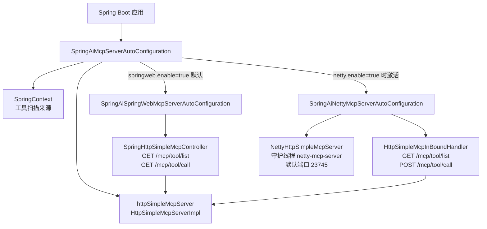
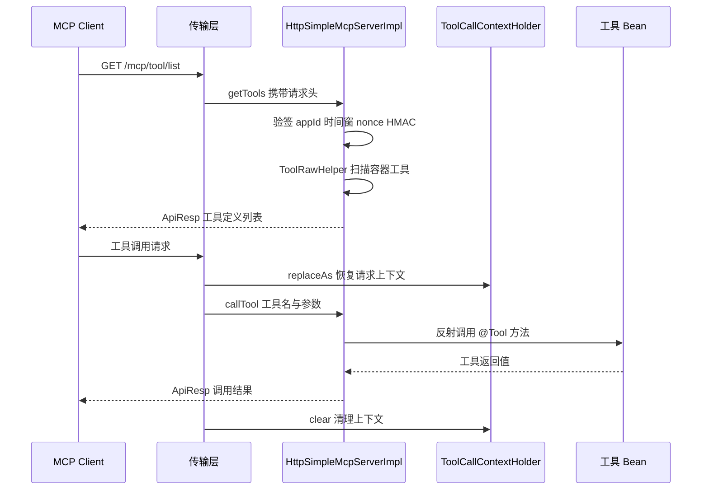

# i2f-springboot-ai-mcp-server

> MCP 服务端 Starter —— 将 Spring 容器中的 `@Tool`/`@Tools` 工具以 HMAC-SHA256 签名认证的 Simple MCP 协议（`/mcp/tool/list`、`/mcp/tool/call`）对外暴露，内置 Spring Web MVC（共享宿主 Web 端口）与 Netty（独立端口）双传输模式的自动装配，并支持 nonce 防重放与请求级上下文透传。

## 模块路径

- `i2f-springboot/i2f-springboot-ai-mcp-server`

## 模块依赖

| GroupId | ArtifactId | Scope | Optional | 说明 |
|---------|------------|-------|----------|------|
| i2f.turbo | i2f-ai-std | compile | false | AI 标准契约：`ToolBaseCallRequest`、`ToolDefinition`、`ToolRawHelper`、`ToolCallContextHolder`、`@Tool`/`@Tools`/`@ToolParam` 注解 |
| i2f.turbo | i2f-ai-rest-openai | compile | false | Simple MCP 协议契约与实现：`HttpSimpleMcpServer`、`HttpSimpleMcpServerImpl`、`HttpSimpleMcpConstants`、`McpCallPayloadDto` |
| i2f.turbo | i2f-spring-core | compile | false | `SpringContext`（`IContext` 的 Spring 容器适配，作为工具扫描来源） |
| i2f.turbo | i2f-spring-web | compile | false | Spring Web 工具集（源码直接使用其传递引入的 `JacksonJsonSerializer`） |
| org.projectlombok | lombok | compile | false | 编译期代码生成（`@Data`/`@Slf4j`） |
| org.springframework.boot | spring-boot-starter | provided | true | Spring Boot 自动装配基础 |
| org.springframework.boot | spring-boot-configuration-processor | provided | true | `@ConfigurationProperties` 配置元数据生成 |
| org.springframework.boot | spring-boot-starter-web | provided | true | Spring Web MVC 传输模式所需（Servlet、`RestController`） |
| io.netty | netty-all | provided | true | Netty 传输模式所需（模块内显式指定 4.1.65.Final） |

> 注意：源码直接使用的 `JacksonJsonSerializer` 属于 `i2f-extension-jackson`，本模块 POM 未显式声明该依赖，实际由 `i2f-spring-web` 传递引入。

## 模块设计

### 架构设计

本模块位于 Simple MCP 工具网关体系的「服务端传输适配层」，整体分为三层：

- **协议契约层**（`i2f-ai-rest-openai`）：定义 `HttpSimpleMcpServer` 接口、`/mcp/tool/*` 端点与签名头常量，并由 `HttpSimpleMcpServerImpl` 实现工具枚举与反射调用；设计上不感知任何 Web 框架，只接收由 `HttpHeaders` + `McpCallPayloadDto` 组装的 `HttpSimpleMcpRequest`
- **传输适配层**（本模块）：把 MCP 协议的服务端能力装配进 Spring Boot 应用，提供 Spring Web MVC 与 Netty 两条 HTTP 传输链路，并将各自的 HTTP 请求归一化为 `HttpSimpleMcpRequest`，共享同一个 `HttpSimpleMcpServer` 内核
- **工具来源层**（`i2f-ai-std` + `i2f-spring-core`）：`SpringContext` 把 Spring 容器适配为 `IContext`，`ToolRawHelper` 遍历容器全部 Bean，将带 `@Tools`/`@Tool` 注解的对象解析为 `ToolDefinition`（含 JSON Schema），同时识别 `ToolRawDefinitionsProvider` 类型的 Bean

### 自动装配结构

三个自动配置类的职责与条件：

| 自动配置类 | 开关（默认值） | 装配产物 | 附加条件 |
|-----------|---------------|---------|---------|
| `SpringAiMcpServerAutoConfiguration` | `i2f.springboot.ai.mcp.server.enable`（true）、`...simple-server.enable`（true） | `httpSimpleMcpServer`（`HttpSimpleMcpServerImpl`） | `@ConditionalOnMissingBean(HttpSimpleMcpServer)` |
| `SpringAiSpringWebMcpServerAutoConfiguration` | `i2f.springboot.ai.mcp.server.springweb.enable`（true） | `springHttpSimpleMcpController` | `@ConditionalOnClass(RestController)`、`@AutoConfigureAfter` 主配置 |
| `SpringAiNettyMcpServerAutoConfiguration` | `i2f.springboot.ai.mcp.server.netty.enable`（false） | `httpSimpleMcpInBoundHandler` + `nettyHttpSimpleMcpServer` | `@ConditionalOnClass(ServerBootstrap)`、`@AutoConfigureAfter` 主配置、子开关 `netty.handler.enable`（true）与 `netty.server.enable`（true） |



### 请求处理流程



### 包结构

```
i2f.springboot.ai.mcp.server
├── SpringAiMcpServerAutoConfiguration              # 主装配：注册 HttpSimpleMcpServer
├── properties
│   └── HttpSimpleMcpServerProperties               # simple-server 配置属性
├── springweb
│   ├── SpringAiSpringWebMcpServerAutoConfiguration # Spring MVC 传输装配
│   └── impl
│       └── SpringHttpSimpleMcpController           # REST Controller（/mcp/tool/*）
└── netty
    ├── SpringAiNettyMcpServerAutoConfiguration     # Netty 传输装配（守护线程启动）
    ├── properties
    │   └── NettySimpleMcpServerProperties          # netty 配置属性
    └── impl
        ├── NettyHttpSimpleMcpServer                # Netty HTTP 服务器
        └── HttpSimpleMcpInBoundHandler             # 入站请求处理器
```

### 关键设计点

1. **双传输、单内核**：Spring Web MVC 与 Netty 两条链路互不感知，均把 HTTP 请求归一化为 `HttpSimpleMcpRequest` 后调用同一个 `HttpSimpleMcpServer` Bean，因此认证、工具枚举、调用、上下文透传逻辑在两种模式下完全一致。
2. **条件装配与分级开关**：总开关（`server.enable`）→ 内核开关（`simple-server.enable`）→ 传输开关（`springweb.enable` / `netty.enable`）→ Netty 内部再分 handler/server 两个子开关，并配合 `@ConditionalOnClass` 按 Classpath 探测目标框架是否存在。
3. **全程 `@ConditionalOnMissingBean` 可替换**：`HttpSimpleMcpServer`、`HttpSimpleMcpInBoundHandler`、`NettyHttpSimpleMcpServer`、`SpringHttpSimpleMcpController` 四个 Bean 均允许应用自定义覆盖。
4. **mutator 链式装配**：Bean 构造统一使用 `i2f-mutator` 的 `toMutator().set(...).apply(...).done()` 链式流装配，可选依赖（`IExpireCache`、`IProxyInvocationHandler`）以 `@Autowired(required = false)` 注入后按需装配。
5. **双注册文件**：同时提供 `META-INF/spring.factories`（Spring Boot 2.6 之前的机制）与 `META-INF/spring/org.springframework.boot.autoconfigure.AutoConfiguration.imports`（Spring Boot 2.7+ 新机制），并在 `META-INF/additional-spring-configuration-metadata.json` 中补充配置元数据。
6. **请求级上下文透传**：两种传输在调用工具前执行 `ToolCallContextHolder.replaceAs(contextMap)` 恢复远端上下文，`finally` 中 `clear()` 清理，避免 ThreadLocal 泄漏；工具内部可像本地调用一样通过 `ToolCallContextHolder.get("req")` 读取请求数据。

## 模块目的

1. **一键暴露本地工具**：应用只需引入本 Starter 并定义 `@Tool`/`@Tools` Bean，即可把容器内工具以 Simple MCP HTTP 协议暴露给远程 AI 主控服务（MCP Client）调用。
2. **传输形态可选**：Web 应用内共享宿主端口（Spring MVC）或独立端口运行（Netty），适配「AI 能力内嵌在业务服务」与「独立 AI 工具服务」两类部署形态。
3. **安全认证**：基于 HMAC-SHA256 的签名认证（appId/appKey 授权列表 + 时间窗 + 可选 nonce 防重放），保证工具列表与调用请求的合法性与完整性。
4. **上下文透明透传**：让远程工具调用与本地调用拥有一致的请求上下文访问体验（`ToolCallContextHolder`）。
5. **零侵入装配**：通过条件装配与 `@ConditionalOnMissingBean`，对未引入 Spring Web / Netty 的应用无副作用，且所有组件均可被应用替换。

## 模块功能

| 功能 | 入口类/方法 | 说明 |
|------|------------|------|
| 核心服务装配 | `SpringAiMcpServerAutoConfiguration#httpSimpleMcpServer` | 注册 `HttpSimpleMcpServer`（`HttpSimpleMcpServerImpl`），注入配置、可选缓存与调用处理器 |
| 工具列表端点 | `SpringHttpSimpleMcpController#getTools` / `HttpSimpleMcpInBoundHandler#channelRead0` | `GET /mcp/tool/list`，返回 `ApiResp<List<ToolDefinition>>` |
| 工具调用端点 | `SpringHttpSimpleMcpController#getTools`（重载）/ `HttpSimpleMcpInBoundHandler#channelRead0` | `/mcp/tool/call`，Netty 模式限制为 POST，Spring MVC 模式为 GET（详见瑕疵章节） |
| 签名验签 | `HttpSimpleMcpServerImpl#assertValidMcpRequest` | appId 匹配授权列表 → 时间窗校验 → nonce 防重放（有 `IExpireCache` 时）→ HMAC-SHA256 签名比对（上游实现） |
| 上下文透传 | `ToolCallContextHolder#replaceAs / clear` | 调用前恢复 JSON 反序列化的上下文，调用后强制清理 |
| Netty HTTP 服务器 | `NettyHttpSimpleMcpServer#start` | `HttpServerCodec → HttpObjectAggregator → HttpSimpleMcpInBoundHandler` 管线，守护线程 `netty-mcp-server` 启动 |
| 配置属性 | `HttpSimpleMcpServerProperties` / `NettySimpleMcpServerProperties` | `@ConfigurationProperties` 声明两组配置前缀 |

## 模块主要使用方法

### 1. 引入依赖

```xml
<dependency>
    <groupId>i2f.turbo</groupId>
    <artifactId>i2f-springboot-ai-mcp-server</artifactId>
    <!-- 版本继承父 POM 统一管理（1.0-jdk8） -->
</dependency>
```

### 2. 定义工具

工具方法通过 `i2f-ai-std` 的注解声明（`i2f.ai.std.tool.annotations` 包），并被自动扫描：

```java
@Component
@Tools(tags = {AiTags.READONLY_VALUE})
public class MyTools {

    @Tool(description = "get current datetime")
    public String get_current_datetime() {
        return LocalDateTime.now().toString();
    }

    @Tool(description = "calculate the sum of two numbers")
    public double add(
            @ToolParam(value = "a", description = "first number") double a,
            @ToolParam(value = "b", description = "second number") double b) {
        return a + b;
    }
}
```

- `@Tools` 标注在类上，声明该类为工具集（可带 tags 分类）
- `@Tool` 标注在 public 方法上，`description` 为必填项，供 AI 理解工具用途
- `@ToolParam` 提供参数名与描述，用于生成 JSON Schema

### 3. 服务端配置

```yaml
i2f:
  springboot:
    ai:
      mcp:
        server:
          enable: true                 # 总开关，默认 true
          simple-server:
            enable: true               # HttpSimpleMcpServer Bean 开关，默认 true
            expire-window-minutes: 30  # 请求时间戳容差窗口（分钟），默认 30
            hmac-name: HmacSHA256      # HMAC 算法名，默认 HmacSHA256
            app-list:                  # 授权应用列表；不配置则所有请求验签失败
              - app-id: "ai-master"
                app-key: "secret-key"
          springweb:
            enable: true               # Spring MVC 传输，默认 true
          netty:
            enable: false              # Netty 传输，默认 false（需手动开启）
            port: 23745
            boss-thread: 4
            worker-thread: 0           # 0 表示 Netty 默认（CPU 核数 × 2）
            max-content-length: 65536
```

### 4. 传输模式选择

- **Spring Web MVC 模式（默认开启）**：引入 `spring-boot-starter-web` 后自动注册 `SpringHttpSimpleMcpController`，MCP 端点直接挂载在宿主 Web 端口上（`GET /mcp/tool/list`、`GET /mcp/tool/call`）。适用于 AI 能力与业务 Web 服务同进程部署的场景。
- **Netty 模式（默认关闭）**：设置 `i2f.springboot.ai.mcp.server.netty.enable: true` 后启动独立 Netty HTTP 服务器（默认端口 `23745`），以守护线程方式随应用生命周期运行（`GET /mcp/tool/list`、`POST /mcp/tool/call`）。适用于独立 AI 工具服务或无法使用 Servlet 容器的场景。

两种模式可同时开启（端口互不冲突），共享同一个 `HttpSimpleMcpServer` 内核。

### 5. 可选增强与 Bean 覆盖

- **nonce 防重放**：向容器提供任意 `i2f.cache.std.expire.IExpireCache<String, Object>` 实现 Bean 后，服务端在验签通过后写入 nonce 记录（TTL 为 `expireWindowMinutes × 2`），重复 nonce 请求将被拒绝；未提供时跳过 nonce 检查。
- **调用代理**：向容器提供 `i2f.proxy.std.IProxyInvocationHandler` Bean 后，工具方法的反射调用将经过该处理器（可用于日志、鉴权、埋点等横切逻辑）。
- **Bean 覆盖**：由于所有 Bean 均带 `@ConditionalOnMissingBean`，应用可自行定义 `HttpSimpleMcpServer`、`HttpSimpleMcpInBoundHandler`、`NettyHttpSimpleMcpServer` 等 Bean 完全接管装配。

### 注意事项

- `app-list` 未配置（默认 null）时，任何 `appId` 都无法通过识别，工具列表接口将直接返回验签失败；服务端必须至少配置一组 `app-id`/`app-key`。
- 客户端侧需使用配套的 `i2f-springboot-ai-mcp-client`（或直接使用 `HttpSimpleMcpClientToolProvider`），由客户端自动完成时间戳、nonce 与 HMAC 签名头的构造。
- 工具调用支持请求级上下文透传：客户端把 `ToolCallContextHolder` 快照随请求发送，服务端在工具执行前恢复、执行后清理，远程工具内部可透明读取 `ToolCallContextHolder.get("req")`。
- 命中端点的响应统一为 `ApiResp` 信封（HTTP 状态码均为 200，错误信息在 `ApiResp.code`/`msg` 中）；Spring MVC 模式下路由未命中等框架级错误仍由 Spring 处理并返回对应的 HTTP 状态码。

## 模块特性总结

- **双传输模式**：Spring Web MVC（共享 Web 端口）与 Netty（独立端口）双实现，可按部署形态自由组合
- **条件装配**：`@ConditionalOnClass` + 四级开关，未引入目标框架时自动退让，零侵入
- **全程可替换**：所有自动装配 Bean 均带 `@ConditionalOnMissingBean`
- **HMAC-SHA256 签名认证**：appId/appKey 授权列表 + 时间窗 + 可选 nonce 防重放
- **上下文透传**：`ToolCallContextHolder` 恢复/清理，远程工具与本地工具一致的上下文访问体验
- **协议与传输解耦**：内核不依赖任何 Web 框架类型，新增传输形态只需实现请求归一化
- **双注册机制**：兼容 `spring.factories` 与 Spring Boot 2.7+ `AutoConfiguration.imports`

## 模块瑕疵或错误

1. **`SpringContext` 未绑定 ApplicationContext（潜在致命）**：`SpringAiMcpServerAutoConfiguration#httpSimpleMcpServer()` 中使用 `new SpringContext()` 无参构造（`applicationContext`/`beanFactory` 均为 null），而全仓其余 12 处同类用法均为 `new SpringContext(applicationContext)`；一旦触发工具枚举（`ToolRawHelper.parseTools` → `context.getAllBeans()`），将因 `applicationContext` 为 null 而失败，导致工具列表与工具调用整体不可用。配置类本身持有 `applicationContext` 字段（`ApplicationContextAware`），疑为装配时漏传。
2. **认证未覆盖工具调用接口（安全）**：上游 `HttpSimpleMcpServerImpl.getTools()` 会执行 `assertValidMcpRequest` 验签，但 `callTool()` 未调用该方法；本模块两种传输均直接转发到该实现，且 Spring MVC 模式默认开启。在默认装配下，`/mcp/tool/call` 端点疑似可被任意网络请求直接触发工具执行。
3. **Spring MVC 模式工具调用端点使用 `@GetMapping`**：`SpringHttpSimpleMcpController` 对 `/mcp/tool/call` 使用 `@GetMapping` + `@RequestBody`，与 Netty 模式（强制 POST，非 POST 返回 `bad request method!`）以及配套客户端 `HttpSimpleMcpClientToolProvider`（POST）不一致；使用配套客户端调用 Spring MVC 模式服务端会因方法不匹配返回 405。
4. **配置元数据文件存在错误项**：`META-INF/additional-spring-configuration-metadata.json` 中属性名 `i2f.springboot.ai.model.dashscope.enable`（描述为 springweb 开关）与分组名 `i2f.springboot.ai.proxy` 疑为笔误，按语义应为 `i2f.springboot.ai.mcp.server.springweb.enable` 与 `i2f.springboot.ai.mcp.server.springweb`；另有两条与本模块无关的 servlet/tomcat hints，IDE 配置提示可能失真。
5. **传递依赖直接使用**：源码直接引用 `JacksonJsonSerializer`（属于 `i2f-extension-jackson`），但 POM 未显式声明该依赖，仅靠 `i2f-spring-web` 传递引入；且装配时使用 `new JacksonJsonSerializer(new ObjectMapper())` 新建独立 `ObjectMapper`，不会复用宿主应用中已定制（如注册 JavaTimeModule）的 `ObjectMapper` Bean，序列化行为可能与宿主应用不一致。
6. **Netty 启动失败静默化**：`nettyHttpSimpleMcpServer` Bean 以守护线程启动 `server.start()`，端口占用等异常仅 `log.warn` 记录，应用照常启动但 Netty 服务缺失；启动成功信息使用 `System.out.println` 输出而非日志体系。
7. **服务端工具解析无缓存**：`HttpSimpleMcpServerImpl.listTools()` 每次请求都会全量遍历容器 Bean 并反射解析工具定义（`ToolRawHelper.parseTools`），服务端无任何缓存，工具数量较多时列表与调用请求均存在重复解析开销。
8. **次要代码问题**：`SpringHttpSimpleMcpController` 两个处理方法同名 `getTools`（重载，可读性差）；`HttpSimpleMcpInBoundHandler#exceptionCaught` 使用 `printStackTrace` 并直接关闭连接，未返回统一的 `ApiResp` 错误响应；未知路由与错误请求方法均以 HTTP 200 + `ApiResp.error` 返回。

## 自动装配与配置参考

### 配置属性总览

主开关与 simple-server（前缀 `i2f.springboot.ai.mcp.server` / `i2f.springboot.ai.mcp.server.simple-server`）：

| 属性 | 类型 | 默认值 | 说明 |
|------|------|--------|------|
| `i2f.springboot.ai.mcp.server.enable` | `boolean` | `true` | 主自动配置总开关 |
| `i2f.springboot.ai.mcp.server.simple-server.enable` | `boolean` | `true` | `HttpSimpleMcpServer` Bean 开关 |
| `i2f.springboot.ai.mcp.server.simple-server.expire-window-minutes` | `long` | `30` | 请求时间戳容差窗口（分钟），决定 nonce 记录 TTL（2 倍） |
| `i2f.springboot.ai.mcp.server.simple-server.hmac-name` | `String` | `HmacSHA256` | HMAC 签名算法名 |
| `i2f.springboot.ai.mcp.server.simple-server.app-list` | `List<HttpSimpleMcpAppItem>` | `null` | 授权应用列表（`appId`/`appKey` 对） |

Spring Web MVC 传输（前缀 `i2f.springboot.ai.mcp.server.springweb`）：

| 属性 | 类型 | 默认值 | 说明 |
|------|------|--------|------|
| `i2f.springboot.ai.mcp.server.springweb.enable` | `boolean` | `true` | Spring MVC 传输开关（另需 Classpath 存在 `RestController`） |

Netty 传输（前缀 `i2f.springboot.ai.mcp.server.netty`）：

| 属性 | 类型 | 默认值 | 说明 |
|------|------|--------|------|
| `i2f.springboot.ai.mcp.server.netty.enable` | `boolean` | `false` | Netty 传输总开关（另需 Classpath 存在 `ServerBootstrap`） |
| `i2f.springboot.ai.mcp.server.netty.handler.enable` | `boolean` | `true` | 入站处理器 Bean 开关 |
| `i2f.springboot.ai.mcp.server.netty.server.enable` | `boolean` | `true` | Netty 服务器 Bean 开关 |
| `i2f.springboot.ai.mcp.server.netty.port` | `int` | `23745` | Netty 监听端口 |
| `i2f.springboot.ai.mcp.server.netty.boss-thread` | `int` | `4` | Boss 线程数 |
| `i2f.springboot.ai.mcp.server.netty.worker-thread` | `int` | `0` | Worker 线程数（0 表示 Netty 默认，CPU 核数 × 2） |
| `i2f.springboot.ai.mcp.server.netty.max-content-length` | `int` | `65536` | HTTP 聚合最大内容长度（字节） |

### 协议端点与请求头

端点常量来自 `i2f-ai-rest-openai` 的 `HttpSimpleMcpConstants`：

| 项目 | 值 |
|------|-----|
| 工具列表 | `GET /mcp/tool/list` |
| 工具调用 | `POST /mcp/tool/call`（Netty）/ `GET /mcp/tool/call`（Spring MVC，见瑕疵章节） |
| 应用 ID 头 | `X-App-Id` |
| 时间戳头 | `X-App-Date`（秒级时间戳的 16 进制字符串） |
| 随机数头 | `X-App-Nonce` |
| 签名头 | `X-App-Sign`（`Base64(HmacSHA256(payload, appKey))`） |

签名载荷格式：`appId#timestamp#nonce[#content[#context]]`（`content` 为工具调用请求 JSON，`context` 为上下文 JSON，二者非空时纳入签名）。

### 自动注册清单

```
# META-INF/spring.factories 与 META-INF/spring/org.springframework.boot.autoconfigure.AutoConfiguration.imports
i2f.springboot.ai.mcp.server.SpringAiMcpServerAutoConfiguration
i2f.springboot.ai.mcp.server.netty.SpringAiNettyMcpServerAutoConfiguration
i2f.springboot.ai.mcp.server.springweb.SpringAiSpringWebMcpServerAutoConfiguration
```

## 与相关模块的关系

- **`i2f-ai-rest-openai`**：提供 Simple MCP 协议契约（`HttpSimpleMcpServer`）与默认实现（`HttpSimpleMcpServerImpl`）、端点/请求头常量；本模块只做 Spring Boot 装配与传输适配。
- **`i2f-ai-std`**：提供工具声明注解（`@Tool`/`@Tools`/`@ToolParam`）、`ToolBaseCallRequest`、`ToolDefinition`、`ToolRawHelper`、`ToolCallContextHolder` 等工具链标准契约。
- **`i2f-springboot-ai-mcp-client`**：对端的 MCP 客户端 Starter，自动把远程 MCP Server 注册为 `McpToolProvider`；与本模块配对实现「AI 主控服务 → 远程工具服务」的分布式工具调用。
- **`i2f-springboot-ops-starter`**：本地 AI Agent 工具管理装配（`ContextAppMcpToolProvider`、ToolManager 网关等），面向「AI 调用本地工具」；与本模块「把工具暴露给远程」形成互补。
