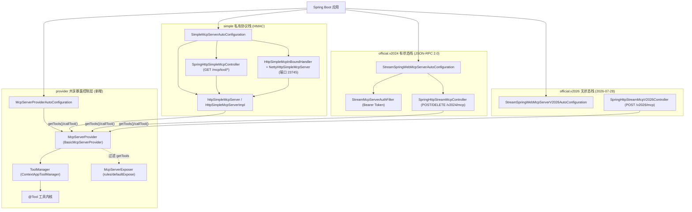

# i2f-springboot-ai-mcp-server

> MCP 服务端 Starter，在同一模块内并列三套服务端协议栈：**simple** 私有协议栈（HMAC-SHA256 验签，`/mcp/tool/*`，Spring Web
> MVC 与 Netty 双 HTTP 传输）、**official.v2024** 官方有状态栈（protocolVersion 2024-11-05，`POST /v2024/mcp`，initialize
> 握手 + tools，Bearer Token 鉴权）与 **official.v2026** 官方无状态栈（2026-07-28，`POST /v2026/mcp`，无
> initialize、server/discover 发现 + 镜像请求头一致性校验）。三套栈的工具来源不再各自反射，而是统一委托 `provider`
> 层装配的单一 `McpServerProvider`（`i2f-ai-std` 的 mcp/server 契约：`ToolManager` + `McpServerExposer`
> ），据 `provider.rules`/`default-expose` 与 `@McpServerExpose` 选择性把 Spring 容器中的 `@Tool` 工具开放为 MCP 工具供远程
> AI 主控调用。

## 模块路径

- `i2f-springboot/i2f-springboot-ai-mcp-server`

## 模块依赖

| GroupId                  | ArtifactId                          | Scope    | Optional | 说明                                                                                                                                                                                                                                                                            |
|--------------------------|-------------------------------------|----------|----------|-------------------------------------------------------------------------------------------------------------------------------------------------------------------------------------------------------------------------------------------------------------------------------|
| i2f.turbo                | i2f-ai-std                          | compile  | false    | 工具链与 MCP 服务端标准契约：`@Tool`/`@Tools`/`@ToolParam`、`ToolBaseCallRequest`、`ToolManager`/`ContextAppToolManager`，及 `mcp.server` 的 `McpServerProvider`/`BasicMcpServerProvider`/`McpServerExposer`/`BasicMcpServerExposer`/`McpServerExposeRule`（三栈共享的工具暴露/调用内核）                     |
| i2f.turbo                | i2f-ai-rest-openai                  | compile  | false    | MCP 契约层：`simple` 协议（`HttpSimpleMcpServer`/`Impl`、`HttpSimpleMcpConstants`、`McpCallPayloadDto`）与 `official` 共享协议模型（`v2024`：`OfficialMcpConstants`、`JsonRpcRequest/Response`、`JsonRpc*Result`；`v2026`：`OfficialMcpConstantsV2026`、`JsonRpcResponseV2026`、`JsonRpc*ResultV2026`） |
| i2f.turbo                | i2f-spring-core                     | compile  | false    | `SpringContext`（`IContext` 的 Spring 容器适配）——现仅由 `provider` 层的 `ContextAppToolManager` 使用，作为工具扫描来源                                                                                                                                                                              |
| i2f.turbo                | i2f-spring-web                      | compile  | false    | Spring Web 工具集（源码直接使用其传递引入的 `JacksonJsonSerializer`）                                                                                                                                                                                                                          |
| org.projectlombok        | lombok                              | compile  | false    | 编译期代码生成（`@Data`/`@Slf4j`）                                                                                                                                                                                                                                                     |
| org.springframework.boot | spring-boot-starter                 | provided | true     | Spring Boot 自动装配基础                                                                                                                                                                                                                                                            |
| org.springframework.boot | spring-boot-configuration-processor | provided | true     | `@ConfigurationProperties` 配置元数据生成                                                                                                                                                                                                                                            |
| org.springframework.boot | spring-boot-starter-web             | provided | true     | 各栈的 Spring MVC 传输所需（Servlet、`RestController`）                                                                                                                                                                                                                                 |
| io.netty                 | netty-all                           | provided | true     | Netty 传输所需（模块内显式指定 4.1.65.Final）                                                                                                                                                                                                                                              |

> 注意：源码直接使用的 `JacksonJsonSerializer` 属于 `i2f-extension-jackson`，本模块 POM 未显式声明，实际由 `i2f-spring-web` 传递引入。

## 模块设计

### 三套并列协议栈

本模块是 MCP 服务端的「Spring Boot 装配 + 传输适配层」，三套协议栈在
HTTP/验签/协议边界上互不复用、各自独立装配，但共享一个由 `provider` 层产出的 `McpServerProvider` 作为工具暴露与调用内核：

- **provider 共享层（新增）**：`McpServerProviderAutoConfiguration` 依 `i2f.springboot.ai.mcp.server.provider.*`
  装配 `ToolManager`（`ContextAppToolManager`：`SpringContext` +
  宿主 `ObjectMapper`）、`McpServerExposer`（`BasicMcpServerExposer`：`rules` + `default-expose`
  ）与 `McpServerProvider`（`BasicMcpServerProvider` 组合二者），三个 Bean 均 `@ConditionalOnMissingBean`
  可被应用覆盖；三栈控制器统一注入该 `McpServerProvider`。

- **simple 私有协议栈**：内核为 `i2f-ai-rest-openai` 的 `HttpSimpleMcpServerImpl`，带 HMAC-SHA256 验签 + 时间窗 + nonce 防重放 + 上下文透传；REST 路径分离（`GET /mcp/tool/list`、`/mcp/tool/call`），提供 Spring Web MVC（共享宿主端口）与 Netty（独立端口）两条传输。
- **official.v2024 有状态栈**：对齐官方 MCP 规范（protocolVersion `2024-11-05`，底层 JSON-RPC 2.0），单一 `POST /v2024/mcp` 端点按请求体 `method` 路由 `initialize`/`tools/list`/`tools/call`，`DELETE /v2024/mcp` 为会话终止占位；鉴权为可插拔的 `StreamMcpServerAuthFilter`（内置 Bearer Token 静态实现）。
- **official.v2026 无状态栈**：对齐官方 `2026-07-28` 无状态规范——无 initialize 握手与会话，方法路由为 `server/discover`/`tools/list`/`tools/call`；协议版本随每个请求经 `MCP-Protocol-Version` 头与 `params._meta` 双通道声明且须一致；`Mcp-Method`/`Mcp-Name` 镜像头须与请求体一致；result 携带必填 `resultType` 与 `_meta.serverInfo`，`tools/list`/`server/discover` 另带 `ttlMs`/`cacheScope` 缓存语义。

> 关键不变量：官方两版栈均不得复用带 HMAC 语义的 `HttpSimpleMcpServer`（与官方标准冲突）——三套栈在 **HTTP/验签/协议边界上互不复用
**；但自本版本起，工具枚举与调用**统一收敛到 `provider` 层装配的单一 `McpServerProvider` Bean
**（`@AutoConfigureAfter(McpServerProviderAutoConfiguration.class)`），控制器不再各自持有 `IContext`/直连 `ToolRawHelper`
。三套栈均**不依赖官方 MCP SDK（其要求 JDK17）**。


```mermaid
flowchart TD
    APP["Spring Boot 应用"]
    subgraph simple["simple 私有协议栈 (HMAC)"]
        SM["SimpleMcpServerAutoConfiguration"]
        SS["httpSimpleMcpServer / HttpSimpleMcpServerImpl"]
        CTRL["SpringHttpSimpleMcpController (GET /mcp/tool/*)"]
        HN["HttpSimpleMcpInBoundHandler + NettyHttpSimpleMcpServer (端口 23745)"]
        SM --> SS
        SM --> CTRL --> SS
        SM --> HN --> SS
    end
    subgraph v2024["official.v2024 有状态栈 (JSON-RPC 2.0)"]
        A24["StreamSpringWebMcpServerAutoConfiguration"]
        AUTH["StreamMcpServerAuthFilter (Bearer Token)"]
        C24["SpringHttpStreamMcpController (POST/DELETE /v2024/mcp)"]
        A24 --> AUTH
        A24 --> C24
    end
    subgraph v2026["official.v2026 无状态栈 (2026-07-28)"]
        A26["StreamSpringWebMcpServerV2026AutoConfiguration"]
        C26["SpringHttpStreamMcpV2026Controller (POST /v2026/mcp)"]
    end
    subgraph provider["provider 共享暴露控制层 (新增)"]
        PV["McpServerProviderAutoConfiguration"]
        MSP["McpServerProvider (BasicMcpServerProvider)"]
        TM["ToolManager (ContextAppToolManager)"]
        EXP["McpServerExposer (rules/defaultExpose)"]
        TOOL["@Tool 工具内核"]
        PV --> MSP
        MSP --> TM --> TOOL
        MSP -. "过滤 getTools" .-> EXP
    end
    APP --> SM
    APP --> A24
    APP --> A26
    APP --> PV
    SS -->|"getTools()/callTool()"| MSP
    C24 -->|"getTools()/callTool()"| MSP
    C26 -->|"getTools()/callTool()"| MSP
```

### 自动装配结构

| 自动配置类                                                                            | 开关（默认值）                                           | 装配产物                                                                                                                                                        | 附加条件                                                                                                                                                    |
|----------------------------------------------------------------------------------|---------------------------------------------------|-------------------------------------------------------------------------------------------------------------------------------------------------------------|---------------------------------------------------------------------------------------------------------------------------------------------------------|
| `provider.McpServerProviderAutoConfiguration`（新增）                                | `...server.provider.enable`（true）                 | `toolManager`（`ContextAppToolManager`）+ `mcpServerExposer`（`BasicMcpServerExposer`）+ `mcpServerProvider`（`BasicMcpServerProvider`）                          | 三个 Bean 各带 `@ConditionalOnMissingBean`；`exposer` 由 `provider.rules`/`default-expose` 驱动；是三栈的共享上游                                                        |
| `simple.SimpleMcpServerAutoConfiguration`                                        | `...server.simple.enable`（true）                   | `httpSimpleMcpServer`（`HttpSimpleMcpServerImpl`，注入 `mcpServerProvider`）                                                                                     | `@AutoConfigureAfter(McpServerProviderAutoConfiguration)` + Bean 级子开关 `...simple.server.enable`（true）+ `@ConditionalOnMissingBean(HttpSimpleMcpServer)` |
| `simple.springweb.SimpleSpringWebMcpServerAutoConfiguration`                     | `...simple.springweb.enable`（true）                | `springHttpSimpleMcpController`                                                                                                                             | `@ConditionalOnClass(RestController)`、`@AutoConfigureAfter` simple 主配置                                                                                  |
| `simple.netty.SimpleNettyMcpServerAutoConfiguration`                             | `...simple.netty.enable`（false）                   | `httpSimpleMcpInBoundHandler` + `nettyHttpSimpleMcpServer`                                                                                                  | `@ConditionalOnClass(ServerBootstrap)`、子开关 `...netty.handler.enable`（true）/`...netty.server.enable`（true）                                               |
| `official.v2024.stream.springweb.StreamSpringWebMcpServerAutoConfiguration`      | `...official.v2024.stream.springweb.enable`（true） | `streamMcpServerAuthFilter`（`StaticStreamMcpServerAuthFilter`）+ `springHttpStreamMcpController`（注入 `mcpServerProvider`）                                     | `@ConditionalOnClass(RestController)`、`@AutoConfigureAfter(McpServerProviderAutoConfiguration)`                                                         |
| `official.v2026.stream.springweb.StreamSpringWebMcpServerV2026AutoConfiguration` | `...official.v2026.stream.springweb.enable`（true） | `streamMcpServerAuthFilter`（`StaticStreamMcpServerAuthFilter`，取 v2026 自身 `bearer-token.*` 配置）+ `springHttpStreamMcpV2026Controller`（注入 `mcpServerProvider`） | `@ConditionalOnClass(RestController)`、`@AutoConfigureAfter(McpServerProviderAutoConfiguration)`；过滤器 `@ConditionalOnMissingBean`                         |

### 2026 无状态协议请求处理

```mermaid
sequenceDiagram
    participant C as 无状态 MCP Client
    participant K as SpringHttpStreamMcpV2026Controller
    participant H as 镜像头校验 validateHeaders
    participant R as McpServerProvider / ToolManager
    C->>K: POST /v2026/mcp (JSON-RPC 2.0 报文)
    K->>K: streamMcpServerAuthFilter.verify(默认装配内置 Bearer 实现, 失败 401)
    K->>H: MCP-Protocol-Version / Mcp-Method / Mcp-Name 与请求体一致性
    H-->>K: 不一致 HeaderMismatch(-32020, 400); 版本不支持 -32022 + supported 列表
    K->>K: 按 method 分发 server/discover / tools/list / tools/call
    K->>R: getTools() / callTool(ToolBaseCallRequest)
    R-->>K: 暴露过滤后的工具定义 / 委托 ToolManager 调用结果
    K-->>C: result 均带 resultType + _meta.serverInfo; 工具失败用 isError
```

### 包结构

```
i2f.springboot.ai.mcp.server
├── provider                                           # 三栈共享的 MCP 服务端暴露控制层（新增）
│   ├── McpServerProviderAutoConfiguration            # 装配 ToolManager + McpServerExposer + McpServerProvider
│   └── properties/McpServerProviderProperties        # 前缀 ...provider（rules/defaultExpose）
├── simple                                             # 私有 simple 协议栈
│   ├── SimpleMcpServerAutoConfiguration               # 装配 HttpSimpleMcpServer
│   ├── properties/HttpSimpleMcpServerProperties       # 前缀 ...simple
│   ├── springweb
│   │   ├── SimpleSpringWebMcpServerAutoConfiguration
│   │   └── impl/SpringHttpSimpleMcpController         # GET /mcp/tool/*
│   └── netty
│       ├── SimpleNettyMcpServerAutoConfiguration
│       ├── properties/NettySimpleMcpServerProperties  # 前缀 ...simple.netty
│       └── impl/{NettyHttpSimpleMcpServer, HttpSimpleMcpInBoundHandler}
└── official                                           # 官方 MCP 协议栈（两版本并列）
    ├── auth/StreamMcpServerAuthFilter                 # 鉴权扩展点（v2024/v2026 均装配）
    ├── auth/impl/StaticStreamMcpServerAuthFilter      # Bearer Token 静态实现
    └── v2024|v2026/stream
        ├── properties/{OfficialMcpServerProperties, OfficialMcpServerV2026Properties}
        ├── data/v2024:ServerJsonRpcRequest（extends 上游 JsonRpcRequest<Map>）
        ├── data/v2026:{ServerJsonRpcRequestV2026（meta 便捷读取）, MvcJsonRpcResponse（HTTP 状态码 + 报文封装）}
        └── springweb/{Stream*AutoConfiguration, impl/SpringHttpStreamMcp*Controller}
```

### 关键设计点

1. **协议边界并列不复用、工具内核共享**：simple 走 `HttpSimpleMcpServer` + HMAC；v2024/v2026 各自独立控制器处理 JSON-RPC
   协议——三者在传输/验签/协议边界互不复用，可同一应用共存、路径互不冲突（`/mcp/tool/*`、`/v2024/mcp`、`/v2026/mcp`
   ）。但三栈的工具枚举与调用统一委托 `provider` 层的同一个 `McpServerProvider` Bean，不再各自 `parseTools`；`getTools()`
   经 `McpServerExposer` 暴露过滤，`callTool()` 委托 `ToolManager`（`ContextAppToolManager` → `ToolRawHelper.invokeTool`）。
2. **版本即包名**：官方协议按 `v2024`/`v2026` 分包隔离 DTO、配置前缀与开关，新版本协议接入不改动旧版本，实现协议演进零破坏。
3. **2026 无状态强校验**：镜像头（`MCP-Protocol-Version`/`Mcp-Method`/`Mcp-Name`）与请求体一致性为规范强制（MUST），不一致以 `-32020` + HTTP 400 拒绝；不支持的版本以 `-32022` 拒绝并回带 `data.supported`；`Mcp-Name` 支持 `=?base64?...=` 哨兵编码解码（非 ASCII 工具名）。
4. **v2026 首次引入 HTTP 状态码语义**：以 `MvcJsonRpcResponse` 把 JSON-RPC 报文与 HTTP 状态成对返回——鉴权失败 401、头不一致/版本不支持 400、method 未路由 404（v2024 全部 HTTP 200）。
5. **`@RestController` 作为独立 Bean 注册**：三个控制器均带 `@RestController` 但通过 `@Bean` 方法产出，配合 `@ConditionalOnMissingBean` 允许应用覆盖。
6. **条件装配与分级开关**：每套栈「栈开关 → 传输开关 → （Netty）handler/server 子开关」，配合 `@ConditionalOnClass` 按 Classpath 探测框架，未引入目标框架时自动退让。
7. **mutator 链式装配**：Bean 构造统一 `toMutator().set(...).apply(...).done()`
   ，可选依赖（`IExpireCache`、`StreamMcpServerAuthFilter`）以 `@Autowired(required = false)`
   注入后按需装配；`McpServerProvider` 则以必填 Bean 注入各控制器（由 `provider` 层统一提供）。
8. **错误码规范**：三套官方错误沿用 JSON-RPC 2.0 预定义码 `-32600/-32601/-32602/-32603`，v2026 追加 MCP 协议保留码 `-32020/-32022`；**工具执行失败/不存在属业务结果**，正常 `success` + 结果体 `isError` 标记。
9. **鉴权与上下文透传**：simple 传输在调用前 `ToolCallContextHolder.replaceAs` 恢复、`finally` 中 `clear`；v2024/v2026
   均以 `StreamMcpServerAuthFilter.verify` 为可插拔鉴权扩展点：两版自动配置各自以 `@ConditionalOnMissingBean`
   装配 `StaticStreamMcpServerAuthFilter`（Bearer Token 白名单取自本版本 `bearer-token.*`
   配置，且已对 `bearerToken`/`allowTokens` 做空值防护）并注入控制器；应用提供自己的过滤器 Bean 即可覆盖内置实现。
10. **工具暴露选择性控制与调用门控的栈间差异（`provider` 层）**：三栈共享的 `McpServerProvider.getTools()`
    会经 `BasicMcpServerExposer` 按 `rules`（Ant 匹配，最后命中胜出）→ `@McpServerExpose`（方法/类）→ `default-expose`
    三级判定过滤，被隐藏的工具不出现在 `tools/list`；但底层 `BasicMcpServerProvider.callTool()` 直接透传 `ToolManager`
    不再复核暴露策略。**由此产生栈间差异**：v2024/v2026 控制器在 `tools/call` 前先以 `getTools()` 计算 `existsTool`
    ，未暴露工具会以业务错误（`tool not found`）拒绝——暴露策略在官方栈同时门控「列举 + 调用」；simple 栈则把 `callTool`
    直接透传，未做该存在性校验（见瑕疵章节越权项）。

## 模块目的

1. **一键暴露本地工具**：引入 Starter 并定义 `@Tool`/`@Tools` Bean，即可把容器内工具以 MCP 协议暴露给远程 AI 主控调用。
2. **多协议栈并存**：对内/受信环境用轻量私有的 simple（HMAC + 上下文透传）；对第三方标准 MCP 客户端按其对端协议版本选 v2024（有状态）或 v2026（无状态）。
3. **传输形态可选**：simple 支持 Spring MVC（共享 Web 端口）与 Netty（独立端口）两种部署形态。
4. **零 SDK 落地官方协议**：在 JDK8 约束下用 `mcp.official` 共享契约实现官方 MCP 服务端能力（含 2026 无状态新规范），绕开官方 SDK 的 JDK17 门槛。
5. **零侵入装配**：条件装配 + 全程 `@ConditionalOnMissingBean`，未引入 Spring Web / Netty 时无副作用，组件均可替换。

## 模块功能

| 功能                   | 入口类/方法                                                                                                                                                                  | 协议栈          | 说明                                                                                                                                      |
|----------------------|-------------------------------------------------------------------------------------------------------------------------------------------------------------------------|--------------|-----------------------------------------------------------------------------------------------------------------------------------------|
| 工具暴露控制装配             | `McpServerProviderAutoConfiguration#mcpServerProvider`                                                                                                                  | provider（共享） | 装配 `ToolManager`+`McpServerExposer`+`McpServerProvider`，按 `rules`/`default-expose` 选择性开放工具                                              |
| simple 内核装配          | `SimpleMcpServerAutoConfiguration#httpSimpleMcpServer`                                                                                                                  | simple       | 注册 `HttpSimpleMcpServer`，注入配置、可选缓存与共享 `mcpServerProvider`                                                                               |
| simple 工具列表/调用端点     | `SpringHttpSimpleMcpController`（MVC）、`HttpSimpleMcpInBoundHandler`（Netty）                                                                                               | simple       | `GET /mcp/tool/list`、`/mcp/tool/call`，返回 `ApiResp`                                                                                      |
| simple 验签            | `HttpSimpleMcpServerImpl#assertValidMcpRequest`（上游）                                                                                                                     | simple       | appId → 时间窗 → nonce 防重放 → HMAC-SHA256 比对                                                                                                |
| 有状态 initialize/tools | `SpringHttpStreamMcpController`                                                                                                                                         | v2024        | `initialize` 返回 protocolVersion/capabilities(tools)/serverInfo；`tools/list`/`tools/call` 桥接 `McpServerProvider`（call 前 `existsTool` 门控） |
| 有状态鉴权                | `StreamMcpServerAuthFilter` / `StaticStreamMcpServerAuthFilter`                                                                                                         | v2024        | `Authorization: Bearer <token>` 白名单校验                                                                                                   |
| 无状态 server/discover  | `SpringHttpStreamMcpV2026Controller#discover`                                                                                                                           | v2026        | 宣告 supportedVersions/capabilities/身份，可选 instructions、ttlMs/cacheScope                                                                   |
| 无状态 tools 端点         | `SpringHttpStreamMcpV2026Controller#listTools/#callTool`                                                                                                                | v2026        | result 带 `resultType`、`_meta.serverInfo`、`ttlMs`/`cacheScope`；失败以 `isError` 承载                                                          |
| 无状态镜像头校验             | `SpringHttpStreamMcpV2026Controller#validateHeaders`                                                                                                                    | v2026        | 版本/方法/名称头与请求体一致性，`-32020`/`-32022` 拒绝                                                                                                   |
| 配置属性                 | `McpServerProviderProperties` / `HttpSimpleMcpServerProperties` / `NettySimpleMcpServerProperties` / `OfficialMcpServerProperties` / `OfficialMcpServerV2026Properties` | —            | 五组 `@ConfigurationProperties`                                                                                                           |

## 模块主要使用方法

### 1. 引入依赖

```xml
<dependency>
    <groupId>i2f.turbo</groupId>
    <artifactId>i2f-springboot-ai-mcp-server</artifactId>
    <!-- 版本继承父 POM（1.0-jdk8） -->
</dependency>
```

### 2. 定义工具（三栈共用）

```java
@Component
@Tools(tags = {AiTags.READONLY_VALUE})
public class MyTools {
    @Tool(description = "get current datetime")
    public String get_current_datetime() { return LocalDateTime.now().toString(); }
}
```

### 3. 服务端配置（模块自带样例 `resources/sample/application-ai-mcp-server.yml`）

```yaml
i2f:
  springboot:
    ai:
      mcp:
        server:
          provider:                   # 三栈共享的工具暴露控制（新增）
            enable: true              # 装配 McpServerProvider/ToolManager/McpServerExposer
            default-expose: true      # 未在 rules/@McpServerExpose 命中时的兜底
            rules:                    # Ant 匹配（. 分隔），最后命中规则胜出
              - pattern: webjs_*      # 匹配的工具名（前缀）
                expose: false         # 关闭这些工具的对外暴露
          simple:                     # 私有 HMAC 协议栈
            enable: true
            server:
              enable: true            # 是否创建 HttpSimpleMcpServer Bean
            expire-window-minutes: 30
            hmac-name: HmacSHA256
            app-list:
              - app-id: "ai-master"
                app-key: "secret-key"
            springweb:
              enable: true            # Spring MVC 传输（默认开）
            netty:
              enable: false           # Netty 传输（默认关）
              port: 23745
              boss-thread: 4
              worker-thread: 0        # 0 表示 Netty 默认（CPU×2）
              max-content-length: 65536
              handler:
                enable: true
              server:
                enable: true
          official:
            v2024:                    # 官方 2024-11-05 有状态栈
              stream:
                server-name: i2f-mcp-server
                server-version: 1.0.0
                springweb:
                  enable: true
                bearer-token:
                  enable: true        # 关闭则放行所有请求
                  allow-tokens:       # 未配置(null)不再 NPE（已加空值防护），但 enable=true 且空名单会拒绝所有请求
                    - "xxxx"
            v2026:                    # 官方 2026-07-28 无状态栈
              stream:
                server-name: i2f-mcp-server
                server-version: 1.0.0
                instructions: "..."   # 可选，server/discover 回带的使用说明
                springweb:
                  enable: true
                bearer-token:         # v2026 自身配置，装配为内置 Bearer 过滤器（与 v2024 同构）
                  enable: true
                  allow-tokens:
                    - "xxxx"
                tool-list:            # tools/list 缓存语义（CacheableResult）
                  ttl-ms: 300000
                  cache-scope: private
```

### 4. 传输与端点

- **simple / Spring MVC**（默认）：宿主 Web 端口暴露 `GET /mcp/tool/list`、`/mcp/tool/call`。
- **simple / Netty**（默认关）：`netty.enable=true` 后以守护线程 `netty-mcp-server` 启动独立 HTTP 服务（默认 23745），`GET /mcp/tool/list`、`POST /mcp/tool/call`。
- **v2024 / 官方有状态**：`POST /v2024/mcp`（按 `method` 路由）+ `DELETE /v2024/mcp`（会话终止占位）。
- **v2026 / 官方无状态**：`POST /v2026/mcp`，请求须携带 `MCP-Protocol-Version: 2026-07-28`、`Mcp-Method`，`tools/call` 另须 `Mcp-Name`。

三套栈可同时开启，路径互不冲突。

### 5. 可选增强与 Bean 覆盖

- **nonce 防重放**（simple）：提供任意 `IExpireCache<String,Object>` Bean 后，验签通过即写入 nonce（TTL 为窗口 2 倍），重复拒绝。
- **调用代理**：自 `provider` 层起，`McpServerProviderAutoConfiguration` 自动装配的 `ContextAppToolManager` *
  *不再注入 `IProxyInvocationHandler`**（仅设 `context`+`jsonSerializer`
  ）；如需工具反射调用经过代理处理器（日志/鉴权/埋点），须提供自己的 `ToolManager`
  Bean（`@ConditionalOnMissingBean(ToolManager.class)` 会退让）并在其中装配 `invocationHandler`。
- **自定义鉴权**（v2024/v2026）：提供自己的 `StreamMcpServerAuthFilter` Bean 覆盖内置 Bearer 实现（两栈共用同一接口，`@ConditionalOnMissingBean` 后者优先）。
- **Bean 覆盖**：所有自动装配 Bean 均带 `@ConditionalOnMissingBean`，可完全接管。

### 注意事项

- simple 的 `app-list` 未配置时任何 `appId` 验签均失败；v2024/v2026 的 `allow-tokens` 现以空值防护兜底（不再启动
  NPE），但 `bearer-token.enable=true` 且白名单为空时会拒绝所有请求。
- 三栈共享同一 `McpServerProvider`：`provider.rules`/`default-expose` 只影响 `tools/list` 列举；能否据此拦下 `tools/call`
  取决于各栈是否做 `existsTool` 门控（官方栈有、simple 栈无，见瑕疵章节）。
- 客户端侧：simple 配对 `i2f-springboot-ai-mcp-client` 的 simple provider（自动构造签名头），官方栈配对标准 MCP 客户端或该 starter 的 stream provider。
- 命中端点响应统一为信封体：simple 为 `ApiResp`（HTTP 200），v2024 为 `JsonRpcResponse`（HTTP 200），v2026 为 `JsonRpcResponseV2026` 且按语义附带 HTTP 状态码（400/401/404/200）。

## 模块特性总结

- **三协议栈并列**：simple（私有 HMAC）+ official v2024（有状态）+ official v2026（无状态），按对端能力择用
- **工具暴露共享控制**：三栈统一委托 `provider` 层单一 `McpServerProvider`，以 `rules`/`@McpServerExpose`/`default-expose`
  选择性开放 `@Tool`，协议边界与工具内核解耦
- **官方协议零 SDK**：JDK8 下用 `mcp.official` 共享契约落地 Streamable HTTP 两版规范
- **多传输形态**：simple 支持 Spring MVC（共享端口）与 Netty（独立端口）
- **条件装配**：`@ConditionalOnClass` + 分级开关 + 全程 `@ConditionalOnMissingBean`，零侵入可替换
- **鉴权多模式**：simple HMAC 验签 + 时间窗 + 可选 nonce；v2024/v2026 可插拔 Bearer Token 过滤器（各栈默认装配内置实现）
- **无状态强一致**：v2026 镜像头/请求体一致性校验、协议版本协商、resultType/缓存语义字段
- **错误码规范**：JSON-RPC 预定义码 + v2026 协议保留码（-32020/-32022），工具失败以 `isError` 业务结果表达
- **上下文透传**：`ToolCallContextHolder` 恢复/清理，远程与本地工具一致体验
- **双注册机制**：兼容 `spring.factories` 与 Spring Boot 2.7+ `AutoConfiguration.imports`

## 模块瑕疵或错误

> 以下为静态识别的潜在问题，未作运行期实证。

### 三套栈共性

1. **传递依赖直接使用**：源码直接引用 `JacksonJsonSerializer`（属 `i2f-extension-jackson`），POM
   未显式声明，仅靠 `i2f-spring-web` 传递引入。（改进：`provider` 层与两官方控制器现均以 `@Autowired` 的宿主 `ObjectMapper`
   构造 `new JacksonJsonSerializer(objectMapper)`，旧「`new ObjectMapper()` 不复用宿主定制 Bean」的隐患已消除，但显式声明依赖仍缺失。）
2. **工具解析无缓存**：`McpServerProvider.getTools()` → `ContextAppToolManager.getTools()`
   每次调用 `ToolRawHelper.parseTools` 全量遍历容器 Bean 反射解析，无缓存。重构后官方 v2024/v2026 的 `tools/call` 存在*
   *双次全量解析**：先 `getTools()` 计算 `existsTool`，随后 `mcpServerProvider.callTool()` 内部 `ToolManager.callTool`
   又 `getTools()` 一次再定位，单次调用至少扫描容器两遍。

### simple 私有栈

3. **~~认证未覆盖工具调用接口（安全）~~（已修复）**：上游 `HttpSimpleMcpServerImpl#callTool` 已在入口补调 `assertValidMcpRequest`，与 `getTools()` 对称；之前 `callTool` 未调用、默认装配下 `/mcp/tool/call` 可被任意请求直接触发工具执行的问题已消除。
4. **Spring MVC 模式调用端点用 `@GetMapping`**：`SpringHttpSimpleMcpController` 对 `/mcp/tool/call` 用 `@GetMapping` + `@RequestBody`，与 Netty（强制 POST）及配套客户端（POST）不一致，用配套客户端调用会因方法不匹配返回 405；且 GET 携带请求体本身非常规。
5. **Netty 启动失败静默化**：`nettyHttpSimpleMcpServer` 以守护线程 `server.start()`，端口占用等异常仅 `log.warn`，应用照常启动但 Netty 服务缺失。
6. **配置元数据文件存在错误项**：`additional-spring-configuration-metadata.json` 中属性 `i2f.springboot.ai.model.dashscope.enable`（描述却为 springweb 开关）与分组 `i2f.springboot.ai.proxy` 疑为笔误（应为 `...simple.springweb.enable`/对应分组）；另含两条与本模块无关的 servlet/tomcat hints，IDE 配置提示可能失真。
7. **次要代码问题**：`SpringHttpSimpleMcpController` 两个处理方法同名 `getTools`（重载，可读性差）；`HttpSimpleMcpInBoundHandler#exceptionCaught`/未知路由/错误方法均以 HTTP 200 + `ApiResp.error` 返回。

### official.v2024 有状态栈

8. **~~`allow-tokens` 未配置可能启动即 NPE（潜在致命）~~（已修复）
   **：`StreamSpringWebMcpServerAutoConfiguration#streamMcpServerAuthFilter` 现先判 `bearerToken != null`
   、再判 `allowTokens != null` 才 `new HashSet<>(allowTokens)`，未配 `allow-tokens` 不再触发
   NPE。残余风险：`bearer-token.enable=true` 且白名单为空时 `StaticStreamMcpServerAuthFilter` 一律拒绝（见瑕疵
   9），与「启动崩溃」相比是行为问题而非装配崩溃。
9. **鉴权失败返回 `-32600`（语义混用）**：`verify` 未通过时与「信封非法」共用同一码；`StaticStreamMcpServerAuthFilter` 在 `enable=true` 且白名单为空时一律拒绝，合法客户端难以排查。
10. **会话生命周期缺失**：`initialize` 不生成、`handle` 不校验 `Mcp-Session-Id`，`DELETE /v2024/mcp` 为空 TODO 占位；为完全无状态实现，依赖会话的官方客户端行为可能不符预期。
11. **`initialize` 能力声明固定**：`capabilities.tools.listChanged` 恒为 `false`，`serverInfo` 仅取配置名/版本，无协议通知（`notifications/*`）支持；仅覆盖 tools 单能力面。

### official.v2026 无状态栈

12. **~~默认装配下鉴权完全失效（安全，潜在高危）~~（已修复）**：`StreamSpringWebMcpServerV2026AutoConfiguration` 此前既未装配 `StreamMcpServerAuthFilter` Bean、也未向控制器注入，`/v2026/mcp` 默认匿名可调；现已以 `@ConditionalOnMissingBean` 装配 `StaticStreamMcpServerAuthFilter`（取 v2026 自身 `bearer-token.enable/allow-tokens`）并通过 `@Autowired(required = false)` 注入控制器，Bearer Token 配置真实生效。注意：其自动配置类 javadoc 仍残留旧描述「不再装配可插拔的鉴权过滤器…由控制器内联完成」，与现实现不符，属注释漂移。
13. **鉴权失败错误码跨版本引用**：控制器鉴权失败分支（HTTP 401）使用 `v2024` 包 `OfficialMcpConstants.CODE_INVALID_REQUEST`（-32600），与自身 `OfficialMcpConstantsV2026` 错误码族不一致，属包依赖耦合瑕疵；且与「信封非法」共用同一码（同 v2024 瑕疵 9）。
14. **HTTP 状态码语义不统一**：同为「请求非法」，头不一致/版本不支持返回 400、method 未路由返回 404、缺 `method` 字段却返回 HTTP 200 + `-32600`，客户端按状态码分派时行为难预期。
15. **注释与实现不符**：`ServerJsonRpcRequestV2026` 注释称「为遵循自包含要求，不再继承其他模块的 DTO」，实际仍继承 v2024 包的 `ServerJsonRpcRequest`（其继承上游 `JsonRpcRequest<Map>`）。

### provider 共享层（新增）

16. **暴露过滤仅作用于列举，simple 栈 `callTool` 可越权**：`BasicMcpServerProvider.callTool()` 直接透传 `ToolManager`
    ，不复核目标工具是否命中「未暴露」策略。官方 v2024/v2026 控制器以 `getTools()` 的 `existsTool`
    预检做了补偿门控（隐藏工具 `tools/call` 会被拒为 `tool not found`）；但 simple 栈的 `HttpSimpleMcpServerImpl.callTool`
    验签通过后直接透传，**未做该存在性校验**
    ——即便某工具被 `provider.rules`/`@McpServerExpose(false)`/`default-expose=false` 隐藏、不出现在 `/mcp/tool/list`
    ，外部持合法签名仍能直接 `POST /mcp/tool/call` 调用它。同一 `McpServerProvider` 在两类传输上的暴露语义不对等。
17. **`default-expose` 默认 `true` 即「全开」**：`McpServerProviderProperties.defaultExpose` 默认 `true`，配合空 `rules`
    ，默认装配等价于把容器内全部 `@Tool` 无差别开放为 MCP 工具（除非逐个标注 `@McpServerExpose(false)`）；白名单式（默认关、按
    rules 逐个放开）需显式配置，易被忽略而意外暴露敏感工具。
18. **调用代理 `IProxyInvocationHandler` 不再自动接线**：旧版各栈自动配置注入并装配 `invocationHandler`
    ，现 `McpServerProviderAutoConfiguration#toolManager`
    仅设 `context`+`jsonSerializer`，`ContextAppToolManager.invocationHandler` 恒为 `null`
    ；仅提供 `IProxyInvocationHandler` Bean 已无法让工具反射调用经过它（须自行覆盖 `ToolManager`
    Bean），对依赖该扩展点做统一埋点/鉴权的应用是隐性行为回归。

## 自动装配与配置参考

### 配置属性总览

provider（前缀 `i2f.springboot.ai.mcp.server.provider`，三栈共享）：

| 属性                           | 类型                          | 默认值    | 说明                                                                      |
|------------------------------|-----------------------------|--------|-------------------------------------------------------------------------|
| `...provider.enable`         | `boolean`                   | `true` | `McpServerProviderAutoConfiguration` 总开关                                |
| `...provider.default-expose` | `boolean`                   | `true` | `BasicMcpServerExposer` 兜底：未被 rules/`@McpServerExpose` 命中时是否开放（true=全开） |
| `...provider.rules`          | `List<McpServerExposeRule>` | `null` | 暴露规则列表，每项含 `pattern`（Ant，`.` 分隔）+ `expose`；最后命中者胜出                      |

simple（前缀 `i2f.springboot.ai.mcp.server.simple`）：

| 属性 | 类型 | 默认值 | 说明 |
|------|------|--------|------|
| `...simple.enable` | `boolean` | `true` | simple 主自动配置开关 |
| `...simple.server.enable` | `boolean` | `true` | `HttpSimpleMcpServer` Bean 开关 |
| `...simple.expire-window-minutes` | `long` | `30` | 时间戳容差窗口（分钟），决定 nonce TTL（2 倍） |
| `...simple.hmac-name` | `String` | `HmacSHA256` | HMAC 签名算法名 |
| `...simple.app-list` | `List<HttpSimpleMcpAppItem>` | `null` | 授权应用列表（`appId`/`appKey`） |
| `...simple.springweb.enable` | `boolean` | `true` | Spring MVC 传输开关（需 `RestController`） |
| `...simple.netty.enable` | `boolean` | `false` | Netty 传输开关（需 `ServerBootstrap`） |
| `...simple.netty.handler.enable` | `boolean` | `true` | 入站处理器 Bean 开关 |
| `...simple.netty.server.enable` | `boolean` | `true` | Netty 服务器 Bean 开关 |
| `...simple.netty.port` | `int` | `23745` | Netty 监听端口 |
| `...simple.netty.boss-thread` | `int` | `4` | Boss 线程数 |
| `...simple.netty.worker-thread` | `int` | `0` | Worker 线程数（0=Netty 默认 CPU×2） |
| `...simple.netty.max-content-length` | `int` | `65536` | HTTP 聚合最大内容长度（字节） |

official.v2024.stream（前缀 `i2f.springboot.ai.mcp.server.official.v2024.stream`）：

| 属性 | 类型 | 默认值 | 说明 |
|------|------|--------|------|
| `...v2024.stream.springweb.enable` | `boolean` | `true` | v2024 官方协议 Spring MVC 传输开关 |
| `...v2024.stream.server-name` | `String` | `i2f-mcp-server` | initialize 返回的 serverInfo.name |
| `...v2024.stream.server-version` | `String` | `1.0.0` | initialize 返回的 serverInfo.version |
| `...v2024.stream.bearer-token.enable` | `boolean` | `true` | Bearer Token 鉴权开关（false 则放行） |
| `...v2024.stream.bearer-token.allow-tokens` | `List<String>` | `null` | 允许的 Bearer Token 白名单（见瑕疵 8） |

official.v2026.stream（前缀 `i2f.springboot.ai.mcp.server.official.v2026.stream`）：

| 属性 | 类型 | 默认值 | 说明 |
|------|------|--------|------|
| `...v2026.stream.springweb.enable` | `boolean` | `true` | v2026 官方协议 Spring MVC 传输开关 |
| `...v2026.stream.server-name` | `String` | `i2f-mcp-server` | result `_meta.serverInfo` 的服务名 |
| `...v2026.stream.server-version` | `String` | `1.0.0` | result `_meta.serverInfo` 的服务版本 |
| `...v2026.stream.instructions` | `String` | `null` | server/discover 可选自然语言使用说明（空则不输出） |
| `...v2026.stream.bearer-token.enable` | `boolean` | `true` | Bearer Token 鉴权开关（false 则放行） |
| `...v2026.stream.bearer-token.allow-tokens` | `List<String>` | `null` | 允许的 Bearer Token 白名单（未配置同样存在瑕疵 8 的 NPE 风险） |
| `...v2026.stream.tool-list.ttl-ms` | `long` | `300000` | tools/list 与 discover 结果缓存有效期（毫秒） |
| `...v2026.stream.tool-list.cache-scope` | `String` | `private` | 缓存作用域：`public`/`private` |

### 协议端点

| 项目 | 值 |
|------|-----|
| simple 工具列表 | `GET /mcp/tool/list` |
| simple 工具调用 | `POST /mcp/tool/call`（Netty）/ `GET /mcp/tool/call`（Spring MVC，见瑕疵 4） |
| simple 签名头 | `X-App-Id`、`X-App-Date`（秒级 16 进制）、`X-App-Nonce`、`X-App-Sign` |
| simple 签名载荷 | `appId#timestamp#nonce[#content[#context]]` |
| v2024 端点 | `POST /v2024/mcp`（按 `method` 路由）、`DELETE /v2024/mcp`（会话终止占位） |
| v2024 协议版本 | `2024-11-05`（JSON-RPC `2.0`），方法 `initialize`/`tools/list`/`tools/call` |
| v2024 鉴权头 | `Authorization: Bearer <token>` |
| v2026 端点 | `POST /v2026/mcp`，方法 `server/discover`/`tools/list`/`tools/call` |
| v2026 协议版本 | `2026-07-28`（无状态，无 initialize） |
| v2026 必带请求头 | `MCP-Protocol-Version`、`Mcp-Method`；`tools/call` 另带 `Mcp-Name`（可 `=?base64?...=` 编码） |
| 官方错误码 | 预定义 `-32600/-32601/-32602/-32603`；v2026 追加 `-32020`（HeaderMismatch）、`-32022`（UnsupportedProtocolVersion） |

### 自动注册清单

```
# META-INF/spring.factories 与 META-INF/spring/...AutoConfiguration.imports 均登记以下六个：
i2f.springboot.ai.mcp.server.provider.McpServerProviderAutoConfiguration
i2f.springboot.ai.mcp.server.simple.SimpleMcpServerAutoConfiguration
i2f.springboot.ai.mcp.server.simple.netty.SimpleNettyMcpServerAutoConfiguration
i2f.springboot.ai.mcp.server.simple.springweb.SimpleSpringWebMcpServerAutoConfiguration
i2f.springboot.ai.mcp.server.official.v2024.stream.springweb.StreamSpringWebMcpServerAutoConfiguration
i2f.springboot.ai.mcp.server.official.v2026.stream.springweb.StreamSpringWebMcpServerV2026AutoConfiguration
```

## 与相关模块的关系

- **`i2f-ai-rest-openai`**：提供 simple 协议契约与默认实现，及 `mcp.official.v2024/v2026` 官方共享协议模型（常量 + JSON-RPC DTO）；本模块只做 Spring Boot 装配与传输/桥接适配。
- **`i2f-ai-std`**：提供 `@Tool`/`@Tools`/`@ToolParam`、`ToolBaseCallRequest`、`ToolManager`/`ContextAppToolManager`
  等工具链契约，及 `mcp.server`
  的 `McpServerProvider`/`BasicMcpServerProvider`/`McpServerExposer`/`BasicMcpServerExposer`/`McpServerExposeRule`
  ——本模块 `provider` 层即据其装配三栈共享的暴露/调用内核。
- **`i2f-spring-core`**：`SpringContext` 把 Spring 容器适配为 `IContext`，现仅由 `provider` 层的 `ContextAppToolManager`
  用作工具扫描来源（控制器不再直接持有）。
- **`i2f-springboot-ai-mcp-client`**：对端客户端 Starter（simple provider + stream provider），与本模块配对实现「AI 主控 → 远程工具」；两端 JSON-RPC DTO 各自平行维护，本模块 pom 不依赖 client 模块。
