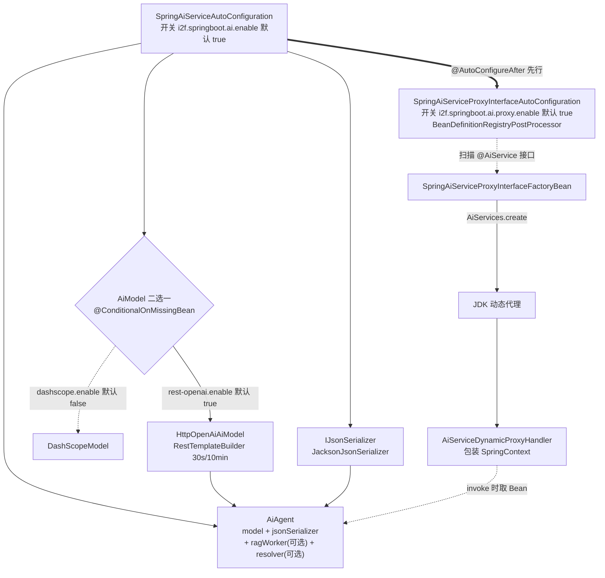
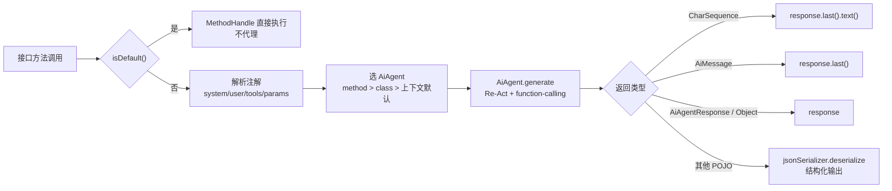

# i2f-springboot-ai-starter

> AI 能力 Starter —— 通过两级条件自动装配，将 `AiModel`（REST OpenAI / 通义千问 DashScope 二选一）、`IJsonSerializer`、`AiAgent` 智能体注册进 Spring 容器，并以 `BeanDefinitionRegistryPostProcessor` 扫描带 `@AiService` 注解的接口，用 `FactoryBean` + JDK 动态代理把它们实例化为「声明式 AI 服务」（方法即提示词、参数即上下文、返回值即结构化输出），对齐 LangChain4j 的 `@AiService` 编程范式。

## 模块路径

- `i2f-springboot/i2f-springboot-ai-starter`

## 模块依赖

| GroupId | ArtifactId | Scope | Optional | 说明 |
|---------|------------|-------|----------|------|
| org.projectlombok | lombok | compile | false | `@Data`/`@Slf4j`/`@NoArgsConstructor` 编译期代码生成 |
| org.springframework.boot | spring-boot-starter | provided | true | 自动装配与 `@ConditionalOn*`、`@ConfigurationProperties` 基础 |
| org.springframework.boot | spring-boot-configuration-processor | provided | true | 配置元数据生成 |
| org.springframework.boot | spring-boot-starter-web | provided | true | `RestTemplateBuilder`/`RestTemplate`（REST OpenAI 模型的 HTTP 客户端） |
| i2f.turbo | i2f-ai-std | compile | false | `AiModel`/`AiAgent`/`RagWorker`/`JsonSchemaAnnotationResolver`、`@AiService`、`AiServices`、`AiServiceDynamicProxyHandler` |
| i2f.turbo | i2f-ai-rest-openai | compile | false | `HttpOpenAiAiModel`：OpenAI 兼容 REST 模型实现 |
| i2f.turbo | i2f-spring-core | compile | false | `SpringContext`：将 `ApplicationContext` 适配为 `INamingContext`，供代理 handler 按名/按类型取 Bean |
| i2f.turbo | i2f-spring-web | compile | false | `SpringWebRestClient`：把 `RestTemplate` 适配为 `AiModel` 所需 REST 客户端 |
| i2f.turbo | i2f-extension-ai-dashscope | compile | false | `DashScopeModel`：阿里云通义千问模型实现 |
| i2f.turbo | i2f-extension-ai-openai | compile | false | POM 声明但本模块 7 个源文件未直接引用（见瑕疵） |
| i2f.turbo | i2f-extension-ai-langchain4j8 | compile | false | POM 声明但本模块 7 个源文件未直接引用（见瑕疵） |
| i2f.turbo | i2f-extension-jackson | compile | false | `JacksonJsonSerializer`：`IJsonSerializer` 的 Jackson 实现 |
| com.alibaba | dashscope-sdk-java | provided | true | 版本 `2.22.12`，`DashScopeModel` 运行时 SDK，排除 `slf4j-api`/`slf4j-simple` |

> 注意：
> - 全部 `i2f.turbo:*` 与 `lombok` 为默认 `compile`，会随本 Starter 传递给下游；Spring Boot 三件套与 `dashscope-sdk-java` 为 `provided + optional`，不污染宿主 classpath，符合 Starter 惯例。
> - `HttpOpenAiAiModel` 走 `i2f-ai-rest-openai`（compile），而 `spring-boot-starter-web` 为 `provided`——宿主若不使用 Web，REST OpenAI 模型运行期会缺 `RestTemplate`。

## 模块设计

### 架构分层

本模块由两个自动配置类组成，分别负责「运行时对象装配」与「声明式服务代理注册」，通过 `AutoConfiguration.imports` / `spring.factories` 双注册：

- **模型与智能体装配层**（`SpringAiServiceAutoConfiguration`）：`@ConditionalOnExpression("${i2f.springboot.ai.enable:true}")` 总开关下，按互斥条件装配 `AiModel`（REST OpenAI 默认开、DashScope 默认关）、`IJsonSerializer`（Jackson）、`AiAgent`；`@ConditionalOnMissingBean` 保证宿主自定义优先。
- **声明式服务代理层**（`SpringAiServiceProxyInterfaceAutoConfiguration`）：`@AutoConfigureAfter` 依赖上一层，实现 `BeanDefinitionRegistryPostProcessor`，扫描 `service-packages` 下带 `@AiService` 且 `enable=true` 的接口，为每个接口注册一枚 `SpringAiServiceProxyInterfaceFactoryBean`，产出的对象是由 `AiServiceDynamicProxyHandler` 支撑的 JDK 动态代理。

### 自动装配结构



### 声明式服务调用链

`@AiService` 接口方法被调用时，代理 handler 反射解析 `@AiSystem`/`@AiUser`/`@AiParam`/`@AiTools`/`@AiSkills` 注解，拼装 `AiRequest`（提示词、工具、变量插值 `${...}`），选定 `AiAgent` 后执行 Re-Act 生成，再按返回类型映射结果：



### 条件装配一览

| 类 / 方法 | 注解条件 | 默认 | 说明 |
|----|---------|------|------|
| `SpringAiServiceAutoConfiguration` | `@ConditionalOnExpression("${...ai.enable:true}")` | 开 | 模型/智能体装配总开关 |
| `#aiModel(RestOpenAiProperties)` | `${...model.rest-openai.enable:true}` + `@ConditionalOnMissingBean(AiModel)` | 开 | REST OpenAI 模型 |
| `#aiModel(DashScopeProperties)` | `${...model.dashscope.enable:false}` + `@ConditionalOnMissingBean(AiModel)` | **关** | DashScope 模型 |
| `#jsonSerializer()` | `${...json-serializer.enable:true}` + `@ConditionalOnMissingBean(IJsonSerializer)` | 开 | Jackson 序列化器 |
| `#jsonSchemaAnnotationResolver()` | `${...json-schema-annotation-resolver.enable:true}` | — | **缺 `@Bean`，不生效（见瑕疵）** |
| `#aiAgent()` | `${...agent.enable:true}` + `@ConditionalOnClass(AiAgent)` | 开 | 智能体 |
| `SpringAiServiceProxyInterfaceAutoConfiguration` | `@ConditionalOnExpression("${...proxy.enable:true}")` | 开 | 声明式服务代理总开关 |
| `#aiServiceDynamicProxyHandler()` | `${...proxy.handler.enable:true}` + `@ConditionalOnMissingBean` | 开 | 代理调用处理器 |

### 配置属性

前缀 `i2f.springboot.ai`，三类 `@ConfigurationProperties`：

- `SpringAiModelRestOpenAiProperties`（`model.rest-openai`）：`base-url` / `api-key` / `model`
- `SpringAiModelDashScopeProperties`（`model.dashscope`）：`api-key` / `model`
- `SpringAiProxyServiceProperties`（`proxy`）：`service-packages`（`List<String>`，待扫描的 `@AiService` 接口包）

### 包结构

```
i2f.springboot.ai
├── autoconfiguration
│   └── SpringAiServiceAutoConfiguration       # AiModel / IJsonSerializer / AiAgent 装配
├── properties
│   ├── SpringAiModelRestOpenAiProperties      # REST OpenAI 模型配置
│   ├── SpringAiModelDashScopeProperties       # DashScope 模型配置
│   └── SpringAiProxyServiceProperties         # 代理扫描包配置
└── proxy
    ├── SpringAiServiceProxyInterfaceAutoConfiguration  # 扫描 @AiService 并注册代理 Bean
    └── SpringAiServiceProxyInterfaceFactoryBean        # 产出 JDK 动态代理的 FactoryBean
```

资源：`META-INF/spring.factories` 与 `META-INF/spring/...AutoConfiguration.imports`（双注册两个配置类）、`META-INF/additional-spring-configuration-metadata.json`（IDE 提示）、`sample/application-ai.yml`（配置样例）。

## 模块目的

1. **AI 能力零配置接入**：引依赖即得 `AiModel`/`IJsonSerializer`/`AiAgent`，配 `base-url`/`api-key`/`model` 即可调用大模型。
2. **多模型可插拔**：REST OpenAI 与 DashScope 通过 `@ConditionalOnMissingBean` + 互斥开关二选一，宿主亦可自带 `AiModel` 让位。
3. **声明式 AI 编程**：`@AiService` 接口 + 方法级 `@AiSystem`/`@AiUser`/`@AiParam` 注解，把「调用大模型」降级为「调用一个 Java 接口方法」，屏蔽 prompt 拼装、function-calling、结果解析等细节。
4. **面向接口而非实现**：调用方只依赖自己定义的 `@AiService` 接口，代理在运行期从容器取 `AiAgent`/工具 Bean，实现提示词与业务代码解耦。

## 模块功能

| 功能组 | 入口 | 说明 |
|--------|------|------|
| 模型装配 | `SpringAiServiceAutoConfiguration#aiModel(...)` | 按开关产出 `HttpOpenAiAiModel` 或 `DashScopeModel` |
| 序列化 | `#jsonSerializer()` | 以容器 `ObjectMapper` 构造 `JacksonJsonSerializer` 并注册为 `IJsonSerializer` |
| 智能体 | `#aiAgent()` | 组装 `AiAgent`（model + jsonSerializer + 可选 ragWorker + 可选 resolver） |
| 服务代理注册 | `SpringAiServiceProxyInterfaceAutoConfiguration#postProcessBeanDefinitionRegistry()` | 扫描 `service-packages` 下 `@AiService` 接口，逐个注册 `FactoryBean` |
| 代理实例化 | `SpringAiServiceProxyInterfaceFactoryBean#getObject()` | `AiServices.create(serviceClass, handler)` 产出动态代理 |
| 声明式调用 | `AiServiceDynamicProxyHandler#invoke(...)`（上游 `i2f-ai-std`） | 解析注解拼 prompt、选 agent、执行生成、按返回类型映射 |

## 模块主要使用方法

### 1. 引入依赖

```xml
<dependency>
    <groupId>i2f.turbo</groupId>
    <artifactId>i2f-springboot-ai-starter</artifactId>
    <!-- 版本继承父 POM 统一管理（1.0-jdk8） -->
</dependency>
```

### 2. 配置

```yaml
i2f:
  springboot:
    ai:
      enable: true                     # 总开关
      model:
        rest-openai:
          enable: true                 # 启用 REST OpenAI 模型
          base-url: https://api.openai.com
          api-key: sk-xxxx
          model: gpt-4o-mini
        dashscope:
          enable: false                # 与 rest-openai 互斥；置 true 前需自备 dashscope-sdk-java
          api-key: sk-xxxx
          model: qwen-plus
      proxy:
        enable: true                   # 启用 @AiService 声明式代理
        service-packages:              # 待扫描的 @AiService 接口所在包
          - com.example.myapp.ai
```

### 3. 定义声明式 AI 服务接口

```java
@AiService
public interface Translator {
    @AiSystem("你是一名专业翻译，请把用户输入翻译成 {lang}。")
    String translate(@AiParam("lang") String lang, @AiUser String text);
}
```

### 4. 注入并调用

```java
@Autowired
private Translator translator;

String result = translator.translate("英文", "今天天气很好");
```

> 注入前请确保接口所在包已配入 `proxy.service-packages`（见瑕疵 2：留空时默认扫描因初始化非 null 而失效，必须显式配置）。

## 模块特性总结

1. **两级自动装配**：模型/智能体装配 + `@AiService` 接口代理注册，层次清晰、可分别用 `ai.enable` / `proxy.enable` 关闭。
2. **多模型互斥可选**：REST OpenAI（默认）与 DashScope 通过 `@ConditionalOnMissingBean(AiModel.class)` 保证唯一，宿主可自带 `AiModel` 完全接管。
3. **声明式 AI（LangChain4j 风格）**：接口方法即一次大模型调用，`@AiSystem`/`@AiUser` 支持 `${...}` 变量插值与模板化提示词。
4. **返回值自适应**：`CharSequence`/`AiMessage`/`AiAgentResponse`/POJO 四类返回分别映射，POJO 走结构化输出 + JSON 反序列化。
5. **default 方法直通**：接口默认方法不被代理拦截（经 `MethodHandle` 直接执行），可用于承载本地工具（function-calling）逻辑。
6. **上下文适配**：`SpringContext` 把 `ApplicationContext` 适配为 `INamingContext`，handler 按名/按类型解析 agent 与工具 Bean。
7. **双注册兼容**：同时提供 `spring.factories` 与 `AutoConfiguration.imports`，兼容 Spring Boot 2.6 前后自动配置发现机制。

## 模块瑕疵或错误

> 本模块已随整体工程编译通过，以下为静态识别的问题或潜在问题，未做运行实证。

1. **`jsonSchemaAnnotationResolver()` 缺少 `@Bean` 注解**：该方法带 `@ConditionalOnExpression`/`@ConditionalOnMissingBean` 却**无 `@Bean`**，Spring 不会将其注册为 Bean，方法体成死代码；`aiAgent(...)` 对该参数用 `@Autowired(required=false)`，故恒为 `null`。属性 `i2f.springboot.ai.json-schema-annotation-resolver.enable` 因此完全不起作用（好在 `AiAgent`/handler 内部有 `JsonSchemaAnnotationResolver.INSTANCE` 兜底，功能不至于报错，但配置项形同虚设）。
2. **`service-packages` 默认扫描为死代码**：`SpringAiProxyServiceProperties.servicePackages` 初始化为 `new ArrayList<>()`（非 null），而 `postProcessBeanDefinitionRegistry` 判空用 `if (mapperPackages != null)` —— 空列表仍进 `if` 分支且不加任何包，`else` 里的默认模式 `**.ai.**`/`**.service.**` 永不触发。**不显式配置 `service-packages` 时不会扫描到任何 `@AiService` 接口**。
3. **`dashscope.enable` 元数据默认值与代码相反**：代码 `@ConditionalOnExpression("${...model.dashscope.enable:false}")` 默认关闭，而 `additional-spring-configuration-metadata.json` 将其 `defaultValue` 标为 `true`，IDE 提示与实际默认相反。
4. **`rest-openai.enable` 未登记进元数据**：代码使用该属性作条件，但配置元数据 JSON 完全缺失该项，缺 IDE 补全与提示。
5. **两个 `@Bean` 方法重名 `aiModel`**：`aiModel(RestOpenAiProperties)` 与 `aiModel(DashScopeProperties)` 默认 bean 名同为 `aiModel`；默认因互斥只生效一个，但若同时把 `rest-openai.enable` 与 `dashscope.enable` 置 `true`，会因同名 Bean 定义冲突触发 `BeanDefinitionOverrideException`（且 `@ConditionalOnMissingBean` 无法区分）。
6. **模型属性未纳入元数据**：`model.rest-openai.{base-url,api-key,model}`、`model.dashscope.{api-key,model}`、`proxy.service-packages` 均无 `groups`/`properties` 登记，配 `@ConfigurationProperties` 处理器可生成部分，但附加元数据未补全描述。
7. **元数据 `hints` 与本模块无关**：`server.servlet.jsp.class-name`、`server.tomcat.accesslog.encoding` 系复制自 Spring Boot 官方元数据的噪声，与 AI 装配毫无关系。
8. **声明但未被源码引用的依赖**：`i2f-extension-ai-openai`、`i2f-extension-ai-langchain4j8` 以 `compile` 声明，但 7 个源文件均未 import/使用，属过宽依赖，随 Starter 传递给下游增加体积。
9. **`@ConditionalOnClass(AiAgent.class)` 恒真**：`AiAgent` 来自 `i2f-ai-std`（compile），本模块编译期即必然存在，该条件判断永不拦截，属无效防御。
10. **代理配置类过早依赖注入**：`SpringAiServiceProxyInterfaceAutoConfiguration` 同时是 `@Configuration` 与 `BeanDefinitionRegistryPostProcessor`，并以字段 `@Autowired` 注入 `SpringAiProxyServiceProperties`——BDRPP 生命周期极早，对配置类做属性/Bean 注入存在早期初始化（early bean instantiation、`@ConfigurationProperties` 尚未绑定）隐患。
11. **POM 无 `<description>`**：模块缺乏描述信息，与同组其它 Starter 一致的文档缺失。

## 生态位置

- **组归属**：`i2f-springboot` 组（Spring Boot 生态 Starter 集合）成员，在组 `pom.xml` 的 `<modules>` 登记于 `i2f-springboot/pom.xml:19`（`activity-starter`、`ai-mcp-client/server` 之后）。
- **版本管理**：根 `pom.xml` `dependencyManagement` 以 `${i2f.version}` 登记（`pom.xml:1357-1361`）。
- **构建产物**：`<build>` 声明 `maven-assembly-plugin` 并覆盖 `archive.addMavenDescriptor=true`，产 fat-jar；`bash/deploy-jdk17`、`deploy-jdk8`、`backup-jdk8` 三目录分发 `i2f-springboot-ai-starter-1.0-jdk*.jar`（`backup-jdk17` 未见该 jar）。
- **依赖上游**：内部聚合 `i2f-ai-std`（AI 标准层）、`i2f-ai-rest-openai`、`i2f-spring-core`、`i2f-spring-web`、`i2f-extension-ai-dashscope`、`i2f-extension-jackson` 等；`@AiService` 声明式代理与 `AiAgent` Re-Act 引擎的真正实现位于 `i2f-jdk/i2f-ai-std`，本 Starter 仅负责「Spring 化装配」。
- **下游消费**：仓库内**无 POM 级/源码级消费方**，面向外部应用独立发布；与 `i2f-springboot-ai-mcp-client/server` 共同构成 i2f 的 Spring Boot AI 工具链（模型/智能体 + MCP 工具桥接）。
- **同组对照**：与 `i2f-springboot-activity-starter` 同属「条件装配 + `@ConfigurationProperties` + 双注册文件 + 附加配置元数据」标准 Starter 范式；本模块额外引入 `BeanDefinitionRegistryPostProcessor` 做接口扫描代理，机制更接近 MyBatis `@MapperScan` / LangChain4j `@AiService`。
