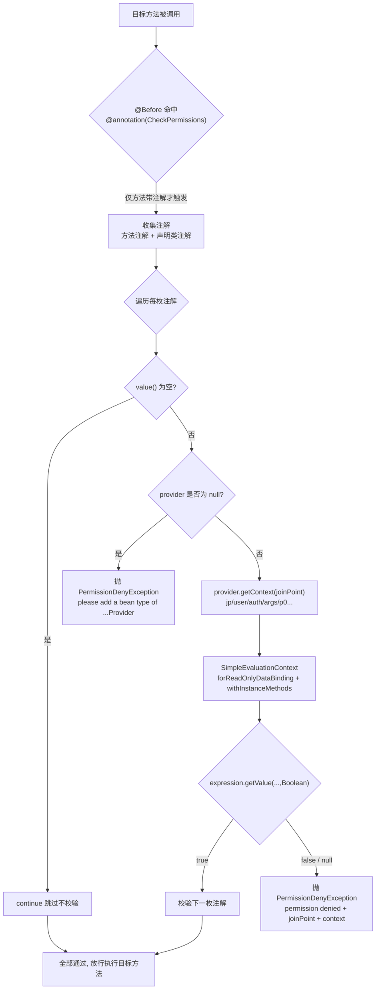
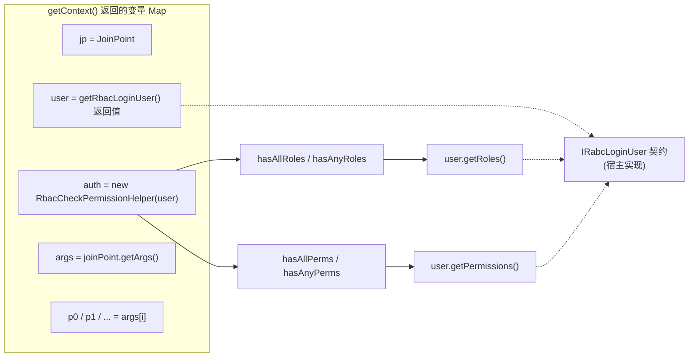

# i2f-springboot-auth-starter

> RBAC 声明式权限校验 Starter —— 以 `@CheckPermissions` 注解承载一段 SpEL 表达式，由 `CheckPermissionAspect` 的 `@Before` 切面在方法执行前拦截，配合 `CheckPermissionContextProvider` 注入的上下文变量（`user`/`auth`/`jp`/`args`/`p0…`），对「当前登录用户的角色与权限」做灵活判定；表达式返回非 `true` 即抛 `PermissionDenyException`。用户身份由 `IRabcLoginUser` 契约承载，`RbacCheckPermissionHelper` 提供 `hasAllRoles/hasAnyRoles/hasAllPerms/hasAnyPerms` 四类快捷判断。

## 模块路径

- `i2f-springboot/i2f-springboot-auth-starter`

## 模块依赖

| GroupId | ArtifactId | Scope | Optional | 说明 |
|---------|------------|-------|----------|------|
| org.projectlombok | lombok | compile | false | `@Data`/`@NoArgsConstructor` 编译期代码生成（Aspect/Properties/Helper/Exception） |
| org.springframework.boot | spring-boot-starter | provided | true | 自动装配、`@ConditionalOnExpression`、`@ConfigurationProperties`/`@EnableConfigurationProperties` 基础 |
| org.springframework.boot | spring-boot-configuration-processor | provided | true | `additional-spring-configuration-metadata.json` 的 IDE 提示生成 |
| org.springframework.boot | spring-boot-starter-aop | provided | true | `spring-boot-starter`(AspectJ + `@Aspect`) 与 SpEL(`spring-expression`) 运行期支撑 |

> 注意：
> - 本模块**不依赖任何 `i2f.turbo:*` 内部模块**，是 `i2f-springboot` 组中少数完全自足的通用 Starter。
> - Spring Boot 三件套与 AOP 全为 `provided + optional`，不污染宿主 classpath，符合 Starter 惯例；但 `spring-boot-starter-aop` 未随包传递，宿主工程须自备 AOP 运行环境（`@EnableAspectJAutoProxy`/AspectJ），否则 `@Aspect` 切面不会被代理织入，权限校验静默失效。

## 模块设计

### 架构分层

本模块只有一个被注册为自动配置的切面类，围绕「注解 → 上下文 → SpEL 判定」三段展开：

- **注解层**（`@CheckPermissions`）：`@Target({METHOD, TYPE})` + `@Retention(RUNTIME)`，唯一属性 `value()` 是一段 SpEL 表达式字符串，默认 `""`。
- **切面层**（`CheckPermissionAspect`）：`@Aspect @Component`，`@Before("@annotation(...CheckPermissions)")` 拦截带注解的方法，先收集「方法注解 + 声明类注解」两枚注解，逐一求值，全部为 `true` 才放行。
- **上下文层**（`CheckPermissionContextProvider` 契约 + `AbstractRbacCheckPermissionContextProvider` 抽象实现）：把当前登录用户、权限辅助工具、连接点、方法参数打包成 `Map<String,Object>` 供 SpEL 求值。
- **模型/工具层**（`IRabcLoginUser` 契约 + `RbacCheckPermissionHelper` 辅助类）：以角色集与权限集为核心，提供四类布尔判断供表达式调用。
- **异常/配置层**（`PermissionDenyException` + `CheckPermissionProperties`）：拒绝时携带 `joinPoint`/`context` 上下文抛出；`aspectOrder`（默认 `-999`）设定切面优先级。

### 权限校验流程



### 上下文与助手表

`AbstractRbacCheckPermissionContextProvider.getContext()` 产出的变量映射，是 SpEL 表达式可见的全部世界：



| 变量名 | 类型 | 说明 |
|--------|------|------|
| `jp` | `org.aspectj.lang.JoinPoint` | 连接点对象 |
| `user` | `IRabcLoginUser`（宿主具体类型） | 当前登录用户，由 `getRbacLoginUser()` 提供 |
| `auth` | `RbacCheckPermissionHelper` | 角色/权限快捷判断辅助工具 |
| `args` | `Object[]` | 方法参数数组 |
| `p0`,`p1`… | `Object` | 按位置展开的单个方法参数（前缀 `p`） |

### 条件装配与注册

| 项 | 值 | 说明 |
|----|----|------|
| 开关条件 | `@ConditionalOnExpression("${i2f.springboot.auth.permission.aspect.enable:true}")` | 默认开启，置 `false` 关闭整个切面 |
| 属性绑定 | `@EnableConfigurationProperties(CheckPermissionProperties.class)` | 绑定前缀 `i2f.springboot.auth.permission` |
| 注册入口 | `META-INF/spring.factories` + `META-INF/spring/...AutoConfiguration.imports` | 两处均指向 `CheckPermissionAspect` |
| 类身份 | `@Aspect @Component`（非 `@Configuration`/`@AutoConfiguration`） | 见瑕疵 3：三重注册路径 |
| 优先级 | `getOrder()` 返回 `properties.aspectOrder`（默认 `-999`） | 保证在事务等切面之前执行 |

### 包结构

```
i2f.springboot.auth.permission
├── IRabcLoginUser                       # 登录用户契约: getRoles() / getPermissions()
├── annotations
│   └── CheckPermissions                 # SpEL 权限表达式注解 (METHOD, TYPE)
├── aspect
│   └── CheckPermissionAspect            # @Before 切面: 收集注解 + 求值 SpEL
├── exception
│   └── PermissionDenyException          # 拒绝异常, 携带 joinPoint/context (fluent)
├── helper
│   └── RbacCheckPermissionHelper        # auth.* 角色/权限判断方法
├── properties
│   └── CheckPermissionProperties        # 前缀 i2f.springboot.auth.permission (aspectOrder)
└── provider
    ├── CheckPermissionContextProvider   # 上下文提供者契约 (@FunctionalInterface)
    └── impl
        └── AbstractRbacCheckPermissionContextProvider  # 组装 jp/user/auth/args/pN
```

资源：`spring.factories` 与 `AutoConfiguration.imports`（注册切面）、`additional-spring-configuration-metadata.json`（IDE 提示）、`sample/application-auth.yml`（配置样例）、包内 `readme.md`（使用指南，见瑕疵 1：与源码语义存在出入）。

## 模块目的

1. **声明式权限**：把「谁能调用这个方法」下放到注解里的一段 SpEL 表达式，业务代码零侵入，权限规则与业务逻辑解耦。
2. **身份来源可插拔**：`CheckPermissionContextProvider` / `IRabcLoginUser` 均为契约，宿主从 `SecurityContext`/`ThreadLocal`/JWT 等任意来源提供当前用户，Starter 不绑定任何具体认证框架。
3. **RBAC 双维度判定**：以角色（Role）与权限（Permission）两个集合为底座，`auth.has*` 方法覆盖 all/any 组合，复杂逻辑用 SpEL 的 `&&`/`||` 自由拼接。
4. **类 + 方法叠加约束**：方法注解与声明类注解同时求值（AND 语义），便于「整个 Controller 需模块权限 + 单个方法需细粒度权限」的分层授权。
5. **失败可审计**：`PermissionDenyException` 携带 `joinPoint` 与求值上下文 `context`，供全局异常处理器输出 403 及拒绝详情。

## 模块功能

| 功能组 | 入口 | 说明 |
|--------|------|------|
| 权限注解 | `@CheckPermissions("...spel...")` | 标于方法/类，承载权限判定表达式 |
| 拦截校验 | `CheckPermissionAspect#checkPermission(JoinPoint)` | `@Before` 收集方法+类注解，逐枚求值 SpEL |
| 上下文构建 | `AbstractRbacCheckPermissionContextProvider#getContext(JoinPoint)` | 组装 `jp/user/auth/args/pN` 变量 Map |
| 用户身份 | 宿主实现 `getRbacLoginUser(JoinPoint)` | 从任意来源返回 `IRabcLoginUser` |
| 角色判断 | `RbacCheckPermissionHelper#hasAllRoles/hasAnyRoles` | 基于 `user.getRoles()` |
| 权限判断 | `RbacCheckPermissionHelper#hasAllPerms/hasAnyPerms` | 基于 `user.getPermissions()` |
| 拒绝信号 | `PermissionDenyException` | 表达式非 `true` 或缺 provider 时抛出 |
| 开关/排序 | `aspect.enable` / `aspect-order` | 关闭切面、调整执行顺序 |

## 模块主要使用方法

### 1. 引入依赖

```xml
<dependency>
    <groupId>i2f.turbo</groupId>
    <artifactId>i2f-springboot-auth-starter</artifactId>
    <!-- 版本继承父 POM 统一管理（1.0-jdk8） -->
</dependency>
<!-- 宿主须自备 AOP（aspectj + spring-expression），本 Starter 不随包传递 -->
```

### 2. 配置

```yaml
i2f:
  springboot:
    auth:
      permission:
        aspect:
          enable: true           # 权限切面总开关（默认 true）
        aspect-order: -999       # 切面执行顺序，越小越先（默认 -999）
```

### 3. 实现登录用户契约

```java
public class LoginUser implements IRabcLoginUser {
    private Set<String> roles;
    private Set<String> permissions;

    @Override
    public Set<String> getRoles() { return roles; }

    @Override
    public Set<String> getPermissions() { return permissions; }
}
```

### 4. 提供上下文 Bean（必须，否则运行期抛异常）

```java
@Component
public class MyPermissionContextProvider extends AbstractRbacCheckPermissionContextProvider {
    @Override
    public Object getRbacLoginUser(JoinPoint joinPoint) {
        // 从 SecurityContextHolder / ThreadLocal / JWT 等获取当前用户
        return SecurityContextHolder.getContext().getAuthentication().getPrincipal();
    }
}
```

### 5. 在方法上标注 `@CheckPermissions`

```java
@RestController
@RequestMapping("/api/users")
@CheckPermissions("auth.hasAnyPerms('user:manage')")  // 类级：仍需下方方法各带注解才生效
public class UserController {

    @GetMapping("/{id}")
    @CheckPermissions("auth.hasAnyPerms('user:view')")
    public User getUser(@PathVariable Long id) { return userService.findById(id); }

    @DeleteMapping("/{id}")
    @CheckPermissions("auth.hasAnyPerms('user:delete') || auth.hasAnyRoles('admin')")
    public void deleteUser(@PathVariable Long id) { userService.delete(id); }
}
```

> 表达式求值非 `true` 抛 `PermissionDenyException`，建议配全局异常处理器转 403：`@ExceptionHandler(PermissionDenyException.class)`，可从 `e.getContext()` 取拒绝详情。

## 模块特性总结

1. **纯 SpEL 驱动**：权限规则完全交给 Spring 表达式语言，`&&`/`||`/方法调用/参数索引自由组合，无需为每种规则扩展注解属性。
2. **身份来源解耦**：`IRabcLoginUser` + `CheckPermissionContextProvider` 双契约，不与 Shiro/Spring Security 等任何认证框架耦合，可无缝嫁接既有登录体系。
3. **RBAC 便捷方法**：`auth.hasAllRoles/hasAnyRoles/hasAllPerms/hasAnyPerms` 覆盖常见判定，减少手写集合运算。
4. **类 + 方法 AND 叠加**：方法注解与类注解同时成立才放行，支持模块级 + 操作级分层授权。
5. **上下文丰富**：表达式内可访问连接点、用户对象、完整参数数组与按位参数（`p0`…），可做「资源属主 == 当前用户」这类数据级鉴权。
6. **只读安全上下文**：`SimpleEvaluationContext.forReadOnlyDataBinding()` 限制表达式仅做只读数据绑定与实例方法调用，规避任意类型引用/构造器等 SpEL 注入风险。
7. **零内部依赖**：不引任何 `i2f.turbo:*`，体积与耦合最小，可独立移植到任意 Spring Boot 工程。

## 模块瑕疵或错误

1. **资产 `readme.md`「类级别权限」描述与源码语义冲突（重要）**：包内 `readme.md`（L86–98）称类上 `@CheckPermissions` 会使「该类所有方法都需要此权限」，但切面切点是 `@Before("@annotation(...CheckPermissions)")`，**只有方法本身带注解才会触发拦截**；类注解仅在「方法已带注解」时作为叠加条件被读取。因此「仅类注解、方法无注解」的方法**完全不受校验**，与文档承诺相反（源码 Javadoc L33「类中所有带注解的方法」才是正确表述）。
2. **核心接口名拼写错误 `IRabcLoginUser`**：应为 `IRbacLoginUser`（Role-Based Access Control 的 `Rbac` 被写成 `Rabc`），且该拼写贯穿类名、`additional-spring-configuration-metadata.json` 中的 FQN 及资产文档，属对外暴露的契约级 typo，改名即破坏兼容。
3. **切面类的三重注册路径**：`CheckPermissionAspect` 同时被 `@Component` 注解、`spring.factories`、`AutoConfiguration.imports` 三处登记，却**不是** `@Configuration`/`@AutoConfiguration`。`@ConditionalOnExpression` 仅在「作为自动配置被解析」时生效；一旦被组件扫描按 `@Component` 拾取则条件被忽略，装配语义依赖注册路径、脆弱且易误解。
4. **`aspect.enable` 是「伪属性」**：`CheckPermissionProperties` 只有字段 `aspectOrder`，`aspect.enable` 既非其属性、也无对应 `aspect` 嵌套组，仅通过占位符 `${...aspect.enable:true}` 被读取；而元数据里它挂在 `sourceType: CheckPermissionAspect`。命名上 `aspect.enable`（带点分层）与 `aspect-order`（同级连字符）风格不一致，易误导使用者。
5. **`getRbacLoginUser` 返回 `Object`，类型安全缺失**：`AbstractRbacCheckPermissionContextProvider.getRbacAuthHelper` 内部 `(IRabcLoginUser) user` 强制转换，宿主若返回非 `IRabcLoginUser` 类型将抛 `ClassCastException`；而 `getRbacLoginUser` 返回 `null` 时，`auth.hasAnyPerms(...)` 会对 `null` 用户调 `getRoles()/getPermissions()` 触发 `NullPointerException`，而非语义清晰的 `PermissionDenyException`。
6. **`value()` 默认 `""` 导致「标注即放行」的隐患**：只写 `@CheckPermissions` 不填表达式时，切面对其 `continue` 跳过，等于该注解形同虚设却看似「已加权限控制」，缺乏告警。
7. **AOP 依赖 `provided + optional` 且不传递**：`spring-boot-starter-aop`（含 AspectJ 与 `spring-expression`）不随 Starter 打入，宿主忘记引入 AOP 时，切面根本不会被织入，权限校验「静默失效」而非启动报错，风险隐蔽。
8. **配置元数据 `hints` 为复制粘贴噪声**：`additional-spring-configuration-metadata.json` 的 `hints` 段含 `server.servlet.jsp.class-name`、`server.tomcat.accesslog.encoding` 两项与本模块毫无关系的条目，系模板残留。
9. **`@Data` 加在切面/异常等 Bean 上**：`CheckPermissionAspect` 标注 `@Data` 会为其 `parser`（final）等字段生成 getter 及 `equals/hashCode/toString`，对 Spring 单例切面无意义且增加噪声；属注解使用不精准。
10. **无单元测试、POM 无 `<description>`**：切面求值、类/方法叠加、空表达式等关键分支均无测试覆盖；`pom.xml` 缺 `<description>`，与组内多数 Starter 一致的项目级缺失。

## 生态位置

- **组内定位**：`i2f-springboot` 组第 34 个模块（组 `pom.xml` L48 登记，字母序上被追加在 `zookeeper` 之后、`xproc4j` 之前的非字母序位置）。是组内唯一「权限/授权」维度的 Starter，与 `security-starter`、`shiro-starter` 互补——后两者管认证框架接入，本件管方法级细粒度授权判定。
- **构建登记**：根 `pom.xml` 的 `dependencyManagement`（L1362–1366，`${i2f.version}`）已纳入统一版本管理。
- **分发情况**：fat-jar 已分发至 `bash/deploy-jdk17`、`bash/deploy-jdk8`、`bash/backup-jdk8` 三目录；`bash/backup-jdk17` **缺失**该 jar。因全依赖 `provided/optional`，产物实质仅含本模块自身类。
- **消费方**：仓库内除文档（`module-i2f-springboot.md`、`wiki.md`）外无 POM 级依赖方，也无 `test-springboot` 引用，属对外发布的独立通用组件。
