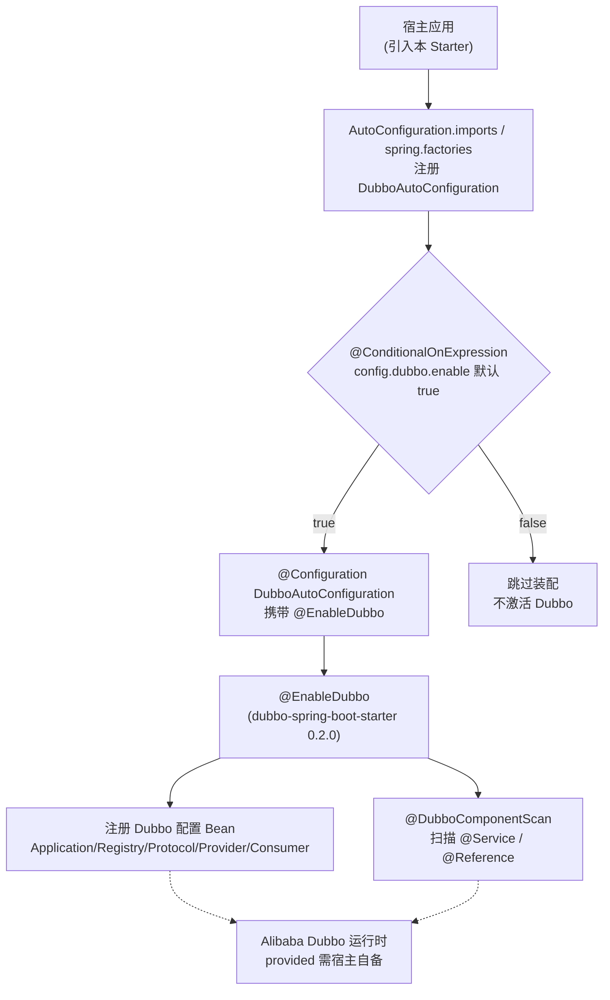

# i2f-springboot-dubbo-starter

> Dubbo 集成 Starter —— 以单个「空壳」`@Configuration` 类 `DubboAutoConfiguration` 承载 `@EnableDubbo` 注解，通过 `@ConditionalOnExpression("${i2f.springboot.config.dubbo.enable:true}")` 开关条件自动装配，把「启用 Alibaba Dubbo 注解驱动」这一动作收敛为一个可一键开关的 Starter。本身不含任何业务 Bean，真正的 Dubbo 配置类注册与注解扫描能力全部委托给 `dubbo-spring-boot-starter` 的 `@EnableDubbo`。

## 模块路径

- `i2f-springboot/i2f-springboot-dubbo-starter`

## 模块依赖

| GroupId | ArtifactId | Scope | Optional | 说明 |
|---------|------------|-------|----------|------|
| org.projectlombok | lombok | compile | false | `@Data`/`@Slf4j`/`@NoArgsConstructor` 编译期代码生成（本类无字段，实际几乎不产出） |
| org.springframework.boot | spring-boot-starter | provided | true | `@Configuration`、`@ConditionalOnExpression`、`@ConfigurationProperties` 基础 |
| org.springframework.boot | spring-boot-configuration-processor | provided | true | 编译期生成 `spring-configuration-metadata.json`（本类无字段，仅登记 `enable` 于 additional metadata） |
| com.alibaba.boot | dubbo-spring-boot-starter | provided | false | 提供 `@EnableDubbo` 及 `com.alibaba.dubbo` 注解驱动的 RPC 能力；`provided` 不随门面传递，宿主须自备 |

- 本模块**零 `i2f.turbo:*` 内部依赖**，是纯外部集成薄封装 Starter。
- 上游为 **Alibaba（incubating）Dubbo** `0.2.0`（`com.alibaba.dubbo.*` 命名空间），捐赠给 Apache 之前的旧版本线，非 `org.apache.dubbo`。版本内联硬编码于本 pom，未纳入根 `dependencyManagement`。

## 模块设计

本模块是「注解转发型」极简 Starter：唯一的自动配置类不含字段与方法，只作为承载 `@EnableDubbo` 的载体，靠 Spring Boot 的自动装配机制在被引入时激活 Dubbo 注解驱动。



自动装配注册采用「双份登记」：

- `META-INF/spring/org.springframework.boot.autoconfigure.AutoConfiguration.imports` → `i2f.springboot.dubbo.DubboAutoConfiguration`（Boot 2.7+/3.x 通道）
- `META-INF/spring.factories` → `EnableAutoConfiguration=i2f.springboot.dubbo.DubboAutoConfiguration`（Boot 2.x legacy 通道）

## 模块目的

- 把「在 Spring Boot 中启用 Alibaba Dubbo 注解驱动」标准化为一个带开关的 Starter，宿主只需引入依赖、配置 `dubbo.*` 属性即可，无需自行书写 `@EnableDubbo` 配置类。
- 提供统一开关键 `i2f.springboot.config.dubbo.enable`（默认 `true`），便于在不需要 RPC 的场景一键停用。
- 附带 `application-dubbo.properties` 样例，示范消费端与提供端的典型 `dubbo.*` 配置（ZooKeeper 注册中心、协议端口、超时/降级 check 等）。

## 模块功能

- `DubboAutoConfiguration`：唯一的自动配置类，被装配时通过类上 `@EnableDubbo` 激活 Alibaba Dubbo 的注解驱动装配。
- 开关能力：`@ConditionalOnExpression("${i2f.springboot.config.dubbo.enable:true}")` 依据属性决定是否装配。
- 配置元数据：`additional-spring-configuration-metadata.json` 登记 `i2f.springboot.config.dubbo.enable`（Boolean，默认 `true`），供 IDE 提示。
- 样例配置：`sample/application-dubbo.properties` 演示 consumer / provider 两套 `dubbo.*` 属性。

## 模块主要使用方法

1. 引入依赖（Dubbo 运行时需宿主自备，因本模块对 `dubbo-spring-boot-starter` 为 `provided`）：

```xml
<dependency>
    <groupId>i2f.turbo</groupId>
    <artifactId>i2f-springboot-dubbo-starter</artifactId>
    <version>1.0-jdk8</version>
</dependency>
```

2. 在 `application.properties` 配置 Dubbo 运行参数（样例节选）：

```properties
# 开关（默认 true，设为 false 则不装配 DubboAutoConfiguration）
i2f.springboot.config.dubbo.enable=true
# 消费端
dubbo.application.name=dubbo-consumer
dubbo.registry.address=127.0.0.1:2181
dubbo.registry.protocol=zookeeper
dubbo.consumer.check=false
# 提供端附加
dubbo.protocol.name=dubbo
dubbo.protocol.port=30003
```

3. 宿主用 `@Service`（`com.alibaba.dubbo.config.annotation.Service`）暴露服务、用 `@Reference` 注入远程代理即可。注意 `@EnableDubbo` 的组件扫描以本 Starter 的 `@Configuration` 类所在包为默认基准，宿主需确保服务/引用类处于可被扫描路径（详见瑕疵章节）。

## 模块特性总结

- 极简「薄封装 / 注解转发」型 Starter：核心只有一个空壳 `@Configuration` 承载 `@EnableDubbo`。
- 零 `i2f.turbo:*` 内部依赖，与 `i2f-springboot-auth-starter` 同属组内少数「无内部依赖」的通用集成件。
- 双通道自动装配登记（`imports` + `spring.factories`），兼顾 Boot 2.x 与 2.7+。
- fat-jar 分发：`<build>` 声明 `maven-assembly-plugin` 并覆盖 `addMavenDescriptor=true`，产物随 bash 四目录（deploy/backup × jdk8/jdk17）分发。
- 统一 `i2f.springboot.config.dubbo.*` 配置前缀与 `enable` 开关，风格与同组 Starter 对齐。

## 模块瑕疵或错误

1. **`@ConfigurationProperties` 是空绑定**：类上标 `@ConfigurationProperties(prefix = "i2f.springboot.config.dubbo")`，但类无任何字段，`@Data`/`@NoArgsConstructor` 亦不产出实质成员——没有任何属性可被绑定。真正的 `enable` 是通过 `@ConditionalOnExpression` 读取占位符 `${...:true}` 生效的，与该注解无关，注解纯属误导性存在。
2. **`@EnableDubbo` 组件扫描基准包错位**：`@EnableDubbo`（内含 `@DubboComponentScan`）未指定 `basePackages`，默认从被标注类所在包 `i2f.springboot.dubbo` 扫描——该包是 Starter 内部空包，宿主的 `@Service`/`@Reference` 通常不在此包下，故「靠本 Starter 自动扫描宿主 Dubbo 注解」的预期并不成立，宿主仍需自行 `@EnableDubbo` 或置于正确扫描路径。
3. **缺 `@ConditionalOnClass` 守卫**：默认 `enable=true` 且无类存在条件；由于 `dubbo-spring-boot-starter` 是 `provided` 不传递，若宿主未自备 Dubbo 依赖即引入本 Starter，装配时会触发 `@EnableDubbo` 相关 `NoClassDefFoundError` 而非静默跳过，鲁棒性欠佳。
4. **上游为 EOL 的 Alibaba Dubbo 旧线**：`com.alibaba.boot:dubbo-spring-boot-starter:0.2.0` 使用捐赠前的 `com.alibaba.dubbo.*` 命名空间，与 Apache Dubbo（`org.apache.dubbo`）不兼容；版本内联硬编码、未纳入根 DM，存在维护与安全滞后风险。
5. **文档口径失配**：仓库级 `.wiki/docs/module-i2f-springboot.md` 将本模块标注为「Apache Dubbo RPC 集成」，实际为 Alibaba（incubating）Dubbo 旧线，命名 namespace 与「Apache」不符。
6. **`provided` 但 `optional=false` 风格不一致**：同 pom 中两枚 spring-boot 依赖均 `provided + optional`，唯 Dubbo 依赖仅 `provided` 未加 `optional`（`provided` 本就不传递，`optional` 与否对消费无实质差异，但风格不统一）。
7. **`@Data`/`@Slf4j` 冗余噪声**：空配置类上 `@Slf4j`（无日志调用）、`@Data`（无字段）均无实际作用。
8. **样例 properties 注释乱码**：`application-dubbo.properties` 的中文注释为 GBK/UTF-8 混淆的 mojibake（如「æç®」），源码文件编码已损坏，影响可读性。
9. **`hints` 混入无关噪声**：metadata 的 `hints` 段带 `server.servlet.jsp.class-name`、`server.tomcat.accesslog.encoding` 等与本 Starter 完全无关的模板复制条目。
10. **无测试、无 `<description>`**：模块无 test 目录与用例，pom 亦缺 `<description>`；开关仅在自动装配通道生效，双份登记（`imports`+`factories`）在 Boot 2.7+ 下是否重复加载未做条件隔离。

## 生态位置

- **同组定位**：隶属 `i2f-springboot` 组，组 pom `<modules>` 第 20 行登记，字母序位于 `i2f-springboot-ai-starter` 之后、`i2f-springboot-dynamic-datasource-starter` 之前。
- **构建登记**：根 `pom.xml` `dependencyManagement` 第 1367–1371 行以 `${i2f.version}` 登记版本；`i2f-springboot/pom.xml` `<modules>` 声明。
- **分发产物**：fat-jar 已随 `bash/deploy-jdk17`、`bash/deploy-jdk8`、`bash/backup-jdk17`、`bash/backup-jdk8` 四目录分发齐全。
- **消费方**：全仓库 grep 仅命中 pom 登记、组 modules 声明与 wiki 文档引用，无源码级 / POM 级实际依赖方；属「对外发布供宿主引入」的门面型 Starter。
