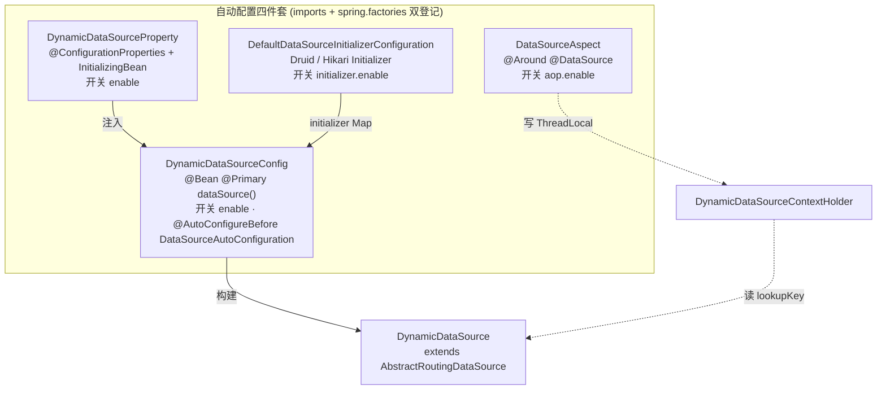
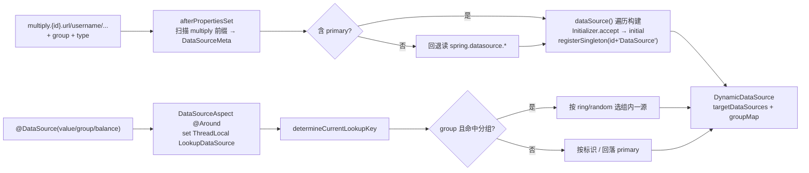

# i2f-springboot-dynamic-datasource-starter

> 多数据源动态路由 Starter —— 基于 Spring `AbstractRoutingDataSource`，用 `@DataSource` 注解 + AOP 环绕切面把「目标数据源标识」写入 `ThreadLocal`，运行时由 `DynamicDataSource.determineCurrentLookupKey()` 读取并路由；支持从 `i2f.springboot.dynamic.datasource.multiply.{id}.*` 批量声明数据源、按 `group` 分组并对组内多源施加 `ring`/`random` 负载均衡，缺失目标时按 `strict` 决定抛 `DataSourceNotFoundException` 或回落 `primary`；内置 Druid / Hikari 两类 `DataSourceInitializer` 生成连接池。

## 模块路径

- `i2f-springboot/i2f-springboot-dynamic-datasource-starter`

## 模块依赖

| GroupId | ArtifactId | Scope | Optional | 说明 |
|---------|------------|-------|----------|------|
| org.projectlombok | lombok | compile | false | `@Data`/`@Slf4j`/`@NoArgsConstructor` 编译期代码生成 |
| org.springframework.boot | spring-boot-starter | provided | true | 自动装配、`@ConditionalOnExpression`、`@ConfigurationProperties` 基础 |
| org.springframework.boot | spring-boot-configuration-processor | provided | true | 编译期生成配置元数据 |
| org.springframework.boot | spring-boot-starter-jdbc | provided | true | 提供 `AbstractRoutingDataSource`、`DataSourceBuilder`、`DataSourceAutoConfiguration` |
| org.springframework.boot | spring-boot-starter-aop | provided | true | 提供 AspectJ 支持，供 `DataSourceAspect` 织入 |
| com.alibaba | druid-spring-boot-starter | provided | true | 提供 `DruidDataSourceWrapper`，供 `DruidDataSourceInitializer`（版本内联 `1.2.16`，未纳入根 DM） |

- 本模块**零 `i2f.turbo:*` 内部依赖**，是纯外部集成型 Starter。
- HikariCP 由 `spring-boot-starter-jdbc` 传递引入（`HikariDataSourceInitializer` 引用 `com.zaxxer.hikari.HikariDataSource`）。
- 所有第三方均 `provided + optional`：不随门面传递，宿主须自备 JDBC/AOP/连接池运行时。

## 模块设计

自动装配由四件套构成，均在 `AutoConfiguration.imports` 与 `spring.factories` 双通道登记，各自带 `@ConditionalOnExpression` 开关：



数据源构建与运行时路由两条链路：



## 模块目的

- 让宿主在 Spring Boot 中以「一份配置 + 一个注解」实现读写分离 / 多库路由 / 同组负载均衡，无需自建 `AbstractRoutingDataSource`。
- 统一配置前缀 `i2f.springboot.dynamic.datasource.*`，用 `enable`/`aop.enable`/`initializer.enable` 三级开关分别控制总装配、切面、连接池初始化器。
- 屏蔽连接池差异：以 `DataSourceInitializer` SPI 化 Druid / Hikari 的创建，未命中时回退 `DataSourceBuilder` 通用构建。

## 模块功能

- `DynamicDataSourceProperty`：绑定 `primary`(默认 `master`)/`strict`(默认 `false`)/`balance`(默认 `ring`)，`afterPropertiesSet` 从环境扫描 `multiply.{id}.*` 归集为 `Map<String, DataSourceMeta>`，并在缺失 primary 时回退 `spring.datasource.*`，仍缺失则抛 `BeanInitializationException`。
- `DynamicDataSourceConfig`：`@Bean @Primary DataSource` 遍历所有 meta，选择匹配的 `DataSourceInitializer` 或回退 `DataSourceBuilder` 构建具体数据源，逐个 `registerSingleton(id+"DataSource")`，汇总 `targetDataSources` 与 `groupMap` 组装 `DynamicDataSource`。
- `DynamicDataSource`：覆写 `determineCurrentLookupKey()`，依据 `ThreadLocal` 中的 `LookupDataSource` 解析目标 key，分组时执行 `ring`/`random` 均衡。
- `DataSourceAspect`：`@Around` 拦截方法或类上的 `@DataSource`，写入/清理 `DynamicDataSourceContextHolder` 的 `ThreadLocal`。
- `DruidDataSourceInitializer` / `HikariDataSourceInitializer`：按 `type` 匹配并构建对应连接池，借 `ConfigurationPropertiesBindingPostProcessor` 绑定池参数。
- `DataSource` 注解、`LookupBalanceType` 枚举、`DataSourceNotFoundException` 异常、`LookupDataSource` 上下文载体共同构成对外契约。

## 模块主要使用方法

1. 引入 Starter 并自备运行时（JDBC/AOP/连接池）：

```xml
<dependency>
    <groupId>i2f.turbo</groupId>
    <artifactId>i2f-springboot-dynamic-datasource-starter</artifactId>
    <version>1.0-jdk8</version>
</dependency>
```

2. 声明多数据源（样例节选）：

```yaml
i2f:
  springboot:
    dynamic:
      datasource:
        enable: true
        primary: master
        strict: false
        balance: ring
        multiply:
          master:
            url: jdbc:oracle:thin:@localhost:1521:orcl
            username: scott
            password: 123456
            type: com.alibaba.druid.pool.DruidDataSource
            group: read,write
          slave:
            url: jdbc:mysql://localhost:3306/test_db
            username: root
            password: 123456
            type: com.zaxxer.hikari.HikariDataSource
            group: read
```

3. 在方法或类上用 `@DataSource` 切换：

```java
@DataSource(value = "slave")                 // 指定数据源标识
public List<Order> listFromSlave() { ... }

@DataSource(group = true, value = "read")    // 分组 + 负载均衡（组内 ring/random）
public Stat stat() { ... }
```

## 模块特性总结

- 成熟的 `AbstractRoutingDataSource` 路由范式 + `@DataSource` 声明式切换，方法级优先于类级。
- 分组负载均衡：`group` 属性把多个数据源归入逻辑组，`ring`/`random` 策略在组内分发，`balance` 可全局默认、注解可覆盖。
- 三级独立开关（总 `enable` / `aop.enable` / `initializer.enable`），装配顺序用 `@AutoConfigureBefore(DataSourceAutoConfiguration)` + `@AutoConfigureOrder(-1)` 保证抢在 Boot 默认数据源之前。
- 连接池可插拔（`DataSourceInitializer`），Druid/Hikari 双内置 + `DataSourceBuilder` 兜底。
- fat-jar 分发（`<build>` 覆盖 `addMavenDescriptor=true`），随 bash 四目录发布。

## 模块瑕疵或错误

1. **【功能级】非分组显式路由的 key 校验后缀不一致**：`lookupDataSourceKey()` 非 group 分支用裸标识 `key = lookup.getType()`（如 `"slave"`）去 `getResolvedDataSources().containsKey(key)` 判断存在性，而 `targetDataSources`/resolved 的 key 实为 `realDataSourceTypeName(id)` = `"slaveDataSource"`（带 `DataSource` 后缀）。故显式指定、且未落入任何 group 的数据源，其存在性检查几乎恒为 `false`，非 `strict` 下被静默回落 `primary`、`strict` 下抛 `DataSourceNotFoundException`——`@DataSource("slave")` 单源路由难以生效（仅 master/分组路径正常）。
2. **`@DataSource` 注解 Javadoc 前缀误导**：`DataSource#value()` 注释称数据源 ID 取自 `spring.datasource.multiply.{datasourceId}.url`，实际扫描前缀是 `i2f.springboot.dynamic.datasource.multiply.`（`MULTIPLY_DATASOURCE_PREFIX`），与注释不符。
3. **`ring` 轮询跳过组内首源**：`groupIndexMap` 初值为 `0`，`RING` 分支 `idx.updateAndGet(v -> (v + 1) % size)` 首个命中索引即 `1`，组内列表第 `0` 个数据源在首轮被跳过。
4. **`random` 误用 `AtomicInteger`**：`RANDOM` 分支 `idx.updateAndGet(v -> random.nextInt(size))` 的 lambda 忽略入参 `v`，把 `AtomicInteger` 当随机数暂存器，语义混乱且 CAS 重试下求值次数不定。
5. **连接池参数无法按数据源定制**：`HikariConfigWrapper` 固定绑定 `spring.datasource.hikari`，`DruidDataSourceWrapper` 固定绑定其自带前缀，`postProcessBeforeInitialization(wrapper, dataSourceId)` 的 `dataSourceId` 并不参与前缀解析，导致所有同类池共享同一份全局池配置，`multiply.{id}.*` 下无法为单个数据源设独立池参数。
6. **构建期冗余/吞异常**：`configDataSource` 中 `if (className.isEmpty()) { dataSourceMeta.setType(className); }` 把 type 再置为空串（无意义）；兜底分支 `catch (Exception e) {}` 静默吞掉 `Class.forName` 失败并做 unchecked 强转，池类型配错时无任何告警。
7. **Druid 主动 init、Hikari 不校验的不一致**：`DruidDataSourceInitializer` 调用 `wrapper.init()` 使启动期即暴露连接错误，而 `HikariDataSourceInitializer` 直接返回未验证的 `HikariDataSource`，错误延迟到首次取连接，二者健壮性不一致。
8. **`beanFactory` 强转与单例覆盖风险**：`DynamicDataSourceConfig` 将 `beanFactory` 强转 `DefaultListableBeanFactory`（非该实现则 CCE），并以 `id+"DataSource"` 名 `registerSingleton`，若宿主存在同名 bean 有覆盖/冲突隐患。
9. **切点表达式靠字符串拼接 FQN**：`DataSourceAspect` 的 `@Pointcut` 用 `PACKAGE_PREFIX + ".aop.DataSource"` 拼出注解全名，包重构时字符串不随之更新，易静默失效；且 AOP 为 `provided+optional` 不传递，宿主漏配 `starter-aop` 时切面不织入、全部回落 primary 而无提示。
10. **杂项**：`@Data` 用于含外部引用字段的切面/Initializer（生成不当 `equals/hashCode/toString`）、`HikariDataSourceInitializer` 同时用 `@Autowired` 字段与构造器注入（冗余）；metadata `hints` 混入 `server.servlet.jsp`/`server.tomcat` 无关噪声；druid 版本内联未纳根 DM；无 `<description>`、无单元测试。

## 生态位置

- **同组定位**：隶属 `i2f-springboot` 组，组 pom `<modules>` 第 21 行登记，字母序位于 `i2f-springboot-dubbo-starter` 之后、`i2f-springboot-encrypt-property-starter` 之前。
- **构建登记**：根 `pom.xml` `dependencyManagement` 第 1372–1376 行以 `${i2f.version}` 登记版本。
- **消费方**：`i2f-springboot/test-springboot/pom.xml` 第 75–78 行以 versionless 方式真实依赖本 Starter（并自备 druid、mybatis 等运行时），是 `i2f-springboot` 组内少数具有仓库内 POM 级消费方的模块（区别于 activity/ai/auth/dubbo 等无消费方的门面件）。
- **分发产物**：fat-jar 已随 `bash/deploy-jdk17`、`bash/deploy-jdk8`、`bash/backup-jdk17`、`bash/backup-jdk8` 四目录分发齐全。
