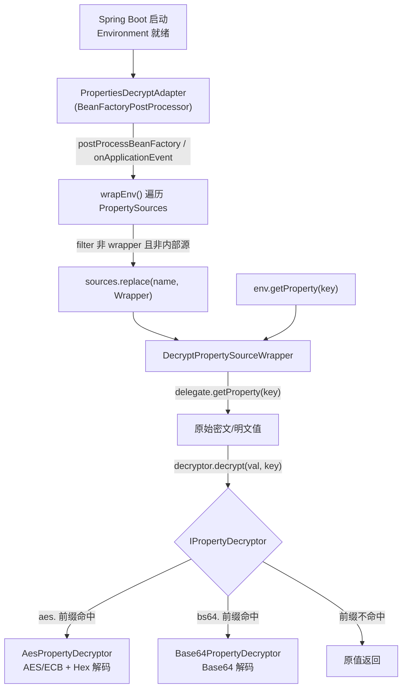
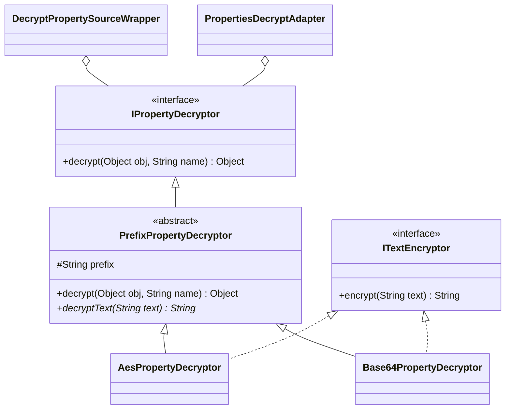

# i2f-springboot-encrypt-property-starter

> 配置属性透明解密 Starter —— 通过 `PropertiesDecryptAdapter`（一个 `BeanFactoryPostProcessor` + `EnvironmentAware` + `ApplicationListener`）在容器启动早期把 `ConfigurableEnvironment` 里的每个 `PropertySource` 逐个包装为 `DecryptPropertySourceWrapper`，使 `env.getProperty(...)` 在读值瞬间按前缀自动解密：`aes.` 前缀走 AES/ECB 解密、`bs64.` 前缀走 Base64 解码，无前缀原样返回。解密策略由 `IPropertyDecryptor` 契约承载，内置 AES（`i2f-crypto-impl`）与 Base64（`i2f-codec-impl`）两种默认实现，让数据库密码等敏感配置可以密文形式落盘、运行时透明还原。

## 模块路径

- `i2f-springboot/i2f-springboot-encrypt-property-starter`

## 模块依赖

| GroupId | ArtifactId | Scope | Optional | 说明 |
|---------|------------|-------|----------|------|
| org.projectlombok | lombok | compile | false | `@Data`/`@Slf4j` 编译期代码生成 |
| org.springframework.boot | spring-boot-starter | provided | true | `@ConditionalOnExpression`、`@ConfigurationProperties`、`Environment`/`PropertySource`、`BeanFactoryPostProcessor` 基础 |
| org.springframework.boot | spring-boot-configuration-processor | provided | true | 编译期生成 `additional-spring-configuration-metadata.json` 的注解处理器 |
| i2f.turbo | i2f-codec-impl | compile | false | `AesPropertyDecryptor`/`Base64PropertyDecryptor` 使用的 `HexStringByteCodec`、`Base64StringByteCodec`、`CharsetStringByteCodec` |
| i2f.turbo | i2f-crypto-impl | compile | false | `AesPropertyDecryptor` 使用的 `SymmetricEncryptor`、`AesType`、`SecureRandomAlgorithm` |

- 内部依赖 `i2f-codec-impl` + `i2f-crypto-impl` 两枚 `compile`（会随消费方传递）；Spring Boot 侧全 `provided + optional`，由宿主应用自备运行时。

## 模块设计

### 三层结构

1. **自动装配层**：三个配置类经 `spring.factories` 与 `AutoConfiguration.imports` 双通道登记，各由 `@ConditionalOnExpression` 独立开关。
   - `EncryptPropertyAutoConfiguration`（`...encrypt.property.enable:true`）→ 注册 `PropertiesDecryptAdapter`
   - `DefaultAesPropertyDecryptorConfiguration`（`...aes.enable:true`）→ 注册 `AesPropertyDecryptor`（带 `key` 属性）
   - `DefaultBase64PropertyDecryptorConfiguration`（`...base64.enable:true`）→ 注册 `Base64PropertyDecryptor`
2. **包装/路由层**：`PropertiesDecryptAdapter` 遍历 Environment 的 `MutablePropertySources`，把非 `DecryptPropertySourceWrapper`、且非 Spring 内部 `ConfigurationPropertySourcesPropertySource` 的源替换为 `DecryptPropertySourceWrapper`；后者在 `getProperty()` 中把取值委托给 `IPropertyDecryptor`。
3. **解密策略层**：`PrefixPropertyDecryptor`（抽象）按 `prefix` 判定是否命中，命中则剥离前缀调用 `decryptText()`；`AesPropertyDecryptor`（前缀 `aes.`）/`Base64PropertyDecryptor`（前缀 `bs64.`）各自实现解密，并同时实现 `ITextEncryptor` 提供反向加密能力。



### 类协作



- 设计取向：以「装饰器 + 前缀嗅探」实现透明解密，业务侧无需感知，直接 `@Value`/`env.getProperty` 即得明文；策略可插拔（自定义 `IPropertyDecryptor` Bean 即可替换）。

## 模块目的

- 让 `application.yml`/配置中心里的敏感值以 `aes.<hex>` 或 `bs64.<base64>` 密文形态存储，避免明文密码入库/入版本库。
- 把「解密」动作下沉到 Spring `Environment` 的属性读取路径，对 `@Value`、`@ConfigurationProperties`、`getProperty` 全透明，业务零改造。
- 提供开箱即用的两种强度分档：Base64（仅防肉眼，非加密）与 AES（真加密），并按需扩展。

## 模块功能

| 能力 | 载体 | 说明 |
|------|------|------|
| 属性源透明包装 | `PropertiesDecryptAdapter` + `DecryptPropertySourceWrapper` | 启动期替换 Environment 中所有可包装的 `PropertySource`，读值时解密 |
| AES 解密 | `AesPropertyDecryptor` | 前缀 `aes.`，`SymmetricEncryptor`（AES/ECB/PKCS5Padding）+ Hex 解码，密钥来自 `...aes.key` |
| Base64 解码 | `Base64PropertyDecryptor` | 前缀 `bs64.`，Base64 解码为 UTF-8 字符串 |
| 前缀命中判定 | `PrefixPropertyDecryptor` | 命中前缀才解密，否则原值返回；解密异常时兜底返回密文 |
| 反向加密 | `ITextEncryptor.encrypt` | 两个解密器均实现，用于生成待落盘的密文（需自取 Bean 调用） |
| 三档开关 | `@ConditionalOnExpression` | 总开关 + AES 开关 + Base64 开关，独立启停 |

## 模块主要使用方法

### 1. 引入依赖

```xml
<dependency>
    <groupId>i2f.turbo</groupId>
    <artifactId>i2f-springboot-encrypt-property-starter</artifactId>
</dependency>
```

### 2. 配置开关与密钥，并写入密文

```yaml
i2f:
  springboot:
    encrypt:
      property:
        enable: true
        aes:
          enable: true      # AES 策略（默认 true）
          key: "your-aes-key"
        base64:
          enable: false     # 建议显式关闭，避免与 AES 冲突
spring:
  datasource:
    password: "aes.9F2C1A..."   # 以 aes. 前缀存放密文
    username: "bs64.YWRtaW4="    # 以 bs64. 前缀存放 Base64 值
```

### 3. 业务侧透明读取

```java
@Value("${spring.datasource.password}")
private String dbPassword; // 注入的已是解密后的明文
```

> 生成密文：取容器中的 `AesPropertyDecryptor`/`Base64PropertyDecryptor`（其实现了 `ITextEncryptor`），调用 `encrypt(明文)` 得到带前缀的密文串，再粘回配置文件。

## 模块特性总结

- **全透明**：解密发生在 `Environment` 属性读取路径，`@Value`/`getProperty` 无感知，不依赖特定刷新时机。
- **可插拔策略**：`IPropertyDecryptor` 契约 + 前缀嗅探，替换/新增算法只需提供一个 `IPropertyDecryptor` Bean。
- **幂等包装**：`wrapEnv` 过滤已包装的 `DecryptPropertySourceWrapper`，`postProcessBeanFactory` 与每次 `ApplicationEvent` 重复调用不会二次包装。
- **双策略分档**：Base64（混淆）与 AES（加密）覆盖不同安全诉求。
- **开关齐全**：总开关 + 每策略独立开关，均可 `@ConditionalOnExpression` 关停。
- **极轻依赖**：仅 `i2f-codec-impl` + `i2f-crypto-impl` 两枚内部件，Spring 全 `provided`。

## 模块瑕疵或错误

> 以下均为静态阅读所得，未实际启动验证。

1. **【高危·默认即冲突】AES 与 Base64 两个 `@Bean` 方法同名 `propertyDecryptor` 且默认都启用**：`AesPropertyDecryptor` 由 `...aes.enable:true` 守卫、`Base64PropertyDecryptor` 由 `...base64.enable:${...:true}` 表达式默认 true 守卫。二者默认同时装配，产生**同名 Bean `propertyDecryptor` 定义冲突**——Spring Boot 2.1+ 默认 `allow-bean-definition-overriding=false` 会直接抛 `BeanDefinitionOverrideException`；即便允许覆盖也只剩其一，`propertiesDecryptAdapter(IPropertyDecryptor)` 单参数注入在两条并存路径下还可能触发 `NoUniqueBeanDefinitionException`。默认配置近乎无法启动，必须显式关掉一种。
2. **【高危·默认 NPE】AES 密钥无代码级默认值**：`DefaultAesPropertyDecryptorConfiguration.key` 字段默认 `null`（元数据里的 `defaultValue: 123456` 仅 IDE 提示、不注入运行时），一旦 AES 默认启用且用户未配 `...aes.key`，`AesPropertyDecryptor` 构造中 `key.getBytes()` 抛 NPE → 被 `catch` 包成 `IllegalStateException` → 上下文启动失败。
3. **【中危·绑定时序】`PropertiesDecryptAdapter` 是 `BeanFactoryPostProcessor`，其 `@Bean` 方法参数 `IPropertyDecryptor` 强制提前实例化解密器**：此时 `ConfigurationPropertiesBindingPostProcessor` 可能尚未介入，`...aes.key` 未必已完成绑定，易出现「配了 key 仍读到 null」。BFPP 依赖普通 Bean 是典型反模式。
4. **【中危·功能回归】包装后丢失可枚举性**：`DecryptPropertySourceWrapper` 直接继承 `PropertySource` 而非 `EnumerablePropertySource`，把 `OriginTrackedMapPropertySource`（`application.yml` 来源）、`systemProperties` 等可枚举源包装成**不可枚举**源，破坏按属性名枚举的能力（如 Actuator `/env`、`PropertySourcesPropertyResolver` 枚举、部分 `@ConfigurationProperties` 聚合绑定）；仅靠按 key 读取不受影响。
5. **【语义】`base64.enable` 代码默认与元数据相反**：`@ConditionalOnExpression("${...base64.enable:true}")` 默认 true，而元数据 `defaultValue` 写 `false`，文档与实现失配，也是瑕疵 1 冲突的直接来源。
6. **【安全】AES 采用 `ECB/PKCS5Padding`**：ECB 模式对相同明文块产生相同密文块，语义安全性弱，不适用于高敏感场景；`key.getBytes()` 使用平台默认字符集，跨环境可解密性不稳。
7. **【静默吞异常】解密失败原样返回密文**：`decryptText` 捕获异常后返回入参，配置写错前缀/密钥时不会报错，而是把密文当明文注入，故障被推迟到运行期且难以定位。
8. **【命名】Base64 前缀拼写 `bs64.`**： convention 应为 `b64.`/`base64.`，`bs64` 易误读；且前缀含 `.` 与属性名分隔符撞形，靠字符串 `startsWith` 判定，边界脆弱。
9. **【契约不对称】`ITextEncryptor` 只有 `encrypt` 无 `decrypt`**：解密语义散落在 `PrefixPropertyDecryptor.decryptText`，两接口职责割裂；`ITextEncryptor` 未对外暴露为独立 Bean，用户需强转解密器才能加密，缺 CLI/工具生成密文。
10. **【配置类缺 `@Configuration`】三个自动装配类均无 `@Configuration`/`@AutoConfiguration`**：以「精简模式」被解析，`@Data` 落在 `EncryptPropertyAutoConfiguration` 上无意义，且该类挂了 `@ConfigurationProperties("i2f.springboot.encrypt.property")` 却无任何字段——绑定空转；`enable` 实际只被 `@ConditionalOnExpression` 占位符读取，并非绑定字段。
11. **`spring.factories` 与 `AutoConfiguration.imports` 双通道重复登记同三类**：Boot 2.7+ 仅需 imports，双登记冗余且在升级中易产生「一处改一处漏」。
12. **元数据 `hints` 混入无关噪声**：`server.servlet.jsp.class-name`、`server.tomcat.accesslog.encoding` 与本模块毫无关系（复制模板残留）。
13. **无测试、无样例资源、POM 无 `<description>`**：与同组其它 Starter 一致的完整性缺口。

## 生态位置

- **所属组**：`i2f-springboot`（SpringBoot 开箱即用 Starter 集合）。
- **构建登记**：组 pom `<modules>` 第 22 行；根 pom `dependencyManagement` L1377–1381（`${i2f.version}` 锁版本）。
- **字母序定位**：位于 `i2f-springboot-dynamic-datasource-starter` 之后、`i2f-springboot-http-proxy-starter` 之前。
- **上游消费**：本模块 `compile` 依赖 `i2f-codec-impl`（编解码）与 `i2f-crypto-impl`（AES 对称加密），是二者在 Spring 生态的落地封装点之一。
- **下游消费方**：仓库内**无 POM 级消费方**，仅被文档（`module-i2f-springboot.md`、`wiki.md`、`i2f-crypto-impl` 文档）引用。
- **产物分发**：fat-jar 已随 `deploy-jdk17`/`deploy-jdk8`/`backup-jdk17`/`backup-jdk8` 四 bash 目录齐全分发；`<build>` 仅覆盖 `addMavenDescriptor=true`，其余继承根 pom 的 `maven-assembly-plugin`（`jar-with-dependencies`）。
- **可拓展方向**：引入 `List<IPropertyDecryptor>` + 责任链以支持多策略并存、提供 `CompositeEnumerablePropertySource` 保留可枚举性、增加生成密文的 CLI/单测、把 AES 升级为 `GCM` 并显式 IV、把 `key` 支持外部化/KMS。
