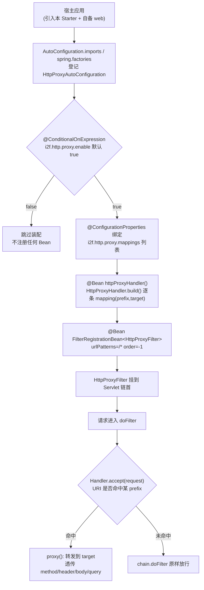
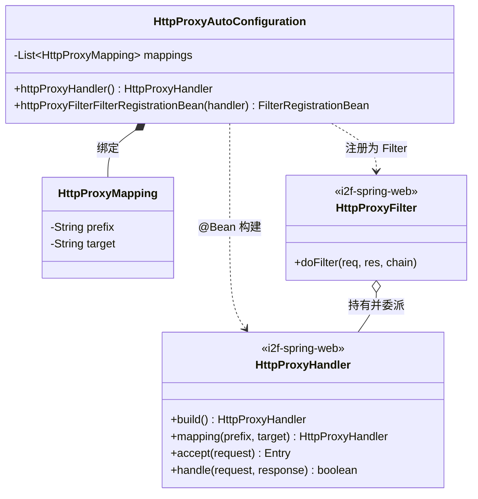

# i2f-springboot-http-proxy-starter

> HTTP 反向代理 Starter —— 以单个 `HttpProxyAutoConfiguration` 承载 `@ConfigurationProperties("i2f.http.proxy")` 声明的「前缀 → 目标地址」映射列表，`@ConditionalOnExpression` 一键开关；被装配时把 `i2f-spring-web` 的 `HttpProxyHandler`（持有 pathMapping）注册为 Bean，并用 `FilterRegistrationBean<HttpProxyFilter>` 把它挂成 `order=-1`、拦截 `/*` 的 Servlet 过滤器，使命中前缀的请求在容器早期即被透明转发到远端目标站点（透传 method/header/body/query），未命中则原样放行。

## 模块路径

- `i2f-springboot/i2f-springboot-http-proxy-starter`

## 模块依赖

| GroupId | ArtifactId | Scope | Optional | 说明 |
|---------|------------|-------|----------|------|
| org.projectlombok | lombok | compile | false | `@Data`/`@Slf4j`/`@NoArgsConstructor` 编译期代码生成（配置类 + 内部 `HttpProxyMapping`） |
| org.springframework.boot | spring-boot-starter | provided | true | `@ConditionalOnExpression`、`@ConfigurationProperties`、`@Bean` 基础 |
| org.springframework.boot | spring-boot-configuration-processor | provided | true | 编译期生成 `spring-configuration-metadata.json`（本模块另有 `additional-*-metadata.json` 手工登记 `enable`） |
| i2f.turbo | i2f-spring-web | compile | false | 提供 `HttpProxyHandler`（`build()`/`mapping()`/`accept()`/`proxy()`）与 `HttpProxyFilter`，代理核心逻辑全在此 |
| org.springframework.boot | spring-boot-starter-web | provided | false | 提供 `FilterRegistrationBean` 所在 Web 上下文与 `javax.servlet` API（`DispatcherType`）；`provided` 不传递，宿主须自备 |

- 本模块对 `i2f.turbo` 的**唯一内部依赖是 `i2f-spring-web`**（`compile`，会随门面传递），代理转发的实现完全委托上游，本 Starter 仅做「读配置 → 建 Handler → 注册 Filter」的装配。
- `spring-boot-starter-web` 为 `provided` 且**未叠加 `optional`**：编译期需要 `javax.servlet.DispatcherType` 与 `FilterRegistrationBean`，运行期由宿主的 Web Starter 提供；纯非 Web 应用引入无意义。

## 模块设计

核心是一个「配置持有 + Bean 工厂」二合一的自动配置类：类自身被 `@ConfigurationProperties` 绑定出 `mappings` 列表，`@Bean` 方法再读取自身字段构建 `HttpProxyHandler`，最后注册为前置 Servlet 过滤器。



自动装配注册采用「双份登记」：

- `META-INF/spring/org.springframework.boot.autoconfigure.AutoConfiguration.imports` → `i2f.springboot.http.proxy.HttpProxyAutoConfiguration`（Boot 2.7+/3.x 通道）
- `META-INF/spring.factories` → `EnableAutoConfiguration=i2f.springboot.http.proxy.HttpProxyAutoConfiguration`（Boot 2.x legacy 通道）

依赖分层（谁在运行期被真正调用）：



## 模块目的

- 把「在 Spring Boot 应用中按路径前缀做 HTTP 反向代理」收敛为一个零代码、配置即用的 Starter：无需手写 `Filter`，仅在 `application.yml` 列出 `mappings` 即可将本域某前缀透明转发到远端站点。
- 复用 `i2f-spring-web` 已实现的 `HttpProxyHandler`/`HttpProxyFilter` 代理内核，本模块只承担「属性绑定 + 自动装配」的胶水职责，体现 i2f「spring 层放能力、springboot 层放装配」的分层惯例。
- 提供统一开关 `i2f.http.proxy.enable`（默认 `true`）与样例 `application-http-proxy.yml`（示范 `/baidu → https://www.baidu.com`、`/github → https://www.github.com`）。

## 模块功能

- `HttpProxyAutoConfiguration`：唯一自动配置类，`@ConfigurationProperties("i2f.http.proxy")` 绑定 `List<HttpProxyMapping> mappings`；`@Bean httpProxyHandler()` 遍历 `mappings`（跳过 null 项、空 prefix、空 target）逐条 `ret.mapping(prefix, target)` 并计数打日志；`@Bean httpProxyFilterFilterRegistrationBean(handler)` 用返回的 Handler 构造 `HttpProxyFilter`，注册为 `urlPatterns=/*`、`order=-1`、`DispatcherType{REQUEST,FORWARD}`、`matchAfter=false` 的过滤器。
- `HttpProxyMapping`：`{prefix, target}` 静态内部绑定载体。
- 开关能力：`@ConditionalOnExpression("${i2f.http.proxy.enable:true}")` 决定是否装配。
- 配置元数据：`additional-spring-configuration-metadata.json` 仅登记 `i2f.http.proxy.enable`（Boolean，默认 `true`）。
- 样例配置：`sample/application-http-proxy.yml` 演示映射列表写法。

## 模块主要使用方法

1. 引入依赖（宿主须自备 Web/servlet，因 `spring-boot-starter-web` 为 `provided`）：

```xml
<dependency>
    <groupId>i2f.turbo</groupId>
    <artifactId>i2f-springboot-http-proxy-starter</artifactId>
    <version>1.0-jdk8</version>
</dependency>
```

2. 在 `application.yml` 配置代理映射（样例节选）：

```yaml
i2f:
  http:
    proxy:
      enable: true          # 默认即 true，可省略；设 false 则整体不装配
      mappings:             # 至少配一项；留空/不配在默认 enable 下会触发启动 NPE（见瑕疵 1）
        - prefix: /baidu
          target: https://www.baidu.com
        - prefix: /github
          target: https://www.github.com
```

3. 启动后，凡 URI（去 contextPath 后）以某 `prefix` 开头的请求都会被转发到对应 `target`（去掉前缀后的剩余 path + 原 query 拼接为目标路径），method/header/body 透传，响应状态、header、body 原样回写；未命中任何前缀的请求正常走后续过滤器链。

## 模块特性总结

- 「属性绑定 + 自动装配」二合一的薄封装 Starter：真正的代理内核全在 `i2f-spring-web`，本模块只做配置驱动的注册。
- 单一内部依赖 `i2f-spring-web`（`compile`），是典型的「spring 能力 → springboot 装配」下沉件。
- 声明式配置：映射关系完全由 `i2f.http.proxy.mappings` 列表驱动，逐条容错（null 项、空 prefix、空 target 均跳过并计数）。
- 高优先级前置过滤：`order=-1` + `/*`，保证代理判断早于业务过滤器/MVC 分发。
- 双通道自动装配登记（`imports` + `spring.factories`），兼顾 Boot 2.x 与 2.7+。
- fat-jar 分发：`<build>` 声明 `maven-assembly-plugin` 并覆盖 `addMavenDescriptor=true`，产物随 bash 四目录（deploy/backup × jdk8/jdk17）分发齐全。

## 模块瑕疵或错误

1. **【高危·默认即崩】`mappings` 无空值防护 + 默认 `enable:true`**：`httpProxyHandler()` 中 `for (HttpProxyMapping mapping : mappings)` 直接遍历，`mappings` 字段无默认值、无判空。当宿主引入本 Starter 却未配 `i2f.http.proxy.mappings`（且未显式关 `enable`）时，`mappings` 为 `null` → 创建 `httpProxyHandler` Bean 时抛 NPE，**应用启动即失败**。默认开启使「引依赖即需配映射」成为硬约束，与「可一键开关的薄封装」定位相悖（其余 springboot Starter 多以默认值兜底）。
2. **`mappings` 未登记进配置元数据**：`additional-spring-configuration-metadata.json` 只有 `enable`，缺 `i2f.http.proxy.mappings` 及其元素 `prefix`/`target` 描述——IDE 对最核心的映射列表无补全/提示，且元数据完整性与 `@ConfigurationProperties` 实际字段失配。
3. **自动配置类缺 `@Configuration`**：`HttpProxyAutoConfiguration` 仅有 `@ConfigurationProperties`/`@ConditionalOnExpression`/`@Slf4j`/`@Data`/`@NoArgsConstructor`，无 `@Configuration`。它依赖「被登记为自动配置类 → 以 lite 模式处理 `@Bean`」而生效，语义脆弱；同组其它 Starter 亦常见此写法，属组内一致性隐患。
4. **`@ConfigurationProperties` 持有者与 `@Bean` 工厂混于一类**：`httpProxyHandler()` 读取 `this.mappings` 构造 Handler，配置绑定与 Bean 生产耦合在同一实例，依赖「绑定后处理器早于 `@Bean` 调用」的隐式时序；拆成独立 `@Configuration` + 单独 `*Properties` 类更清晰（对照 `dynamic-datasource-starter` 的 `DynamicDataSourceProperty`/`Config` 分离）。
5. **`@Data` 用于自动配置类**：为持有 `mappings` 的 `@Configuration`-ish 类生成 `equals`/`hashCode`/`toString` 与 setter 属噪声，配置类不宜有值语义。
6. **无 `@ConditionalOnMissingBean`，不可覆盖**：`httpProxyHandler` / `FilterRegistrationBean` 均无条件注册，宿主若想自定义代理 Handler 或替换 Filter 会遇到同名 Bean 冲突或重复注册，扩展性欠佳。
7. **Filter 恒定 `order=-1` + `/*` 不可配**：优先级与拦截路径硬编码，无法按宿主既有过滤器链调整；`DispatcherType.FORWARD` 亦被纳入，转发（forward）请求会再次进入代理判断，存在意外二次代理风险。
8. **Bean 方法命名冗余**：`httpProxyFilterFilterRegistrationBean` 中「Filter」重复，冗长且不符合 Spring `xxxFilterRegistrationBean` 惯例。
9. **代理内核隐患（跨模块）**：上游 `HttpProxyHandler.accept()` 用裸 `startsWith` 匹配前缀，`/baidu` 会连带命中 `/baidupan`（无路径段边界）；`proxy()` 用 `SimpleClientHttpRequestFactory` 且未设连接/读取超时，慢目标会长时间占用 Servlet 线程；异常在 `HttpProxyFilter` 中被包成 `IOException` 抛出——这些虽在 `i2f-spring-web`，但经由本 Starter 直接暴露给使用者。
10. **`hints` 混入无关噪声 + 无测试/无 `<description>`**：metadata 的 `hints` 段带 `server.servlet.jsp.class-name`、`server.tomcat.accesslog.encoding` 等与本 Starter 无关的模板复制条目；模块无 test 目录，pom 亦缺 `<description>`。

## 生态位置

- **同组定位**：隶属 `i2f-springboot` 组，`i2f-springboot/pom.xml` `<modules>` 第 23 行登记，字母序位于 `i2f-springboot-encrypt-property-starter` 之后、`i2f-springboot-jackson-sensible-starter` 之前。
- **上游依赖**：代理能力来自 `i2f-spring` 组的 `i2f-spring-web`（`HttpProxyHandler`/`HttpProxyFilter`，见其文档「反向代理装配」节），本 Starter 是该能力在 Boot 侧的标准装配入口。
- **构建登记**：根 `pom.xml` `dependencyManagement` 第 1382–1386 行以 `${i2f.version}` 登记版本。
- **分发产物**：fat-jar 已随 `bash/deploy-jdk17`、`bash/deploy-jdk8`、`bash/backup-jdk17`、`bash/backup-jdk8` 四目录分发齐全。
- **消费方**：全仓库 grep 仅命中 pom 登记、组 modules 声明与 wiki 文档引用，无源码级 / POM 级实际依赖方；属「对外发布供宿主引入」的装配型 Starter。
