# i2f-springboot-jackson-sensible-starter

> Jackson 脱敏处理器桥接 Starter —— 以单个 `JacksonSensibleAutoConfiguration`（`ApplicationContextAware` + `ApplicationListener<ContextRefreshedEvent>`）在容器启动/刷新时，把 Spring 容器内所有 `ISensibleHandler` Bean 收集进上游 `i2f-extension-jackson` 的静态注册表 `SensibleHandlersHolder.GLOBAL_HANDLERS`，从而让「自定义脱敏处理器只需声明为 Spring Bean」即可被 Jackson 脱敏序列化全局感知；由 `@ConditionalOnExpression("${i2f.springboot.jackson.sensible.enable:true}")` 一键开关，本身不注册任何业务 Bean，是一枚「容器 → 静态持有器」的纯桥接件。

## 模块路径

- `i2f-springboot/i2f-springboot-jackson-sensible-starter`

## 模块依赖

| GroupId | ArtifactId | Scope | Optional | 说明 |
|---------|------------|-------|----------|------|
| org.projectlombok | lombok | compile | false | 编译期代码生成（本类实际未使用任何 lombok 注解，属冗余声明） |
| org.springframework.boot | spring-boot-starter | provided | true | `@ConditionalOnExpression`、`@ConfigurationProperties`、`ApplicationContextAware`、`ApplicationListener` 等自动装配与容器回调基础 |
| org.springframework.boot | spring-boot-configuration-processor | provided | true | 编译期生成配置元数据（本模块手写 metadata，处理器实际产出有限） |
| org.springframework.boot | spring-boot-starter-json | provided | false | 引入 Jackson `ObjectMapper` 相关运行期；脱敏序列化的真正落点在上游 `i2f-extension-jackson` |
| i2f.turbo | i2f-extension-jackson | compile | false | 提供 `ISensibleHandler` 契约与 `SensibleHandlersHolder.GLOBAL_HANDLERS` 静态注册表——**本模块唯一实质依赖** |

> 唯一内部依赖 `i2f-extension-jackson`（`compile`）；Spring Boot 侧三件套均 `provided`（`spring-boot-starter-json` 未叠加 `optional`）。运行期需宿主自带 Spring Boot 与 Jackson。

## 模块设计

单类、无 `@Bean` 方法，全靠「被登记为自动配置类 → 实例化为 Bean → 触发容器回调」这条隐式路径工作：

```mermaid
flowchart LR
    POM["pom.xml<br/>i2f-springboot-jackson-sensible-starter"] --> AC["JacksonSensibleAutoConfiguration<br/>@ConditionalOnExpression enable:true"]
    AC -.->|"实现 ApplicationContextAware"| CB["setApplicationContext()"]
    AC -.->|"实现 ApplicationListener&lt;ContextRefreshedEvent&gt;"| EV["onApplicationEvent()"]
    CB -->|"refresh()"| RF["refresh()"]
    EV -->|"refresh()"| RF
    RF -->|"getBeans(ISensibleHandler)"| SCAN["遍历容器按类型取 Bean"]
    SCAN -->|"clear() + addAll()"| HOLDER["SensibleHandlersHolder.GLOBAL_HANDLERS<br/>(上游 i2f-extension-jackson 静态注册表)"]
    HOLDER ==>|"getContextHandlers()"| USE["JacksonSensibleSerializer 脱敏落地"]
```



- **双重触发**：`setApplicationContext()`（容器回调，早期）与 `onApplicationEvent(ContextRefreshedEvent)`（刷新完成，晚期）都调用 `refresh()`；前者可能因 Bean 尚未全部就绪而收集不全，后者补全。
- **静态上下文持有**：`private static ApplicationContext context` 保存容器引用，`getBeans()` 以 `getBeanNamesForType()` + `getBean()` 按类型拉取全部 `ISensibleHandler`。
- **注册表落点**：写入上游 `SensibleHandlersHolder.GLOBAL_HANDLERS`（`CopyOnWriteArrayList`），脱敏序列化端经 `getContextHandlers()`（`THREAD_HANDLERS` 优先、否则 `GLOBAL_HANDLERS`）读取。
- **双通道登记**：`spring.factories`（旧 `EnableAutoConfiguration`）与 `AutoConfiguration.imports`（Boot 2.7+ 新通道）同时指向本类。

## 模块目的

`i2f-extension-jackson` 的 sensible 脱敏能力依赖一张「handler 注册表」，但纯 Java 环境下该注册表默认为空（全部回退 `TruncateSensibleHandler`），且模块本身不依赖 Spring、无法自行感知容器。本 Starter 的使命即补齐这段「Spring 容器 → 静态注册表」的接线：

- 让业务方**只需把自定义 `ISensibleHandler` 声明为 Spring Bean**，无需手动 `GLOBAL_HANDLERS.add(...)`，容器刷新时即被自动收录。
- 把「是否启用脱敏桥接」收敛为一个可开关的 Starter 约定（`i2f.springboot.jackson.sensible.enable`）。
- 作为 `i2f-extension-jackson` 的**专属配套 Starter**，与 `i2f-springboot-spring-starter`（负责 `ObjectMapper` 装配）分工互补。

## 模块功能

| 功能 | 承载 | 说明 |
|------|------|------|
| 开关装配 | `@ConditionalOnExpression("${...enable:true}")` | 默认开启；置 `false` 则本类不成为 Bean，桥接整体关闭 |
| 容器引用捕获 | `setApplicationContext()` | 记录 `static context` 并首次 `refresh()` |
| 刷新时机补全 | `onApplicationEvent(ContextRefreshedEvent)` | 容器刷新完成后再次 `refresh()`，收录全部 handler |
| handler 收集 | `refresh()` → `getBeans(ISensibleHandler.class)` | 按类型拉取容器内全部脱敏处理器 |
| 注册表写入 | `GLOBAL_HANDLERS.clear()` + `addAll()` | 全量覆盖式刷新上游静态注册表 |
| 安全兜底 | `getBeans()` 内 `context == null` 判空 | 上下文未就绪时返回空 Map，不抛 NPE |

## 模块主要使用方法

引入 Starter 后，容器刷新时自动收录所有 `ISensibleHandler` Bean；自定义脱敏只需实现契约并注册为 Bean：

```java
// 1) 定义自定义 handler 并交给 Spring 管理
@Component
public class DictSensibleHandler implements ISensibleHandler {
    @Override
    public Set<String> accept() { return Collections.singleton("dict"); }
    @Override
    public Set<Class<?>> type() { return Collections.singleton(String.class); }
    @Override
    public Object handle(Object obj, Sensible ann) { /* 按字典脱敏 */ return obj; }
}

// 2) 开关（可选，默认 true）
//    application.yml
//    i2f:
//      springboot:
//        jackson:
//          sensible:
//            enable: true
```

配置项清单：

| 配置项 | 类型 | 默认 | 作用 |
|--------|------|------|------|
| `i2f.springboot.jackson.sensible.enable` | Boolean | `true` | 是否启用本桥接 Starter（经 `@ConditionalOnExpression` 占位符读取） |

## 模块特性总结

- 极致轻量的「桥接型」Starter：单类、零 `@Bean`、零业务逻辑，只做一个方向的容器→静态注册表接线。
- 生命周期双保险：`ApplicationContextAware` + `ContextRefreshedEvent` 两个时机都刷新，兼顾早期可用与晚期补全。
- 契约驱动可插拔：只认 `ISensibleHandler` 类型，具体脱敏策略（trunc/dict/正则等）全部由上游与业务 Bean 决定。
- 全量覆盖式刷新：`clear()` + `addAll()` 保证注册表与容器 Bean 集合一致，避免历史残留。
- 唯一内部依赖、面广复用：仅耦合 `i2f-extension-jackson`，作为其官方配套 Starter 分发。

## 模块瑕疵或错误

> 以下为源码静态分析识别的问题或潜在问题（依项目规则不做运行时实证）：

1. **【并发·非原子刷新】** `refresh()` 用 `GLOBAL_HANDLERS.clear()` 后再 `addAll()`——两步非原子，并发序列化线程可能落入「已清空未填充」的空窗，此刻 `getContextHandlers()` 返回空注册表，**全部字段静默回退 `TruncateSensibleHandler` 语义**（与上游文档瑕疵 10 相互印证）。应以单次替换（如整体换引用或 `addAll` 后再删旧）替代 clear-then-addAll。
2. **【默认即空跑】** `enable` 默认 `true`，但收集动作只有在容器存在 `ISensibleHandler` Bean 时才有效果——纯引 Starter 而不声明任何 handler Bean 时，`refresh()` 把注册表 `clear()` 成空，若此前有手动注册的 handler 反而被抹除。
3. **【早期 refresh 时机偏早】** `setApplicationContext()` 阶段容器单例尚未全部创建，此处 `getBeans()` 可能拉不到后续定义的 handler（依赖 `ContextRefreshedEvent` 二次刷新兜底）；且 `getBean(name)` 会**强制提前实例化**匹配到的 Bean，存在与懒加载/初始化顺序冲突的隐患。
4. **【静态可变状态】** `private static ApplicationContext context` 为类级可变静态字段——多 Spring 上下文（如集成测试、父子容器）场景下后设置的覆盖前者，`refresh()` 操作的是全局单例注册表，缺乏隔离。
5. **【静默吞异常】** `refresh()` 的 `catch (Exception e) {}` 空实现——收集过程任何异常（Bean 创建失败、强转失败等）都被无声吞掉，注册表停留在旧值或空值且无任何日志，故障极难排查。
6. **【@ConfigurationProperties 名不副实】** 类标注 `@ConfigurationProperties(prefix = "i2f.springboot.jackson.sensible")`，但类中**无 `enable` 字段/无 setter**，`enable` 实际仅被 `@ConditionalOnExpression` 以占位符读取；绑定过程对该属性无任何落点，注解近乎装饰（与 auth-starter 的 `aspect.enable` 同类「伪属性」模式）。
7. **【缺 @Configuration】** 类无 `@Configuration`，作为自动配置类被实例化依赖 lite 模式与自动配置处理流程，语义脆弱；`(T) bean` 亦为未检查强转。
8. **【元数据噪声】** `additional-spring-configuration-metadata.json` 的 `hints` 混入 `server.servlet.jsp.class-name`、`server.tomcat.accesslog.encoding` 等与本模块毫不相关的复制残留；`groups`/`properties` 把 `sourceType` 指向本类但本类并非真正的绑定目标（见瑕疵 6）。
9. **【无测试、无说明】** 无 `src/test`，无任何自动化验证；POM 无 `<description>`；`spring-boot-starter-json` 声明为 `provided` 非 `optional`，与本模块「不直接触碰 ObjectMapper」的实际用法关联松散。

## 生态位置

- **同组定位**：隶属 `i2f-springboot` 组，`i2f-springboot/pom.xml` `<modules>` 第 24 行登记，字母序位于 `i2f-springboot-http-proxy-starter` 之后、`i2f-springboot-jdbc-bql-starter` 之前。
- **配套关系**：是 `i2f-extension-jackson`（sensible 脱敏内核）的**专属配套 Starter**，把「容器 Bean → `SensibleHandlersHolder.GLOBAL_HANDLERS`」的接线从纯手工 `add()` 下沉为自动装配；与 `i2f-springboot-spring-starter`（`ObjectMapper` datetime/Long2String 装配）分工互补。
- **构建登记**：根 `pom.xml` `dependencyManagement` L1387–1391 以 `${i2f.version}` 统一版本；`<build>` 仅覆盖 `addMavenDescriptor=true`，其余全继承根 pom 的 `maven-assembly-plugin`（`jar-with-dependencies`）产 fat-jar。
- **分发情况**：fat-jar 已随 `bash/deploy-jdk17`、`deploy-jdk8`、`backup-jdk17`、`backup-jdk8` 四目录齐全分发。
- **消费方**：仓库内**无 POM 级消费方**（仅被 `i2f-extension-jackson` 文档与本 wiki 引用），定位为可被外部应用按需引入的独立桥接件；因上游 Jackson/handler 全 `provided`/`compile` 传递，fat-jar 非自足可运行，运行期需宿主自备 Spring Boot 与 Jackson。
