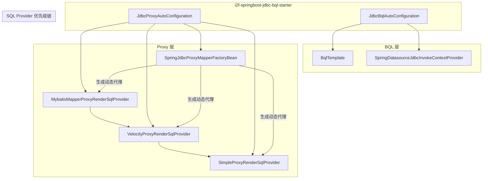

# i2f-springboot-jdbc-bql-starter

> BQL（绑定查询语言）与 JdbcProxy（XML 映射代理）的 Spring Boot 自动装配 Starter，提供 `BqlTemplate` 程序化查询和 MyBatis 风格的 Mapper 接口扫描 + 动态代理生成能力，支持 XML 映射文件与 Velocity 模板两种 SQL 脚本来源。

## 模块路径

- `i2f-springboot/i2f-springboot-jdbc-bql-starter`

## 模块依赖

| groupId | artifactId | scope | optional | 说明 |
|---------|-----------|-------|----------|------|
| i2f.turbo | i2f-jdbc-bql | compile | 否 | BQL 模板引擎核心 |
| i2f.turbo | i2f-jdbc-proxy | compile | 否 | JDBC 动态代理执行层 |
| i2f.turbo | i2f-jdbc-proxy-xml | compile | 否 | MyBatis 风格 XML Mapper 解析 |
| i2f.turbo | i2f-extension-velocity-bindsql | compile | 否 | Velocity 模板 SQL 渲染适配 |
| i2f.turbo | i2f-extension-ognl | compile | 否 | OGNL 表达式引擎适配 |
| org.projectlombok | lombok | compile | 否 | POJO 代码生成 |
| org.springframework.boot | spring-boot-starter | provided | 是 | Boot 基础自动装配 |
| org.springframework.boot | spring-boot-configuration-processor | provided | 是 | 配置元数据处理器 |
| org.springframework.boot | spring-boot-starter-jdbc | provided | 是 | DataSource/JDBC 支持 |
| org.apache.velocity | velocity-engine-core (2.3) | provided | 是 | Velocity 模板引擎 |
| ognl | ognl (3.4.11) | provided | 是 | OGNL 表达式解析 |

## 模块设计

### 架构设计

模块由两套独立的自动配置组成，各自由专属开关控制：



### 设计模式

1. **条件装配 + 优先级降级**：`ProxyRenderSqlProvider` 有三个实现按 `@ConditionalOnMissingBean` 逐级降级——MyBatis XML 映射优先 → Velocity 模板次之 → Simple 注解兜底。
2. **BeanDefinitionRegistryPostProcessor 扫描注册**：`JdbcProxyAutoConfiguration` 实现 `BeanDefinitionRegistryPostProcessor`，在容器早期扫描指定包路径下的接口，为每个 Mapper 接口注册 `SpringJdbcProxyMapperFactoryBean` 定义（类似 MyBatis 的 `MapperScannerConfigurer`）。
3. **FactoryBean 代理产出**：`SpringJdbcProxyMapperFactoryBean` 通过 `ProxySqlExecuteGenerator.proxy()` 为 Mapper 接口生成 JDK 动态代理，延迟到 `getObject()` 调用时装配。
4. **ContextProvider 桥接**：`SpringDatasourceJdbcInvokeContextProvider` 将 Spring 的 `DataSourceUtils` 连接管理（事务感知）适配到 `JdbcInvokeContextProvider` 接口。

### 包结构

```
i2f.springboot.jdbc.bql
├── autoconfiguration/
│   ├── JdbcBqlAutoConfiguration.java      # BQL 自动配置
│   └── JdbcProxyAutoConfiguration.java    # Mapper 代理扫描与 SQL 渲染配置
├── components/
│   ├── SpringDatasourceJdbcInvokeContextProvider.java  # DataSource 上下文适配
│   ├── SpringJdbcProxyMapperFactoryBean.java           # Mapper 代理工厂
│   └── VelocityProxyRenderSqlProvider.java             # Velocity SQL 渲染提供者
└── properties/
    ├── JdbcBqlProperties.java             # i2f.jdbc.bql.* 配置绑定
    └── JdbcProxyProperties.java           # i2f.jdbc.proxy.* 配置绑定
```

### 自动配置注册

同时支持 Spring Boot 2.x（`spring.factories`）和 3.x（`AutoConfiguration.imports`）两套注册方式。

## 模块目的

1. 让使用 i2f BQL 能力的项目无需手动配置 `BqlTemplate`、数据源上下文等，引入即开箱可用。
2. 提供类似 MyBatis 的 Mapper 接口扫描 + XML/Velocity SQL 脚本解析 + 动态代理生成一站式方案，摆脱对 MyBatis 框架本身的依赖。
3. 通过 `@ConditionalOnClass` 条件装配让 Velocity、OGNL 等三方能力可选引入，未引入时自动降级到简单模式。

## 模块功能

| 功能 | 触发条件 | 说明 |
|------|---------|------|
| `BqlTemplate` 自动装配 | `i2f.jdbc.bql.enable=true`（默认） | 注册 `BqlTemplate` Bean，注入全局 `DataSource` |
| Mapper 接口扫描 | `i2f.jdbc.proxy.enable=true`（默认） | 按 `i2f.jdbc.proxy.mapper-packages` 扫描接口并注册代理 Bean |
| MyBatis XML 解析 | classpath 含 `MybatisMapperContext` | 解析 `i2f.jdbc.proxy.script-locations` 指定的 `**/mapper/**/*.xml` |
| Velocity 模板 SQL | classpath 含 `VelocityEngine` | 解析 `**/mapper/**/*.xml.vm` 模板文件，渲染为 `BindSql` |
| OGNL 表达式 | classpath 含 `Ognl` | XML 映射中的 `<if test="...">` 等动态条件使用 OGNL 求值 |
| 简单注解模式 | 无 MyBatis/Velocity 依赖时兜底 | 通过 `@SqlScript` 注解直接提供 SQL |

## 模块主要使用方法

### 1. BqlTemplate 程序化查询

```yaml
# application.yml（默认开启，可显式关闭）
i2f:
  jdbc:
    bql:
      enable: true
```

注入 `BqlTemplate` 即可使用 BQL DSL 构建查询：

```java
@Autowired
private BqlTemplate bqlTemplate;

public List<Map<String, Object>> queryUsers() {
    return bqlTemplate.select("*").from("user").where("age > ?", 18).execute();
}
```

### 2. Mapper 接口 + XML 脚本

```yaml
i2f:
  jdbc:
    proxy:
      enable: true
      mapper-packages:
        - com.example.**.mapper
      script-locations:
        - "classpath*:/**/mapper/**/*.xml"
```

定义 Mapper 接口并编写对应 XML，启动后自动注册为代理 Bean：

```java
public interface UserMapper {
    List<User> selectAll();
}
```

### 3. Mapper 接口 + Velocity 模板

将 XML 文件后缀改为 `.xml.vm`，配置 `script-locations` 包含对应路径，SQL 脚本使用 Velocity 语法渲染。

### 4. 注解模式（@SqlScript）

未引入 Velocity/MyBatis XML 依赖时，直接在接口方法上使用 `@SqlScript` 注解声明 SQL。

### 注意事项

- `DataSource` 必须为容器中的唯一 Bean 或通过 `@Primary` 标记，否则 `SpringDatasourceJdbcInvokeContextProvider` 注入会失败。
- `mapper-packages` 未配置时默认为 `**.mapper.**` 和 `**.dao.**` 两种 Ant 模式。
- `script-locations` 未配置时默认扫描 `classpath*:/**/mapper/**/*.xml`（XML）和 `classpath*:/**/mapper/**/*.xml.vm`（Velocity）。

## 配置项参考

| 配置键 | 类型 | 默认值 | 说明 |
|--------|------|--------|------|
| `i2f.jdbc.bql.enable` | Boolean | `true` | 是否启用 BqlTemplate 自动装配 |
| `i2f.jdbc.proxy.enable` | Boolean | `true` | 是否启用 JdbcProxy 自动装配 |
| `i2f.jdbc.proxy.mapper-packages` | List | `null`（使用内置默认） | Mapper 接口扫描包路径 |
| `i2f.jdbc.proxy.script-locations` | List | `null`（使用内置默认） | SQL 脚本资源位置 |

## 模块特性总结

- 双引擎独立开关：BQL 和 JdbcProxy 各自可独立启停，互不影响
- 三级 SQL 渲染降级链：MyBatis XML → Velocity 模板 → 简单注解，按需自动选择
- 可选依赖友好：Velocity、OGNL 为 `provided+optional`，不引入则对应功能不激活
- 兼容 Boot 2/3 注册方式：同时提供 `spring.factories` 和 `AutoConfiguration.imports`
- 扫描注册机制类 MyBatis：支持 Ant 风格包路径、接口过滤、FactoryBean 延迟代理

## 模块瑕疵或错误

- `JdbcProxyAutoConfiguration.postProcessBeanDefinitionRegistry()` 中资源加载异常仅 `log.error` 后继续，部分 Mapper 可能静默缺失注册
- `mybatisMapperContext()` 和 `velocityResourceSqlTemplateResolver()` 方法中 `catch (Exception e) {}` 完全吞掉异常，无日志输出，资源加载失败无从排查
- `additional-spring-configuration-metadata.json` 中 `hints` 节点包含 `server.servlet.jsp.class-name`、`server.tomcat.accesslog.encoding` 等无关条目，疑为模板残留
- 同一 `ProxyRenderSqlProvider` 存在三个 `@Bean` 方法且均标注 `@ConditionalOnMissingBean(ProxyRenderSqlProvider.class)`，依赖方法声明顺序决定优先级；若用户自定义 `ProxyRenderSqlProvider` Bean，则三者均不装配（符合预期），但缺少显式 `@Order` 或 `@AutoConfigureBefore/After` 语义保护
- `SpringJdbcProxyMapperFactoryBean` 的 `mapperClass` 和 `context` 字段通过 `GenericBeanDefinition` 的 propertyValues 注入，依赖 `@Data` setter 存在；若 Lombok 处理异常可能导致注入失败
