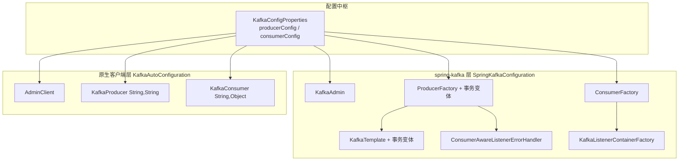

# i2f-springboot-kafka-starter

> Kafka 消息队列的 Spring Boot 自动装配 Starter，分两层提供能力：`KafkaAutoConfiguration` 产出原生 `AdminClient`/`KafkaProducer`/`KafkaConsumer` 客户端 Bean，`SpringKafkaConfiguration` 产出 `KafkaTemplate`/`KafkaListenerContainerFactory` 等 spring-kafka 抽象 Bean（含事务变体），全部配置由 `KafkaConfigProperties` 统一绑定并构建生产者/消费者参数。

## 模块路径

- `i2f-springboot/i2f-springboot-kafka-starter`

## 模块依赖

| groupId | artifactId | scope | optional | 说明 |
|---------|-----------|-------|----------|------|
| org.projectlombok | lombok | compile | 否 | POJO 与日志代码生成 |
| org.springframework.boot | spring-boot-starter | provided | 是 | Boot 基础自动装配 |
| org.springframework.boot | spring-boot-configuration-processor | provided | 是 | 配置元数据处理器 |
| org.apache.kafka | kafka-clients (2.4.0) | provided | 否（未标 optional） | Kafka 原生客户端 |
| org.springframework.kafka | spring-kafka (2.4.0.RELEASE) | provided | 否（未标 optional） | Spring 对 Kafka 的封装 |

> 本模块无 i2f 内部依赖，纯第三方 Kafka/spring-kafka 自动装配封装；`kafka-clients`、`spring-kafka` 为 `provided`，运行时需宿主应用自备。

## 模块设计

### 架构设计

模块以 `KafkaConfigProperties` 为配置中枢，向上分别驱动原生客户端层与 spring-kafka 抽象层两套自动配置：



### 设计模式

1. **配置绑定 + 参数构建**：`KafkaConfigProperties` 以 `@ConfigurationProperties("i2f.springboot.config.kafka")` 集中绑定，暴露 `producerConfig()` / `consumerConfig()` 两个方法把字段转换为 Kafka `Map<String, Object>` 参数（含 `BOOTSTRAP_SERVERS`、`ACKS`、`BATCH_SIZE`、`GROUP_ID` 等）。
2. **双层切换开关**：原生层由 `i2f.springboot.config.kafka.enable` 控制，spring-kafka 层由 `i2f.springboot.config.spring-kafka.enable` 控制，两者独立；生产者/消费者/错误日志监听各有更细粒度的 `*.enable` 开关。
3. **默认值回退 Environment**：`clientId`/`groupId` 未显式配置时，回退读取 `spring.application.name`（`KafkaConfigProperties` 实现 `EnvironmentAware` 获取 `Environment`）。
4. **条件装配**：`AdminClient`、`KafkaAdmin` 标注 `@ConditionalOnMissingBean`，允许宿主覆盖；`ProducerFactory`/`KafkaTemplate` 用 `@Primary` 标记非事务版本。

### 包结构

```
i2f.springboot.mq.kafka
├── KafkaAutoConfiguration.java     # 原生 Kafka 客户端 Bean（Admin/Producer/Consumer）
├── KafkaConfigProperties.java      # 配置绑定与 producer/consumer 参数构建
└── SpringKafkaConfiguration.java   # spring-kafka 抽象 Bean（Template/ContainerFactory/ErrorHandler）
```

### 自动配置注册

同时登记 `spring.factories`（Boot 2.x）与 `AutoConfiguration.imports`（Boot 3.x），两个文件均把 3 个类（含 `KafkaConfigProperties`）一并注册为自动配置。

## 模块目的

1. 让引入 Kafka 的 Spring Boot 项目无需手写 `Producer`/`Consumer`/`KafkaTemplate` 的繁琐参数装配，一处 yml 配置即得客户端 Bean。
2. 同时兼容「直接用原生 Kafka 客户端」与「用 spring-kafka 注解式监听」两种使用习惯，各由独立开关按需启用。
3. 提供开箱可用的事务生产模板与消费失败错误日志处理器，降低 Kafka 事务与消费可观测性的接入门槛。

## 模块功能

| 功能 | 所属类 | 触发条件 | 说明 |
|------|--------|---------|------|
| `AdminClient` 管理客户端 | KafkaAutoConfiguration | `...kafka.enable` 且无同类型 Bean | 按 `server-address` 创建集群管理客户端 |
| 原生 `KafkaProducer` | KafkaAutoConfiguration | `...kafka.producer.enable`（默认 true） | 泛型 `<String,String>` 生产者单例 |
| 原生 `KafkaConsumer` | KafkaAutoConfiguration | `...kafka.consumer.enable`（默认 true） | 泛型 `<String,Object>` 消费者单例 |
| `KafkaAdmin` | SpringKafkaConfiguration | `...spring-kafka.enable` 且无同类型 Bean | spring-kafka 集群管理 |
| `ProducerFactory` / 事务版 | SpringKafkaConfiguration | `...spring-kafka.enable` | 事务版设置 `tx-prefix` |
| `KafkaTemplate` / 事务版 | SpringKafkaConfiguration | `...spring-kafka.enable` | 非事务版 `@Primary` |
| `ConsumerFactory` | SpringKafkaConfiguration | `...spring-kafka.enable` | 由 `consumerConfig()` 构建 |
| `KafkaListenerContainerFactory` | SpringKafkaConfiguration | `...spring-kafka.enable` | `batch-listener`/`concurrency` 可调 |
| 消费错误日志处理器 | SpringKafkaConfiguration | `...spring-kafka.consumer-error-log-listener.enable` | 打印消费失败消息与异常 |

## 模块主要使用方法

### 1. 基础配置

```yaml
i2f:
  springboot:
    config:
      kafka:
        enable: true            # 原生客户端层开关
        server-address: 127.0.0.1:9092
        group-id: my-group      # 缺省回退 spring.application.name
        client-id: my-client    # 缺省回退 spring.application.name
      spring-kafka:
        enable: true            # spring-kafka 层开关
        concurrency: 3
        batch-listener: false
```

### 2. 使用 KafkaTemplate 发送

```java
@Autowired
private KafkaTemplate<String, String> kafkaTemplate;

public void send(String topic, String payload) {
    kafkaTemplate.send(topic, payload);
}
```

### 3. 注解式消费

```java
@KafkaListener(topics = "demo", errorHandler = "consumerAwareListenerErrorHandler")
public void onMessage(String msg) {
    // 处理消息；消费失败时由 consumerAwareListenerErrorHandler 打印日志
}
```

### 4. 事务发送

注入事务模板 `kafkaTemplateWithTransaction`（`tx-prefix` 默认 `tx`）配合 `@Transactional` 使用。

### 注意事项

- `server-address` 未配置会导致各客户端连接失败，为唯一必填项。
- 原生层与 spring-kafka 层默认同时开启；若只用 spring-kafka，可关闭原生层避免多余连接。
- `KafkaProducer`/`KafkaConsumer`/`AdminClient` 均实现 `Closeable`，容器关闭时由 Spring 自动调用 `close()`。

## 配置项参考

| 配置键（`i2f.springboot.config.` 前缀略） | 类型 | 默认值 | 说明 |
|------|------|--------|------|
| `kafka.enable` | Boolean | `true` | 原生客户端层自动装配开关 |
| `kafka.server-address` | String | `null` | Kafka 集群地址（必填） |
| `kafka.retries` / `acks` / `max-block-ms` / `batch-size` / `linger-ms` / `buffer-memory-size` / `max-request-size` | 数值 | 3 / all / 6000 / 4096 / 1000 / 33554432 / 1048576 | 生产者参数 |
| `kafka.client-id` / `group-id` | String | 回退 `spring.application.name` | 客户端/消费者组标识 |
| `kafka.compression-type` | String | `gzip` | 生产者压缩算法 |
| `kafka.enable-auto-commit` / `auto-commit-interval-ms` / `max-poll-records` / `session-timeout-ms` / `request-timeout-ms` / `auto-offset-reset` | — | false / 1000 / 100 / 120000 / 120000 / latest | 消费者参数 |
| `kafka.producer.enable` / `kafka.consumer.enable` | Boolean | `true` | 原生生产者/消费者 Bean 开关 |
| `spring-kafka.enable` | Boolean | `true` | spring-kafka 层自动装配开关 |
| `spring-kafka.tx-prefix` | String | `tx` | 事务 ID 前缀 |
| `spring-kafka.batch-listener` | Boolean | `false` | 是否批量监听 |
| `spring-kafka.concurrency` | Integer | `1` | 监听容器并发线程数 |
| `spring-kafka.consumer-error-log-listener.enable` | Boolean | `true` | 消费错误日志处理器开关 |

## 模块特性总结

- 双层设计：原生 Kafka 客户端与 spring-kafka 抽象各自独立开关，按需启用
- 集中配置：`KafkaConfigProperties` 统一绑定并构建生产者/消费者参数映射
- 事务开箱即用：提供带 `tx-prefix` 的 `ProducerFactory`/`KafkaTemplate` 事务变体
- 默认值智能化：`client-id`/`group-id` 缺省回退 `spring.application.name`
- 消费可观测：内置 `ConsumerAwareListenerErrorHandler` 打印消费失败详情
- 兼容 Boot 2/3 注册：同时提供 `spring.factories` 与 `AutoConfiguration.imports`

## 模块瑕疵或错误

- **事务工厂污染非事务工厂（重点）**：`producerFactoryWithTransaction()` 直接强转 `producerFactory()` 返回的 `@Primary` 单例并调用 `setTransactionIdPrefix(txPrefix)`，因 `@Configuration`（CGLib 代理）下 `producerFactory()` 返回同一单例，导致默认无事务的 `producerFactory()`/`kafkaTemplate()` 也被加上事务前缀，事务与非事务行为无法真正隔离。
- **原生 `KafkaConsumer` 作为单例 Bean 的线程安全隐患**：`KafkaConsumer` 非线程安全，注册为容器单例供多处注入共享时存在并发访问风险，spring-kafka 场景下应优先使用 `ConsumerFactory` 而非共享消费者实例。
- **`KafkaConfigProperties` 被登记为自动配置类**：`spring.factories`/`imports` 将其与两个 `@Configuration` 并列注册，且自身又标注 `@Configuration`+`@ConfigurationProperties`，属非常规用法（通常应经 `@EnableConfigurationProperties` 引入）。
- **`producerConfig()`/`consumerConfig()` 存在字段副作用**：无 `client-id`/`group-id` 时把解析结果回写实例字段（`clientId=`/`groupId=`），多次调用非幂等，且当 `spring.application.name` 亦缺失时仍写入 null。
- **泛型不一致**：原生 `KafkaProducer<String,String>` 与 `KafkaConsumer<String,Object>` 序列化类型不对齐；`kafkaListenerContainerFactory` 声明 `<String,String>` 却注入 `ConsumerFactory<String,Object>`，依赖隐式协变。
- **元数据 `hints` 模板残留**：`additional-spring-configuration-metadata.json` 含与本模块无关的 `server.servlet.jsp.class-name`、`server.tomcat.accesslog.encoding` 提示条目。
- **配置元数据不完整**：`additional-spring-configuration-metadata.json` 仅登记 `kafka.enable`/`spring-kafka.enable` 两属性，`producer.enable`、`consumer.enable`、`consumer-error-log-listener.enable` 及大量 Kafka 参数未在 IDE 提示中暴露。
