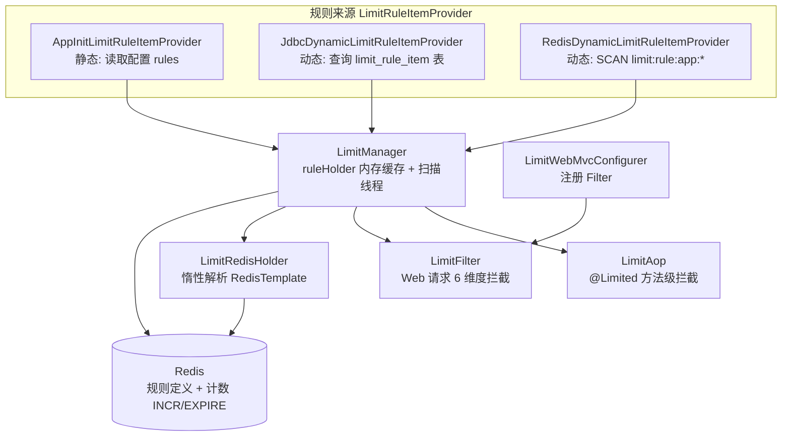

# i2f-springboot-limit-starter

> 请求限流的 Spring Boot 自动装配 Starter，基于 Redis 计数器提供全局/路径/IP/接口/Ant 路径/用户六个维度的限流能力；规则来源可插拔（配置、JDBC、Redis 动态），由后台守护线程周期扫描刷新，通过 Servlet 过滤器与 `@Limited` 注解切面两条入口实施拦截并抛出 `LimitException`。

## 模块路径

- `i2f-springboot/i2f-springboot-limit-starter`

## 模块依赖

| groupId | artifactId | scope | optional | 说明 |
|---------|-----------|-------|----------|------|
| i2f.turbo | i2f-spring-web | compile | 否 | 内部依赖，提供 `MappingUtil` 做请求到 HandlerMethod 的映射解析 |
| org.projectlombok | lombok | compile | 否 | POJO 与日志代码生成 |
| org.springframework.boot | spring-boot-starter | provided | 是 | Boot 基础自动装配 |
| org.springframework.boot | spring-boot-configuration-processor | provided | 是 | 配置元数据处理器 |
| org.springframework.boot | spring-boot-starter-web | provided | 否 | Web/MVC 容器，过滤器与 `RequestMappingHandlerMapping` |
| org.springframework.boot | spring-boot-starter-aop | provided | 否 | AspectJ 切面支持，驱动 `@Limited` 注解限流 |
| org.springframework.boot | spring-boot-starter-jdbc | provided | 否 | `JdbcTemplate`，驱动 JDBC 动态规则来源 |
| org.springframework.boot | spring-boot-starter-data-redis | provided | 否 | `RedisTemplate`，作为计数器与规则存储后端 |

## 模块设计

### 架构设计

模块以 `LimitManager` 为核心枢纽，向上承接规则来源（Provider），向下输出限流判定给两个执行入口（Filter / AOP），Redis 作为分布式计数器与规则持久化存储。



- **核心枢纽 `LimitManager`**：实现 `ApplicationRunner`，启动时开启名为 `limit-rule-scanner` 的守护线程，每 5 秒遍历容器内所有 `LimitRuleItemProvider` Bean 拉取规则并写入内存 `ruleHolder`（`ConcurrentHashMap<limitType, ConcurrentHashMap<typeKey, LimitRule>>`）。
- **规则来源分层**：`LimitRuleItemProvider` 接口以 `isDynamic()` 区分动态/静态：动态来源每次刷新调用 `saveRule` 持久化到 Redis，静态来源调用 `registryIfAbsentRule` 仅在缺失时注册。
- **计数存储**：`isLimited` 通过对 Redis 目标键 `limit:target:{app}:{type}:{key}` 执行 `INCR`，首次递增时按规则 `ttl` 设置 `EXPIRE`，当前值超过 `count` 即判定为限流。`count < 0` 表示不限流。
- **两个执行入口**：
  - `LimitFilter`（`OncePerRequestFilter`）按 global → path → ip → api → ant-path → user 顺序逐维判定；
  - `LimitAop`（`@Around`）拦截标注 `@Limited` 的方法，以 `API` 维度、方法签名为 key 注册并判定。

### 设计模式

- **策略模式**：`LimitRuleItemProvider` 三种实现（配置 / JDBC / Redis）作为可替换的规则来源策略，运行时通过 `getBeanNamesForType` 全量收集。
- **模板/注册表**：`LimitManager.ruleHolder` 作为规则注册表，集中持有各维度内存规则。
- **惰性代理 Holder**：`LimitRedisHolder` 以 `AtomicReference` 缓存首个可用 `RedisTemplate`，避免启动期强依赖。
- **责任链式检查**：`LimitFilter` 内多维 `assertLimitXxx` 顺序短路执行。

### 包结构

```
i2f.springboot.limit
├── aop          // LimitAop 切面 + @Limited 注解
├── core         // LimitManager 枢纽 / LimitType 枚举 / LimitConsts 键常量 / LimitRedisHolder
├── data         // LimitRule(计数/窗口/顺序) 与 LimitRuleItem(维度+key+rule)
├── exception    // LimitException 限流异常
├── filter       // LimitFilter 请求过滤器 + LimitWebMvcConfigurer 注册器
├── properties   // LimitRuleProperties 配置绑定
├── provider     // LimitRuleItemProvider 接口 + impl 三种规则来源
└── util         // LimitUtil 方法签名生成
```

## 模块目的

- 以 Redis 为分布式后端，提供开箱即用、多维度的接口/请求限流能力，防止单个维度（IP、用户、接口等）被高频访问。
- 规则来源可插拔且支持运行期动态刷新，允许通过配置、数据库表或 Redis 键灵活维护限流策略，无需重启应用。
- 通过注解与过滤器两种低侵入方式接入，业务侧只需引入 Starter 与少量配置即可获得防护。

## 模块功能

| 功能 | 触发条件 / 开关 | 说明 |
|------|----------------|------|
| 全局维度限流 | `LimitFilter`（`i2f.springboot.limit.filter.enable:true`） | 对 `GLOBAL/default` 单一键限流 |
| 请求路径限流 | 同上 | 以精确请求路径为 typeKey（`PATH`） |
| IP 限流 | 同上 | 以 `request.getRemoteAddr()` 为 typeKey（`IP`） |
| 接口限流 | 同上 | 解析映射到 HandlerMethod 的方法签名（`API`） |
| Ant 路径模式限流 | 同上 | 匹配 `ANT_PATH` 规则键模式，命中最后一条 |
| 用户限流 | 同上 | 读取 request 属性 `limit-request-user-id`（`USER`） |
| 注解方法限流 | `LimitAop`（`i2f.springboot.limit.aop.enable:true`） | `@Limited(count,ttl)` 声明式限流 |
| 配置型规则来源 | `AppInit`（`i2f.springboot.rule-provider.app-init.enable:true`） | 读取 `i2f.springboot.limit.rules` |
| Redis 动态规则来源 | `RedisDynamic`（`i2f.springboot.rule-provider.redis-dynamic.enable:true`） | SCAN Redis 规则键 |
| JDBC 动态规则来源 | `JdbcDynamic`（`i2f.springboot.rule-provider.jdbc-dynamic.enable:false`，默认关闭） | 查询 `limit_rule_item` 表 |
| 规则周期扫描 | `LimitManager` 守护线程 | 每 5s 刷新内存规则缓存 |

## 模块主要使用方法

### 1. 引入依赖并配置 Redis

Starter 依赖 `RedisTemplate` 作为计数后端，需保证应用容器中存在可用的 `RedisTemplate` Bean（`LimitRedisHolder` 惰性取首个）。

### 2. 声明式注解限流

在需要限流的方法上标注 `@Limited`：

```java
@Limited(count = 100, ttl = 60)
public String hello() {
    return "hi";
}
```

`count` 为窗口内最大访问次数，`ttl` 为窗口秒数（默认 1）。`LimitAop` 会以方法签名为 key 自动注册 `API` 规则并判定，超限抛 `LimitException`。

### 3. 配置型静态规则

```yaml
i2f:
  springboot:
    limit:
      app-name: my-app          # Redis 键命名空间，默认 default
      filter:
        pattern: "/*"           # 过滤器拦截范围，默认 /*
        order: 0                # 过滤器注册顺序
      rules:
        - limit-type: ip        # 维度：global/ip/path/api/ant-path/user
          type-key: 127.0.0.1   # 该维度下的具体键
          rule:
            count: 50           # 窗口内最大次数，<0 表示不限流
            ttl: 60             # 窗口秒数，<0 表示不设过期
```

### 4. 动态规则来源（JDBC）

启用 `i2f.springboot.rule-provider.jdbc-dynamic.enable=true` 后，需存在 `limit_rule_item` 表（列：`app_name`、`limit_type`、`type_key`、`limit_count`、`limit_ttl`、`limit_order`、`status`），扫描线程会加载 `status=1` 的规则。

## 配置项参考

| 配置项 | 类型 | 默认值 | 说明 |
|--------|------|--------|------|
| `i2f.springboot.limit.app-name` | String | `default` | Redis 键命名空间 |
| `i2f.springboot.limit.filter.pattern` | String | `/*` | 过滤器 URL 拦截模式 |
| `i2f.springboot.limit.filter.order` | int | `0` | 过滤器注册顺序 |
| `i2f.springboot.limit.rules` | List<LimitRuleItem> | 空 | 配置型静态规则列表 |
| `i2f.springboot.limit.filter.enable` | boolean | `true` | 是否启用 `LimitFilter` |
| `i2f.springboot.limit.aop.enable` | boolean | `true` | 是否启用 `LimitAop` |
| `i2f.springboot.rule-provider.app-init.enable` | boolean | `true` | 是否启用配置型规则来源 |
| `i2f.springboot.rule-provider.redis-dynamic.enable` | boolean | `true` | 是否启用 Redis 动态规则来源 |
| `i2f.springboot.rule-provider.jdbc-dynamic.enable` | boolean | `false` | 是否启用 JDBC 动态规则来源 |

## 模块特性总结

- **多维度限流**：内置 global / ip / path / api / ant-path / user 六种维度枚举。
- **分布式计数**：基于 Redis `INCR` + `EXPIRE` 实现固定窗口计数，天然支持多实例共享。
- **可插拔规则来源**：配置、JDBC、Redis 三种 Provider，`isDynamic()` 区分持久化策略。
- **运行期动态刷新**：守护线程每 5s 扫描刷新内存规则，无需重启。
- **双入口低侵入**：过滤器（Web 全局）+ `@Limited` 注解（方法级）两种方式。
- **组件级独立开关**：Filter、AOP 及三种 Provider 各由 `@ConditionalOnExpression` 控制启停。
- **应用命名空间隔离**：Redis 键按 `app-name` 前缀隔离，支持多应用共用一套 Redis。

## 模块瑕疵或错误

- **`scanRule()` 返回空 Map 导致 `applyRule` 为死逻辑**：扫描线程中 `Map map = scanRule(); applyRule(map);`，但 `scanRule()` 构建的 `ret`（`LinkedHashMap`）从头到尾未被 put，恒返回空 Map，`applyRule` 因此不做任何事；真正的规则写入依赖 `scanRule()` 内部对各 Provider 调用 `saveRule`/`registryIfAbsentRule` 的副作用。返回值与 `applyRule` 属冗余/误导性设计。
- **扫描线程静默吞异常**：`startScanRuleThread()` 内层 `catch (Throwable e) {}` 为空块，Redis/JDBC 扫描失败时无任何日志，问题难以排查。
- **`RedisDynamicLimitRuleItemProvider` 游标未关闭 + 空 catch**：`executeWithStickyConnection` 返回的 `Cursor` 未使用 try-with-resources 关闭，存在连接/资源泄漏风险；`objectMapper.readValue` 的 `catch (Exception e) {}` 亦为空块吞异常。
- **限流失败即放行（fail-open）**：`LimitFilter` 对非 `LimitException` 异常仅 `log.warn` 后继续 `chain.doFilter`，当 Redis 不可用导致 `isLimited` 抛异常时请求会被直接放行，属于安全语义上需知晓的取舍。
- **Ant 路径匹配取"最后命中"而非"优先级最高"**：`assertLimitAntPath` 循环中对所有命中的 pattern 反复覆盖 `typeKey`，最终只保留列表末位匹配项，与规则 `order`（升序排序）的优先级语义可能相反。
- **规则定义写入 Redis 后不更新**：`saveRule` 仅在目标键不存在（`rawValue == null`）时写入规则 JSON，导致规则内容一经持久化便不再随配置/注解修改而更新，需人工清理 Redis 键才能生效。
- **`@Limited` 注解规则只注册一次**：`LimitAop` 用 `registryIfAbsentRule`，若方法签名已存在规则则注解上修改的 `count`/`ttl` 不会生效。
- **配置元数据残留与登记不全**：`additional-spring-configuration-metadata.json` 的 `hints` 保留了 `server.servlet.jsp.class-name`、`server.tomcat.accesslog.encoding` 等与本模块无关的模板残留，且 `properties` 为空、未登记 `i2f.springboot.limit.*` 各具体属性。
- **`LimitType.value` 字段非 final**：枚举内部可变字段，理论上存在被反射/误改风险，属编码规范瑕疵。
