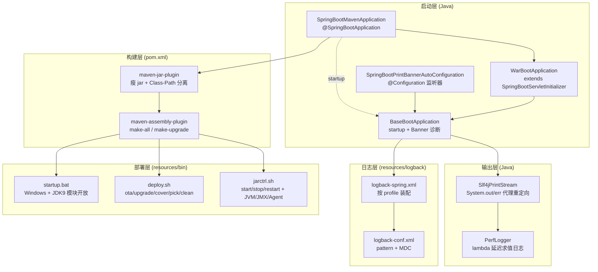

# i2f-springboot-maven-project

> Spring Boot 应用**脚手架 / 模板工程**（非发布型 Starter），演示一套完整的"可运行应用 + 构建打包 + 运维部署 + 日志"最佳实践：提供 jar/war 双部署的启动基类、启动诊断 Banner、`System.out/err` 重定向到 SLF4J 的打印流代理、瘦 jar + 外置 lib/resources 的 classpath 分离打包、全量/增量 assembly 分发包，以及 Linux/Windows 的进程控制与 OTA 升级脚本。

## 模块路径

- `i2f-springboot/i2f-springboot-maven-project`

> 说明：本模块已在聚合父 pom `i2f-springboot/pom.xml` 的 `<modules>` 中被**注释排除**（`<!-- <module>i2f-springboot-maven-project</module> -->`），不参与 reactor 聚合构建与产物分发，定位为"拷贝即用"的工程模板，而非被依赖的库。

## 模块依赖

| groupId | artifactId | scope | optional | 说明 |
|---------|-----------|-------|----------|------|
| org.projectlombok | lombok | compile | 否 | POJO 与日志代码生成 |
| org.springframework.boot | spring-boot-starter | provided | 是 | Boot 基础启动器 |
| org.springframework.boot | spring-boot-devtools | provided | 是 | 热部署（配置中 `restart.enabled=true`） |
| org.springframework.boot | spring-boot-starter-web | provided | 是 | Web/MVC；war 部署时需排除内嵌 tomcat |
| org.springframework.boot | spring-boot-starter-aop | provided | 是 | AOP 支持 |
| com.mavem | res-lib (1.0-jdk8) | system | 否 | **模板演示**：`src/main/resources/lib/res-lib-1.0.jar` 自定义 classpath 注入 |
| com.mavem | pom-lib (1.0-jdk8) | system | 否 | **模板演示**：`lib/pom-lib-1.0.jar` 自定义 classpath 注入 |

- 通过 `dependencyManagement` 导入 `spring-boot-dependencies:2.3.7.RELEASE`、`spring-cloud-dependencies:Hoxton.SR12`、`spring-cloud-alibaba-dependencies:0.2.2.RELEASE`、`logstash-logback-encoder:7.4`（后者默认注释未启用）。
- 两个 `com.mavem` 组 `system` 依赖是演示"如何把本地 jar 加入 classpath 参与打包"的样例，真实运行需自备对应 jar 文件。

## 模块设计

### 架构总览

模块由"启动层 / 输出层 / 构建层 / 部署层 / 日志层"五块协作，代码骨架在 Java 侧，工程化能力集中在 `pom.xml` 与 `resources/{bin,assembly,logback}` 下。



### 启动层设计

- **双部署形态**：`SpringBootMavenApplication` 标注 `@SpringBootApplication` 并继承 `WarBootApplication`（后者继承 `SpringBootServletInitializer` 并重写 `configure`），使同一份代码既可用 `main()` 以内嵌容器启动，也可打成 war 交由外部 Servlet 容器启动。
- **统一入口 `BaseBootApplication.startup`**：先调用 `Slf4jPrintStream.redirectSysoutSyserr()` 接管控制台，再注册启动信息（`webType/mainClass/args` 存入静态字段），以 `SpringApplicationBuilder` 运行并挂载 `ApplicationStartedEvent` 监听器。
- **诊断 Banner `getBootstrapBanner`**：在启动完成后一次性（`RUN_BANNER` 用 `AtomicBoolean.getAndSet` 保证幂等）打印运行画像——PID/启动用户、SpringBoot 与 Spring 版本、启动耗时、debug/agent/noverify 探测、Web 类型与本机及全网卡 IPv4/IPv6 访问 URL、类加载/编译/线程/GC 等 `ManagementFactory` MBean、`ServiceLoader` 枚举的 JDBC Driver / JCE Provider / IIOServiceProvider、`Runtime` 内存占用与 java/jvm 系统属性。
- **配置式监听器 `SpringBootPrintBannerAutoConfiguration`**：`@Configuration` + `InitializingBean` 在 `afterPropertiesSet` 打印 `starting...`，并通过 `@Bean` 暴露一个 `ApplicationListener<ApplicationStartedEvent>`（借助栈底帧反射主类）复用 `BaseBootApplication.getStartedListener`。

### 输出层设计

- **`Slf4jPrintStream`（PrintStream 代理）**：包装原始 `System.out`/`System.err`，覆写 `print/println/write/format/append/printf` 等全部写方法，统一转交 `proxy()` 走 SLF4J；`stdout→INFO`、`stderr→ERROR`。`redirectSysoutSyserr` 在 `synchronized(System.class)` 下判类型幂等替换；`useTrace` 通过栈轨迹回溯定位真实调用者作为 logger 名，`keepConsole` 决定是否同时回显原控制台；未检测到 `logging.config` 时 `write(byte[])` 回落原始流以保证控制台可见。
- **`PerfLogger`（性能型 Logger 封装）**：以 `logger.isXxxEnabled()` 预检查 + `Supplier`/函数式接口延迟求值，避免日志级别关闭时仍产生字符串拼接开销；针对 0~3 个泛型参数、可变参数、异常参数组合，提供 `info/warn/error/debug/trace` 及 `*Args`/`*Ex` 系列重载。

### 构建层设计

- **瘦 jar + classpath 分离**：`maven-jar-plugin` 生成不含配置/资源的纯净 jar，`archive.manifest` 设 `addClasspath=true` + `classpathPrefix=lib/` + `mainClass`，`manifestEntries` 追加 `Class-Path: . ./resources/ ${additional.classpath}`；`excludes` 排除 `*.properties/*.yml/*.xml/logback/mapper/META-INF` 等，实现"配置外置"第一步。
- **分发包 assembly**：`maven-assembly-plugin` 用两个 `execution` 分别产出 `assembly.xml`（`-all` 全量：lib + 脚本 + jar + resources）与 `assembly-upgrade.xml`（`-upgrade` 增量：仅本项目 groupId 依赖、排除 spring/apache/jackson/alibaba 等稳定三方），格式均为 `tar.gz`。
- **资源过滤**：`src/main/resources` 开启 `filtering`；额外把 `src/main/java` 下的 `xml/json/ftl/properties/yaml/vue/...` 纳入资源；`nonFilteredFileExtensions` 排除 doc/xls/pdf/so/dll 等二进制避免损坏。

### 部署层与日志层设计

- **`jarctrl.sh`**：应用进程控制器，`start/stop/restart/status` 等，集中暴露 Spring 配置（端口/profile/名称/配置位置）、Logback 参数、JVM 内存与 GC（XMS/XMX/XSS/Perm、ParallelGC/G1GC、OOM dump、GC 日志）、JMX（visualvm）、XRebel、Skywalking agent、UTF-8 与时区等开关。
- **`deploy.sh`**：OTA 升级器，`ota/upgrade/cover/pick/clean` 五种模式，动作前自动 `tar` 备份当前版本到 `backup.{目录名}`，`clean` 仅保留最近 `KEEP_COUNT`（默认 10）个备份包。
- **`startup.bat`**：Windows 启动脚本，探测 JDK 主版本，JDK9+ 自动追加 `--add-opens` 反射开放参数并在 `lib`/`lib-unload` 间搬移 `nashorn*.jar`，最终选取目录中最大版本 jar 运行。
- **`logback-spring.xml`**：`scan=true` 支持热更新，读取 `springProperty`，`include` 公共 `logback-conf.xml`（定义控制台高亮/文本/JSON 三类 pattern，含 `traceId`/`traceSource` 等 MDC 字段）与按 `log.app.env` 动态选择的 `logback-{env}.xml`（dev/test/prod 分级别 appender + 按大小时间滚动策略）。

## 模块目的

- 为新 Spring Boot 应用提供**开箱即用的工程骨架**：启动、日志、打包、分发、运维升级一体化，避免每个项目重复搭建。
- 演示**可维护的生产级实践**：配置外置瘦 jar、全量/增量双分发包、控制台输出统一纳入日志体系、启动环境自诊断。
- 提供**跨平台部署脚本模板**，屏蔽 JVM/JMX/GC/Agent 等启动参数复杂度，并支持带备份的 OTA 升级回滚。

## 模块功能

| 能力 | 载体 | 说明 |
|------|------|------|
| jar/war 双形态启动 | `SpringBootMavenApplication` + `WarBootApplication` | 内嵌容器或外部 Servlet 容器 |
| 统一启动流程 | `BaseBootApplication.startup` | 重定向输出→注册→运行→打印 Banner |
| 启动诊断画像 | `BaseBootApplication.getBootstrapBanner` | PID/版本/内存/线程/GC/MBean/SPI/访问 URL |
| 控制台转 SLF4J | `Slf4jPrintStream` | `System.out/err` 代理为 INFO/ERROR 日志 |
| 高性能日志 | `PerfLogger` | 级别预检查 + lambda 延迟求值 |
| 瘦 jar 打包 | `maven-jar-plugin` | 配置外置 + `Class-Path` 清单 |
| 全量/增量分发 | `maven-assembly-plugin` | `-all.tar.gz` / `-upgrade.tar.gz` |
| 进程控制 | `jarctrl.sh` | start/stop/restart + JVM/JMX/Agent 配置 |
| OTA 升级与备份 | `deploy.sh` | ota/upgrade/cover/pick/clean |
| Windows 启动 | `startup.bat` | JDK 版本自适应 + 模块开放 |
| 分级/分环境日志 | `logback-spring.xml` + `logback-{env}.xml` | 按 profile 装配、滚动归档 |

## 模块主要使用方法

### 1. 作为工程模板拷贝使用

因未纳入 reactor，直接在 IDE 中作为独立 Maven 工程运行；`main.class` 指向 `com.springboot.maven.SpringBootMavenApplication`。作为新项目起点时，替换 `artifactId`、`main.class`、`spring.application.name` 即可。

### 2. 打全量包与增量包

```bash
# 产出 {artifactId}-all.tar.gz（全量：lib + bin + jar + resources）
mvn package -DassemblyId=all
# 产出 {artifactId}-upgrade.tar.gz（增量：仅本项目 groupId 依赖）
mvn package -DassemblyId=upgrade
```

打包后目录结构为 `./{app}.jar` + `./lib/` + `./resources/` + `./jarctrl.sh` 等，配合 `Class-Path: . ./resources/ lib/...` 从瘦 jar 外部加载配置与依赖。

### 3. 部署与升级

```bash
./jarctrl.sh restart            # 启停/重启应用（读取脚本内 JVM/Spring/Logback 配置区）
./deploy.sh cover               # 用 ../{app}-all.tar.gz 全量覆盖，自动备份后重启
./deploy.sh upgrade             # 用 ../{app}-upgrade.tar.gz 增量升级
./deploy.sh clean               # 清理 backup.{app}，保留最近 10 个备份
```

### 4. 注意事项

- `additional.classpath` 与两个 `com.mavem` `system` 依赖是演示样例，指向 `lib/`、`src/main/resources/lib/` 下的 jar，落地时需替换为真实 jar 或删除。
- war 部署需将 `spring-boot-starter-web` 排除内嵌 tomcat 并把 `packaging` 改为 `war`（脚本注释已提示）。
- 控制台重定向默认 `useTrace=true`，会对每条 `System.out` 抓取栈轨迹定位调用者，海量 `System.out` 场景需评估性能。

## 配置项参考

| 配置项 | 位置 | 默认值 | 说明 |
|--------|------|--------|------|
| `main.class` | pom properties | `com.springboot.maven.SpringBootMavenApplication` | 瘦 jar 启动主类 |
| `additional.classpath` | pom properties | `lib/res-lib-1.0.jar pom/res-lib-1.0.jar` | 追加到 `Class-Path` 的条目（示例值） |
| `spring.application.name` | application.yml | `maven-project` | 应用名，Banner/日志名使用 |
| `spring.profiles.active` | application.yml | `dev` | 激活环境，联动 logback 环境文件 |
| `server.port` / `context-path` | application-dev.yml | `8080` / `/` | 端口与上下文 |
| `spring.servlet.multipart.max-file-size` | application.yml | `300MB` | 单文件上传上限 |
| `spring.devtools.restart.enabled` | application.yml | `true` | 热部署开关 |
| `logging.config` | 启动参数 | `classpath:logback-spring.xml` | logback 配置入口 |
| `logback.app.name` / `logback.app.env` | 启动参数(-D) | 回退 spring 名称 / `test` | 日志服务名与环境 |
| `jarctrl.sh` 中 `XMS_SIZE`/`XMX_SIZE` | 脚本变量 | `512M` / `2048M` | JVM 堆配置 |
| `deploy.sh` 中 `KEEP_COUNT` | 脚本变量 | `10` | 备份包保留数量 |

## 模块特性总结

- **模板工程定位**：独立可运行、被父 pom 注释排除，不参与聚合构建，供拷贝复用。
- **双部署支持**：`SpringBootServletInitializer` + `main()` 兼容 jar 与 war。
- **启动自诊断**：一次性 Banner 汇总 JVM/MBean/SPI/网络/内存/版本画像，利于排障。
- **日志一体化**：`System.out/err` 重定向 SLF4J + `PerfLogger` 延迟求值 + logback 分环境分级 + MDC traceId。
- **配置外置瘦 jar**：`Class-Path` 清单 + assembly 分离 `lib/`、`resources/`，实现 jar 与配置解耦。
- **全量/增量分发包**：两套 assembly 描述符，增量包排除稳定三方依赖缩小体积。
- **跨平台运维脚本**：`jarctrl.sh`（进程/JVM/JMX/Agent）、`deploy.sh`（OTA+备份清理）、`startup.bat`（JDK 版本自适应）。

## 模块瑕疵或错误

- **`startup` 中 web 类型判断疑似反向**：`if (webType != null) { builder.web(WebApplicationType.NONE); }` —— 显式传入 `webType` 反而强制设为 `NONE`（非 web），与方法意图和参数语义相悖，`webType` 形参未被真正用于设置应用类型。
- **Banner 编译信息判空变量写错**：`getBootstrapBanner` 中 `CompilationMXBean compilationMXBean = ...` 后，紧随的 `if (classLoadingMXBean != null)` 误用了上一个变量做判空；当 `compilationMXBean` 为 `null`（如某些 JVM 无编译器 MBean）而 `classLoadingMXBean` 非空时会 NPE。
- **`SpringBootPrintBannerAutoConfiguration` 反射主类脆弱**：`@Bean` 方法内取 `Thread.currentThread().getStackTrace()` 的**栈底帧**类名 `Class.forName` 反推主类，容器刷新线程的栈底未必是启动主类，失败时 `catch(Throwable)` 静默吞并传入 `null`；同时该监听器与 `BaseBootApplication` 内注册的监听器存在职责重叠。
- **静态全局可变状态**：`BaseBootApplication` 的 `webType/mainClass/mainArgs` 为公有静态可变字段、`RUN_BANNER` 全局幂等，多应用上下文/测试并发下不线程安全，且二次启动 Banner 不再打印。
- **`Slf4jPrintStream` 潜在日志丢失与性能**：未启用 logback 时 `write(byte[])` 仅回显 `target` 未走 `proxy`，该分支内容不进日志体系；`useTrace=true` 每条输出抓栈定位调用者，`System.out` 高频时有明显开销（代码注释已承认）。
- **`maven-compiler-plugin` 配 `skip=true`**：脚手架默认跳过编译，与实际需要产物 jar 相矛盾，属模板演示配置，落地需按环境移除。
- **演示用 `system` 依赖与 classpath 笔误**：`com.mavem:res-lib`/`pom-lib` 指向可能不存在的本地 jar，单独 `mvn` 构建会因 systemPath 缺失失败；`additional.classpath` 示例值含 `pom/res-lib-1.0.jar`（与实际 `pom-lib` 命名不一致，疑似笔误）。
- **`System.out.println` 与重定向自依赖**：Banner 内仍直接 `System.out.println("started.")` 打印，依赖重定向先行执行；若在未重定向路径下调用会绕过日志级别控制。
