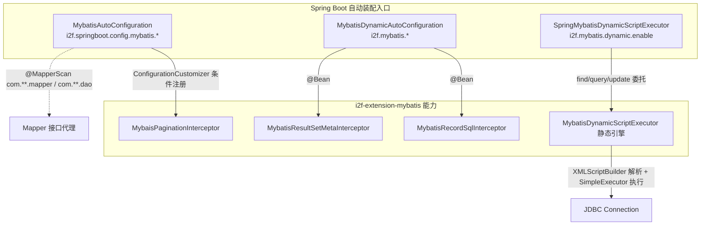

# i2f-springboot-mybatis-starter

> MyBatis / MyBatis-Plus 的 Spring Boot 自动装配 Starter，在三方 `mybatis-spring-boot-starter`、`mybatis-plus-boot-starter`、`pagehelper-spring-boot-starter` 之上叠加 i2f 增强能力：`MybatisAutoConfiguration` 负责 `@MapperScan` 扫描与可选分页拦截器注册，`MybatisDynamicAutoConfiguration` 装配 SQL 记录/结果集元数据两个拦截器，`SpringMybatisDynamicScriptExecutor` 提供无需 Mapper 接口、直接对动态 XML 脚本执行 find/query/update 的程序化查询通道。底层能力全部来自内部依赖 `i2f-extension-mybatis`。

## 模块路径

- `i2f-springboot/i2f-springboot-mybatis-starter`

## 模块依赖

| groupId | artifactId | scope | optional | 说明 |
|---------|-----------|-------|----------|------|
| i2f.turbo | i2f-extension-mybatis | compile | 否 | 内部依赖，提供拦截器、动态脚本执行器、分页/结果集处理器等核心实现 |
| org.projectlombok | lombok | compile | 否 | POJO 与日志代码生成 |
| org.springframework.boot | spring-boot-starter | provided | 是 | Boot 基础自动装配 |
| org.springframework.boot | spring-boot-configuration-processor | provided | 是 | 配置元数据处理器 |
| org.mybatis.spring.boot | mybatis-spring-boot-starter (2.3.2) | provided | 否 | MyBatis 官方 Boot 集成，提供 `SqlSessionFactory`/`MybatisProperties` |
| com.baomidou | mybatis-plus-boot-starter (3.0.7.1) | provided | 否 | MyBatis-Plus 集成，提供 `MybatisPlusProperties` |
| com.github.pagehelper | pagehelper-spring-boot-starter (1.3.0) | provided | 否 | 分页插件，本模块代码未直接引用（分页走 i2f 自有拦截器） |

> 说明：三方 MyBatis 生态依赖均为 `provided`，由使用方按需引入具体版本；本 Starter 只做"增强装配"，不强制拉入 MyBatis 运行时。

## 模块设计

### 架构设计

模块由三个自动装配类组成，均登记在 `spring.factories` 与 Boot 3 的 `AutoConfiguration.imports` 中，按职责分为"扫描装配 / 拦截器装配 / 程序化执行"三层：



### 设计要点

- **双拦截器装配路径**：分页拦截器（`MybaisPaginationInterceptor`）通过 `ConfigurationCustomizer` 注入到 MyBatis `Configuration`，属于"修改全局会话配置"；SQL 记录与结果集元数据拦截器（`MybatisRecordSqlInterceptor`/`MybatisResultSetMetaInterceptor`）则以独立 `@Bean` 形式产出，由 mybatis-spring-boot-starter 自动收集为插件。
- **三源配置探测**：`SpringMybatisDynamicScriptExecutor.initConfiguration()` 依次尝试从 `MybatisProperties`、`MybatisPlusProperties` 反射读取 `getConfiguration()`，以复用使用方已有的 MyBatis 全局 `Configuration`（如驼峰映射、类型处理器），读取失败则回退到引擎内置 `DEFAULT_CONFIGURATION`。
- **静态单例 + 闩锁同步**：执行器构造时把自身写入静态 `INSTANCE` 并 `countDown()`，`getInstance()` 通过 `CountDownLatch.await()` 保证拿到已初始化的实例，从而支持在非 Spring 管理的代码里静态获取。
- **独立开关分层**：三块能力分别由 `i2f.springboot.config.mybatis.enable`、`i2f.mybatis.interceptor.*.enable`、`i2f.mybatis.dynamic.enable` 三组 `@ConditionalOnExpression` 独立控制，默认可各自启停。

### 包结构

```
i2f.springboot.mybatis
├── MybatisAutoConfiguration              # @MapperScan + 分页拦截器 Customizer
├── MybatisDynamicAutoConfiguration       # SQL 记录 / 结果集元数据拦截器 Bean
└── dynamic
    └── SpringMybatisDynamicScriptExecutor # 动态 XML 脚本程序化执行器（Spring 适配 + 静态单例）
```

## 模块目的

- 在**不绑定具体 MyBatis 版本**（provided）的前提下，为使用方一键接入 i2f 的 MyBatis 增强：自动扫描 Mapper、可选分页/SQL 记录/结果集元数据拦截。
- 提供一条**脱离 Mapper 接口**的动态 SQL 执行通道，让运行期拼接的 MyBatis XML  `<script>` 片段可直接借 Spring `DataSource` 执行并映射结果。
- 复用使用方已有的 MyBatis `Configuration`，使动态执行与正式 Mapper 查询在映射规则上保持一致。

## 模块功能

| 功能 | 触发条件（默认） | 载体 | 说明 |
|------|-----------------|------|------|
| Mapper 扫描 | `i2f.springboot.config.mybatis.enable`（true） | `MybatisAutoConfiguration` `@MapperScan` | 扫描 `com.**.mapper`、`com.**.dao` 生成 Mapper 代理 |
| 分页拦截器 | `...mybatis.interceptor.enable`（true）且 `enable-pagination-interceptor`（false） | `ConfigurationCustomizer` | 仅当显式开启分页开关时才 `addInterceptor` |
| SQL 记录拦截器 | `i2f.mybatis.interceptor.record-sql.enable`（true） | `@Bean` | 记录/打印实际执行 SQL，`enablePrintSql` 控制是否输出 |
| 结果集元数据拦截器 | `i2f.mybatis.interceptor.result-set-meta.enable`（true） | `@Bean` | 拦截 `ResultSetHandler` 处理结果集列元数据 |
| 动态脚本执行器 | `i2f.mybatis.dynamic.enable`（true） | `SpringMybatisDynamicScriptExecutor` | 对 `<script>` XML 直接 find/query/update |
| 静态实例获取 | 随执行器装配 | `getInstance()` | 借 `CountDownLatch` 等待初始化完成后返回单例 |

## 模块主要使用方法

### 1. 引入并启用装配

引入本 Starter 与任一 MyBatis 生态运行时（三选一或组合）：

```xml
<dependency>
    <groupId>i2f.turbo</groupId>
    <artifactId>i2f-springboot-mybatis-starter</artifactId>
</dependency>
<!-- 使用方自行引入 mybatis-spring-boot-starter / mybatis-plus-boot-starter -->
```

开启分页拦截器（默认关闭）：

```yaml
i2f:
  springboot:
    config:
      mybatis:
        enable: true
        interceptor:
          enable: true
        enable-pagination-interceptor: true
  mybatis:
    interceptor:
      record-sql:
        enable: true      # 记录/打印执行 SQL
      result-set-meta:
        enable: true
    dynamic:
      enable: true        # 启用动态脚本执行器
```

### 2. 程序化执行动态 XML 脚本

```java
@Autowired
private SpringMybatisDynamicScriptExecutor executor;

// 单一对象：script 为 MyBatis <script> 内部片段，params 为参数对象
User user = executor.find(
        "select * from user where id = #{id}",
        Collections.singletonMap("id", 1),
        User.class);

// 列表查询
List<User> users = executor.query(
        "select * from user where age > #{age}",
        Collections.singletonMap("age", 18),
        User.class);

// 更新/插入/删除
int affected = executor.update(
        "update user set name = #{name} where id = #{id}",
        params);
```

### 3. 静态获取实例（非注入场景）

```java
// 构造完成后 getInstance() 才会放行；调用方需确保容器已初始化该 Bean
SpringMybatisDynamicScriptExecutor ctx = SpringMybatisDynamicScriptExecutor.getInstance();
List<Order> orders = ctx.query(script, params, Order.class);
```

### 注意事项

- `find` 语义为"至多一条"，命中多行会抛 `SQLException`（引擎层 `result row expect one`）。
- 动态执行借 `DataSourceUtils.getConnection` 取连接并在 `finally` 释放，可参与 Spring 事务同步，但**不经 `SqlSession`**，与 Mapper 一级/二级缓存无交互。
- 若不引入 `mybatis-spring-boot-starter`/`mybatis-plus-boot-starter`，执行器将回退到内置 `DEFAULT_CONFIGURATION`（`mapUnderscoreToCamelCase`、`callSettersOnNulls` 已开启）。

## 配置项参考

| 配置键 | 类型 | 默认值 | 绑定类 | 说明 |
|--------|------|--------|--------|------|
| `i2f.springboot.config.mybatis.enable` | Boolean | `true` | `MybatisAutoConfiguration` | 是否启用扫描/Customizer 装配 |
| `i2f.springboot.config.mybatis.interceptor.enable` | Boolean | `true` | `MybatisAutoConfiguration` | 是否注册 `ConfigurationCustomizer` |
| `i2f.springboot.config.mybatis.enable-pagination-interceptor` | Boolean | `false` | `MybatisAutoConfiguration` | 是否真正加入分页拦截器 |
| `i2f.mybatis.interceptor.record-sql.enable` | Boolean | `true` | `MybatisDynamicAutoConfiguration` | SQL 记录拦截器开关与是否打印 |
| `i2f.mybatis.interceptor.result-set-meta.enable` | Boolean | `true` | `MybatisDynamicAutoConfiguration` | 结果集元数据拦截器开关 |
| `i2f.mybatis.dynamic.enable` | Boolean | `true` | `SpringMybatisDynamicScriptExecutor` | 动态脚本执行器开关 |

## 模块特性总结

- **零版本绑定**：MyBatis/MyBatis-Plus/PageHelper 全部 `provided`，只做增强装配。
- **三开关分层**：扫描、拦截器、动态执行各自独立 `@ConditionalOnExpression` 启停。
- **动态 SQL 直查**：无需 Mapper 接口即可执行 `<script>` 片段，支持 find/query/update 与自定义 `statementId`/`resultMapId`/`Configuration`。
- **配置复用**：反射探测 `MybatisProperties`/`MybatisPlusProperties`，尽量沿用使用方已有的全局 `Configuration`。
- **静态可取**：`CountDownLatch` 保障的静态单例，方便非托管代码调用。

## 模块瑕疵或错误

> 仅按源码识别潜在问题，未做运行期实证。

1. **`MybatisResultSetMetaInterceptor` 配置被丢弃**：`mybatisResultSetMetaInterceptor()` 内新建并设置了 `MybatisResultSetMetaProxyHandler handler`（含 info/error logger），但最终 `return new MybatisResultSetMetaInterceptor()` 调用的是无参构造，`handler` 从未传入——已配置的日志回调成为死代码，实际拦截器使用其自建 handler。
2. **执行器被当作自动配置类登记**：`SpringMybatisDynamicScriptExecutor` 是带 `(DataSource, ApplicationContext)` 构造的普通服务类（仅 `@Data`），却被列入 `spring.factories`/`AutoConfiguration.imports`。它依赖容器把构造参数注入才能成为 Bean；一旦 `DataSource` 缺失即装配失败，且作为"自动配置"语义并不恰当。
3. **静态单例 + 闩锁的隐藏全局态**：`INSTANCE`/`INSTANCE_LATCH` 为静态可变字段。若该 Bean 因异常未成功构造，`getInstance()` 将在 `await()` 上永久阻塞；容器中若被创建多次，`INSTANCE` 会被后者覆盖、latch 已归零。
4. **静默吞异常**：`initConfiguration()` 两段反射探测与 `getInstance()` 的 `catch` 均为空块（`InterruptedException` 也未恢复中断标志），配置探测失败无任何日志，排障困难。
5. **`@MapperScan` 包范围硬编码**：仅扫描 `com.**.mapper`、`com.**.dao`，位于 `i2f.**`/`org.**` 等包下的 Mapper 不会被注册；且自动配置类上的 `@MapperScan` 可能与使用方自定义扫描重复。
6. **`@EnableScheduling` 疑似冗余**：`MybatisAutoConfiguration` 带 `@EnableScheduling`，但本模块无任何 `@Scheduled` 任务，开启全局调度无实际用途。
7. **字段初值与 `@Value` 默认冲突**：`enablePrintRecordSql` 字段初始化为 `false`，而 `@Value("${...:true}")` 默认注入 `true`，两处不一致易造成阅读/默认行为歧义。
8. **配置元数据不完整/含模板残留**：`additional-spring-configuration-metadata.json` 的 `hints` 保留了与本模块无关的 `server.servlet.jsp.class-name`、`server.tomcat.accesslog.encoding` 模板项；同时 `i2f.mybatis.interceptor.record-sql.enable`、`result-set-meta.enable` 等代码使用的键未登记，`i2f.springboot.config.mybatis` 前缀也未纳入 `groups`。
9. **pagehelper 依赖未落地使用**：`pagehelper-spring-boot-starter` 为 provided 依赖，但本模块分页实际走 `i2f-extension-mybatis` 自有的 `MybaisPaginationInterceptor`，该依赖在本模块代码中无直接引用。
