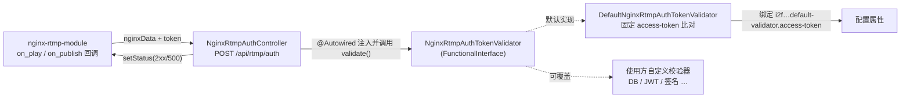

# i2f-springboot-nginx-rtmp-auth-server-starter

> Nginx-RTMP 模块（`nginx-rtmp-module`）推/拉流鉴权回调服务端的 Spring Boot 自动装配 Starter：内置一个 `POST /api/rtmp/auth` 控制器，接收 nginx 回调转发的 `call/addr/app/name/tcUrl…` 等流参数与自定义 `token`，交由可替换的 `NginxRtmpAuthTokenValidator` 判定，按 **HTTP 状态码**（2xx 放行 / 非 2xx 拒绝）回应 nginx；默认提供基于固定 `access-token` 的校验实现，使用方亦可注册自定义 `NginxRtmpAuthTokenValidator` Bean 覆盖鉴权逻辑。

## 模块路径

- `i2f-springboot/i2f-springboot-nginx-rtmp-auth-server-starter`

## 模块依赖

| groupId | artifactId | scope | optional | 说明 |
|---------|-----------|-------|----------|------|
| org.projectlombok | lombok | compile | 否 | 日志代码生成 |
| org.springframework.boot | spring-boot-starter | provided | 是 | Boot 基础自动装配 |
| org.springframework.boot | spring-boot-configuration-processor | provided | 是 | 配置元数据处理器 |
| org.springframework.boot | spring-boot-starter-web | provided | 是 | Web/MVC 与 Servlet API（`@RestController`、`HttpServletRequest/Response`）来源 |

> 说明：零 i2f 内部依赖；`spring-boot-starter-web` 为 provided+optional，控制器与 Servlet 相关类仅在 Web 环境下才有意义。

## 模块设计

### 架构设计



### 设计要点

- **面向接口可替换鉴权**：控制器只依赖 `NginxRtmpAuthTokenValidator` 这一函数式接口，鉴权算法与"接收回调 / 应答状态码"的框架逻辑解耦；默认实现 `DefaultNginxRtmpAuthTokenValidator` 通过开关 `...default-validator.enable`（默认 true）控制是否装配。
- **以 HTTP 状态码沟通**：nginx-rtmp 的 `on_play/on_publish` 只判断响应状态码是否 2xx，故控制器在放行时保持 200、拒绝时显式 `setStatus(500)`，并附带一段 JSON 文本便于日志排查。
- **参数整体承接**：`@RequestParam Map<String,Object> nginxData` 一次性收下 nginx 转发来的所有表单字段（`call`、`addr`、`app`、`name`、`tcUrl`、`flashVer`、`swfUrl`、`pageUrl` 等），`token` 单独抽取后连同原始 request 一起传给校验器，保证自定义实现有完整上下文。
- **双通道登记**：默认校验器与控制器同时登记于 `spring.factories`（Boot 2）与 `AutoConfiguration.imports`（Boot 3），保证在两个大版本下均能被自动装配为 Bean。

### 包结构

```
i2f.springboot.nginx.rtmp.auth.server
├── NginxRtmpAuthTokenValidator        # 鉴权函数式接口（唯一扩展点）
├── DefaultNginxRtmpAuthTokenValidator # 默认实现：固定 access-token 比对
└── NginxRtmpAuthController            # POST /api/rtmp/auth 回调入口
```

## 模块目的

- 让引入本 Starter 的 Spring Boot Web 应用**开箱即得一个 nginx-rtmp 鉴权回调端点**，无需自行编写控制器与参数解析。
- 用**最小默认 + 接口覆盖**的方式，既支持"配一个 token 即可防盗链"的轻量场景，也允许接入 DB/JWT/签名等真实鉴权体系。
- 屏蔽 nginx-rtmp 回调协议细节（表单字段、以状态码判定成败），把业务关注点收敛到 `validate()` 一个方法。

## 模块功能

| 功能 | 触发条件（默认） | 载体 | 说明 |
|------|-----------------|------|------|
| 暴露鉴权回调端点 | 随 Starter 装配（Web 环境） | `NginxRtmpAuthController#auth` | `POST /api/rtmp/auth`，接收 nginxData+token 并按状态码回应 |
| 默认令牌校验 | `...default-validator.enable`（true） | `DefaultNginxRtmpAuthTokenValidator` | 与配置的 `access-token` 比对，不匹配则拒绝 |
| 自定义鉴权替换 | 注册自有 `NginxRtmpAuthTokenValidator` Bean | 使用方实现 | 覆盖默认逻辑（需先关闭默认校验器避免歧义） |

## 模块主要使用方法

### 1. nginx 侧配置（回调到本服务）

```nginx
rtmp {
    server {
        listen 1935;
        application live {
            live on;
            # 拉流/推流鉴权回调，args 会作为表单参数 POST 过来
            on_play http://127.0.0.1:8080/api/rtmp/auth?token=$arg_token;
            on_publish http://127.0.0.1:8080/api/rtmp/auth?token=$arg_token;
        }
    }
}
```

### 2. 应用侧配置默认令牌

```yaml
i2f:
  springboot:
    nginx:
      rtmp:
        auth:
          default-validator:
            enable: true
            access-token: "your-secret-token"
```

### 3. 自定义鉴权实现

```java
// 关闭默认校验器后，注册自己的实现覆盖
@Bean
public NginxRtmpAuthTokenValidator myValidator() {
    return (request, token, nginxData) -> {
        String stream = String.valueOf(nginxData.get("name"));
        // 结合 DB / JWT / 播放签名判定
        return token != null && jwtService.verify(token, stream);
    };
}
```

> 注意：默认校验器与自定义实现同为 `NginxRtmpAuthTokenValidator` 类型；若两者同时存在，控制器 `@Autowired` 单类型注入会因多候选而失败，覆盖时应将 `...default-validator.enable` 置为 `false`。

## 配置项参考

| 配置键 | 类型 | 默认值 | 绑定类 | 说明 |
|--------|------|--------|--------|------|
| `i2f.springboot.nginx.rtmp.auth.default-validator.enable` | Boolean | `true` | `DefaultNginxRtmpAuthTokenValidator` | 是否装配默认令牌校验器（供 `@ConditionalOnExpression` 读取） |
| `i2f.springboot.nginx.rtmp.auth.default-validator.access-token` | String | 无 | `DefaultNginxRtmpAuthTokenValidator` | 默认校验器比对的访问令牌 |

## 模块特性总结

- **端点即插即用**：引入即得到 `POST /api/rtmp/auth`，参数解析与状态码应答已封装。
- **单接口扩展**：仅一个函数式接口 `NginxRtmpAuthTokenValidator` 作为鉴权扩展点，替换成本低。
- **协议贴合 nginx-rtmp**：整体承接 nginx 回调表单字段，严格按"2xx 放行"语义应答。
- **零内部依赖、provided Web**：不强绑 i2f 库，Web 依赖 optional，仅在 Servlet 环境生效。
- **Boot 2/3 双登记**：`spring.factories` 与 `AutoConfiguration.imports` 并存。

## 模块瑕疵或错误

> 仅按源码识别潜在问题，未做运行期实证。

1. **默认校验器对空令牌"失败放行"（fail-open）**：`validate()` 仅在 `token` 非空时才做比对，`token` 为 `null`/空串时**直接返回 true**。攻击者不带 `token` 即可绕过默认鉴权，属安全隐患。
2. **未配置 `access-token` 时行为反直觉**：若 `accessToken` 未配置（为 `null`），带任意非空 `token` 的请求 `token.equals(null)` 恒为 false → 全部拒绝，而不带 token 反而通过；默认值缺失时缺乏显式告警。
3. **默认校验器无 `@ConditionalOnMissingBean`**：`DefaultNginxRtmpAuthTokenValidator` 仅用 `@ConditionalOnExpression` 约束，使用方注册自定义 `NginxRtmpAuthTokenValidator` 后，控制器单类型 `@Autowired` 会因两个候选 Bean 触发 `NoUniqueBeanDefinitionException`，无法"平滑覆盖"，必须手动关闭默认校验器。
4. **控制器与 `@Component` 被当作自动配置类登记**：`NginxRtmpAuthController`（`@RestController`）与 `DefaultNginxRtmpAuthTokenValidator`（`@Component`）被直接写入 `spring.factories`/`AutoConfiguration.imports`。二者并非 `@Configuration` 类，作为自动配置登记语义不当，且 `@Component` 类若同时在扫描路径下存在重复注册风险。
5. **缺少 Web 环境条件保护**：控制器依赖 Servlet/`spring-boot-starter-web`，但自动装配未加 `@ConditionalOnWebApplication`/`@ConditionalOnClass(DispatcherServlet)`；在非 Web（如纯 reactive 或无 MVC）应用中登记该控制器可能装配失败。
6. **响应声明为 JSON 却无 content-type 约束**：`auth` 返回手写的 JSON 字符串但方法未设 `produces`/`@ResponseBody` 结构化返回，实际 `String` 经 `StringHttpMessageConverter` 以 `text/plain` 输出；虽 nginx-rtmp 只看状态码，但对接其它客户端时 body 类型不符预期。
7. **端点路径硬编码**：`/api/rtmp` + `/auth` 固定，无法通过配置调整回调路径，与应用既有网关/上下文前缀可能冲突。
8. **配置元数据含模板残留**：`additional-spring-configuration-metadata.json` 的 `hints` 保留了与本模块无关的 `server.servlet.jsp.class-name`、`server.tomcat.accesslog.encoding` 模板项；`access-token` 亦无 `defaultValue`/安全提示。
