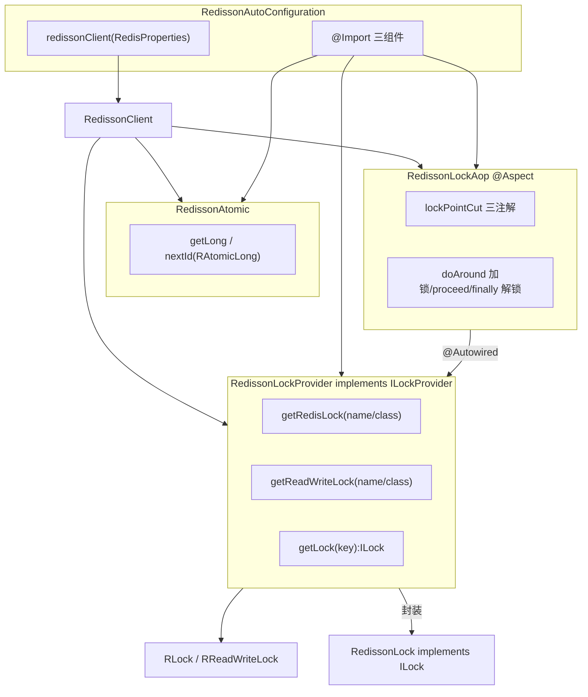

# i2f-springboot-redisson-starter

> Redisson 分布式锁 / 原子自增的 Spring Boot 自动装配 Starter：`RedissonAutoConfiguration` 复用 Spring Boot 的 `RedisProperties`（单点 / 集群 / 哨兵三模式）构建 `RedissonClient`，并 `@Import` 三个组件——`RedissonLockProvider`（i2f `ILockProvider` 抽象 + 裸 `RLock`/`RReadWriteLock` 获取）、`RedissonAtomic`（`RAtomicLong` 分布式自增 ID）、`RedissonLockAop`（切面解析 `@RedisLock`/`@RedisReadLock`/`@RedisWriteLock` 三注解，自动加锁/释放，支持读读写写锁与 watchdog 超时）；锁抽象接口下沉内部依赖 `i2f-lock`。redisson-spring-boot-starter 为 provided，需使用方自行引入。

## 模块路径

- `i2f-springboot/i2f-springboot-redisson-starter`

## 模块依赖

| groupId | artifactId | scope | optional | 说明 |
|---------|-----------|-------|----------|------|
| i2f.turbo | i2f-lock | compile | 否 | 内部依赖，提供 `ILock`/`ILockProvider` 锁抽象接口 |
| org.projectlombok | lombok | compile | 否 | `@Slf4j`/`@Data` 代码生成 |
| org.springframework.boot | spring-boot-starter | provided | 是 | Boot 基础自动装配 |
| org.springframework.boot | spring-boot-configuration-processor | provided | 是 | 配置元数据处理器 |
| org.springframework.boot | spring-boot-starter-aop | provided | 否（未标 optional） | AOP 支持，`RedissonLockAop` 依赖 aspectj |
| org.redisson | redisson-spring-boot-starter (3.14.0) | provided | 否（未标 optional） | Redisson 客户端与 `RedissonClient`/`RLock`/`RAtomicLong` API |

> 注：`RedisProperties` 来自 `spring-boot-autoconfigure`（data-redis 包），本模块未显式声明 data-redis，依赖 `redisson-spring-boot-starter` 传递引入。

## 模块设计

### 架构分层



### 设计要点

- **单 Bean 多模式**：`redissonClient()` 按 `RedisProperties` 的 `cluster` → `host` → `sentinel` 优先级依次探测，产出 `Config` 后 `Redisson.create(config)`，并统一设置 `pingConnectionInterval`、`lockWatchdogTimeout`。
- **组件靠 `@Import` 装配**：`RedissonAutoConfiguration` 通过 `@Import` 把 Provider / Atomic / AOP 拉入容器，三者构造函数依赖 `RedissonClient` 自动注入。
- **AOP 注解驱动锁**：`RedissonLockAop` 一个 `@Around` 串联三段近乎复制的分支，按 `RedisLock > RedisWriteLock > RedisReadLock` 优先级取第一个命中注解，锁键由 `clazz`/`classify`/`value`/`keyIdx` 组合。
- **锁抽象可插拔**：`RedissonLockProvider implements ILockProvider`（i2f-lock），使 Redisson 锁可接入 i2f 统一锁体系；同时暴露裸 `RLock`/`RReadWriteLock` 供 AOP 与高级用法。

## 模块目的

为 Spring Boot 应用提供开箱即用的 Redisson 能力：一处 `i2f.redission.*` + `spring.redis.*` 配置即可得到 `RedissonClient`，并叠加「注解式分布式锁」「读读写写锁」「分布式原子自增 ID」三类常用能力，屏蔽 `try...finally` 手动加解锁样板。

## 模块功能

| 功能 | 触发条件 | 关键类/方法 | 说明 |
|------|----------|-------------|------|
| `RedissonClient` 装配 | 无（恒定注册） | `redissonClient(RedisProperties)` | 单点/集群/哨兵三模式，读 `spring.redis.*` |
| 锁键前缀封装 | `@Import` 常驻 | `RedissonLockProvider` | 默认前缀 `lock:`，提供 name/class 多维取锁 |
| 分布式自增 | `@Import` 常驻 | `RedissonAtomic.nextId` | `atomic:` 前缀，`RAtomicLong.incrementAndGet` |
| 互斥锁切面 | `@RedisLock` + `i2f.redission.lock.enable`（默认 true） + `Aspect` 类存在 | `RedissonLockAop.doAround` | `RLock.lock()`/带超时/自动释放 |
| 读锁切面 | `@RedisReadLock` + 同上开关 | `RedissonLockAop`（read 分支） | `RReadWriteLock.readLock()` |
| 写锁切面 | `@RedisWriteLock` + 同上开关 | `RedissonLockAop`（write 分支） | `RReadWriteLock.writeLock()` |
| i2f `ILock` 适配 | 手动 `getLock(key)` | `RedissonLock` | 桥接到 `i2f-lock` 抽象 |

## 模块主要使用方法

### 引入依赖并配置

```yaml
spring:
  redis:
    host: 127.0.0.1
    port: 6379
    # password / cluster / sentinel 按需
i2f:
  redission:                 # 注意：前缀为 redission（双写 s）
    lock-watchdog-timeout: 30000
    ping-connection-interval: 3000
    lock:
      enable: true
```

### 注解式加锁

```java
@RedisLock(classify = true, value = "order", keyIdx = 0) // 类分区锁
public void createOrder(String orderId) { ... }

@RedisWriteLock(value = "stock")   // 写锁
public void deduct() { ... }

@RedisReadLock(value = "stock")    // 读锁
public int query() { ... }
```

### 程序化使用

```java
@Autowired RedissonLockProvider provider;
@Autowired RedissonAtomic atomic;

RLock lock = provider.getRedisLock("res:1");
lock.lock();
try { /* ... */ } finally { lock.unlock(); }

long id = atomic.nextId("seq:order");
```

## 配置项参考

| 配置项 | 类型 | 默认值 | 绑定位置 | 说明 |
|--------|------|--------|----------|------|
| `i2f.redission.lock-watchdog-timeout` | long | 3000（代码）/ 30000（元数据） | `RedissonAutoConfiguration.lockWatchdogTimeout` | 锁看门狗超时（毫秒） |
| `i2f.redission.ping-connection-interval` | int | 3000（代码）/ 30000（元数据） | `RedissonAutoConfiguration.pingConnectionInterval` | 连接 ping 间隔（毫秒） |
| `i2f.redission.lock.enable` | boolean | true | `RedissonLockAop` `@ConditionalOnExpression` | 锁切面总开关 |
| `spring.redis.*` | — | — | `RedisProperties`（Boot 自带） | 地址/密码/超时/集群/哨兵 |

## 模块特性总结

- 复用 Boot `RedisProperties`，无需重复定义连接参数，单点/集群/哨兵三模式覆盖。
- 注解式分布式锁 + 读读写写锁，锁键生成规则文档详尽（类锁/方法锁/分区锁）。
- 通过 `@Import` 集中装配，锁切面独立 `@ConditionalOnExpression` + `@ConditionalOnClass(Aspect)` 双条件守护。
- 同时提供裸 `RLock` API 与 i2f `ILock`/`ILockProvider` 抽象，融入 i2f 锁体系。
- 附带 `RedissonAtomic` 分布式自增，满足序列号/计数场景。

## 模块瑕疵或错误

> 以下为静态审阅发现，仅标注不实证。

1. **`keyIdx=0` 被忽略（功能级 bug）**：三个分支均写 `if (kidx > 0 && kidx < params.length)`，而 `RedisLock` 文档示例明确使用 `keyIdx = 0` 取第 0 个入参；`kidx > 0` 使 `keyIdx=0` 永远不生效，应以 `>= 0` 判定，导致「按首个参数分区锁」这一核心用法失效。
2. **`redissonClient` 缺 `@ConditionalOnMissingBean`**：`redisson-spring-boot-starter` 自身已自动配置 `RedissonClient`，本模块再产出一个，容器将出现两个 `RedissonClient` 候选，按类型注入歧义 / 重复建连。
3. **`RedissonAutoConfiguration` 无 `@Configuration`/`@AutoConfiguration`**：作为 `spring.factories`/`imports` 登记的自动配置类却缺配置注解，走 lite 模式；且无 `@ConditionalOnClass(RedissonClient.class)` 守护，redisson 为 provided 未引入时可能启动即失败。
4. **三模式全不落空时静默产出无效 Config**：`cluster`/`host`/`sentinel` 均未配置时无 `else` 分支，`config` 无任何 server，`Redisson.create(config)` 抛底层异常，缺乏明确校验与友好报错。
5. **仅支持 `redis://` 明文协议**：`SCHEMA_PREFIX` 固定 `redis://`，不支持 `rediss://`（TLS/SSL）及云 Redis 安全连接。
6. **`RedisProperties` 隐式依赖**：方法参数直接注入 `RedisProperties`，但本模块未声明 data-redis 依赖、也未 `@EnableConfigurationProperties(RedisProperties.class)`，依赖 Boot data-redis 自动配置与 redisson starter 传递，装配脆弱。
7. **AOP 三分支高度复制粘贴**：`RedisLock`/`RedisWriteLock`/`RedisReadLock` 三段锁键解析逻辑几乎完全重复，未抽公共方法，维护与一致性风险高。
8. **配置前缀拼写 `redission`（双写 s）**：应为 `redisson`，一经发布即成对外 API 契约，难以纠正。
9. **元数据默认值与描述错误**：`additional-spring-configuration-metadata.json` 中 `lock-watchdog-timeout`、`ping-connection-interval` 的 `defaultValue` 均为 30000，与代码默认 3000 不符；两项 `description` 都写成 "lock watchdog timeout"（ping 项复制粘贴未改）；`hints` 段为 JSP/Tomcat 模板残留；`lock` 分组 `type` 指向 `RedissonLockAop`（实为切面类而非配置属性类）。
10. **`RedissonLock` 适配未接入 AOP 且超时无接口**：`ILock` 仅 `lock()/unlock()`，`lock(long,TimeUnit)` 非 `@Override`；`RedissonLockProvider.getLock(String)` 返回 `ILock` 的路径 AOP 并未使用，近乎闲置。
