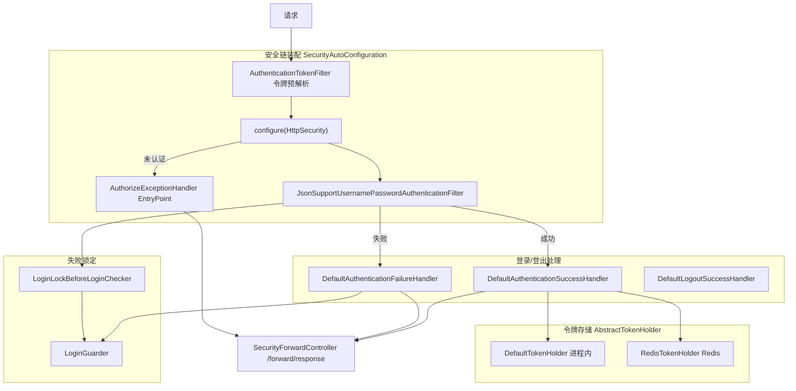

# i2f-springboot-security-starter

> Spring Security 令牌（token）认证/授权的 Spring Boot 自动装配 Starter：以 `SecurityAutoConfiguration`（继承 `WebSecurityConfigurerAdapter`）为核心装配无状态（STATELESS）安全链，配套 `JsonSupportUsernamePasswordAuthenticationFilter` 支持 JSON/表单双方式登录、`AuthenticationTokenFilter` 令牌预解析、`AbstractTokenHolder`（内存 `DefaultTokenHolder` / 可选 `RedisTokenHolder`）以 UUID token 缓存 `UserDetails` 并支持单点登录互踢、`DefaultAuthenticationSuccessHandler`/`FailureHandler`/`LogoutSuccessHandler` 处理登录登出、`SecurityExceptionHandler`（`@ControllerAdvice`）+ `AuthorizeExceptionHandler`（`AuthenticationEntryPoint`）双通道输出统一 `ApiResp`，`LoginGuarder`+`LoginLockBeforeLoginChecker` 提供账号/IP 失败锁定。整体由 `i2f.springboot.config.security.enable`（默认 true）开关控制，`DisableSecurityConfiguration` 在关闭时排除 Boot 自带安全自动配置。大量能力下沉内部依赖 `i2f-authentication`/`i2f-jdk-ext-web`/`i2f-spring-security`/`i2f-spring-authentication` 等。

## 模块路径

- `i2f-springboot/i2f-springboot-security-starter`

## 模块依赖

| groupId | artifactId | scope | optional | 说明 |
|---------|-----------|-------|----------|------|
| i2f.turbo | i2f-resp | compile | 否 | 内部依赖，提供统一响应体 `ApiResp` |
| i2f.turbo | i2f-reflect | compile | 否 | 内部依赖，反射工具（本模块源码未见直接使用，随装配引入） |
| i2f.turbo | i2f-cache | compile | 否 | 内部依赖，提供 `IExpireCache`/`MapCache`/`ObjectExpireCacheWrapper` 令牌缓存底座 |
| i2f.turbo | i2f-authentication | compile | 否 | 内部依赖，提供 `LoginPasswordDecoder`、`BasicAuthUser` 认证契约 |
| i2f.turbo | i2f-network | compile | 否 | 内部依赖，提供 `HttpStatusConstants` 状态码常量 |
| i2f.turbo | i2f-jdk-ext-web | compile | 否 | 内部依赖，提供 `ServletContextUtil`（forward/token/IP 解析）与 `LoginGuarder`（失败锁定） |
| i2f.turbo | i2f-spring-core | compile | 否 | 内部依赖，Spring 基础支撑 |
| i2f.turbo | i2f-extension-redis-cache | compile | 否 | 内部依赖，提供 `RedisCache`，`RedisTokenHolder` 令 Redis 化 |
| i2f.turbo | i2f-spring-redis | compile | 否 | 内部依赖，Spring Redis 客户端适配 |
| i2f.turbo | i2f-spring-authentication | compile | 否 | 内部依赖，提供 `SecurityForwardController`（`/forward/response` 真正落点） |
| i2f.turbo | i2f-spring-security | compile | 否 | 内部依赖，提供 `SecurityUtil` 读取 `SecurityContext` |
| org.projectlombok | lombok | compile | 否 | POJO 与日志代码生成 |
| org.springframework.boot | spring-boot-starter | provided | 是 | Boot 基础自动装配 |
| org.springframework.boot | spring-boot-configuration-processor | provided | 是 | 配置元数据处理器 |
| org.springframework.boot | spring-boot-starter-web | provided | 是 | Web/Servlet/MVC 支撑 |
| org.springframework.boot | spring-boot-starter-security | provided | 是 | Spring Security 核心 |

## 模块设计

- **装配枢纽**：`SecurityAutoConfiguration` 既继承 `WebSecurityConfigurerAdapter`（编排过滤器链），又叠加 `@ConfigurationProperties` + `@EnableGlobalMethodSecurity` + `@ControllerAdvice`，通过一堆 `@Value` 布尔开关（csrf/cors/form-login/http-basic/login-json）与白名单字符串（ignore/anonymous/permitAll/staticResource）驱动 `configure(HttpSecurity)`。
- **两级默认 + `@ConditionalOnMissingBean` 覆盖**：登录成功/失败/登出/令牌过滤器/授权异常入口/用户详情/令牌持有者均提供 `def` 包默认实现，并标 `@ConditionalOnMissingBean` 允许使用方覆盖。
- **令牌存储抽象**：`AbstractTokenHolder` 定义 `TOKEN_`/`TKUSER_` 前缀的 set/get/refresh/remove 与单点登录互踢，`DefaultTokenHolder` 走进程内 `ObjectExpireCacheWrapper(MapCache)`，`RedisTokenHolder` 改接 `RedisCache`（分布式）。
- **登录双通道**：`JsonSupportUsernamePasswordAuthenticationFilter` 重写 `attemptAuthentication`，按 `Content-Type` 分流 JSON body 与表单体，抽取用户名/密码前后回调 `BeforeLoginChecker` 集合（`LoginLockBeforeLoginChecker` 做锁定校验），可选 `LoginPasswordDecoder` 解码前端密文。
- **统一响应回抛**：各处理器不直接写响应体，而是 `ServletContextUtil.forward(..., /forward/response, ApiResp)` 转发至 `SecurityForwardController` 集中输出。
- **失败锁定**：`LoginGuarderAutoConfiguration`（`@ConditionalOnBean(ICache)`）产出 `LoginGuarder`，成功/失败计数驱动账号/IP 锁定。



- **包结构**：
```
i2f.springboot.security
├── SecurityAutoConfiguration        安全链装配枢纽（WebSecurityConfigurerAdapter）
├── SecurityExceptionHandler           @ControllerAdvice 处理 AccessDeniedException
├── PasswordEncoderConfiguration       BCrypt 默认编码器
├── DisableSecurityConfiguration       enable=false 时排除 Boot 安全自动配置
├── def/                              默认实现（可被 @ConditionalOnMissingBean 覆盖）
│   ├── DefaultUserDetailsService       内存用户
│   ├── DefaultAuthorizeExceptionHandler 授权异常入口默认实现
│   ├── guarder/                        LoginGuarder 装配 + 登录前锁定校验
│   └── token/                          成功/失败/登出处理器、令牌过滤器、令牌持有者
├── impl/                             抽象/契约与 JSON 登录过滤器
│   ├── AuthorizeExceptionHandler        extends AuthenticationEntryPoint
│   ├── BeforeLoginChecker               登录前置校验 SPI
│   ├── ISecurityConfigListener          安全链配置前后钩子
│   ├── JsonSupportUsernamePasswordAuthenticationFilter
│   └── token/                           AbstractAuthenticationTokenFilter / AuthenticationTokenFilter
├── model/                            SecurityUser / SecurityGrantedAuthority
└── exception/                        BoostAuthenticationException
```

## 模块目的

为 Spring Boot 应用提供一套**开箱即用、无状态、token 化**的 Spring Security 集成：使用方引入本 Starter 即获得表单/JSON 登录、令牌签发与校验、单点登录互踢、登录失败锁定、统一 JSON 错误响应与方法级权限（`@EnableGlobalMethodSecurity`），无需手写 `WebSecurityConfigurerAdapter`；同时通过大量 `@ConditionalOnMissingBean` 默认 Bean 与 `ISecurityConfigListener`/`BeforeLoginChecker`/`LoginPasswordDecoder` 等扩展点保留可定制性。

## 模块功能

| 功能 | 触发条件 | 关键类 |
|------|----------|--------|
| 总开关（安全链装配） | `i2f.springboot.config.security.enable`（默认 true） | `SecurityAutoConfiguration` |
| 关闭时排除 Boot 安全 | `enable` 为 false（`!${...:true}`） | `DisableSecurityConfiguration` |
| CORS | `...security.cors.enable`（默认 true） | `SecurityAutoConfiguration#configure` |
| CSRF | `...security.csrf.enable`（默认 false） | 同上 |
| HTTP Basic | `...security.http-basic.enable`（默认 false） | 同上 |
| 表单登录 | `...security.form-login.enable`（默认 true） | 同上 |
| JSON 登录 | `...security.login-json.enable`（默认 true） | `JsonSupportUsernamePasswordAuthenticationFilter` |
| 无状态 Session | `session-creation-policy`，默认 STATELESS | `SecurityAutoConfiguration` |
| 白名单 | `ignore-list`/`anonymous-list`/`permit-all-list`/`static-resource-list` | 同上 |
| 令牌签发/校验 | 装配即生效 | `AbstractTokenHolder` + `AuthenticationTokenFilter` |
| 单点登录互踢 | `...security.login-single.enable`（默认 true） | `DefaultAuthenticationSuccessHandler`/`LogoutSuccessHandler` |
| Redis 令牌存储 | 存在 `RedisCache` 且使用方注册 `RedisTokenHolder` | `RedisTokenHolder` |
| 登录失败锁定 | 存在 `ICache`（`@ConditionalOnBean`） | `LoginGuarderAutoConfiguration` + `LoginLockBeforeLoginChecker` |
| 统一错误响应 | `...security.enable-exception-handler`（默认 true） | `SecurityExceptionHandler` + `AuthorizeExceptionHandler` |
| 默认内存用户 | 无其它 `UserDetailsService`（`@ConditionalOnMissingBean`） | `DefaultUserDetailsService` |
| 方法级权限 | 装配即开启 | `@EnableGlobalMethodSecurity` |

## 模块主要使用方法

引入 Starter 后配置最小 yaml（默认 admin/admin，token 头/参名 `token`）：

```yaml
i2f:
  springboot:
    config:
      security:
        enable: true
        login-json:
          enable: true
        anonymous-list: "/swagger-ui/**,/doc.html"
        permit-all-list: "/api/public/**"
        ignore-list: "/favicon.ico"
        default-impl-login:
          users: "admin/admin=ROLE_admin,viewer/viewer=ROLE_viewer"
```

自定义令牌持有者切 Redis（分布式）与覆盖默认登录处理器：

```java
// 令 RedisTokenHolder 生效：注册为 Bean 即覆盖 DefaultTokenHolder（@ConditionalOnMissingBean(AbstractTokenHolder)）
@Bean
public RedisTokenHolder redisTokenHolder() {
    return new RedisTokenHolder();
}
```

实现扩展点做前端密码解密与自定义登录前置校验：

```java
@Component
public class RsaLoginPasswordDecoder implements LoginPasswordDecoder {
    public String decode(String encodePassword) {
        return RsaUtil.decrypt(encodePassword);
    }
}
```

## 配置项参考

| 配置项 | 类型 | 默认值 | 说明 |
|--------|------|--------|------|
| `i2f.springboot.config.security.enable` | Boolean | true | 安全链总开关 |
| `i2f.springboot.config.security.enable-exception-handler` | Boolean | true | 是否启用 `@ControllerAdvice` 异常处理 |
| `i2f.springboot.config.security.csrf.enable` | Boolean | false | 是否启用 CSRF |
| `i2f.springboot.config.security.cors.enable` | Boolean | true | 是否启用 CORS |
| `i2f.springboot.config.security.form-login.enable` | Boolean | true | 是否启用表单登录 |
| `i2f.springboot.config.security.http-basic.enable` | Boolean | false | 是否启用 HTTP Basic |
| `i2f.springboot.config.security.login-json.enable` | Boolean | true | 是否启用 JSON 登录过滤器 |
| `i2f.springboot.config.security.login-single.enable` | Boolean | true | 是否单点登录互踢 |
| `i2f.springboot.config.security.login-url` | String | `/login` | 登录处理 URL |
| `i2f.springboot.config.security.logout-url` | String | `/logout` | 登出 URL |
| `i2f.springboot.config.security.login-username` | String | `username` | 用户名参数名 |
| `i2f.springboot.config.security.login-password` | String | `password` | 密码参数名 |
| `i2f.springboot.config.security.session-creation-policy` | String | STATELESS | 会话创建策略 |
| `i2f.springboot.config.security.ignore-list` | String | 无 | `web.ignoring()` 完全放行（逗号分隔） |
| `i2f.springboot.config.security.anonymous-list` | String | 无 | 匿名访问白名单 |
| `i2f.springboot.config.security.permit-all-list` | String | 无 | 完全访问白名单 |
| `i2f.springboot.config.security.static-resource-list` | String | 内置静态资源 | 静态资源 GET 放行 |
| `i2f.springboot.config.security.default-impl-login.users` | String | `admin/admin=ROLE_admin` | 默认内存用户（`用户/密码=权限,权限;...`） |

> 注：`additional-spring-configuration-metadata.json` 仅登记了 `enable` 一项，其余以上配置项均来自源码 `@Value`/`@ConfigurationProperties` 解析，IDE 无自动提示。

## 模块特性总结

- **无状态 token 认证**：默认 STATELESS + UUID token + `IExpireCache` 存储，契合前后端分离。
- **JSON + 表单双登录**：`JsonSupportUsernamePasswordAuthenticationFilter` 按 `Content-Type` 分流，兼容 REST JSON 提交。
- **可插拔默认实现**：登录/登出/令牌/异常入口/用户详情全部 `@ConditionalOnMissingBean` 可覆盖，配 `ISecurityConfigListener`/`BeforeLoginChecker`/`LoginPasswordDecoder` 三重扩展点。
- **单点登录互踢 + 失败锁定**：`setSingleToken` 移除旧 token，`LoginGuarder` 账号/IP 锁定。
- **统一响应**：错误/成功均转发 `/forward/response` 以 `ApiResp` 输出，风格一致。
- **进程内 / Redis 双令牌存储**：`DefaultTokenHolder` 单机开箱，`RedisTokenHolder` 分布式扩展。

## 模块瑕疵或错误

> 以下为静态审阅标注，未做运行时实证。

1. **自动配置注册了不存在的类（最严重）**：`spring.factories` 与 `AutoConfiguration.imports` 均登记 `i2f.springboot.security.impl.SecurityForwardController`，但真实控制器位于 `i2f.spring.authentication.forward`（属依赖 `i2f-spring-authentication`）。该错误包路径在自动配置解析时会 `ClassNotFoundException`，可能导致应用启动失败；即便侥幸通过，`/forward/response` 落点也非由这条登记生效。
2. **`@Component` 与自动配置登记双重身份**：`DefaultUserDetailsService`、`DefaultAuthentication*Handler`、`DefaultAuthorizeExceptionHandler`、`DefaultAuthenticationTokenFilter`、`DefaultTokenHolder`、`LoginLockBeforeLoginChecker` 等既标 `@Component`（受组件扫描）又被写进 `spring.factories`/`imports`，重复登记且 `@ConditionalOnMissingBean` 用在非 `@AutoConfiguration` 普通组件上求值顺序不确定，覆盖语义不可靠。
3. **`SecurityAutoConfiguration` 职责过载**：同一类同时是 `WebSecurityConfigurerAdapter` + `@ControllerAdvice` + `@Data` + `@NoArgsConstructor` + `@ConfigurationProperties`，`@Data` 为安全配置类生成无意义的 getter/setter/equals/canEqual；作为配置适配器被组件扫描还可能与自动配置装配冲突。
4. **`DefaultUserDetailsService` 每次加载重编码**：`loadUserByUsername` 对配置的明文密码每次 `passwordEncoder.encode(...)` 再比对，既浪费 CPU 又使"存储的密码"实为明文，且默认 `admin/admin` 弱口令常驻（仅靠无自定义 `UserDetailsService` 时才兜底）。
5. **`e.printStackTrace()` 绕过日志**：`SecurityExceptionHandler.exceptCatch` 直接 `e.printStackTrace()`，`SecurityForwardController` 亦然，污染 stderr 且不受日志框架管控。
6. **异常双通道可能重叠**：`SecurityExceptionHandler`（`@ControllerAdvice`，处理 `AccessDeniedException`）与 `AbstractAuthorizeExceptionHandler`（`AuthenticationEntryPoint`，处理未认证/`InsufficientAuthentication`）针对鉴权失败各有输出路径，边界重叠时行为依赖具体抛出点，易困惑。
7. **大量配置项未登记元数据**：主开关外的 csrf/cors/form-login/http-basic/login-json/login-single/enable-exception-handler/白名单/登录登出 URL/session 策略/`default-impl-login.users` 等均未进 `additional-spring-configuration-metadata.json`；`hints` 段为 JSP/Tomcat 模板残留（`server.servlet.jsp.class-name`、`server.tomcat.accesslog.encoding`）。
8. **敏感信息 INFO 日志**：`AbstractAuthenticationTokenFilter`/`DefaultAuthenticationTokenHolder` 相关链路 INFO 打印 token、用户名，生产环境有泄露与日志膨胀风险。
9. **`getApplicationContext()` 依赖父类**：`SecurityAutoConfiguration` 内 `buildApplicationContext(getApplicationContext())` 依赖 `WebSecurityConfigurerAdapter` 暴露该访问器，跨 Security 版本存在不可用/编译期不确定风险（存疑标注）。
10. **`DisableSecurityConfiguration` 排除对象有限**：仅在 `enable=false` 时排除 Boot 的 `SecurityAutoConfiguration`，并不排除本模块自身标 `@Component` 的默认 Bean，关闭总开关后这些组件仍可能被组件扫描装配。
