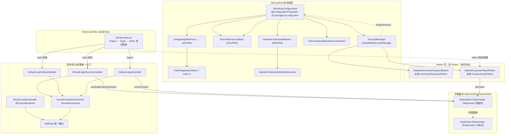

# i2f-springboot-shiro-starter

> Apache Shiro 无状态 token 认证/授权的 Spring Boot 自动装配 Starter：`ShiroAutoConfiguration`（`@Configuration` + `@ConfigurationProperties("i2f.springboot.config.shiro")`）装配 `SecurityManager`/`SubjectFactory`/`HashedCredentialsMatcher`/`ShiroFilterFactoryBean`/`DelegatingFilterProxy` 全套 Shiro 组件，`ShiroCoreFilter`（`OncePerRequestFilter`）拦截 `/login`（JSON/表单双方式登录）、`/logout`（登出）并对带 token 的请求做 `CustomerAuthToken` 自动登录与续期；`AbstractShiroTokenHolder`（进程内 `DefaultShiroTokenHolder` 基于 `MapCache` / 可选 `RedisShiroTokenHolder` 基于 `RedisCache`）以 UUID token 缓存 `IShiroUser` 并支持单点登录互踢，`DefaultLoginSuccessHandler`/`FailureHandler`/`LogoutHandler` 经 `ServletContextUtil.forward` 统一 `ApiResp` 输出，`ShiroExceptionHandler`（`@ControllerAdvice`）兜底 Shiro 异常。整体由 `i2f.springboot.config.shiro.enable`（默认 true）控制。shiro-spring 为 provided+optional，实现依赖多个 i2f 内部模块。

## 模块路径

- `i2f-springboot/i2f-springboot-shiro-starter`

## 模块依赖

| groupId | artifactId | scope | optional | 说明 |
|---------|-----------|-------|----------|------|
| i2f.turbo | i2f-resp | compile | 否 | 内部依赖，提供统一响应封装 `ApiResp` |
| i2f.turbo | i2f-reflect | compile | 否 | 内部依赖，`ReflectResolver` 反射加载动态注册的自定义 Filter |
| i2f.turbo | i2f-cache | compile | 否 | 内部依赖，提供 `IExpireCache`、`MapCache`、`ObjectExpireCacheWrapper`（默认令牌缓存底座） |
| i2f.turbo | i2f-authentication | compile | 否 | 内部依赖，提供 `IRbacAuthUser`/`BasicRbacAuthUser` 用户模型、`LoginPasswordDecoder` 密码解码扩展点 |
| i2f.turbo | i2f-jdk-ext-web | compile | 否 | 内部依赖，提供 `ServletContextUtil`（取 token、forward 到 `/forward/response`） |
| i2f.turbo | i2f-spring-core | compile | 否 | 内部依赖，`EnvironmentUtil` 按前缀读取 `filters.*` 动态映射 |
| i2f.turbo | i2f-extension-redis-cache | compile | 否 | 内部依赖，`RedisCache`（`RedisShiroTokenHolder` 的分布式令牌缓存底座） |
| i2f.turbo | i2f-spring-redis | compile | 否 | 内部依赖，本模块源码未直接引用，疑为 `RedisCache` Bean 提供的装配传递 |
| i2f.turbo | i2f-spring-authentication | compile | 否 | 内部依赖，`spring.factories` 跨模块登记其 `SecurityForwardController`（`/forward/response` 出口） |
| org.projectlombok | lombok | compile | 否 | POJO 与日志代码生成 |
| org.apache.shiro | shiro-spring (1.8.0) | provided | 是 | Shiro 核心与 Spring 集成，注释明确"已有 shiro-starter 但这里不用"，手工装配 |
| org.springframework.boot | spring-boot-starter / configuration-processor / starter-web | provided | 是 | Boot 基础装配、配置元数据、Web 容器 |

## 模块设计

### 装配与请求处理链路



### 设计要点

- **手工装配 Shiro 而非用官方 shiro-starter**：pom 注释「已经有 shiro-starter，但是这里不用」，全部组件由 `ShiroAutoConfiguration` 的 `@Bean` 方法逐个构建，`@Configuration`（CGLib 增强）保证 `securityManager()`/`matcher()` 等在类内多次互调仍为单例。
- **多 Realm 优先级编排**：`securityManager()` 先把可选的 `CustomerTokenRealm`（若存在）加入 realms，再加入必选的 `UsernamePasswordRealm`，令自定义令牌 Realm 优先匹配。
- **无状态 Session 控制**：`SessionControlWebSubjectFactory` + `DefaultSessionStorageEvaluator.setSessionStorageEnabled(enableSession)`（默认 false）实现 stateless；仅靠 token 缓存维持登录态。
- **可插拔 handler / realm / 密码解码器**：登录成功/失败/登出、两类 Realm、令牌持有者均以接口 + `@ConditionalOnMissingBean` 默认实现暴露，使用方可覆盖；`LoginPasswordDecoder`（`@Autowired(required=false)`）支持前端加密登录。
- **动态 Filter 注册**：`getFilters()` 通过 `EnvironmentUtil` 读取 `i2f.springboot.config.shiro.filters.*` 前缀配置，`ReflectResolver` 反射实例化额外 Shiro 过滤器并加入全局链。
- **令牌缓存抽象**：`AbstractShiroTokenHolder` 以 `IExpireCache` 统一 token↔user 与 username↔token 双映射，`setSingleToken` 实现单点登录互踢。

## 模块目的

为基于 Apache Shiro 的应用提供开箱即用的无状态 token 认证/授权自动装配：免去手写 Shiro 配置，直接获得"用户名密码登录 → 签发 UUID token → 后续请求带 token 自动认证 → 登出吊销"的完整闭环，并支持单点登录互踢、Redis 分布式令牌、密码解码器与自定义 Realm/handler 扩展点。

## 模块功能

| 功能 | 触发/条件 | 承载类 |
|------|-----------|--------|
| 总开关 | `i2f.springboot.config.shiro.enable`（默认 true） | `ShiroAutoConfiguration` `@ConditionalOnExpression` |
| SecurityManager 装配 | enable=true | `ShiroAutoConfiguration#securityManager` |
| 无状态 Session 控制 | `enable-session`（默认 false） | `SessionControlWebSubjectFactory` |
| 密码匹配器 | `matcher-algo-name`(MD5)/`matcher-iterations`(256) | `HashedCredentialsMatcher` / `matcher()` |
| 密码生成器 | enable=true | `HashedCredentialsMatcherEncoder` |
| 注解授权 Advisor | enable=true | `AuthorizationAttributeSourceAdvisor` |
| 登录/登出/鉴权过滤器链 | enable=true | `ShiroCoreFilter` + `ShiroFilterFactoryBean` |
| 白名单 | 内置 logout/login/unauth + `static-resource-white-list`/`customer-white-list` | `shiroFilter()` 拼接 filterChainDefinitions |
| 动态自定义 Filter | `i2f.springboot.config.shiro.filters.*` | `getFilters()` + `ReflectResolver` |
| 用户名密码 Realm | 无自定义 `UsernamePasswordRealm` 时 | `DefaultUsernamePasswordRealm`（`default.users`，默认 `admin/admin=ROLE_admin`） |
| 自定义令牌 Realm | 无自定义 `CustomerTokenRealm` 时 | `DefaultCustomerTokenRealm` |
| 令牌缓存 | 无 `AbstractShiroTokenHolder` Bean 时 | `DefaultShiroTokenHolder`（进程内 MapCache，30min） |
| Redis 分布式令牌 | 存在 `RedisCache` Bean 且手动注册 | `RedisShiroTokenHolder`（未 `@Component`/未登记，需使用方自建 Bean） |
| 单点登录互踢 | `enable-single-login`（默认 true） | `DefaultLoginSuccessHandler` + `setSingleToken` |
| 登录成功/失败/登出响应 | 无对应 handler Bean 时 | `Default*Handler` → forward `ApiResp` |
| Shiro 异常兜底 | `enable-exception-handler`（默认 true） | `ShiroExceptionHandler` `@ControllerAdvice` |
| 密码解码扩展 | 存在 `LoginPasswordDecoder` Bean | `ShiroCoreFilter#passwordDecoder` |

## 模块主要使用方法

### 引入与基本配置

```yaml
i2f:
  springboot:
    config:
      shiro:
        enable: true
        login-url: /login
        logout-url: /logout
        unauthorized-url: /unauth
        token-name: token
        enable-single-login: true
        enable-session: false
        matcher-algo-name: MD5
        matcher-iterations: 256
        static-resource-white-list: "/static/**,/favicon.ico"
        customer-white-list: "/public/**"
        # 默认内存用户（仅演示/开发）：username/password=ROLE_xxx,perm，分号分隔多用户
        default:
          users: "admin/admin=ROLE_admin"
        # 动态注册额外 Shiro Filter
        filters:
          myFilter: com.example.MyShiroFilter
```

### 实现自定义用户名密码 Realm（对接数据库）

```java
@Component
public class DbUsernamePasswordRealm extends UsernamePasswordRealm {
    @Override
    protected IShiroUser getShiroUser(String username) {
        // 从 DB 加载用户，返回实现了 IShiroUser（含 getSalt/getRoles/getPermissions）的对象
        return userMapper.loadShiroUser(username);
    }
}
// 注册后 DefaultUsernamePasswordRealm 因 @ConditionalOnMissingBean(UsernamePasswordRealm.class) 自动退让
```

### 使用 Redis 分布式令牌缓存

```java
// RedisShiroTokenHolder 未标注 @Component 且未进 spring.factories，需显式注册：
@Bean
public AbstractShiroTokenHolder redisShiroTokenHolder(RedisCache redisCache) {
    RedisShiroTokenHolder holder = new RedisShiroTokenHolder();
    holder.setRedisCache(redisCache);
    return holder;
}
// 注册后 DefaultShiroTokenHolder 因 @ConditionalOnMissingBean(AbstractShiroTokenHolder.class) 退让
```

## 配置项参考

| 配置项 | 类型 | 默认值 | 说明 |
|--------|------|--------|------|
| `i2f.springboot.config.shiro.enable` | Boolean | true | 总开关，控制整个 Shiro 自动装配 |
| `i2f.springboot.config.shiro.enable-exception-handler` | Boolean | true | `ShiroExceptionHandler` 开关 |
| `i2f.springboot.config.shiro.login-url` | String | `/login` | 登录入口路径（anon 白名单，过滤器特殊处理） |
| `i2f.springboot.config.shiro.logout-url` | String | `/logout` | 登出入口路径（logout 链） |
| `i2f.springboot.config.shiro.unauthorized-url` | String | `/unauth` | 无权限跳转路径（anon 白名单） |
| `i2f.springboot.config.shiro.token-name` | String | `token` | 令牌参数/头名称 |
| `i2f.springboot.config.shiro.username-parameter` | String | `username` | 登录用户名字段名 |
| `i2f.springboot.config.shiro.password-parameter` | String | `password` | 登录密码字段名 |
| `i2f.springboot.config.shiro.enable-single-login` | Boolean | true | 单点登录互踢开关 |
| `i2f.springboot.config.shiro.enable-session` | Boolean | false | 是否启用 Shiro Session（默认无状态） |
| `i2f.springboot.config.shiro.matcher-algo-name` | String | `MD5` | 密码哈希算法名 |
| `i2f.springboot.config.shiro.matcher-iterations` | int | 256 | 密码哈希迭代次数 |
| `i2f.springboot.config.shiro.static-resource-white-list` | String | 无 | 逗号分隔静态资源 anon 白名单 |
| `i2f.springboot.config.shiro.customer-white-list` | String | 无 | 逗号分隔自定义 anon 白名单 |
| `i2f.springboot.config.shiro.default.users` | String | `admin/admin=ROLE_admin` | `DefaultUsernamePasswordRealm` 内存用户 |
| `i2f.springboot.config.shiro.filters.*` | Map | 无 | 名称→Filter 全类名的动态过滤器注册 |

> 注：`additional-spring-configuration-metadata.json` 仅登记了 `enable` 一项，其余字段与 `default.users`、`filters.*` 均未登记；hints 为 JSP/Tomcat 模板残留。

## 模块特性总结

- 手写全套 Shiro 装配，不依赖官方 shiro-starter，组件构建完全可控。
- 无状态 token 认证闭环：登录签发 UUID token、请求带 token 自动认证并续期、登出吊销。
- 进程内 `MapCache` 与 Redis 双令牌缓存抽象（`AbstractShiroTokenHolder`），支持单点登录互踢。
- 多 Realm 优先级编排 + JSON/表单双方式登录 + 可选密码解码器（前端加密）。
- 成功/失败/登出/Realm/令牌持有者均以 `@ConditionalOnMissingBean` 默认实现暴露，可插拔覆盖。
- 通过 `filters.*` 前缀 + 反射动态注册额外 Shiro 过滤器。
- 默认无状态（`enable-session=false`），配 `@ControllerAdvice` 统一 `ApiResp` 异常出口。

## 模块瑕疵或错误

> 以下为静态阅读源码识别的潜在问题，仅作标注，未做运行时实证。

1. **`RedisShiroTokenHolder` 实为死代码**：既无 `@Component`/`@Configuration`，也未登记进 `spring.factories`/`imports`，其上的 `@ConditionalOnBean(RedisCache.class)` 对未注册类完全无效；而 `DefaultShiroTokenHolder` 的 `@ConditionalOnMissingBean(AbstractShiroTokenHolder.class)` 几乎总是先命中，Redis 分布式令牌须使用方手动注册 Bean 才生效（见使用方法），开箱即用场景下形同虚设。
2. **注解式授权可能静默不生效**：装配了 `AuthorizationAttributeSourceAdvisor`，但未注册 `DefaultAdvisorAutoProxyCreator`/`LifecycleBeanPostProcessor`，`@RequiresRoles`/`@RequiresPermissions` 等方法注解在缺少自动代理创建器时不会被拦截。
3. **缺 `@ConditionalOnClass` 类存在保护**：shiro-spring 为 provided+optional，自动配置仅靠 `@ConditionalOnExpression` 而无 `@ConditionalOnClass(ShiroFilterFactoryBean.class)`，未引入 Shiro 时可能硬失败。
4. **默认弱口令 + 可预测盐**：`DefaultUsernamePasswordRealm` 内置 `admin/admin`，且 `setSalt(username)` 用用户名作盐（可预测）；该 Realm 同时是 `@Configuration` 又登记进 `spring.factories`（双重身份）。
5. **JSON 登录分支吞异常 + 绕过日志**：`ShiroCoreFilter#attemptAuthentication` 解析 JSON 失败时 `e.printStackTrace()` + `System.out.println`，随后 `username/password` 取 `String.valueOf(json.get(...))` 可能变成字符串 `"null"` 仍继续走登录。
6. **常量名拼写错误**：`SHIRO_CORE_FILTER_NAME = "shiroCoreFiler"`（`Filer` 应为 `Filter`），虽内部一致但作为过滤器注册名易误导。
7. **`removeSingleToken` 语义不对称**：取出映射中的 `oldToken` 却调用 `removeToken(token)` 删除入参 token 而非 `oldToken`，且本模块内无任何调用点（近似闲置）。
8. **跨模块自动登记**：`spring.factories` 直接登记了另一模块 `i2f-spring-authentication` 的 `i2f.spring.authentication.forward.SecurityForwardController`，与本工程 security-starter 中登记的错误包路径形成对照（此处包路径正确、依赖已声明，但自动配置注册他模块组件属耦合）。
9. **`i2f-spring-redis` 依赖未直接引用**：源码仅用到 `i2f-extension-redis-cache` 的 `RedisCache`，`i2f-spring-redis` 无直接引用，疑为纯传递装配。
10. **配置类滥用 Lombok**：`ShiroAutoConfiguration` 标 `@Data`/`@NoArgsConstructor` 会为注入字段生成 setter；多个 Realm/Handler 同样 `@Data`。
11. **`IHttpRequestHandler` 接口未被任何类实现/引用**（死代码）；`CustomerAuthToken#getPrincipal/getCredentials` 返回 null，依赖 `CustomerTokenRealm` 覆写 `assertCredentialsMatch` 规避。
12. **元数据登记不全 + 残留**：仅 `enable` 登记，`filters.*`/`default.users` 等动态项与其余字段缺失，hints 为 JSP/Tomcat 模板复制。
