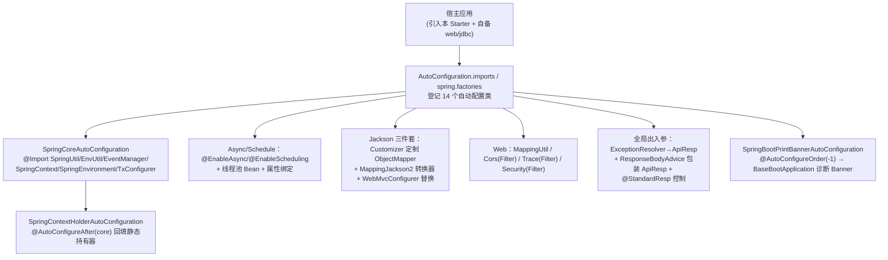
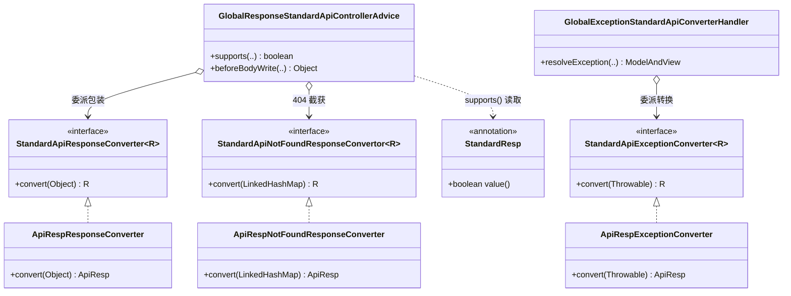

# i2f-springboot-spring-starter

> Spring 基础 Starter —— i2f-springboot 组的地基装配件，用 14 个自动配置类把 `i2f-spring-core`/`i2f-spring-web`/`i2f-resp`/`i2f-extension-jackson`/`i2f-jdk-ext-web` 的能力一次性接入 Spring Boot 应用：以 `@Import` 注册 `SpringUtil`/`EnvironmentUtil`/`EventManager`/`SpringContext`/`SpringEnvironment`/`TransactionUtil` 等 i2f 契约 Bean 并回填 `SpringContextHolder` 静态持有器；自动装配异步/调度线程池、CORS 过滤器、全局异常→`ApiResp` 转换、全局响应体 `ApiResp` 包装（含 404 截获）、Jackson「Long→String + 日期时间格式化」消息转换器、链路 `TraceFilter` 与 Web 安全 `SecurityFilter`；并附带 `BaseBootApplication`/`WarBootApplication` 统一启动入口与一段富诊断 Banner。全部能力各由独立 `@ConditionalOnExpression("${...:true}")` 开关控制，默认开箱即用。

## 模块路径

- `i2f-springboot/i2f-springboot-spring-starter`

## 模块依赖

| GroupId | ArtifactId | Scope | Optional | 说明 |
|---------|------------|-------|----------|------|
| org.projectlombok | lombok | compile | false | `@Data`/`@Slf4j`/`@NoArgsConstructor` 编译期代码生成（各配置类与 Handler/Advice） |
| org.springframework.boot | spring-boot-starter | provided | true | `@ConditionalOnExpression`/`@ConditionalOnClass`/`@ConditionalOnBean`、`@ConfigurationProperties`、`FilterRegistrationBean` 基础 |
| org.springframework.boot | spring-boot-configuration-processor | provided | true | 编译期生成 `spring-configuration-metadata.json`（本模块另有 `additional-*-metadata.json` 手工登记 `i2f.spring.*`） |
| org.springframework.boot | spring-boot-starter-web | provided | true | `CorsFilter`/`WebMvcConfigurer`/`ResponseBodyAdvice`/`HandlerExceptionResolver`/`RequestMappingHandlerMapping` 及 `javax.servlet` API；不传递，宿主须自备 |
| org.springframework.boot | spring-boot-starter-jdbc | provided | true | `PlatformTransactionManager`（供 `SpringTransactionUtilConfigurer` 探测装配 `TransactionUtil`） |
| i2f.turbo | i2f-resp | compile | false | 统一响应契约 `ApiResp`/`ApiCode`，是全局响应包装/异常转换/404 转换的默认载体 |
| i2f.turbo | i2f-jvm | compile | false | `JvmUtil`：Banner 采集 PID/启动用户/debug/agent/verify/MBean 等 JVM 运行时信息 |
| i2f.turbo | i2f-network | compile | false | `NetworkUtil`：Banner 打印首选出口 IP 与全部可用网卡地址（ipv4/ipv6） |
| i2f.turbo | i2f-spring-core | compile | false | 被 `@Import` 的核心契约 Bean：`SpringUtil`/`EnvironmentUtil`/`EventManager`/`SpringContext`/`SpringEnvironment`/`TransactionUtil` |
| i2f.turbo | i2f-spring-web | compile | false | 提供 `MappingUtil`（`SpringWebAutoConfiguration` 装配）；并传递引入 `i2f-jdk-ext-web`（`SecurityFilter`/`TraceFilter`） |
| i2f.turbo | i2f-extension-jackson | compile | false | Jackson 日期序列化/反序列化器、`JacksonLong2StringSerializer`、`JacksonJsonSerializer` |
| i2f.turbo | i2f-extension-slf4j | compile | false | `Slf4jPrintStream.redirectSysoutSyserr()`：启动期把 `System.out/err` 收编进 SLF4J |

- 本模块是 `i2f-springboot` 组**依赖内部能力最多**的地基件之一：`compile` 直接引入 `i2f-resp`/`i2f-jvm`/`i2f-network`/`i2f-spring-core`/`i2f-spring-web`/`i2f-extension-jackson`/`i2f-extension-slf4j` 共 7 个内部模块，会随本 Starter 门面传递给所有下游 Starter。
- Web/JDBC/Boot 侧能力全部 `provided + optional`：编译期需要 servlet/MVC/JDBC 类型，运行期由宿主的 `spring-boot-starter-web`/`-jdbc` 提供；纯非 Web 应用引入仅命中 `SpringCoreAutoConfiguration` 等非 Web 分支。
- `SecurityFilterAutoConfiguration`/`SpringTraceFilter` 实际引用 `i2f.web.filter.*`（属 `i2f-jdk-ext-web`），但 `i2f-jdk-ext-web` **未在本 pom 直接声明**，仅经 `i2f-spring-web` 传递而来（见瑕疵 11）。

## 模块设计

核心是「一份 `spring.factories` / `AutoConfiguration.imports` 双通道登记 + 14 个各自带开关的自动配置类」，按职责切分为 core / web / 线程池（async+schedule）/ CORS / Jackson / 异常 / 响应 / trace / security / banner 十个横切族，另附两个非自动配置的启动入口类。



自动装配登记采用「双份登记」，14 个类同时写入两处：

- `META-INF/spring/org.springframework.boot.autoconfigure.AutoConfiguration.imports`（Boot 2.7+/3.x 通道）
- `META-INF/spring.factories` 的 `EnableAutoConfiguration=`（Boot 2.x legacy 通道）

登记的 14 个自动配置类（`i2f.springboot.spring.*`）：`SpringCoreAutoConfiguration`、`SpringContextHolderAutoConfiguration`、`SpringWebAutoConfiguration`、`SpringAsyncAutoConfiguration`、`SpringCorsAutoConfiguration`、`SpringScheduleAutoConfiguration`、`SpringObjectMapperCustomizerConfiguration`、`SpringJacksonMvcConfigurer`、`SpringJacksonMessageConverter`、`SpringBootPrintBannerAutoConfiguration`、`SpringExceptionAutoConfiguration`、`SpringResponseAutoConfiguration`、`SpringTraceAutoConfiguration`、`SecurityFilterAutoConfiguration`。

响应/异常包装族的依赖分层（谁在运行期被真正调用）：



三个 `StandardApi*Converter` 契约均带 `@ConditionalOnMissingBean`，宿主可注册自定义实现整体替换 `ApiResp` 载体为自有响应模型；`@StandardResp(false)` 可逐方法/逐类关闭响应包装。

## 模块目的

- 把 i2f 生态在 Spring Boot 应用中的「一次性接入」收敛为单个基础 Starter：一个依赖即获得 `SpringUtil`/`EnvironmentUtil`/`EventManager` 等容器/环境/事件门面、异步与调度线程池、CORS、全局统一响应体、全局异常转 `ApiResp`、Jackson 长整型/日期增强、链路追踪与安全过滤器矩阵。
- 承接 `i2f-spring`（能力层）到 `i2f-springboot`（装配层）的下沉定位：真正的容器适配、映射反查、Web/安全过滤器内核都在上游模块，本模块仅做「属性绑定 + 条件装配 + 静态持有器回填」的胶水。
- 提供统一启动入口 `BaseBootApplication`/`WarBootApplication` 与 `SpringBootPrintBannerAutoConfiguration`，在应用启动时打印含 JVM/MBean/SPI（JDBC/JCE/IO Provider）/网络地址/内存画像的诊断 Banner，并把 `System.out/err` 重定向到 SLF4J。
- 提供全维度开关（`i2f.spring.core/web/async/cors/schedule/jackson/exception/response/trace/print-banner.enable` 与 `i2f.security.filter.enable`），默认全开、按需关闭，使本地基件可与其它专项 Starter 共存。

## 模块功能

- **核心装配（`SpringCoreAutoConfiguration`）**：`@Import` 六个 i2f 契约 Bean（`SpringUtil`/`EnvironmentUtil`/`EventManager`/`SpringEnvironment`/`SpringContext`/`SpringTransactionUtilConfigurer`），`@ConditionalOnExpression("${i2f.spring.core.enable:true}")` 开关；`SpringTransactionUtilConfigurer` 再在 `PlatformTransactionManager` 存在时产出 `TransactionUtil`。
- **静态持有器回填（`SpringContextHolderAutoConfiguration` + `SpringContextHolder`）**：`@AutoConfigureAfter(core)` + `@ConditionalOnBean(core)`，`afterPropertiesSet()` 把 `SpringUtil`/`EnvironmentUtil`/`EventManager` 写入 `SpringContextHolder` 静态字段，`SpringContextHolder` 用三把 `CountDownLatch` 保证「未初始化前 `getXxx()` 阻塞等待」而非返回 null。
- **异步/调度线程池（`SpringAsyncAutoConfiguration`/`SpringScheduleAutoConfiguration`）**：`@EnableAsync`/`@EnableScheduling` + `@ConfigurationProperties`，分别产出 `ThreadPoolTaskExecutor`（`executorPool`）与 `ThreadPoolTaskScheduler`（`schedulerPool`，`destroyMethod=shutdown`），支持核心/最大/队列/前缀/存活/拒绝策略等参数，并实现 `AsyncConfigurer`/`SchedulingConfigurer` 接入注解执行。
- **CORS（`SpringCorsAutoConfiguration` + `OriginPattenCorsConfiguration`）**：`@ConditionalOnClass(CorsFilter)` 下产出 `CorsFilter`（`@Order(1)`），把逗号/分号分隔的 origins/methods/headers 拆分绑定；`OriginPattenCorsConfiguration` 覆写 `checkOrigin`，用 `AntPathMatcher("|")` 对含通配的 origin 做模式匹配。
- **Jackson 定制（`SpringObjectMapperCustomizerConfiguration` + `SpringJackson*`）**：`Jackson2ObjectMapperBuilderCustomizer` 按开关把 `Long/long` 序列化为 String（全局 `ToStringSerializer` 或 `JacksonLong2StringSerializer` 两模式）、注册 `Date`/`LocalDateTime`/`LocalDate`/`LocalTime` 序列化/反序列化器；`SpringJacksonMessageConverter` 产出挂了定制 `ObjectMapper` 的 `MappingJackson2HttpMessageConverter` 与 `JacksonJsonSerializer`；`SpringJacksonMvcConfigurer`→`SpringMvcJacksonConverterConfigurer` 在 `extendMessageConverters` 中移除所有 Jackson 转换器并替换为自定义者。
- **全局异常转标准响应（`SpringExceptionAutoConfiguration`）**：产出 `StandardApiExceptionConverter`（默认 `ApiRespExceptionConverter`，按异常类型映射 `ApiResp.error`）、`GlobalExceptionPrintHandler`（打印未解析异常栈）、`GlobalExceptionStandardApiConverterHandler`（把异常写成 `ApiResp` JSON，HTTP 状态默认 200）。
- **全局响应体包装（`SpringResponseAutoConfiguration` + `GlobalResponseStandardApiControllerAdvice`）**：`ResponseBodyAdvice` 对非 `ApiResp` 返回值统一包 `ApiResp.success`，截获 `status==404` 的 `LinkedHashMap` 转 `ApiResp.error(NOT_FOUND)`，对 String 返回型额外用 `ObjectMapper` 手工序列化并打 `SECURE_RETURN_STRING` 头；`@StandardResp(false)` 可关闭；配套 `ApiRespResponseConverter`/`ApiRespNotFoundResponseConverter`。
- **链路追踪过滤器（`SpringTraceAutoConfiguration` + `SpringTraceFilter`）**：注册 `FilterRegistrationBean<SpringTraceFilter>`（`order=1`、`/*`），`SpringTraceFilter` 继承 `i2f-jdk-ext-web` 的 `TraceFilter`，在 `onBefore/onAfter` 间把 traceId/source 写入/清除 SLF4J `MDC`。
- **Web 安全过滤器（`SecurityFilterAutoConfiguration`）**：`@ConditionalOnExpression("${i2f.security.filter.enable:true}")` 下产出 `FilterRegistrationBean<SecurityFilter>`（默认 `order=-1`、`/*`），以约 80 个可配字段驱动上游 `i2f-jdk-ext-web` 的 `SecurityFilter`，并用 `mixed`/`mixedPattern`/`mixedMultiValuesMap` 三个工具方法实现「清空 / 追加 / 移除」三段式列表与正则、Map 型规则定制（防注入/防 XSS/防 XXE/防反序列化/非法文件与命令/来源与 Referer/IP 白名单等）。
- **启动入口与 Banner（`BaseBootApplication`/`WarBootApplication`/`SpringBootPrintBannerAutoConfiguration`）**：`BaseBootApplication.startup()` 重定向 stdout/stderr、`SpringApplicationBuilder` 启动并挂 `ApplicationStartedEvent` 监听器打印诊断 Banner；`WarBootApplication` 继承 `SpringBootServletInitializer` 供 war 部署；`SpringBootPrintBannerAutoConfiguration`（`@AutoConfigureOrder(-1)`）在自动装配路径上注册同一监听器。

## 模块主要使用方法

1. 引入依赖（宿主须自备 Web/JDBC，因 Boot starter 均 `provided + optional`）：

```xml
<dependency>
    <groupId>i2f.turbo</groupId>
    <artifactId>i2f-springboot-spring-starter</artifactId>
    <version>1.0-jdk8</version>
</dependency>
```

2. 直接获得开箱即用的横切能力：Controller 返回值被自动包成 `ApiResp`，抛异常被转成 `ApiResp.error`，`Long` 精度丢失问题（前端 JS）被 Jackson `Long→String` 化解，CORS/异步/调度/链路/安全过滤器全部默认开启。无需任何配置。

3.（可选）关闭某个能力族或调整参数：

```yaml
i2f:
  spring:
    core:
      enable: true
    cors:
      allow-origins: "http://*.foo.com"   # 支持通配，由 OriginPattenCorsConfiguration 匹配
      allow-credentials: true
    jackson:
      enable-long-to-string: true
      local-date-format: "yyyy-MM-dd"     # 不配则不定制 LocalDate（见瑕疵 6）
    async:
      core-pool-size: 10
      max-pool-size: 100
      reject-execution-handler: CallerRunsPolicy   # 注意：此值实际映射到 DiscardOldestPolicy（见瑕疵 3）
  security:
    filter:
      enable: true          # 命名空间与上面 i2f.spring.* 不一致（见瑕疵 7）
```

4.（可选）以统一启动入口拉起应用并打印诊断 Banner：

```java
public class App {
    public static void main(String[] args) {
        // 注意：BaseBootApplication.startup 当前对任意非 null webType 都强制 NONE（见瑕疵 1）
        BaseBootApplication.startup(WebApplicationType.SERVLET, App.class, args);
    }
}
```

5.（可选）关闭某接口/控制器的统一包装：在方法或类上标注 `@StandardResp(false)`；自定义响应载体：注册自己的 `StandardApiResponseConverter`/`StandardApiExceptionConverter`/`StandardApiNotFoundResponseConvertor` Bean 覆盖默认 `ApiResp` 实现。

## 模块特性总结

- `i2f-springboot` 组的「地基装配件」：一次性把容器/环境/事件门面 + Web 全局出入参 + 线程池 + Jackson + CORS + trace + 安全过滤器全部接入，是多数业务应用的默认第一依赖。
- 十个能力族各自独立 `@ConditionalOnExpression`/`@ConditionalOnClass` 开关，默认全开、可分族关闭，与其它专项 Starter 正交共存。
- 全局响应/异常/404 三处均经 `StandardApi*Converter` 契约 + `@ConditionalOnMissingBean` 抽象，默认落地 `ApiResp`，可整体替换为自有响应模型；`@StandardResp` 提供逐点开关。
- `SpringContextHolder` 以三把 `CountDownLatch` 实现「持有器未就绪即阻塞等待」的静态访问约定，配合 `@AutoConfigureAfter` 保证装配时序。
- `SecurityFilterAutoConfiguration` 以约 80 个属性 + `mixed/clear/additional/remove` 三段式定制，把上游安全过滤器的规则集完全外置为可配置。
- 启动诊断 Banner 覆盖 PID/启动用户/Spring 版本/启动耗时/debug/agent/网卡 IP/JVM MBean（类加载/编译/线程/GC）/JDBC·JCE·IO SPI/内存画像等，`Slf4jPrintStream` 收编 `System.out/err`。
- 双通道自动装配登记（`imports` + `spring.factories`），兼顾 Boot 2.x 与 2.7+；`maven-assembly-plugin` 覆盖 `addMavenDescriptor=true` 产 fat-jar 随 bash 四目录分发。

## 模块瑕疵或错误

1. **【高危·逻辑反转】`BaseBootApplication.startup` 强制禁用 Web**：`if (webType != null) { builder.web(WebApplicationType.NONE); }`——只要传入非 null 的 `webType` 就恒设为 `NONE`，即传 `SERVLET`/`REACTIVE` 反而关闭 Web，与参数语义完全相反；应写 `builder.web(webType)`。文档「使用方法 4」示例即会静默产出无 Web 的应用。
2. **【配置键错位】元数据 `...enable.enable` 与实际开关不符**：`additional-spring-configuration-metadata.json` 登记为 `i2f.spring.response.enable.enable`、`i2f.spring.trace.enable.enable`（重复 `enable`），而代码实际开关/前缀是 `@ConditionalOnExpression("${i2f.spring.response.enable:true}")`、`${i2f.spring.trace.enable:true}`。IDE 会补全出一个**永远不生效**的键，真正要关的键反而无提示。
3. **【拒绝策略映射错误】**：`SpringAsyncAutoConfiguration.executorPool()` 与 `SpringScheduleAutoConfiguration.schedulerPool()` 中，`"CallerRunsPolicy".equals(rejectExecutionHandler)` 分支实际 `new ThreadPoolExecutor.DiscardOldestPolicy()`（复制粘贴），配置 `CallerRunsPolicy` 会得到「丢弃最老任务」这一完全不同且会丢任务的语义；而元数据又给 `i2f.spring.async.reject-execution-handler` 标了 `defaultValue: true`（类型 String 却给布尔默认，见瑕疵 5）。
4. **【lite 模式双线程池 / 生命周期失效】**：`SpringAsyncAutoConfiguration`/`SpringScheduleAutoConfiguration` 均无 `@Configuration`，以 lite 模式处理 `@Bean`，跨方法调用不被代理。`getAsyncExecutor()` 直接 `return executorPool()`、`configureTasks()` 直接 `registrar.setTaskScheduler(schedulerPool())`——都会**再 new 一个池**而非取 `@Bean` 单例：于是存在「Spring 管理的池」与「注解执行实际用的池」两份，后者不受 `destroyMethod=shutdown` 管理、`ThreadPoolTaskScheduler` 也未走容器初始化回调，属重复资源 + 生命周期泄漏。
5. **【元数据默认值类型错误】**：`i2f.spring.async.reject-execution-handler` 声明 `type: java.lang.String`、代码默认 `"AbortPolicy"`，但元数据 `defaultValue` 写成 `true`。
6. **【元数据与字段默认不符 + 漏登记】**：`SpringObjectMapperCustomizerConfiguration` 的 `localDateFormat`/`localTimeFormat` 字段默认为 `null`（不配即不定制 LocalDate/LocalTime），而元数据却标默认 `"yyyy-MM-dd"`/`"HH:mm:ss"`；`enable-global-long2-string`、CORS 的 `exposedHeaders` 等实际可绑定字段未登记进元数据。
7. **【安全过滤器零元数据 + 命名空间割裂】**：`SecurityFilterAutoConfiguration` 用前缀 `i2f.security.filter`（与全模块 `i2f.spring.*` 风格不一致），其 `url-patten`/`order`/约 80 个 clear/additional/remove 及各类开关**无一登记**进 `additional-spring-configuration-metadata.json`，连总开关 `i2f.security.filter.enable` 也无 IDE 支持。
8. **【`@Data` 滥用于一堆自动配置/`@ConfigurationProperties` 类】**：`SpringAsyncAutoConfiguration`、`SpringCorsAutoConfiguration`、`SpringScheduleAutoConfiguration`、`SpringObjectMapperCustomizerConfiguration`、`SpringExceptionAutoConfiguration`、`SpringTransactionUtilConfigurer`、`SpringJacksonMessageConverter`、`SpringJacksonMvcConfigurer`、`SecurityFilterAutoConfiguration` 等均 `@Data`，为配置/装配 Bean 生成 `equals`/`hashCode`/`toString`/setter 属噪声且破坏封装；且多数类**缺 `@Configuration`**（同瑕疵 4 根因），依赖 lite 模式生效，语义脆弱。
9. **【`@ConditionalOnClass` 类级 + 方法级重复冗余】**：`SpringWebAutoConfiguration`、`SpringCorsAutoConfiguration`、`SpringJacksonMessageConverter`、`SpringTransactionUtilConfigurer` 等在类和方法上写了两遍相同 `@ConditionalOnClass`，方法级那枚完全冗余。
10. **【异常解析器无显式排序 + 无用的构造依赖】**：`SpringExceptionAutoConfiguration` 同时产出 `GlobalExceptionPrintHandler` 与 `GlobalExceptionStandardApiConverterHandler` 两个 `HandlerExceptionResolver`，但都未标 `@Order`，二者先后依赖 Spring 默认顺序，「先打印再写响应」并非强约束；`globalExceptionPrintHandler(StandardApiExceptionConverter)` 形参接收却从不使用，白白把打印 Handler 耦合到转换器上。
11. **【未直声明的传递依赖】**：`SecurityFilterAutoConfiguration`（`i2f.web.filter.SecurityFilter`）与 `SpringTraceFilter`（`i2f.web.filter.TraceFilter`）编译期依赖 `i2f-jdk-ext-web`，但本 pom 只声明了 `i2f-spring-web`，`SecurityFilter`/`TraceFilter` 靠其传递而来；一旦上游调整依赖即编译断裂，应显式声明。
12. **【`@ConfigurationProperties` 与 `@Value` 混用 + String 特判脆弱】**：`SpringObjectMapperCustomizerConfiguration` 一边 `@ConfigurationProperties("i2f.spring.jackson")` 绑定 `dateFormat`，一边又用 `@Value("${spring.jackson.date-format:...}")` 读 Boot 原生键，两套来源易混；默认 `yyyy-MM-dd HH:mm:ss SSS` 被同时当作 `SimpleDateFormat` 与 `DateTimeFormatter` 模式复用，`SSS` 在两种格式化器下语义不同（毫秒 vs 秒的小数部分）易生惊喜。`GlobalResponseStandardApiControllerAdvice` 对 String 返回型靠 `SECURE_RETURN_STRING` 响应头 + 手工 `writeValueAsString` 兜底，属与「字符串专用转换器」耦合的脆弱隐式约定（注释亦自认「后续用过滤器则不再需要」）。
13. **`BaseBootApplication` 全局可变静态态**：`webType`/`mainClass`/`mainArgs`/`RUN_BANNER`（`AtomicBoolean`，一旦置位从不复位）皆为 public static 可变字段，多上下文/重启/并发场景不安全；`SpringBootPrintBannerAutoConfiguration` 取 `Thread.currentThread().getStackTrace()` 最深帧反推主类，在自动装配时机大概率拿到的并非真实 main 类而回落 `UNKNOWN`。
14. **无测试、pom 缺 `<description>`**：模块无 `src/test`，14 个自动配置类与约 80 项安全过滤配置无任何覆盖；`pom.xml` 亦无 `<name>`/`<description>`；元数据 `hints` 段仍残留 `server.servlet.jsp.class-name`、`server.tomcat.accesslog.encoding` 等与本模块无关的模板复制条目。

## 生态位置

- **同组定位**：隶属 `i2f-springboot` 组，`i2f-springboot/pom.xml` `<modules>` 第 39 行登记；是组内被其它 Starter 广泛继承/依赖的**基础装配件**——`i2f-springboot-swl-starter`（pom 依赖）、以及 `test-swl-starter`、`test-gateway-swl` 等测试工程直接引入，多数专项 Starter 复用其 `SpringUtil`/统一响应/异常装配底座。
- **上游依赖**：能力来自 `i2f-spring`（`i2f-spring-core`/`i2f-spring-web`）、`i2f-jdk`（`i2f-resp`/`i2f-jvm`/`i2f-network`）、`i2f-extension`（`i2f-extension-jackson`/`i2f-extension-slf4j`），Web 安全/链路过滤器内核经 `i2f-spring-web` 传递自 `i2f-jdk-ext-web`（`SecurityFilter`/`TraceFilter`）。
- **构建登记**：根 `pom.xml` `dependencyManagement` 第 1457–1461 行以 `${i2f.version}` 登记版本。
- **配置键族**：`i2f.spring.{core,web,async,cors,schedule,jackson,exception,response,trace,print-banner}.enable` 与 `i2f.security.filter.enable`（末者命名空间异类）。
- **文档索引**：本 readme 对应 `menus.md`「## i2f-springboot」节的 `i2f-springboot-spring-starter` 条目（位于 `i2f-springboot-shiro-starter` 之后）。
