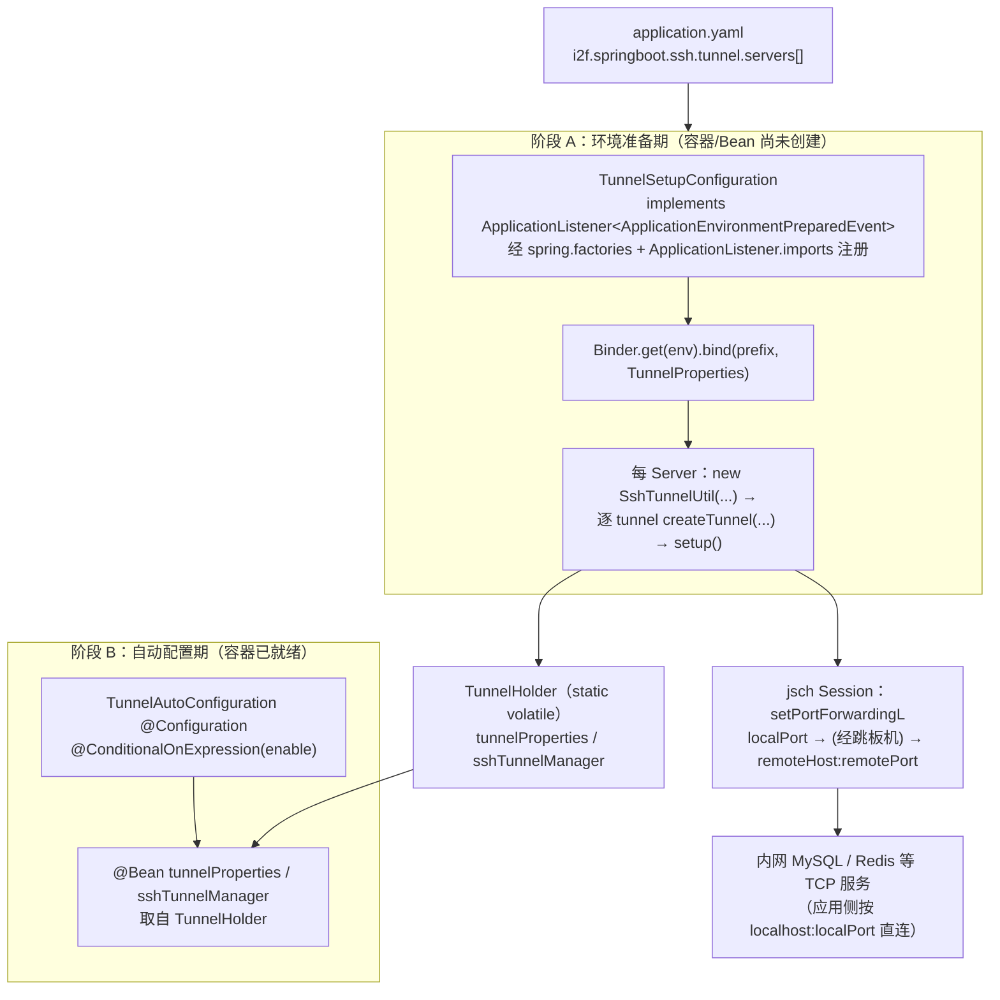

# i2f-springboot-ssh-tunnel-starter

> SSH 隧道自动建立 Starter —— 把 `i2f-extension-sftp` 的通用正向端口隧道工具 `SshTunnelUtil` 接入 Spring Boot 生命周期：在**环境准备期（`ApplicationEnvironmentPreparedEvent`）**用 `Binder` 绑定 `i2f.springboot.ssh.tunnel.*`，按配置的一台或多台跳板机为每条 `localPort → remoteHost:remotePort` 规则建立本地端口正向隧道，再在**自动配置期**把 `TunnelProperties`、`SshTunnelManager` 暴露为可注入 Bean。设计意图是「在数据源/Redis 等连接之前先把隧道打通」，让应用把内网数据库、缓存等 TCP 服务当作 `localhost` 直连。仅 5 个类、单依赖 `i2f-extension-sftp`，是组内最小的专项 Starter。

## 模块路径

- `i2f-springboot/i2f-springboot-ssh-tunnel-starter`

## 模块依赖

| GroupId | ArtifactId | Scope | Optional | 说明 |
|---------|------------|-------|----------|------|
| org.projectlombok | lombok | compile | false | `@Data`/`@Slf4j`/`@NoArgsConstructor` 编译期代码生成（配置类与属性 Bean） |
| org.springframework.boot | spring-boot-starter | provided | true | `ApplicationListener`/`ApplicationEnvironmentPreparedEvent`、`Binder`、`@Configuration`/`@Bean`、`@ConditionalOnExpression`、`@ConfigurationProperties` 基础；不传递，宿主须自备 |
| org.springframework.boot | spring-boot-configuration-processor | provided | true | 编译期扫描 `@ConfigurationProperties` 生成 `spring-configuration-metadata.json`（另有 `additional-*-metadata.json` 手工登记 `enable`） |
| i2f.turbo | i2f-extension-sftp | compile | false | 提供 `SshTunnelUtil`：`new SshTunnelUtil(host,port,user,pwd).createTunnel(local,remoteHost,remote).setup()`，内部用 jsch `setPortForwardingL` 做本地正向隧道 + daemon keepalive 线程 + shutdown hook 清理 |
| com.jcraft | jsch (`0.1.55`) | provided | false | `SshTunnelUtil` 编译期依赖 `com.jcraft.jsch.*`；本模块硬编码 `0.1.55` 且 `provided`，运行期须由宿主提供 jsch（见瑕疵 8） |

- 本模块是 `i2f-springboot` 组**依赖面最窄**的专项 Starter 之一：`compile` 侧只引入 `i2f-extension-sftp` 一个内部模块，Boot/jsch 全为 `provided`。
- `i2f-extension-sftp` 自身也以 `provided` 引入 jsch（不传递），叠加本 pom 的 `com.jcraft:jsch` `provided`，运行时 jsch 完全依赖宿主自备。

## 模块设计

核心是「一个环境准备期监听器建隧道 + 一个自动配置类暴露 Bean」的两阶段协作，中间靠静态 `TunnelHolder` 跨阶段传递（因隧道必须先于容器/数据源就绪，无法走常规 Bean 装配）。



装配登记采用双通道（与组内其它 Starter 一致），并额外登记一个 `ApplicationListener`：

- `META-INF/spring/org.springframework.boot.autoconfigure.AutoConfiguration.imports` → `TunnelAutoConfiguration`
- `META-INF/spring.factories` → `EnableAutoConfiguration=TunnelAutoConfiguration` 且 `ApplicationListener=TunnelSetupConfiguration`
- `META-INF/spring/org.springframework.context.ApplicationListener.imports` → `TunnelSetupConfiguration`

时序上，`ApplicationEnvironmentPreparedEvent` 在 `SpringApplication` 准备 `Environment` 后、创建 `ApplicationContext` 之前发出，`SpringApplication` 会反射实例化 `spring.factories`/`ApplicationListener.imports` 里登记的监听器——因此 `TunnelSetupConfiguration` 能在任何数据源 Bean 初始化前把隧道打通，正对应 `SshTunnelUtil` 类注释「隧道必须在自动配置/建立 DB 连接之前完成」的要求。

## 模块目的

- 让需要经 SSH 跳板机才能访问内网数据库/缓存的应用，无需在 `main()` 里手写建隧道代码：把隧道拓扑外置为 `i2f.springboot.ssh.tunnel.servers[].tunnels[]` 配置，Boot 启动即自动完成。
- 保证「先通隧道、后连数据源」的时序：借助 `ApplicationEnvironmentPreparedEvent` 把建隧道动作前置到容器装配之前，规避常规 `@Bean`/`@PostConstruct` 太晚的问题。
- 作为 `i2f-extension-sftp` 的 `SshTunnelUtil`（通用 SSH 正向端口隧道）在 Spring Boot 场景下的薄封装/装配层，本身不重复实现隧道协议。

## 模块功能

- **配置模型（`TunnelProperties`）**：前缀 `i2f.springboot.ssh.tunnel`，`servers[]` 列表；每个 `Server` 含 `name` + `ssh`（`SshProperties`：`host`/`port=22`/`username`/`password`）+ `tunnels[]`（`TunnelItemProperties`：`name`/`localPort`/`remoteHost`/`remotePort`），支持一台跳板机上多条转发规则。
- **环境准备期建隧道（`TunnelSetupConfiguration`）**：监听 `ApplicationEnvironmentPreparedEvent`，用 `Binder` 把配置绑定为 `TunnelProperties` 存入 `TunnelHolder`；遍历 servers 逐台 `new SshTunnelUtil(host,port,user,pwd)`、对每条 tunnel `createTunnel(localPort,remoteHost,remotePort)`（内部懒连接 jsch Session 并 `setPortForwardingL`），最后 `setup()` 启动 daemon keepalive 线程并挂 shutdown hook。
- **Bean 暴露（`TunnelAutoConfiguration`）**：`@Configuration`，`@ConditionalOnExpression("${i2f.springboot.ssh.tunnel.enable:true}")` 门控，把 `TunnelHolder.tunnelProperties`、`TunnelHolder.sshTunnelManager` 以 `@Bean` 注册，供其它组件注入查询隧道拓扑。
- **静态桥接（`TunnelHolder`）**：`public static volatile` 的 `tunnelProperties`/`sshTunnelManager` 与常量 `CONFIG_PREFIX`，作为「阶段 A 生产、阶段 B 消费」的跨阶段传值介质。
- **管理器壳（`SshTunnelManager`）**：`@Data` POJO，字段 `List<SshTunnelUtil> servers`，语义上应登记已创建的隧道实例以便统一查看/关闭（实际从未被填充，见瑕疵 1）。
- **样例配置（`sample/application-tunnel.yaml`）**：给出 jump-server + mysql(3306)/redis(6379) 双隧道的 yaml 范例。

## 模块主要使用方法

1. 引入依赖（宿主须自备 jsch 运行时，因本模块 `provided`）：

```xml
<dependency>
    <groupId>i2f.turbo</groupId>
    <artifactId>i2f-springboot-ssh-tunnel-starter</artifactId>
    <version>1.0-jdk8</version>
</dependency>
```

2. 配置隧道拓扑（默认 `enable=true`，配好 servers 即启动自动建隧道），并把内网服务改为连本地端口：

```yaml
i2f:
  springboot:
    ssh:
      tunnel:
        servers:
          - name: jump-server
            ssh:
              host: 10.1.x.101
              port: 22
              username: app
              password: 123xxxx
            tunnels:
              - name: mysql
                localPort: 3306
                remoteHost: 10.5.x.102
                remotePort: 3306
              - name: redis
                localPort: 6379
                remoteHost: 10.7.x.106
                remotePort: 6379

# 之后数据源即可直连本地端口：
spring:
  datasource:
    url: jdbc:mysql://localhost:3306/test_db
```

3.（可选）注入 `TunnelProperties` / `SshTunnelManager` 读取已配置的隧道拓扑：

```java
@RestController
public class TunnelProbe {
    public TunnelProbe(TunnelProperties props, SshTunnelManager manager) {
        // props.getServers() 可读到配置；注意 manager.getServers() 当前恒空（见瑕疵 1）
    }
}
```

4.（可选）关闭本 Starter：设 `i2f.springboot.ssh.tunnel.enable=false`——但须知该开关对「环境准备期建隧道的监听器」实际不生效（见瑕疵 2），彻底停用应不引入本依赖或不配置 servers。

## 模块特性总结

- 组内少见的「以 `ApplicationEnvironmentPreparedEvent` 抢在容器前执行副作用」的 Starter，用静态 `TunnelHolder` 跨越「监听器阶段」与「Bean 装配阶段」，专门解决「隧道必须早于数据源连接」的时序难题。
- 配置驱动多跳板机、单机多转发规则，复用上游 `SshTunnelUtil` 的 `setPortForwardingL` 正向隧道 + daemon keepalive 重连 + shutdown hook 自清理能力，本模块只做绑定与编排。
- 依赖面极窄（唯一内部依赖 `i2f-extension-sftp`），Boot/jsch 全 `provided`，对宿主类路径侵入小。
- 双通道自动装配登记（`AutoConfiguration.imports` + `spring.factories`），并额外以 `ApplicationListener.imports` + `spring.factories` 双登记监听器，兼顾 Boot 2.x 与 2.7+。

## 模块瑕疵或错误

1. **【高危·管理器空转 + 隧道不受管】**：`TunnelSetupConfiguration.sshTunnelManager(props)` 对每台 server `new SshTunnelUtil(...)` 并 `setup()`，但**自始至终没有 `manager.getServers().add(ret)`**，返回的 `SshTunnelManager.servers` 恒为空列表。于是：① 作为 `@Bean` 暴露的 `SshTunnelManager` 永远查不到任何隧道；② 应用无法通过管理器统一 `closeTunnel()`，隧道生命周期完全依赖每个 `SshTunnelUtil` 自身注册的 shutdown hook，管理器等同一层空壳。（与上游 `i2f-extension-sftp` 文档记录的「starter 创建的隧道实例从未加入 `SshTunnelManager.servers`」相互印证。）
2. **【enable 开关对监听器不生效】**：`TunnelSetupConfiguration` 上的 `@ConditionalOnExpression("${i2f.springboot.ssh.tunnel.enable:true}")` 无法关闭它——该类是以 `spring.factories` 的 `ApplicationListener=` 与 `ApplicationListener.imports` 注册的，由 `SpringApplication` 反射实例化，**不走 Spring 的 `@Conditional` 评估**。故设 `enable=false` 仍会在环境准备期执行建隧道副作用，该开关实际只门控 `TunnelAutoConfiguration` 的 Bean 暴露，名不副实。
3. **【`@Component` + `ApplicationListener` 双重身份/时序错乱】**：`TunnelSetupConfiguration` 既标 `@Component` 又作为 `spring.factories` 监听器注册。而 `ApplicationEnvironmentPreparedEvent` 在容器与 Bean 创建**之前**发出，`@Component`（扫描版）根本来不及收到该事件；两处注册语义重叠、易误导，且若被组件扫描命中会额外产生一个不生效的 Bean 实例。
4. **【建隧道失败被 `log.info` 吞掉且照常 setup】**：`createTunnel` 抛异常时 `catch (Exception e) { log.info("create tunnel ...", e); }`——用 info 级别记录失败、且无论成败都对 `ret` 继续 `setup()`；调用方与（本就为空的）管理器都无从感知哪些隧道/哪台跳板机连接失败，运维排障困难。
5. **【`TunnelProperties` 双绑定路径并存】**：`TunnelProperties` 标了 `@ConfigurationProperties(prefix=...)`，但真正生效的是 `TunnelSetupConfiguration` 里 `Binder.get(env).bind(...)` 的手工绑定，`TunnelAutoConfiguration.@Bean tunnelProperties()` 又直接把该手工实例返回。`@ConfigurationProperties` 注解名不副实（无 `@EnableConfigurationProperties`/标准 `ConfigurationPropertiesBindingPostProcessor` 处理），两条路径的宽松绑定/转换语义并不完全一致，易埋差异。
6. **【配置类违反规范加 `@Data`】**：`TunnelAutoConfiguration`（`@Configuration` + `@Data`）、`TunnelSetupConfiguration`（`@Component` + `@Data` + `@NoArgsConstructor`）、`SshTunnelManager` 均带 `@Data`，为装配/配置类生成无意义的 `equals`/`hashCode`/`toString`/全量 setter；`@Data` 加在 `@Configuration` 上对 CGLIB 代理亦有潜在干扰。违反项目「配置类不加 `@Data`/`@NoArgsConstructor`」约定。
7. **【元数据残缺 + 复制粘贴死条目】**：`additional-spring-configuration-metadata.json` 仅登记一个 `i2f.springboot.ssh.tunnel.enable`（且 `description` 是占位 `"all."`），真正要配的 `servers[].name/ssh.*/tunnels[].*` 无任何说明/hint（`SshProperties`/`TunnelItemProperties` 走 `Binder` 手工绑定未必被 processor 覆盖）；`hints` 段整块是从别的 Starter 拷来的 `server.servlet.jsp.class-name`、`server.tomcat.accesslog.encoding`，与本模块毫无关系。
8. **【jsch 版本硬编码且 `provided`，与根 DM 不一致】**：pom 直接写 `com.jcraft:jsch:0.1.55`（旧版、上游已停更）且 `provided`，而根 pom `dependencyManagement` 管理的是维护中的 `com.github.mwiede:jsch` fork；版本一致性靠约定，且 `provided` + `i2f-extension-sftp` 的 jsch 也不传递，宿主忘带 jsch 即 `NoClassDefFoundError`。
9. **【安全与认证能力受限】**：`TunnelProperties.SshProperties` 只暴露 `host/port/username/password`，无法配置 `knownHostFilePath`、`keepaliveSeconds`，更不支持私钥认证；而上游 `SshTunnelUtil.getSession()` 硬编码 `StrictHostKeyChecking=no` 且仅 `session.setPassword(...)`——经本 Starter 默认即以「不校验主机指纹 + 明文口令」方式连接，存在中间人风险，且无法用于只允许公钥认证的跳板机。
10. **无测试、pom 缺 `<name>`/`<description>`**：模块无 `src/test`，两阶段装配时序、Binder 绑定、多 server/多 tunnel 编排均无覆盖；`pom.xml` 亦无 `<name>`/`<description>`。

## 生态位置

- **同组定位**：隶属 `i2f-springboot` 组，`i2f-springboot/pom.xml` `<modules>` 第 40 行登记；是组内依赖面最窄、体量最小的专项 Starter 之一。
- **上游依赖**：隧道内核全部来自 `i2f-extension-sftp` 的 `SshTunnelUtil`（正向端口隧道 + keepalive + shutdown hook），运行期再需 jsch；本模块仅提供 Boot 生命周期装配与配置模型。
- **消费方**：`i2f-tools-ops`（`i2f-tools/i2f-tools-ops/pom.xml` 第 107 行依赖本 Starter），在运维工具启动的环境准备期自动建隧道以穿透跳板机访问内网服务。
- **构建登记**：根 `pom.xml` `dependencyManagement` 第 1464 行以 `${i2f.version}` 登记版本。
- **配置键族**：`i2f.springboot.ssh.tunnel.{enable, servers[].name, servers[].ssh.{host,port,username,password}, servers[].tunnels[].{name,localPort,remoteHost,remotePort}}`。
- **文档索引**：本 readme 对应 `menus.md`「## i2f-springboot」节的 `i2f-springboot-ssh-tunnel-starter` 条目（位于 `i2f-springboot-spring-starter` 之后）。
