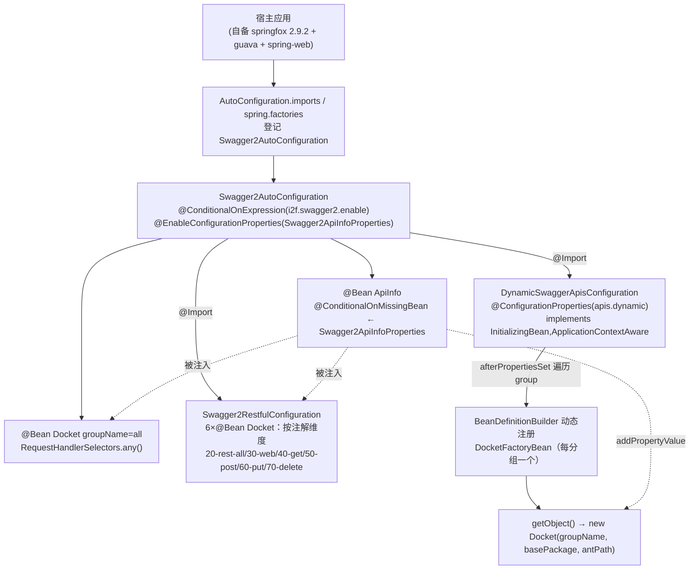

# i2f-springboot-swagger2-starter

> Swagger2（Springfox）接口文档自动装配 Starter —— 把社区 `springfox-swagger2:2.9.2` 的 `Docket` 分组文档能力接入 Spring Boot：以 `Swagger2AutoConfiguration` 为入口，`@EnableConfigurationProperties` 绑定文档头信息（`i2f.swagger2.api-info.*`），产出「全量 `all`」主 `Docket`，并 `@Import` 两组分类装配——`Swagger2RestfulConfiguration` 按注解维度静态产出 `20-rest-all`/`30-web`/`40-get`/`50-post`/`60-put`/`70-delete` 六个分组 `Docket`，`DynamicSwaggerApisConfiguration` 依据 `i2f.swagger2.apis.dynamic.group.*` 配置在启动期**动态注册**任意多个 `DocketFactoryBean`（每分组一个）。每个分组各由独立 `@ConditionalOnExpression` 开关控制、默认全开。本模块无任何 i2f 内部依赖，Boot/spring-web/springfox 全为 `provided`，须由宿主自备运行时。

## 模块路径

- `i2f-springboot/i2f-springboot-swagger2-starter`

## 模块依赖

| GroupId | ArtifactId | Scope | Optional | 说明 |
|---------|------------|-------|----------|------|
| org.projectlombok | lombok | compile | false | `@Data`/`@Slf4j`/`@NoArgsConstructor` 编译期代码生成 |
| org.springframework.boot | spring-boot-starter | provided | true | `@ConditionalOnExpression`/`@ConditionalOnMissingBean`/`@ConfigurationProperties`/`@EnableConfigurationProperties`、`BeanDefinitionBuilder`/`DefaultListableBeanFactory` 基础 |
| org.springframework.boot | spring-boot-configuration-processor | provided | true | 编译期扫描 `@ConfigurationProperties` 生成元数据（另有 `additional-*-metadata.json` 手工登记各 `enable` 开关） |
| org.springframework | spring-web (`${spring.version}`) | provided | false | 供 `RequestHandlerSelectors.withClassAnnotation/withMethodAnnotation` 引用的 `@RestController`/`@Controller`/`@ResponseBody`/`@GetMapping` 等注解类型 |
| io.springfox | springfox-swagger2 (`2.9.2`) | provided | false | `Docket`/`ApiInfo`/`ApiInfoBuilder`/`RequestHandlerSelectors`/`PathSelectors`/`DocumentationType` 核心 API |
| io.springfox | springfox-swagger-ui (`2.9.2`) | provided | false | `swagger-ui.html` 前端静态资源 |

- 本模块**无任何 `i2f.turbo` 内部 compile 依赖**（仅 lombok 编译期），是 `i2f-springboot` 组内独立性最强的 Starter 之一。
- `Swagger2RestfulConfiguration` 使用 `com.google.common.base.Predicates.or(...)`，Guava **未在本 pom 声明**，靠 `springfox-swagger2` 传递而来（见瑕疵 8）。
- 全部 Web/Springfox 能力 `provided`：编译期需要 springfox 类型，运行期由宿主自行引入 springfox + Guava + spring-web；且 springfox `2.9.2`（2018 年，上游已停更）与 Boot 2.6+/3.x、spring-web 高版本存在兼容风险（见瑕疵 9）。

## 模块设计

核心是「一个主自动配置类 + 静态分类装配 + 动态分组注册」三条产 `Docket` 的路径，全部通过 `spring.factories`/`AutoConfiguration.imports` 登记的 `Swagger2AutoConfiguration` 汇聚。



装配登记采用「双份登记」（Boot 2.x legacy + 2.7+ 通道）：

- `META-INF/spring/org.springframework.boot.autoconfigure.AutoConfiguration.imports` → `Swagger2AutoConfiguration`
- `META-INF/spring.factories` 的 `EnableAutoConfiguration=` → `Swagger2AutoConfiguration`

分组来源分三类：① `all`（`any()` 全量）；② `Swagger2RestfulConfiguration` 的 6 个按 Spring MVC 注解维度切分的固定分组；③ `i2f.swagger2.apis.dynamic.group.${configId}` 用户自定义分组，运行期由 `DynamicSwaggerApisConfiguration` 反射注册 `DocketFactoryBean`。所有分组共享同一个 `ApiInfo`。

## 模块目的

- 让引入 springfox 的 Boot 应用无需手写一堆 `Docket`：一个依赖即获得「全量 + REST 动词维度 + Web 维度」的默认多分组接口文档，并支持用配置追加自定义分组。
- 把文档头信息（标题/描述/License/版本）与分组开关全部外置为 `i2f.swagger2.*` 配置，默认开箱即用、可按分组精细关闭。
- 以 `DocketFactoryBean` + `BeanDefinitionBuilder` 实现「按配置动态产出 `Docket`」，避免为用户未知数量的分组写死 `@Bean`。

## 模块功能

- **入口装配（`Swagger2AutoConfiguration`）**：`@ConditionalOnExpression("${i2f.swagger2.enable:true}")` 总开关；`@EnableConfigurationProperties(Swagger2ApiInfoProperties)` 启用头信息绑定；`@Bean apiInfo`（`@ConditionalOnMissingBean(ApiInfo.class)`）用 `ApiInfoBuilder` 组装标题/描述/License/版本；`@Bean allApi` 产 `groupName="all"` 的全量 `Docket`；`@Import` 另外两组分类配置。
- **固定注解分组（`Swagger2RestfulConfiguration`）**：类级 `${i2f.swagger2.apis.rest.enable:true}` + 方法级各自开关，产出 `20-rest-all`（`Predicates.or` 覆盖 `@RestController`/`@ResponseBody`/`@Get/Post/Put/DeleteMapping`）、`30-web`（`@Controller`）、`40-rest-get`、`50-rest-post`、`60-rest-put`、`70-rest-delete` 六个 `Docket`。
- **动态分组（`DynamicSwaggerApisConfiguration`）**：`@Configuration` + `@ConfigurationProperties("i2f.swagger2.apis.dynamic")` + `${i2f.swagger2.apis.dynamic.enable:true}`；绑定 `Map<String,GroupItemProperties> group`（每项含 `group`/`basePackage`/`antPath`），在 `afterPropertiesSet()` 中校验非空后以 `BeanDefinitionBuilder.genericBeanDefinition(DocketFactoryBean.class)` 注入四属性并 `registerBeanDefinition(key+"Docket", ...)` 动态注册。
- **分组 Docket 工厂（`DocketFactoryBean`）**：`FactoryBean`，`getObject()` 用 `RequestHandlerSelectors.basePackage(basePackage)` + `PathSelectors.ant(antPath)` 产 `Docket`；`isSingleton()` 返回 `false`（prototype）。
- **文档头模型（`Swagger2ApiInfoProperties`）**：`@ConfigurationProperties("i2f.swagger2.api-info")`，带 `title`/`description`/`license`/`licenseUrl`/`version` 默认值。
- **样例（`sample/application-swagger.properties`）**：给出总开关、头信息、各分组开关与一个自定义 `config` 分组的完整配置示例。

## 模块主要使用方法

1. 引入本 Starter（宿主须自备 springfox 2.9.2 运行时，因本模块全 `provided`，需自行添加 `io.springfox:springfox-swagger2:2.9.2` 与 `io.springfox:springfox-swagger-ui:2.9.2`）：

```xml
<dependency>
    <groupId>i2f.turbo</groupId>
    <artifactId>i2f-springboot-swagger2-starter</artifactId>
    <version>1.0-jdk8</version>
</dependency>
```

2. **宿主启动类须自行标注 `@EnableSwagger2`**——本 Starter 未导入 springfox 引导配置（见瑕疵 1），否则 `Docket` 无人消费、无 `swagger-ui.html`。

3. 配置文档头信息与分组开关（`application.properties`）：

```properties
i2f.swagger2.enable=true
i2f.swagger2.api-info.title=Micro-Service Project Api
i2f.swagger2.api-info.version=1.0.0
# 关闭用不到的固定分组以精简下拉框
i2f.swagger2.apis.rest.web.enable=false
i2f.swagger2.apis.rest.get.enable=false
```

4.（可选）追加自定义分组：

```properties
# 注意：base-package/ant-path 当前不支持逗号多值（见瑕疵 6）
i2f.swagger2.apis.dynamic.group=config
i2f.swagger2.apis.dynamic.group.config.group=config
i2f.swagger2.apis.dynamic.group.config.base-package=com.i2f
i2f.swagger2.apis.dynamic.group.config.ant-path=/config/**
```

## 模块特性总结

- 三条产 `Docket` 路径（全量 / 注解维度固定 6 组 / 配置驱动动态 N 组）覆盖常见接口分类需求，每组独立 `@ConditionalOnExpression` 开关、默认全开。
- `DynamicSwaggerApisConfiguration` 用 `BeanDefinitionBuilder` + `DocketFactoryBean` 实现「按 Map 配置动态注册 Bean」，是本组少见的运行期动态装配样例。
- 文档头信息 `ApiInfo` 以 `@ConditionalOnMissingBean` 暴露，宿主可注册自定义 `ApiInfo` Bean 整体覆盖。
- 独立性极强：无 i2f 内部 compile 依赖，Boot/spring-web/springfox 全 `provided`。
- 双通道自动装配登记（`imports` + `spring.factories`），`maven-assembly-plugin` 覆盖 `addMavenDescriptor=true`。

## 模块瑕疵或错误

1. **【高危·并未真正启用 springfox】**：全 Starter 无 `@EnableSwagger2`（经全仓库确认），而 springfox-swagger2 `2.9.2` **不提供 Boot 自动配置**、必须靠 `@EnableSwagger2` 引导 `SwaggerDocumentationConfiguration`（`DocumentationCache`/`swagger api-docs`/`swagger-ui` 资源映射等）。本模块只注册 `Docket` Bean 却不导入引导配置——若宿主不自标 `@EnableSwagger2`，所注册的 `Docket` 无人消费，`/v2/api-docs` 与 `swagger-ui.html` 根本不存在，「自动配置」名不副实。
2. **【sample 承诺的多值能力实际不生效】**：`sample` 注释称 `base-package`、`ant-path` 「多个用逗号分隔」，但 `DocketFactoryBean` 直接把整串传给 `RequestHandlerSelectors.basePackage(basePackage)` 与 `PathSelectors.ant(antPath)`——springfox 这两个 API 均只接受**单值**（`basePackage` 是单包前缀、`ant` 是单条 ant 表达式），不会按逗号拆分。故示例里的 `com.i2f,com.common`、`/config/**,/dict/**` 会被当作整串导致匹配失败，文档说明与实现不符。
3. **【缺 `@Configuration`（lite 模式）】**：`Swagger2AutoConfiguration` 与 `Swagger2RestfulConfiguration` 都无 `@Configuration`。虽因各 `@Bean` 方法之间无相互调用（均通过参数注入 `ApiInfo`）而未触发重复实例化，但自动配置类缺 `@Configuration` 属脆弱写法（与组内 spring-starter 的 lite 模式问题同源），一旦后续新增跨方法 `@Bean` 调用即产脱离容器管理的重复 `Docket`。
4. **【`@ConfigurationProperties` 加在无字段的自动配置类上】**：`Swagger2AutoConfiguration` 标 `@ConfigurationProperties(prefix="i2f.swagger2.apis")` 却无任何可绑定字段（该类只放 `@Bean` 方法），前缀 `i2f.swagger2.apis` 下真正的键（`all.enable`/`rest.*`/`dynamic.*`）都由别处消费；此注解纯属噪声，且元数据 `groups` 段据此把 `i2f.swagger2.apis` 的 `type` 标为 `Swagger2AutoConfiguration`，进一步误导 IDE。
5. **【总开关与 dynamic 开关零元数据登记】**：`additional-spring-configuration-metadata.json` 登记了 `apis.all.enable` 与 `apis.rest.*.enable` 共 8 项，却**漏登记两个关键开关** `i2f.swagger2.enable`（总开关，`sample` 首行就在用）与 `i2f.swagger2.apis.dynamic.enable`；`api-info.*` 也依赖 processor 生成、无额外 hint；`hints` 段整块是从别处拷来的 `server.servlet.jsp.class-name`、`server.tomcat.accesslog.encoding`，与本模块毫无关系（与 spring-starter/ssh-tunnel-starter 同一复制粘贴顽疾）。
6. **【`@Data` 滥用于自动配置类】**：`Swagger2AutoConfiguration` 带 `@Data`（`@ConditionalOnExpression`/`@ConfigurationProperties` 装配类），为其生成无意义的 `equals`/`hashCode`/`toString`/getter/setter，违反项目「配置类不加 `@Data`/`@NoArgsConstructor`」约定。
7. **【`ApiInfo` 的 Contact 恒为全 null】**：`apiInfo()` 写死 `new Contact(null,null,null)`，且 `Swagger2ApiInfoProperties` 无 author/email/url 字段——文档作者信息永远缺失，宿主想补作者只能整体覆盖 `ApiInfo` Bean。
8. **【Guava 传递依赖未直声明 + 技术栈陈旧】**：`Swagger2RestfulConfiguration` 用 `com.google.common.base.Predicates`（来自 springfox 传递），本 pom 未声明 Guava，上游 springfox 调整即编译断裂；且锁定 springfox `2.9.2`（2018，已停更、无 `spring-boot-starter` 形态、与 Boot 2.6+ 路径匹配策略 / Spring 高版本存在已知兼容问题），未见版本矩阵说明。
9. **【动态注册中为日志额外 getBean 触发 prototype 实例化】**：`DocketFactoryBean.isSingleton()` 返回 `false`，`afterPropertiesSet()` 在 `registerBeanDefinition` 后又 `applicationContext.getBean(name)` 仅为 `log.info("swagger dock is:" + dock)`——多创建并丢弃一个 `Docket` 实例，且 `Docket` 未覆写 `toString`，日志实为无意义的默认对象串。
10. **【默认分组过密 + 动词语义重叠】**：默认全开时同时产出 `all`、`20-rest-all`、`30-web`、`40-get`、`50-post`、`60-put`、`70-delete` 及动态组，`20-rest-all` 与 `all`、以及四个动词组高度重叠，swagger-ui 下拉冗余、启动期扫描成本翻倍；`@ConditionalOnExpression("${...:true}")` 也非布尔开关的惯用法（宜用 `@ConditionalOnProperty`）。
11. **日志文案拼写错误**：`DynamicSwaggerApisConfiguration` 中 `"swagger registrt docket bad base-package."`（`registrt`）、`"swagger registry bad ant-path"`（`registry` 应为 `register`）等多处拼写错误，影响日志检索。
12. **无测试、pom 缺 `<name>`/`<description>`**：模块无 `src/test`，固定分组/动态注册/属性绑定/开关矩阵均无覆盖；`pom.xml` 亦无 `<name>`/`<description>`。

## 生态位置

- **同组定位**：隶属 `i2f-springboot` 组，`i2f-springboot/pom.xml` `<modules>` 第 41 行登记；是组内面向「接口文档」的专项 Starter，独立性最强（无 i2f 内部 compile 依赖）。
- **上游/外部**：能力全部来自社区 `springfox-swagger2`/`springfox-swagger-ui` `2.9.2` 与 Guava（传递）；本模块只做条件装配与 `Docket` 编排。
- **构建登记**：根 `pom.xml` `dependencyManagement` 第 1469 行以 `${i2f.version}` 登记版本。
- **配置键族**：`i2f.swagger2.enable`、`i2f.swagger2.api-info.{title,description,license,license-url,version}`、`i2f.swagger2.apis.all.enable`、`i2f.swagger2.apis.rest.{enable,all.enable,web.enable,get.enable,post.enable,put.enable,delete.enable}`、`i2f.swagger2.apis.dynamic.enable`、`i2f.swagger2.apis.dynamic.group.${id}.{group,base-package,ant-path}`。
- **文档索引**：本 readme 对应 `menus.md`「## i2f-springboot」节的 `i2f-springboot-swagger2-starter` 条目（位于 `i2f-springboot-ssh-tunnel-starter` 之后）。
