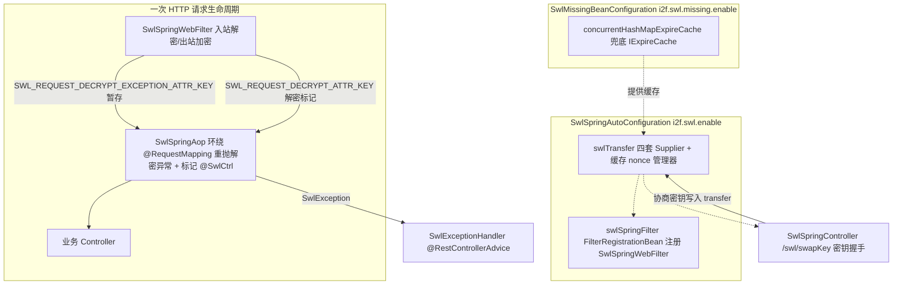

# i2f-springboot-swl-starter

> SWL（Secure Web Layer）安全传输协议的 Spring Boot 透明加解密 Starter —— 把 `i2f-swl` 的握手/加解密/签名/防重放引擎（`SwlTransfer`）与 `i2f-jdk-ext-swl` 的 Servlet 编解码过滤器（`SwlWebFilter`）接入 Boot 生命周期：`SwlSpringAutoConfiguration` 按可插拔算法类装配 `SwlTransfer`（非对称/对称/摘要/混淆四套 Supplier，默认 RSA+AES+SHA256+Base64）并以 `FilterRegistrationBean` 注册入站解密·出站加密过滤器，`SwlSpringAop` 环绕所有 `@*Mapping` 控制器把过滤器内暂存的解密异常重抛、逐方法标记 `@SwlCtrl(in/out)`，`SwlSpringController` 暴露 `/swl/swapKey` 密钥协商握手接口，`SwlExceptionHandler` 兜底 `SwlException`，`SwlMissingBeanConfiguration` 在无外部缓存时兜底一个进程内 `IExpireCache` 供 nonce/时间戳防重放使用。目标是无侵入地让前端与后端通过「随机对称密钥 + RSA 加密该密钥 + 签名 + 时间戳/nonce」的信封（`SwlData{header,parts,attaches,context}`）收发，业务代码只见明文。共 9 个类，依赖 `i2f-swl`/`i2f-jdk-ext-swl`/`i2f-sm-crypto-swl` 等内部件，Boot/springfox-web/AOP 全 `provided`。

## 模块路径

- `i2f-springboot/i2f-springboot-swl-starter`

## 模块依赖

| GroupId | ArtifactId | Scope | Optional | 说明 |
|---------|------------|-------|----------|------|
| org.projectlombok | lombok | compile | 否 | `@Data`/`@Slf4j`/`@NoArgsConstructor` |
| org.springframework.boot | spring-boot-starter | provided | 是 | 自动配置基座 |
| org.springframework.boot | spring-boot-configuration-processor | provided | 是 | 元数据生成 |
| org.springframework.boot | spring-boot-starter-web | provided | 是 | `FilterRegistrationBean`/`@RestControllerAdvice`/MVC |
| org.springframework.boot | spring-boot-starter-aop | provided | 是 | `@Aspect`/`@Around`（`SwlSpringAop`） |
| i2f.turbo | i2f-springboot-spring-starter | provided | 否 | 复用基础 Spring 装配（`MappingUtil`/`IJsonSerializer` 等运行期 Bean 来源） |
| i2f.turbo | i2f-swl | compile | 否 | SWL 协议核心：`SwlTransfer`/`SwlData`/`SwlDto`/`@SwlCtrl`/`SwlCode`/`SwlException` 及默认算法 Supplier |
| i2f.turbo | i2f-sm-crypto-swl | compile | 否 | 国密（SM2/SM3/SM4）算法 Supplier 实现 |
| i2f.turbo | i2f-extension-swl | compile | 否 | SWL 密码学引擎扩展（BouncyCastle/Antherd） |
| com.antherd | sm-crypto | provided | 否 | 国密引擎运行时（0.3.2.1-RELEASE，硬编码版本，宿主自备） |
| org.bouncycastle | bcprov-jdk15to18 | provided | 否 | BC 密码库运行时（1.74，硬编码版本，宿主自备） |
| i2f.turbo | i2f-extension-jackson | compile | 否 | `IJsonSerializer` JSON 序列化实现 |
| i2f.turbo | i2f-jdk-ext-web | compile | 否 | Web 层过滤器基类/请求响应包装 |
| i2f.turbo | i2f-jdk-ext-swl | compile | 否 | `SwlWebFilter`/`SwlWebConfig`/`SwlWebConsts`/`SwlWebCtrl`（本 Starter 的父类与常量来源） |
| i2f.turbo | i2f-spring-web | compile | 否 | `MappingUtil`（由 URL 反查 `@RequestMapping` 方法） |
| i2f.turbo | i2f-spring-core | compile | 否 | Spring 核心工具 |
| i2f.turbo | i2f-form-url-encoded | compile | 否 | 请求参数字符串 ↔ Map 还原（解密后回写 query/parameter） |

> 构建：`maven-assembly-plugin` + `addMavenDescriptor=true`；根 `pom.xml` `dependencyManagement` 第 1474 行以 `${i2f.version}` 登记版本；`i2f-springboot/pom.xml` 第 42 行登记 module，另有 `test-swl-starter`（第 52 行）作为使用样例/消费方。

## 模块设计

本 Starter 采用「**一次装配 + 三处横切**」结构：`SwlSpringAutoConfiguration` 是唯一的装配入口，其余按自动配置顺序 `@AutoConfigureAfter` 挂靠，运行期靠 `HttpServletRequest` 的 attribute 在「Filter → AOP → Controller」之间传递状态位。



- **两阶段自动装配登记**：`META-INF/spring.factories`（Boot 2.x）与 `META-INF/spring/...AutoConfiguration.imports`（Boot 2.7+）双通道登记同样的 5 个自动配置类（`SwlSpringAutoConfiguration`、`SwlMissingBeanConfiguration`、`SwlSpringAop`、`SwlSpringController`、`SwlExceptionHandler`）。
- **状态经 request attribute 流转**：过滤器完成解密后把解密异常/明文标记写入 `SwlWebConsts.*` attribute，AOP 在控制器执行前读取并「延迟重抛」，使解密异常统一落入 `SwlExceptionHandler`（过滤器阶段抛异常无法被 `@ControllerAdvice` 捕获）。
- **算法全可插拔**：`SwlWebConfigProperties` 暴露 `asym/symm/digest/obfuscate-algo-class` 四个 `Class` 属性（带 `class-reference` hint 约束到对应 SPI 接口），装配期经 `getBeanByTypeOrNewInstance` 优先取容器 Bean、否则反射 new，默认走 `i2f-swl` 内置 RSA/AES/SHA256/Base64，可切至 `i2f-sm-crypto-swl` 国密套件。
- **逐控制器/逐路径开关**：`SwlWebFilter.parseCtrl` 先按 `url-patterns` 白/黑名单与 `@SwlCtrl` 注解决定 in/out，multipart 请求强制不解密入站。

## 模块目的

- 让「前端 ↔ 后端」全链路报文以 SWL 信封（RSA 包裹随机 AES 密钥 + 数据加密 + 摘要 + 签名 + 时间戳/nonce 防重放）传输，业务无感知。
- 复用 `i2f-swl` 引擎与 `i2f-jdk-ext-swl` 过滤器，仅以少量 Spring 装配件（9 类）桥接 Boot 生命周期，避免每个应用手写 Filter/AOP/握手接口。
- 允许通过配置切换国际算法（RSA/AES/SHA-256）与国密算法（SM2/SM3/SM4），满足合规要求。

## 模块功能

- `SwlSpringAutoConfiguration`：`@ConditionalOnExpression("${i2f.swl.enable:true}")` + `@EnableConfigurationProperties`，装配 `SwlTransfer`（`@ConditionalOnMissingBean` 可覆盖）与 `FilterRegistrationBean<SwlSpringWebFilter>`（order 默认 -10、url-pattern 默认 `/*`、dispatch REQUEST+FORWARD）。
- `SwlSpringWebFilter`：继承 `SwlWebFilter`，重写 `parseCtrl` 增加路径白/黑名单、`@SwlCtrl` 逐方法开关、multipart 跳过的判定。
- `SwlSpringAop`：`@Aspect` 环绕所有 `@RequestMapping/@GetMapping/...`，重抛解密异常、标记 String 返回型、按需写入「需加密响应」标记。
- `SwlSpringController`：`POST /swl/swapKey` 无加解密（`@SwlCtrl(in=false,out=false)`）的密钥协商握手端点。
- `SwlExceptionHandler`：`@RestControllerAdvice` + `@Order(MAX_VALUE)`，把 `SwlException` 转统一 Map 响应，可被 `ISwlExceptionAdvideConverter` Bean 覆盖。
- `SwlMissingBeanConfiguration`：`@ConditionalOnMissingBean(IExpireCache.class)` 兜底进程内过期缓存。

## 模块主要使用方法

1. 引入 Starter，并由宿主自备 Boot/AOP/servlet 与国密/BC 运行时（`provided`）：

```xml
<dependency>
    <groupId>i2f.turbo</groupId>
    <artifactId>i2f-springboot-swl-starter</artifactId>
    <version>1.0-jdk8</version>
</dependency>
```

2. 按需配置开关与算法（全部默认开启、默认 RSA+AES+SHA256+Base64）：

```yaml
i2f:
  swl:
    enable: true          # 总开关（唯一真正生效的开关，见瑕疵①）
    aop:
      enable: true        # 控制器环绕切面
    api:
      enable: true        # /swl/swapKey 握手端点
    web:
      asym-algo-class: i2f.swl.impl.supplier.SwlRsaAsymmetricEncryptorSupplier
      symm-algo-class:  i2f.swl.impl.supplier.SwlAesSymmetricEncryptorSupplier
      url-patterns: ["/api/**"]
      white-list-out: ["/public/**"]
```

3. 控制器用 `@SwlCtrl(in=,out=)` 逐方法覆盖默认加解密方向；前端先调 `/swl/swapKey` 完成握手，此后按 `swlh`/`swlu`/`swlp` 约定头收发密文即可。

## 模块特性总结

- **纯桥接、体量小**：9 类只做「把 `SwlTransfer` 与 `SwlWebFilter` 接进 Boot」，协议/密码学/编解码全在上游 `i2f-swl`/`i2f-jdk-ext-swl`，本模块不重复实现。
- **算法与开关双可配**：四套 Supplier 类属性 + `class-reference` hint 约束；分层 `i2f.swl.*.enable` 开关（但部分失效，见瑕疵）。
- **异常延迟重抛机制**：用 request attribute 把过滤器阶段异常搬运到 MVC 层再抛，解决「Filter 抛异常绕过 `@ControllerAdvice`」——设计动机正确且实用。
- **provided 面克制**：Boot/servlet/AOP/BC/sm-crypto 全 provided，运行时交由宿主，避免版本绑架；内部算法与协议件 compile。

## 模块瑕疵或错误

1. **【高危·开关失效】`i2f.swl.filter.enable` 是死配置**：`SwlSpringWebFilter` 虽标注 `@ConditionalOnExpression("${i2f.swl.filter.enable:true}")`，但它既不在 `spring.factories`/`AutoConfiguration.imports` 中登记、也无 `@Component`，仅由 `SwlSpringAutoConfiguration.swlSpringFilter()` 里 `new SwlSpringWebFilter()` 手动创建。`@Conditional*` 只对 Spring 容器管理的配置/Bean 生效，对手动 `new` 的对象永不求值——过滤器只要 `i2f.swl.enable=true` 就恒定注册，把它单独关掉不可能。
2. **【高危·开关失效】`i2f.swl.web.enable` 是死配置**：`SwlSpringController` 的 `swapKey` 方法把 `@ConditionalOnExpression("${i2f.swl.web.enable:true}")` 标在 `@PostMapping` 方法上；`@Conditional*` 对 MVC handler 方法无效，握手端点实际只受类级 `i2f.swl.api.enable` + `@ConditionalOnBean(SwlTransfer)` 控制，`web.enable` 配 `false` 也关不掉（元数据第 38 行却把它登记为 `SwlWebConfigProperties` 的属性，来源类也张冠李戴）。
3. **加密供应商异常码全部错用 `SYMMETRIC_EXCEPTION`**：`swlTransfer()` 中非对称、对称、摘要、混淆四段 `catch` 一律 `throw new SwlException(SwlCode.SYMMETRIC_EXCEPTION.code(), ...)`（第 97/104/112/120 行），即便装配 RSA/摘要/混淆 Supplier 失败也报「对称异常」码，排障误导（与 `i2f-sm-crypto-swl` 同类复制粘贴缺陷）。
4. **`swlTransfer()` 含空 try-catch 死代码**：第 88–91 行 `try { } catch (Exception e) { }` 块体为空，无任何作用，纯遗留噪声。
5. **`SwlExceptionHandler` 用 `e.printStackTrace()` 且响应体语义错误**：以 `printStackTrace` 代替日志；返回 Map 硬编码 `status:500`、`error:"swl error!"`，`message` 取枚举 `name()` 而非可诊断描述，且无论真实 `SwlCode` 是签名失败/重放/解密异常，HTTP 状态一律按 500 处理，掩盖了错误类别。
6. **`SwlSpringAop` 的 `@Autowired(required=false)` HttpServletRequest 却无条件使用**：字段声明可缺省（`required=false`），但 `controllerLog` 中直接 `request.getAttribute(...)`/`setAttribute(...)`；一旦无请求作用域代理（非 servlet 线程、异步 `@Async` 派发）即 NPE，`required=false` 的容错语义与实际「必然用到」自相矛盾。
7. **实际生效的过滤器属性未登记元数据**：`SwlSpringAutoConfiguration` 用 `@Value` 读取 `i2f.swl.filter.order`（默认 -10）与 `i2f.swl.filter.url-pattern`（默认 `/*`）控制过滤器，但 `additional-spring-configuration-metadata.json` 完全未登记这两项，IDE 无补全、文档不可见。
8. **`hints` 段含拷贝来的无关死条目**：元数据 `hints` 末尾 `server.servlet.jsp.class-name`、`server.tomcat.accesslog.encoding` 与 SWL 毫无关系，系从其它 Starter 元数据复制残留（同 `swagger2-starter`/`ssh-tunnel-starter` 模式）。
9. **`@Data` 滥用于配置类/过滤器/属性类 + `@Value` 双默认**：`SwlSpringAutoConfiguration`/`SwlMissingBeanConfiguration`/`SwlSpringWebFilter`/`SwlWebConfigProperties` 均 `@Data`，为自动配置类与 Filter 生成 `equals/hashCode/toString` 与全套 setter，`toString` 可能牵出注入的 `jsonSerializer`/`mappingUtil`/`transfer` 等重对象；`filterOrder`/`filterUrlPattern` 既写 `@Value` 默认又写字段初始值，双默认易失步。
10. **兜底缓存导致「安全传输」防重放仅单机有效**：`SwlMissingBeanConfiguration` 在无外部 `IExpireCache` 时兜底进程内 `MapCache`，而 nonce/时间戳防重放依赖该缓存——集群/多实例部署下各节点独立、跨节点重放检测形同虚设，与安全传输目标冲突；同时 `SwlSpringAutoConfiguration` 对 `IExpireCache` 是 `@Autowired`（required），若关闭 `i2f.swl.missing.enable` 又无外部缓存则应用直接启动失败。
11. **`SwlTransferConfigProperties` 无自身字段与可读性**：`@ConfigurationProperties(prefix="i2f.swl.transfer")` 的类体为空、仅继承 `SwlTransferConfig`，配置项语义完全隐于父类，本模块层面无法约束/文档化 `transfer` 键。
12. **上游出站加密路径疑似缺陷会被本 Starter 直接触发**：`SwlSpringWebFilter` 继承的 `i2f-jdk-ext-swl` `SwlWebFilter` 在加密响应处 `responseText = responseData.getParts().get(0);` 紧接着 `responseText = "$." + responseBody;`（`responseBody` 是 `byte[]`，拼接得到的是数组对象地址而非密文），且随后又两次 `setContentType`/写流；本 Starter 默认全开 `out`，一旦启用出站加密即命中该上游缺陷（根因在上游模块，本模块未做任何规避或白名单兜底）。

## 生态位置

- **归属**：`i2f-springboot` 组，安全传输专项 Starter；与「`@ControllerAdvice` 版」的 `i2f-spring-swl`（`i2f.spring.swl.advice` 包，走 MVC 消息读写 Advice 管线）是**两套并行实现**——本件走 Filter+AOP，`i2f-spring-swl` 走 RequestBody/ResponseBodyAdvice，二者互不依赖（`i2f-spring-swl` 文档已注明不依赖本模块）。
- **上游依赖**：`i2f-swl`（协议/引擎）、`i2f-jdk-ext-swl`（`SwlWebFilter` 编解码基座）、`i2f-sm-crypto-swl`/`i2f-extension-swl`（国际+国密算法）、`i2f-jdk-ext-web`（请求/响应包装）、`i2f-form-url-encoded`（解密后参数还原）、`i2f-spring-web`（`MappingUtil` 反查 handler）。
- **下游消费**：`i2f-springboot/test-swl-starter`（使用样例/集成测试）。
- **定位小结**：SWL 在 Boot 侧的「即用装配」，把协议内核与 Servlet 过滤器粘合成开箱即用的加解密网关件；算法可插拔、异常延迟重抛是亮点，但**两个开关（filter.enable / web.enable）因装配方式而失效**、兜底进程内缓存削弱集群防重放、异常码错用与上游加密路径缺陷是主要风险点。
