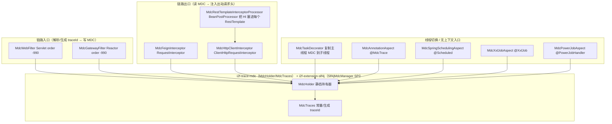

# i2f-springboot-trace-mdc-starter

> 全链路 TraceId / MDC 上下文传播的 Spring Boot 装配 Starter —— 把 `i2f-trace-mdc` 的 MDC 持有内核（`MdcHolder`/`MdcTraces`，运行时 MDC 由 `i2f-extension-slf4j` 的 `Slf4jMdcManager` SPI 实现承接）在各类「链路入口 / 出口 / 线程切换 / 定时与任务」场景中自动织入 `traceId`/`traceSource`/`traceUrl`/`traceIp`/`traceApp`：`MdcWebFilter`（Servlet 入站）、`MdcGatewayFilter`（WebFlux/Gateway 入站）从请求头多别名解析或生成 traceId 并写入 MDC，`MdcFeignInterceptor`（OpenFeign）、`MdcHttpClientInterceptor`+`MdcRestTemplateInterceptorProcessor`（RestTemplate）把 traceId 注入出站请求头，`MdcTaskDecorator` 在 `ThreadPoolTaskExecutor` 子线程间复制 MDC，`MdcAnnotationAspect`（`@MdcTrace`）、`MdcSpringSchedulingAspect`（`@Scheduled`）、`MdcXxlJobAspect`（`@XxlJob`）、`MdcPowerJobAspect`（`@PowerJobHandler`）为无请求上下文的入口/任务生成新 traceId。共 11 源文件（10 个组件类 + 1 个注解）、10 个各带独立 `@ConditionalOnExpression` 开关、内部依赖 `i2f-trace-mdc`+`i2f-extension-slf4j`，Web/AOP/Feign/Gateway/xxl-job/powerjob 全 `provided`+`optional` 按环境条件生效。

## 模块路径

- `i2f-springboot/i2f-springboot-trace-mdc-starter`

## 模块依赖

| GroupId | ArtifactId | Scope | Optional | 说明 |
|---------|------------|-------|----------|------|
| org.projectlombok | lombok | compile | - | `@Data`/`@Slf4j` 等 |
| org.springframework.boot | spring-boot-starter | provided | true | 自动装配/`@Conditional`/`Environment` |
| org.springframework.boot | spring-boot-configuration-processor | provided | true | 元数据处理器（本模块未生成 properties 条目） |
| i2f.turbo | i2f-trace-mdc | compile | - | MDC 内核 `MdcHolder`/`MdcTraces`（traceId 常量与生成、`getOrGenTraceId`） |
| i2f.turbo | i2f-extension-slf4j | compile | - | `Slf4jMdcManager`（`MdcManager` SPI 实现，MDC 落 SLF4j 的运行时底座） |
| org.springframework.boot | spring-boot-starter-web | provided | true | `OncePerRequestFilter`/`RestTemplate`/`ClientHttpRequestInterceptor` |
| org.springframework.boot | spring-boot-starter-aop | provided | true | `@Aspect`/`@Around`（三个切面 + `@MdcTrace`） |
| org.springframework.cloud | spring-cloud-starter-openfeign | provided | true | `RequestInterceptor`（`MdcFeignInterceptor`） |
| org.springframework.cloud | spring-cloud-starter-gateway | provided | true | `GlobalFilter`/`ServerWebExchange`/reactor `Mono`（`MdcGatewayFilter`） |
| com.xuxueli | xxl-job-core | provided(2.4.1) | true | `@XxlJob` 切点 |
| tech.powerjob | powerjob-worker-spring-boot-starter | provided(4.3.9) | true | `@PowerJobHandler` 切点 |

## 模块设计



## 模块目的

在不改业务代码的前提下，让一次请求/一个任务从进入系统到跨线程、跨服务调用都携带同一 `traceId`，并把来源、URL、客户端 IP、应用名等放进 MDC，供日志 pattern（`%X{traceId}`）打印，实现「按 traceId 串起全链路日志」。它把上游 `i2f-trace-mdc` 的纯 MDC 工具「Boot 化」为按环境自动生效的一组过滤器/拦截器/切面/装饰器。

## 模块功能

- **Servlet 入站**：`MdcWebFilter`（`OncePerRequestFilter`，order -990）遍历 `MdcTraces.TRACE_ID_HEADERS`（`traceId`/`X-Trace-Id`/`X-Request-Id`… 多别名）与 request attribute 取 traceId，取不到则 `getOrGenTraceId` 生成，写 `TRACE_ID/TRACE_SOURCE/TRACE_URL/TRACE_IP/TRACE_APP` 五键并回填 request attribute，`finally` 成对清理。
- **Gateway 入站**：`MdcGatewayFilter`（`GlobalFilter`，order -990）逻辑同上（reactive 版），并向下游 `mutate` 请求头注入 traceId/traceSource。
- **Feign 出口**：`MdcFeignInterceptor`（`RequestInterceptor`）把 MDC 中 traceId/traceSource 写入 Feign 请求头透传下游。
- **RestTemplate 出口**：`MdcHttpClientInterceptor`（`ClientHttpRequestInterceptor`）注入出站头；`MdcRestTemplateInterceptorProcessor`（`BeanPostProcessor`）自动把前者加入容器内每个 `RestTemplate` 的拦截器链。
- **线程池传播**：`MdcTaskDecorator`（`TaskDecorator`）在提交任务时 `copyOf()` 主线程 MDC 快照，子线程执行前 `replaceAs` 恢复、执行后 `clear`。
- **注解/任务入口**：`@MdcTrace` + `MdcAnnotationAspect` 环绕标注方法（复用已有 traceId）；`MdcSpringSchedulingAspect`/`MdcXxlJobAspect`/`MdcPowerJobAspect` 分别环绕 `@Scheduled`/`@XxlJob`/`@PowerJobHandler` 生成全新 traceId 并标来源。

## 模块主要使用方法

1. 引入依赖（按需自备 web/aop/feign/gateway/xxl-job/powerjob 运行时）：

```xml
<dependency>
    <groupId>i2f.turbo</groupId>
    <artifactId>i2f-springboot-trace-mdc-starter</artifactId>
    <version>1.0-jdk8</version>
</dependency>
```

2. 日志 pattern 打印 MDC 键（如 logback `%X{traceId} %X{traceSource} %X{traceIp}`）。
3. 各通道默认全开，单项可用 `i2f.springboot.trace.mdc.{servlet,gateway,feign,http-client,rest-template,task-decorator,aspect,scheduling,xxl-job,power-job}.enable=false` 关闭。
4. 无 HTTP 上下文的方法标注 `@MdcTrace` 即可自动获得/延续 traceId；定时与分布式任务无需标注即被对应切面覆盖。

## 模块特性总结

- **覆盖面广**：一个 Starter 同时打通 Servlet/Reactive 两类入站、Feign/RestTemplate 两类出站、线程池、`@Scheduled`/`@XxlJob`/`@PowerJobHandler` 三类任务与自定义注解，是 i2f 组内「链路场景」最全的横切件。
- **多别名兼容**：traceId/traceSource 请求头按 `MdcTraces.*_HEADERS` 多候选解析，兼容常见网关/框架命名。
- **条件化装配**：每个组件独立 `@ConditionalOnExpression`（默认 true）+ `@ConditionalOnClass`（+ 入口 filter 的 `@ConditionalOnWebApplication` 区分 SERVLET/REACTIVE），缺依赖的通道自动不生效，`provided`+`optional` 保证不污染宿主类路径。
- **薄封装**：自身不定义 trace 存储，全部委托 `i2f-trace-mdc` + `i2f-extension-slf4j` 的 `MdcManager` SPI，换日志实现即换 MDC 落地。

## 模块瑕疵或错误

1. **【高危·装配机制被误用】** 10 个组件类（Filter/Interceptor/TaskDecorator/BeanPostProcessor/@Aspect）被**直接登记为自动配置类**（`spring.factories` 的 `EnableAutoConfiguration` + `AutoConfiguration.imports`），却**没有一个是 `@Configuration`/`@AutoConfiguration`**——正确姿势应为一个 `@AutoConfiguration` 类用 `@Bean` + `@ConditionalOnMissingBean` 产出各组件。当前写法虽能让 `@Conditional*` 求值并把类本身注册为 Bean，但绕开了标准自动配置范式，引出下述一连串问题。
2. **【高危·无法覆盖且可能启动失败】** 全部组件缺 `@ConditionalOnMissingBean`，用户无法干净覆盖；尤其 `MdcTaskDecorator` 注册为 `TaskDecorator` Bean 后，若宿主已自定义任一 `TaskDecorator`，Boot `ThreadPoolTaskExecutorBuilder` 以 `getIfAvailable(TaskDecorator.class)` 取「唯一」→ `NoUniqueBeanDefinitionException`，直接导致启动失败。
3. **【高危·Gateway 版 MDC 泄漏/线程错配】** `MdcGatewayFilter` `put` 了 5 个键，但 `.then(Mono.defer)` 只 `remove` `TRACE_ID`/`TRACE_SOURCE` 两个，遗留 `TRACE_URL`/`TRACE_IP`/`TRACE_APP`；更根本的是 MDC 为 ThreadLocal，而 Gateway 是 Reactor 响应式——`put` 发生在订阅线程、`chain.filter` 跨事件循环线程、`.then` 收尾很可能在**另一线程**执行，清理作用于错误线程，event-loop 线程复用会造成 traceId 跨请求污染。对照 Servlet 版 `MdcWebFilter` 五键成对 put/remove 是正确的，反衬出 Gateway 版清理不完整。
4. **【`@Component` 与 auto-config 双身份】** 除 `MdcAnnotationAspect` 外，各组件同时带 `@Component`。若宿主 `@SpringBootApplication` 的扫描范围覆盖到 `i2f` 包，同一组件会以「扫描 bean 名」（如 `mdcWebFilter`）与「全限定类名」（auto-config bean 名）**两份定义**注册 → 过滤器/AOP 重复；正常不扫描时 `@Component` 惰性无效、纯冗余。
5. **【BeanPostProcessor 反模式】** `MdcRestTemplateInterceptorProcessor` 作为 `BeanPostProcessor` 却用构造器注入普通组件 `@Autowired(required=false) MdcHttpClientInterceptor`；BPP 在容器极早期实例化，会连带其依赖提前创建（早于 AOP 代理等处理器就位），是典型 BPP 反模式；`@Data` 加在 BPP 上生成的 `setInterceptor`/`equals`/`hashCode`/`toString` 毫无意义且暴露「运行期替换拦截器」的 setter。
6. **【`@AutoConfigureAfter` 语义不成立】** 其上标注的 `@AutoConfigureAfter(MdcHttpClientInterceptor.class)` 只影响**自动配置类之间的排序**，并不能保证 BPP 与其依赖的**实例化先后**（作者用 `required=false` 也说明清楚顺序并无保障），达不到「interceptor 先就绪」的目的。
7. **【真实开关零元数据登记】** `additional-spring-configuration-metadata.json` 的 `groups`/`properties` 全空，10 个真实开关 `i2f.springboot.trace.mdc.*.enable` 无一登记，IDE 补全永不命中；`hints` 两条（`server.servlet.jsp.class-name`、`server.tomcat.accesslog.encoding`）是从别处拷贝的死条目，与本模块无关（与 spring-starter/ssh-tunnel/swagger2/totp 同一 `hints` 复制家族）。
8. **【跨模块断层：i2f 自建线程池不被覆盖】** `MdcTaskDecorator` 仅对 Boot 默认 `applicationTaskExecutor` 生效；而 `i2f-springboot-spring-starter` 的 `SpringAsyncAutoConfiguration`/`SpringScheduleAutoConfiguration` 自建并直接 `new` 的 `ThreadPoolTaskExecutor` 不会引用该 `TaskDecorator` Bean，故用 i2f 异步/调度池时子线程 MDC 依旧丢失，与「全链路传播」目标存在跨模块缺口。
9. **【切面清理与入口 filter 键冲突】** 三个切面 `finally` 只 `remove` `TRACE_ID`/`TRACE_SOURCE`，但这些键名与 `MdcWebFilter` 在请求线程上 `put` 的同名键相同——AOP 在 filter 之内执行，切面 `finally` 会提前删掉 filter 设置的 traceId/traceSource，令 filter 剩余生命周期（如后续拦截器/视图渲染日志）MDC 被清空；`@MdcTrace` 与请求链路嵌套时尤明显。
10. **【`@EnableAspectJAutoProxy` 重复且落点脆弱】** `MdcAnnotationAspect`/`MdcSpringSchedulingAspect`/`MdcXxlJobAspect` 各自 `@EnableAspectJAutoProxy`，Boot `AopAutoConfiguration` 早已默认开启；且 `@Enable*` 放在非 `@Configuration` 的 lite 类上，依赖被当作配置类解析才生效，风格脆弱。
11. **【入口不回写响应头】** Feign/HttpClient 把 traceId 注入**出站**请求头，但 `MdcWebFilter`/`MdcGatewayFilter` 都不把 traceId 写回**响应**头（缺 `response.setHeader`），前端与调用方无法拿到本次 traceId 用于排障对账。
12. **【`@Data`/`@NoArgsConstructor` 滥用】** 在无状态切面 `MdcAnnotationAspect` 等类上生成一堆无意义访问器与 `equals`/`hashCode`/`toString`。
13. **【`getIp` 的 NPE 与 `printStackTrace`】** `MdcGatewayFilter.getIp` 中 `remoteAddress.getAddress().getHostAddress()` 在地址未解析（`getAddress()` 返回 null）时 NPE；servlet/gateway 两处 `InetAddress.getLocalHost()` 异常均以 `printStackTrace` 吞掉。

## 生态位置

- **上游内核**：`i2f-trace-mdc`（`MdcHolder`/`MdcTraces`，纯 MDC 工具与 trace 常量）、`i2f-extension-slf4j`（`Slf4jMdcManager` 作为 `MdcManager` SPI 实现，经 `META-INF/services` 注册并被 `MdcHolder.findMdcManager()` 按「slf4j 优先」自动选中）——本 Starter 是二者面向 Boot 的装配层。
- **构建登记**：`i2f-springboot/pom.xml` 第 44 行 `<module>`，根 `pom.xml` `dependencyManagement` 第 1484 行以 `${i2f.version}` 登记版本。
- **消费方**：全仓库 `grep` 未发现任何下游模块依赖本 Starter，亦无 `test` 样例，属「已装配但未验证」的生态孤岛（同 totp-starter）。
- **组内定位**：i2f-springboot 组中「链路可观测性」专项件，与 `spring-starter` 内的 `TraceFilter` 存在职责重叠（前者是完整多通道 MDC 传播，后者是 spring-starter 自带的轻量 trace 过滤器），二者未互相引用。
