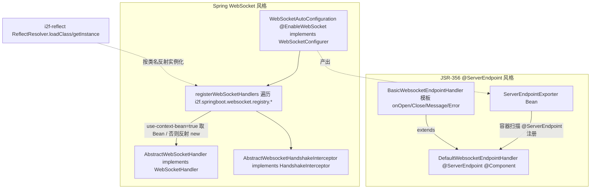

# i2f-springboot-websocket-starter

> WebSocket 的 Spring Boot 轻量装配 Starter —— 把**两套并行、彼此独立**的 WebSocket 技术栈同时接入 Boot：其一为 JSR-356（`javax.websocket`）`@ServerEndpoint` 风格，`BasicWebsocketEndpointHandler` 给出「`@OnOpen/@OnClose/@OnMessage/@OnError` + 在线计数 + `ConcurrentHashMap` 客户端表 + 广播/回显」模板，`DefaultWebsocketEndpointHandler` 继承它并以 `@ServerEndpoint("${...path:/default/broadcast}")` + `@Component` 暴露一个开箱即用的广播端点，配合 `WebSocketAutoConfiguration.serverEndpointExporter()` 注册的 `ServerEndpointExporter` 让容器扫描 `@ServerEndpoint` 类；其二为 Spring WebSocket（`spring-websocket`）风格，`WebSocketAutoConfiguration`（`@EnableWebSocket` 且 `implements WebSocketConfigurer`）按 `i2f.springboot.websocket.registry.*` 配置项逐条注册 handler/interceptor/path，`impl` 包下 `AbstractWebSocketHandler`（`implements WebSocketHandler`）与 `AbstractWebsocketHandshakeInterceptor`（`implements HandshakeInterceptor`）给出可实例化的基类。仅 5 类、唯一 i2f 内部依赖 `i2f-reflect`（反射 new handler/interceptor），`spring-boot-starter-websocket` 为 `provided`。

## 模块路径

- `i2f-springboot/i2f-springboot-websocket-starter`

## 模块依赖

| GroupId | ArtifactId | Scope | Optional | 说明 |
|---------|------------|-------|----------|------|
| org.projectlombok | lombok | compile | 否 | `@Data`/`@Slf4j`/`@NoArgsConstructor` |
| org.springframework.boot | spring-boot-starter | provided | 是 | 自动配置基座、`@ConditionalOnExpression` |
| org.springframework.boot | spring-boot-configuration-processor | provided | 是 | 元数据生成 |
| org.springframework.boot | spring-boot-starter-websocket | provided | 否 | `WebSocketHandler`/`HandshakeInterceptor`/`ServerEndpointExporter`/`@EnableWebSocket`/`javax.websocket` |
| i2f.turbo | i2f-reflect | compile | 否 | `ReflectResolver.loadClass`/`getInstance`——按类名字符串反射实例化 handler/interceptor |

> 构建：`maven-assembly-plugin` + `addMavenDescriptor=true`；根 `pom.xml` `dependencyManagement` 第 1489 行以 `${i2f.version}` 登记版本；`i2f-springboot/pom.xml` 第 45 行登记 module。`spring-boot-starter-websocket` 为 `provided`（非 optional），运行时须由宿主自备，且其中含 Servlet 容器的 WebSocket 实现（tomcat-embed-websocket 等）。

## 模块设计

本 Starter 是「**两套并行技术栈 + 一张配置驱动的注册表**」结构：JSR-356 端点走容器扫描、Spring WebSocket 走 `WebSocketConfigurer`，两者路径与 API 完全独立。



- **双通道自动装配登记**：`META-INF/spring.factories`（Boot 2.x）与 `META-INF/spring/...AutoConfiguration.imports`（Boot 2.7+）都登记 `WebSocketAutoConfiguration` **和** `DefaultWebsocketEndpointHandler` 两项。
- **配置驱动的 handler 注册表**：`registry` 是 `Map<String, RegistryItemProperties>`，每项含 `use-context-bean`/`handler`/`interceptor`/`path`/`allow-origin`；`use-context-bean=true` 时按 beanName 从容器取，否则把 `handler`/`interceptor` 当全限定类名用 `ReflectResolver` 反射实例化，再 `addHandler(handler, path).setAllowedOrigins(allowOrigin).addInterceptors(interceptor)`。
- **两条技术栈互不感知**：`ServerEndpointExporter` 只处理 `@ServerEndpoint` 注解类（JSR-356），`WebSocketConfigurer` 只处理 `WebSocketHandler`（Spring），二者的在线会话表、广播 API 各写各的，不能跨栈共享连接。

## 模块目的

- 提供两种主流 WebSocket 编程模型的即用样板：JSR-356 的注解式端点、Spring 的 `WebSocketHandler` + `HandshakeInterceptor`，减少应用侧样板代码。
- 让「注册哪些端点、走哪个 handler、允许哪些源」可通过 `registry.*` 配置项声明，无需写 Java 配置类。
- 附带一个默认可用的广播端点（`/default/broadcast`）与一份浏览器握手回显样例（`sample/websocket.html`）。

## 模块功能

- `WebSocketAutoConfiguration`：`@ConditionalOnExpression("${i2f.springboot.websocket.enable:true}")` + `@EnableWebSocket` + `@Configuration` + `@ConfigurationProperties("i2f.springboot.websocket")`，产 `ServerEndpointExporter` Bean，并实现 `registerWebSocketHandlers` 按注册表挂载 Spring 版端点。
- `BasicWebsocketEndpointHandler`：JSR-356 端点模板，`@OnOpen/@OnClose/@OnMessage/@OnError` 维护 `onlineCount`（`AtomicInteger`）与 `clients`（`ConcurrentHashMap<String, Session>`），提供 `sendMessage`/`broadcastMessage`/`broadcastMessageToOthers`（类上 `@ServerEndpoint`/`@Component` 被注释掉，仅作父类）。
- `DefaultWebsocketEndpointHandler`：继承上者，加 `@ConditionalOnExpression("${i2f.springboot.websocket.default-endpoint.enable:true}")` + `@ServerEndpoint("${...path:/default/broadcast}")` + `@Component`，作为默认广播端点。
- `impl.AbstractWebSocketHandler`：Spring 版 `WebSocketHandler` 具体实现，`afterConnectionEstablished`/`handleMessage`/`afterConnectionClosed` 以 `username` 为 key 维护 `ConcurrentHashMap<String, WebSocketSession>` 与 `onlineCount`。
- `impl.AbstractWebsocketHandshakeInterceptor`：Spring 版 `HandshakeInterceptor`，`beforeHandshake` 往 attributes 放一个 `user_<时间戳>` 假用户名以绑定会话身份。

## 模块主要使用方法

1. 引入 Starter，并由宿主自备 Servlet 容器 WebSocket 运行时（`spring-boot-starter-websocket` 为 `provided`）：

```xml
<dependency>
    <groupId>i2f.turbo</groupId>
    <artifactId>i2f-springboot-websocket-starter</artifactId>
    <version>1.0-jdk8</version>
</dependency>
```

2. 配置注册表挂载 Spring 版端点（`use-context-bean=false` 时 `handler`/`interceptor` 填全限定类名）：

```yaml
i2f:
  springboot:
    websocket:
      enable: true
      default-endpoint:
        enable: true          # JSR-356 广播端点，见瑕疵③（关不掉）
        path: /default/broadcast
      registry:
        master:
          use-context-bean: false
          handler: i2f.springboot.websocket.impl.AbstractWebSocketHandler
          interceptor: i2f.springboot.websocket.impl.AbstractWebsocketHandshakeInterceptor
          path: /default/echo
          allow-origin: "*"
```

3. 用 `sample/websocket.html` 连 `ws://localhost:8080/default/echo` 收发，或用 JSR-356 的 `/default/broadcast`。

> 注意：`sample/readme.md` 指示「在启动类上添加注解 `@EnableWebsocketConfig`」，但**本模块（乃至全仓库）并不存在该注解**（见瑕疵⑦），实际靠 `spring.factories` 自动装配，无需任何启动类注解。

## 模块特性总结

- **体量小、栈覆盖广**：5 类同时给出 JSR-356 与 Spring WebSocket 两套样板，并附浏览器样例页，学习/试用心智负担低。
- **注册表可配置**：`registry.*` 允许声明多个 Spring 版端点，handler/interceptor 既可 beanName 又可类名反射，扩展点灵活。
- **provided 面克制**：Boot 基座与 websocket starter 全 provided，运行时交由宿主容器，避免版本绑架。
- **依赖极窄**：唯一 i2f 内部依赖 `i2f-reflect`，且仅用于反射实例化 handler/interceptor。

## 模块瑕疵或错误

1. **【高危·广播/在线数失效】`@ServerEndpoint` 端点用实例字段存会话表与在线数**：`BasicWebsocketEndpointHandler` 的 `onlineCount`（`AtomicInteger`）与 `clients`（`ConcurrentHashMap`）都是**普通实例字段（非 `static`）**。JSR-356 容器对 `@ServerEndpoint` 类**每个连接新建一个实例**，于是每条连接各持一份 `clients`/`onlineCount`，`broadcastMessage`/`broadcastMessageToOthers` 只能看到「自己这一条」连接、在线计数恒为 1——广播与在线统计整体失效（`@ServerEndpoint` 的经典陷阱，正确做法是用 `static` 或外部共享存储）。`impl.AbstractWebSocketHandler`（Spring 版）以 beanName/单例方式使用则无此问题，但一旦按 `use-context-bean=false` 反射 new，同样每注册项一个新实例、`clients` 各自独立。
2. **【高危·误用自动配置机制】`DefaultWebsocketEndpointHandler` 被登记为自动配置类**：`spring.factories` 与 `AutoConfiguration.imports` 把它与 `WebSocketAutoConfiguration` 并列在 `EnableAutoConfiguration` 之下，但它只是 `@Component` + `@ServerEndpoint` 的普通组件、并非 `@Configuration`，将其作为自动配置入口登记属机制误用（同 `trace-mdc-starter` 把组件类登记为自动配置类的家族问题），既不受自动配置排序/条件语义约束，也易与组件扫描重复注册。
3. **【高危·开关失效】`default-endpoint.enable` 关不掉 `@ServerEndpoint` 端点**：`DefaultWebsocketEndpointHandler` 上标 `@ConditionalOnExpression("${i2f.springboot.websocket.default-endpoint.enable:true}")`，但 `ServerEndpointExporter` 是**独立地扫描 classpath 上带 `@ServerEndpoint` 的类并 `ServerContainer.addEndpoint`**，与 Spring 条件化 Bean 生命周期无关——即使条件为 `false` 使其不作为 `@Component` Bean 创建，只要该类在 classpath 上仍会被 exporter 注册进容器，`default-endpoint.enable=false` 无法真正下线该广播端点。
4. **`registerWebSocketHandlers` 异常吞掉且未覆盖 `IllegalArgumentException`/NPE**：反射分支只 `catch (IllegalAccessException)` 且块体为空；而 `ReflectResolver.getInstance` 在构造器抛异常/参数不匹配时会包装成 **`IllegalArgumentException`** 抛出（见 `ReflectResolver` L769），`loadClass` 找不到类返回 `null` 后 `getInstance(null)` 又会 **NPE**——这两者都未被捕获，会把整个 `registerWebSocketHandlers` 打断、波及其它本就正确的注册项，甚至影响启动。
5. **`interceptor == null` 仍继续 `addInterceptors(null)`**：handler 解析为 null 时 `continue` 跳过该项，但 interceptor 解析为 null 时仅 `log.warn` 不 `continue`，随后照旧 `.addInterceptors(interceptor)` 传入 `null`——握手上文（varargs 含 null 元素）存在 NPE 或注册出「无拦截器但被误认为有」的隐患。
6. **`@Data`/`@NoArgsConstructor` 滥用于 `@Configuration` 自动配置类**：`WebSocketAutoConfiguration` 同时挂 `@Data` + `@NoArgsConstructor` + `@Configuration` + `@EnableWebSocket` + `@ConfigurationProperties`，`@Data` 会为含 `ApplicationContext` 的字段生成 `equals/hashCode/toString` 与全套 setter（`toString` 牵出容器重对象、`setRegistry`/`setApplicationContext` 暴露可变性），自动配置类加 `@Data` 是本组普遍反模式（见 `spring-starter`/`swl-starter` 同类问题）。
7. **样例文档指向不存在的注解**：`sample/readme.md` 要求「启动类加 `@EnableWebsocketConfig`」，全仓库 `grep` 无此注解定义或使用；本 Starter 实际完全靠 `spring.factories` 自动装配，该说明既误导使用者又暴露样例与实现脱节（另 `application-websocket.properties` 注释里写访问地址 `/default/echo`，而 html 也连 `/default/echo`，但 default-endpoint 配的是 `/default/broadcast`，两处路径易混）。
8. **`@ServerEndpoint` 的 `${...}` 占位符解析不确定**：`@ServerEndpoint(value = "${i2f.springboot.websocket.default-endpoint.path:/default/broadcast}")` 是 `javax.websocket` 注解，由 Servlet 容器而非 Spring 的 `PropertySourcesPlaceholderConfigurer` 处理，Spring 的 `ServerEndpointExporter` 也**不做该注解 value 的占位符替换**——路径能否落到 `/default/broadcast` 取决于容器实现，存在解析成字面量 `${...}` 的风险（这也是把配置项写进 JSR-356 注解的常见误区）。
9. **war/外部容器部署下 `ServerEndpointExporter` 冲突**：`serverEndpointExporter()` 方法上无 `@ConditionalOnMissingBean` 也无容器类型判定，`ServerEndpointExporter` 官方文档明确**仅适用于嵌入式容器**；打成 war 部署到自带 WebSocket 处理的外部 Tomcat 时，它会与容器已有的 `WsSci` 扫描重复注册端点而报错。而 i2f 生态存在 `WarBootApplication`（`spring-starter`），二者叠加即踩此雷。
10. **「Abstract」命名的类实为可直接实例化的具体类且逻辑脆弱**：`AbstractWebSocketHandler`/`AbstractWebsocketHandshakeInterceptor` 名为抽象却非 `abstract`（`sample` 直接反射 new 使用），`AbstractWebSocketHandler` 以 `getUsername`（来自拦截器塞入的 `user_<System.currentTimeMillis()>`）为 `clients` 的 key——同一毫秒建立的多条连接 key 相撞互相覆盖、会话丢失，且 `afterConnectionClosed` 按 `getUsername(session)` 取 key，属性缺失时 `remove(null)`；「假用户名」也无任何真实鉴权。
11. **跨域全开 + 无鉴权，安全偏弱**：`allow-origin` 缺省即填 `*` 并 `setAllowedOrigins("*")`，握手拦截器不做任何来源/身份校验只塞假用户名，任意站点页面均可建立连接并被广播触达（若用于生产需自行加白名单与鉴权）。
12. **元数据登记不全且 `hints` 是拷贝死条目**：`registry` 动态 Map 的逐项属性（`use-context-bean`/`handler`/`interceptor`/`path`/`allow-origin`）无任何元数据（动态键可理解，但连 `RegistryItemProperties` 字段级提示也缺）；`groups` 里 `i2f.springboot.websocket.registry` 的 `type` 错指 `WebSocketAutoConfiguration`（实为 `Map`）；`hints` 段又是 `server.servlet.jsp.class-name`、`server.tomcat.accesslog.encoding` 这类从别处复制来的无关死条目（同组通用问题）。
13. **无 `<description>`、无测试、无下游消费方**：`grep` 全仓库仅在自身 `pom.xml`、父 pom（L45）与根 pom DM（L1489）出现，无任何模块依赖它，也无 test 样例或集成验证，上述高危缺陷（尤其广播失效、开关关不掉）无测试兜底。

## 生态位置

- **归属**：`i2f-springboot` 组的 WebSocket 专项 Starter，体量小、依赖面窄（唯一内部依赖 `i2f-reflect`）。
- **上游依赖**：`i2f-reflect`（`ReflectResolver` 反射实例化 handler/interceptor）；`spring-boot-starter-websocket`（`WebSocketHandler`/`ServerEndpointExporter`/`javax.websocket`）由宿主 provided 提供。
- **下游消费**：暂无（全仓库无模块依赖，属未验证生态孤岛）。
- **定位小结**：一次覆盖 JSR-356 与 Spring WebSocket 两套模型的即用样板，注册表配置化与双技术栈是便利点；但 **JSR-356 端点用实例字段存会话导致广播/在线数失效**、**`default-endpoint.enable` 关不掉容器扫描的端点**、**组件类被误登记为自动配置类**、**`registerWebSocketHandlers` 只吞 `IllegalAccessException` 漏 `IllegalArgumentException`/NPE**、**样例指向不存在的 `@EnableWebsocketConfig`**、**war 部署下 `ServerEndpointExporter` 冲突**是主要风险点，生产使用前需按上述逐条修正并补鉴权/测试。
