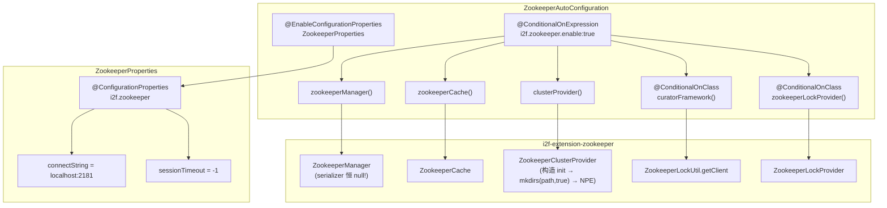

# i2f-springboot-zookeeper-starter

> ZooKeeper 分布式协调的 Spring Boot 装配 Starter —— 把 `i2f-extension-zookeeper` 的连接/CRUD 核心 `ZookeeperManager`、分布式缓存 `ZookeeperCache`（实现 `IExpireContainerCache`/`IPersistCache`/`IDistributedCache`）、集群分片 `ZookeeperClusterProvider`（临时节点 + 递归 watch 一致性取模）、Curator 分布式锁 `ZookeeperLockProvider`（`InterProcessMutex` 适配 `ILockProvider`）一次性注册为可注入 Bean：`ZookeeperAutoConfiguration` 以 `@ConditionalOnExpression(${i2f.zookeeper.enable:true})` 为总开关，`@EnableConfigurationProperties(ZookeeperProperties.class)` 绑定 `i2f.zookeeper.*`（仅 `connect-string`/`session-timeout` 两字段，继承自 `ZookeeperConfig`），注册五个 Bean 并把 Curator 两 Bean 各自用 `@ConditionalOnClass(CuratorFramework.class)` 条件化——若宿主未引入 `curator-framework`，则仅产出原生 ZK 三件套。本模块仅 2 个类，内部 compile 依赖 `i2f-lock` + `i2f-extension-zookeeper`，`zookeeper`/`curator-framework`/`curator-recipes`/Boot 全 `provided`，是组内最简但隐患最深的装配 Starter。

## 模块路径

- `i2f-springboot/i2f-springboot-zookeeper-starter`

## 模块依赖

| GroupId | ArtifactId | Scope | Optional | 说明 |
|---------|------------|-------|----------|------|
| org.projectlombok | lombok | compile | — | `@Data`/`@NoArgsConstructor` |
| org.springframework.boot | spring-boot-starter | provided | true | Boot 自动配置基础 |
| org.springframework.boot | spring-boot-configuration-processor | provided | true | 元数据编译期生成 |
| org.springframework.boot | spring-boot-starter-aop | provided | — | **本模块无任何 AOP 使用，死依赖** |
| i2f.turbo | i2f-lock | compile | — | `ILockProvider`/`ILock` 接口 |
| i2f.turbo | i2f-extension-zookeeper | compile | — | `ZookeeperManager`/`ZookeeperConfig`/`ZookeeperCache`/`ZookeeperClusterProvider`/`ZookeeperLockProvider`/`ZookeeperLockUtil` |
| org.apache.zookeeper | zookeeper:3.6.3 | provided | — | ZK 原生客户端 |
| org.apache.curator | curator-framework:4.0.0 | provided | — | `CuratorFramework` |
| org.apache.curator | curator-recipes:4.0.0 | provided | — | `InterProcessMutex` |

## 模块设计



设计意图为「一键把 ZK 四大能力（连接管理/分布式缓存/集群分片/分布式锁）全部暴露为 Bean」；ClusterProvider 的 listenPath 由 `spring.application.name` 自动拼 `/apps/{name}/cluster`。Curator 锁两 Bean 用 `@ConditionalOnClass` 允许不引 Curator 时跳过。

## 模块目的

为宿主应用提供开箱即用的 ZooKeeper 全能力装配（连接管理 + 缓存 + 集群 + 分布式锁），避免手动 new `ZookeeperManager` 与 `CuratorFramework`。

## 模块功能

| 方法/Bean | 条件 | 说明 |
|-----------|------|------|
| `zookeeperManager()` | 总开关 | `new ZookeeperManager(zkConfig)` → `reload()` 建连（CountDownLatch 等待成功） |
| `zookeeperCache(manager)` | 总开关 | `new ZookeeperCache(manager)` 适配 `IExpireContainerCache`/`IDistributedCache`，路径前缀 `/cache` |
| `clusterProvider(manager)` | 总开关 | `new ZookeeperClusterProvider("/apps/{appName}/cluster", manager)` → 注册临时节点 + watchLoop |
| `curatorFramework()` | `@ConditionalOnClass` | `ZookeeperLockUtil.getClient(connectString, sessionTimeout)` → 指数退避重试 Curator 客户端 |
| `zookeeperLockProvider(curator)` | `@ConditionalOnClass` | `new ZookeeperLockProvider(curator)` 适配 `ILockProvider`（`InterProcessMutex`） |

## 模块主要使用方法

1. 引入本 Starter，并由宿主自备 ZooKeeper 与 Curator 运行时（均 `provided` 不传递）：

```xml
<dependency>
    <groupId>i2f.turbo</groupId>
    <artifactId>i2f-springboot-zookeeper-starter</artifactId>
    <version>1.0-jdk8</version>
</dependency>
```

2. 配置（`application.properties`）：

```properties
i2f.zookeeper.enable=true
i2f.zookeeper.connect-string=192.168.1.10:2181,192.168.1.11:2181
i2f.zookeeper.session-timeout=60000
spring.application.name=my-service
```

3. 注入使用：

```java
@Autowired ZookeeperManager manager;    // CRUD / watcher
@Autowired ZookeeperCache cache;        // 分布式过期缓存
@Autowired ClusterProvider cluster;     // 集群分片节点列表
@Autowired(required=false) ZookeeperLockProvider lock; // 分布式锁
```

## 模块特性总结

- **极简 2 类装配 5 Bean**：一个配置类一把产出所有 ZK 能力，无需手动 `@Bean`。
- **Curator 双 Bean 可选**：`@ConditionalOnClass(CuratorFramework.class)` 不引 Curator 就不装配锁。
- **ClusterProvider 按 `spring.application.name` 自动分路**：同应用名多实例自动成组。
- **Properties 继承 `ZookeeperConfig`**：与上游模块类型兼容，直接传入 `ZookeeperManager` 构造。

## 模块瑕疵或错误

1. **【高危 — `clusterProvider()` Bean 必定 NPE 致启动失败】** `ZookeeperClusterProvider` 构造调 `init()` → `zookeeperManager.mkdirs(path, true)`（注册临时节点）→ `obj2ZkData("")` → `serializer.serialize("")` → **NPE**（上游 `ZookeeperManager.serializer` 字段无 setter/无初始化，全仓无赋值，恒 null）。即：只要 ZK 可达且 `enable=true`，应用启动即失败。本 Starter 无任何方式注入或绕过 serializer。

2. **【高危 — `sessionTimeout` 默认 -1 对 Curator 非法】** `ZookeeperConfig.sessionTimeout = -1`（Java int 默认语义"未配"），但 `ZookeeperLockUtil.getClient` 把 -1 直接传给 `CuratorFrameworkFactory.sessionTimeoutMs(-1)`——Curator 要求正整数，负值可能导致 `IllegalArgumentException` 或非预期行为。`ZookeeperManager.reload()` 对 -1 做了 `Integer.MAX_VALUE` 兜底（连接等待近乎无限），Curator 侧却没有等价处理。

3. **【高危 — ZK 不可达时应用启动无限阻塞】** `ZookeeperManager.reload()` → `ZookeeperUtil.getConnectedZookeeper()` → `CountDownLatch.await(sessionTimeout, MILLISECONDS)`，`sessionTimeout` = -1 → `Integer.MAX_VALUE`（约 24.8 天），若 ZK 不可达则 Bean 创建阶段卡死，无超时快速失败。

4. **自动配置类无 `@Configuration`/`@AutoConfiguration` 走 lite 模式**：经 `spring.factories`/`AutoConfiguration.imports` 登记却缺注解，当前无跨 `@Bean` 方法调用故未爆雷，风格脆弱（同 spring/totp/swagger2/xxl-job 家族）。

5. **元数据 group 名为 `i2f.swagger2.apis`（从 swagger2 拷贝未改）**：应为 `i2f.zookeeper`，IDE 分组展示完全错位。

6. **元数据键 `i2f.zookeeper..session-timeout` 双点号拼写错误**：真实属性为 `i2f.zookeeper.session-timeout`，IDE 自动补全永不命中。

7. **`hints` 含 `server.servlet.jsp.class-name` 与 `server.tomcat.accesslog.encoding`**：与 ZooKeeper 完全无关的死条目（同组多模块通病）。

8. **`@Data` 滥用于自动配置类**：生成 `setEnvironment(Environment)` / `setZkConfig(ZookeeperProperties)` / `getEnvironment()` 等公共 setter/getter，暴露内部状态可被外部篡改。

9. **全部 5 个 `@Bean` 无 `@ConditionalOnMissingBean`**：宿主若要自定义 `ZookeeperManager`（如注入 serializer），同名 Bean 将冲突而非覆盖。

10. **`spring-boot-starter-aop`（provided）声明但完全未使用**：本模块 2 个类无任何 AOP 相关代码——死依赖。

11. **`zookeeper`/`curator-framework`/`curator-recipes` 均 `provided` 但未标 `optional`**：与同组惯例（`provided` + `optional`）不一致；虽然 `provided` 在 Maven 中已不传递，但 `optional` 缺失在 IDE 聚合/文档生成中可能被误读为编译期可见。

12. **`EnvironmentAware` + `@Autowired ZookeeperProperties` 双通道配置读取冗余**：`environment` 仅用于 `clusterProvider()` 读 `spring.application.name`，可简化为 `@Value` 或配置属性字段；混用两套配置获取机制增加理解成本。

13. **无下游消费方与 test 样例（grep 确认属生态孤岛）**：全仓库无任何 pom 依赖本 Starter，上游 `i2f-extension-zookeeper` 的文档提到「消费方 i2f-springboot-zookeeper-starter 装配五类 Bean」但实际无人使用该装配。

## 生态位置

- **上游**：`i2f-extension-zookeeper`（`ZookeeperManager`/`ZookeeperConfig`/`ZookeeperCache`/`ZookeeperClusterProvider`/`ZookeeperLockProvider`）、`i2f-lock`（`ILockProvider`/`ILock`）。
- **构建登记**：根 `pom.xml` `dependencyManagement` 第 1504 行以 `${i2f.version}` 登记版本；`i2f-springboot/pom.xml` 第 47 行有 module。
- **消费方**：**无**。全仓库无其它模块 pom 引用本 Starter（grep 确认）。
- **定位**：i2f-springboot 组内对 ZooKeeper 分布式协调的薄装配层；设计意图正确但因上游 serializer null 致命缺陷导致核心功能（集群注册）实际不可用。
