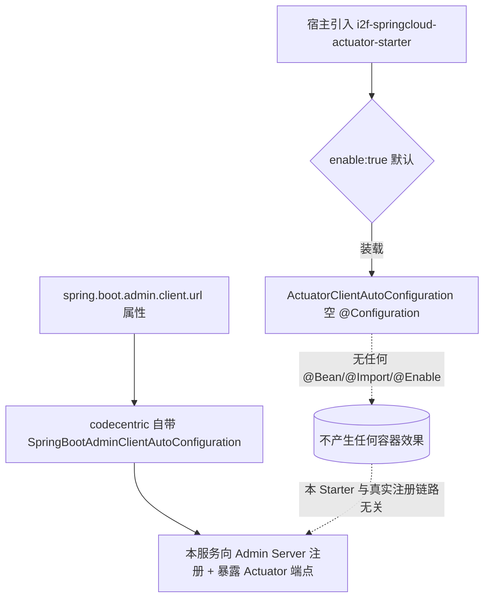

# i2f-springcloud-actuator-starter

## 模块路径

`i2f-springcloud/i2f-springcloud-actuator-starter`

## 模块概述

Spring Cloud 组中一个**理论上应作为「Actuator + Spring Boot Admin 客户端」接入封装、实际上完全空转**的极薄 Starter（同 `i2f-springcloud-actuator-admin-starter` 的客户端对偶，一监控系统、一暴露并注册端点）。它的设计意图显然是：把 Spring Boot Actuator（`spring-boot-starter-actuator`）与 codecentric 的 Spring Boot Admin 客户端（`de.codecentric:spring-boot-admin-starter-client`）打包，通过一个 `@ConditionalOnExpression` 布尔开关（`i2f.springcloud.actuator-client.enable`，默认 `true`）控制「本服务是否向 Admin Server 注册自己并暴露监控端点」。全模块仅 **1 个 Java 源文件 + 4 个资源文件**，**不含任何 i2f 内部 compile 依赖**（仅 lombok）。

然而其唯一源类 `ActuatorClientAutoConfiguration` 是一个**彻底的空 `@Configuration` 类**——没有任何 `@Enable*` 注解、没有 `@Import`、没有任何 `@Bean` 方法。这意味着：**即使该自动配置类被成功装载，也不会对 Spring 容器产生任何影响**。真正把服务注册到 Admin Server 的动作，由 codecentric 客户端自身的 `SpringBootAdminClientAutoConfiguration`（读取 `spring.boot.admin.client.url`）完成，与本类毫无关系。因此本 Starter 的 `enable` 开关既**无法开启**也**无法关闭**任何实际行为，是一个名不副实的空壳（详见「模块瑕疵」）。

## 模块依赖

### 内部依赖（compile）

| 依赖 | 说明 |
|---|---|
| `org.projectlombok:lombok` | 编译期注解（`@Data`/`@NoArgsConstructor`/`@Slf4j`），本模块唯一 compile 项，且都加在了空类上 |

> 除 lombok 外，**无任何 `i2f.*` 内部 compile 依赖**——本模块不依赖 i2f 生态的任何功能件。

### 外部依赖（provided）

| 依赖 | 版本 | scope / optional | 说明 |
|---|---|---|---|
| `org.springframework.boot:spring-boot-starter` | 随根 DM | provided + optional | Boot 基础 |
| `org.springframework.boot:spring-boot-configuration-processor` | 随根 DM | provided + optional | 元数据处理器 |
| `org.springframework.boot:spring-boot-starter-actuator` | 随根 DM | **provided（非 optional）** | Actuator 端点，本应被本 Starter「带出」，但 provided 不具传递性 |
| `de.codecentric:spring-boot-admin-starter-client` | **2.2.3（硬编码）** | **provided（非 optional）** | Admin 客户端注册，与 `actuator-admin-starter` 对应的 client 侧 |

## 模块设计

真实注册路径（右下）完全绕过了本 Starter 的空配置类；本 Starter 的布尔门控（左上）对实际行为没有任何影响。

## 模块目的

（名义上）为 Spring Cloud / Boot 微服务提供「一行依赖即接入 Spring Boot Admin 监控」的自动装载，与本组 `i2f-springcloud-actuator-admin-starter`（监控台服务端）配套，构成「一采集、一展示」的轻量监控闭环。（实际上，见下文）目的未达成。

## 模块功能

- 双通道登记 1 个自动配置类：`META-INF/spring.factories`（`EnableAutoConfiguration`）+ `META-INF/spring/...AutoConfiguration.imports`，内容一致，均指向 `ActuatorClientAutoConfiguration`。
- `ActuatorClientAutoConfiguration`：`@Configuration` + `@ConditionalOnExpression("${i2f.springcloud.actuator-client.enable:true}")` + `@ConfigurationProperties(prefix="i2f.springcloud.actuator-client")` + `@Data`/`@NoArgsConstructor`/`@Slf4j`——**类体为空**。
- 附带 sample 配置 `application-actuator-client.properties`：演示 `management.endpoints.web.exposure.include=*`、`management.endpoint.health.show-details=always`、`spring.boot.admin.client.url=http://localhost:11024`——这些真正生效的属性**全部来自 codecentric 客户端与 Boot Actuator 原生能力，而非本模块代码**。

## 模块主要使用方法

1. 引入本 Starter（但因其 provided 依赖不传递，实际仍需自行补齐 `spring-boot-starter-actuator` 与 `spring-boot-admin-starter-client`）。
2. 在 `application.yml` 配置 `spring.boot.admin.client.url` 指向 Admin Server 地址（示例 11024），并按需放开 `management.endpoints.web.exposure.include`。
3. 服务启动后即向 Admin Server 注册——**此步骤完全由 codecentric 客户端自身自动配置驱动**，`i2f.springcloud.actuator-client.enable` 设 `true`/`false` 均不影响该注册行为。

## 模块特性总结

- 与 `actuator-admin-starter` 高度同构，是本组最小的「薄封装」模块之一（1 源文件 + 4 资源、零 i2f 内部依赖）。
- 风格上延续本组「放 classpath 即自动装载 + 单一布尔开关」的 Starter 约定，但封装本身未承载任何逻辑。

## 模块瑕疵或错误（实证）

1. **【高危·空转/零效果】** `ActuatorClientAutoConfiguration` 是**完全空的 `@Configuration` 类**（无 `@Bean`、无 `@Import`、无 `@Enable*`）。装载它不改变任何容器状态；而真正让服务注册到 Admin Server 的是 codecentric 自带的 `SpringBootAdminClientAutoConfiguration`。因此本 Starter **不提供任何实际功能**，相比「直接引入 `spring-boot-admin-starter-client`」毫无增益。
2. **【高危·开关名不副实】** `@ConditionalOnExpression("${...enable:true}")` 门控的是上述空类，故把 `enable` 设为 `false` 也**不能阻止**服务向 Admin Server 注册（注册由 codecentric 自动配置独立驱动）。这与 `actuator-admin-starter`（至少还有 `@EnableAdminServer` 被本类触发）不同——本模块连「被门控的动作」都不存在。
3. **【高危·provided 非 optional 不传递】** `spring-boot-starter-actuator`、`spring-boot-admin-starter-client` 均为 `provided` 且**非 `optional`**，二者都不会随本 Starter 传递给使用方。使用方必须自行声明这两依赖才能完成注册；一旦自行声明，本 Starter 的存在即彻底多余。
4. **【版本错配】** 硬编码 `spring-boot-admin-starter-client:2.2.3`（Boot 2.2.x 时代），而根 pom `spring-boot.version=2.7.18`（[pom.xml L49](file:///C:/home/dev/java/dev-center/i2f-turbo-java/pom.xml#L49)），非官方兼容组合，且版本写死未纳入根 dependencyManagement 统一治理（与 `actuator-admin-starter` 同一问题）。
5. **`@ConfigurationProperties` 空挂**：注解加在**无任何字段**的空类上，`prefix` 无属性可绑定；`enable` 实际由 `@ConditionalOnExpression` 的 SpEL 直读环境属性，并非经本类字段绑定。
6. **`@Data`/`@NoArgsConstructor`/`@Slf4j` 对空类纯装饰**：无字段可生成 getter/setter/equals，`log` 字段无引用点。
7. **无 `@ConditionalOnClass` 兜底**：核心依赖是 provided，缺类时本应优雅退避；虽因本类为空不会主动 `NoClassDefFoundError`，但仍不符合 Starter 规范（与同组 admin-starter 一致的结构性问题）。
8. **元数据 `hints` 为死条目**：`additional-spring-configuration-metadata.json` 的 `hints` 是 `server.servlet.jsp.class-name`、`server.tomcat.accesslog.encoding` 两条与本模块毫不相关的跨模块拷贝残留；`properties` 仅登记 `enable` 一项，真正需要提示的 `spring.boot.admin.client.*` / `management.*` 均未涉及。
9. **双通道登记过时冗余**：`spring.factories` 与 `AutoConfiguration.imports` 对同一单类重复登记（Boot 2.7 已推荐仅用后者）。
10. **生态孤岛**：全仓除自身 pom、父 pom `<module>` 登记（[i2f-springcloud/pom.xml L17](file:///C:/home/dev/java/dev-center/i2f-turbo-java/i2f-springcloud/pom.xml#L17)）、根 pom DM 登记（[pom.xml L1517](file:///C:/home/dev/java/dev-center/i2f-turbo-java/pom.xml#L1517)）外，**无任何模块 compile/test 依赖本 Starter**，亦无样例工程验证。

## 生态位置

处于 i2f-springcloud 组「监控」子域，与 `i2f-springcloud-actuator-admin-starter` 一一配成对（client 注册 / server 展示）。它是本组对第三方 Spring Boot Admin 生态的「即插即用」封装尝试，但由于配置类空转、provided 依赖不传递、布尔开关无法真正门控注册链路，实际封装价值趋近于零，且全仓无消费方，属**生态孤岛**。修复方向：应把 `spring-boot-starter-actuator`/`spring-boot-admin-starter-client` 改为 `compile`（或 `optional` 并配 `@ConditionalOnClass`）让依赖真正传递，并以 `@ConditionalOnProperty` + `@ConditionalOnClass` 正确门控 codecentric 客户端自动配置（或至少让本类承载实际注册逻辑），使 `enable` 开关名副其实。
