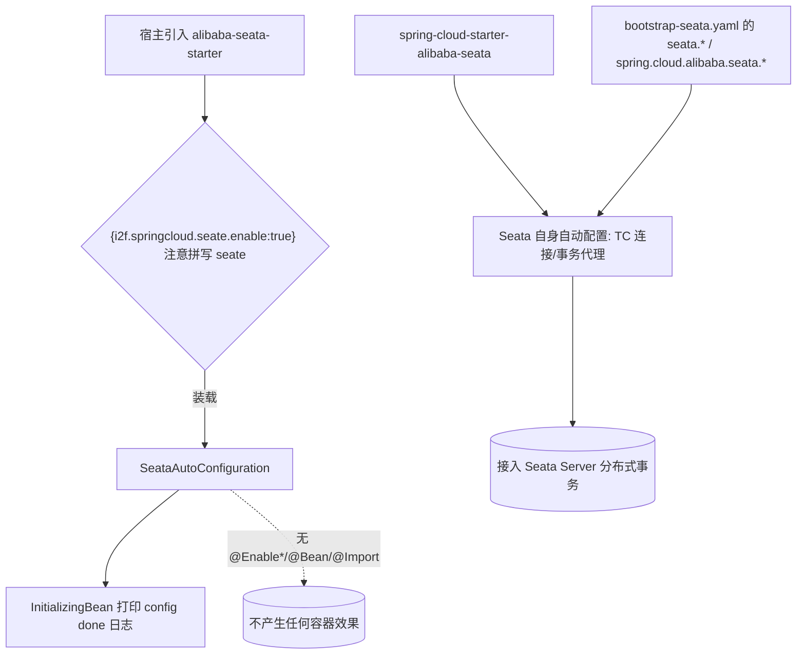

# i2f-springcloud-alibaba-seata-starter

## 模块路径

`i2f-springcloud/i2f-springcloud-alibaba-seata-starter`

## 模块概述

Spring Cloud 组中一个面向 **Apache Seata（阿里 `spring-cloud-starter-alibaba-seata` 分布式事务）** 的「即插即用」装配 Starter（本组第 4 个建档模块，1 个 Java 源文件 + 5 个资源文件，**不含任何 i2f 内部 compile 依赖**，仅 lombok）。它把 `com.alibaba.cloud:spring-cloud-starter-alibaba-seata` 作为 `provided`（optional）依赖引入，通过一个 `@Configuration` 类 `SeataAutoConfiguration` 做「放 classpath + 布尔开关即自动装载」的门控，并配套 sample `bootstrap-seata.yaml`（演示 `tx-service-group`、seata registry/config 走 nacos 等设置）。它是本组「分布式事务」子域的唯一接入件。

需说明：本模块的 `SeataAutoConfiguration` **无任何 `@Enable*`、无 `@Bean`、无 `@Import`**，`implements InitializingBean` 仅打印一行 `"SeataConfig config done"`；真正让 Seata 生效的是 `spring-cloud-starter-alibaba-seata` 自身的自动配置。更严重的是，本类的开关键与元数据/sample 声明的键**拼写不一致**（详见「模块瑕疵」第 1 条高危项），使对外宣称的关闭开关实际不可达。

## 模块依赖

### 内部依赖（compile）

| 依赖 | 说明 |
|---|---|
| `org.projectlombok:lombok` | 编译期注解（`@Data`/`@NoArgsConstructor`/`@Slf4j`），本模块唯一 compile 项 |

> 无任何 `i2f.*` 内部 compile 依赖。

### 外部依赖（provided）

| 依赖 | 版本来源 | scope / optional | 说明 |
|---|---|---|---|
| `org.springframework.boot:spring-boot-starter` | 根 DM | provided + optional | Boot 基础 |
| `org.springframework.boot:spring-boot-configuration-processor` | 根 DM | provided + optional | 元数据处理器 |
| `com.alibaba.cloud:spring-cloud-starter-alibaba-seata` | 根 BOM `2021.0.5.0` | provided + optional | Seata 分布式事务 |

> 与 `alibaba-nacos-starter` 相同，seata 依赖**不写死版本**，由根 pom 的 `spring-cloud-alibaba-dependencies:2021.0.5.0` BOM 统一管理（[pom.xml L51](file:///C:/home/dev/java/dev-center/i2f-turbo-java/pom.xml#L51)、[L111-112](file:///C:/home/dev/java/dev-center/i2f-turbo-java/pom.xml#L111-L112)）。

## 模块设计

真实 Seata 能力由 `spring-cloud-starter-alibaba-seata` 自身自动配置（右支）驱动；本 Starter 的空类仅贡献一行日志，且其布尔门键（左上 `seate`）与对外文档键（`seata`）拼写分裂。

## 模块目的

为基于 Spring Cloud Alibaba 的微服务提供「一行依赖即接入 Seata 分布式事务」的自动装载入口，屏蔽手动配置，附带 sample `bootstrap-seata.yaml` 作为事务分组 / registry / config 接入范本；补齐本组「分布式事务」子域。

## 模块功能

- 双通道登记 1 个自动配置类：`META-INF/spring.factories`（`EnableAutoConfiguration`）+ `META-INF/spring/...AutoConfiguration.imports`，内容一致，均指向 `SeataAutoConfiguration`。
- `SeataAutoConfiguration`：`@Configuration` + `@ConditionalOnExpression("${i2f.springcloud.seate.enable:true}")` + `@ConfigurationProperties(prefix="i2f.springcloud.seate")` + `@Data`/`@NoArgsConstructor`/`@Slf4j`，`implements InitializingBean` 仅打印 `"SeataConfig config done"`；**无任何字段、无 `@Bean`/`@Import`/`@Enable*`**。
- 提供 sample 范本：`application-seate.properties`（文件名亦错拼 `seate`，内容写 `i2f.springcloud.seata.enable=true`）、`bootstrap-seata.yaml`（`spring.cloud.alibaba.seata.tx-service-group`、`seata.registry/config` 走 nacos）。

## 模块主要使用方法

1. 引入本 Starter（因 provided+optional 不传递，仍需自行补齐 `spring-cloud-starter-alibaba-seata` 及其底层 `seata-*`）。
2. 在 `bootstrap.yaml` 配置 `spring.cloud.alibaba.seata.tx-service-group` 及 `seata.registry.*`/`seata.config.*`（可参考本模块 sample）。
3. 服务启动后由 seata starter 自身自动配置接入事务——本模块仅打印一行日志；如需关闭本模块自动配置，须使用代码实际读取的键 `i2f.springcloud.seate.enable=false`（而非文档所示的 `seata.enable`）。

## 模块特性总结

- 本组「分布式事务」子域唯一件，风格延续「放 classpath + 单布尔开关自动装载 + 双通道登记 + sample 范本」。
- 版本经 BOM 治理，无硬编码错配（与 nacos-starter 一致，优于 actuator 家族）。
- 但相比 nacos-starter 的 `@EnableDiscoveryClient`，本类**连一个功能性注解都没有**，纯空壳 + 一行日志，且开关存在拼写分裂缺陷。

## 模块瑕疵或错误（实证）

1. **【高危·开关键拼写分裂 `seate` vs `seata`】** 代码里 `@ConditionalOnExpression("${i2f.springcloud.seate.enable:true}")` 与 `@ConfigurationProperties(prefix="i2f.springcloud.seate")` 均使用错拼 **`seate`**（[SeataAutoConfiguration.java L19-20](file:///C:/home/dev/java/dev-center/i2f-turbo-java/i2f-springcloud/i2f-springcloud-alibaba-seata-starter/src/main/java/i2f/springcloud/alibaba/seata/SeataAutoConfiguration.java#L19)），而 `additional-spring-configuration-metadata.json`（groups/properties 均为 `i2f.springcloud.seata`）与 sample `application-seate.properties`（内容 `i2f.springcloud.seata.enable=true`）声明的却是正确拼写 **`seata`**。全仓 grep 证实 `i2f.springcloud.seata` 仅出现在文档处、代码从不读取，代码实读的 `i2f.springcloud.seate.enable` 则无任何元数据登记。后果：用户按 IDE 提示 / sample 设置 `i2f.springcloud.seata.enable=false` **完全无效**（自动配置类照样装载），关闭开关名不副实且真实键隐蔽不可发现。
2. **【空壳·类无实际作用】** `SeataAutoConfiguration` 无 `@Enable*`/`@Bean`/`@Import`，仅 `InitializingBean` 打印一行日志；即便拼写修好，`enable` 门控的也只是这个空类，真正的 Seata 事务能力由 `spring-cloud-starter-alibaba-seata` 自身自动配置驱动，本类对 Seata 行为零增益。
3. **`@ConfigurationProperties` 空挂 + 前缀错拼**：注解加在无字段类上，`prefix="i2f.springcloud.seate"`（错拼）无可绑定属性，与元数据登记的 `i2f.springcloud.seata` group 亦不一致。
4. **`@Data`/`@NoArgsConstructor`/`@Slf4j` 装饰、`InitializingBean` 仅日志**：`afterPropertiesSet() throws Exception` 声明的受检异常从不抛出。
5. **provided + optional 不传递**：seata 依赖不随本 Starter 传递，使用方须自行补齐，本 Starter 本身「不带任何 Seata 能力」。
6. **sample 细节错拼**：文件名 `application-seate.properties`（`seate`），`bootstrap-seata.yaml` 中 `group: SETA_GROUP` 疑为 `SEATA_GROUP`（漏 `A`），均系复制粘贴手误。
7. **元数据 `hints` 为死条目**：`hints` 是 `server.servlet.jsp.class-name`、`server.tomcat.accesslog.encoding` 两条与本模块无关的跨模块拷贝残留；`properties` 仅登记 `enable` 一项，真正需要提示的 `seata.*` / `spring.cloud.alibaba.seata.*` 均未涉及。
8. **双通道登记过时冗余**：`spring.factories` 与 `AutoConfiguration.imports` 对同一单类重复登记（Boot 2.7 推荐仅用后者）。
9. **生态孤岛**：全仓除自身 pom、父 pom `<module>` 登记（[i2f-springcloud/pom.xml L19](file:///C:/home/dev/java/dev-center/i2f-turbo-java/i2f-springcloud/pom.xml#L19)）、根 pom DM 登记（[pom.xml L1527](file:///C:/home/dev/java/dev-center/i2f-turbo-java/pom.xml#L1527)）及 wiki 清单外，**无任何模块 compile/test 依赖本 Starter**，亦无样例工程/测试验证。

## 生态位置

处于 i2f-springcloud 组「分布式事务」子域，是本组唯一的 Seata 接入件，常与 `alibaba-nacos-starter`（sample 中 seata registry/config 均指向 nacos）配合使用。因全仓无消费方，属**生态孤岛**。整体封装质量弱于同为薄壳的 nacos-starter：本类连功能性注解都没有，且存在对外文档键与代码实读键拼写分裂（`seata`/`seate`）这一直接导致「关闭开关失效」的高危缺陷；修复优先级为统一订正为 `seata`、或直接删并为 `@ConditionalOnProperty` + 承载真实 `@Import`。
