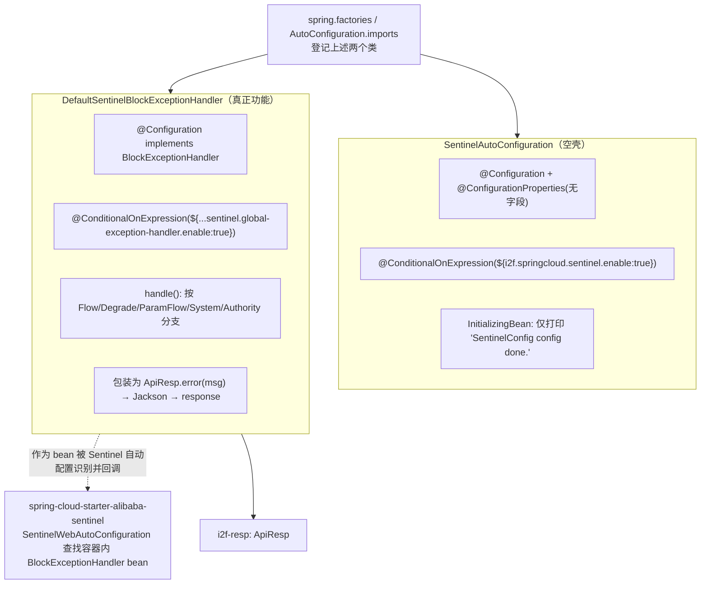

# i2f-springcloud-alibaba-sentinel-starter

## 模块路径

`i2f-springcloud/i2f-springcloud-alibaba-sentinel-starter`

## 模块概述

Spring Cloud 组中面向 **阿里巴巴 Sentinel（流量控制、熔断降级、热点参数限流、系统保护、授权规则）** 的「即插即用」装配 Starter（本组第 5 个建档模块，2 个 Java 源文件 + 5 个资源文件）。它把 `com.alibaba.cloud:spring-cloud-starter-alibaba-sentinel`（流控/熔断核心）、`com.alibaba.csp:sentinel-datasource-nacos`（规则持久化到 Nacos）、`com.alibaba.cloud:spring-cloud-alibaba-sentinel-gateway`（网关适配）三件套作为 `provided`（optional）依赖引入，版本全部由根 pom 的 `spring-cloud-alibaba-dependencies:2021.0.5.0` BOM 统一治理（无硬编码错配，与同组 nacos-starter 同为较优风格）。

与前四个「纯空壳」薄封装 Starter 不同，本模块是 i2f-springcloud 组中**第一个含真正功能逻辑**的接入件：除一个标准空壳 `SentinelAutoConfiguration`（仅打印启动日志）外，还提供了 `DefaultSentinelBlockExceptionHandler` —— 它实现 Sentinel 的 `BlockExceptionHandler` 接口，把请求被限流/降级/熔断/系统保护/授权拦截时抛出的各类 `BlockException` 统一转换成 i2f 自有响应体 `i2f.resp.ApiResp`（`i2f-resp` 模块，**本组首个有 i2f 内部 compile 依赖的模块**）的 JSON 错误结构，从而覆盖 Sentinel 默认的「白页/纯文本」阻塞处理，为整套微服务提供一致的被限流响应契约。它是本组「流量治理 / 熔断降级」子域的核心接入件。

## 模块依赖

### 内部依赖（compile）

| 依赖 | 传递性 | 用途 |
| --- | --- | --- |
| `i2f.turbo:i2f-resp` | compile（传递） | 提供 `i2f.resp.ApiResp`，`DefaultSentinelBlockExceptionHandler` 用它封装统一限流/降级响应体（本组首个有 i2f 内部 compile 依赖的 Starter） |

### 外部依赖

| 依赖 | scope | 是否 optional | 用途 |
| --- | --- | --- | --- |
| `org.projectlombok:lombok` | provided | 是 | `@Data`/`@Slf4j`/`@NoArgsConstructor` |
| `org.springframework.boot:spring-boot-starter` | provided | 是 | Spring Boot 装配基础 |
| `org.springframework.boot:spring-boot-configuration-processor` | provided | 是 | 生成配置元数据（编译期） |
| `org.springframework.boot:spring-boot-starter-web` | provided | 是 | 提供 `HttpServletRequest/Response`、`MediaType`、Jackson `ObjectMapper`（Handler 依赖 servlet API 与 jackson） |
| `com.alibaba.cloud:spring-cloud-starter-alibaba-sentinel` | provided | 是 | Sentinel 流控/熔断核心，`BlockExceptionHandler` 接口来源 |
| `com.alibaba.csp:sentinel-datasource-nacos` | provided | 是 | 规则持久化到 Nacos（本模块无代码引用，仅依赖引入） |
| `com.alibaba.cloud:spring-cloud-alibaba-sentinel-gateway` | provided | 是 | 网关适配（本模块无代码引用，仅依赖引入） |

> 说明：三个 Sentinel 相关依赖版本均由根 pom `spring-cloud-alibaba-dependencies` BOM 治理，本模块 pom 未硬编码版本。

## 模块设计

设计意图：`SentinelAutoConfiguration` 走「放 classpath + 布尔开关即装载」的组内统一门控风格；`DefaultSentinelBlockExceptionHandler` 因同时是 `@Configuration`（即一个 `BlockExceptionHandler` 类型的 Spring bean），会被 Sentinel 自身的 `SentinelWebAutoConfiguration` 从容器中识别并注册为全局阻塞回调，从而在请求被规则拦截时接管响应。

## 模块目的

让微服务在引入本 Starter 后即自动具备：① Sentinel 流控/熔断能力的依赖底座与启动日志；② 一套**统一的、符合 i2f `ApiResp` 契约**的限流/降级 JSON 响应处理，替代 Sentinel 默认的原始错误输出，便于前端与网关统一解析被限流响应。

## 模块功能

- `SentinelAutoConfiguration`：布尔开关 `i2f.springcloud.sentinel.enable`（默认 `true`）门控的启动确认类，仅打印一行日志。
- `DefaultSentinelBlockExceptionHandler.handle(...)`：捕获 `BlockException` 族并按子类型输出对应中文提示——
  - `FlowException` → "接口被限流了"
  - `DegradeException` → "服务降级了"
  - `ParamFlowException` → "热点参数限流了"
  - `SystemBlockException` → "触发系统保护规则了"
  - `AuthorityException` → "权限规则不通过"
  - 其它 `BlockException` → "sentinel blocked."
- 布尔开关 `i2f.springcloud.sentinel.global-exception-handler.enable`（默认 `true`）独立控制该全局处理器是否装载。
- 附带 sample：`application-sentinel.properties`（两个开关示例）、`bootstrap-sentinel.yaml`（dashboard 地址、`web-context-unify`、nacos 数据源规则持久化、`feign.sentinel.enabled` 与 OpenFeign 降级整合）。

## 模块主要使用方法

1. 使用方在本模块之外自行声明 `spring-cloud-starter-alibaba-sentinel` 等 provided 依赖（见「瑕疵」中 provided 不传递说明）。
2. 配 `bootstrap.yaml`（sample 已给）指向 Sentinel dashboard 与 nacos 规则数据源。
3. 引入本 Starter 后，容器内即存在 `DefaultSentinelBlockExceptionHandler` bean，被限流/降级的 Web 请求会自动返回 `ApiResp` JSON。
4. 如需关闭统一处理器，设 `i2f.springcloud.sentinel.global-exception-handler.enable=false`；如需彻底关闭本 Starter 两个类，设 `i2f.springcloud.sentinel.enable=false`（但注意其门控范围有限，见瑕疵）。

## 模块特性总结

- 本组**首个含真实功能逻辑**（统一限流响应处理）的薄封装，价值明显高于前四个纯空壳。
- 本组**首个有 i2f 内部 compile 依赖**（`i2f-resp`）的模块，体现了跨组复用（JDK 层响应契约 → Spring Cloud 层限流响应）。
- 依赖版本经根 BOM 治理，无 actuator 家族那种硬编码 `2.2.3` 与 Boot `2.7.18` 的错配。
- 两个布尔开关分层：`sentinel.enable`（整体）与 `sentinel.global-exception-handler.enable`（仅处理器），粒度较同组单开关更细。
- sample 覆盖 dashboard / nacos 规则持久化 / OpenFeign 降级整合，接入指引翔实。

## 模块瑕疵或错误（实证）

1. **【中危·HTTP 状态码语义错误】** `DefaultSentinelBlockExceptionHandler` L49 恒定 `response.setStatus(200)`，即使请求被限流/降级/熔断也返回 HTTP 200，仅靠 body 内 `ApiResp.code` 表达失败。这会使网关、熔断统计、前端 HTTP 级错误拦截无法从状态码识别「被限流」，通常应回 `429 Too Many Requests` 或 `503`。
2. **【性能·每请求 new ObjectMapper】** L53 `new ObjectMapper().writeValue(...)` 每次阻塞请求都新建一个重量级 `ObjectMapper`（其内部缓存/反射构造成本高）。应复用 static final 或注入容器内已有 mapper bean，高并发限流场景下此处会成为额外 GC/CPU 压力点。
3. **【反模式·printStackTrace】** L33 `e.printStackTrace()` 在已 `@Slf4j` 的情况下仍直接打印堆栈到 stderr，绕过日志框架、无级别、无 appender 管控，属生产禁忌；应 `log.warn("...", e)`。（L32 的 `log.warn(... + e.getRule())` 亦用字符串拼接而非占位符。）
4. **【高危·缺 @ConditionalOnClass 兜底】** `DefaultSentinelBlockExceptionHandler` 直接 implements `com.alibaba.csp.sentinel...BlockExceptionHandler`，但 Sentinel 核心依赖为 `provided`+`optional`（不传递）。使用方若未自行补齐 `spring-cloud-starter-alibaba-sentinel`，本类因 `implements` 缺失父接口将在类加载期 `NoClassDefFoundError`，且默认 `enable:true` 无 `@ConditionalOnClass` 优雅退避。同理 `spring-boot-starter-web`（servlet API）也是 provided+optional，非 Web 应用装载本 Handler 同样缺类。
5. **【开关门控范围有限】** `SentinelAutoConfiguration` 的 `i2f.springcloud.sentinel.enable:false` 只能关闭这个「仅打印日志」的空壳类，无法关闭 Sentinel 自身的注册/流控自动配置（由 `spring-cloud-starter-alibaba-sentinel` 读 `spring.cloud.sentinel.*` 独立驱动）；把它当作「一键停用 Sentinel」会与直觉不符。真正有用的是 `global-exception-handler.enable`，但它也仅控制本 Handler bean 是否存在。
6. **【元数据登记不全】** `additional-spring-configuration-metadata.json` 仅登记了 `i2f.springcloud.sentinel.enable` 一项，功能上更关键的 `i2f.springcloud.sentinel.global-exception-handler.enable`（sample 明确使用）**未登记**，IDE 补全/校验覆盖不到；且 `hints` 段照抄 `server.servlet.jsp.class-name`、`server.tomcat.accesslog.encoding` 两个与本模块毫无关系的跨模块拷贝死条目。
7. **【空壳冗余】** `SentinelAutoConfiguration` 无 `@Enable*`/`@Bean`/`@Import`，`@ConfigurationProperties(prefix="i2f.springcloud.sentinel")` 挂在无任何字段的类上（`enable` 实由 SpEL 直读，非绑定字段），`@Data`/`@NoArgsConstructor`/`@Slf4j` 对空类纯装饰；`InitializingBean` 仅一行日志。
8. **【依赖引入但零引用】** `sentinel-datasource-nacos`、`spring-cloud-alibaba-sentinel-gateway` 两个 provided 依赖在本模块无任何代码/自动配置引用，仅在 sample 里以配置形式演示；把它们固化进一个 Web 侧 Handler Starter，对不需要 nacos 持久化/网关适配的使用方是冗余依赖面。
9. **【provided+optional 不传递】** 与同组一致，Sentinel 三件套与 boot-web 全为 `provided`+`optional`，不随本 Starter 传递给使用方，使用方必须自行在其 pom 中重新声明 Sentinel 依赖，本 Starter 才能真正生效——否则仅有 `i2f-resp` 会被传递进来。
10. **【自动配置登记非标准】** 两个类登记进 `EnableAutoConfiguration`（`spring.factories` + `AutoConfiguration.imports` 双通道），但均为普通 `@Configuration`（非 `@AutoConfiguration`），与同组一致的过时风格；`DefaultSentinelBlockExceptionHandler` 作为「既是配置类又是功能 bean」双重身份被自动配置登记，语义略含混。
11. **【生态孤岛】** 全仓库除自引用、父 pom `<module>`/DM 登记与文档外，无任何模块在 `<dependencies>` 中 compile/test 依赖本 Starter（根 pom L1532 仅 dependencyManagement）。

## 生态位置

- 位于 i2f-springcloud 组「流量治理 / 熔断降级」子域，与 `i2f-springcloud-netflix-hystrix-starter`（见 wiki.md 能力对照）互为新旧两代熔断方案。
- 向下依赖 JDK 层 `i2f-resp`（`ApiResp` 统一响应契约），是本组少见的跨组复用点，使限流响应与全栈 i2f 服务响应结构保持一致。
- 处于「Spring Cloud Alibaba」微服务技术栈侧，与同组 `alibaba-nacos-starter`（注册/配置）、`alibaba-seata-starter`（分布式事务）共同构成 nacos + sentinel + seata 的 Alibaba 微服务三件套，且三者共享同一 `spring-cloud-alibaba` BOM 版本治理。
- 目前无真实下游消费方，属可用但尚未被工程接入的封装件。
