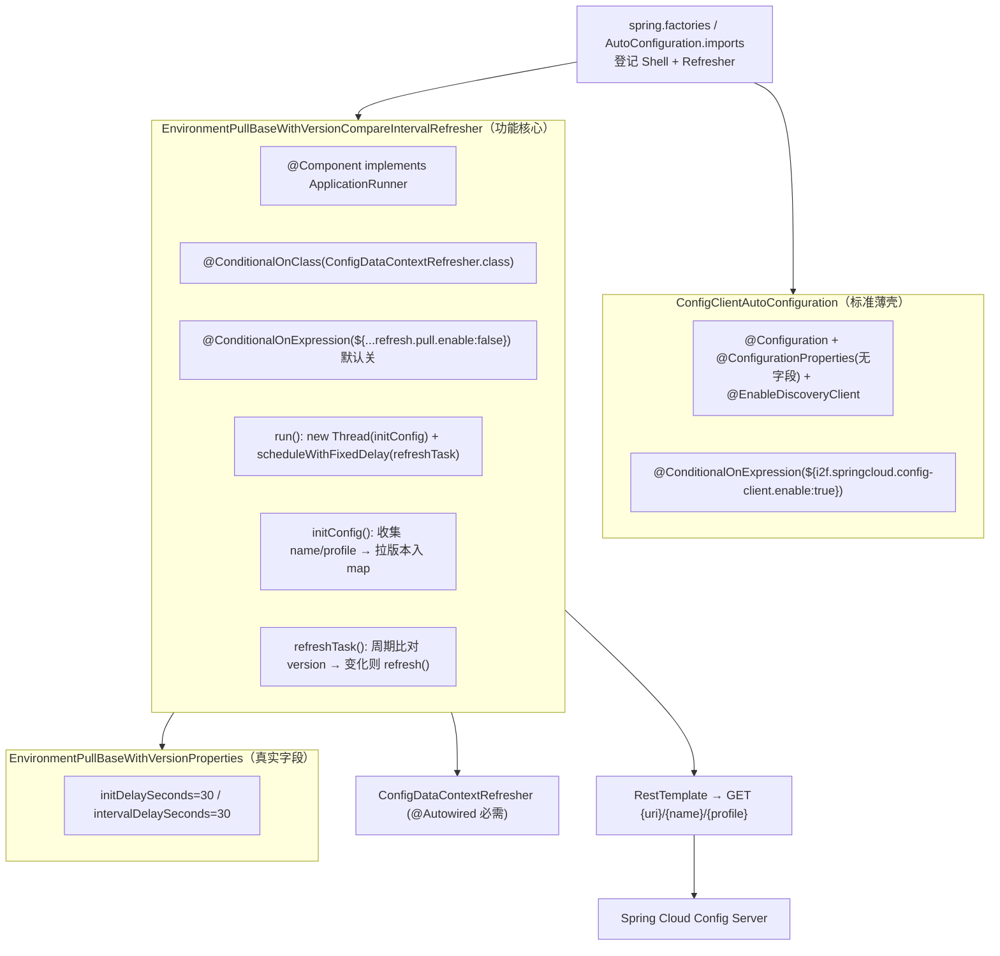

# i2f-springcloud-config-client-starter

## 模块路径

`i2f-springcloud/i2f-springcloud-config-client-starter`

## 模块概述

Spring Cloud 组中面向 **Spring Cloud Config 客户端（配置中心拉取端）** 的装配 Starter（本组第 6 个建档模块，3 个 Java 源文件 + 5 个资源文件，**不含任何 i2f 内部 compile 依赖**，仅 lombok + Spring）。它在把 `org.springframework.cloud:spring-cloud-starter-config` 作为 `provided` 依赖引入、并以布尔开关 `i2f.springcloud.config-client.enable`（默认 `true`）门控一个标准薄壳 `ConfigClientAutoConfiguration` 之外，**额外实现了一个真正有业务价值的组件**：`EnvironmentPullBaseWithVersionCompareIntervalRefresher` —— 一个**基于 Git commit 版本轮询、无需消息总线（RabbitMQ/Kafka）即可让 Config 客户端热更新配置**的自定义刷新器。

其原理是：周期性（默认每 30s）用 `RestTemplate` 直连 Config Server 的 `/{name}/{profile}` 端点，取出返回体 `Environment.version`（即 Git commit SHA），与本模块缓存的版本比对，一旦发现某配置项版本变化，就调用 Spring Cloud 的 `ConfigDataContextRefresher.refresh()` 触发上下文刷新。该功能默认**关闭**（`...refresh.pull.enable:false`，opt-in），需显式开启。它是 i2f-springcloud 组中**功能最完整、且唯一带 `@ConditionalOnClass` 兜底**的接入件，明显优于同组前五个薄壳。

## 模块依赖

### 外部依赖

| 依赖 | scope | 是否 optional | 用途 |
| --- | --- | --- | --- |
| `org.projectlombok:lombok` | provided | 是 | `@Data`/`@Slf4j`/`@NoArgsConstructor` |
| `org.springframework.boot:spring-boot-starter` | provided | 是 | Spring Boot 装配基础 |
| `org.springframework.boot:spring-boot-configuration-processor` | provided | 是 | 生成配置元数据（编译期） |
| `org.springframework.cloud:spring-cloud-starter-config` | provided | **否** | Config 客户端能力 + `ConfigDataContextRefresher` + `Environment`（远程配置模型） |

> 说明：`spring-cloud-starter-config` 版本由根 pom `spring-cloud.version=2021.0.8`（[pom.xml L50](file:///C:/home/dev/java/dev-center/i2f-turbo-java/pom.xml#L50)）+ `spring-cloud-dependencies` BOM（[L102](file:///C:/home/dev/java/dev-center/i2f-turbo-java/pom.xml#L102)）统一治理，本模块 pom 未硬编码版本（与同组 nacos/sentinel 同为较优风格，优于 actuator 家族硬编码 `2.2.3` 错配）。

## 模块设计

设计意图：薄壳类沿用组内统一「放 classpath + 布尔开关即装载」风格；`EnvironmentPullBaseWithVersionCompareIntervalRefresher` 作为 `ApplicationRunner` 在启动后拉起一个单线程调度器，用「拉取版本 + 比对 + 变化才 refresh」的轻量轮询替代 Config 官方依赖消息总线的 Bus 刷新机制。

## 模块目的

让 Config 客户端在**没有搭建 Spring Cloud Bus + 消息中间件**的场景下，仍能通过定时轮询 Config Server 的 Git 版本号自动感知配置变更并刷新 `@RefreshScope`/Environment，降低小型部署的运维成本。

## 模块功能

- `ConfigClientAutoConfiguration`：`i2f.springcloud.config-client.enable`（默认 `true`）门控的薄壳，附带 `@EnableDiscoveryClient`。
- `EnvironmentPullBaseWithVersionProperties`：真实配置项 `i2f.springcloud.config-client.refresh.pull.init-delay-seconds`（默认 30）、`interval-delay-seconds`（默认 30）。
- `EnvironmentPullBaseWithVersionCompareIntervalRefresher`（`i2f.springcloud.config-client.refresh.pull.enable` 默认 `false` 开启）：
  - 启动 `run()` 时以裸线程执行一次 `initConfig()`，并用 `scheduleWithFixedDelay` 按 `initDelaySeconds`/`intervalDelaySeconds` 周期执行 `refreshTask()`；
  - 从 `spring.application.name` 与 `spring.cloud.config.name`（逗号分隔）收集要监听的配置名，结合 `getActiveProfiles()` + `default` 构造 profile 集合；
  - 用 `RestTemplate` GET `{spring.cloud.config.uri}/{name}/{profile}` 取 `Environment.getVersion()`（Git commit SHA），缺失记为哨兵值 `"missing"`；
  - 与 `configFileVersionMap` 缓存版本比对，若某项非 missing 且大小写不敏感不等，则置 `needRefresh` 并调用 `configDataContextRefresher.refresh()` 刷新上下文。
- sample：`application-config-client.properties`（三个开关/间隔示例）、`bootstrap-config-client.properties`（`spring.cloud.config.name`/`uri`/`fail-fast`）。

## 模块主要使用方法

1. 使用方自行声明 `spring-cloud-starter-config`（provided 不传递）。
2. 在 `bootstrap.yaml`/`properties`（Spring Cloud 2021 需 `spring.config.import=optional:configserver:...` 或额外引入 `spring-cloud-starter-bootstrap`）中配 `spring.cloud.config.uri` 指向 Config Server。
3. 设 `i2f.springcloud.config-client.refresh.pull.enable=true` 开启轮询刷新，并按需调 `init-delay-seconds`/`interval-delay-seconds`。
4. 引入后由 `EnvironmentPullBaseWithVersionCompareIntervalRefresher` 自动轮询并热更新。

## 模块特性总结

- **本组唯一真正实现了差异化功能**（免消息总线的版本轮询热更新）的 Starter，具备明确工程增益，而非纯封装。
- **本组唯一为可选依赖加了 `@ConditionalOnClass(ConfigDataContextRefresher.class)` 兜底**的模块，缺类退避意识优于同组。
- 并发数据结构选型得当：`CopyOnWriteArraySet`/`ConcurrentHashMap`/`AtomicBoolean` + `synchronized initConfig()`，刷新逻辑幂等、线程安全基本到位。
- 双层开关语义清晰：`config-client.enable`（整体装载，默认真）与 `refresh.pull.enable`（轮询刷新，默认**关**）职责分离，且功能开闭采用保守的 opt-in。
- 依赖版本经根 BOM `2021.0.8` 治理，无硬编码错配；sample 对三大配置键有翔实注释。

## 模块瑕疵或错误（实证）

1. **【高危·必需 @Autowired 但只门控类存在】** `EnvironmentPullBaseWithVersionCompareIntervalRefresher` 以 `@Autowired`（required=true）注入 `ConfigDataContextRefresher`，但 `@ConditionalOnClass(ConfigDataContextRefresher.class)` 只保证**类**在 classpath、不保证容器中存在该**类型 bean**。`ConfigDataContextRefresher` 由 spring-cloud-context 仅在特定 config-data 策略下创建；一旦 `pull.enable=true` 而环境未产生该 bean，将 `NoSuchBeanDefinitionException` 致启动失败。应以 `@ConditionalOnBean`/`ObjectProvider` 兜底。
2. **【中危·RestTemplate 无超时 → 调度线程可永久阻塞】** L44 `new RestTemplate()` 未设连接/读取超时，而 `scheduleWithFixedDelay` 为单线程；Config Server 卡死时某轮 `refreshTask` 的 GET 会无限期挂住该唯一调度线程，后续所有轮询停摆且无自愈。
3. **【中危·线程与调度器资源泄漏】** L46 `Executors.newSingleThreadScheduledExecutor()` 作为实例字段，无 `@PreDestroy`/`shutdown()`；容器关闭或上下文刷新时线程泄漏。L54 又用裸 `new Thread(...).start()` 跑 `initConfig()`，脱离线程池管理、异常静默吞没，且与 `refreshTask()` 首行的 `initConfig()` 调用重复（靠 `AtomicBoolean` 幂等兜底，但设计冗余）。
4. **【日志 Bug + 反模式】** L111 `log.info("pull config profiles: " + configNameSet)` 文案说 profiles 却打印 `configNameSet`（应为 `profiles`），复制粘贴错；全类日志均用字符串 `+` 拼接而非 `{}` 占位符，绕过惰性求值。
5. **【重复代码】** `initConfig()` 与 `refreshTask()` 中「取 `spring.cloud.config.uri` + 去尾斜杠 + 构造 profile 集合 + RestTemplate GET + 提取 version + missing 兜底」逻辑几乎逐行重复，应抽公共方法。
6. **【自动配置登记非标准 + 双重注册风险】** 两个类均登记进 `EnableAutoConfiguration`（`spring.factories` + `AutoConfiguration.imports` 双通道），但 `EnvironmentPullBaseWithVersionCompareIntervalRefresher` 是 `@Component`、`ConfigClientAutoConfiguration` 是普通 `@Configuration`（非 `@AutoConfiguration`）；将 `@Component` 登记为自动配置项，若宿主又组件扫描命中同包，则该功能组件被双重注册。
7. **【元数据登记不全】** `additional-spring-configuration-metadata.json` 仅登记 `config-client.enable` 一项，真正驱动本模块核心价值的 `refresh.pull.enable`、`refresh.pull.init-delay-seconds`、`refresh.pull.interval-delay-seconds`（均在 sample 使用）**全部未登记**，IDE 补全/校验覆盖不到；`hints` 段仍照抄 `server.servlet.jsp.class-name`、`server.tomcat.accesslog.encoding` 两个跨模块拷贝死条目（全组通病）。
8. **【薄壳冗余 + @EnableDiscoveryClient 过时】** `ConfigClientAutoConfiguration` 无任何成员，`@ConfigurationProperties(prefix="i2f.springcloud.config-client")` 空挂在无字段类上（`enable` 实由 SpEL 直读），`@Data`/`@Slf4j`/`@NoArgsConstructor` 纯装饰；`@EnableDiscoveryClient` 在 Spring Cloud 2021 已非必需（与同组 nacos-starter 一致的时代遗留）。
9. **【scope 不一致 + 不传递】** `spring-cloud-starter-config` 为 `provided` 但**未标 optional**（其余 boot 依赖皆 optional），风格不统一；且 `provided` 不传递给使用方，使用方须自行声明该依赖本 Starter 才有意义。
10. **【sample 与 2021 引导机制脱节】** sample 用 `bootstrap-config-client.properties`（传统 bootstrap 引导），而 Spring Cloud 2021 默认改用 `spring.config.import=configserver:`；照 sample 使用需额外引入 `spring-cloud-starter-bootstrap`（本模块任何 pom 均未声明），否则 bootstrap 配置可能不生效。
11. **【轮询无抖动、放大请求】** 每 `intervalDelaySeconds`（默认 30s）对 `configName × profile` 笛卡尔积逐个 GET，多实例同时部署时无随机抖动，易对 Config Server 形成同步脉冲压力。
12. **【生态孤岛】** 全仓库除自引用、父 pom `<module>` L21 / DM 登记（根 pom L1537）与文档外，无任何模块在 `<dependencies>` 中 compile/test 依赖本 Starter。

## 生态位置

- 位于 i2f-springcloud 组「配置中心」子域，与 `i2f-springcloud-config-server-starter`（服务端，见 wiki.md 能力对照）互为 Config 架构的客户端 / 服务端两端。
- 是本组目前**封装深度最高**的模块：在同组普遍「空壳 + 布尔开关转发」的薄封装中，唯一内建了可独立运作的配置热更新机制，属于对 Spring Cloud Config 原生 Bus 刷新能力缺口的补充实现。
- 版本随根 `spring-cloud-dependencies:2021.0.8` 治理，与同组 Alibaba 三件套（nacos/seata/sentinel）共享一致的 Spring Cloud 2021 基线。
- 目前无真实下游消费方，属可用但尚未被工程接入的自研增强件。
