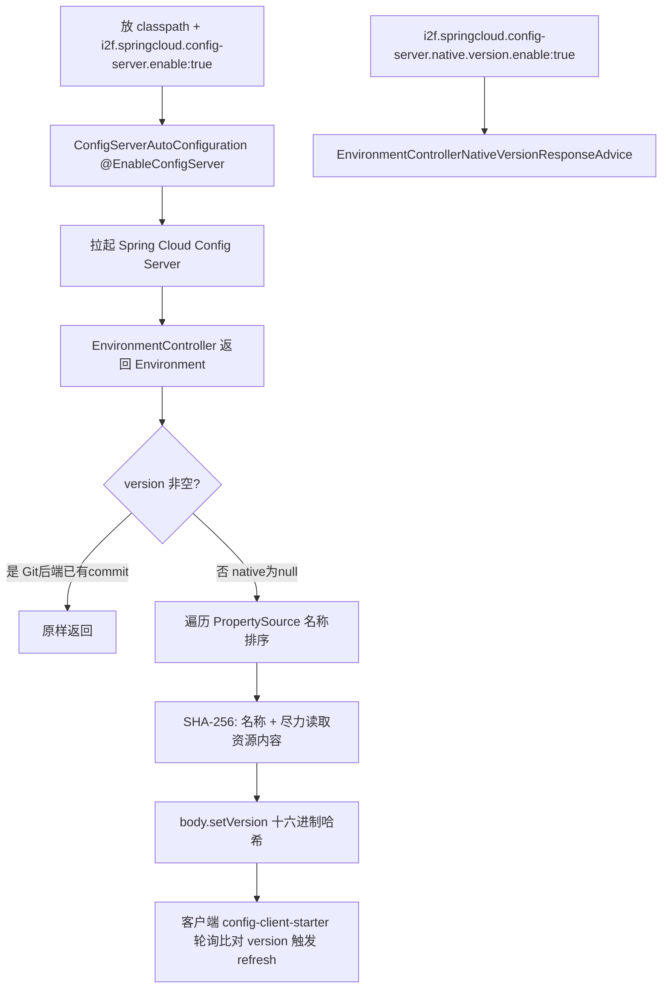

# i2f-springcloud-config-server-starter

## 模块路径

`i2f-springcloud/i2f-springcloud-config-server-starter`

## 模块概述

Spring Cloud 组中面向 **Spring Cloud Config 服务端（配置中心托管端）** 的装配 Starter（本组第 7 个建档模块，2 个 Java 源文件 + 11 个资源文件，**不含任何 i2f 内部 compile 依赖**，仅 lombok + Spring）。它把 `org.springframework.cloud:spring-cloud-config-server` 作为 `provided` 依赖引入，版本由根 pom 的 `spring-cloud-dependencies:2021.0.8` BOM（[pom.xml L50](file:///C:/home/dev/java/dev-center/i2f-turbo-java/pom.xml#L50)/[L102](file:///C:/home/dev/java/dev-center/i2f-turbo-java/pom.xml#L102)）统一治理，无硬编码错配。

它是同组 `i2f-springcloud-config-client-starter` 的**服务端对偶**（一客户端拉取、一服务端托管），并与之构成一组**有真实协同价值**的配合：

- `ConfigServerAutoConfiguration`：标准薄壳——`@Configuration` + `@EnableConfigServer` + 单布尔开关 `i2f.springcloud.config-server.enable`（默认 `true`），「放 classpath 即自动拉起 Config Server」。
- `EnvironmentControllerNativeVersionResponseAdvice`：本模块**真正的功能点**。它是一个 `@RestControllerAdvice implements ResponseBodyAdvice<Environment>`，用于给 **native（本地文件，非 Git）模式**的 Config Server 响应体**合成一个基于配置内容/名称的 SHA-256 版本号（version）**。原因：官方 Config Server 仅在 Git 后端时才会把 commit 填入 `Environment.version`，而 native 本地文件模式下 `version` 恒为 `null`——这恰好让 `config-client-starter` 里那个「读 version 比对、免消息总线轮询刷新」的 `EnvironmentPullBaseWithVersionCompareIntervalRefresher` 无从工作。本 Advice 独立开关 `i2f.springcloud.config-server.native.version.enable`（默认 `true`）补齐这一缺口，使**本地文件配置中心也能被客户端轮询感知热更新**。

`sample/config/*.properties` 附带 9 份 native 模式示范配置文件（actuator/charset/date/db/eureka-client/feign/gzip/log4j/zipkin 各 `-dev.properties`），完整演示 `spring.profiles.active=native` + `search-locations=classpath:/config` 的本地文件配置中心用法。

## 模块依赖

| 依赖 | 类型 | scope | 说明 |
|---|---|---|---|
| `org.projectlombok:lombok` | compile（父 pom 提供） | optional | `@Data`/`@NoArgsConstructor`/`@Slf4j` |
| `org.springframework.boot:spring-boot-starter` | provided | provided+optional | `@ConditionalOnExpression`/`@ConfigurationProperties` |
| `org.springframework.boot:spring-boot-configuration-processor` | provided | provided+optional | 元数据生成 |
| `org.springframework.cloud:spring-cloud-config-server` | 编译 | **provided（未标 optional）** | `@EnableConfigServer`、`Environment`/`PropertySource`；版本由根 BOM 治理 |

> 无 i2f 内部 compile 依赖；`spring-cloud-config-server` 为 provided 且**未标 optional**，provided 本就不具传递性，故使用方须自行在 classpath 补齐 config-server 及其 web 容器。

## 模块设计



## 模块目的

以「引依赖 + 单开关」方式自动拉起 Spring Cloud Config Server，并**额外为 native 本地文件模式补上 Git 模式才有的 version 能力**，与同组 `config-client-starter` 的轮询刷新器配套，实现「不依赖消息总线（RabbitMQ/Kafka）的配置热更新」闭环。

## 模块功能

1. **Config Server 自动装载**：`@EnableConfigServer` 经布尔开关门控，放 classpath 即生效。
2. **native version 合成**：`ResponseBodyAdvice` 拦截返回 `Environment` 的响应，当 `version` 为空时用 `SHA-256(排序后的 PropertySource 名称 [+ 尽力读取的资源内容])` 合成十六进制版本号写回。
3. **双开关独立门控**：`config-server.enable` 控服务端装载，`config-server.native.version.enable` 控 version 注入 Advice。
4. **翔实 sample**：`application-config-server.properties` + 9 份 native `config/*-dev.properties` 演示本地文件配置中心完整设置。

## 模块主要使用方法

```properties
# 放入本 Starter + 自行补齐 spring-cloud-config-server 后
i2f.springcloud.config-server.enable=true
i2f.springcloud.config-server.native.version.enable=true
server.port=7777
spring.application.name=config-server
# 本地文件模式
spring.profiles.active=native
spring.cloud.config.server.native.search-locations=classpath:/config
```

启动类无需任何注解，本 Starter 已 `@EnableConfigServer`。配合 `config-client-starter` 设 `refresh.pull.enable=true`，即可让客户端周期性拉取本 version 并在变化时 `refresh()`。

## 模块特性总结

- **本组功能第二完整、封装有真实协同设计**：不同于前几个纯空壳，本 Advice 是为配套客户端轮询刷新而生的能力补齐，与 config-client-starter 构成闭环。
- 双通道自动装配登记（`spring.factories` + `AutoConfiguration.imports`，两类均登记）。
- 版本经根 BOM `2021.0.8` 治理，无硬编码错配（优于 actuator 家族）。
- native 模式专属补齐，Git 模式因 version 已存在会被 Advice 早退、不受影响。

## 模块瑕疵或错误（实证）

1. **【高危·缺 `@ConditionalOnClass` 兜底 → 缺类崩溃而非优雅退避】** `ConfigServerAutoConfiguration` 携带 `@EnableConfigServer`，而核心依赖 `spring-cloud-config-server` 为 provided 且未标 optional（不传递）。使用方未自行补齐 config-server 时，`config-server.enable` 默认仍 `true`，`@EnableConfigServer` `@Import` 的 config-server 内部配置类引用缺失 → `NoClassDefFoundError` **启动失败**。与同组 `actuator-admin-starter` 同族缺陷，应加 `@ConditionalOnClass(EnableConfigServer.class)`。
2. **【高危·version 哈希对 native classpath 资源实际忽略内容】** Advice 用 `resourceLoader.getResource(name)` 回读内容，但此处 `name` 是 `PropertySource.getName()`（即资源的 `getDescription()`，classpath 资源形如 `Class path resource [config/db-dev.properties]`），`DefaultResourceLoader` **无法解析该描述串** → `getInputStream` 抛异常被 catch → 仅 `digest.update("nop")`。结果：classpath 型 native 源的 version **只由「资源名称列表」决定，不含文件内容**。改动某配置文件的值而不改名，哈希不变 → 客户端轮询 version 不变 → **永不触发 refresh**，恰好击穿本 Advice 的设计目的；而自带 sample 正是 `classpath:/config`，直接受影响。
3. **【中危·`@RestControllerAdvice` 被登记为自动配置】** Advice 是 `@Component` 派生注解类，却同时被登记进 `EnableAutoConfiguration`（双通道）。若宿主组件扫描命中本包 → **同一 Advice 双重注册**，导致对同一 `Environment` 响应重复处理；且把全局拦截器伪装为「自动配置」属装配反模式（同 ops/trace-mdc/websocket 一族，规模虽小但性质相同）。
4. **【中危·每次响应全量重算哈希 + 磁盘 IO】** `beforeBodyWrite` 对每个返回 `Environment` 的请求都遍历所有 `PropertySource` 并尝试 `getInputStream` 读文件计算 SHA-256；native 下 version 恒空故每请求必重算。客户端高频轮询时形成可观磁盘 IO。宜缓存或按后端内容变更事件失效。
5. **【低·`@ConfigurationProperties` 空挂】** `ConfigServerAutoConfiguration` 无任何字段，`@ConfigurationProperties(prefix="i2f.springcloud.config-server")` 不绑定任何东西，`enable` 实由 `@ConditionalOnExpression` 的 SpEL 直读；`@Data`/`@NoArgsConstructor` 施加于空类纯装饰。
6. **【低·关键开关键未登记元数据】** `additional-spring-configuration-metadata.json` 仅登记 `config-server.enable`，而更常用的 `config-server.native.version.enable` **完全未登记**；`hints` 为 `server.servlet.jsp.class-name` / `server.tomcat.accesslog.encoding` 拷贝死条目，与本模块无关。
7. **【低·依赖 scope 不一致 + 双通道冗余】** `spring-cloud-config-server` provided 却未标 optional（与同 pom 两个 boot 依赖 provided+optional 风格不一）；`@EnableAutoConfiguration` 双通道登记在 Boot 2.7 下 `spring.factories` 通道已趋过时，与 `AutoConfiguration.imports` 重复。
8. **【低·`resourceLoader` 可变】** Advice 中 `protected ResourceLoader resourceLoader` 非 final，`@Data` 生成 public setter，运行期可被替换，无必要暴露。
9. **【信息·全仓无消费方】** 除文档与本模块自引用外，全仓无任何模块 compile/test 依赖本 Starter（根 pom 仅 DM 登记），属生态孤岛；其唯一「被需要」体现在与 config-client-starter 的配套设计上。

## 模块生态位置

位于 i2f-springcloud 组「配置中心」子域，是 `i2f-springcloud-config-client-starter` 的**服务端对偶**：客户端负责「轮询 version 比对并 refresh」，本服务端负责「托管配置并为 native 模式合成 version」，两端合力实现免消息总线的配置热更新。体量小（2 源文件）但含真实协同功能，封装意图明显强于纯空壳薄壳 Starter。在本组「注册发现 / 配置中心 / 网关 / 熔断 / 监控」等子域中承担配置中心服务端角色，尚未接入任何真实消费方。
