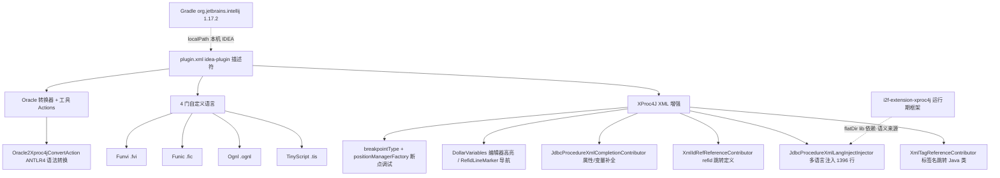

# i2f-jdbc-procedure-idea-plugin

## 模块路径

`i2f-tools/i2f-jdbc-procedure-idea-plugin`

## 模块概述

`i2f-tools` 组中面向 **IntelliJ IDEA 平台的桌面插件（XProc4J 智能开发插件）**（本组第 2 个建档模块）。它是全仓**唯一使用 Gradle + `org.jetbrains.intellij` 插件构建的 JetBrains 平台件**，与 springboot/springcloud 组的运行期 Starter、乃至同组 `i2f-maven-plugin`（构建期 Maven 插件）性质都根本不同——它是一个**安装在 IDE 里、给 XProc4J（XML Procedure for Java）配置文件与多门自定义脚本语言提供智能编辑能力的桌面产品**。

插件 `<id>` 为 `i2f.turbo.jdbc-procedure-plugin`、`<name>` 为 **XProc4J**、`version` `1.0`，`sinceBuild=232`（IDEA 2023.2）/`untilBuild=253.*`，编译目标 **JDK 17**、Kotlin 1.9.22。它规模庞大：**601 个 Java 源文件**（含手工提交的 ANTLR/Grammar-Kit 生成的 PSI/Lexer/Parser），核心 XML 语言注入器单文件即 1396 行。功能覆盖：

- **XProc4J XML 增强**：标签名→Java 实现类 / `refid`→定义 的引用跳转（2 个 `psi.referenceContributor`）、`$变量` 实时高亮（`editorFactoryListener`）、多语言注入（SQL/Java/Groovy/JS/Velocity/JSON/正则/YAML… 注进 XML 标签，`multiHostInjector`）、`refid`/属性值代码补全（5 个 `completion.contributor`）、`<procedure>` DOM 文件描述、行标记导航（3 个 `lineMarkerProvider`）、断点调试（`xdebugger.breakpointType` + `debugger.positionManagerFactory`）、实时模板组、文件模板组、自定义属性不报错（`xml.elementDescriptorProvider`）。
- **4 门自定义语言完整栈**：TinyScript(`.tis`)、Ognl(`.ognl`)、Funic(`.fic`)、Funvi(`.fvi`)——各含 fileType / parserDefinition / syntaxHighlighter / colorSettingsPage / braceMatcher / completion / formatter / folding / debugger。
- **Oracle 语法转换器**：基于 ANTLR4（`OracleGrammar` 生成件）把 PL/SQL 转为 XProc4J / TinyScript / Ognl，右键菜单触发。

## 模块依赖

> 本模块用 Gradle（`build.gradle.kts`）管理依赖，**不经 Maven 根 pom 的 `dependencyManagement` 治理**。

| 依赖（Gradle `implementation`） | 版本 | 作用 |
| --- | --- | --- |
| `org.antlr:antlr4-runtime` | 4.13.2 | Oracle / 自定义语言的 ANTLR 语法解析运行时 |
| `org.apache.velocity:velocity-engine-core` | 2.3（exclude slf4j-api） | VTL 语言注入 / 模板渲染识别 |
| `com.fasterxml.jackson.core:jackson-databind` | 2.13.5 | JSON 注入与配置解析 |
| `com.fasterxml.jackson.datatype:jackson-datatype-jsr310` | 2.13.5 | JSR-310 日期支持 |
| `i2f-extension-xproc4j` | **1.0-jdk8**（`flatDir libs`） | XProc4J 运行期框架本体（常量/标签契约），插件的语义来源 |
| `ognl:ognl` | 3.4.11 | OGNL 语言语法校验 |
| `org.apache.groovy:groovy` | 4.0.18 | Groovy 注入 / 求值 |
| `org.openjdk.nashorn:nashorn-core` | 15.4 | JS 注入 / 求值 |

| IntelliJ 平台依赖（`intellij.plugins` / `plugin.xml <depends>`） | 说明 |
| --- | --- |
| `com.intellij.java` | Java PSI（标签跳转到 Java 类） |
| `com.intellij.database` | SQL 方言注入 |
| `org.intellij.intelliLang` | 语言注入框架 |
| `com.intellij.velocity` | VTL 支持 |
| `org.jetbrains.plugins.yaml` | YAML 注入 |
| `com.intellij.modules.xml`（仅 `<depends>`，gradle 侧被注释） | XML PSI；见瑕疵 8 |

## 模块设计

## 模块目的

把 i2f 生态的 **XProc4J 声明式 XML 存储过程框架**与其配套脚本语言（TinyScript/OGNL/Funic/Funvi）**搬到 IDE 前端**，为开发者提供语法高亮、多语言注入、代码补全、引用跳转、断点调试等「类 Java 级别」的智能编辑体验，降低 XProc4J 配置文件与嵌套脚本的编写门槛。

## 模块功能

- 为 `procedure.xml`（`<procedure>` 根）提供 DOM 描述、`refid` 双向导航、标签名→Java 实现类跳转、`$`/`${}`/`$!{}`/`#{}` 变量高亮。
- 将 SQL（MySQL/Oracle/PostgreSQL/…）、Java、Groovy、JS、Velocity、JSON、正则、YAML 等语言**动态注入**到对应 XML 标签内容；Java 注入自动附加框架相关 import 模板。
- 为 4 门自定义语言提供从词法/语法/高亮/补全/折叠/格式化到断点调试的**完整语言支持栈**。
- 提供大量 **Live Templates**（结构标签、Java 块、SQL 操作、并发/文件/事件模板等）与文件模板。
- 提供 **Oracle → XProc4J/TinyScript/OGNL** 语法转换器（右键菜单）。

## 模块主要使用方法

1. `gradlew buildPlugin`（需本机能访问 `intellij.localPath` 指向的 IDEA 安装目录，见瑕疵 2）。
2. 产物在 `build/distributions/jdbc-procedure-plugin-1.0.jar`（zip 形式）。
3. IDE 内 `Settings → Plugins → Install Plugin from Disk…` 安装并重启。
4. 打开 `.xml`（procedure）/`.tis`/`.ognl`/`.fic`/`.fvi` 文件即获得对应语言增强；右键 `XProc4J Tools` 组使用转换/测试动作。

## 模块特性总结

- 全仓**唯一 JetBrains 平台桌面插件**、**唯一 Gradle 构建件**，规模（601 Java 文件）远超任何 Spring starter。
- 功能**真实且完整**——非空壳代理，而是覆盖「语言注册 + 注入 + 补全 + 导航 + 调试 + 语法转换」的重量级 IDE 工具。
- 与运行期 `i2f-extension-xproc4j` 构成「框架 / IDE 前端」配对：插件语义直接依赖框架的标签/属性常量。

## 模块瑕疵或错误（实证）

> 以下均经通读 `build.gradle.kts`、`settings.gradle.kts`、`gradle.properties`、`plugin.xml`、`plugin-intro.md`、核心 `JdbcProcedureXmlLangInjectInjector.java`、`i2f-tools/pom.xml`、`.gitignore` 及目录/grep 实证，非臆测。

1. **完全游离于 Maven reactor 之外**：本模块是 Gradle 工程、无 `<parent>`，且 `i2f-tools/pom.xml` 的 `<modules>` 仅列 `i2f-tools-source-copier`——根聚合 `mvn install` 永不编译它。`version=1.0` 脱离全仓 `1.0-jdk8` 约定，`group=i2f.turbo` 却走独立 Gradle 仓库坐标。

2. **硬编码本机 IDEA 安装路径、构建不可移植（高危）**：`build.gradle.kts` L50-52 用 `localPath.set("C:\\Program Files\\JetBrains\\IntelliJ IDEA 2024.1")`（另有一行注释的 `D:\\...\\2024.2.1`），并把标准的下载式 `version.set("2023.2.5")`/`type.set("IC")` 注释掉。换机器/CI 若无同路径 IDEA 即构建失败；作者以 `// TODO 不使用下载，直接使用本地安装目录` 自认此为临时手段。

3. **仓库硬编码阿里云镜像、中央仓库被注释**：`build.gradle.kts` L10-15 与 `settings.gradle.kts` L2-9 均把 `mavenCentral()` 注释、改用 `https://maven.aliyun.com/repository/public`，并留 `// TODO 切换中央仓库`。网络环境受限时不可切换。

4. **`lib/` 目录缺失且未被 `.gitignore` 排除 → 内部依赖不可解析（构建可复现性破坏）**：`build.gradle.kts` L18-20 声明 `flatDir { dirs("lib") }`、L33 `implementation(":i2f-extension-xproc4j:1.0-jdk8")`，但仓库内**并无 `lib/` 目录**（Glob 命中 0），`.gitignore` 也未排除它。`i2f-extension-xproc4j` 是 i2f 内部件、不在阿里云/中央仓，故**干净克隆无法解析该依赖**，须开发者手工把 jar 放进 `lib/` 或先本地发布，否则 `buildPlugin` 直接失败。

5. **自带 `plugin-intro.md` 与构建描述符版本矛盾**：intro 声称「最低版本要求 IDEA >= 2021.1」并给出安装示例文件名 `jdbc-procedure-plugin-2021.1-211.jar`；但 `build.gradle.kts` `patchPluginXml` 设 `sinceBuild="232"`（即 2023.2+），产物实际名为 `jdbc-procedure-plugin-1.0.jar`。文档严重滞后于描述符，按 intro 找的 jar 名/兼容版本均不符。

6. **`plugin-intro.md` 依赖模块清单漂移**：intro「技术架构」列出的平台依赖遗漏了 `plugin.xml` 实际 `<depends>` 的 `org.jetbrains.plugins.yaml` 与 gradle 侧的 `org.intellij.intelliLang`；文档维护未随注册项更新。

7. **四处命名不一致**：目录名 `i2f-jdbc-procedure-idea-plugin`、Gradle `rootProject.name="jdbc-procedure-plugin"`（决定产物名）、`plugin.xml <name>` 为 `XProc4J`、`<id>` 为 `i2f.turbo.jdbc-procedure-plugin`。同一模块四种称谓，检索与市场展示易混淆。

8. **XML 模块运行期声明与构建期供给不一致**：`plugin.xml` L37 `<depends>com.intellij.modules.xml</depends>`（运行期强依赖 XML），但 `build.gradle.kts` L59 把 `"com.intellij.modules.xml"` 注释掉未纳入 `intellij.plugins`——编译期 IDE 依赖供给与插件声明的运行时依赖不对齐。

9. **大量生成代码手工提交进 `src` 而非构建期再生**：`OracleGrammarParser.java`(3047 行)、`FunicParser.java`(2268 行)、`_FunicLexer.java`(1676 行) 等 ANTLR/Grammar-Kit 产物连同 `.g4`/`.flex` 源一并放在 `src/main/java`，无 grammar-kit 生成任务。源与产物并存、无自动再生约束，易漂移（改 `.g4` 后忘重生成）。

10. **静态块启动常驻守护轮询线程**：`JdbcProcedureXmlLangInjectInjector` 的 `static {}` 调 `startRefreshThread()`，起了一个 `while(true)` 每 15s 遍历全局 `Language.getRegisteredLanguages()` 的守护线程（L86-103），在 IDE 插件生命周期内永不退出；且注入模板 `EVAL_JAVA_IMPORTS_TEMPLATE` 大量引用 `i2f.jdbc.procedure.*` 等运行期类，须用户工程 classpath 具备框架方能真正解析。

11. **调试用 main 挂在 main 源集**：`src/main/java/i2f/test/` 下 `TestFunicDebugger`/`TestJdbcProcedureDebugger`/`TestTinyScriptDebugger` 为开发期调试入口，随插件一起打包（宜移入 test 源集或剔除）。

12. **大量注释死配置残留**：`plugin.xml` L45 被注释的 `fileType`、L92-95 的 VTL `completion.contributor`、L99-104 的 `referenceContributor`/`findUsagesProvider`，及 gradle 侧多处注释块，均属未清理的历史遗留。

## 生态位置

- 本模块是运行期框架 **`i2f-extension-xproc4j`** 的 **IDE 前端伴随件**，也是 **`i2f-jdbc-procedure` / `i2f-jdbc-proxy-xml`** 存储过程/XML 框架的智能编辑入口；其语义、常量、标签契约直接建立在框架之上。
- 它**自成产品**（经 `buildPlugin` 打包供 IDE 安装），不被任何其它模块以依赖方式 compile 消费——与 springcloud 组「被消费」的 starter 相反，本件是「被安装使用」的终端工具。
- 在 `i2f-tools` 组内，与 `i2f-maven-plugin`（构建期 SPI 生成）并列，但性质更重：一个是命令行构建插件，一个是图形化 IDE 插件；本件是全仓**规模最大、唯一 Gradle/JetBrains 平台**的工具件。
