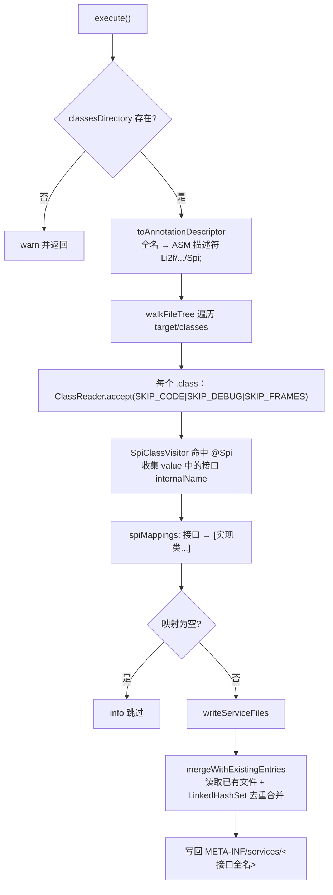

# i2f-maven-plugin

> i2f 构建期 Maven 插件模块，提供 `i2f:spi` 目标（Mojo），在 `process-classes` 阶段基于 ASM 扫描编译产物中标注 `@Spi` 的 class 文件，自动为声明的 SPI 接口生成并合并 `META-INF/services/` 服务描述文件，免除手工维护 Java SPI 配置。

## 模块路径

- `i2f-tools/i2f-maven-plugin`

## 模块依赖

| GroupId | ArtifactId | Scope | Optional | 说明 |
|---------|-----------|-------|----------|------|
| org.apache.maven | maven-plugin-api | provided | false | Maven 插件 API（`AbstractMojo`、`MojoExecutionException`） |
| org.apache.maven.plugin-tools | maven-plugin-annotations | provided | false | Mojo/参数注解（`@Mojo`、`@Parameter`、生命周期与依赖解析枚举） |
| org.apache.maven | maven-project | provided | false | `MavenProject` 模型，提供 `${project.build.outputDirectory}` 等参数注入 |
| org.ow2.asm | asm | compile | false | 字节码读取，解析 class 文件中的 `@Spi` 注解及其 `value` 接口列表 |

> 本模块为**独立构建**的 Maven 插件：`groupId=i2f.turbo`、`artifactId=i2f-maven-plugin`、`version=1.0`、`packaging=maven-plugin`，**未继承仓库根 `i2f-turbo-java` 父 POM**，自行声明编译级别（source/target 8、UTF-8）。Maven 相关依赖均为 `provided`（由 Maven 运行期提供），仅 ASM 为 `compile` 随插件打包。

## 模块设计

### 单 Mojo 职责

模块目前仅一个 Mojo —— `SpiComponentScanMojo`，绑定到 `i2f` goal 前缀下的 `spi` 目标：

| 维度 | 取值 | 说明 |
|------|------|------|
| Goal | `i2f:spi` | `@Mojo(name="spi")` + `<goalPrefix>i2f</goalPrefix>` |
| 默认生命周期阶段 | `PROCESS_CLASSES` | 编译之后、打包之前，此时 `target/classes` 已产出 `.class` |
| 依赖解析要求 | `ResolutionScope.COMPILE` | 需要编译期类路径 |
| 扫描目录 | `${project.build.outputDirectory}` | 只读参数，默认 `target/classes` |
| 注解全名 | `spi.annotation`（默认 `i2f.spi.annotations.Spi`） | 可通过系统属性覆盖，支持扫描其它 SPI 注解 |

### 处理流水线



### 关键设计点

1. **纯字节码扫描，不加载类**：使用 ASM 以 `ClassReader.SKIP_CODE | SKIP_DEBUG | SKIP_FRAMES` 模式读取 class，仅解析类头与注解，不触发类加载，快且无副作用；这也要求绑定在编译之后的阶段。

2. **兼容单值与数组两种注解写法**：`SpiAnnotationValueCollector` 同时重写 `visit`（单值 `@Spi(A.class)`）与 `visitArray`（数组 `@Spi({A.class, B.class})`），统一从 `Type.getInternalName()` 提取接口并把 `/` 转 `.`。

3. **与手写配置合并而非覆盖**：`mergeWithExistingEntries` 先读已存在的 `META-INF/services/<接口>`（忽略空行与 `#` 注释行），再用 `LinkedHashSet` 保序去重合并扫描结果，保证手工登记的 provider 不被丢失，且幂等可重复执行。

4. **可插拔的注解契约**：目标注解全名由 `spi.annotation` 参数化，默认对接 `i2f-spi-annotations` 的 `@Spi`，但不硬编码依赖该模块（无编译期依赖，纯字符串约定），因此也可适配同名结构的其它 SPI 注解。

### 包结构

| 包 / 类 | 角色 | 说明 |
|---------|------|------|
| `i2f.maven.plugin.spi.SpiComponentScanMojo` | Mojo 入口 | 扫描 + 生成/合并服务文件全流程 |
| `↳ SpiClassVisitor`（内部类） | ASM ClassVisitor | 识别目标注解、记录类名与接口 internalName |
| `↳ SpiAnnotationValueCollector`（内部类） | ASM AnnotationVisitor | 提取注解 `value` 的类引用（单值/数组） |
| `↳ SpiAnnotationInfo`（内部类） | 数据载体 | 保存单个类的实现类名与其提供的接口列表 |

## 模块目的

- 用构建期自动化替代「手写并同步 `META-INF/services/` 文件」的易错劳动，让 `@Spi` 声明与 Java SPI 运行时约定保持一致。
- 与 `i2f-spi-annotations`（注解契约）、`i2f-spi`（`ServiceLoader` 运行期加载）形成「声明 → 构建期生成 → 运行期加载」的完整 SPI 闭环。
- 保证增量与幂等：多次构建、与手工条目共存均不破坏既有注册。

## 模块功能

- 扫描 `target/classes` 下所有 `.class`，识别标注目标 SPI 注解（默认 `@Spi`）的类。
- 为注解 `value` 中声明的每个接口收集其实现类，构建「接口 → 实现列表」映射。
- 在 `target/classes/META-INF/services/` 下按接口全名生成描述文件，并与已有条目去重合并。
- 输出每个已注册实现的构建日志；无命中时安全跳过。

## 模块主要使用方法

在业务模块的 `pom.xml` 中引入插件（打包阶段自动生效，也可显式执行）：

```xml
<build>
    <plugins>
        <plugin>
            <groupId>i2f.turbo</groupId>
            <artifactId>i2f-maven-plugin</artifactId>
            <version>1.0</version>
            <executions>
                <execution>
                    <goals>
                        <goal>spi</goal>
                    </goals>
                </execution>
            </executions>
        </plugin>
    </plugins>
</build>
```

配合注解使用：

```java
@Spi({PaymentService.class, NotificationService.class})
public class AlipayServiceImpl implements PaymentService, NotificationService { }
```

构建后自动生成：

- `META-INF/services/com.example.PaymentService` → 含 `com.example.AlipayServiceImpl`
- `META-INF/services/com.example.NotificationService` → 含 `com.example.AlipayServiceImpl`

命令行单独执行：

```bash
mvn i2f:spi
# 覆盖扫描的注解类型：
mvn i2f:spi -Dspi.annotation=com.mycompany.MySpi
```

注意事项：

- 插件依赖编译产物，务必在 `mvn compile` 之后执行（正常生命周期中 `process-classes` 阶段自动满足）。
- 若 `@Spi` 的接口写成了非服务类型，生成的描述文件将无法被对应 `ServiceLoader` 命中。
- 目标注解需为 `RUNTIME` 保留且写入 class 常量池，否则 ASM 无法读取；默认 `@Spi` 已满足。
- 本模块独立版本 `1.0`，不随父工程聚合构建，需单独 `mvn install` 后方可被消费。

## 模块特性总结

- 单目标插件 `i2f:spi`，聚焦「SPI 服务文件自动生成」单一职责。
- 基于 ASM 的零类加载字节码扫描，绑定 `process-classes` 阶段，快速无副作用。
- 兼容 `@Spi(A.class)` 与 `@Spi({A.class, B.class})` 两种声明形式。
- 与已有服务文件去重合并、幂等可重复构建，保留手工登记的 provider。
- 目标注解类型可通过 `spi.annotation` 参数化，契约式解耦、不硬依赖注解模块。
- 与 `i2f-spi-annotations` / `i2f-spi` 协同，构成声明式 SPI 的构建期枢纽。
