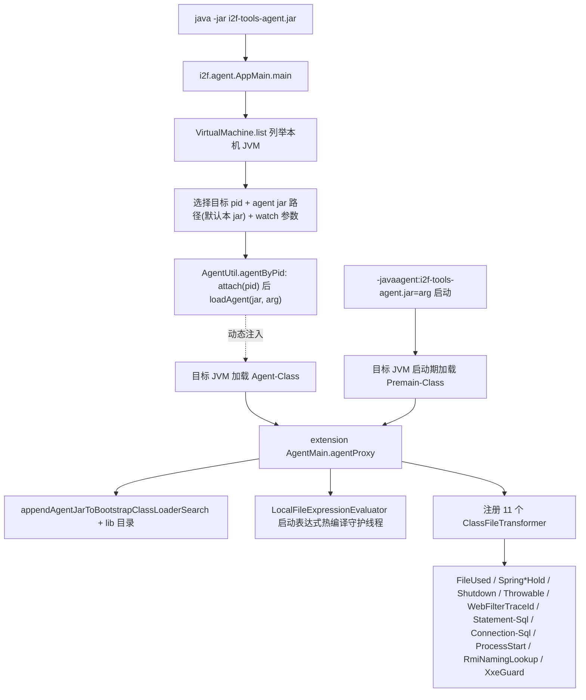

# i2f-tools-agent

> Java Agent 可执行发行壳（`i2f-tools` 组装档模块，**零自研源码、纯 pom 打包件**）：把 `i2f-extension-agent-javassist` 的 Javassist 运行时增强引擎（`AgentMain` + 11 个 `ClassFileTransformer`）经 `maven-assembly-plugin` 打成单一 `jar-with-dependencies`，并在清单里同时声明「可执行入口」与「Agent 入口」两种身份——既能 `java -jar i2f-tools-agent.jar` 启动一个交互式「列举本机 JVM → 选中 → 动态 attach 注入自身」的投放器（`Main-Class=i2f.agent.AppMain`），又能作为 `-javaagent` / `loadAgent` 的目标 agent 包（`Premain-Class`/`Agent-Class=i2f.extension.agent.javassist.AgentMain`）。是 `i2f-tools` 组里唯一以「字节码增强 / 无侵入运行时观测」为卖点的发布件。

## 模块路径

- `i2f-tools/i2f-tools-agent`

## 模块依赖

> 本模块 `pom.xml` **无任何 `src` 源码目录**，只有一个 78 行的构建描述。它保留正常 `<parent>i2f-tools</parent>`（与同为壳件但注释掉 parent 的 `i2f-tools-ops` 不同），版本 `1.0-jdk8` 继承父 pom。

| 依赖 | Maven 坐标 | scope | optional | 说明 |
| --- | --- | --- | --- | --- |
| i2f-extension-agent-javassist | `i2f.turbo:i2f-extension-agent-javassist` | compile | 否 | **唯一实质功能来源**：Javassist 版 `AgentMain` 与全部 `ClassFileTransformer`、`AgentContextHolder`、`LocalFileExpressionEvaluator` 都来自此模块 |
| javassist | `org.javassist:javassist` | compile（本地重声明） | 否 | 版本 `3.28.0-GA`；上游 extension 把它定为 `provided` 不打入包，本壳在自身 pom **重新声明为 compile**，使 `jar-with-dependencies` 能把字节码操作运行时打进自包含 fat jar |
| lombok | `org.projectlombok:lombok` | 由根 DM 治理 | 是 | 本壳零源码，无任何注解使用，属纯冗余声明 |

### 传递依赖（随 extension 一并 compile 打入 fat jar）

- `i2f.turbo:i2f-agent`：提供 `i2f.agent.AgentUtil`（attach / transformer 注册 / 参数解析工具）与 **清单 `Main-Class` 指向的 `i2f.agent.AppMain`**、以及简易版 `i2f.agent.AgentMain`。
- `i2f.turbo:i2f-extension-javassist`：`JavassistUtil` 字节码工具。
- `i2f.turbo:i2f-compiler`：`MemoryCompiler`，供 `LocalFileExpressionEvaluator` 热编译本地表达式。
- `i2f.turbo:i2f-jvm`（`JvmUtil.getPid`）、`i2f.turbo:i2f-match`（`StringMatcher` ant 匹配）等经 `i2f-agent` 传递进入。

> 关键构建事实：`com.sun:tools:1.8.0`（`tools.jar`，提供 `com.sun.tools.attach.VirtualMachine`）在 `i2f-agent` 与 extension 中均为 **`system` scope**（`systemPath=${java.home}/lib/tools.jar`）。`maven-assembly-plugin` 的 `jar-with-dependencies` **不会打入 system 依赖**，故本 fat jar 不含 `tools.jar`。

## 模块设计

本模块的全部「设计」其实是两段 pom 配置——依赖收敛 + 清单双入口。真实运行时逻辑复用上游 extension。

### 清单双身份（核心特征）

`maven-assembly-plugin` 的 `<manifestEntries>` 让同一个 jar 具备两种执行形态：

| 清单字段 | 值 | 触发的入口类 | 来源 |
| --- | --- | --- | --- |
| `Main-Class` | `i2f.agent.AppMain` | 交互式 JVM 投放器（`java -jar`） | `i2f-agent`（传递依赖） |
| `Premain-Class` | `i2f.extension.agent.javassist.AgentMain` | `-javaagent` 启动期挂载 | extension |
| `Agent-Class` | `i2f.extension.agent.javassist.AgentMain` | `VirtualMachine.loadAgent` 运行期挂载 | extension |
| `Can-Redefine-Classes` | `true` | 允许重定义类 | — |
| `Can-Retransform-Classes` | `true` | 允许 retransform 已加载类 | — |
| `Class-Path` | `. ./resources/` | 相对 classpath 约定 | — |

### 装配产物

- `finalName=${project.artifactId}` + `appendAssemblyId=false` + `descriptorRef=jar-with-dependencies`：assembly 输出**直接覆盖**主构建产物 `target/i2f-tools-agent.jar`，得到的是一个自包含 fat jar（无 `-jar-with-dependencies` 分类器区分）。

### 双入口运行流程（mermaid）

## 模块目的

- 把「一个需要复杂手动打包（收集依赖 + 写 agent 清单 + 保证 javassist 在类路径）的 Java Agent」固化成 `mvn package` 一步产出的可分发单文件。
- 让同一个 jar 既是「投放器」又是「被投放物」，降低演示与自助接入门槛：无需理解 `-javaagent` 参数拼接，`java -jar` 即可把增强引擎热注入到本机任意运行中的 JVM。

## 模块功能

作为 `i2f-extension-agent-javassist` 的发行载体，本壳产出的 fat jar 提供：

- **启动期挂载**：`-javaagent:i2f-tools-agent.jar=<arg>`，进入 `AgentMain.premain`。
- **运行期动态挂载**：`AppMain` 交互式选 JVM 后 `loadAgent`，进入 `AgentMain.agentmain`。二者最终都走 `agentProxy`，行为一致。
- **无侵入运行时观测/增强**（由 `agentProxy` 注册并生效的 11 个 transformer 提供）：文件访问、SQL 执行（`Statement`/`Connection`）、进程 `ProcessBuilder` 启动、RMI `lookup`、URL 连接、Spring 上下文/Bean 捕获、JVM shutdown 记录、Throwable 记录、Web Filter 线程 traceId 注入、XXE 防护改写等；另附本地表达式文件 `./expression/expression.java` 的定时热编译执行调试通道。

## 模块主要使用方法

- **打包**：`mvn -pl i2f-tools/i2f-tools-agent -am package`（模块被 reactor 注释，需 `-f` 指定其 pom 或单独进入目录 `mvn package`）。产物为 `target/i2f-tools-agent.jar`。
- **投放到运行中的 JVM（动态 attach）**：`java -jar target/i2f-tools-agent.jar`，按提示选进程序号、确认 agent jar（默认自身）、输入 watch 参数（示例 `args,ret,stat@com.i2f.**&stat@java.util.**`）。
  - 前置：attach 目标须与本机 JDK 可互挂；因 `tools.jar` 为 system 依赖未打包，运行本 jar 的 JVM 须能在 bootclasspath 提供 `com.sun.tools.attach`（即 JDK8 的 `lib/tools.jar`）。
- **作为启动参数挂载**：`java -javaagent:target/i2f-tools-agent.jar=<arg> -jar your-app.jar`。
- **注意**：清单 `Main-Class` 是**投放器演示工具**，不是 agent 本体；agent 本体是 `Premain-Class`/`Agent-Class` 指向的 extension `AgentMain`。

## 模块特性总结

- **零源码纯打包壳**：功能 100% 委托 `i2f-extension-agent-javassist`，本壳只负责「收依赖 + 写清单 + 出 fat jar」。
- **单 jar 双入口**：可执行投放器与 javaagent 共存于一个发行件。
- **Bloat-but-self-contained**：重声明 javassist 为 compile 以自包含，代价是把字节码增强运行时全量打入。
- **全静态观测能力来自上游**：本模块不参与任何 transformer 逻辑实现。

## 模块瑕疵或错误

> 仅静态识别问题/潜在问题，未做运行实证。

1. **【游离 reactor】** `i2f-tools/pom.xml` 的 `<modules>` 里 `i2f-tools-agent` 被注释，不参与默认聚合构建，与 `source-copier`（唯一在册）不同，需手动单独构建，易被 CI 漏建。
2. **【Main-Class 依赖非显式】** 清单 `Main-Class=i2f.agent.AppMain` 所在 `i2f-agent` **并非本 pom 的直接依赖**，仅经 `i2f-extension-agent-javassist → i2f-agent` 传递而来；一旦上游调整依赖，可执行入口会静默失效。声明运行入口的模块未直接声明其来源依赖，属脆弱耦合。
3. **【同名双 AgentMain 易混】** 类路径同时存在 `i2f.agent.AgentMain`（仅注册 `SystemLoadedClassesPrintTransformer` 的简易版）与 `i2f.extension.agent.javassist.AgentMain`（注册 11 个 transformer 的完整版）。清单只引用后者，前者在本发行件内成为「随包携带但永不激活」的死代码，读者极易挂错。
4. **【javassist 版本本地硬编码】** `3.28.0-GA` 在本 pom 重新写死，未走根 dependencyManagement 统一，与上游 extension 的同版本声明重复，存在版本漂移/不一致风险。
5. **【tools.jar system 依赖未打包且布局写死】** attach 能力依赖 `com.sun:tools` 的 `${java.home}/lib/tools.jar`（JDK8 专有布局），assembly 不打包 system scope；在 JRE 或 JDK9+ 环境运行时 `AppMain` 的动态 attach 会因缺 `com.sun.tools.attach` 失败，可移植性受限。
6. **【fat jar 覆盖主产物、污染下游】** `appendAssemblyId=false` 使 `jar-with-dependencies` 覆盖 `i2f-tools-agent.jar` 本体；若该坐标被其它模块当依赖引用，会把 javassist 等全部传递类混入，缺乏 `-shaded`/classifier 隔离，易造成下游 classpath 类冲突。
7. **【Class-Path 空约定】** 清单声明 `./resources/`，但模块无任何源码与 resources 目录，相对 classpath 完全依赖运行时工作目录提供，本壳内无对应内容支撑。
8. **【XXE 改写为全局副作用】** 引擎侧 `XxeGuardClassTransformer` 对 `javax.xml.parsers.DocumentBuilderFactory`/`SAXParserFactory`/`XMLInputFactory` 的 `newInstance()` 及 Spring `SourceHttpMessageConverter` 注入禁用外部实体/DTD 的字节码改写，会影响宿主进程内**所有** XML 解析，正常依赖 DTD/实体的场景可能被误伤（属引擎行为，经本壳放大到任意被注入 JVM）。
9. **【调试后门风险】** 引擎的 `LocalFileExpressionEvaluator` 守护线程每 3s 轮询 `./expression/expression.java` 并用 `MemoryCompiler` 动态编译执行任意 Java 表达式；经本 fat jar 注入生产 JVM 后等同于一个可读写的运行时执行通道，安全性敏感场景须评估。
10. **【观测输出走 System.out】** `agentProxy` 及各 transformer 生命周期大量使用 `System.out.println` 直打，agent 注入宿主后直接污染标准输出而非受管日志。
