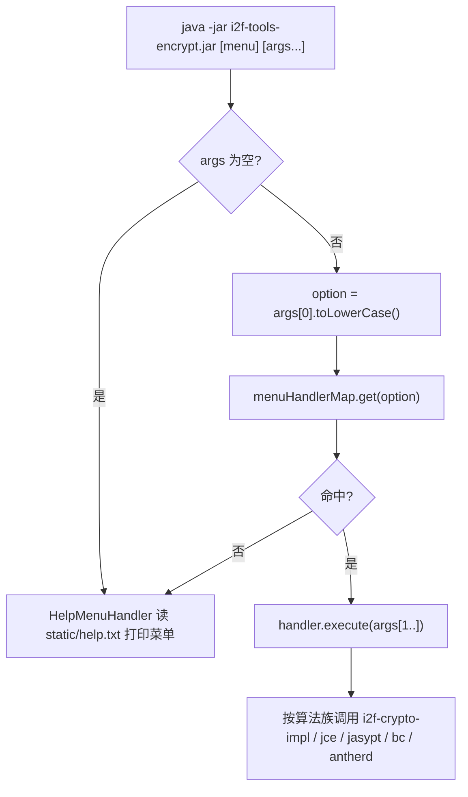

# i2f-tools-encrypt

> 命令行加解密 / 编解码一体化工具壳（`i2f-tools` 组装档模块，**纯 `main` 分发件、零自研密码算法**）：以一个 `IMenuHandler` 契约 + 静态注册表 `menuHandlerMap`，把 JDK 原生编码、`i2f-crypto-impl` 摘要/HMAC/AES/RSA、Spring Security `PasswordEncoder`、jasypt、BouncyCastle 国密、antherd sm-crypto 国密等 **约 104 个算法入口**统一收敛为「`java -jar i2f-tools-encrypt.jar <菜单名> [参数...]`」的单发式命令行操作，无参数时打印 `help.txt` 菜单。它是 `i2f-tools` 组里唯一以「密码学 / 编解码速查」为卖点的自包含 fat jar 发布件。

## 模块路径

- `i2f-tools/i2f-tools-encrypt`

## 模块依赖

> 本模块 pom **未列入** `i2f-tools/pom.xml` 的 `<modules>`（该处被注释），是一个游离于 Maven reactor 之外、需手工单独构建的独立发布件。内部依赖（i2f）排在前面，三方依赖其后。所有依赖均走默认 `compile`（未显式声明 scope/optional），并全部打入 fat jar。

### 内部依赖（i2f）

| 依赖 | Maven 坐标 | scope | optional | 说明 |
| --- | --- | --- | --- | --- |
| i2f-crypto-impl | `i2f.turbo:i2f-crypto-impl` | compile | 否 | 提供 `MessageDigester`/`HmacMessageDigester`/`Encryptor`/`SymmetricEncryptor`/`AsymmetricEncryptor`/`AesType`/`RsaType` 等 JDK 密码学门面，是 digest/hmac/jce 三族菜单的实质实现来源 |
| i2f-codec-impl | `i2f.turbo:i2f-codec-impl` | compile | 否 | 提供 `CodecUtil`（`toHexString`/`toBase64`/`toUtf8`）与 `UCodeStringCodec` 等字符串编解码器，几乎每个 handler 的结果格式化都依赖它 |
| i2f-extension-jce-bc | `i2f.turbo:i2f-extension-jce-bc` | compile | 否 | BouncyCastle 封装：`BcMessageDigester`/`BcHmacMessageDigester`/`BcSm2Encryptor` 等，`bc-*` 族菜单的实现来源 |
| i2f-extension-jce-sm-antherd | `i2f.turbo:i2f-extension-jce-sm-antherd` | compile | 否 | antherd sm-crypto 封装：`Sm2Encryptor`/`Sm3Digester`/`Sm4Encryptor`，`antherd-sm*` 族菜单实现来源 |
| i2f-resources | `i2f.turbo:i2f-resources` | compile | 否 | 提供 `ResourceUtil.getClasspathResourceAsString`，`HelpMenuHandler` 据此读取 `static/help.txt` 打印菜单 |

### 三方依赖

| 依赖 | Maven 坐标 | scope | optional | 说明 |
| --- | --- | --- | --- | --- |
| BouncyCastle Provider | `org.bouncycastle:bcprov-jdk15to18:1.74` | compile | 否 | 供 `i2f-extension-jce-bc` 运行；`jdk15to18` 线兼容 JDK8 |
| BouncyCastle Provider | `org.bouncycastle:bcprov-jdk15on:1.64` | compile | 否 | **与上面 1.74 同 artifactId 线（`bcprov`）并存**，版本 1.64/1.74 双份打入，存在类冲突隐患（见瑕疵） |
| BouncyCastle PKIX | `org.bouncycastle:bcpkix-jdk15on:1.64` | compile | 否 | 证书/PKIX 扩展包，本模块源码未直接使用，疑为冗余携带 |
| sm-crypto | `com.antherd:sm-crypto:0.3.2.1-RELEASE` | compile | 否 | 纯 Java 国密 SM2/SM3/SM4 实现，供 antherd 扩展运行 |
| spring-security-core | `org.springframework.security:spring-security-core:5.3.6.RELEASE` | compile | 否 | 引入 Spring Security 基础包（体量大），实际只需 crypto 子集 |
| spring-security-crypto | `org.springframework.security:spring-security-crypto:5.3.6.RELEASE` | compile | 否 | 提供 `BCryptPasswordEncoder`/`Argon2PasswordEncoder`/`Pbkdf2PasswordEncoder`/`SCryptPasswordEncoder`/`MessageDigestPasswordEncoder`/`LdapShaPasswordEncoder`/`Md4PasswordEncoder`/`NoOpPasswordEncoder`，`pe-*` 族菜单实现来源 |
| jasypt-spring-boot | `com.github.ulisesbocchio:jasypt-spring-boot:2.1.1` | compile | 否 | 引入 jasypt 及 Spring Boot 集成，`jasypt-*` 族菜单（`StandardPBEStringEncryptor`/`BasicTextEncryptor`/`StrongTextEncryptor`）实现来源；被注释掉的 `jasypt-spring-boot-starter` 是其超集 |

## 模块设计

模块采用「**单一契约接口 + 中央静态注册表 + 命令名字符串分发**」的极简插件式结构，无任何第三方 CLI 框架：

- `i2f.tools.encrypt.IMenuHandler`：唯一契约，仅两个方法——`String name()`（菜单命令名，如 `base64-en`、`md5`、`bc-sm2-keygen`）与 `void execute(String[] args)`（承载逻辑，`args` 为去掉命令名后的剩余参数）。
- `i2f.tools.encrypt.CryptMain`：入口兼注册中心。`static {}` 块内以 `addMenuHandler(new XxxMenuHandler())` 逐个把约 104 个 handler 注册进 `ConcurrentHashMap<String, IMenuHandler> menuHandlerMap`（key = `name()`）。`main` 逻辑：无参 → 默认执行 `help`；有参 → `args[0].toLowerCase()` 查表，命中即 `handler.execute(去掉首参的剩余数组)`，未命中回退 `helpHandler`；整段包 `try/catch` 打印堆栈。
- `i2f.tools.encrypt.menus.*`：按密码学能力分族的实现包。

包结构（`menus` 下按算法来源分族，命令名前缀与族对应）：

- `menus.codec.*`：JDK/`i2f-codec` 编码族——`base16/32/64`、`base64-url`、`html-cer/ncr`、`ucode`、`url`、`xcode`（命令名 `*-en`/`*-de`）。
- `menus.digest.*` + `menus.digest.hmac.*`：`i2f-crypto-impl` 摘要族（`md2/md5/sha-1..512`）与 HMAC 族（`hmac-*`）。
- `menus.jce.*`：JCE 对称/非对称族——AES（`aes-b64/utf8`、`aes-keygen-*`，固定 `AES/ECB/PKCS5Padding`）与 RSA（`rsa-keygen/encrypt/decrypt`）。
- `menus.spring.security.*`：Spring Security `PasswordEncoder` 族，命令名统一 `pe-` 前缀。
- `menus.github.jasypt.*`：jasypt 族，命令名 `jasypt-` 前缀。
- `menus.sm.antherd.*`：antherd 国密族，命令名 `antherd-sm*` 前缀。
- `menus.bc.digest.*` + `menus.bc.digest.hmac.*` + `menus.bc.encrypt.*`：BouncyCastle 族（含 SM2/SM3/SM4 与 SHA3/SHAKE/Tiger/Whirlpool），命令名 `bc-` 前缀。

各 handler 高度同构：先做参数数量校验（不足则打印用法与示例并 return），再对 `args` 循环调用对应算法、用 `CodecUtil` 十六进制/Base64 输出 `输入 ==> 结果`。无共享状态、无并发要求（注册表虽用 `ConcurrentHashMap`，但注册只发生在类初始化阶段）。分发流示意：



## 模块目的

- 把分散在多个密码学库（JDK、Spring Security、jasypt、BouncyCastle、antherd）里的等价能力，用**一套统一命令名 + 一个 fat jar** 收口，免去「为验证一段加密去临时写 main」的重复劳动。
- 作为开发/运维速查工具：一条命令即可产出「密文 + 可直接粘贴进 Spring 配置的 `ENC(...)` 提示」（jasypt 族），兼顾算法验证与配置生成。
- 以 `IMenuHandler` 契约把「新增一个算法入口」的成本降到最低：写一个实现类 + 在 `CryptMain` 注册表加一行即可。

## 模块功能

- **编码/解码**：Base16/32/64、Base64-URL、HTML CER/NCR、Unicode(`ucode`)、`xcode`、URL 编解码。
- **摘要/HMAC**：MD2/MD5/SHA-1/224/256/384/512 及对应 HMAC。
- **对称/非对称（JCE）**：AES/ECB/PKCS5Padding（固定密钥与 KeyGenerator 两种）、RSA 密钥对生成与加解密。
- **口令编码（Spring Security）**：Argon2/BCrypt/LdapSha/MD2/MD4/MD5/NoOp/Pbkdf2(含自定义盐 `pe-pbkdf2-sec`)/SCrypt/SHA-1..512。
- **可配置加密（jasypt）**：Basic/Strong Text、StandardPBE（含指定算法），输出附带 `ENC(...)` 配置片段。
- **国密**：antherd 与 BouncyCastle 两套 SM2（密钥/加解密/签名验签）、SM3、SM4（密钥/加解密）；BC 另含 SHA3/SHAKE/Tiger/Whirlpool 摘要族。
- **自解释**：无参或未知命令名一律落到 `help.txt` 全量菜单。

## 模块主要使用方法

```bash
# 打印全部菜单（等价 help）
java -jar i2f-tools-encrypt.jar

# 编码 / 摘要（参数为待处理字符串，可多值）
java -jar i2f-tools-encrypt.jar base64-en hello world
java -jar i2f-tools-encrypt.jar md5 hello
java -jar i2f-tools-encrypt.jar hmac-sha-256 mykey hello

# 口令编码 / jasypt（注意 jasypt 族首参是 password）
java -jar i2f-tools-encrypt.jar pe-bcrypt 123456
java -jar i2f-tools-encrypt.jar jasypt-std-pbe-en mysecret admin

# 对称/非对称：先出 key/密钥对，再加解密
java -jar i2f-tools-encrypt.jar rsa-keygen
java -jar i2f-tools-encrypt.jar aes-utf8-en <password> hello
java -jar i2f-tools-encrypt.jar bc-sm2-keygen
java -jar i2f-tools-encrypt.jar bc-sm2-encrypt <publicKeyHex> hello
```

注意事项：
- 命令名区分大小写前先 `toLowerCase()`，故须用全小写注册名（如 `base64-en`、`bc-sm2-keygen`）。
- 多数 handler 以空格分隔多参数，含空格的目标串需自行保证不被 shell 拆分；`args[0]` 语义随族不同（摘要族全是明文，HMAC/AES/jasypt/antherd/bc 族首参是 key/password/publicKey）。
- 加解密结果编码不统一：JCE/AES 走 Base64，摘要/HMAC/BcSm2 走 Hex；跨工具对接需按 `help.txt` 与实现确认。

## 模块特性总结

- **零算法自研**：所有密码学逻辑委托上游 `i2f-crypto-impl` / jce / jasypt / bc / antherd，本模块只做「命令名 → 调用」的薄分发。
- **单契约、单注册表**：`IMenuHandler` + `CryptMain.menuHandlerMap`，扩展成本一行注册。
- **自包含 fat jar**：`maven-assembly-plugin` `jar-with-dependencies`、`appendAssemblyId=false`、`Main-Class=i2f.tools.encrypt.CryptMain`，`java -jar` 即用。
- **多算法库横向对齐**：同一类操作（如 SM2/SM3/SM4）提供 antherd 与 BouncyCastle 两套实现对照。
- **配置友好输出**：jasypt 族直接附带 `ENC(...)` 便于回填 Spring 配置。
- **无配置文件、无交互**：一次性命令 + 参数，全部输出到 stdout。

## 模块瑕疵或错误

> 以下为静态审查发现，未运行实证。

- 【**重复注册 + 目标类被静默旁路**】`CryptMain` 第 5 行显式 `import i2f.tools.encrypt.menus.bc.digest.BcSm3MenuHandler;`，而 `bc.encrypt.*` 仅按需导入。Java 单类型导入优先于按需导入，故第 124 行与第 138 行两处 `new BcSm3MenuHandler()` **实际都实例化的是 `digest` 版**（同一命令名 `bc-sm3` 重复 put，被 Map 覆盖尚属无害），而真正写来给「bc 加密族」用的 `menus.bc.encrypt.BcSm3MenuHandler`（行为略有差异：用 `CodecUtil.toUtf8` 且从 `i=0` 起循环）**从未被注册、成为孤儿类**——第 138 行的注册意图被 import 解析悄悄落空。
- 【**孤儿 handler：help 有、注册无**】`menus.github.jasypt` 下 `JasyptStrongTextEncoderMenuHandler`/`JasyptStrongTextDecoderMenuHandler` 两个类真实存在且命令名为 `jasypt-strong-txt-en/de`，`help.txt` 第 65-66 行也列出该命令，但 `CryptMain` 静态块**未注册**它们 → 用户按帮助输入该命令会回退 help，功能实际不可用。
- 【**help.txt 与实现不符（复制粘贴错误）**】`help.txt` 第 18-27 行把 `html-cer/ncr`、`ucode`、`xcode` 全部标注为 `Base32StringByteCodec.INSTANCE`，而 `XCodeEncoderMenuHandler` 等实际用的是 `UCodeStringCodec.INSTANCE`，描述张冠李戴；第 101-102 行 `bc-shake-128` 重复出现，第二条应为 `bc-shake-256`；第 114-117 行把 SM2（非对称）标注为 `BcSymmetricEncryptor`，密钥性质描述错误。
- 【**BouncyCastle 双版本并存**】pom 同时依赖 `bcprov-jdk15to18:1.74` 与 `bcprov-jdk15on:1.64`，两者提供相同 `org.bouncycastle.*` 包，fat jar 合并时同名类相互覆盖、`Security` Provider 版本可能与预期不符，属隐患；且 `bcpkix-jdk15on:1.64` 在本模块源码中无直接引用，疑冗余。
- 【**依赖收敛过宽**】引入 `spring-security-core` 与 `jasypt-spring-boot` 全量，实际仅用 `spring-security-crypto` 子集与 jasypt 的 encryptor/util 类，打入大量无关传递依赖，增大 fat jar 体积与攻击面。
- 【**游离 reactor**】模块在 `i2f-tools/pom.xml` 的 `<modules>` 中被注释（第 17 行），不参与默认聚合构建，需单独 `mvn -pl ... -am` 或手工进入目录构建，易被 CI 遗漏而失效无人察觉。
- 【**`appendAssemblyId=false` 覆盖主产物**】assembly 产物直接命名为主 artifactId 且不带 classifier，会覆盖 `maven-jar-plugin` 主 jar；若该模块被下游作为普通依赖引用，将拿到含全部传递依赖的 fat jar，存在类冲突风险。
- 【**参数校验文案统一瑕疵**】多处 handler 在「需要 ≥2 参数」的分支里仍打印 `require least once argument.`（如 `HmacSha256MenuHandler`、`JasyptStandardPBEEncoderMenuHandler`）且示例行 `name() + " hello"` 只给 1 个参数，与自身校验条件矛盾，属提示文案笔误。
- 【**异常吞没仅打印堆栈**】`main` 以 `e.printStackTrace()` 兜底，退出码仍为 0，脚本化调用无法据返回码判断成败。
