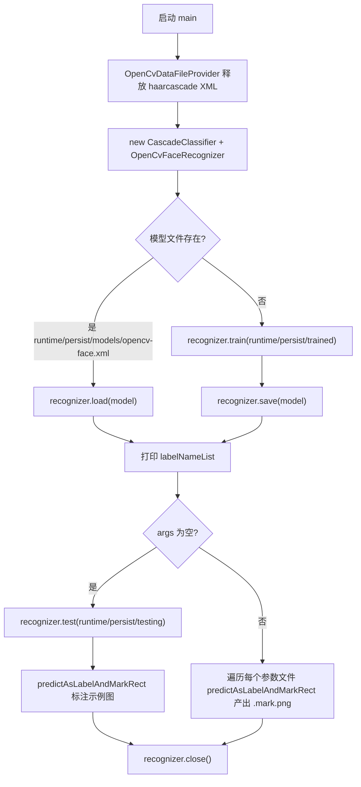

# i2f-tools-face-recognizer

> 人脸识别可执行工具壳：把 `i2f-extension-opencv-javacv` 的 `OpenCvFaceRecognizer`（JavaCV/OpenCV LBPH）以一个带 `main` 的示例程序打包成自包含 fat jar，演示「按目录约定训练 → 保存/载入模型 → 批量测试 → 预测并标注人脸框」的完整离线人脸识别流程。

## 模块路径

- `i2f-tools/i2f-tools-face-recognizer`

## 模块依赖

| 依赖 | Maven 坐标 | scope | optional | 说明 |
| --- | --- | --- | --- | --- |
| i2f-extension-opencv-javacv | `i2f.turbo:i2f-extension-opencv-javacv` | compile | 否 | 核心识别门面 `OpenCvFaceRecognizer` 所在模块，本工具唯一实质功能来源 |
| lombok | `org.projectlombok:lombok` | provided | 是 | 根 DM 治理；本模块源码零注解使用，属冗余依赖 |
| JavaCV | `org.bytedeco:javacv:1.5.9` | compile | 否 | 本地重新声明为 compile 以打入 OpenCV 运行时（排除 11 项无关组件） |
| JavaCV Platform | `org.bytedeco:javacv-platform:1.5.9` | compile | 否 | 携带各平台 OpenCV 原生库（排除 11 项无关 platform 组件） |

> 说明：`i2f-std-const`（`StdConst.RUNTIME_PERSIST_DIR`）与 `i2f-extension-opencv-data`（`OpenCvDataFileProvider`）经 `i2f-extension-opencv-javacv` 以 compile 传递获得，本模块 `import` 但未直接声明。

## 模块设计

- **纯工具壳（executable wrapper）**：模块无库型 API、无 SPI、无 Spring 自动配置，仅一个 `main` 类 `i2f.extension.opencv.javacv.test.TestOpenCvFaceRecognizer`，通过 `maven-assembly-plugin` 的 `jar-with-dependencies` 产出带 `Main-Class` 清单的可执行 fat jar（`main.class` 属性在 pom 中显式指定）。
- **本地依赖重声明**：上游 `i2f-extension-opencv-javacv` 将 `javacv`/`javacv-platform` 定为 `provided`（不传递、不打包），因此本壳在自身 pom 里把它们重新声明为 `compile`，并各自排除 ffmpeg、flycapture、libdc1394、libfreenect(2)、librealsense(2)、videoinput、artoolkitplus、tesseract、leptonica 等 11 项与人脸无关的原生组件，仅保留 OpenCV 线，使 fat jar 能真正自包含运行。
- **零自研逻辑**：`TestOpenCvFaceRecognizer` 与 `i2f-extension-opencv-javacv` 的 `src/test` 同名测试类逐行一致，是对识别器用法的一次「原样复制进 main 源集」的示例编排，训练/识别/预处理/模型三件套持久化全部委托给 `OpenCvFaceRecognizer`。
- **目录约定驱动**：运行不依赖任何配置文件，全部输入/输出走项目运行时目录约定 `./runtime/persist/`（`StdConst.RUNTIME_PERSIST_DIR = runtime/persist`）。

## 模块目的

- 为 `OpenCvFaceRecognizer` 提供一个**开箱即跑**的演示/验收入口，验证 JavaCV 人脸线在自包含 fat jar 下的完整链路。
- 把「训练数据目录结构、模型三件套、置信度过滤」等识别器的使用约定，固化为一份可直接 `java -jar` 运行的参考实现。

## 模块功能

- 从类路径释放并加载 frontalface Haar 级联（`haarcascades/haarcascade_frontalface_default.xml`）。
- 首次运行从 `./runtime/persist/trained`（子目录名即人脸标签）训练 LBPH 模型并保存；再次运行自动 `load` 已有模型。
- 无参模式：对 `./runtime/persist/testing` 批量跑 `test()` 打印判定明细，并对固定示例图做「预测 + 画框标注」。
- 有参模式：把每个命令行传入的图片文件作为待识别样本，`predictAsLabelAndMarkRect` 输出标签与人脸矩形，并在同目录生成 `<原名>.mark.png` 标注图。
- 产出模型三件套：`opencv-face.xml`（模型）+ `opencv-face.label.txt`（标签）+ `opencv-face.properties`（预处理参数）。

## 模块主要使用方法

1. **准备数据目录**（相对工作目录，非 jar 目录）：
   - `./runtime/persist/trained/<标签名>/*.png|jpg`：训练样本，每个子目录一个人物。
   - `./runtime/persist/testing/...`：批量测试样本（无参模式使用）。
2. **构建可执行 jar**：`mvn -pl i2f-tools/i2f-tools-face-recognizer package`，经 assembly 生成 `i2f-tools-face-recognizer.jar`（含 OpenCV 原生依赖）。
3. **运行**：
   - 训练+自检：`java -jar i2f-tools-face-recognizer.jar`（无参，读取 `trained`/`testing`）。
   - 预测外部图片：`java -jar i2f-tools-face-recognizer.jar a.jpg b.png`（逐参数识别并产出 `.mark.png`）。
4. **注意事项**：
   - 结果标签为 `null` 表示置信度未过阈值（`confidenceLimit<=40 且 >-0.5`）或图中未检出人脸。
   - 首次运行若无 `trained` 目录内容，`train()` 直接返回、模型为空，后续 `predict` 会因标签表越界而异常——必须先备齐训练样本。
   - 级联 XML 与原生库释放依赖 `runtime/persist/opencv` 目录约定，请勿与工作目录混淆。

## 配置项参考

本模块无 Spring 配置项、无外部 properties/yml，行为完全由以下**运行期约定**决定：

| 约定项 | 取值/路径 | 来源 |
| --- | --- | --- |
| 运行时持久目录 | `./runtime/persist` | `StdConst.RUNTIME_PERSIST_DIR` |
| 训练样本目录 | `./runtime/persist/trained` | main 硬编码 |
| 测试样本目录 | `./runtime/persist/testing` | main 硬编码 |
| 模型文件 | `./runtime/persist/models/opencv-face.xml` | main 硬编码 |
| 级联分类器 | `haarcascades/haarcascade_frontalface_default.xml` | classpath，opencv-data 释放 |
| 主类 | `i2f.extension.opencv.javacv.test.TestOpenCvFaceRecognizer` | pom `main.class` |

## 模块特性总结

- 全仓少见的**纯可执行工具壳**，与运行期 Starter、构建期 Maven 插件、IDE 插件并列，是 `i2f-tools` 组的「离线工具/示例」性质成员。
- 功能真实但不自研：识别算法、预处理、模型读写全部复用 `OpenCvFaceRecognizer`，本壳仅做流程编排与 `main` 入口。
- 通过本地 `compile` 重声明 + 大面积 `exclusions` 实现 OpenCV 原生运行时自包含，规避上游 `provided` 不传递的打包限制。
- 双运行模式（无参自检 / 有参预测）覆盖训练、测试、推理三类典型场景。
- 数据目录约定化，无配置中心、无 profile。

## 模块瑕疵或错误

- **游离于 Maven reactor**：`i2f-tools/pom.xml` 的 `<modules>` 中本模块被注释（`<!--<module>i2f-tools-face-recognizer</module>-->`），主构建不会编译打包它，需手动启用或单独构建，属「随附源码但不参与默认构建」的孤儿模块。
- **示例源与上游测试类完全重复**：`TestOpenCvFaceRecognizer` 与 `i2f-extension-opencv-javacv` 的 `src/test` 同名类逐行一致，两处维护、易漂移。
- **包名误导**：可执行工具的主类放在 `...javacv.test` 包内且置于 main 源集，`test` 命名与实际「生产可执行入口」不符。
- **硬编码示例路径缺乏守卫**：无参模式对 `./runtime/persist/testing/s7/4.pgm.verify.png` 的直接引用要求用户预先备好该具体文件，否则 `predictAsLabelAndMarkRect` 读取空图异常。
- **空训练集静默后越界**：`trained` 目录为空时 `train()` 直接 return，标签表为空，紧随其后的 `test()`/`predict` 会因 `labelNameList.get(-1)` 越界，主流程无提前校验提示。
- **依赖冗余/未声明**：`lombok` 引入但源码零使用；`StdConst`、`OpenCvDataFileProvider` 直接 `import` 却靠 `opencv-javacv` 传递获得而未显式声明，传递链变动即断。
- **exclusions 双份重复**：`javacv` 与 `javacv-platform` 各维护一份几乎相同的 11 项排除清单，冗长且需同步维护；上游 `provided` 语义一旦调整，本壳重声明的打包理由需重新核对。
- **fat jar 体积巨大**：`javacv-platform` 默认携带全平台（Win/Linux/mac × x86/x64/arm）原生库，产物体积可达数百 MB，未做平台裁剪。
- **无自动化测试**：模块无 `src/test`，`main` 方法本身即「手动验收」，无 JUnit 断言。
