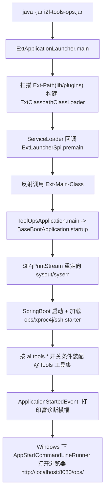

# i2f-tools-ops

> i2f 体系的**可部署运维控制台 / AI 工具宿主应用**：一个把「自定义类加载启动器 + SpringBoot 应用骨架 + 富诊断横幅 + 大量 AI 可调用工具（`@Tools`）+ 易经八字引擎 + 多数据库驱动 + 浏览器自动化 / MCP / 国密 / RAG / TTS」聚合进单一 tar.gz 发行包的成品级模块，通过 `plugins` 目录实现 starter 插件与资源的动态扩展，是整个 `i2f-tools` 组中唯一「独立打包、可直接 `java -jar`/外置容器运行的运维/桌面级应用」。

## 模块路径

- `i2f-tools/i2f-tools-ops`

## 模块依赖

> 本模块 pom **注释掉了 `<parent>`** 并自行声明 `groupId/artifactId/version=1.0-jdk8`，且**未列入** `i2f-tools/pom.xml` 的 `<modules>`，是一个完全游离于 Maven reactor 之外的独立构建件。内部依赖（compile）排在前面，三方依赖其后。

### 内部依赖（i2f）

| 依赖 | Maven 坐标 | scope | optional | 说明 |
| --- | --- | --- | --- | --- |
| i2f-launcher | `i2f.turbo:i2f-launcher` | compile | 否 | 提供 `ExtApplicationLauncher`（jar 的 `Main-Class`），实现两级启动与 `plugins` 动态类加载 |
| i2f-springboot-ops-starter | `i2f.turbo:i2f-springboot-ops-starter` | compile | 否 | ops 控制台核心 Starter：OpenAI/DashScope 对话、数据源、`TmpFileTools`、`OpsConsts.BASE_URL_PROPERTY` 等 |
| i2f-springboot-ssh-tunnel-starter | `i2f.turbo:i2f-springboot-ssh-tunnel-starter` | compile | 否 | SSH 隧道能力（`i2f.springboot.ssh.tunnel.*`），用于穿透到内网数据源 |
| i2f-springboot-xproc4j-starter | `i2f.turbo:i2f-springboot-xproc4j-starter` | compile | 否 | XProc4J 存储过程引擎装配（`xproc4j.*` 配置段来源） |
| i2f-springboot-ai-mcp-client | `i2f.turbo:i2f-springboot-ai-mcp-client` | compile | 否 | AI MCP 客户端能力（`ai.tools.mcp-gateway` 相关） |
| i2f-extension-browser-selenium | `i2f.turbo:i2f-extension-browser-selenium` | compile | 否 | Selenium 网页搜索/抓取封装（`SeleniumWebSearchTools` 依赖） |
| i2f-extension-browser-playwright | `i2f.turbo:i2f-extension-browser-playwright` | compile | 否 | Playwright 网页搜索/抓取封装（`PlaywrightWebSearchTools` 依赖） |
| lombok | `org.projectlombok:lombok` | provided | 是 | 由本模块自带 DM 治理，广泛用于 `@Data`/`@NoArgsConstructor` |

### 关键三方依赖（节选，均为 compile）

| 分组 | Maven 坐标 | 说明 |
| --- | --- | --- |
| SpringBoot | `spring-boot-starter` / `-web` / `-jdbc` | Web 控制台 + JDBC；版本由 `spring-boot-dependencies:2.7.18` BOM 统管 |
| Spring 体系 BOM | `spring-cloud-dependencies:2021.0.8`、`spring-cloud-alibaba:2021.0.5.0` | import 型 DM |
| JDBC 驱动 | mysql-connector-j、ojdbc8+orai18n、postgresql、h2、sqlite-jdbc、DmJdbcDriver18（达梦）、kingbase8、mssql-jdbc、oceanbase-client | 一次性内置 9 种主流/国产库驱动，供 ops 数据源面板任意连接 |
| JDBC 驱动(system) | `com.gbase:gbase-connector-java:8.3.81.53`（`system` scope，`systemPath=./lib/gbase-...-bin.jar`） | 南大通用 GBase 无法从中央仓库拉取，改为本地 lib jar + `additional.classpath` 注入 |
| 数据源/缓存 | `dynamic-datasource-spring-boot-starter:3.5.2`、`redisson-spring-boot-starter:3.20.1`（排除 `redisson-spring-data-30`，另引 `redisson-spring-data-27`） | 多数据源 + Redis；spring-data 版本回退以适配 Boot 2.7 |
| 脚本/表达式 | `groovy:4.0.18`、`ognl:3.4.11`、`antlr4-runtime:4.13.2`、`velocity-engine-core:2.3` | 支撑 xproc4j 语言与 `MathTools`（Funic 沙箱求值） |
| 国密 | `com.antherd:sm-crypto:0.3.2.1-RELEASE` + `org.openjdk.nashorn:nashorn-core:15.4` | Nashorn 执行内嵌 JS 实现 SM2/3/4 |
| 浏览器自动化 | `selenium-java`（经 `selenium-bom:4.45.0` 强制覆盖 Boot 默认 4.1.4）、`playwright:1.58.0` | Web 搜索/抓取工具运行底座 |
| 对象存储 | `io.minio:8.6.0`、`software.amazon.awssdk:{s3,kms,s3control}`（`bom:2.17.100`） | 文件/存储能力 |
| 其它 | `jsqlparser:4.9`（jdk8 末版）、`cn.6tail:lunar:1.3.14`（农历/干支）、`pdfbox:2.0.29`、`Java-WebSocket:1.5.3`、`solon-ai-mcp:3.9.6`、`reactor-core:3.6.9` | 分别服务 SQL 解析、`yi` 八字引擎、PDF、WS 客户端、MCP、响应式 |

## 模块设计

### 1. 两级启动：ExtApplicationLauncher → 真实 SpringBoot Main

jar 的清单把「启动入口」与「应用入口」拆开：

- `Main-Class = i2f.launcher.ExtApplicationLauncher`（来自 `i2f-launcher`）
- `Ext-Main-Class = i2f.tools.ToolOpsApplication`
- `Ext-Path = plugins`，`Class-Path = . ./resources/ <additional.classpath>`

`ExtApplicationLauncher` 先扫描 `Ext-Path`（默认 `lib,libs,plugin,plugins,...` + 本 jar 的 `plugins`）目录，递归收集目录/`.jar`（并解析 jar 内嵌 jar 的 `jar:file!entry` URL），构建 `ExtClasspathClassLoader` 设为线程上下文类加载器；再通过 `ServiceLoader<ExtLauncherSpi>` 回调各插件的 `premain`，最后反射调用 `Ext-Main-Class.main`。由此实现「把自有 starter 丢进 `plugins/` 即可被加载、且可覆盖默认 classpath 资源」的扩展模型（与本模块 `readme.md` 描述一致）。

### 2. 应用骨架：BaseBootApplication / WarBootApplication

- `ToolOpsApplication`（`@SpringBootApplication`）继承 `WarBootApplication`（继承 `SpringBootServletInitializer` 并重写 `configure`），因此**既能 fat jar 自启，也能塞进 war 部署到外置容器**。
- `BaseBootApplication.startup` 在启动前后做 `Slf4jPrintStream.redirectSysoutSyserr()`，并注册 `ApplicationStartedEvent` 监听器 `getStartedListener`，用 `RUN_BANNER` 保证横幅只打印一次。
- `getBootstrapBanner` 组装一段极详尽的诊断信息：PID/用户、Spring & SpringBoot 版本、uptime、debug/agent/noverify 运行标志、web 类型、本机+各网卡（ipv4/ipv6）访问 URL、类加载器链、GC 计数、`ServiceLoader` 枚举出的**全部 JDBC 驱动 / JCE Provider / IIO Provider**、内存与环境信息。这是「运维自检」的核心卖点。
- `SpringBootPrintBannerAutoConfiguration` 另以 `@Bean` 形式注册同一监听器，覆盖 war 场景下无 `startup` 显式调用的路径。

### 3. AI 可调用工具层（`i2f.tools.tools`）

每个工具类统一形态：`@Component` + `@Tools`（类级标签）+ `@ToolIntent`（意图声明）+ `@ConditionalOnExpression("${ai.tools.xxx.enable:...}")`（开关），方法上 `@Tool`/`@ToolParam`，`@Tool` 的 `tags` 用 `AiTags` 决定是否自动放行（`AUTO_VALUE` 自动 / `SENSIBLE_VALUE` 需授权弹窗等）。本模块自带工具：

| 工具类 | 开关（默认） | 能力 | 额外条件 |
| --- | --- | --- | --- |
| `GanZhiTools` | `i2f.tools.gan-zhi.enable:true` | 公历→干支四柱 | — |
| `BaZiTools` | `ai.tools.ba-zi.enable:true` | 八字排盘（五行/十神/命宫/身宫/胎元），依赖 `yi.BaZi` | — |
| `MathTools` | `ai.tools.math.enable:true` | 基于 Funic 沙箱解析器的数学/逻辑表达式批量求值 | `SandboxFunicResolver` |
| `FormTools` | `ai.tools.form.enable:false` | 单选/多选弹窗交互 | Windows 条件 |
| `RobotTools` | `ai.tools.robot.enable:false` | 屏幕抓取（确认后倒计时截图并经 `TmpFileTools` 上传） | Windows 条件 |
| `PandocTools` | `ai.tools.pandoc.enable:false` | 文档格式转换 | — |
| `SeleniumWebSearchTools` | `ai.tools.selenium-web-search.enable:false` | 百度/开发百度/必应搜索 + 网页抓取 | Windows 且 classpath 有 `org.openqa.selenium.WebDriver` |
| `PlaywrightWebSearchTools` | `ai.tools.playwright-web-search.enable:false` | 同上，Playwright 实现 | — |

> `application.yml` 里还有 `command/powershell/groovy/python/nodejs/dashscope-t2i/kling/vidu/*-t2v` 等大量 `ai.tools.*` 开关，其对应实现类由 `i2f-springboot-ops-starter` 等外部模块提供，本模块仅负责「开关装配 + 聚合依赖」。

### 4. 易经引擎（`i2f.tools.yi`）

`Yi`（817 行）、`BaZi`、`GanZhiDate` 构成自包含的干支/节气/八字命理算法，底层借 `cn.6tail:lunar` 农历库，供上述 `GanZhiTools`/`BaZiTools` 调用。注意 `TestBaZi`、`TestGanZhiDate` 位于 `src/main/java`（非 test 源集）。

### 5. 日志重定向（`i2f.tools.slf4j`）

`Slf4jPrintStream` 把 `System.out/err` 代理为 slf4j（out→INFO、err→ERROR），支持可选调用点定位（`useTrace`，回溯栈找真实调用者）、`byte[]` 的 UTF-8/GBK 兜底解码、`ThreadLocal<LoggerProxyConsumer>` 钩子；`PerfLogger` 以 lambda/`Supplier` + 级别预检避免日志级别关闭时的字符串拼接开销。二者为本模块内的副本实现。

### 6. 打包：配置分离 + 全量/增量双包

- `maven-jar-plugin` 通过一大段 `<excludes>`（`*.properties/*.yml/*.xml/logback/**/META-INF/**/static/templates/...`）把配置与静态资源**从可执行 jar 中剥离**（分离配置第一步）。
- `maven-assembly-plugin` 两个 `execution`：`make-all`（`assembly.xml`：`tar.gz` 全量发行包 = `lib/` 依赖 + bin 脚本 + `skills/` + `resources/` 外置配置 + 主 jar，`includeBaseDirectory=true`）与 `make-upgrade`（`assembly-upgrade.xml`：仅升级件）。
- `<additional.classpath>` 把 system scope 的 GBase jar 写进清单 `Class-Path`。

## 模块目的

- 提供一个**开箱即用、可扩展的本地/桌面运维控制台**，把 i2f 的 AI 对话、数据源连接、存储过程、浏览器自动化、国密、RAG/TTS 等能力收拢到单一可分发的 tar.gz。
- 用 `plugins` 外置目录 + 两级启动器，让「加一个 starter jar 就多一个 AI 工具 / 覆盖一份资源」成为无需重新打包的运行时扩展。
- 以诊断横幅集中暴露 JVM/JDBC/JCE/网络/GC 等运行时事实，降低现场排障门槛。

## 模块功能

- 双形态启动：fat jar 自启（`ExtApplicationLauncher`）或 war 外置容器（`SpringBootServletInitializer`）。
- 控制台访问：`http://localhost:8080/ops/`，Windows 启动后自动拉起浏览器。
- 多数据源：内置 9+ JDBC 驱动，配合 `dynamic-datasource` 与 `ssh-tunnel` 连接主从/内网库；ops 面板可配 `i2f.springboot.ops.datasource.datasourceMap`。
- AI 工具：干支/八字排盘、Funic 数学求值、表单弹窗、屏幕抓取、Pandoc 转换、Selenium/Playwright 网页搜索抓取等，按开关条件注册并可被 LLM 调用。
- 扩展点：`plugins/` 放自有 starter（经 `spring.factories`/`AutoConfiguration.imports` 注册）即被加载；`skills/` 放 AI 技能文档；`plugins/static/ops/open-ai/role-config.json` 拓展角色设定。
- 通信安全：`i2f.springboot.ops.secure.cert` 未配置时启动自动生成证书对（见运行日志）。

## 模块主要使用方法

1. **构建**（独立构建，root reactor 不含它）：进入本模块目录 `mvn package`，得 `i2f-tools-ops.jar` 与 `tar.gz` 全量包；GBase 需保证 `lib/gbase-connector-java-8.3.81.53-build55.2.1-bin.jar` 存在。
2. **运行**：解压 tar.gz，双击 `startup.bat`（或 `java -jar`），完成后自动开浏览器；未自动打开则手动访问 `http://localhost:8080/ops/`。
3. **扩展 AI 工具**：写 `@Tools/@Tool` 类 → 打成 starter → 放入 `plugins/`，并在其 `META-INF/spring.factories` 与 `AutoConfiguration.imports` 注册。
4. **注意事项**：
   - 多数敏感工具（robot/form/selenium/pandoc…）默认 `enable:false` 且部分**仅 Windows**生效；开启前确认 OS 与依赖类在位。
   - 数据源/Redis 在 `application-dev.yml` 中以 `spring.autoconfigure.exclude` 默认排除，需去掉对应排除项并填真实连接才启用。
   - 工具 `@Tool` 的 `tags` 决定调用是否需用户授权弹窗（`AUTO_VALUE` 免授权，其余会弹窗确认）。

## 配置项参考（节选）

| 配置 | 含义 | 默认 |
| --- | --- | --- |
| `server.port` / `server.servlet.context-path` | 端口 / 上下文（`/ops`） | 8080 |
| `spring.profiles.active` | 激活 profile | `dev` |
| `i2f.springboot.ops.open-ai.enable` / `dashscope.enable` | ops 对话提供方开关 | true |
| `i2f.springboot.ops.secure.cert` | 通信证书（空则自动生成） | 注释 |
| `i2f.springboot.ops.datasource.datasourceMap` | ops 允许连接的数据源 | 注释示例 |
| `i2f.springboot.ssh.tunnel.enable` / `servers` | SSH 隧道 | 注释示例 |
| `ai.tools.*.enable` | 各 AI 工具总开关（见上表） | 混合 |
| `ai.tools.file.root-path` | 文件工具可访问根目录（越界即拒） | `./ai-root` |
| `xproc4j.xml-locations` / `watching-directories` | 存储过程 XML 扫描/热更目录 | classpath 模式 |
| `ai.rags.*` / `ai.tts.qwen.*` | RAG 向量与 TTS 参数 | 默认关闭 |

## 模块特性总结

- 全仓 `i2f-tools` 组**唯一成品级可部署应用**，依赖面最宽（聚合 30+ 三方 + 7 内部 compile）。
- **两级启动 + `plugins` 动态类加载**：入口与真实 main 解耦，支持运行时插件与资源覆盖。
- **jar/war 双形态**、Windows 自动开浏览器、**超详尽启动诊断横幅**。
- **AI 工具条件装配**范式统一（`@Tools`+`@ConditionalOnExpression`+`AiTags` 授权标签），敏感能力默认关闭。
- 内置**跨库驱动矩阵**（含达梦/人大金仓/GBase/OceanBase 等国产库）与**国密**支持。
- 配置分离打包 + 全量/升级双 assembly，面向离线现场分发。

## 模块瑕疵或错误

> 仅静态识别，未实证。

- **游离于 reactor**：pom 注释掉 `<parent>` 且未列入 `i2f-tools` 的 `<modules>`，root `mvn install` 不会构建它，需单独进目录构建；自带描述属性 `root.maven.version=1.0` 与实际 `version=1.0-jdk8` 不一致。
- **`maven-compiler-plugin` 配 `<skip>true</skip>`**：模块编译插件显式跳过，对含 21 个主源文件的 jar 属异常配置，实际依赖外部/父级编译机制，易致「本地 clean 后无法编译」的困惑。
- **【潜在 NPE】诊断横幅 `CompilationMXBean` 判空错位**：`CompilationMXBean compilationMXBean = getCompilationMXBean(); if (classLoadingMXBean != null)` —— 守卫检查的是 `classLoadingMXBean` 而非 `compilationMXBean`；当某 JVM 的 `getCompilationMXBean()` 返回 `null` 而 classLoading 非 null 时，`compilationMXBean.getName()` 抛 NPE。
- **【逻辑反了】web 类型强制 NONE**：`startup` 中 `if (webType != null) { builder.web(WebApplicationType.NONE); }` —— 调用方显式传入非 NONE（如 SERVLET）反而被强制成 `NONE` 关闭 Web，语义与直觉相反（当前默认走 `webType==null` 分支才掩盖）。
- **测试类混入 main 源集**：`i2f.tools.yi.TestBaZi`、`TestGanZhiDate` 位于 `src/main/java`，会被打进产物 jar，命名与位置误导。
- **运行期二进制入库**：模块目录内提交了 `runtime/persist/sqlite-vec/*.db`、`vec0.dll`、`runtime/tmp/tts_audio/*.mp3`、`lib/NativesEasyX.dll`、`ai-root/jarctrl.sh`、`rags_history/history-*/…**` 等运行/历史产物与大文件，属仓库污染且随打包漂移。
- **system scope + 硬编码 jar 名**：GBase 依赖用 `system` scope 绑死 `lib/gbase-connector-java-...-bin.jar`，并经 `additional.classpath` 写进清单 `Class-Path`；jar 缺失则打包/classpath 悬空，跨机不可移植。
- **代码副本重复**：`Slf4jPrintStream`/`PerfLogger`/`BaseBootApplication`/`WarBootApplication` 等启动与日志基建在本模块内自成一份，与 `i2f-launcher`/公共模块概念重叠，存在多处漂移风险。
- **`<resources>` include 冗余**：`src/main/java` 资源 include 列表中 `**/*.xml`、`**/*.json` 重复声明；无功能影响但显杂乱。
- **`xproc4j.watching-directories` 用 `classpath*:` 前缀**：文件热更监听目录通常应为文件系统路径，`classpath*:` 形式大概率无实际监听效果。
- **默认全排除数据源/Redis**：`application-dev.yml` 把 `DataSourceAutoConfiguration`/`Redis`/`DynamicDataSource` 全 `exclude`，直连用户上手需先改排除项，易踩「配了数据源却不生效」。
- **fat 依赖体积巨大**：`javacv` 之外再叠 selenium/playwright/awssdk/redisson/多数据库驱动，全量包体积与启动装配开销显著，且未见按平台裁剪。
